.. index:: install
.. _Advanced Installation Topics:

Advanced Installation Topics
****************************

This section covers the following advanced installation topics:

* :ref:`Using the Text Installer`

* :ref:`Install a Server`

* :ref:`Using the TrueOS® CD`

* :ref:`Dual Booting`

* :ref:`Creating an Automated Installation`

If your intent is to install a graphical desktop using a graphical
installer, instead refer to :ref:`Installing TrueOS®`.

.. index:: install
.. _Using the Text Installer:

Using the Text Installer
========================

If an **ncurses** menu installation is preferred over a full graphical
installer, start the installation as usual and select
:guilabel:`install` from :numref:`install15repro`.

.. _install15repro:

.. figure:: images/install15.png
   :scale: 100%

   : |trueos| Installation Menu

The next screen will prompt to install a desktop or a server, as seen
in :numref:`Figure %s <text2>`.

.. _text2:

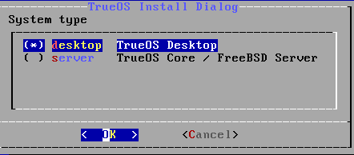

   : Desktop or Server

After choosing to install a desktop, the |lumina| desktop will be
installed and configured. After the desktop installation is complete,
the system will boot into the usual post-installation configuration
screens.

If a server installation is chosen, neither **X** nor a window manager
will be installed, resulting in a command-line only |trueos|
installation. Once the server installation is complete, the system will
boot into a command prompt where the username and password created
during the installation will need to be entered.

After making a selection and pressing :kbd:`Enter`, the next screen will
display the available disks on the system. In the example shown in
:numref:`Figure %s <text3>`, one disk is available.

.. _text3:

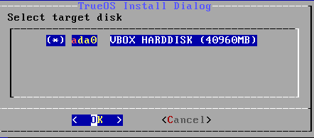

   : Installation Disk

Select the disk to install into and press :kbd:`Enter`. In the next
screen, the installer will display all available primary or GPT
partitions. In the example shown in :numref:`Figure %s <text4>`, there
is only one partition and the installer has selected the default of
installing to the entire disk.

.. warning:: If the system has multiple partitions and disks, be
   careful in selecting the disk and partition targets for installation.

.. _text4:

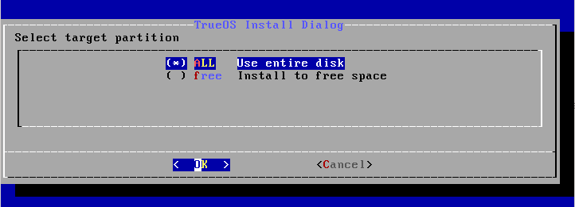

   : Partition

The next screen, shown in :numref:`Figure %s <text5>`, is used to
select the type of disk format. If the installation disk or partition is
larger than 2 TB, :guilabel:`GPT` **must** be selected. Otherwise,
selecting :guilabel:`GPT` should work for most modern hardware. When
installing on older hardware, or if the newly installed system will not
boot after selecting :guilabel:`GPT`, select :guilabel:`MBR` instead.

.. _text5:

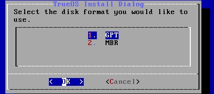

   : Disk Format

The next screen, shown in :numref:`Figure %s <text6>`, is used to
select the boot manager.

.. _text6:

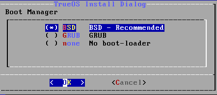

   : Boot Manager

The default is to use :guilabel:`BSD` as it provides native support for
boot environments. While :guilabel:`GRUB` provides some boot environment
support, it may not be as up-to-date as the BSD support. It is
recommended to only select :guilabel:`GRUB` if dual booting and the BSD
boot manager does not find the other operating systems. If
:guilabel:`none` is selected, no boot manager will be installed and boot
environments will not be available.

The next screen is shown in :numref:`Figure %s <text7>`.

.. _text7:

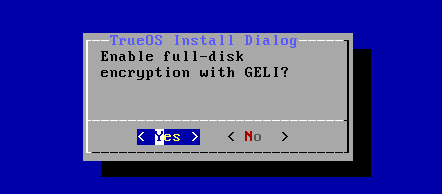

   : Full Disk Encryption

This screen provides the option to encrypt the selected disk(s) with
the FreeBSD
`GELI <https://www.freebsd.org/cgi/man.cgi?query=geli&sektion=8&manpath=FreeBSD>`_
framework. If the default of :guilabel:`Yes` is kept, press
:kbd:`Enter` and the system will prompt for a passphrase. This
passphrase will be required whenever booting into |trueos|. This means
if someone else boots into the computer, they will not be able to boot
into |trueos| if they do not know the passphrase.

.. danger:: If the passphrase is lost or forgotten, no one will be able
  to access |trueos| on the system.

For these reasons, it is important to choose a good passphrase other
users will not guess and which the user can remember. Passphrases
are case-sensitive and can contain spaces. The passphrase should be
memorable to the user, such as a line from a song or piece of
literature, but hard to guess so people who know the user can not guess
the passphrase.

.. warning:: Be careful if the keyboard variant and layout are changed.
   The GELI encryption framework only supports QWERTY passphrases, so do
   not use any characters not found on a QWERTY keyboard in the
   passphrase. **DO NOT** set a passphrase with accents or special
   characters which are not found on a US keyboard. This is a limitation
   in FreeBSD as the keymap is not loaded until after the passphrase is
   entered, meaning such a passphrase will render the encrypted disks
   inaccessible.

If server installation is chosen in the screen shown in
:ref:`Select Desktop or Server <text2>`, the installer will provide
more menus. These will prompt for additional information:

* The *root* password.

* Confirm the *root* password (enter the same value).

* The username to use when logging into the server (*root* logins
  are discouraged).

* The password to use when logging into the server.

* Confirm the password to use when logging into the server.

* The real name for the user who logs into the server (can contain
  spaces).

* The default shell for the user's login.

* The hostname for the server.

* Whether or not to enable networking. Select :guilabel:`Yes`, to either
  select :guilabel:`auto` to enable *DHCP* on all interfaces or select
  an interface to statically configure. When selecting an interface,
  the system will prompt to enter the IP address, subnet mask, IP
  address of the DNS server, and the IP address of the default gateway.

* Whether or not to enable SSH access to the server.

The next screen, for both a desktop and server installation, is shown
in :numref:`Figure %s <text9>`.

.. _text9:

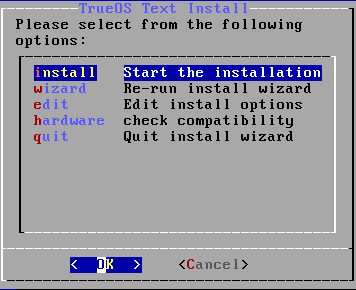

   : Review Installation Options

This menu provides several options:

* **install:** To start the installation, select this option and press
  :kbd:`Enter`.

* **wizard:** Select this option to re-run the text installer and
  re-input any selections.

* **edit:** Use this option to review, and possibly change, any of the
  installation parameters.

* **hardware:** Select this option to display a summary of the system's
  hardware. The example shown in :numref:`Figure %s <text10>` is from a
  system with a disabled sound card and no wireless card.

* **quit:** Select this option to return to the screen shown in
  :ref:`TrueOS® Installation Menu <install1>`.

.. _text10:

.. figure:: images/text10.png
   :scale: 100%

   : Hardware Summary

If select :guilabel:`edit`, the menu shown in
:numref:`Figure %s <text11>` will open.

.. _text11:

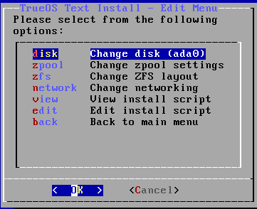

   : Edit Menu

This screen contains several options:

* **disk:** Used to change the disk to install into. Selecting this
  option will re-open the screens shown in
  :ref:`Select Installation Disk <text3>` through
  :ref:`Full Disk Encryption <text7>`, and then return to this menu.
  If you want to install into a mirrored or RAIDZ pool, select one of the
  targets using this option, and then select **pool** (see below).

* **pool:** Select this option if the system contains multiple
  disks and changing the disk layout to a mirror or RAIDZ is desired.
  The allowable layouts for the number of available disks will be
  displayed so the user can select the desired layout.

* **datasets:** Used to modify the default ZFS dataset layout. Selecting
  this option will open the screen shown in
  :numref:`Figure %s <text12>`.

  .. _text12:

  .. figure:: images/text12a.png
     :scale: 100%

     : ZFS Layout

  To edit the properties of an existing dataset, highlight the dataset's
  name and press :kbd:`Enter`. This will show the list of available ZFS
  properties for that dataset, as seen in the example shown in
  :numref:`Figure %s <text13>`:

  .. _text13:

  .. figure:: images/text13a.png
     :scale: 100%

     : ZFS Properties for a Dataset

  To change the value of a ZFS property, highlight it and press
  :kbd:`Enter`. The available values will vary, depending upon the
  selected property. To add additional datasets, select :guilabel:`add`.
  This will prompt for the full path of the mountpoint to create. For
  example, a dataset named :file:`/usr/shares` can be created. The
  dataset created will be added to the bottom of the list. If the
  dataset is selected, press :kbd:`Enter` to set its ZFS properties.
  Once finished customizing the ZFS layout, select :guilabel:`done`.

.. warning:: While a dataset can be deleted, the default datasets are
   needed for boot environments. For this reason, it is **not**
   recommended to delete any default datasets. ZFS options are described
   in `zfs(8) <http://www.freebsd.org/cgi/man.cgi?query=zfs>`_, but any
   options should only be changed by experienced users.

* **network:** Used to configure networking. Selecting this option
  will first prompt to enter a hostname, then select either automatic
  DHCP configuration on all interfaces or to specify the interface to
  configure, and finally whether or not to enable SSH.

* **view:** Select this option to view a read-only copy of the ASCII
  text file containing the configuration script.

* **edit:** Select this option to open the configuration script in the
  :command:`ee` editor, allowing for changes. The parameters supported
  by the installation script are described in
  :ref:`Creating an Automated Installation`.

* **back:** Select this option to return to the menu shown in
  :ref:`Review Installation Options <text9>`.

.. index:: install
.. _Using the System Utilities Menu:

Using the System Utilities Menu
-------------------------------

The text installer contains some handy tools for troubleshooting and
fixing an existing |trueos| installation.

Choose the :guilabel:`utility` option in the main menu of the graphical
or text based installer shown in
:ref:`TrueOS® Installation Menu <install15>` to open the screen shown
in :numref:`Figure %s <util1>`.

.. _util1:

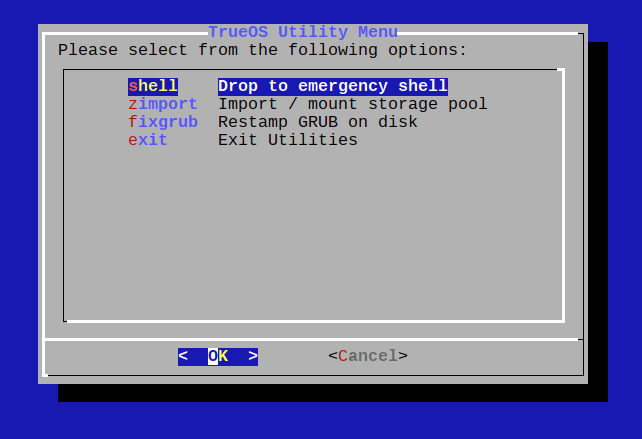

   : System Utilities Menu

This screen provides several options:

* **shell:** This option is useful when troubleshooting a |trueos|
  system that no longer boots. It will open a shell with administrative
  access, including the base FreeBSD utilities. Advanced users can use
  this shell to identify a problem, create a backup of or copy essential
  files to another system, or edit configuration files with an editor
  such as `ee <https://www.freebsd.org/cgi/man.cgi?query=ee>`_ or
  :command:`vi`. When finished using the shell, type :command:`exit` to
  return to the screen shown in
  :ref:`System Utilities Menu <util1>`.

* **zimport** This option will display the names of available ZFS pools.
  Type the name of an available pool and it will import the pool then
  display the available boot environments (BEs). Type the name of the
  desired BE and this option will mount the BE then offer to open a
  chroot shell so its contents can be viewed and manipulated as needed
  in order to perform maintenance on the boot environment. When
  finished, type :command:`exit` to leave the boot environment and
  return to the screen shown in :ref:`System Utilities Menu <util1>`.

* **fixgrub:** This option can be used to restamp the GRUB boot loader
  should the installed system no longer boot from GRUB. When this option
  is selected, it will first show the available ZFS pools and prompt for
  the name of the pool to import.

.. note:: The :command:`fixgrub` action will fail on systems using the
   default BSD boot loader.

* **exit:** This option will return to the main
  :ref:`TrueOS® Installation Menu <install1>`.

.. index:: install
.. _Install a Server:

Install a Server
================

The :ref:`System Selection Screen` of the |trueos| installer can be
used to install a FreeBSD-based command-line server operating system
rather than a graphical desktop operating system. A |trueos|
installation includes the `SysAdm™ API <https://api.sysadm.us/>`_ and
:ref:`SysAdm™ Client` for managing the server locally or remotely.

For a server installation, using the |trueos| installer rather than the
FreeBSD installer offers several benefits:

* The ability to easily configure ZFS during installation.

* The ability to configure multiple boot environments.

* A wizard (described in this section) is provided during installation
  to configure the server for first use.

.. note:: This section describes how to install a command-line only
   server using the graphical installer. Alternately, a server can be
   installed :ref:`Using the TrueOS® CD` or
   :ref:`Using the Text Installer`.

To perform a graphical server installation, start the |trueos|
installation as usual. At the :ref:`System Selection Screen` of the
installer, select :guilabel:`TrueOS Server (console interface only)`.

Click :guilabel:`Next` to start the :guilabel:`Server Setup Wizard`,
then click :guilabel:`Next` again to see the screen shown in
:numref:`Figure %s <server2>`.

.. _server2:

.. figure:: images/server2a.png
   :scale: 100%

   : Root Password Creation

Input and confirm the root password then click :guilabel:`Next` to
proceed to the screen shown in :numref:`Figure %s <server3>`.

.. _server3:

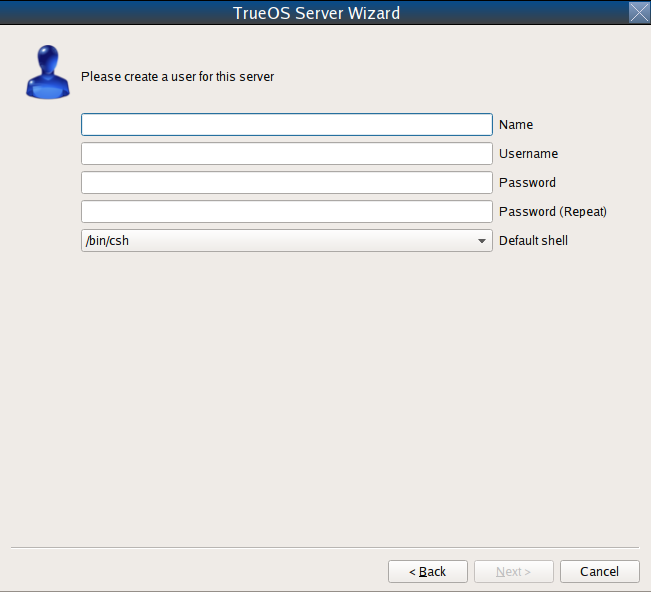

   : Primary User Account Creation

For security reasons, do not login as the *root* user. The wizard
requires creating a primary user account used to login to the server.
This account will automatically be added to the *wheel* group, allowing
the user to :command:`su` to the *root* account when administrative
access is required.

Create an account by filling in the fields:

* **Name:** Can contain capital letters and spaces.

* **Username:** The name used when logging in. Can not contain spaces
  and is case sensitive (e.g. *Kris* is a different username than
  *kris*).

* **Password:** The password used when logging in. Type it twice in
  order to confirm it.
  
* **Default shell:** Use the drop-down menu to select the **csh**,
  **tcsh**, **sh**, or **bash** login shell.

When finished, click :guilabel:`Next` to proceed to the screen shown in
:numref:`Figure %s <server4>`.

.. _server4:

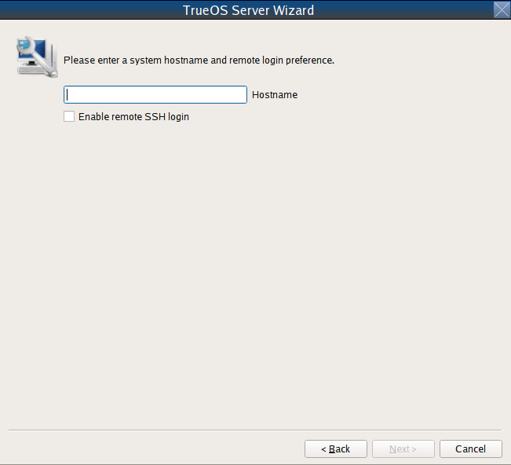

   : Hostname Creation

Input the system's hostname. If using :command:`ssh` to connect to the
system, check :guilabel:`Enable remote SSH login`. Click
:guilabel:`Next` to proceed to the network configuration screen shown in
:numref:`Figure %s <server5>`.

.. _server5:

.. figure:: images/server5a.png
   :scale: 100%

   : Network Configuration

Use the :guilabel:`Network Interface` drop-down menu to choose the
desired interface:

* **AUTO-DHCP-SLAAC:** (default) Will configure every active interface
  for DHCP and for both IPv4 and IPv6.

* **AUTO-DHCP:** Will configure every active interface for DHCP and
  for IPv4.

* **IPv6-SLAAC:** Will configure every active interface for DHCP and
  for IPv6.

Alternately, use the drop-down menu to select the device name for the
interface and manually configure and input the IPv4 and/or IPv6
addressing information. When finished, click :guilabel:`Next` to access
the screen shown in :numref:`Figure %s <server6>`.

.. _server6:

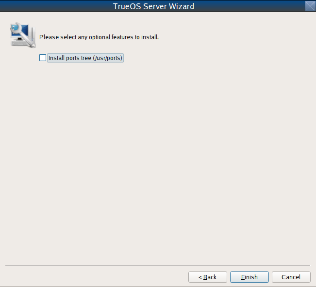

   : Ports Installation

To install the FreeBSD ports collection, check
:guilabel:`Install ports tree` then click :guilabel:`Finish` to exit the
wizard and access the summary screen shown in
:ref:`Disk Selection Screen`.

Click :guilabel:`Customize` to configure the system's disk(s).

To save the finished configuration for re-use at a later time, insert a
FAT-formatted USB stick and click :guilabel:`Save Config to USB`.

Once ready to start the installation, click :guilabel:`Next`. A pop-up
menu will ask to start the installation immediately.

Once the system is installed, it will boot to a command-line login
prompt. Login using the primary user account configured during
installation. Now the server can be configured like any other FreeBSD
server installation. The
`FreeBSD Handbook <http://www.freebsd.org/doc/en_US.ISO8859-1/books/handbook/>`_
is an excellent reference for performing common FreeBSD server tasks.

.. index:: install
.. _Using the TrueOS® CD:

Using the TrueOS® CD
====================

The CD-sized |trueos| ISO provides an *ncurses* installer for installing
a command-line version of |trueos|. If the intent is to only install
servers and a graphical installer is unnecessary, this ISO is convenient
to use and quick to download. The |trueos| CD can also be used to repair
an existing installation, using the instructions in
:ref:`Using the System Utilities Menu`.

To start a server installation using the |trueos| ISO, insert the
prepared boot media. Once the system has finished booting into the
installer, it will display the installation menu shown in
:numref:`Figure %s <cd2>`.

.. _cd2:

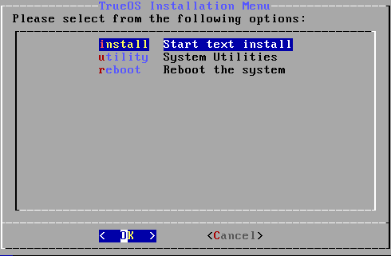

   : |trueos| Installation Menu

To begin the installation, press :kbd:`Enter`. The server installation
will then display the screen shown in
:ref:`Select Installation Disk <text3>` and proceed as
described in :ref:`Using the Text Installer`.

.. index:: dualboot

.. _Dual Booting:

Dual Booting
============

A |trueos| installation assumes there is an existing GPT or primary
partition to install into. If the computer has only one disk and
|trueos| will be the only operating system, it is fine to accept the
default partitioning scheme. However, if |trueos| will be sharing space
with other operating systems, ensure |trueos| is installed into the
correct partition or an existing operating system may be inadvertently
overwritten.

There are several required elements to install multiple operating
systems on the computer:

* A partition for each operating system. Many operating systems,
  including |trueos|, can only be installed into a primary or GPT
  partition. This means partitioning software is required, as described
  in :ref:`Creating Free Space`.

* A backup of any existing data. This backup should not be stored on
  the computer's hard drive but on another computer, removable media
  such as a USB drive, or burnt onto a DVD media. While most
  installations will progress smoothly, it is always recommended to have
  a backup prepared in case of the unexpected.

When installing |trueos| onto a computer that is to contain multiple
operating systems, care must be taken to select the **correct**
partition in the :ref:`Disk Selection Screen`. On a system containing
multiple partitions, each partition will be listed.

.. danger:: Be sure to avoid selecting a partition containing a needed
   operating system or data.

Highlight the desired partition and click :guilabel:`Customize`.

.. warning:: Be sure to click :guilabel:`Customize` while in the
   :ref:`Disk Selection Screen`. Clicking :guilabel:`Next` without
   customizing the disk layout will result in the installer will
   overwrite the contents of the primary disk.

In |trueos|, the BSD boot loader is the preferred and default boot
loader, as it provides native support for ZFS boot environments. If the
default changed during installation, the installer will use a customized
version of the GRUB boot loader which provides limited ZFS boot
environment support.

The |trueos| version of GRUB will attempt to identify other installed
operating systems, such as Windows and Linux, and add them to the GRUB
boot menu. If an operating system is not automatically detected,
an entry can be manually added to
:file:`/usr/local/etc/grub.d/40_custom.dist`. For more information on
the syntax used, refer to the
`GRUB Manual <http://www.gnu.org/software/grub/manual/grub.html>`_.

.. index:: install
.. _Creating an Automated Installation:

Creating an Automated Installation
==================================

|trueos| provides a set of Bourne shell scripts which allow advanced
users to create automatic or customized |trueos| installations.
:command:`pc-sysinstall` is the name of the master script. The script
reads a customizable configuration file and uses dozens of backend
scripts to perform the installation. Read more about this utility by
typing :command:`man pc-sysinstall`.

Here is a quick overview of the components used by
:command:`pc-sysinstall`:

* :file:`/usr/local/share/pc-sysinstall/backend/` contains the scripts
  used by the |trueos| installer. Scripts have been divided by function,
  such as :file:`functions-bsdlabel.sh` and
  :file:`functions-installcomponents.sh`. To learn more about how the
  |trueos| installer works, read through these scripts. This directory
  also contains the :file:`parseconfig.sh` and
  :file:`startautoinstall.sh` scripts which :command:`pc-sysinstall`
  uses to parse the configuration file and begin the installation.

* :file:`/usr/local/share/pc-sysinstall/backend-query/` contains the
  scripts used by the installer to detect and configure hardware.

* :file:`/usr/local/share/pc-sysinstall/conf/` contains the
  configuration file :file:`pc-sysinstall.conf`. It also contains a
  file indicating which localizations are available
  (:file:`avail-langs`), an :file:`exclude-from-upgrade` file, and a
  :file:`licenses/` subdirectory containing text files of applicable
  licenses.

* :file:`/usr/local/share/pc-sysinstall/doc/` contains the help text
  seen if :command:`pc-sysinstall` is run without any arguments.

* :file:`/usr/local/share/pc-sysinstall/examples/` contains several
  example configuration files for different scenarios (e.g.
  :file:`upgrade` and :file:`fbsd-netinstall`). The :file:`README` in
  this directory should be considered as **mandatory** reading before
  using :command:`pc-sysinstall`.

* :file:`/usr/sbin/pc-sysinstall` is the script used to perform a
  customized installation.

This section discusses the steps needed to create a custom installation.

First, determine which variables to customize. A list of possible
variables can be found in
:file:`/usr/local/share/pc-sysinstall/examples/README` and are
summarized in :numref:`Table %s <installvariables>`.

.. note:: This table is meant as a quick reference to determine which
   variables are available. The :file:`README` in
   :file:`/usr/local/share/pc-sysinstall/examples/` contains more
   complete descriptions for each variable.

.. _installvariables:

.. table:: : Customizing a |trueos| Installation

   +----------------------------+----------------------------+-------------------------------------+
   | Variable                   | Options                    | Description                         |
   +============================+============================+=====================================+
   | hostname=                  | should be unique           | optional as installer will          |
   |                            | for the network            | auto\-generate a hostname if empty  |
   +----------------------------+----------------------------+-------------------------------------+
   | installMode=               | "fresh", "upgrade",        | sets the installation type          |
   |                            | "extract", or "zfsrestore" |                                     |
   +----------------------------+----------------------------+-------------------------------------+
   | installLocation=           | /path/to/location          | used only when *installMode* is     |
   |                            |                            | extract and should point            |
   |                            |                            | to an already mounted location      |
   +----------------------------+----------------------------+-------------------------------------+
   | installInteractive=        | "yes" or "no"              | set to "no" for automated           |
   |                            |                            | installs without user input         |
   |                            |                            |                                     |
   +----------------------------+----------------------------+-------------------------------------+
   | netDev=                    | "AUTO-DHCP" or FreeBSD     | type of network connection          |
   |                            | interface name             | to use during the installation      |
   +----------------------------+----------------------------+-------------------------------------+
   | netIP=                     | IP address of interface    | only use if *netDev*                |
   |                            | used during installation   | is set to an interface name         |
   +----------------------------+----------------------------+-------------------------------------+
   | netMask=                   | subnet mask of interface   | only use if *netDev* is set         |
   |                            |                            | to an interface name                |
   +----------------------------+----------------------------+-------------------------------------+
   | netNameServer=             | IP address of DNS server   | only use if *netDev* is set         |
   |                            |                            | to an interface name                |
   +----------------------------+----------------------------+-------------------------------------+
   | netDefaultRouter=          | IP address of              | only use if *netDev* is set         |
   |                            | default gateway            | to an interface name                |
   +----------------------------+----------------------------+-------------------------------------+
   | netSaveDev=                | AUTO-DHCP or FreeBSD       | type of network configuration to    |
   |                            | interface name(s)          | enable on the installed system;     |
   |                            | (multiple allowed          | can set multiple interfaces         |
   |                            | separated by spaces)       |                                     |
   +----------------------------+----------------------------+-------------------------------------+
   | netSaveIP=                 | IP address of interface    | only use if *netSaveDev* is set to  |
   |                            | or "DHCP"                  | an interface name or a list of      |
   |                            |                            | interface names (repeat for each    |
   |                            |                            | interface)                          |
   +----------------------------+----------------------------+-------------------------------------+
   | netSaveMask=               | subnet mask of interface   | only use if *netSaveDev* is set to  |
   |                            |                            | an interface name or a list of      |
   |                            |                            | interface names (repeat for each    |
   |                            |                            | interface)                          |
   +----------------------------+----------------------------+-------------------------------------+
   | netSaveNameServer=         | IP address of DNS server   | only use if *netSaveDev* is set to  |
   |                            | (multiple allowed          | an interface name or a list of      |
   |                            | separated by spaces)       | interface names (do not repeat for  |
   |                            |                            | each interface)                     |
   +----------------------------+----------------------------+-------------------------------------+
   | netSaveDefaultRouter=      | IP address of default      | only use if *netSaveDev* is set to  |
   |                            | gateway                    | an interface name or a list of      |
   |                            |                            | interface names (do not repeat for  |
   |                            |                            | each interface)                     |
   +----------------------------+----------------------------+-------------------------------------+
   | disk0=                     | FreeBSD disk device name,  | see *README* for examples           |
   |                            | (e.g. *ad0*)               |                                     |
   +----------------------------+----------------------------+-------------------------------------+
   | partition=                 | "all", "free", "s1", "s2", | see *README* for examples           |
   |                            | "s3", "s4", or "image"     |                                     |
   +----------------------------+----------------------------+-------------------------------------+
   | partscheme=                | "MBR" or "GPT"             | partition scheme type               |
   |                            |                            |                                     |
   +----------------------------+----------------------------+-------------------------------------+
   | mirror=                    | FreeBSD disk device name   | sets the target disk for the        |
   |                            | (e.g. *ad1*)               | mirror (i.e. the second disk)       |
   +----------------------------+----------------------------+-------------------------------------+
   | mirrorbal=                 | "load", "prefer",          | defaults to "round-robin" if the    |
   |                            | "round-robin", or "split"  | *mirrorbal* method is not specified |
   +----------------------------+----------------------------+-------------------------------------+
   | bootManager=               | "none", "bsd", or "GRUB"   | when using "GRUB", include its      |
   |                            |                            | package in *installPackages=*       |
   +----------------------------+----------------------------+-------------------------------------+
   | image=                     | /path/to/image /mountpoint | will write specified image file     |
   +----------------------------+----------------------------+-------------------------------------+
   | commitDiskPart             |                            | this variable is mandatory and must |
   |                            |                            | be placed at the end of each        |
   |                            |                            | *diskX* section; create a *diskX*   |
   |                            |                            | section for each disk you wish to   |
   |                            |                            | configure.                          |
   +----------------------------+----------------------------+-------------------------------------+
   | encpass=                   | password value             | at boot time, system will prompt    |
   |                            |                            | for this password in order to mount |
   |                            |                            | the associated GELI encrypted       |
   |                            |                            | partition                           |
   +----------------------------+----------------------------+-------------------------------------+
   | commitDiskLabel            |                            | this variable is mandatory and must |
   |                            |                            | be placed at the end of disk's      |
   |                            |                            | partitioning settings; see the      |
   |                            |                            | *README* for examples on how to set |
   |                            |                            | the <File System Type> <Size>       |
   |                            |                            | <Mountpoint> entries for each disk  |
   +----------------------------+----------------------------+-------------------------------------+
   | installMedium=             | "dvd", "usb", "ftp",       | source to be used for installation  |
   |                            | "rsync", or "image"        |                                     |
   +----------------------------+----------------------------+-------------------------------------+
   | localPath=                 | /path/to/files             | location of directory containing    |
   |                            |                            | installation files                  |
   +----------------------------+----------------------------+-------------------------------------+
   | installType=               | "PCBSD" or "FreeBSD"       | determines whether this is a        |
   |                            |                            | desktop or a server install         |
   +----------------------------+----------------------------+-------------------------------------+
   | installQuiet               | "yes" or "no"              | set to "yes" for automatic          |
   |                            |                            | installations                       |
   +----------------------------+----------------------------+-------------------------------------+
   | installFile=               | e.g. "fbsd-release.tbz"    | only set if using a customized      |
   |                            |                            | installer archive                   |
   +----------------------------+----------------------------+-------------------------------------+
   | packageType=               | "tar", "uzip", "split",    | the archive type on the             |
   |                            | "dist", or "pkg"           | installation media                  |
   +----------------------------+----------------------------+-------------------------------------+
   | distFiles=                 | e.g. "base src kernel"     | list of FreeBSD distribution files  |
   |                            |                            | to install when using               |
   |                            |                            | *packageType=dist*                  |
   +----------------------------+----------------------------+-------------------------------------+
   | ftpPath=                   | ftp://ftp_path             | location of the installer archive   |
   |                            |                            | when using *installMedium=ftp*      |
   +----------------------------+----------------------------+-------------------------------------+
   | rsyncPath=                 | e.g. "life-preserver       | location of the rsync data on the   |
   |                            | /back-2011-09-12T14_53_14" | remote server when using            |
   |                            |                            | *installMedium=rsync*               |
   +----------------------------+----------------------------+-------------------------------------+
   | rsyncUser=                 | username                   | set when using                      |
   |                            |                            | *installMedium=rsync*               |
   +----------------------------+----------------------------+-------------------------------------+
   | rsyncHost=                 | IP address of rsync server | set when using                      |
   |                            |                            | *installMedium=rsync*               |
   +----------------------------+----------------------------+-------------------------------------+
   | rsyncPort=                 | port number                | set when using                      |
   |                            |                            | *installMedium=rsync*               |
   +----------------------------+----------------------------+-------------------------------------+
   | installComponents=         | e.g. "amarok, firefox,     | components must exist in            |
   |                            | ports"                     | */PCBSD/pc-sysinstall/components/*; |
   |                            |                            | typically, *installPackages=* is    |
   |                            |                            | used instead                        |
   +----------------------------+----------------------------+-------------------------------------+
   | installPackages=           | e.g. "Xorg cabextract      | list of traditional or pkg packages |
   |                            |                            | to install; requires *pkgExt=*      |
   +----------------------------+----------------------------+-------------------------------------+
   | pkgExt=                    | ".txz"                     | specify the extension used by the   |
   |                            |                            | type of package to be installed     |
   +----------------------------+----------------------------+-------------------------------------+
   | upgradeKeepDesktopProfile= | "yes" or "no"              | specify if you wish to keep your    |
   |                            |                            | existing user's desktop profile     |
   |                            |                            | data during an upgrade              |
   +----------------------------+----------------------------+-------------------------------------+
   | rootPass=                  | password                   | set the root password of the        |
   |                            |                            | installed system to the specified   |
   |                            |                            | string                              |
   +----------------------------+----------------------------+-------------------------------------+
   | rootEncPass=               | encrypted string           | set root password to specified      |
   |                            |                            | encrypted string                    |
   +----------------------------+----------------------------+-------------------------------------+
   | userName=                  | case sensitive value       | create a separate block of user     |
   |                            |                            | values for each new user            |
   +----------------------------+----------------------------+-------------------------------------+
   | userComment=               | description                | description text can include spaces |
   +----------------------------+----------------------------+-------------------------------------+
   | userPass=                  | password of user           |                                     |
   +----------------------------+----------------------------+-------------------------------------+
   | userEncPass                | encrypted string           | set user password to specified      |
   |                            |                            | encrypted string                    |
   +----------------------------+----------------------------+-------------------------------------+
   | userShell=                 | e.g. "/bin/csh"            | path to default shell               |
   +----------------------------+----------------------------+-------------------------------------+
   | userHome=                  | e.g. "/home/username"      | path to home directory              |
   +----------------------------+----------------------------+-------------------------------------+
   | defaultGroup=              | e.g. "wheel"               | default group                       |
   +----------------------------+----------------------------+-------------------------------------+
   | userGroups=                | e.g. "wheel, operator"     | comma separated (no spaces) list of |
   |                            |                            | additional groups                   |
   +----------------------------+----------------------------+-------------------------------------+
   | commitUser                 |                            | mandatory, must be last line in     |
   |                            |                            | each user block                     |
   +----------------------------+----------------------------+-------------------------------------+
   | runCommand=                | full path to command       | run the specified command within    |
   |                            |                            | chroot of the installed system,     |
   |                            |                            | after the installation is complete  |
   +----------------------------+----------------------------+-------------------------------------+
   | runScript=                 | full path to script        | runs specified script within chroot |
   |                            |                            | of the installed system, after the  |
   |                            |                            | installation is complete            |
   +----------------------------+----------------------------+-------------------------------------+
   | runExtCommand=             | full path to command       | runs a command outside the chroot   |
   +----------------------------+----------------------------+-------------------------------------+
   | runPrePkgCommand=          | full path to command       | runs the specified command before   |
   |                            |                            | starting the pkg installation       |
   +----------------------------+----------------------------+-------------------------------------+
   | runPrePkgScript=           | full path to command       | runs the specified sript before     |
   |                            |                            | starting the pkg installation       |
   +----------------------------+----------------------------+-------------------------------------+
   | runPrePkgExtCommand=       | full path to command       | runs the specified command before   |
   |                            |                            | extracting the pkg                  |
   +----------------------------+----------------------------+-------------------------------------+
   | runPreExtractCommand=      | full path to command       | runs the specified command before   |
   |                            |                            | extracting                          |
   +----------------------------+----------------------------+-------------------------------------+
   | runPreExtractScript=       | full path to command       | runs the specified command before   |
   |                            |                            | starting the pkg installation       |
   +----------------------------+----------------------------+-------------------------------------+
   | runPreExtractExtCommand=   | full path to command       | runs the specified command before   |
   |                            |                            | starting the pkg installation       |
   +----------------------------+----------------------------+-------------------------------------+
   | timeZone=                  | e.g. "America/New_York"    | location must exist in              |
   |                            |                            | :file:`/usr/share/zoneinfo/`        |
   +----------------------------+----------------------------+-------------------------------------+
   | enableNTP=                 | "yes" or "no"              | enable/disable NTP                  |
   +----------------------------+----------------------------+-------------------------------------+
   | localizeLang=              | e.g. "en"                  | sets the system console and Desktop |
   |                            |                            | to the target language              |
   +----------------------------+----------------------------+-------------------------------------+
   | localizeKeyLayout=         | e.g. "en"                  | updates the system's Xorg config to |
   |                            |                            | set the keyboard layout             |
   +----------------------------+----------------------------+-------------------------------------+
   | localizeKeyModel=          | e.g. "pc104"               | updates the system's Xorg config to |
   |                            |                            | set the keyboard model              |
   +----------------------------+----------------------------+-------------------------------------+
   | localizeKeyVariant=        | e.g. "intl"                | updates the Xorg config to set the  |
   |                            |                            | keyboard variant                    |
   +----------------------------+----------------------------+-------------------------------------+
   | autoLoginUser=             | username                   | user will log in automatically      |
   |                            |                            | without entering a password         |
   +----------------------------+----------------------------+-------------------------------------+
   | sshHost=                   | hostname or IP address     | the address of the remote server    |
   |                            |                            | when using *installMode=zfsrestore* |
   +----------------------------+----------------------------+-------------------------------------+
   | sshPort=                   | e.g "22"                   | the SSH port number of the remote   |
   |                            |                            | server when using                   |
   |                            |                            | *installMode=zfsrestore*            |
   +----------------------------+----------------------------+-------------------------------------+
   | sshUser=                   | username                   | the username on the remote server   |
   |                            |                            | when using *installMode=zfsrestore* |
   +----------------------------+----------------------------+-------------------------------------+
   | sshKey=                    | e.g. "/root/id_rsa"        | path to the SSH key file on the     |
   |                            |                            | remote server when using            |
   |                            |                            | *installMode=zfsrestore*            |
   +----------------------------+----------------------------+-------------------------------------+
   | zfsProps=                  | e.g. ".lp-props            | location of dataset properties file |
   |                            | -tank#backups#mybackup"    | created by Life Preserver during    |
   |                            |                            | replication when using              |
   |                            |                            | *installMode=zfsrestore*            |
   +----------------------------+----------------------------+-------------------------------------+
   | zfsRemoteDataset=          | e.g. "tank/backups/        | location of remote dataset to       |
   |                            | mybackup"                  | restore from when using             |
   |                            |                            | *installMode=zfsrestore*            |
   +----------------------------+----------------------------+-------------------------------------+

Next, create a customized configuration. One way to create a
customized configuration file is to read through the configuration
examples in :file:`/usr/local/share/pc-sysinstall/examples/` and follow
the most relevant example. Copy the file to any location and customize
it so it includes the desired variables and values in the installation.

An alternate way to create this file is to start an installation,
configure the system as desired, and save the configuration to a USB
stick (with or without actually performing the installation). Use the
saved configuration file as-is, or customize it to meet an
installation's needs. This method may prove easier when performing
complex disk layouts.

To perform a fully automated installation which does not prompt for any
user input, review
:file:`/usr/local/share/pc-sysinstall/examples/pc-autoinstall.conf`
and place a customized copy of the file into
:file:`/boot/pc-autoinstall.conf` on the installation media.

:numref:`Table %s <Automated Variables>` summarizes the additional
variables available for fully automatic installations. More detailed
descriptions can be found in the
:file:`/usr/local/share/pc-sysinstall/examples/pc-autoinstall.conf`
file.

.. note:: The variables in this file use a different syntax than those
   in :ref:`Available Variables for Customizing a TrueOS® Installation <installvariables>`
   as the values follow a colon and a space rather than the equals sign.

.. _Automated Variables:

.. table:: Automated Installation Variables

   +-----------------+----------------------------+------------------------------------+
   | Variable        | Options                    | Description                        |
   +=================+============================+====================================+
   | pc_config       | URL or /path/to/file       | location of customized             |
   |                 |                            | :file:`pc-sysinstall.conf`         |
   +-----------------+----------------------------+------------------------------------+
   | confirm_install | "yes" or "no"              | should be set to "yes", or         |
   |                 |                            | booting the wrong disk will        |
   |                 |                            | result in a system wipe            |
   +-----------------+----------------------------+------------------------------------+
   | shutdown_cmd    | e.g.                       | running a shutdown is recommended, |
   |                 | :command:`shutdown -p now` | but this can be any command/script |
   |                 |                            | to execute post-install            |
   +-----------------+----------------------------+------------------------------------+
   | nic_config      | "dhcp-all" or              | attempts DHCP on all found NICs    |
   |                 | <interface name>           | until the installation file is     |
   |                 | <IP address>               | fetched or will setup a            |
   |                 | <subnet mask>              | specified interface                |
   +-----------------+----------------------------+------------------------------------+
   | nic_dns         | IP address                 | DNS server to use                  |
   +-----------------+----------------------------+------------------------------------+
   | nic_gateway     | IP address                 | default gateway to use             |
   +-----------------+----------------------------+------------------------------------+

Finally, create a custom installation media or installation server.
:command:`pc-sysinstall` supports two installation methods:

* From CD, DVD, or USB media.

* From an installation directory on an HTTP, FTP, or SSH+rsync server.

The easiest way to create a custom installation media is to modify an
existing installation image. For example, if an ISO for the |trueos|
version to customize is downloaded, the superuser can access the
contents of the ISO with a few commands:

.. code-block:: none

 mdconfig -a -t vnode -f TrueOS-Desktop-2016-08-11-x64-DVD.iso.md5 -u 1

 mount -t cd9660 /dev/md1 /mnt

Make sure to :command:`cd` into the desired destination directory for
the copied ISO contents. In the next examples,
:file:`/tmp/custominstall/` was created for this purpose:

.. code-block:: none

 cd /tmp/custominstall

 tar -C /mnt -cf - . | tar -xvf -

 umount /mnt

Alternately, if an installation CD or DVD is inserted, mount the media
and copy its contents to the desired directory

.. code-block:: none

 mount -t cd9660 /dev/cd0 /mnt

 cp -R /mnt/* /tmp/custominstall/

 umount /mnt

If creating an automated installation, copy the customized
:file:`pc-autoinstall.conf` to :file:`/tmp/custominstall/boot/`.

Copy the customized configuration file to :file:`/tmp/custominstall/`.
Double-check the :command:`installMedium=` variable in the customized
configuration file is set to the correct installation media.

Adding extra files may be necessary if certain variables are set in the
custom configuration file:

* **installComponents=** Make sure any extra components to install exist
  in :file:`extras/components/`

* **runCommand=** Make sure the command exists in the specified path.

* **runScript=** Make sure the script exists in the specified path.

* **runExtCommand=** Make sure the command exists in the specified
  path.

If the installation media is a CD or DVD, create a bootable media
containing the files in the directory. To create a bootable ISO:

.. code-block:: none

 cd /tmp/custominstall

 mkisofs -V mycustominstall -J -R -b boot/cdboot -no-emul-boot -o myinstall.iso

Use a preferred burning utility to burn the ISO to the media.

To begin an installation that requires user interaction, type
:command:`pc-sysinstall -c /path_to_your_config_file`

To begin a fully automated installation, insert the installation media
and reboot.

If using an HTTP, FTP, or SSH server as the installation media, untar
or copy the required files to a directory on the server accessible to
users. Be sure to configure the server so installation files are
accessible to the systems to install.
