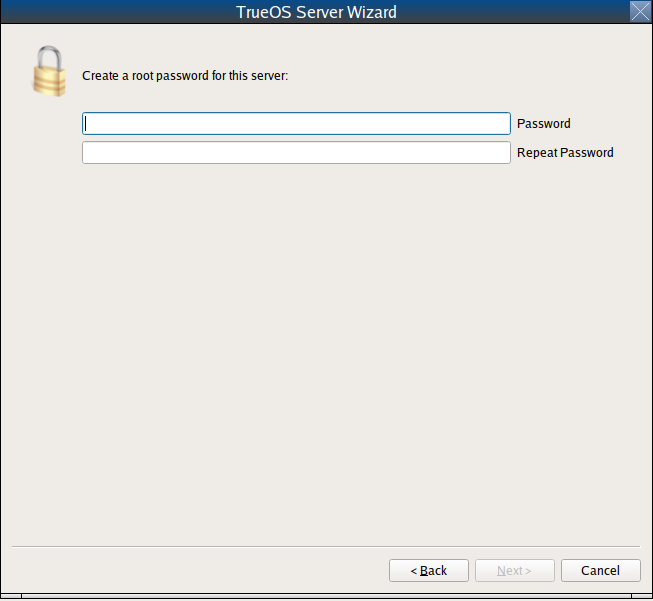
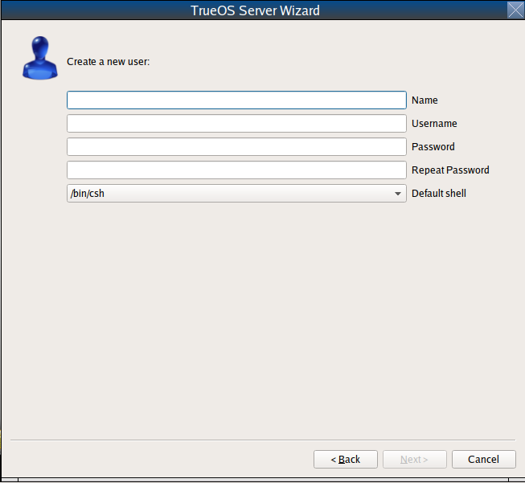
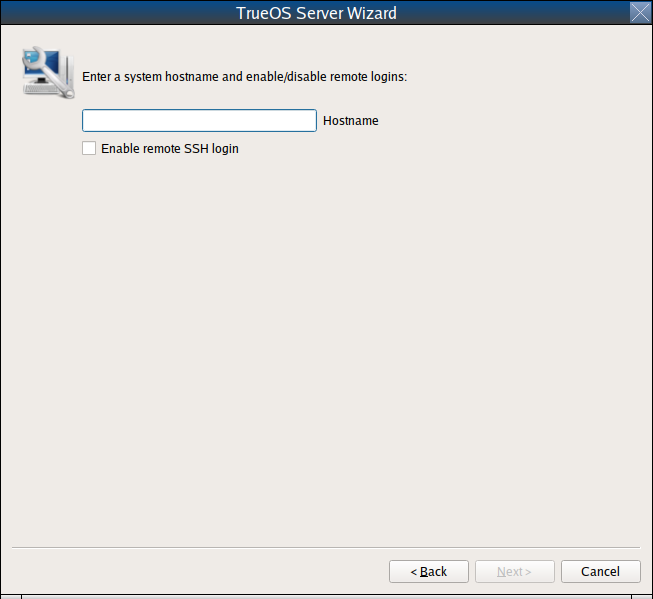
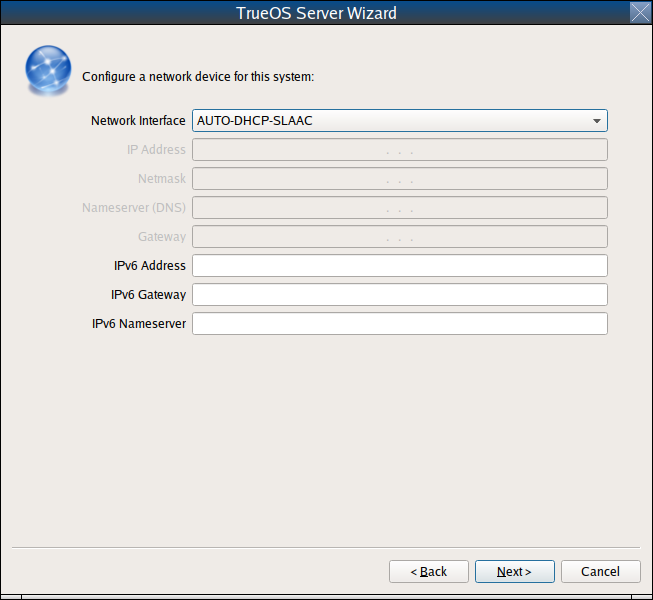
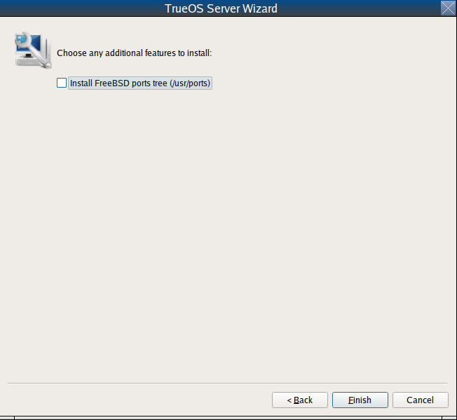
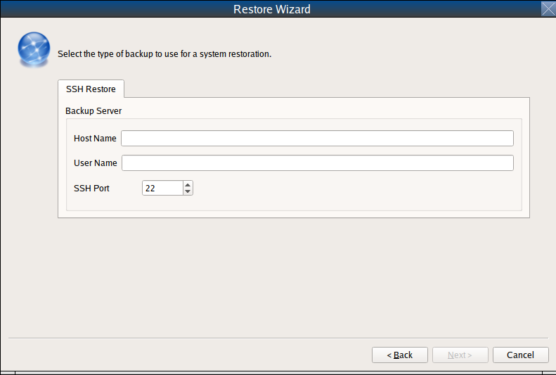

.. index:: advanced install topics
.. _Advanced Installation:

Advanced Installation Topics
****************************

The topics discussed in this chapter are intended for users that have
a sound understanding with installing and manipulating open source
software.

If the intent is to install a graphical desktop using the graphical
installer, refer instead to the :ref:`Install` section.

.. index:: install a server
.. _Server Installation:

Server Installation
===================

The :ref:`System Selection` screen of the |trueos| installer can be
used to install a FreeBSD-based command-line server operating system
rather than a graphical desktop operating system. A |trueos| server
installation includes the `SysAdm™ API <https://api.sysadm.us/>`_ and
`SysAdm™ Client <https://sysadm.us/handbook/client/>`_ for managing the
server locally or remotely.

For a server installation, using the |trueos| installer rather than the
FreeBSD installer offers several benefits:

* The ability to easily configure ZFS during installation.

* The ability to configure multiple boot environments.

* A wizard (described in this section) is provided during installation
  to configure the server for first use.

To perform a server installation, start the |trueos| installation as
usual. At the :ref:`System Selection` screen of the installer, select
:guilabel:`TrueOS Server (console interface only)`.

Click :guilabel:`Next` to start the :guilabel:`Server Setup Wizard`,
then click :guilabel:`Next` again to see the screen shown in
:numref:`Figure %s <server2>`.

.. _server2:

   Root Password Creation

Input and confirm the root password then click :guilabel:`Next` to
proceed to the screen shown in :numref:`Figure %s <server3>`.

.. _server3:

   Primary User Account Creation

For security reasons, do not login as the **root** user. The wizard
requires creating a primary user account for logging into the server.
This account is automatically added to the *wheel* group, allowing
the user to :command:`su` to the **root** account when administrative
access is required.

Create an account by filling in these fields:

* **Name:** Can contain capital letters and spaces.

* **Username:** The name to use for logging in. It cannot contain
  spaces and is case sensitive (e.g. *Kris* is a different username
  than *kris*).

* **Password:** The password to use for logging in. Type it twice to
  confirm it.

* **Default shell:** Use the drop-down menu to select the **csh**,
  **tcsh**, **sh**, or **bash** login shell.

When finished, click :guilabel:`Next` to proceed to
:numref:`Figure %s <server4>`.

.. _server4:

   Hostname Creation

Input the system's hostname. If using :command:`ssh` to connect to the
system, check :guilabel:`Enable remote SSH login`. Click
:guilabel:`Next` to proceed to the network configuration screen shown in
:numref:`Figure %s <server5>`.

.. _server5:

   Network Configuration

Use the :guilabel:`Network Interface` drop-down menu to choose the
desired interface:

* **AUTO-DHCP-SLAAC:** (default) Will configure every active interface
  for DHCP and for both IPv4 and IPv6.

* **AUTO-DHCP:** Will configure every active interface for DHCP and
  for IPv4.

* **IPv6-SLAAC:** Will configure every active interface for DHCP and
  for IPv6.

Alternately, use the drop-down menu to select the device name for the
interface and manually configure and input the IPv4 and/or IPv6
addressing information. When finished, click :guilabel:`Next` to access
the screen shown in :numref:`Figure %s <server6>`.

.. _server6:

   Optional Install Features

To install the FreeBSD ports collection, check
:guilabel:`Install ports tree` then click :guilabel:`Finish` to exit the
wizard and access the summary screen shown in :ref:`Disk Selection`.

If installing the server to a system with ZFS already installed, you can
choose to :guilabel:`Install to disk` or
:guilabel:`Install into boot Environment`.

When installing to disk, click :guilabel:`Customize Disk Settings` to
configure the system's disk(s). When installing into a Boot Environment,
you can select the ZFS Pool for installation using the drop-down menu.

To save the install configuration for re-use at a later time, insert a
MSDOSFS or FAT32 formatted USB stick and click
:guilabel:`Save Config to USB`.

When ready to continue, click :guilabel:`Next`. A new window asks if you
are ready to begin the installation. Click :guilabel:`Yes` to continue
or :guilabel:`No` to continue modifying the install configuration.

Once the system is installed, it boots to a command-line login
prompt. Login using the primary user account configured during
installation. Now the server can be configured like any other FreeBSD
server installation. The
`FreeBSD Handbook <https://www.freebsd.org/doc/en_US.ISO8859-1/books/handbook/>`_
is an excellent reference for performing common FreeBSD server tasks.

.. index:: Restore from Life Preserver backup
.. _Restoring the Operating System:

Restore from Life Preserver backup
==================================

If you have replicated the system's snapshots to a remote backup
server, you can use a |trueos| installation media to perform an
operating system restore or to clone another system. Start the
installation as usual and select to
:guilabel:`Restore from Life Preserver backup` in the
:ref:`System Selection Screen <install3>`.

Before you can perform a restore, the network interface must be
configured. Click the :guilabel:`Network Connectivity` (blue circle)
icon in order to determine if the network connection was automatically
detected. If not, refer to the instructions in the
:ref:`Network Manager` section of this handbook and ensure networking is
functional before continuing.

Once you are ready, click :guilabel:`Restore from Life Preserver backup`
and :guilabel:`Next`. This starts the Restore Wizard. In the
**SSH Restore** shown in :numref:`Figure %s <restore2>`, type the IP
address of the backup server and the name of the user account that
replicated the snapshots. If the server is listening on a non-standard
SSH port, change the :guilabel:`SSH port` number.

.. _restore2:

   : Beginning a SSH Restore

Click :guilabel:`Next` and the wizard provides a summary of your
selections. If correct, click :guilabel:`Finish`. Otherwise, click
:guilabel:`Back` to correct them.

Once the connection to the backup server succeeds, you can select which
host to restore. After making your selection, click :guilabel:`Next`.
The restore wizard provides a summary of which host it restores from,
the name of the user account associated with the replication, and
the hostname of the target system. Click :guilabel:`Finish` and the
installer proceeds to the :ref:`Disk Selection Screen <install5>`. At
this point, you can click :guilabel:`Customize` to customize the disk
options. However, any ZFS datasets will be greyed out as they are to be
recreated from the backup during the restore. Once you are finished
with any further customizations, click :guilabel:`Next` to perform the
restore.

.. index:: using system utilities menu
.. _Using the System Utilities Menu:

Using the System Utilities Menu
===============================

The System Utilities menu is available from the "Emergency Shell" icon
(see :ref:`insico`) in the various |trueos| installer screens. Once
opened, you'll see the menu shown in :numref:`Figure %s <util1>`.

.. TODO update screenshot and text once fixgrub option is removed.

.. _util1:

.. figure:: images/util1a.png
   :scale: 100%

   System Utilities Menu

This screen provides several options:

* **shell:** This option is useful when troubleshooting a |trueos|
  system that no longer boots. It opens a shell with administrative
  access, including the base FreeBSD utilities. Advanced users can use
  this shell to identify a problem, create a backup or copy essential
  files to another system, or alter configuration files with an editor
  like `ee <https://www.freebsd.org/cgi/man.cgi?query=ee>`_ or
  :command:`vi`. When finished using the shell, type :command:`exit` to
  return to the :ref:`System Utilities Menu <util1>`.

* **zimport** This option displays the names of available ZFS pools.
  Type the name of an available pool and the utility imports the pool
  then displays the available boot environments (BEs). Type the name of
  the desired BE and **zimport** mounts the BE then offers to open a
  chroot shell so the environment's contents can be viewed and edited
  as needed in order to perform maintenance on the boot environment.
  When finished, type :command:`exit` to leave the boot environment and
  return to the :ref:`System Utilities Menu <util1>`.

* **fixgrub:** This option is scheduled for removal as GRUB is no longer
  supported by |trueos|.

* **exit:** This option returns the user to the main
  :ref:`TrueOS® Installation Menu <install1>`.

.. index:: automated installations
.. _Automated Installations:

Automated Installations
=======================

|trueos| provides a set of Bourne shell scripts to allow advanced
users to create automatic or customized |trueos| installations.
:command:`pc-sysinstall` is the name of the master script. The script
reads a customizable configuration file and uses dozens of backend
scripts to perform the installation. Read more about this utility by
typing :command:`man pc-sysinstall`.

Here is a quick overview of the components used by
:command:`pc-sysinstall`:

* :file:`/usr/local/share/pc-sysinstall/backend/` contains the scripts
  used by the |trueos| installer. Scripts have been divided by function,
  such as :file:`functions-bsdlabel.sh` and
  :file:`functions-installcomponents.sh`. To learn more about how the
  |trueos| installer works, read through these scripts. This directory
  also contains the :file:`parseconfig.sh` and
  :file:`startautoinstall.sh` scripts which :command:`pc-sysinstall`
  uses to parse the configuration file and begin the installation.

* :file:`/usr/local/share/pc-sysinstall/backend-query/` contains the
  scripts used by the installer to detect and configure hardware.

* :file:`/usr/local/share/pc-sysinstall/conf/` contains the
  configuration file :file:`pc-sysinstall.conf`. It also contains a
  file indicating which localizations are available
  (:file:`avail-langs`), an :file:`exclude-from-upgrade` file, and a
  :file:`licenses/` subdirectory containing text files of applicable
  licenses.

* :file:`/usr/local/share/pc-sysinstall/doc/` contains the help text
  seen if :command:`pc-sysinstall` is run without any arguments.

* :file:`/usr/local/share/pc-sysinstall/examples/` contains several
  example configuration files for different scenarios (e.g.
  :file:`upgrade` and :file:`fbsd-netinstall`). The :file:`README` in
  this directory should be considered as **mandatory** reading before
  using :command:`pc-sysinstall`.

* :file:`/usr/sbin/pc-sysinstall` is the script used to perform a
  customized installation.

This section discusses the steps needed to create a custom installation.

First, determine which variables to customize. A list of possible
variables can be found in
:file:`/usr/local/share/pc-sysinstall/examples/README` and are
summarized in :numref:`Table %s <insvars>`.

.. note:: This table is meant as a quick reference to determine which
   variables are available. The :file:`README` in
   :file:`/usr/local/share/pc-sysinstall/examples/` contains more
   complete descriptions for each variable.

.. tabularcolumns:: |>{\RaggedRight}p{\dimexpr 0.25\linewidth-2\tabcolsep}
                    |>{\RaggedRight}p{\dimexpr 0.30\linewidth-2\tabcolsep}
                    |>{\RaggedRight}p{\dimexpr 0.45\linewidth-2\tabcolsep}|

.. _insvars:

.. table:: Customizing a |trueos| Installation
   :class: longtable

   +----------------------------+----------------------------+-------------------------------------+
   | Variable                   | Options                    | Description                         |
   +============================+============================+=====================================+
   | hostname=                  | should be unique           | optional as installer will          |
   |                            | for the network            | auto\-generate a hostname if empty  |
   +----------------------------+----------------------------+-------------------------------------+
   | installMode=               | "fresh", "upgrade",        | sets the installation type          |
   |                            | "extract", or "zfsrestore" |                                     |
   +----------------------------+----------------------------+-------------------------------------+
   | installLocation=           | /path/to/location          | used only when *installMode* is     |
   |                            |                            | extract and should point            |
   |                            |                            | to an already mounted location      |
   +----------------------------+----------------------------+-------------------------------------+
   | installInteractive=        | "yes" or "no"              | set to "no" for automated           |
   |                            |                            | installs without user input         |
   |                            |                            |                                     |
   +----------------------------+----------------------------+-------------------------------------+
   | netDev=                    | "AUTO-DHCP" or FreeBSD     | type of network connection          |
   |                            | interface name             | to use during the installation      |
   +----------------------------+----------------------------+-------------------------------------+
   | netIP=                     | IP address of interface    | only use if *netDev*                |
   |                            | used during installation   | is set to an interface name         |
   +----------------------------+----------------------------+-------------------------------------+
   | netMask=                   | subnet mask of interface   | only use if *netDev* is set         |
   |                            |                            | to an interface name                |
   +----------------------------+----------------------------+-------------------------------------+
   | netNameServer=             | IP address of DNS server   | only use if *netDev* is set         |
   |                            |                            | to an interface name                |
   +----------------------------+----------------------------+-------------------------------------+
   | netDefaultRouter=          | IP address of              | only use if *netDev* is set         |
   |                            | default gateway            | to an interface name                |
   +----------------------------+----------------------------+-------------------------------------+
   | netSaveDev=                | AUTO-DHCP or FreeBSD       | type of network configuration to    |
   |                            | interface name(s)          | enable on the installed system;     |
   |                            | (multiple allowed          | can set multiple interfaces         |
   |                            | separated by spaces)       |                                     |
   +----------------------------+----------------------------+-------------------------------------+
   | netSaveIP=                 | IP address of interface    | only use if *netSaveDev* is set to  |
   |                            | or "DHCP"                  | an interface name or a list of      |
   |                            |                            | interface names (repeat for each    |
   |                            |                            | interface)                          |
   +----------------------------+----------------------------+-------------------------------------+
   | netSaveMask=               | subnet mask of interface   | only use if *netSaveDev* is set to  |
   |                            |                            | an interface name or a list of      |
   |                            |                            | interface names (repeat for each    |
   |                            |                            | interface)                          |
   +----------------------------+----------------------------+-------------------------------------+
   | netSaveNameServer=         | IP address of DNS server   | only use if *netSaveDev* is set to  |
   |                            | (multiple allowed          | an interface name or a list of      |
   |                            | separated by spaces)       | interface names (do not repeat for  |
   |                            |                            | each interface)                     |
   +----------------------------+----------------------------+-------------------------------------+
   | netSaveDefaultRouter=      | IP address of default      | only use if *netSaveDev* is set to  |
   |                            | gateway                    | an interface name or a list of      |
   |                            |                            | interface names (do not repeat for  |
   |                            |                            | each interface)                     |
   +----------------------------+----------------------------+-------------------------------------+
   | disk0=                     | FreeBSD disk device name,  | see *README* for examples           |
   |                            | (e.g. *ad0*)               |                                     |
   +----------------------------+----------------------------+-------------------------------------+
   | partition=                 | "all", "free", "s1", "s2", | see *README* for examples           |
   |                            | "s3", "s4", or "image"     |                                     |
   +----------------------------+----------------------------+-------------------------------------+
   | partscheme=                | "MBR" or "GPT"             | partition scheme type               |
   |                            |                            |                                     |
   +----------------------------+----------------------------+-------------------------------------+
   | mirror=                    | FreeBSD disk device name   | sets the target disk for the        |
   |                            | (e.g. *ad1*)               | mirror (i.e. the second disk)       |
   +----------------------------+----------------------------+-------------------------------------+
   | mirrorbal=                 | "load", "prefer",          | defaults to "round-robin" if the    |
   |                            | "round-robin", or "split"  | *mirrorbal* method is not specified |
   +----------------------------+----------------------------+-------------------------------------+
   | bootManager=               | "none" or "bsd"            |                                     |
   |                            |                            |                                     |
   +----------------------------+----------------------------+-------------------------------------+
   | image=                     | /path/to/image /mountpoint | will write specified image file     |
   +----------------------------+----------------------------+-------------------------------------+
   | commitDiskPart             |                            | this variable is mandatory and must |
   |                            |                            | be placed at the end of each        |
   |                            |                            | *diskX* section; create a *diskX*   |
   |                            |                            | section for each disk you wish to   |
   |                            |                            | configure.                          |
   +----------------------------+----------------------------+-------------------------------------+
   | encpass=                   | password value             | at boot time, system will prompt    |
   |                            |                            | for this password in order to mount |
   |                            |                            | the associated GELI encrypted       |
   |                            |                            | partition                           |
   +----------------------------+----------------------------+-------------------------------------+
   | commitDiskLabel            |                            | this variable is mandatory and must |
   |                            |                            | be placed at the end of disk's      |
   |                            |                            | partitioning settings; see the      |
   |                            |                            | *README* for examples on how to set |
   |                            |                            | the <File System Type> <Size>       |
   |                            |                            | <Mountpoint> entries for each disk  |
   +----------------------------+----------------------------+-------------------------------------+
   | installMedium=             | "dvd", "usb", "ftp",       | source to be used for installation  |
   |                            | "rsync", or "image"        |                                     |
   +----------------------------+----------------------------+-------------------------------------+
   | localPath=                 | /path/to/files             | location of directory containing    |
   |                            |                            | installation files                  |
   +----------------------------+----------------------------+-------------------------------------+
   | installType=               | "PCBSD" or "FreeBSD"       | determines whether this is a        |
   |                            |                            | desktop or a server install         |
   +----------------------------+----------------------------+-------------------------------------+
   | installQuiet               | "yes" or "no"              | set to "yes" for automatic          |
   |                            |                            | installations                       |
   +----------------------------+----------------------------+-------------------------------------+
   | installFile=               | e.g. "fbsd-release.tbz"    | only set if using a customized      |
   |                            |                            | installer archive                   |
   +----------------------------+----------------------------+-------------------------------------+
   | packageType=               | "tar", "uzip", "split",    | the archive type on the             |
   |                            | "dist", or "pkg"           | installation media                  |
   +----------------------------+----------------------------+-------------------------------------+
   | distFiles=                 | e.g. "base src kernel"     | list of FreeBSD distribution files  |
   |                            |                            | to install when using               |
   |                            |                            | *packageType=dist*                  |
   +----------------------------+----------------------------+-------------------------------------+
   | ftpPath=                   | ftp://ftp_path             | location of the installer archive   |
   |                            |                            | when using *installMedium=ftp*      |
   +----------------------------+----------------------------+-------------------------------------+
   | rsyncPath=                 | e.g. "life-preserver       | location of the rsync data on the   |
   |                            | /back-2011-09-12T14_53_14" | remote server when using            |
   |                            |                            | *installMedium=rsync*               |
   +----------------------------+----------------------------+-------------------------------------+
   | rsyncUser=                 | username                   | set when using                      |
   |                            |                            | *installMedium=rsync*               |
   +----------------------------+----------------------------+-------------------------------------+
   | rsyncHost=                 | IP address of rsync server | set when using                      |
   |                            |                            | *installMedium=rsync*               |
   +----------------------------+----------------------------+-------------------------------------+
   | rsyncPort=                 | port number                | set when using                      |
   |                            |                            | *installMedium=rsync*               |
   +----------------------------+----------------------------+-------------------------------------+
   | installComponents=         | e.g. "amarok, firefox,     | components must exist in            |
   |                            | ports"                     | */PCBSD/pc-sysinstall/components/*; |
   |                            |                            | typically, *installPackages=* is    |
   |                            |                            | used instead                        |
   +----------------------------+----------------------------+-------------------------------------+
   | installPackages=           | e.g. "Xorg cabextract      | list of traditional or pkg packages |
   |                            |                            | to install; requires *pkgExt=*      |
   +----------------------------+----------------------------+-------------------------------------+
   | pkgExt=                    | ".txz"                     | specify the extension used by the   |
   |                            |                            | type of package to be installed     |
   +----------------------------+----------------------------+-------------------------------------+
   | upgradeKeepDesktopProfile= | "yes" or "no"              | specify if you wish to keep your    |
   |                            |                            | existing user's desktop profile     |
   |                            |                            | data during an upgrade              |
   +----------------------------+----------------------------+-------------------------------------+
   | rootPass=                  | password                   | set the root password of the        |
   |                            |                            | installed system to the specified   |
   |                            |                            | string                              |
   +----------------------------+----------------------------+-------------------------------------+
   | rootEncPass=               | encrypted string           | set root password to specified      |
   |                            |                            | encrypted string                    |
   +----------------------------+----------------------------+-------------------------------------+
   | userName=                  | case sensitive value       | create a separate block of user     |
   |                            |                            | values for each new user            |
   +----------------------------+----------------------------+-------------------------------------+
   | userComment=               | description                | description text can include spaces |
   +----------------------------+----------------------------+-------------------------------------+
   | userPass=                  | password of user           |                                     |
   +----------------------------+----------------------------+-------------------------------------+
   | userEncPass                | encrypted string           | set user password to specified      |
   |                            |                            | encrypted string                    |
   +----------------------------+----------------------------+-------------------------------------+
   | userShell=                 | e.g. "/bin/csh"            | path to default shell               |
   +----------------------------+----------------------------+-------------------------------------+
   | userHome=                  | e.g. "/home/username"      | path to home directory              |
   +----------------------------+----------------------------+-------------------------------------+
   | defaultGroup=              | e.g. "wheel"               | default group                       |
   +----------------------------+----------------------------+-------------------------------------+
   | userGroups=                | e.g. "wheel, operator"     | comma separated (no spaces) list of |
   |                            |                            | additional groups                   |
   +----------------------------+----------------------------+-------------------------------------+
   | commitUser                 |                            | mandatory, must be last line in     |
   |                            |                            | each user block                     |
   +----------------------------+----------------------------+-------------------------------------+
   | runCommand=                | full path to command       | run the specified command within    |
   |                            |                            | chroot of the installed system,     |
   |                            |                            | after the installation is complete  |
   +----------------------------+----------------------------+-------------------------------------+
   | runScript=                 | full path to script        | runs specified script within chroot |
   |                            |                            | of the installed system, after the  |
   |                            |                            | installation is complete            |
   +----------------------------+----------------------------+-------------------------------------+
   | runExtCommand=             | full path to command       | runs a command outside the chroot   |
   +----------------------------+----------------------------+-------------------------------------+
   | runPrePkgCommand=          | full path to command       | runs the specified command before   |
   |                            |                            | starting the pkg installation       |
   +----------------------------+----------------------------+-------------------------------------+
   | runPrePkgScript=           | full path to command       | runs the specified sript before     |
   |                            |                            | starting the pkg installation       |
   +----------------------------+----------------------------+-------------------------------------+
   | runPrePkgExtCommand=       | full path to command       | runs the specified command before   |
   |                            |                            | extracting the pkg                  |
   +----------------------------+----------------------------+-------------------------------------+
   | runPreExtractCommand=      | full path to command       | runs the specified command before   |
   |                            |                            | extracting                          |
   +----------------------------+----------------------------+-------------------------------------+
   | runPreExtractScript=       | full path to command       | runs the specified command before   |
   |                            |                            | starting the pkg installation       |
   +----------------------------+----------------------------+-------------------------------------+
   | runPreExtractExtCommand=   | full path to command       | runs the specified command before   |
   |                            |                            | starting the pkg installation       |
   +----------------------------+----------------------------+-------------------------------------+
   | timeZone=                  | e.g. "America/New_York"    | location must exist in              |
   |                            |                            | :file:`/usr/share/zoneinfo/`        |
   +----------------------------+----------------------------+-------------------------------------+
   | enableNTP=                 | "yes" or "no"              | enable/disable NTP                  |
   +----------------------------+----------------------------+-------------------------------------+
   | localizeLang=              | e.g. "en"                  | sets the system console and Desktop |
   |                            |                            | to the target language              |
   +----------------------------+----------------------------+-------------------------------------+
   | localizeKeyLayout=         | e.g. "en"                  | updates the system's Xorg config to |
   |                            |                            | set the keyboard layout             |
   +----------------------------+----------------------------+-------------------------------------+
   | localizeKeyModel=          | e.g. "pc104"               | updates the system's Xorg config to |
   |                            |                            | set the keyboard model              |
   +----------------------------+----------------------------+-------------------------------------+
   | localizeKeyVariant=        | e.g. "intl"                | updates the Xorg config to set the  |
   |                            |                            | keyboard variant                    |
   +----------------------------+----------------------------+-------------------------------------+
   | autoLoginUser=             | username                   | user will log in automatically      |
   |                            |                            | without entering a password         |
   +----------------------------+----------------------------+-------------------------------------+
   | sshHost=                   | hostname or IP address     | the address of the remote server    |
   |                            |                            | when using *installMode=zfsrestore* |
   +----------------------------+----------------------------+-------------------------------------+
   | sshPort=                   | e.g "22"                   | the SSH port number of the remote   |
   |                            |                            | server when using                   |
   |                            |                            | *installMode=zfsrestore*            |
   +----------------------------+----------------------------+-------------------------------------+
   | sshUser=                   | username                   | the username on the remote server   |
   |                            |                            | when using *installMode=zfsrestore* |
   +----------------------------+----------------------------+-------------------------------------+
   | sshKey=                    | e.g. "/root/id_rsa"        | path to the SSH key file on the     |
   |                            |                            | remote server when using            |
   |                            |                            | *installMode=zfsrestore*            |
   +----------------------------+----------------------------+-------------------------------------+
   | zfsProps=                  | e.g. ".lp-props            | location of dataset properties file |
   |                            | -tank#backups#mybackup"    | created by Life Preserver during    |
   |                            |                            | replication when using              |
   |                            |                            | *installMode=zfsrestore*            |
   +----------------------------+----------------------------+-------------------------------------+
   | zfsRemoteDataset=          | e.g. "tank/backups/        | location of remote dataset to       |
   |                            | mybackup"                  | restore from when using             |
   |                            |                            | *installMode=zfsrestore*            |
   +----------------------------+----------------------------+-------------------------------------+

Next, create a customized configuration. One way to create a
customized configuration file is to read through the configuration
examples in :file:`/usr/local/share/pc-sysinstall/examples/` and follow
the most relevant example. Copy the file to any location and customize
it so it includes the desired variables and values in the installation.

An alternate way to create this file is to start an installation,
configure the system as desired, and save the configuration to a USB
stick (with or without actually performing the installation). Use the
saved configuration file as-is, or customize it to meet an
installation's needs. This method may prove easier when performing
complex disk layouts.

To perform a fully automated installation which does not prompt for any
user input, review
:file:`/usr/local/share/pc-sysinstall/examples/pc-autoinstall.conf`
and place a customized copy of the file into
:file:`/boot/pc-autoinstall.conf` on the installation media.

:numref:`Table %s <autovars>` summarizes the additional variables
available for fully automatic installations. More detailed descriptions
can be found in the
:file:`/usr/local/share/pc-sysinstall/examples/pc-autoinstall.conf`
file.

.. note:: The variables in this file use a different syntax than those
   in :ref:`Customizing a TrueOS® Installation <insvars>` as the values
   follow a colon (:kbd:`:`) and a space rather than an :kbd:`=` sign.

.. tabularcolumns:: |>{\RaggedRight}p{\dimexpr 0.25\linewidth-2\tabcolsep}
                    |>{\RaggedRight}p{\dimexpr 0.30\linewidth-2\tabcolsep}
                    |>{\RaggedRight}p{\dimexpr 0.45\linewidth-2\tabcolsep}|

.. _autovars:

.. table:: Automated Installation Variables
   :class: longtable

   +-----------------+----------------------------+------------------------------------+
   | Variable        | Options                    | Description                        |
   +=================+============================+====================================+
   | pc_config       | URL or /path/to/file       | location of customized             |
   |                 |                            | :file:`pc-sysinstall.conf`         |
   +-----------------+----------------------------+------------------------------------+
   | confirm_install | "yes" or "no"              | should be set to "yes", or         |
   |                 |                            | booting the wrong disk will        |
   |                 |                            | result in a system wipe            |
   +-----------------+----------------------------+------------------------------------+
   | shutdown_cmd    | e.g.                       | running a shutdown is recommended, |
   |                 | :command:`shutdown -p now` | but this can be any command/script |
   |                 |                            | to execute post-install            |
   +-----------------+----------------------------+------------------------------------+
   | nic_config      | "dhcp-all" or              | attempts DHCP on all found NICs    |
   |                 | <interface name>           | until the installation file is     |
   |                 | <IP address>               | fetched or will setup a            |
   |                 | <subnet mask>              | specified interface                |
   +-----------------+----------------------------+------------------------------------+
   | nic_dns         | IP address                 | DNS server to use                  |
   +-----------------+----------------------------+------------------------------------+
   | nic_gateway     | IP address                 | default gateway to use             |
   +-----------------+----------------------------+------------------------------------+

Finally, create a custom installation media or installation server.
:command:`pc-sysinstall` supports two installation methods:

1. From CD, DVD, or USB media.

2. From an installation directory on an HTTP, FTP, or SSH+rsync server.

The easiest way to create a custom installation media is to modify an
existing installation image. For example, if an ISO for the |trueos|
version to customize is downloaded, the superuser can access the
contents of the ISO with a few commands:

.. code-block:: none

 [name@example] mdconfig -a -t vnode -f TrueOS-Desktop-2016-08-11-x64-DVD.iso.md5 -u 1

 [name@example] mount -t cd9660 /dev/md1 /mnt

Make sure to :command:`cd` into the desired destination directory for
the copied ISO contents. In the next examples,
:file:`/tmp/custominstall/` was created for this purpose:

.. code-block:: none

 [name@example] cd /tmp/custominstall

 [name@example] tar -C /mnt -cf - . | tar -xvf -

 [name@example] umount /mnt

Alternately, if an installation CD or DVD is inserted, mount the media
and copy its contents to the desired directory

 .. code-block:: none

 [name@example] mount -t cd9660 /dev/cd0 /mnt

 [name@example] cp -R /mnt/* /tmp/custominstall/

 [name@example] umount /mnt

If creating an automated installation, copy the customized
:file:`pc-autoinstall.conf` to :file:`/tmp/custominstall/boot/`.

Copy the customized configuration file to :file:`/tmp/custominstall/`.
Double-check the :command:`installMedium=` variable in the customized
configuration file is set to the correct installation media.

Adding extra files may be necessary if certain variables are set in the
custom configuration file:

* **installComponents=** Any extra components to install must exist in
  :file:`extras/components/`.

* **runCommand=** The command must exist in the specified path.

* **runScript=** Make sure the script exists in the specified path.

* **runExtCommand=** Ensure the command exists in the specified
  path.

If the installation media is a CD or DVD, create a bootable media
containing the files in the directory. To create a bootable ISO:

.. code-block:: none

 [name@example] cd /tmp/custominstall

 [name@example] mkisofs -V mycustominstall -J -R -b boot/cdboot -no-emul-boot -o myinstall.iso

Use a preferred burning utility to burn the ISO to the media.

To begin an installation that requires user interaction, type
:command:`pc-sysinstall -c /path_to_your_config_file`

To begin a fully automated installation, insert the installation media
and reboot.

If using an HTTP, FTP, or SSH server as the installation media,
:command:`untar` or copy the required files to a directory on the
server accessible to users. Be sure to configure the server so
installation files are accessible to the systems to install.
