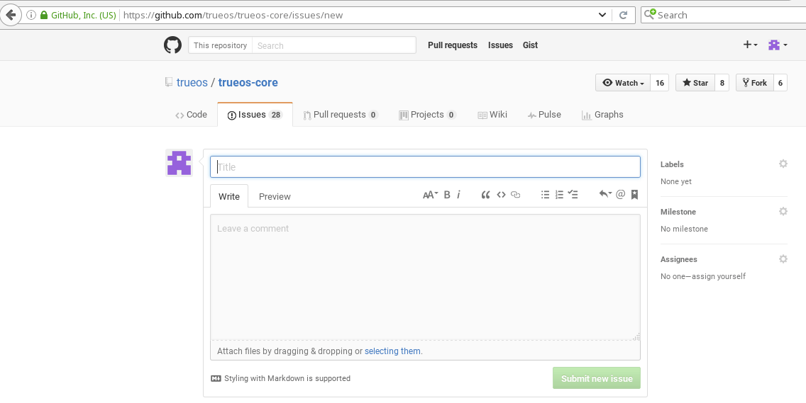
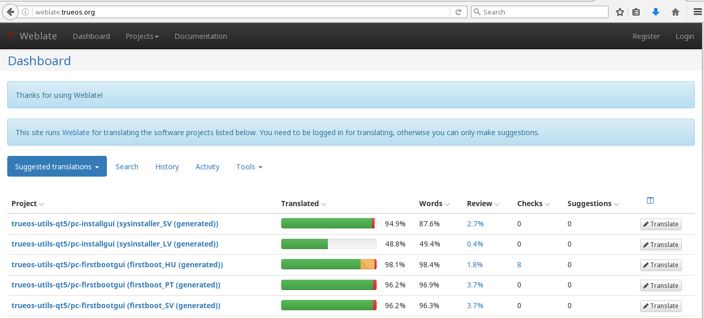
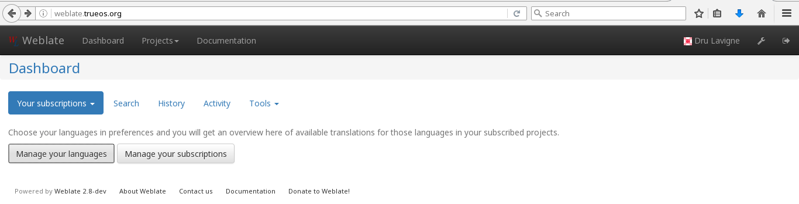
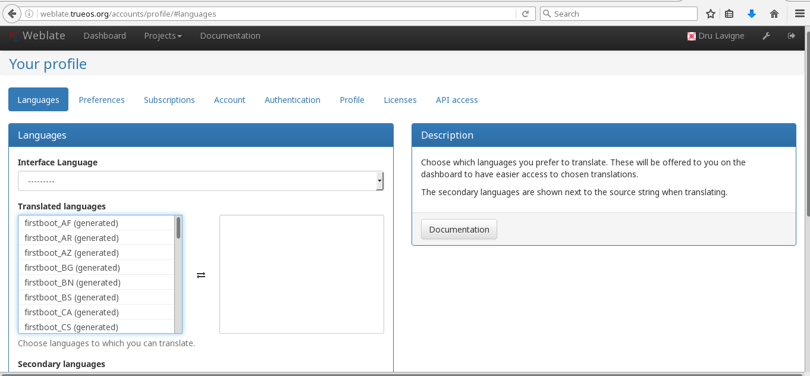
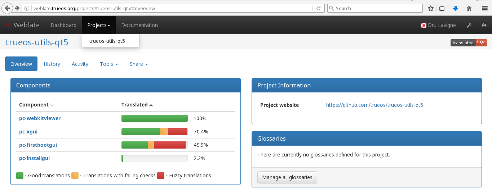
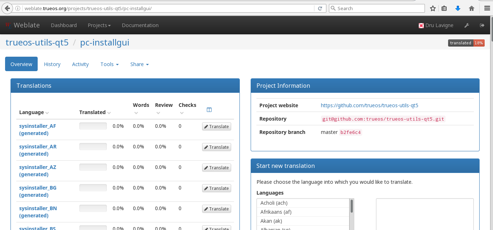
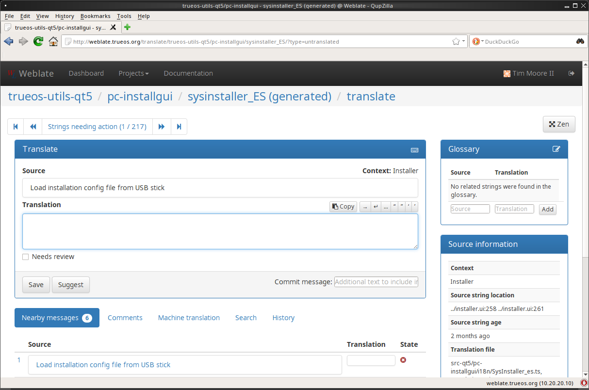
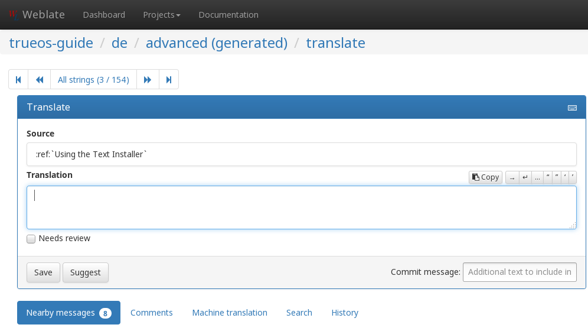
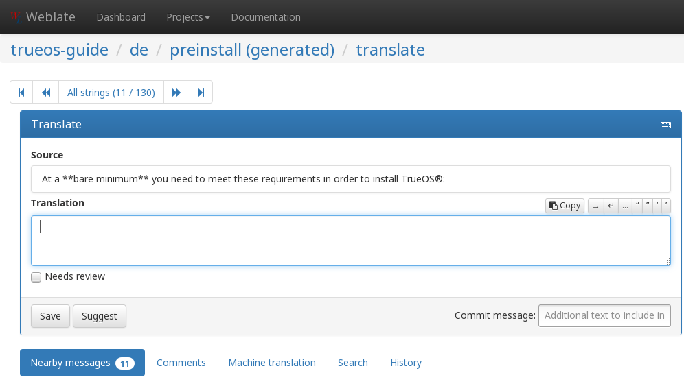

.. index:: help
.. _Help and Support:

Help and Support
****************

The |trueos| Project strives to make using |trueos| as easy as possible
for newcomers. If help is needed, there are many ways to get in touch
with the |trueos| community. This chapter describes available resources.

As a teacher may have said, "there is no such thing as a stupid
question". However, there are ways to ensure a productive exchange for
all parties involved. The two articles below describe how and why it is
important to follow certain protocols when requesting help:

* `How to Ask Smart Questions (PDF) <http://divajutta.com/doctormo/foo/ask-smart-questions.pdf>`_

* `How To Ask Questions The Smart Way <http://catb.org/~esr/faqs/smart-questions.html>`_

.. index:: community, chat
.. _TrueOS Community:

The |trueos| Community
======================

The |trueos| community has grown and evolved since the project's
inception. A wide variety of chat channels and forum options are now
available for users to interact with each other, contributors to the
project, and the core development team.

.. index:: community, gitter
.. _Gitter:

Gitter
------

The |trueos| Project uses
`Gitter <https://en.wikipedia.org/wiki/Gitter>`_ to provide real-time
chat and collaboration with |trueos| users and developers. Gitter does
not require an application to use, but does require a login using
either an existing GitHub or Twitter account.

To access the Gitter channel, point a web browser to the
`TrueOS® Lobby <https://gitter.im/trueos/Lobby>`_.

Gitter also maintains a full archive of the chat history. This means
lengthy conversations about hardware issues or workarounds will always
be available for reference. To access the Gitter archive, navigate to
the |trueos| `archive <https://gitter.im/trueos/Lobby/archives>`_.

.. note:: It is not required to log in to Gitter to browse the archive.

Gitter is a great way to chat with other users and get answers to
questions. Here are few things to keep in mind when asking a question
on the Gitter channel:

* Most of the regular users are always logged in, even when they are
  away from their computer or are busy doing other things. If no one
  responds immediately, do not get mad, leave the channel, and never
  come back again. Stick around for a while to see if anyone responds.

* Users represent many different time zones. It is quite possible it is
  late at night or very early in the morning for some users when asking
  a question.

* Do not post large error messages in the channel. Instead, use a
  pasting service such as pastebin.com and refer to the URL on channel.

* Be polite and do not demand a response from others.

* It is considered rude to "Chat Privately" with someone who does not
  know you without first asking their permission. If no one answers
  the question, do not start chatting privately with unkown people in
  the room.

* The first time joining the channel, it is okay to say hi and introduce
  yourself. If a new person joins the channel, feel free to welcome them
  and to make them feel welcome.

.. index:: community, reddit
.. _TrueOS® Subreddit:

|trueos| Subreddit
------------------

The |trueos| Project also has a
`Subreddit <https://www.reddit.com/r/TrueOS/>`_ for users who prefer
to use Reddit to ask questions and to search for or post how-tos. A
Reddit account is not required in order to read the Subreddit, but will
be necessary to create a login account to submit or comment on posts.

.. index:: community, discourse
.. _Discourse:

Discourse
---------

|trueos| also has a discourse `channel <https://discourse.trueos.org/>`_
managed concurrently with the Subreddit. Functionally similar to the
Subreddit, a new user will need to sign up with Discourse in order to
create posts, but it is possible to view the current posts without an
account.

.. index:: community, IRC
.. _IRC:

IRC
---

.. TODO fill this in with traditional IRC text (check archived trueos
   handbooks).

.. index:: community, social
.. _Social Media:

Social Media
------------

The |trueos| project maintains several social media sites to help users
keep up-to-date with what is happening and to provide venues for
developers and users to network with each other. Anyone is welcome to
join.

* `Official TrueOS® Blog <https://www.trueos.org/blog/>`_

* `TrueOS® Project on Twitter <https://twitter.com/TrueOS_Project/>`_

* `TrueOSD® Facebook Group <https://www.facebook.com/groups/4210443834/>`_

* `TrueOS® LinkedIn Group <http://www.linkedin.com/groups?gid=1942544>`_

.. index:: contributing
.. _Get Involved:

Contributing to |trueos|
========================

.. TODO clean up and expand, maybe work in some of the contributor rules

Many in the |trueos| community have assisted in its development,
providing valuable contributions to the project. |trueos| is a large
project with many facets, meaning there is ample opportunity for a wide
variety of skill sets to easily improve the project.

.. index:: contributing, bug
.. _Report a bug:

Report a bug
------------

One of the most effective ways to assist the |trueos| Project is by
reporting problems or bugs encountered while using |trueos|. Anyone can
report a |trueos| bug. However, a few guidelines should be followed to
ensure a speedy response:

* |trueos| uses `GitHub <https://github.com/trueos/>`_, to manage bugs.
  A GitHub account is required before bugs can be reported. Navigate
  to https://github.com, fill in the required fields, and click
  :guilabel:`Sign up for GitHub` to create a new github account.

.. note:: The GitHub issues tracker uses email to update contributors
   on the status of bugs. Please use a valid and frequently used
   email address when creating a GitHub account for the efficient
   resolution of issues.

* The |trueos| code has been organized into repositories representing
  the |lumina| desktop, the graphical utilities, |sysadm|, and various
  other applications. When reporting a bug, select the "trueos-core"
  repository. If the bug is specific to |lumina|, instead select the
  "lumina" repository.

* After clicking a repostitory name, use the :guilabel:`Search` bar on
  its page to confirm no similar bug report exists. If a similar
  report does exist, add any additional information to the report via
  a comment. While it is not required to log in to search existing bugs,
  adding a comment or creating a new report does require signing into
  the website.

* To create a new bug report, navigate to the 
  `trueos-core repository <https://github.com/trueos/trueos-core>`_ and
  press :menuselection:`Issues --> New Issue` within the repository.
  :numref:`Figure %s <bug1>` shows the creation of a new bug report.
  
.. _bug1:

   : Creating a Bug Report
   
* Write a brief but descriptive title which includes the error. Ideally,
  the title is short (8 words or less) and contains key words about the
  error so the bug report is easily found with the search tool.

* In the :guilabel:`Leave a Comment` field, write about the
  circumstance of the error, including instructions how to recreate it.
  If an error message is generated, paste the error in its entirety.
  Attaching a screenshot to the report can greatly aid the developer in
  visualizing the problem. Remember to include the output of
  :command:`uname -a`.

* If the problem appears to be hardware related, attach a copy of
  :file:`/var/run/dmesg.boot` as this file shows the hardware probed the
  last time the |trueos| system booted.

* After describing the issue, click :guilabel:`Submit new issue` to
  create the issue. The bug tracker will attach a unique number to the
  report and send update messages to the the registered email address
  whenever activity occurs with the bug report.

.. index:: contributing, testing
.. _Become a Beta Tester:

Become a Beta Tester
--------------------

If you enjoy tinkering with operating systems and have a bit of spare
time, one of the most effective ways to can assist the |trueos|
community is by reporting any encountered problems while using |trueos|.

If a spare system or virtual machine is available, you can also download
and try out the latest testing snapshots. Having as many people as
possible using |trueos| on many different hardware configurations
assists the Project in finding and fixing bugs. This makes using
|trueos| better for everyone.

If becoming a tester is tempting, join the
`TrueOS® Lobby <https://gitter.im/trueos/Lobby>`_. New testing versions,
once available, will be announced here. You will also be able to see
any problems other testers are finding and can check to see if the
problem exists on your hardware as well.

Anyone can become a beta tester. If you find a bug while testing,
accurately describe the situation when
:ref:`Reporting a bug <Report a bug>` so it can be fixed as soon as
possible.

.. index:: contributing, translations
.. _Become a Translator:

Translation
-----------

If interested in translating |trueos| into your native language, start
by choosing which of the three translation areas to work in:

1. Translate the graphical menus within the |trueos| operating system.

2. Translate the documentation published with |trueos|.

3. Translate the |trueos| website.

This section describes each of these translation areas in more detail
and how to begin as a translator.

Regardless of the type of desired translation, you should first join the
`TrueOS® Lobby <https://gitter.im/trueos/Lobby>`_. The first time
joining the channel, introduce yourself and indicate which language(s)
and which type(s) of translations you can assist with. This allows you
to meet other volunteers as well as stay informed of any notices or
updates affecting translators.

.. index:: contributing, translations, interface
.. _Interface Translation:

Interface Translation
^^^^^^^^^^^^^^^^^^^^^

|trueos| uses `Weblate <https://weblate.org>`_ for managing
localization of the menu screens used by the installer and the |trueos|
utilities. Weblate makes it easy to find out if your native language
has been fully localized for |trueos|. It also makes it easy to verify
and submit translated text as it provides a web editor and commenting
system. This means translators can spend more time making and
reviewing translations rather than learning how to use a translation
tool.

To assist with a localization, open the
`TrueOS® translation website <http://weblate.trueos.org/>`_ in a web
browser. An example is seen in :numref:`Figure %s <translate1>`. 

.. _translate1:

   : |trueos| Weblate Translation System

Before editing a translation, first create a a login account and verify
the activation email. Once logged in, click 
:guilabel:`Manage your languages`, shown in
:numref:`Figure %s <translate2>`.

.. _translate2:

   : Weblate Dashboard

In the screen shown in :numref:`Figure %s <translate3>`, use the
:guilabel:`Interface Language` drop-down menu to select the language for
the Weblate interface. Then, in :guilabel:`Translated languages`, use
the :guilabel:`arrows` to add or remove the languages you wish to
translate. Once any selections are made, click :guilabel:`Save`.

.. _translate3:

   : Manage Languages

.. note:: If the language you wish to translate is missing from the
   "Translated languages" menu, request its addition in the
   `TrueOS® Lobby <https://gitter.im/trueos/Lobby>`_.

Next, click :guilabel:`Projects` at the top of the screen to select
a localization project. In the example shown in
:numref:`Figure %s <translate4>`, the user has selected the
*trueos-utils-qt5* project, which represents the localization of the
|trueos| graphical interface. This screen shows the components of the
project and the current progress of each component's translation. The
green bar indicates the localization percentage. If a component is not
at 100%, this means its untranslated menus will instead appear in
English.

.. _translate4:

   : Project Selection

To start translating, click a component name. In the screen shown in
:numref:`Figure %s <translate5>`, select a language and click
:guilabel:`Translate`.

.. _translate5:

   : Translation Languages

In the example shown in :numref:`Figure %s <translate6>`, the user has
selected to translate the *pc-installgui* component into the Spanish
language. The English text is displayed in the :guilabel:`Source` field
and the translator can type the Spanish translation into the
:guilabel:`Translation` field. Use the :guilabel:`arrows` near the
:guilabel:`Strings needing action` field to navigate between strings
to translate.

.. _translate6:

   : Translation Editor

If assistance is needed with either a translation or the Weblate system,
ask for help in the `TrueOS® Lobby <https://gitter.im/trueos/Lobby>`_. 

.. index:: contributing, translations, documentation
.. _Documentation Translation:

Documentation Translation
^^^^^^^^^^^^^^^^^^^^^^^^^

.. TODO review this section with the final word on using Weblate for
   documentation translation.

The source for the |trueos| Users Handbook is stored in the
`TrueOS® github repository <https://github.com/trueos/trueos-docs/tree/master/trueos-handbook>`_.
This allows the documentation and its translations to be built with
the operating system. Documentation updates are automatically pushed
to the |trueos| website and, when the system is updated using
:ref:`Update Manager`, the doc updates are installed to a local copy
named
:file:`/usr/local/share/trueos/handbook/trueos.html`. This ensures the
installed version of the Handbook always matches the operating system
and new features are documented as they are added, appearing as a local
copy on the user's system.

The |trueos| build server provides the HTML version of the |trueos|
Users Handbook. Instructions for building your own HTML, PDF, or EPUB
version can be found in this
`README.md <https://github.com/trueos/trueos-docs/blob/master/trueos-handbook/README.md>`_.

The documentation source files have been integrated into the Weblate
translation system so the |trueos| documentation can be translated
using a web browser. The process is similar to
:ref:`Interface Translation` except **trueos-guide** mus be selected
from the :guilabel:`Projects` drop-down menu shown in :ref:`translate4`.

It is important to be aware of a few elements when translating the
documentation:

At this time, some formatting tags are still displayed in raw text, as
seen in the examples in :numref:`Figure %s <translate7>` and
:numref:`Figure %s <translate8>`.

.. danger:: Do not remove the formatting as this can break the
   documentation build for that language.

In :ref:`translate7`, it is fine to translate the phrase "Using the
Text Installer", but care must be taken to avoid removing any of the
surrounding colons and backticks, or to change the text of the *ref*
tag. In :ref:`translate8`, the asterisks are used to bold the words
"bare minimum". It is fine to translate "bare minimum", but do **not**
remove the asterisks.

.. _translate7:

   : Formatting Characters - Do Not Remove

.. _translate8:

   : More Formatting Characters

To build a local HTML copy that includes the latest translations, either
for personal use or to visualize the translated Guide, type these
commands from the command line:

.. note:: These instructions are for a |trueos| system.

.. code-block:: none

 sudo pkg install trueos-toolchain
 rehash
 git clone git://github.com/trueos/trueos-docs
 cd trueos-docs/trueos-handbook
 sudo make i18n
 make html
 ls _build
 doctrees                html-es                 html-tr  		pcbsd-handbook-i18n.txz               
 html                    html-fr                 html-uk
 html-da		 html-id		 locale
 html-de                 html-pt_BR        	 locale-po     

 
This will make an HTML version of the Guide for each of the available
translations. In this example, translations are available for English
(in :file:`html`), Danish, German, Spanish, French, Indonesian,
Brazilian Portuguese, Turkish, and UK English. To update the HTML at a
later time

.. code-block:: none

 cd ~/trueos-docs
 git pull
 cd trueos-docs/trueos-handbook 
 sudo make i18n
 sudo make html

.. index:: contributing, translations, website
.. _Website Translation:

Website Translation
^^^^^^^^^^^^^^^^^^^

If you are interested in translating the |trueos| website, introduce
yourself in the `TrueOS® Lobby <https://gitter.im/trueos/Lobby>`_.

Currently, the website is being translated to several languages,
including: Dutch, French, German, Polish, Spanish, Swedish, and Turkish.

.. index:: contributing, development
.. _Development:

Development
-----------

If you like programming, and especially coding on FreeBSD, we would
love to see you join the |trueos| team as a |trueos| committer.
Developers who want to help improve the |trueos| codebase are always
welcome! To participate in core development, introduce yourself in the
`TrueOS® Lobby <https://gitter.im/trueos/Lobby>`_. Feel free to browse
the :guilabel:`Issues` in the 
`TrueOS® repository <https://github.com/trueos/>`_. If you see
something you want to work on, or have a proposal for a project to add
to |trueos|, mention it and someone will be happy to help you get
started.

Most of the |trueos| specific GUI tools are developed in C++ using Qt
libraries and other non-GUI development is done using standard Bourne
shell scripts. There may be cases where other languages or libraries
are needed, but those will be evaluated on a case-by-case basis.

.. index:: contributing, development, source code
.. _Getting the Source Code:

Getting the Source Code
^^^^^^^^^^^^^^^^^^^^^^^

The |trueos| source code is available from
`GitHub <https://github.com/trueos/>`_. The code has been organized
into repositories which represent the |lumina| desktop, the graphical
utilities, |sysadm|, and various other applications. :command:`git`
needs to be installed in order to download the source code. When using
|trueos|, :command:`git` is included in the base install.

To download the source code, :command:`cd` to the directory to store
the source code and specify the name of the desired repository. In
this example, the user wishes to download the source for the graphical
utilities:

.. code-block:: none

 git clone git://github.com/trueos/trueos-utils-qt5

This will create a directory with the same name as the repository.

.. note:: To keep the local copy in sync with the official repository,
   periodically run :command:`git pull` within the directory.

.. TODO :command:`portsnap fetch extract` is being reworked. Use git
   instructions for now (12/5/16).

Before compiling any source, ensure the Ports Collection is installed.
At this time, **git** is used to fetch and update ports (see
:ref:`FreeBSD Ports`).

Fetching ports for the first time (as root):

.. code-block:: none

 # git clone http://github.com/trueos/freebsd-ports.git /usr/ports

Update an existing :file:`ports` directory (as root):

.. code-block:: none

 # cd /usr/ports
 
 # git pull

Then, :command:`cd` to the directory containing the source to build and
run the :command:`mkport.sh` script. In this example, the developer
wants to compile the graphical utilities:

.. code-block:: none

 cd trueos-utils-qt5

 ./mkport.sh /usr/ports/

This will create a port which can be installed. The name of the port
is located in :file:`mkport.sh`. This example determines the name of
the port directory, changes to it, and then builds the port. Since this
system is already running the |trueos| graphical utilities,
:command:`reinstall` is used to overwrite the current utilities:

.. code-block:: none

 grep port= mkport.sh
 port="sysutils/trueos-utils-qt5"
 cd /usr/ports/sysutils/trueos-utils-qt5
 make reinstall
 
If you plan to make source changes, several Qt IDEs are available in
:ref:`AppCafe®`. The
`QtCreator <http://wiki.qt.io/Category:Tools::QtCreator>`_ application
is a full-featured IDE designed to help new Qt users get up and
running faster while boosting the productivity of experienced Qt
developers.
`Qt Designer <http://doc.qt.io/qt-4.8/designer-manual.html>`_ is
lighter weight as it is only a :file:`.ui` file editor and does not
provide any other IDE functionality. 

If planning to submit changes to be included in |trueos|, fork the
repository using the instructions in
`fork a repo <https://help.github.com/articles/fork-a-repo>`_. Make your
changes to the fork, then submit them by issuing a
`git pull request <https://help.github.com/articles/using-pull-requests>`_.
Once your changes have been reviewed, they will be committed or sent
back with suggestions for improvement.

.. index:: contributing, development, guidelines
.. _Design Guidelines:

Design Guidelines
^^^^^^^^^^^^^^^^^

|trueos| is a community driven project that relies on the support of
developers in the community to help in the design and implementation
of new utilities and tools for |trueos|. The Project aims to present a
unified design so that programs feel familiar to users. As an example,
while programs could have **File**, **Main**, or **System** as their
first entry in a menu bar, **File** is used as the accepted norm for the
first category on the menu bar.

This section describes a small list of guidelines for menu and program
design in |trueos|.

Any graphical program that is a full-featured utility, such as
:ref:`Life Preserver`, should have a **File** menu. However, file menus
are not necessary for small widget programs or dialogue boxes. When
making a file menu, a good rule of thumb is keep it simple. Most
|trueos| utilities do not need more than two or three items on the file
menu.

**Configure** is our adopted standard for the category containing
settings or configuration-related settings. If additional categories
are needed, check to see what other |trueos| utilities are using.

File menu icons are taken from the KDE Oxygen theme located in
:file:`/usr/local/share/icons/oxygen`. Use these file menu icons so we
do not have many different icons used for the same function.
:numref:`Table %s <common icons>` lists the commonly used icons and
their default file names.

.. _common icons:

.. table:: : Commonly Used File Menu Icons

   +-----------+-----------------+--------------------+
   | Function  | File Menu Icon  | File Name          |
   +===========+=================+====================+
   | Quit      | row 1, cell 2   | window-close.png   |
   +-----------+-----------------+--------------------+
   | Settings  | row 2, cell 2   | configure.png      |
   +-----------+-----------------+--------------------+

|trueos| utilities use these buttons:

* **Apply:** Executes settings changes and leaves the window open.

* **Close:** Exits program without applying settings.

* **OK:** Closes dialogue window and saves settings.

* **Cancel:** Closes dialog window without applying settings.

* **Save:** Keeps the current settings and closes window.

Fully functional programs like :ref:`Life Preserver` do not use close
buttons on the front of the application. Basically, whenever there is
a **File** menu, that and an :guilabel:`x` in the top right corner of
the application are used instead. Dialogues and widget programs are
exceptions to this rule.

Many users benefit from keyboard shortcuts and we aim to make them
available in every |trueos| utility. Qt makes it easy to assign
keyboard shortcuts. For instance, to configure keyboard shortcuts that
browse the **File** menu, put :command:`&File` in the text slot for the
menu entry when making the application. Whichever letter has the
:kbd:`&` symbol in front of it will become the hot key. You can also
make a shortcut key by clicking the menu or submenu entry and assigning
a shortcut key. Be careful not to duplicate hot keys or shortcut keys.
Every key in a menu and submenu should have a key assigned for ease of
use and accessibility. :numref:`Table %s <shortcuts>` and
:numref:`Table %s <hotkeys>` summarize the commonly used shortcut and
hot keys.

.. _shortcuts:

.. table:: : Shortcut Keys

   +---------------+---------+
   | Shortcut Key  | Action  |
   +===============+=========+
   | CTRL + Q      | Quit    |
   +---------------+---------+
   | F1            | Help    |
   +---------------+---------+

.. _hotkeys:

.. table:: : Hot Keys

   +-----------+-----------------+
   | Hot Key   | Action          |
   +===========+=================+
   | Alt + Q   | Quit            |
   +-----------+-----------------+
   | Alt + S   | Settings        |
   +-----------+-----------------+
   | Alt + I   | Import          |
   +-----------+-----------------+
   | Alt + E   | Export          |
   +-----------+-----------------+
   | ALT + F   | File Menu       |
   +-----------+-----------------+
   | ALT + C   | Configure Menu  |
   +-----------+-----------------+
   | ALT + H   | Help Menu       |
   +-----------+-----------------+

When saving an application's settings, the QSettings class should be
used if possible. There are two different *organizations*, depending
on whether the application is running with *root* permissions or user
permissions. Use **TrueOS** for the organization for applications which
run with user permissions and **TrueOS-root** for applications which are
started with root permissions via :command:`sudo`. Proper use prevents
the directory where settings files are saved from being locked down by
*root* applications, allowing user applications to save and load their
settings. Examples 1 and 2 demonstrate how to use the QSettings class
for each type of permission.

**Example 1: User Permission Settings**

.. code-block:: none

 (user application - C++ code): 
 QSettings settings("TRUEOS", "myapplication");

**Example 2: Root Permission Settings**

.. code-block:: none

 (root application - C++ code):
 QSettings settings("TRUEOS-root", "myapplication");

Developers will also find these resources helpful: 

* `Commits Mailing List <http://lists.pcbsd.org/mailman/listinfo/commits>`_

* `Qt 5.4 Documentation <http://doc.qt.io/qt-5/index.html>`_

* `C++ Tutorials <http://www.cplusplus.com/doc/tutorial/>`_

.. index:: contributing, advocacy
.. _Advocacy:

Advocacy
--------

Love |trueos|? Why not tell your family, friends, fellow students and
colleagues about it? You will not be the only one who prefers a
virus-free, feature-rich, and no-cost operating system. Here are some
suggestions for getting started:

* Burn a couple of DVDs and pass them out. If your school or user
  group has an upcoming event where you can promote |trueos|, you can
  request additional DVDs from sales@pcbsd.com.

* Consider giving a presentation about |trueos| at a local community
  event, conference, or online. Let us know about it and we will help
  you spread the word.

* Write a personal blog detailing your journey from your first |trueos|
  install experience to your most recent accomplishment. The blog
  could also be used to teach or explain how to perform tasks on
  |trueos|. A regional language blog may help build the community in
  your area and to find others with similar interests.

.. index:: additional resources
.. _additional resources:

Additional Resources
====================

Need more information? A number of useful resources that may aid in
using |trueos| are available.

.. index:: additional resources, freebsd handbook
.. _FreeBSD Handbook and FAQ:

FreeBSD Handbook and FAQ
------------------------

|trueos| uses FreeBSD as its underlying operating system, so everything
in the
`FreeBSD Handbook <http://www.freebsd.org/doc/en_US.ISO8859-1/books/handbook/>`_
and
`FreeBSD FAQ <http://www.freebsd.org/doc/en/books/faq/>`_ applies to
|trueos| as well. Both documents are comprehensive and cover nearly
every possible task to accomplish on a FreeBSD system. They are also an
excellent resource for learning how things work under the hood of a
|trueos| system.

.. note:: Some configurations described in the FreeBSD Handbook already
   "just work" on a |trueos| system as they have been pre-configured. In
   these instances, reading the FreeBSD Handbook section can help to
   learn how the system is configured and why it works.

.. index:: additional resources, search portals
.. _Search and Portals:

Search and Portals
------------------

Many BSD related search portals exist. If unable to find an answer
from the forums or mailing lists, try searching these websites:

* `The OpenDirectory <http://www.dmoz.org/Computers/Software/Operating_Systems/Unix/BSD/>`_

* `FreeBSD Search <http://www.freebsd.org/search/index.html>`_
  (includes mailing list archives, man pages, and web pages) 

* `FreeBSD News <https://www.freebsdnews.com/>`_

* `About BSD <http://aboutbsd.net/>`_

* `BSD Guides <http://www.bsdguides.org/guides/>`_

* `Slashdot BSD <https://bsd.slashdot.org/>`_

* `DistroWatch <http://distrowatch.com/>`_

* `LinuxBSDos <http://linuxbsdos.com/>`_

.. index:: additional resources, more
.. _More Resources:

More Resources
--------------

Many BSD sites and resources may also contain useful information:

* `The FreeBSD Diary <http://www.freebsddiary.org/>`_

* `TrueOS® YouTube channel <https://www.youtube.com/channel/UCyd7MaPVUpa-ueUsGjUujag>`_

* `BSD YouTube channel <https://www.youtube.com/user/bsdconferences>`_

* `BSD Talk <http://bsdtalk.blogspot.com/>`_

* `BSD Now <http://www.bsdnow.tv/>`_

* `BSD Magazine <https://bsdmag.org/>`_ (free, monthly download)

* `FreeBSD Journal <http://www.freebsdjournal.com/>`_ (bi-monthly magazine)

* `BSD Hacks <http://shop.oreilly.com/product/9780596006792.do>`_ (book)

* `The Best of FreeBSD Basics <http://reedmedia.net/books/freebsd-basics/>`_ (book)

* `Definitive Guide to PC-BSD® <http://www.apress.com/9781430226413>`_ (book)