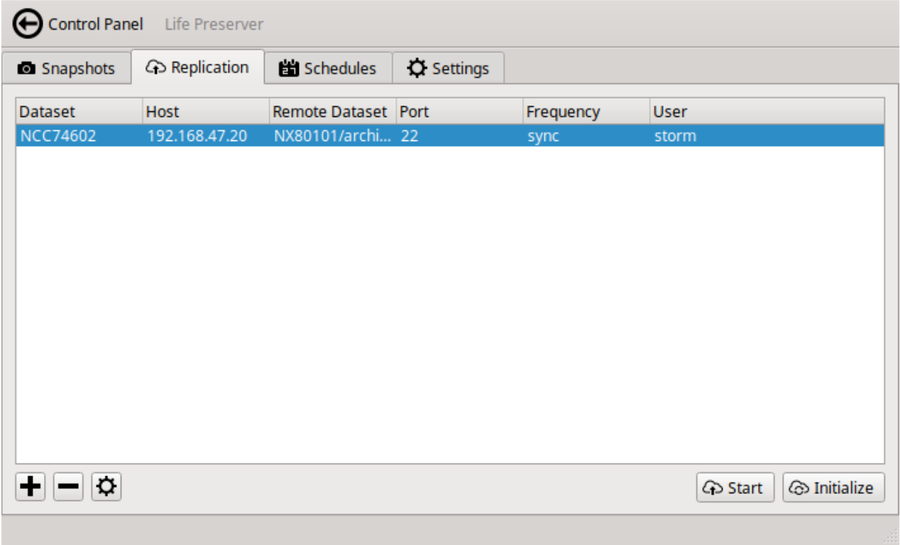
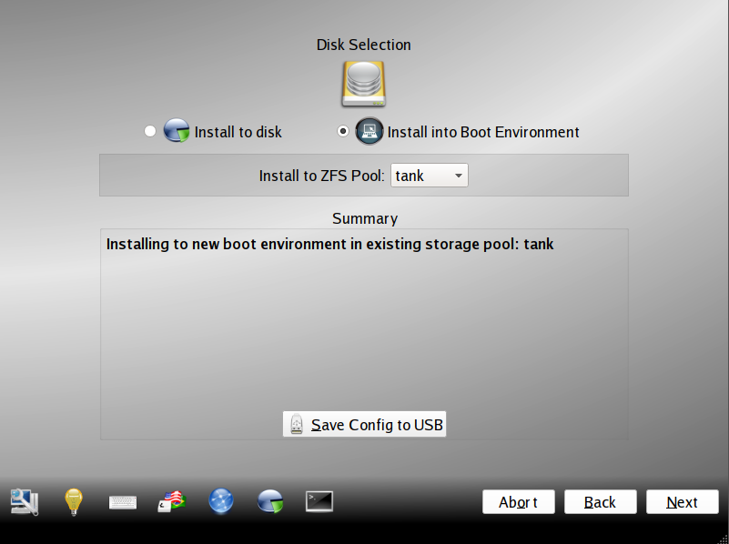
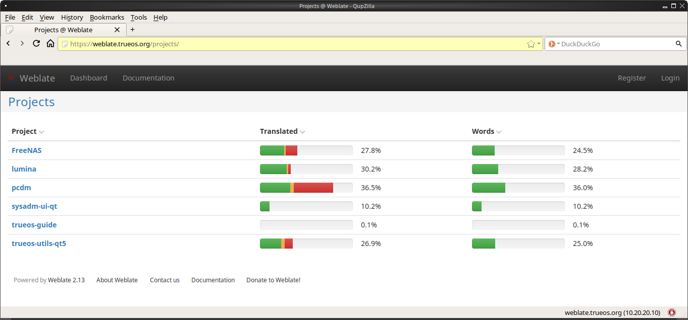
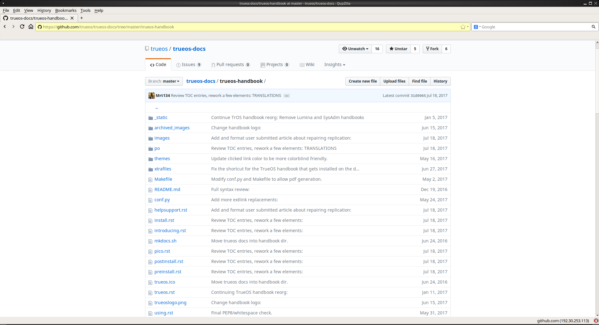
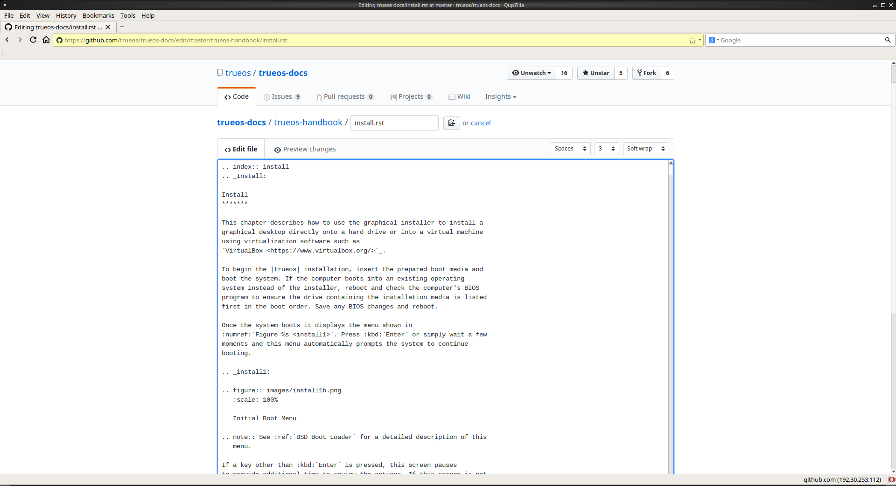

.. index:: help and support
.. _Help and Support:

Help and Support
****************

The |trueos| Project strives to make using |trueos| as easy as possible
for newcomers. If help is needed, there are many ways to get in touch
with the |trueos| community. This chapter describes the available
resources for troubleshooting |trueos|.

As a teacher may have said, "there is no such thing as a stupid
question". However, there are ways to ensure a productive exchange for
all parties involved. The two articles below describe how and why it is
important to follow certain protocols when requesting help:

* `How to Ask Smart Questions (PDF) <http://divajutta.com/doctormo/foo/ask-smart-questions.pdf>`_

* `How To Ask Questions The Smart Way <http://catb.org/~esr/faqs/smart-questions.html>`_

.. index:: troubleshooting
.. _Troubleshooting:

Troubleshooting
===============

This section contains instructions to troubleshoot user discovered
issues with |trueos|. These instructions are not exhaustive, but can
serve as a starting point when encountering problems with |trueos|. If
the particular issue is missing from this section, see the section about
the :ref:`TrueOS Community` for instructions about asking for help from
the wider community.

.. index:: troubleshooting display
.. _Display Help:

Display
-------

If problems exist with the display settings and manually editing
:file:`/etc/X11/xorg.conf` or running :command:`Xorg --config` is
necessary, first tell the |trueos| system to not automatically start X.
To do this, add :samp:`pcdm_enable="NO"` temporarily to
:file:`/etc/rc.conf`, then reboot the system.

The system reboots to a login prompt. After logging in, follow the
instructions in the FreeBSD
`Handbook <https://www.freebsd.org/doc/en_US.ISO8859-1/books/handbook/x-config.html>`_
to manually configure and test Xorg. Once a working configuration is
found, save it to :file:`/etc/X11/xorg.conf`. Then, remove the temporary
line shown above from :file:`/etc/rc.conf` and start PCDM with
:samp:`service pcdm start`.

If the graphics white-out after a suspend or resume, run
:samp:`sysctl hw.acpi.reset_video=1` as the superuser.

If the problem is fixed, carefully add :samp:`hw.acpi.reset_video=1`
to :file:`/etc/sysctl.conf`.

If the monitor goes blank and does not come back, run
:samp:`xset -dpms` as the regular user account.

If the problem is fixed, add :samp:`xset -dpms` to the :file:`.xprofile`
file in the user's home directory.

If any display settings change, click :guilabel:`Apply` for the settings
to be tested. If anything goes wrong during testing, the system returns
to the :guilabel:`Display Settings` screen for the user to try another
setting. Once satisfied with the tested setting, click :guilabel:`"Yes`
to save the setting and proceed. Alternately, click :guilabel:`Skip` to
configure the display settings later.

.. index:: troubleshooting installation
.. _Installation Help:

Installation
------------

Installing |trueos| is usually very simple. However, sometimes problems
occur. This section examines solutions to the most common installation
problems.

The |trueos| installer creates a log which keeps a record of all the
completed steps, as well as any errors. When an installation error
occurs, the |trueos| installer asks to generate an error report. If
:guilabel:`Yes` is chosen, a pop-up message asks to save the error log
to a USB stick. Type :kbd:`y` and insert a FAT formatted USB thumb drive
to copy the log.

While in the installer, read this log to see what went wrong. Click the
black :guilabel:`Emergency Shell and Utilities` icon, then select
:guilabel:`shell` from the :guilabel:`|trueos| Utility Menu`. Read the
log by typing :samp:`more /tmp/.SysInstall.log`.

If the error can not be fixed or you believe an installation bug exists,
include the log saved on the USB stick in your bug report by following
the instructions in :ref:`Report a Bug`.

If the installer does not arrive at the initial GUI installer screen,
try unplugging as many devices as possible, such as webcams, scanners,
printers, USB mice and keyboards. If this solves the problem, plug in
one piece of hardware at a time, then reboot. This helps pinpoint which
device is causing the problem.

Additionally, you may need to enable **EFI** in Virtualbox by navigating
:menuselection:`Settings --> System --> Motherboard` and checking
:guilabel:`Enable EFI (special OSes only)`.

If the computer freezes while probing hardware and unplugging extra
devices does not fix the problem, it is possible that the installation
media is corrupt. If the :ref:`Data Integrity check` on the downloaded
file is correct, try burning the file again at a lower speed.

If the system freezes and the video card is suspected to be the cause,
review the system's BIOS settings. If there is a setting for video
memory, set it to its highest value. Also, check to see if the BIOS is
set to prefer built-in graphics or a non-existent graphics card. On some
systems this is determined by the order of the devices listed; in this
case, be sure the preferred device is listed first. If the BIOS settings
are invisible, move a jumper or remove a battery to make it revert to
the default built-in graphics; check the manual or contact the card
manufacturer for details.

A common cause for problems is the *LBA* (Logical Block Addressing)
setting in the BIOS. If the PC is not booting before or after
installation, check the BIOS and turn *LBA* off (do not leave it on
automatic).

If the SATA settings in the BIOS are set to *compatibility* mode, try
changing this setting to *AHCI*. If the system hangs with a BTX error,
try turning off *AHCI* in the BIOS.

If the USB keyboard is non-functional, check if there is an option in
the BIOS for *legacy support* in relation to the keyboard, USB,
or both. Enabling this feature in the BIOS may solve this issue.

If the installer boots and a *mountroot>* command prompt appears, this
may be due to a change in the location of the boot device. This can
occur when the enumeration of a card reader changes. The solution is
to enter :samp:`ufs:/dev/da1` at the prompt. Depending on the exact
location of the boot media, it may be different from :file:`da1`. Type
:kbd:`?` at the prompt to display the available devices.

If none of the above has fixed the problem, the :ref:`TrueOS Community`
is a valuable resource to assist in tracking down and solving the issue.

.. index:: troubleshooting network
.. _Network Help:

Network
-------

While networking usually "just works" on a |trueos| system, users
sometimes encounter problems, especially when connecting to wireless
networks. Sometimes the problem is due to a configuration error or
sometimes a driver is buggy or unavailable. This section is meant to
help pinpoint the problem, so you can either personally fix it or give
the developers the information they need to fix or create a driver.

When troubleshooting the network configuration, use these files and
commands.

The :file:`/etc/rc.conf` file is read when the system boots up. In
order for the system to configure an interface at boot time, an entry
must exist for it in this file. Entries are automatically created
during installation for each active interface. An entry is added (if it
does not exist) or modified (if it already exists) when configuring an
interface using the :ref:`Network Manager`.

Here is an example of the :file:`rc.conf` entries for an ethernet driver
(**em0**) and a wireless driver (**run0**):

.. code-block:: none

 ifconfig_em0="DHCP"
 wlans_iwm0="wlan0"
 ifconfig_wlan0="WPA SYNCDHCP"

When reading your own file, look for lines beginning with **ifconfig**.
For a wireless interface, also look for lines containing **wlans**.

.. note:: Unlike Linux interface driver names, FreeBSD/|trueos|
   interface driver names indicate the type of chipset. Each driver name
   has an associated manual page where you can learn which devices use
   that chipset and if there are any configuration options or
   limitations for the driver. When reading the man page, do not include
   the interface number. For the above example, read :samp:`man em` and
   :samp:`man iwm`.

:file:`/etc/wpa_supplicant.conf` is used by wireless interfaces and
contains the information needed to connect to a WPA network. If this
file does not already exist, it is created when entering the
:guilabel:`Configuration` screen of a wireless interface.

The command :command:`ifconfig` shows the current state of the
interfaces. When reading through its output, ensure the desired
interface is listed, has a status of **active**, and has an IP address.
Here is a sample :command:`ifconfig` output showing the entries for an
*re0* Ethernet interface and a *run0* wireless interface:

.. code-block:: none

 re0: flags=8843<UP,BROADCAST,RUNNING,SIMPLEX,MULTICAST> metric 0 mtu 1500 options=389b<RXCSUM,TXCSUM,VLAN_MTU,VLAN_HWTAGGING,VLAN_HWCSUM,WOL_UCAST,WOL_MCAST,WOL_MAGIC>
 ether 60:eb:69:0b:dd:4d
 inet 192.168.1.3 netmask 0xffffff00 broadcast 192.168.1.255
 media: Ethernet autoselect (100baseTX <full-duplex>)
 status: active

 run0: flags=8843<UP,BROADCAST,RUNNING,SIMPLEX,MULTICAST> metric 0 mtu 2290
 ether 00:25:9c:9f:a2:30
 media: IEEE 802.11 Wireless Ethernet autoselect mode 11g
 status: associated

 wlan0: flags=8843<UP,BROADCAST,RUNNING,SIMPLEX,MULTICAST> metric 0 mtu 1500
 ether 00:25:9c:9f:a2:30
 media: IEEE 802.11 Wireless Ethernet autoselect (autoselect)
 status: no carrier
 ssid "" channel 10 (2457 MHz 11g)
 country US authmode WPA1+WPA2/802.11i privacy ON deftxkey UNDEF
 txpower 0 bmiss 7 scanvalid 60 protmode CTS wme roaming MANUAL bintval 0

In this example, the ethernet interface (*re0*) is active and has an IP
address. However, the wireless interface (*run0*, which is associated
with *wlan0*) has a status of **no carrier** and does not have an IP
address. In other words, it has not yet successfully connected to the
wireless network.

The :command:`dmesg` command lists the hardware probed during boot time
and indicates if the associated driver was loaded. To search the output
of this command for specific information, pipe it to :command:`grep` as
seen in this example:

.. code-block:: none

 dmesg | grep Ethernet
 re0: <RealTek 8168/8111 B/C/CP/D/DP/E PCIe Gigabit Ethernet> port 0xc000-0xc0ff mem 0xd0204000-0xd0204fff,0xd0200000-0xd0203fff irq 17 at device 0.0 on pci8
 re0: Ethernet address: 60:eb:69:0b:dd:4d

 dmesg |grep re0
 re0: <RealTek 8168/8111 B/C/CP/D/DP/E PCIe Gigabit Ethernet> port 0xc000-0xc0ff mem 0xd0204000-0xd0204fff,0xd0200000-0xd0203fff irq 17 at device 0.0 on pci8
 re0: Using 1 MSI messages
 re0: Chip rev. 0x28000000
 re0: MAC rev. 0x00000000 miibus0: <MII bus> on re0
 re0: Ethernet address: 60:eb:69:0b:dd:4d
 re0: [FILTER]
 re0: link state changed to DOWN
 re0: link state changed to UP

 dmesg | grep run0
 run0: <1.0> on usbus3
 run0: MAC/BBP RT3070 (rev 0x0201), RF RT2020 (MIMO 1T1R), address 00:25:9c:9f:a2:30
 run0: firmware RT2870 loaded

If the desired interface does not show up with :command:`ifconfig` or
:command:`dmesg`, it is possible a driver for this card is not provided
with the operating system. If the interface is built into the
motherboard of the computer, use the :command:`pciconf` command to
discover the type of card:

.. code-block:: none

 pciconf -lv | grep Ethernet
 device = 'Gigabit Ethernet NIC(NDIS 6.0) (RTL8168/8111/8111c)'

 pciconf -lv | grep wireless
 device = 'Realtek RTL8191SE wireless LAN 802.11N PCI-E NIC (RTL8191SE?)'

In this example, there is a built-in Ethernet device using a driver
which supports the *RTL8168/8111/8111c* chipsets. As we saw earlier, the
driver is *re0*. The built-in wireless device was also found but the *?*
indicates a driver for the *RTL8191SE* chipset was not found. A web
search for **FreeBSD RTL8191SE** gives an indication if a driver exists
or is being developed.

The FreeBSD Handbook chapter on
`Wireless Networking <https://www.freebsd.org/doc/en_US.ISO8859-1/books/handbook/network-wireless.html>`_
provides a good overview of how wireless works and offers additional
troubleshooting suggestions.

.. index:: troubleshooting printer
.. _Printer Help:

Printer
-------

Here are some solutions to common printing problems:

* **A test page prints but it is all garbled:** This typically means the
  system is using the wrong driver. If your specific model was not
  listed, click :menuselection:`Adminstration --> Modify Printer` for
  the printer in the :guilabel:`Printers` tab. In the screen shown in
  :ref:`print7`, try choosing another driver close to your model
  number. If trial and error does not fix the problem, see if there are
  any suggestions for your model in the
  `Open Printing database <http://www.openprinting.org/printers>`_. A
  web search for *freebsd* followed by the printer model name may also
  help you find the correct driver to use.

* **Nothing happens when you try to print:** In this case, type
  :samp:`tail -f /var/log/cups/error_log` in a console and then try to
  print a test page. Any error messages will appear in the console. If
  the solution is not obvious from the error messages, try a web search
  for the error message. If you are still stuck, post the error, the
  model of your printer, and your version of |trueos| as you
  :ref:`Report a Bug`.

.. index:: troubleshooting replication
.. _Replication Help:

Replication
-----------

This is a recreation of the user submitted article:
**Forcibly resetting ZFS replication using the command line**
**lpreserver**. A special **"thank you!"** to |trueos| user
**VulcanRidr** for providing this article.

:ref:`ZFS <ZFS Overview>` replication can be somewhat complex, and
keeping all the fiddly bits aligned can be fraught with danger.

I recently had both of my |trueos| machines start failing to replicate.
My desktop is called **defiant** and it has two pools: **NX74205** and
**NCC1764**. My laptop is named **yukon** with a single pool,
**NCC74602**. I am replicating to my FreeNAS server, named **luna**, to
the dataset :file:`NX80101/archive/<FQDN>`. I will focus on what I did
to get **yukon** working again in this document.

.. _Original Indications:

Original Indications
^^^^^^^^^^^^^^^^^^^^

The |sysadm| client tray icon was pulsing red. Right-clicking on the
icon and clicking :guilabel:`Messages` showed the message:

.. code-block:: none

   FAILED replication task on NCC74602 -> 192.168.47.20: LOGFILE: /var/log/lpreserver/lpreserver_failed.log

This was lifted from :file:`/var/log/lpreserver/lpreserver.log`.
:file:`/var/log/lpreserver/lastrep-send.log` shows very little
information:

.. code-block:: none

   send from @auto-2017-07-12-01-00-00 to NCC74602/ROOT/12.0-CURRENT-up-20170623_120331@auto-2017-07-14-01-00-00
   total estimated size is 0
   TIME        SENT    SNAPSHOT

And no useful errors were being written to the
:file:`lpreserver_failed.log`.

.. _Repairing Replication:

Repairing Replication
^^^^^^^^^^^^^^^^^^^^^

**First Attempt:**

My first approach was to use the |sysadm| Client (see the
:sysclbk:`Life Preserver <life-preserver>` section for more details).

:numref:`Figure %s <helprep1>` shows my Life Preserver Replication tab:

.. _helprep1:

   Attempt 1: GUI Replication Repair

I clicked on the dataset in question, then clicked
:guilabel:`Initialize`. I waited for a few minutes, then clicked
:guilabel:`Start`. I was immediately rewarded with a pulsing red icon
in the system tray and received the same messages as noted above.

**Second Attempt:**

I was working with and want to give special thanks to users
*@RodMyers* and *@NorwegianRockCat*. They suggested I use the
:command:`lpreserver` command line. So I issued these commands:

.. code-block:: none

   sudo lpreserver replicate init NCC74602 192.168.47.20
   sudo lpreserver replicate run NCC74602 192.168.47.20

Unfortunately, the replication failed again, with these messages:

.. code-block:: none

   Fri Jul 14 09:03:34 EDT 2017: Removing NX80101/archive/yukon.sonsofthunder.nanobit.org/ROOT - re-created locally
   cannot unmount '/mnt/NX80101/archive/yukon.sonsofthunder.nanobit.org/ROOT': Operation not permitted
   Failed creating remote dataset!
   cannot create 'NX80101/archive/yukon.sonsofthunder.nanobit.org/ROOT': dataset already exists

It turned out there were a number of child sets. I logged into the
FreeNAS (**luna**) and issued this command as **root**:

:samp:`# zfs destroy -r NX80101/archive/defiant.sonsofthunder.nanobit.org`

Then I ran the :command:`replicate init` and :command:`replicate run`
commands again from the |trueos| host. Replication now works and
continues to work, at least until the next fiddly bit breaks.

.. index:: troubleshooting sound
.. _Sound Help:

Sound
-----

Type :command:`mixer` from the command line to see the current sound
settings

.. code-block:: none

 mixer
 Mixer vol      is currently set to   0:0
 Mixer pcm      is currently set to 100:100
 Mixer speaker  is currently set to 100:100
 Mixer mic      is currently set to  50:50
 Mixer rec      is currently set to   1:1
 Mixer monitor  is currently set to  42:42
 Recording source: monitor

If any of these settings are set to *0*, set them to a higher value by
specifying the name of the mixer setting and a percentage value up to
*100*:

.. code-block:: none

 mixer vol 100
 Setting the mixer vol from 0:0 to 100:100.

To make the change permanent, create a file named :file:`.xprofile` in
the home directory containing the corrected mixer setting.

If only one or two mixer settings are available, the default mixer
channel needs to change. As the superuser, use
:samp:`sysctl -w hw.snd.default_unit=1` to alter the mixer channel.

To see if the mixer has changed to the correct channel, type
:command:`mixer` again. If there are still only one or two mixer
settings, try setting the :command:`sysctl` value to *2*, and, if
necessary, *3*.

Once all of the mixer settings appear and none are set to *0*, sound
typically works. If it still does not, these resources can help
pinpoint the problem:

* `FreeBSD Handbook Sound Section <https://www.freebsd.org/doc/en_US.ISO8859-1/books/handbook/sound-setup.html>`_

* `FreeBSD Sound Wiki <https://wiki.FreeBSD.org/Sound>`_

If sound issues persist, consider asking the :ref:`TrueOS Community` for
help or :ref:`Report a Bug`. When reporting an issue, be sure to include
both the version of |trueos| and name of the sound card.

.. index:: upgrade from PCBSD
.. _Upgrading from PCBSD 10.x to TrueOS:

Upgrading from |pcbsd| 10.x to |trueos|
=======================================

.. warning:: If any user account uses PersonaCrypt, please be sure to
   save any encryption keys to a safe place (e.g. a thumb drive) before
   beginning the upgrade process. Loss of encryption keys may result in
   being unable to import the home directory after the upgrade is
   complete.

If the system is using |pcbsd| 10.x, the option to update to |trueos|
does not appear in the Control Panel version of Update Manager. This is
because a new installation is required in order to migrate to |trueos|.
However, the |trueos| installer allows the user to keep all their
existing data and home directories as it provides the ability to
install |trueos| into a new boot environment. In other words, the new
operating system and updated applications are installed while the ZFS
pool and any existing boot environments are preserved. Since the new
install is in a boot environment, the option to boot back into the
previous |pcbsd| installation remains.

.. note:: This option overwrites the contents of :file:`/etc`. If any
   custom configurations exist, save them to a backup or the home
   directory first. Alternately, use the |sysadm|
   :sysclbk:`Boot Environment Manager <boot-environment-manager>`
   post-installation to mount the previous |pcbsd| boot environment to
   copy over any configuration files which may not have been backed up.

To perform the installation to a new boot environment, start the
|trueos| installation as described earlier in the chapter. In the
:ref:`System Selection` screen, choose to install either a desktop or
a server. Press :guilabel:`Next` to view the :guilabel:`Disk Selection`
screen, shown in :numref:`Figure %s <upgrade1>`.

.. _upgrade1:

   Disk Selection

|trueos| automatically detects if the drive has an existing boot
environment and fills in the data as necessary. If no boot environments
are detected, :guilabel:`Install into Boot Environment` is invisible.
To upgrade, select :guilabel:`Install into Boot Environment` and
choose which existing pool to install into from the drop-down menu. In
the :ref:`Disk Selection Screen <upgrade1>`, the user is installing into
the existing **tank** pool. Press :guilabel:`Next` when ready.

.. warning:: Be sure :guilabel:`Install into Boot Environment` is
   checked before proceeding, or data can be lost.

A pop-up will appear and ask to start the default Full-Disk
installation. Click :guilabel:`Yes` to begin the installation.

When the installation is complete, reboot the system and remove the
installation media. The post-installation screens run as described in
the :ref:`Booting Into TrueOS <Booting Into TrueOS>` section to help configure the new
installation.

.. warning:: During the :ref:`Create a User` process, recreate the
   primary user account using the same user name and user id (UID) from
   the previous |pcbsd| system. This allows |trueos| to associate the
   existing home directory with that user. Once logged in, use the
   |sysadm| :sysclbk:`User Manager <user-manager>` to recreate any other
   user accounts or to reassociate any PersonaCrypt accounts.

.. index:: trueos community
.. _TrueOS Community:

The |trueos| Community
======================

The |trueos| community has grown and evolved since the project's
inception. A wide variety of chat channels and forum options are now
available for users to interact with each other, contributors to the
project, and the core development team.

.. index:: Telegram Community
.. _Telegram Community:

Telegram Community
------------------

The |trueos| Project uses `Telegram <https://telegram.org/>`_ to provide
real-time chat and collaboration with |trueos| users and developers.
Telegram is available in a web browser or as downloadable applications
for Android, macOS, and PC/Mac/Linux.

To access the TrueOS Telegram community, point a web browser to
https://web.telegram.org. Sign in with a valid phone number and join
the
`TrueOS Community channel <https://web.telegram.org/#/im?p=@TrueOSCommunity>`_.

Telegram maintains a full archive of the chat history. This means lengthy
conversations about hardware issues or workarounds are always available
for reference.

Here are some tips about the community channel:

* Most of the regular users are always logged in, even when they are
  away from their computer or are busy doing other things. If no one
  responds immediately, do not get mad, leave the channel, and never
  come back again. Stick around for a while to see if anyone responds.

* Users represent many different time zones. It is quite possible it is
  late at night or very early in the morning for some users when asking
  a question.

* Do not post large error messages in the channel. Instead, use a
  pasting service such as https://pastebin.com/ and refer to the URL on
  channel.

* Be polite and do not demand a response from others.

* It is considered rude to "Chat Privately" with someone who does not
  know you without first asking their permission. If no one answers
  the question, do not start chatting privately with unkown people in
  the room.

* The first time joining the channel, it is okay to say "hi" and
  introduce yourself. If a new person joins the channel, feel free to
  welcome them and to make them feel welcome.

.. index:: TrueOS Subreddit
.. _TrueOS Subreddit:

|trueos| Subreddit
------------------

The |trueos| Project also has a
`Subreddit <https://www.reddit.com/r/TrueOS/>`_ for users who prefer to
use Reddit to ask questions and to search for or post how-tos. A Reddit
account is not required in order to read the Subreddit, but it is
necessary when submitting new posts or commenting on existing posts.

.. index:: Discourse
.. _Discourse:

Discourse
---------

|trueos| also has a `Discourse forum <https://discourse.trueos.org/>`_
managed concurrently with the Subreddit. Functionally similar to the
Subreddit, a new user needs to sign up with Discourse in order to create
posts, but it is possible to view the current posts without an account.

.. index:: IRC
.. _IRC:

IRC
---

Like many open source projects, |trueos| has an Internet Relay Chat
(IRC) channel so users can chat and get help in real time. To get
connected, use this information in your IRC client:

* Server name: irc.freenode.net
* Channel name: #trueos (note the :kbd:`#` is required)

|appcafe| has an IRC category where you can find IRC client software.
If you do not wish to install an IRC client, you can use the web
interface to view #trueos: https://webchat.freenode.net/

IRC is a great way to chat with other users and get answers to your
questions. Here are a few things to keep in mind if you ask a question
on IRC:

* Most of the regular users are always logged in, even when they are
  away from their computer or are busy doing other things. If you do not
  get an answer right away, do not get mad, leave the channel, and never
  come back again. Stick around for a while to see if anyone responds.

* IRC users represent many different time zones. It possibly late at
  night or very early in the morning for some users when you ask a
  question.

* Do not post error messages in the channel as the IRC software can
  kick you out for flooding and it is considered to be bad etiquette.
  Instead, use a pasting service such as
  `pastebin <https://pastebin.com/>`_ and refer to the URL on channel.

* Be polite and do not demand that others answer your question.

* It is considered rude to DM (direct message) someone who does not know
  you. If no one answers your question, do not start DMing people you do
  not know.

* The first time you join a channel, it is okay to say "hi" and
  introduce yourself.

.. index:: TrueOS Social Media
.. _Social Media:

Social Media
------------

The |trueos| project maintains several social media sites to help users
keep up-to-date with what is happening and to provide venues for
developers and users to network with each other. Anyone is welcome to
join.

* `Official TrueOS® Blog <https://www.trueos.org/blog/>`_

* `TrueOS® Project on Twitter <https://twitter.com/TrueOS_Project/>`_

* `TrueOS® Facebook Group <https://www.facebook.com/groups/4210443834/>`_

* `TrueOS® LinkedIn Group <https://www.linkedin.com/start/join?session_redirect=https%3A%2F%2Fwww.linkedin.com%2Fgroups%2F1942544&trk=login_reg_redirect>`_

.. index:: contributing to TrueOS
.. _Get Involved:

Contributing to |trueos|
========================

Many in the |trueos| community have assisted in its development,
providing valuable contributions to the project. |trueos| is a large
project with many facets, meaning there is ample opportunity for a wide
variety of skill sets to easily improve the project.

.. index:: bug reporting
.. _Report a bug:

Report a bug
------------

One of the most effective ways to assist the |trueos| Project is by
reporting problems or bugs encountered while using |trueos|. Anyone can
report a |trueos| bug. Here is a rundown of the |trueos| bug
reporting tools:

* |trueos| uses a `GitHub repository <https://github.com/trueos/>`_
  to manage bugs. A GitHub account is required before bugs can be
  reported. Navigate to https://github.com/, fill in the required
  fields, and click :guilabel:`Sign up for GitHub` to create a new
  GitHub account.

.. note:: The GitHub issues tracker uses email to update contributors
   on the status of bugs. Please use a valid and frequently used
   email address when creating a GitHub account.

* The |trueos| code is organized into many repositories representing
  the |lumina| desktop, the graphical utilities, |sysadm|, and various
  other applications. When reporting a bug, select the
  `trueos-core <https://github.com/trueos/trueos-core>`_ repository. If
  the bug is specific to |lumina|, use the
  `lumina <https://github.com/trueos/lumina>`_ repository. Documentation
  bugs are tracked in their respective *-docs* repositories. Issues with
  any project website are tracked in
  `trueos-website <https://github.com/trueos/trueos-website>`_.

* After clicking a repository's :guilabel:`Issues` tab, use the *search*
  bar to confirm no similar bug report exists. If a similar report does
  exist, add any additional information to the report using a comment.
  While it is not required to log in to search existing bugs, adding a
  comment or creating a new report does require signing into GitHub.

* To create a new bug report, navigate to the desired repository and
  click :menuselection:`Issues --> New Issue`.
  :numref:`Figure %s <bug1>` shows the creation of a new bug report.

.. _bug1:

.. figure:: images/bug1.png
   :scale: 100%

   Creating a Bug Report

Here are some basic guidelines for creating useful bug reports:

**Title Area**

The ideal title is clear, concise, and informative. Here are some
recommendations for creating a title:

* Be objective and clear (and refrain from using idioms or slang).
* Include the application name if the issue is related to an
  application.
* Include keywords from any error messages you receive.
* Avoid using vague language such as "failed", "useless", or "crashed".

Here are some examples to show the difference between a helpful title
and a non-helpful title:

.. code-block:: none

 Example 1:

 Non-Helpful:
 Lumina-FM crashed.
 Helpful:
 Lumina-FM crashed after clicking on a directory name.

 Example 2:

 Non-Helpful:
 Extracting an archive doesn't work.
 Helpful:
 Lumina-Archiver shows the error "file not supported" when opening a
 .cab file.

**Comment Area**

Like with the *title*, being clear and concise is extremely helpful.
Many people feel they must fill this area with lots of information.
While listing a lot of information seems helpful, specific details are
often more useful in issue resolution.

The most important pieces of information to include are:

A) What happened.

B) What you expected to happen.

C) (**Critical**) Steps to reproduce the issue. Please provide the exact
   steps you can take to produce this issue from a fresh boot. If the
   issue is application specific, provide the exact steps from a fresh
   start of the application.

D) List any changes you may have made to your system from its initial
   install. In most cases, this does not need to be extremely detailed.
   It is very helpful for contributors to know if you have installed or
   removed any major applications or if you have changed any OS
   settings. If you are unsure of all your changes, list what comes to
   mind.

E) List the hardware of the system where the issue occurred. If you are
   using an OEM laptop or desktop, listing the brand or model is usually
   sufficient. If the issue is wireless related, please check the system
   manufacturer's website for your brand or model and let us know what
   wireless cards may be shipped in your laptop. If you are using a
   custom built desktop, all we primarily need to know is CPU, RAM, and
   GPU. If you happen to know the motherboard model, please include it
   too. Attaching a copy of :file:`/var/run/dmesg.boot` is also helpful,
   as this file shows the hardware probed the last time the |trueos|
   system booted. Finally, including the output of :samp:`uname -a` is
   helpful.

Being clear and direct with your report and answers is very helpful. As
we are not watching you use your computer and do not see what you see,
we are totally dependent on your explanation. We only know what you tell
us. Some users worry they have not provided enough information when they
file a ticket. In most cases, providing the information for these five
items is sufficient. If more information is required, you may see
questions posted to your bug report.

**Additional Information**

Please do not think you are unable to file your bug ticket without
additional information. Providing the listed information above is the
most important information for contributors to know. Providing logs does
not help as much as those five pieces of information. In some cases,
only providing logs to an otherwise empty bug report results in our
being unable to resolve your issue.

Additionally useful information may include:

* Screen captures of the error.
  :lumbk:`Lumina Screenshot <luminautl.html#screenshot>` is a useful
  tool to quickly screenshot any errors in progress.
* Command Line Output Logs
* Truss Logs
* Debugger Backtrace Logs

After describing the issue, click :guilabel:`Submit new issue` to create
the issue. The bug tracker attaches a unique number to the report and
sends update messages to your registered email address whenever activity
occurs with the bug report.

.. index:: beta testing
.. _Become a Beta Tester:

Become a Beta Tester
--------------------

If you enjoy tinkering with operating systems and have a bit of spare
time, one of the most effective ways to assist the |trueos| community is
reporting problems you encounter while using |trueos|.

If a spare system or virtual machine is available, you can also download
and test the latest UNSTABLE patches (see :ref:`Updating TrueOS`).
Having as many people as possible using |trueos| on many different
hardware configurations assists the Project in finding and fixing bugs.
The end result is more polished and usable OS for the entire community.

If you wish to become a tester, join the Telegram
`TrueOS Community channel <https://web.telegram.org/#/im?p=@TrueOSCommunity>`_.
Updates are typically announced announced here. You can also see any
problems other testers are finding and can check to see if the problem
exists on your hardware as well.

Anyone can become a beta tester. If you find a bug while testing, be
sure to accurately describe the situation when
:ref:`Reporting a bug <Report a bug>` so it can be fixed as soon as
possible.

.. index:: translations
.. _Become a Translator:

Translation
-----------

If interested in translating |trueos| into your native language, start
by choosing which of the three translation areas to work in:

1. Translate the graphical menus within the |trueos| operating system.

2. Translate the documentation published with |trueos|.

3. Translate the |trueos| website.

This section describes each of these translation areas in more detail
and how to begin as a translator.

Regardless of the type of desired translation, you should first join the
`TrueOS Community channel <https://web.telegram.org/#/im?p=@TrueOSCommunity>`_.
The first time joining the channel, introduce yourself and indicate
which language(s) and which type(s) of translations you can assist with.
This allows you to meet other volunteers and stay informed of any
notices or updates affecting translators.

.. index:: interface translation
.. _Interface Translation:

Interface Translation
^^^^^^^^^^^^^^^^^^^^^

|trueos| uses `Weblate <https://weblate.org/en/>`_ for managing
localization of the menu screens used by the installer and the |trueos|
utilities. Weblate makes it easy to find out if your native language
has been fully localized for |trueos|. It also makes it easy to verify
and submit translated text, as it provides a web editor and commenting
system. This means translators can spend more time making and
reviewing translations rather than learning how to use a translation
tool.

To assist with a localization, open the
`TrueOS® translation projects <https://weblate.trueos.org/projects/>`_
in a web browser. An example is seen in
:numref:`Figure %s <translate1>`.

.. _translate1:

   |trueos| Weblate Translation System

Before editing a translation, first create a a login account and verify
the activation email. Once logged in, click
:guilabel:`Manage your languages`, shown in
:numref:`Figure %s <translate2>`.

.. _translate2:

.. figure:: images/translate2.png
   :scale: 100%

   Weblate Dashboard

In the screen shown in :numref:`Figure %s <translate3>`, use the
:guilabel:`Interface Language` drop-down menu to select the language for
the Weblate interface. Then, in :guilabel:`Translated languages`, use
the :guilabel:`arrows` to add or remove the languages you wish to
translate. Once any selections are made, click :guilabel:`Save`.

.. _translate3:

.. figure:: images/translate3.png
   :scale: 100%

   Manage Languages

.. note:: If the language you wish to translate is missing from the
   "Translated languages" menu, request its addition in the
   `TrueOS Community channel <https://web.telegram.org/#/im?p=@TrueOSCommunity>`_.

Next, click :guilabel:`Projects` at the top of the screen to select
a localization project. In the example shown in
:numref:`Figure %s <translate4>`, the user has selected the
*trueos-utils-qt5* project, which represents the localization of the
|trueos| graphical interface. This screen shows the components of the
project and the current progress of each component's translation. The
green bar indicates the localization percentage. If a component is not
at 100%, this means its untranslated menus will instead appear in
English.

.. _translate4:

.. figure:: images/translate4.png
   :scale: 100%

   Project Selection

To start translating, click a component name. In the screen shown in
:numref:`Figure %s <translate5>`, select a language and click
:guilabel:`Translate`.

.. _translate5:

.. figure:: images/translate5.png
   :scale: 100%

   Translation Languages

In the example shown in :numref:`Figure %s <translate6>`, the user has
selected to translate the *pc-installgui* component into the Spanish
language. The English text is displayed in the :guilabel:`Source` field
and the translator can type the Spanish translation into the
:guilabel:`Translation` field. Use the :guilabel:`arrows` near the
:guilabel:`Strings needing action` field to navigate between strings
to translate.

.. _translate6:

.. figure:: images/translate6.png
   :scale: 100%

   Translation Editor

If assistance is needed with either a translation or the Weblate system,
ask for help in the
`TrueOS Community channel <https://web.telegram.org/#/im?p=@TrueOSCommunity>`_.

.. index:: documentation translation
.. _Documentation Translation:

Documentation Translation
^^^^^^^^^^^^^^^^^^^^^^^^^

The source for the |trueos| Users Handbook is stored in the
`TrueOS® github repository <https://github.com/trueos/trueos-docs/tree/master/trueos-handbook>`_.
This allows the documentation and its translations to be built with
the operating system. Documentation updates are automatically pushed
to the |trueos| website and, when the system is updated using the
|sysadm| :sysclbk:`Update Manager <update-manager>`, the doc updates
are installed to a local copy named
:file:`/usr/local/share/trueos/handbook/trueos.html`. This keeps an
updated local copy of the handbook available on every user's system.

The |trueos| build server provides the HTML version of the |trueos|
Users Handbook. Instructions for building your own HTML, PDF, or EPUB
version can be found in this
`README.md <https://github.com/trueos/trueos-docs/blob/master/trueos-handbook/README.md>`_.

The documentation source files are integrated into the Weblate
translation system so the |trueos| documentation can be translated
using a web browser. The process is similar to
:ref:`Interface Translation` except **trueos-guide** must be selected
from the :guilabel:`Projects` drop-down menu shown in :ref:`translate4`.

It is important to be aware of a few elements when translating the
documentation:

At this time, some formatting tags are still displayed in raw text, as
seen in the examples in :numref:`Figure %s <translate7>` and
:numref:`Figure %s <translate8>`.

.. danger:: Do not remove the formatting as this can break the
   documentation build for that language.

In :ref:`translate7`, it is fine to translate the phrase "Using the
Text Installer", but care must be taken to avoid removing any of the
surrounding colons and backticks, or to change the text of the *ref*
tag. In :ref:`translate8`, the asterisks are used to bold the words
*bare minimum*. It is fine to translate *bare minimum*, but do **not**
remove the asterisks.

.. _translate7:

.. figure:: images/translate7.png
   :scale: 100%

   Formatting Characters - Do Not Remove

.. _translate8:

.. figure:: images/translate8.png
   :scale: 100%

   More Formatting Characters

To build a local HTML copy that includes the latest translations, either
for personal use or to visualize the translated Guide, type these
commands from the command line in |trueos|:

.. code-block:: none

 sudo pkg install trueos-toolchain
 rehash
 git clone git://github.com/trueos/trueos-docs
 cd trueos-docs/trueos-handbook
 sudo make i18n
 make html
 ls _build
 doctrees                html-es                 html-tr    trueos-handbook-i18n.txz
 html                    html-fr                 html-uk
 html-da                 html-id                 locale
 html-de                 html-pt_BR              locale-po

This makes an HTML version of the Guide for each of the available
translations. In this example, translations are available for English
(in :file:`html`), Danish, German, Spanish, French, Indonesian,
Brazilian Portuguese, Turkish, and UK English. To update the HTML at a
later time:

.. code-block:: none

 cd ~/trueos-docs
 git pull
 cd trueos-docs/trueos-handbook
 sudo make i18n
 sudo make html

.. index:: website translation
.. _Website Translation:

Website Translation
^^^^^^^^^^^^^^^^^^^

If you are interested in translating the |trueos| website, introduce
yourself in the
`TrueOS Community channel <https://web.telegram.org/#/im?p=@TrueOSCommunity>`_
or open a new topic in our
`Discourse forum <https://discourse.trueos.org/>`_

Currently, the website is being translated into several languages,
including: Dutch, French, German, Polish, Spanish, Swedish, and Turkish.

.. index:: become a developer
.. _Development:

Development
-----------

If you like programming, and especially coding on FreeBSD, we would
love to see you join the |trueos| team as a |trueos| contributor.
Developers who want to help improve the |trueos| codebase are always
welcome! To participate in core development, introduce yourself in the
`TrueOS® Discourse forum <https://discourse.trueos.org/>`_. Feel free
to browse the :guilabel:`Issues` in the
`TrueOS® repository <https://github.com/trueos/>`_. If you see
something you want to work on, or have a proposal for a project to add
to |trueos|, mention it and someone will be happy to help you get
started.

Most of the |trueos| specific GUI tools are developed in C++ using Qt
libraries and other non-GUI development is done using standard Bourne
shell scripts. There may be cases where other languages or libraries
are needed, but those are evaluated on a case-by-case basis.

.. index:: get the source code
.. _Getting the Source Code:

Getting the Source Code
^^^^^^^^^^^^^^^^^^^^^^^

The |trueos| source code is available from
`GitHub <https://github.com/trueos/>`_. The code is organized into
repositories which represent the |lumina| desktop, the graphical
utilities, |sysadm|, and various other applications. :command:`git`
needs to be installed in order to download the source code. When using
|trueos|, :command:`git` is included in the base install.

To download the source code, :command:`cd` to the directory to store
the source code and specify the name of the desired repository. In
this example, the user is downloading the source for the graphical
utilities:

.. code-block:: none

 ~% cd Projects
 ~/Projects% git clone git://github.com/trueos/trueos-utils-qt5

This creates a directory with the same name as the repository.

.. note:: To keep the local copy in sync with the official repository,
   periodically run :samp:`git pull` within the directory.

Before compiling any source, ensure the Ports Collection is installed.
At this time, **git** is used to fetch and update ports (see
:ref:`FreeBSD Ports`).

Fetching ports for the first time (as root):

.. code-block:: none

 # git clone http://github.com/trueos/freebsd-ports.git /usr/ports

Update an existing :file:`ports` directory (as root):

.. code-block:: none

 # cd /usr/ports

 # git pull

Then, :command:`cd` to the directory containing the source to build and
run the :file:`mkport.sh` script. In this example, the developer wants
to compile the graphical utilities:

.. code-block:: none

 cd trueos-utils-qt5

 ./mkport.sh /usr/ports/

This creates a port which can then be installed. The name of the port is
located in :file:`mkport.sh`. This example determines the name of the
port directory, changes to it, and then builds the port. Since this
system is already running the |trueos| graphical utilities,
:command:`reinstall` is used to overwrite the current utilities:

.. code-block:: none

 grep port= mkport.sh
 port="sysutils/trueos-utils-qt5"
 cd /usr/ports/sysutils/trueos-utils-qt5
 make reinstall

If you plan to make source changes, several Qt IDEs are available in
the |sysadm| :sysclbk:`AppCafe <appcafe>`. The
`QtCreator <http://wiki.qt.io/Category:Tools::QtCreator>`_ application
is a full-featured IDE designed to help new Qt users get up and running
faster while boosting the productivity of experienced Qt developers.
`Qt Designer <http://doc.qt.io/archives/qt-4.8/designer-manual.html>`_ is lighter
weight as it is only a :file:`.ui` file editor and does not provide any
other IDE functionality.

If planning to submit changes for inclusion in |trueos|, fork the
repository using the instructions in
`fork a repo <https://help.github.com/articles/fork-a-repo>`_. Make your
changes to the fork, then submit them by issuing a
`git pull request <https://help.github.com/articles/using-pull-requests>`_.
Once your changes have been reviewed, they can either be committed or
returned with suggestions for improvement.

.. index:: design guidelines
.. _Design Guidelines:

Design Guidelines
^^^^^^^^^^^^^^^^^

|trueos| is a community driven project relying on the support of
developers in the community to help in the design and implementation
of new utilities and tools for |trueos|. The project aims to present a
unified design so programs feel familiar to users. As an example, while
programs could have **File**, **Main**, or **System** as their first
entry in a menu bar, **File** is used as the accepted norm for the first
category on the menu bar.

This section describes a small list of guidelines for menu and program
design in |trueos|.

Any graphical program that is a fully featured utility, such as
:sysclbk:`Life Preserver <life-preserver>`, should have a *File* menu.
However, file menus are not necessary for small widget programs or
dialogue boxes. When making a file menu, a good rule of thumb is
*keep it simple*. Most |trueos| utilities do not need more than two or
three items on the file menu.

**Configure** is our adopted standard for the category containing
settings or configuration-related settings. If additional categories
are needed, check to see what other |trueos| utilities are using.

File menu icons are taken from the *KDE Oxygen* or *material-design*
themes located in :file:`/usr/local/share/icons/oxygen`. Use these file
menu icons so there are not too many different icons for the same
function. :numref:`Table %s <common icons>` lists some commonly used
icons and their default file names.

.. tabularcolumns:: |>{\RaggedRight}p{\dimexpr 0.32\linewidth-2\tabcolsep}
                    |>{\RaggedRight}p{\dimexpr 0.32\linewidth-2\tabcolsep}
                    |>{\RaggedRight}p{\dimexpr 0.36\linewidth-2\tabcolsep}|

.. _common icons:

.. table:: Commonly Used File Menu Icons
   :class: longtable

   +-----------+-----------------+--------------------+
   | Function  | File Menu Icon  | File Name          |
   +===========+=================+====================+
   | Quit      | row 1, cell 2   | window-close.png   |
   +-----------+-----------------+--------------------+
   | Settings  | row 2, cell 2   | configure.png      |
   +-----------+-----------------+--------------------+

|trueos| utilities use these buttons:

* **Apply:** Executes settings changes and leaves the window open.

* **Close:** Exits program without applying settings.

* **OK:** Closes dialogue window and saves settings.

* **Cancel:** Closes dialog window without applying settings.

* **Save:** Keeps the current settings and closes the window.

Fully functional programs like
:sysclbk:`Life Preserver <life-preserver>` do not use close buttons on
the front of the application. Basically, whenever there is a *File*
menu, that and an :guilabel:`x` in the top right corner of the
application are used instead. Dialogues and widget programs are
exceptions to this rule.

Many users benefit from keyboard shortcuts and we aim to make them
available in every |trueos| utility. Qt makes it easy to assign
keyboard shortcuts. For instance, to configure keyboard shortcuts for
browsing the **File** menu, put *&File* in the text slot for the menu
entry when making the application. Whichever letter has the :kbd:`&`
symbol in front of it becomes the hot key. You can also make a shortcut
key by clicking the menu or submenu entry and assigning a shortcut key.
Be careful not to duplicate hot keys or shortcut keys. Every key in a
menu and submenu should have a key assigned for ease of use and
accessibility. :numref:`Table %s <shortcuts>` and
:numref:`Table %s <hotkeys>` summarize the commonly used shortcut and
hot keys.

.. tabularcolumns:: |>{\RaggedRight}p{\dimexpr 0.50\linewidth-2\tabcolsep}
                    |>{\RaggedRight}p{\dimexpr 0.50\linewidth-2\tabcolsep}|

.. _shortcuts:

.. table:: Shortcut Keys
   :class: longtable

   +---------------+---------+
   | Shortcut Key  | Action  |
   +===============+=========+
   | CTRL + Q      | Quit    |
   +---------------+---------+
   | F1            | Help    |
   +---------------+---------+

.. tabularcolumns:: |>{\RaggedRight}p{\dimexpr 0.50\linewidth-2\tabcolsep}
                    |>{\RaggedRight}p{\dimexpr 0.50\linewidth-2\tabcolsep}|

.. _hotkeys:

.. table:: Hot Keys
   :class: longtable

   +---------+----------------+
   | Hot Key | Action         |
   +=========+================+
   | Alt + Q | Quit           |
   +---------+----------------+
   | Alt + S | Settings       |
   +---------+----------------+
   | Alt + I | Import         |
   +---------+----------------+
   | Alt + E | Export         |
   +---------+----------------+
   | ALT + F | File Menu      |
   +---------+----------------+
   | ALT + C | Configure Menu |
   +---------+----------------+
   | ALT + H | Help Menu      |
   +---------+----------------+

When saving an application's settings, use the *QSettings* class
whenever possible. There are two different *organizations*, depending
whether the application is running with *root* or *user* permissions.
Use **TrueOS** as the *organization* for applications which run with
user permissions and **TrueOS-root** for applications which are started
with root permissions via :command:`sudo`. Proper use prevents the
directory where settings files are saved from being locked down by
*root* applications, allowing user applications to save and load their
settings. Examples *1* and *2* demonstrate how to use the *QSettings*
class for each type of permission.

**Example 1: User Permission Settings**

.. code-block:: none

 (user application - C++ code):
 QSettings settings("TRUEOS", "myapplication");

**Example 2: Root Permission Settings**

.. code-block:: none

 (root application - C++ code):
 QSettings settings("TRUEOS-root", "myapplication");

These resources are also helpful for developers:

* `Qt 5.4 Documentation <http://doc.qt.io/qt-5/index.html>`_

* `C++ Tutorials <http://www.cplusplus.com/doc/tutorial/>`_

.. index:: documentation
.. _Documentation:

Documentation
-------------

|trueos| is always looking for documentation contributions from its
users. The project currently has a large amount of documentation, and
the community is instrumental in keeping the information up to date and
providing tips and instructions to solve specific problems. However, the
sheer amount of documentation available coupled with the specific
documentation tools can make contributing appear daunting. Actually, the
reverse is true: **contributing to the documentation is easy!**

.. index:: documentation workflow
.. _Making a Documentation Change:

Make a Simple Documentation Change
^^^^^^^^^^^^^^^^^^^^^^^^^^^^^^^^^^

.. tip:: These instructions are for simple modifications of the
   |trueos| handbook, but they also apply to the |lumina| and |sysadm|
   documentation! |lumina| documentation lives in the
   `lumina-docs <https://github.com/trueos/lumina-docs>`_ repository
   and |sysadm| guides are in
   `sysadm-docs <https://github.com/trueos/sysadm-docs>`_.

Making a documentation change can be as simple as using a web browser.
A GitHub account is required to submit patches to |trueos|, so open a
web browser and log in to GitHub. Making an account is also a simple
process, but be sure to use an often checked email address, as all
communication regarding patches and pull requests are sent to this
address.

Navigate to the `trueos-docs <https://github.com/trueos/trueos-docs>`_
GitHub repository. Click on the :file:`trueos-handbook` directory to
view all the documentation files. Open the :file:`.rst` file
corresponding to the chapter needing an update. The chapter names are
reflected in the title of the :file:`.rst` files.
:numref:`Figure %s <docchange1>` shows the trueos-docs repository and
the contents of the :file:`trueos-handbook` directory.

.. _docchange1:

   Contents of :file:`trueos-handbook`

Open the desired chapter file by clicking its entry in the list.

.. tip:: :file:`trueos.rst` is the primary index file and should be
   ignored.

Begin editing the file by clicking the :guilabel:`Pencil` icon in the
upper right corner above the file's text. The file moves to *edit* mode,
where it is now possible to make any necessary changes, as
:numref:`Figure %s <docchange2>` shows.

.. _docchange2:

   Editing :file:`install.rst` with GitHub

If making a simple change, it is recommended to avoid adjusting the
specific formatting elements and instead work within or around them.

Once satisfied, scroll to the bottom of the page and write a detailed
commit summary of the new changes. Click :guilabel:`Propose file change`
(green button), then :guilabel:`Create pull request` to submit the
changes to the project. GitHub then does an automated merge check. Click
:guilabel:`Create pull request` again to submit the change to the
repository. The final step is for a developer or project committer to
review the changes, merging or asking for more changes as necessary.

.. tip:: Housekeeping: Once the pull request is merged, delete the now
   obsolete patch branch.

.. index:: Advanced documentation changes
.. _Advanced Documentation Changes:

Advanced Documentation Changes
^^^^^^^^^^^^^^^^^^^^^^^^^^^^^^

.. note:: These instructions are designed for users running |trueos|.
   Actual commands and workflow may change when using a different
   operating system.

Advanced changes to the |trueos| documentation require an understanding
of the underlying tools and markup language. This section covers
downloading and installing the required tools and source files to build
a local copy of the documentation. It also discusses the reStructured
Text markup language and some of the specific conventions |trueos| uses
in its documentation. It is recommended the contributor be familiar with
using TrueOS and/or FreeBSD before following these instructions.

**Required Applications**

There are a few packages to install before making a local copy of the
documentation. Sphinx and its relevant extensions are the most
important.

Open |appcafe| or a command-line and download the :command:`py27-sphinx`
package:

:samp:`[user@example] sudo pkg install py27-sphinx`

Press :kbd:`y` if prompted to continue installing the package. Next,
install the :command:`py27-sphinxcontrib-httpdomain` package:

:samp:`[user@example] sudo pkg install py27-sphinxcontrib-httpdomain`

Be sure :command:`git` is installed. |trueos| installs this by default.
A GitHub account is also required to follow these instructions. Open a
web browser pointed to https://github.com/ to create an account.

The last critical item to have on hand is a configurable text editor.
The
`Lumina Text Editor <https://lumina-desktop.org/handbook/luminautl.html#text-editor>`_
is a simple plaintext editor built in to |trueos| which works very well
when editing :file:`.rst` files, but other editors like :command:`kate`
and :command:`scite` also function well.

**Preparing a local copy of the GitHub repository**

Once ready with Sphinx and extensions installed, navigate to the
`trueos-docs <https://github.com/trueos/trueos-docs>`_ repository and
*fork* it by clicking the :guilabel:`Fork` button in the upper-right
corner of the repository. This creates a copy of the repository on
the user's personal GitHub account, allowing the user to create patches
and submit pull requests to the **upstream** (or *base*) repository.

Now there are two repositories to track on GitHub, the primary
:file:`trueos-docs` and the user's forked version on their personal
account.

In the command line, use :command:`git clone` to clone the **forked**
repository:

:samp:`[user@example] git clone https://github.com/[github_user]/trueos-docs.git`

:command:`cd` into the newly downloaded :file:`/trueos-docs/` directory
to continue configuring this cloned repo.

Set up the local clone of the **forked** repository to point to the
**upstream** repository:

.. tip:: GitHub also documents this procedure in two steps:
   `Configuring a remote for a fork <https://help.github.com/articles/configuring-a-remote-for-a-fork/>`_
   and
   `Syncing a fork <https://help.github.com/articles/syncing-a-fork/>`_.

.. code-block:: none

   [user@example] ~/trueos-docs% git remote -v
   origin  https://github.com/[github_user]/trueos-docs.git (fetch)
   origin  https://github.com/[github_user]/trueos-docs.git (push)
   [user@example] ~/trueos-docs% git remote add upstream https://github.com/trueos/trueos-docs.git
   [user@example] ~/trueos-docs% git remote -v
   origin  https://github.com/[github_user]/trueos-docs.git (fetch)
   origin  https://github.com/[github_user]/trueos-docs.git (push)
   upstream    https://github.com/trueos/trueos-docs.git (fetch)
   upstream    https://github.com/trueos/trueos-docs.git (push)

This configuration allows changes made in a fork to be synced to the
original repository and changes in the original synced to the fork:

.. code-block:: none

   [user@example] ~/trueos-docs% git fetch upstream
   [user@example] ~/trueos-docs% git merge upstream/master
   [user@example] ~/trueos-docs% git push origin master

One last element to configure is to set the account identity:

.. code-block:: none

   [user@example] ~/trueos-docs% git config --global user.email "[you@example.com]"
   [user@example] ~/trueos-docs% git config --global user.name "[Your Name]"

This sets the *global* user name and email for :command:`git`. Remove
**--global** from the command to set the value only for the
:file:`trueos-docs` project directory.

.. tip:: It can be very useful to have two local copies of the
   documentation. One to pull in changes from "upstream" and one to
   make local changes and build test. This helps prevent merge conflicts
   where the local changes accidentally override brand new patches added
   to the upstream repository.

**Basic Git commands**

Once the local :file:`trueos-docs` copy is configured, there are a few
general :command:`git` commands to remember when working in the
directory:

* :command:`git pull`: Update the local copy from the forked GitHub
  repository.

* :command:`git add [path/to_file]`: Designate a local file to stage for
  commit to the forked repository.

* :command:`git status`: Display a message showing what is staged for
  commit and other relevant information.

* :command:`git commit`: Create a patch for the forked repository.
  Writing a commit message describing the changes is always recommended.

* :command:`git push`: Send the patch created using
  :command:`git commit` upstream to the user's forked repository.

GitHub provides a variety of
`introductory guides <https://guides.github.com/>`_ for users new to
its unique workflow. It is recommended to use these guides if confused
about any stage of the commit/push/pull request process.

**Sphinx Structure**

|trueos| uses the
`Sphinx Documentation Generator <http://www.sphinx-doc.org/en/stable/#>`_
for all its documentation. Sphinx uses
`reStructuredText <http://docutils.sourceforge.net/rst.html>`_ source
files to generate a variety of output formats, including HTML, LaTeX,
and ePub. The Sphinx builder also tests the markup as it builds,
notifying the user of errors and approximate locations in the file.
Sphinx also supports numerous extensions and customizable elements,
including the output theme, configuration file, and other open-source
options.

.. note:: The
   `Sphinx Project documentation <http://www.sphinx-doc.org/en/stable/contents.html>`_
   is very robust and is recommended to browse or reference it when
   making advanced changes to the |trueos| documentation. The Sphinx
   `reStructuredText Primer <http://www.sphinx-doc.org/en/stable/rest.html>`_
   is also highly recommended.

The |trueos| implementation of Sphinx uses a few management files and
directories to handle and build the :file:`.rst` source files:

* :file:`trueos.rst`: The master index file for the handbook. This file
  governs how the Table of Contents is constructed and which
  :file:`.rst` files to include when starting a build.

* :file:`conf.py`: The Python configuration file for the Sphinx project.
  After the initial setup and some customization, this file is generally
  static.

* :file:`images` directory: All images used in the documentation are
  stored in this directory. Every image is :file:`.png` format, and
  adding or removing an image to this directory requires updating the
  :file:`trueos-docs/port-files/pkg-plist` file.

* :file:`themes` directory: Houses the currently used *trueos_style*
  theme. This theme includes :file:`html`, :file:`.js`, and :file:`.css`
  files, plus a custom font. These files govern how the documents look
  after an **html** build.

* :file:`Makefile`: This file houses all the specific Sphinx
  :command:`make` commands.

**Documentation Workflow**

Once all the repository forking and configuration is done, the actual
workflow to make and submit documentation changes is straightforward:

* :command:`cd` into the local copy:
  :samp:`[user@example] ~% cd /trueos-docs/trueos-handbook`

* Use :command:`git pull upstream master` to download any changes from
  the upstream repository. Then type
  :command:`git merge upstream/master` to add those changes to the local
  copy of the forked repository. Finally, use
  :command:`git push origin master` sync these changes from the upstream
  repository the online forked repository.

* Make any changes to the :file:`.rst` files using a plaintext editor.

* Build test the changes with :command:`make html`. The builder output
  posts messages if any errors are detected. The built :file:`html`
  files are viewable by opening them in a web browser:
  :samp:`[user@example] ~/trueos-docs/trueos-handbook% firefox _build/html/trueos.html &`

* Clean the :file:`_build` directory with :command:`make clean`. The
  contents of this directory are not needed in the online repositories,
  only when conducting build tests.

* Stage a changed file for commit with
  :command:`git add [path/to_file]`.

* Continue changing, testing, and staging files as desired, then make
  the patch to push to the online forked repository with
  :command:`git commit`. Be sure to add a descriptive commit message
  about the changes.

* :command:`git push origin master` to send the patch to the online
  forked repository.

* Open a browser and navigate to the forked :file:`trueos-docs`
  repository. Look for the message saying "This branch is 1 commit ahead
  of trueos:master" and click the :guilabel:`Pull request` button on the
  same line. GitHub checks if the branches can be automatically merged,
  displaying a *green checkmark* if everything looks good. Click
  :guilabel:`Create pull request`, add any more details to the commit
  message, if necessary, then click :guilabel:`Create pull request`
  again.

* Finished! The patch is submitted for a developer or project maintainer
  to review and merge.

**Update translation files**

Once the initial patch is submitted, it is recommended to submit another
patch to update the translation files:

* :command:`cd` into the local copy and run :command:`make i18n`.

* Once the command is finished, type :command:`make clean`. This removes
  a number of unnecessary files. Type :command:`git status` to view the
  newly updated translation files.

* Commit all these files to a patch with :command:`git commit -a`. Use
  the same commit message as the last non-translation change, but add
  **:TRANSLATIONS** to the title. This allows the project contributors
  to more easily track when and which translation files are updated.

* Follow the same :command:`git push` and GitHub website instructions
  listed above to submit the patch to the upstream repository.

.. index:: Documentation Conventions
.. _Documentation Conventions:

Documentation Conventions
^^^^^^^^^^^^^^^^^^^^^^^^^

This section is intended to provide references for the specific
conventions of |trueos| documentation. :numref:`Table %s <specdocconv>`
provides specific conventions of the |trueos| project:

.. tip:: It is also recommended to open one of the handbook :file:`.rst`
   files for reference.

.. _specdocconv:
.. table:: |trueos| documentation conventions

   +-----------------+------------------------------+------------------------------------+
   | Convention      | Description                  | Exceptions/Examples                |
   +=================+==============================+====================================+
   | 70 character    | Start a new line every 70    | Certain elements like a long link  |
   | lines           | characters.                  | or code block.                     |
   +-----------------+------------------------------+------------------------------------+
   | Archive old     | Replaced images are moved to | N/A                                |
   | images          | the :file:`archived_images`  |                                    |
   |                 | directory.                   |                                    |
   +-----------------+------------------------------+------------------------------------+
   | PNG images      | All images are in the        | N/A                                |
   |                 | :file:`.png` format.         |                                    |
   +-----------------+------------------------------+------------------------------------+
   | Update plist    | Update                       | N/A                                |
   |                 | :file:`port-files/pkg-plist` |                                    |
   |                 | whenever the                 |                                    |
   |                 | :file:`images/` directory is |                                    |
   |                 | changed.                     |                                    |
   +-----------------+------------------------------+------------------------------------+
   | Whitespace      | Remove any unnecessary       | Empty lines and at the end of      |
   |                 | whitespace.                  | lines.                             |
   +-----------------+------------------------------+------------------------------------+
   | guilabel        | Graphical elements: buttons, | Click                              |
   |                 | icons, fields, columns, and  | :guilabel:`Ok`                     |
   |                 | boxes.                       |                                    |
   +-----------------+------------------------------+------------------------------------+
   | menuselection   | Menu selections and paths    | Select                             |
   |                 |                              | :menuselection:`Foo --> Bar`       |
   +-----------------+------------------------------+------------------------------------+
   | command         | Commands                     | Use the :command:`lcp` command     |
   +-----------------+------------------------------+------------------------------------+
   | file            | File, volume, and dataset    | Locate the                         |
   |                 | names                        | :file:`/etc/rc.conf` file.         |
   +-----------------+------------------------------+------------------------------------+
   | kbd             | Keyboard keys                | Press the :kbd:`Enter` key.        |
   +-----------------+------------------------------+------------------------------------+
   | **Bold**        | Important points             | **This is important.**             |
   +-----------------+------------------------------+------------------------------------+
   | *Italic*        | Device names or values       | Enter *127.0.0.1*                  |
   |                 | entered into fields          | in the address field.              |
   +-----------------+------------------------------+------------------------------------+
   | samp            | Command line representations | :samp:`[user@samp] ~% ls /etc`     |
   +-----------------+------------------------------+------------------------------------+
   | code-block      | Multi-line code examples.    | ``.. code-block:: json``           |
   +-----------------+------------------------------+------------------------------------+
   | External links  | Hyperlink to website outside | Check                              |
   |                 | the built documentation.     | `Google <https://www.google.com>`_ |
   +-----------------+------------------------------+------------------------------------+
   | Internal Links  | Hyperlink to an internal     | See :ref:`Documentation`           |
   |                 | section of the documentation |                                    |
   +-----------------+------------------------------+------------------------------------+

:numref:`Table %s <rstmarkup>` provides a basic reference for some of
the often used elements of the reStructuredText markup language. See the
`Sphinx reStructuredText Primer <http://www.sphinx-doc.org/en/stable/rest.html>`_
for a more complete reference.

.. _rstmarkup:
.. table:: reStructuredText Markup Reference

   +-------------+-----------------------------------------------------+
   | Markup Type | Description                                         |
   +=============+=====================================================+
   | Paragraph   | Test separated by one or more blank lines. All      |
   |             | lines of the same paragraph must be left-aligned to |
   |             | the same level of indentation.                      |
   +-------------+-----------------------------------------------------+
   | Inline      | One asterisk around text is *italics*.              |
   +-------------+-----------------------------------------------------+
   | Inline      | Two asterisks around text is **bold**.              |
   +-------------+-----------------------------------------------------+
   | Inline      | Two backquotes around text is a code sample.        |
   +-------------+-----------------------------------------------------+
   | Inline role | Interpreted text roles: syntax is                   |
   |             | *:rolename:`content`*.                              |
   +-------------+-----------------------------------------------------+
   | Bullet List | Use :kbd:`*` for bullet list entries.               |
   +-------------+-----------------------------------------------------+
   | Number List | Use :kbd:`1.`, :kbd:`2.`, ... for a numbered list.  |
   +-------------+-----------------------------------------------------+
   | Nested List | Nested lists are separated from the parent items by |
   |             | blank lines.                                        |
   +-------------+-----------------------------------------------------+
   | Quoted par. | Add indentation.                                    |
   +-------------+-----------------------------------------------------+
   | Line blocks | Use :kbd:`|` on the left side to preserve a quote's |
   |             | line breaks.                                        |
   +-------------+-----------------------------------------------------+
   | Comment     | Start line with *..* and a whitespace. End the      |
   |             | comment by adding an empty line, then starting the  |
   |             | next line at the same level of indentation.         |
   +-------------+-----------------------------------------------------+
   | Escape      | Use a :kbd:`\\` (backslash).                        |
   +-------------+-----------------------------------------------------+

**Tables**

Tables are all built as grid tables. Here is an example table to copy,
paste, and rework when necessary:

.. code-block:: none

   +------------------------+------------+----------+----------+
   | Header row, column 1   | Header 2   | Header 3 | Header 4 |
   | (header rows optional) |            |          |          |
   +========================+============+==========+==========+
   | body row 1, column 1   | column 2   | column 3 | column 4 |
   +------------------------+------------+----------+----------+
   | body row 2             | ...        | ...      |          |
   +------------------------+------------+----------+----------+

**Images**

Images are referenced using the numref role and internal marker:

.. code-block:: none

   :numref:`Image %s <example1>` is the example syntax to introduce a
   new image.

   .. _example1:
   .. figure:: images/example1.png
      :option: [value]

      Caption for Example1.png

**Admonition Boxes**

These are the specific admonition boxes used by |trueos| documentation:

.. tip:: A trivial shortcut or efficiency.

.. note:: Useful information or reminder for accurate command use.

.. warning:: Caution about potential problems introduced by the
   procedure or its misuse.

.. danger:: Extreme caution. Data loss or system damage can occur.

.. index:: advocacy
.. _Advocacy:

Advocacy
--------

Love |trueos|? Why not tell your family, friends, fellow students and
colleagues about it? You are not the only individual who prefers a
virus-free, feature-rich, and no-cost operating system. Here are some
suggestions for getting started:

* Burn a couple of DVDs and give them away.

* Consider giving a presentation about |trueos| at a local community
  event, conference, or online. Let us know about it through our
  :ref:`TrueOS Community` channels and we can help spread the word!

* Write a personal blog detailing your journey from your first |trueos|
  install experience to your most recent accomplishment. The blog
  could also be used to teach or explain how to perform tasks on
  |trueos|. A regional language blog may help build the community in
  your area and to find others with similar interests.

.. index:: additional resources
.. _additional resources:

Additional Resources
====================

Need more information? A number of useful resources that may aid in
using |trueos| are available.

.. index:: Freebsd Handbook
.. _FreeBSD Handbook and FAQ:

FreeBSD Handbook and FAQ
------------------------

|trueos| uses FreeBSD as its underlying operating system, so nearly
everything in the
`FreeBSD Handbook <https://www.freebsd.org/doc/en_US.ISO8859-1/books/handbook/>`_
and
`FreeBSD FAQ <https://www.freebsd.org/doc/en/books/faq/>`_ applies to
|trueos| as well. Both documents are comprehensive and cover nearly
every possible task to accomplish on a FreeBSD system. They are also an
excellent resource for learning how things work under the hood of a
|trueos| system.

.. note:: Some configurations described in the FreeBSD Handbook already
   "just work" on a |trueos| system as they have been pre-configured. In
   these instances, reading the FreeBSD Handbook section can help to
   learn how the system is configured and why it works.

.. index:: Search and Portals
.. _Search and Portals:

Search and Portals
------------------

Many BSD related search portals exist. If unable to find an answer
from the forums or mailing lists, try searching these websites:

* `The OpenDirectory <http://dmoztools.net/Computers/Software/Operating_Systems/Unix/BSD/FreeBSD/>`_

* `FreeBSD Search <https://www.freebsd.org/search/index.html>`_
  (includes mailing list archives, man pages, and web pages)

* `FreeBSD News <https://www.freebsdnews.com/>`_

* `About BSD <http://aboutbsd.net/>`_

* `BSD Guides <http://www.bsdguides.org/guides/>`_

* `Slashdot BSD <https://bsd.slashdot.org/>`_

* `DistroWatch <https://distrowatch.com/>`_

* `LinuxBSDos <http://linuxbsdos.com/>`_

.. index:: more resources
.. _More Resources:

More Resources
--------------

Many BSD sites and resources may also contain useful information:

* `The FreeBSD Diary <http://www.freebsddiary.org/>`_

* `TrueOS® YouTube channel <https://www.youtube.com/channel/UCyd7MaPVUpa-ueUsGjUujag>`_

* `BSD YouTube channel <https://www.youtube.com/user/bsdconferences>`_

* `BSD Talk <http://bsdtalk.blogspot.com/>`_

* `BSD Now <http://www.bsdnow.tv/>`_

* `BSD Magazine <https://bsdmag.org/>`_ (free, monthly download)

* `FreeBSD Journal <http://www.freebsdjournal.com/>`_ (bi-monthly magazine)

* `BSD Hacks <http://shop.oreilly.com/product/9780596006792.do>`_ (book)

* `The Best of FreeBSD Basics <http://reedmedia.net/books/freebsd-basics/>`_ (book)

* `Definitive Guide to PC-BSD® <https://www.apress.com/us/book/9781430226413>`_ (book)

**ZFS Resources**

* `ZFS Evil Tuning Guide <https://www.solaris-cookbook.eu/solaris/solaris-10-zfs-evil-tuning-guide/>`_

* `FreeBSD ZFS Tuning Guide <https://wiki.FreeBSD.org/ZFSTuningGuide>`_

* `ZFS Best Practices Guide <https://documents.irf.se/get_document.php?group=Computer&docid=311>`_

* `ZFS Administration Guide <https://docs.oracle.com/cd/E19253-01/819-5461/index.html>`_

* `Becoming a ZFS Ninja (video) <https://blogs.oracle.com/video/becoming-a-zfs-ninja>`_

* `Blog post explaining how ZFS simplifies the storage stack <https://blogs.oracle.com/bonwick/rampant-layering-violation>`_
