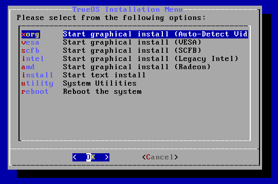
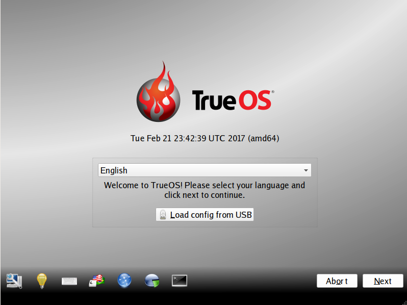
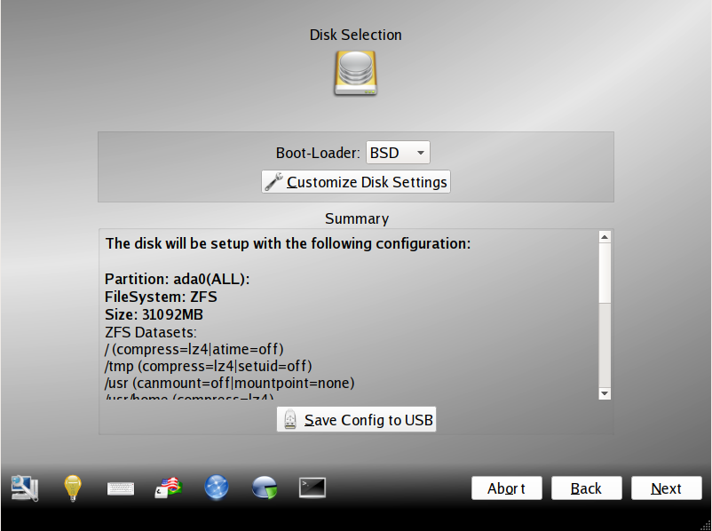
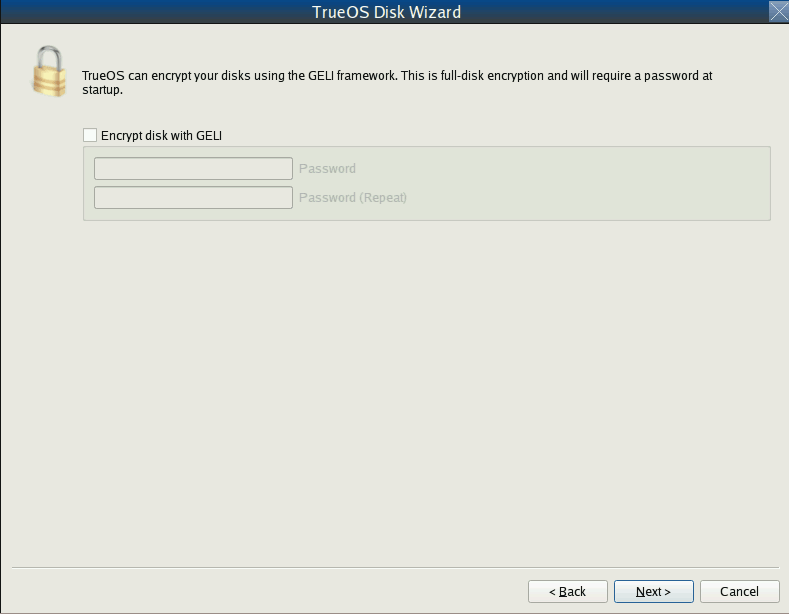

.. index:: graphical install
.. _Installing TrueOS:

Installing |trueos|
*******************

This chapter describes how to use the graphical installer to install a
graphical desktop directly onto a hard drive or into a virtual machine
using virtualization software such as
`VirtualBox <https://www.virtualbox.org/>`_. If using a downloaded CD
version of |trueos| or a text based installer, please refer to the
instructions in :ref:`Using the Text Installer`.

.. warning:: The |trueos| text-based installer is experiencing some
   irregular functionality. It is currently (3/6/17) recommended to
   use a graphical install option. See :ref:`Ongoing Issues` for more
   information.

To begin the |trueos| installation, insert the prepared boot media and
boot the system. If the computer boots into an existing operating
system instead of the installer, reboot and check the computer's BIOS
program to ensure the drive containing the installation media is listed
first in the boot order. Save any BIOS changes and reboot.

Once the system boots it displays the menu shown in
:numref:`Figure %s <install1>`. Press :kbd:`Enter` or simply wait a few
moments and this menu automatically prompts the system to continue
booting.

.. _install1:

.. figure:: images/install1b.png
   :scale: 100%

   : Initial Boot Menu

.. note:: See :ref:`BSD Boot Loader` for a detailed description of this
   menu.

If a key other than :kbd:`Enter` is pressed, this screen pauses
to provide additional time to review the options. If this screen is not
paused, it automatically boots into the :guilabel:`Boot Multi User`
option, displaying the :guilabel:`TrueOS® Installation Menu`, shown in
:numref:`Figure %s <install15>`.

.. _install15:

   : |trueos| Installer Boot Menu

* **xorg:** Starts a graphical installer which auto-detects the driver
  required by the video hardware.

* **vesa:** Starts the graphical installer with the VESA driver loaded.
  Select this option if :guilabel:`xorg` hangs when loading the graphics
  driver.

* **scfb:** Starts the graphical installer with the SCFB driver loaded.
  Select this option if a UEFI system hangs when loading the graphics
  driver, as it provides a nicer display than the :guilabel:`vesa`
  driver. Before selecting this option, double-check CSM has been
  disabled in the BIOS.

* **intel:** Start a graphical install with Legacy Intel drivers loaded.

* **amd:** Start a graphical installation with legacy Radeon drivers
  loaded.

* **install:** Starts the text-based installer as described in
  :ref:`Using the Text Installer`.

* **utility:** Starts the system utilities as described in
  :ref:`Using the System Utilities Menu`.

* **reboot:** Exits the installer and reboots the system.

Use the arrow keys to highlight a desired option, then press
:kbd:`Enter` to continue to boot into the option.

The rest of this chapter describes the screens of the graphical
installer. If any problems arise with booting into the graphical
installer, please refer to the :ref:`Installation` Troubleshooting
section of this handbook.

.. index:: language select screen
.. _Language Selection:

Language Selection
==================

The first graphical installer screen, seen in
:numref:`Figure %s <install2>`, indicates the installer successfully
loaded and is ready to present its options.

.. _install2:

   : Welcome and Language Selection Screen

On the bottom-left side of the screen are several icons and buttons to
help with the installation, explained in :numref:`Table %s <insico>`:

.. _insico:

.. table:: : Installer icons

   +-----------------------+-------------------------------------------+
   | Icon                  | Function                                  |
   +=======================+===========================================+
   | System with wrench    | Access hardware compatibility information |
   |                       | to quickly determine if the system's      |
   |                       | video card, Ethernet card, wireless       |
   |                       | device, and sound card are compatible     |
   |                       | with |trueos|.                            |
   +-----------------------+-------------------------------------------+
   | Light Bulb            | Read a screen's Help text.                |
   +-----------------------+-------------------------------------------+
   | Keyboard              | Use the onscreen keyboard.                |
   +-----------------------+-------------------------------------------+
   | "L" key and U.S. Flag | Switch between the US keyboard layout and |
   |                       | a user selected layout.                   |
   +-----------------------+-------------------------------------------+
   | Blue and White Orb    | Opens the *Network Manager* in order to   |
   |                       | configure system networking during the    |
   |                       | installation process.                     |
   +-----------------------+-------------------------------------------+
   | Pie Chart             | Launches the *Disk Manager* utility.      |
   +-----------------------+-------------------------------------------+
   | Command Prompt Window | Access the emergency shell described in   |
   |                       | :ref:`Using the System Utilities Menu`.   |
   +-----------------------+-------------------------------------------+
   | Abort                 | Abort the installation.                   |
   +-----------------------+-------------------------------------------+
   | Next                  | Navigate to the next or previous screen.  |
   +-----------------------+-------------------------------------------+

Hover over an icon to view its description in the tip bar at the
bottom of the screen.

.. note:: The default keyboard layout can be changed at this point,
   during the post-installation :ref:`Choose a Language` screen, when
   :ref:`Logging In`, or during an active session using the included
   :command:`fcitx` utility.

There is also an option to :guilabel:`Load config from USB`. If the
configuration from a previous installation has been saved, it can be
loaded at this time from a FAT-formatted USB stick.

By default, |trueos| menus display in English, unless another language
is selected in the drop-down menu in this screen. The menus in |trueos|
are being continuously translated to other languages. To view the
availability of a specific language, navigate to the
`TrueOS® Translation Site <http://weblate.trueos.org>`_. A language may
show less than 100% translation, indicating not all of the menus are
translated. Any untranslated menus are displayed in English. Refer to
:ref:`Become a Translator` to assist in translating the graphical menus.

.. note:: Small screens may not display the entire installer window,
   resulting in buttons at the bottom of the window being hidden and
   inaccessible. In this situation, either press :kbd:`Alt` while
   dragging the window with the mouse or press :kbd:`Alt+N` to select
   the next button of the window.

When finished reviewing this screen, click :guilabel:`Next` to move on
to the next installation screen.

.. index:: installation type
.. _System Selection:

System Selection
================

The :guilabel:`System Selection` screen installs a graphical desktop or
a console-based server operating system, as seen in
:numref:`Figure %s <install3>`. It also can be used for
`Restoring the Operating System <https://sysadm.us/handbook/client/sysadmclient.html#restoring-the-operating-system>`_.
This chapter concentrates on a desktop installation. Refer to the
:ref:`Server Installation` instructions for installing a command-line
only server.

.. _install3:

.. figure:: images/install3c.png
   :scale: 100%

   : System Selection Screen

By default, :guilabel:`TrueOS Desktop (graphical interface)` is selected
and the |lumina| Desktop will be installed. Additional software can be
installed later using
`AppCafe <https://sysadm.us/handbook/client/sysadmclient.html#appcafe>`_.

To install the desktop, click :guilabel:`Next`.

.. note:: When installing to an existing |pcbsd| or |trueos| system, a
   pop-up window asks to install to the existing pool without
   reformatting it. Press :guilabel:`OK` to keep the existing pool.
   Clicking :guilabel:`Cancel` formats the existing pool and all of
   its data. Refer to the :ref:`Upgrading from PCBSD 10.x to TrueOS`
   section for more information about this option.

.. index:: disk config screen
.. _Disk Selection:

Disk Selection
==============

The :guilabel:`Disk Selection" screen`, seen in
:numref:`Figure %s <install5>`, summarizes the default disk
configuration.

.. _install5:

   : Disk Selection Screen

This screen provides a drop-down :guilabel:`Boot-Loader` menu with boot
manager options:

**BSD:** Uses the FreeBSD boot loader. This is recommended as it
supports the ZFS boot environments used by
`Update Manager <https://sysadm.us/handbook/client/sysadmclient.html#update-manager>`_.

**GRUB:** Select this option when dual-booting the system and the GRUB
bootloader is preferred.

.. warning:: |trueos| is currently experiencing issues with the GRUB
   bootloater. It is recommended to avoid using GRUB while the issue is
   resolved. See :ref:`Ongoing Issues` for more details.

.. warning:: By default, |trueos| assumes the user wants to install
   on the entire first disk. When installing |trueos| as the only
   operating system on the computer, click :guilabel:`Next` to start the
   installation. However, if this is not intended, review the rest
   of this section to determine how to layout the disk. If |trueos| is
   to be booted with another operating system, please review the section
   on :ref:`Dual Booting`.

To select the disk or partition to install |trueos|, click
:guilabel:`Customize Disk Settings` to start the |trueos| Disk Wizard,
shown in :numref:`Figure %s <install6>`.

.. _install6:

.. figure:: images/install6b.png
   :scale: 100%

   : |trueos| Disk Wizard

The wizard provides two modes of operation:

* **Basic:** (default) Select this mode if to specify the installation
  partition or disk.

* **Advanced:** Select this mode to specify the installation partition
  or disk, use MBR partitioning, change the default ZFS pool name, force
  the block size used by ZFS, configure a multi-disk installation, add a
  log or cache device, encrypt the disk, or specify the filesystem
  layout.

.. warning:: Regardless of the selected mode, once the disk wizard
   completes and :guilabel:`Next` is chosen at the disk
   :guilabel:`Summary` screen, a pop-up window will ask to start the
   installation. Be sure to review the disk summary before clicking
   :guilabel:`Yes` and starting the installation. The 
   :guilabel:`Summary` screen is the **very last chance** to ensure the
   system is correctly configured. After clicking :guilabel:`Yes`, the
   selected hard drive or partition will be formatted and any data it
   contains will be lost.

Once the disk configuration is finished, the finished configuration can
be saved for later reuse. Insert a FAT-formatted USB stick and click
:guilabel:`Save Config to USB`.

.. index:: basic customization of the disk
.. _Basic Mode:

Basic Mode
----------

Select :guilabel:`Basic` and the wizard displays the screen shown
in :numref:`Figure %s <install7>`.

.. _install7:

.. figure:: images/install7b.png
   :scale: 100%

   : Disk or Partition Selection

The first hard disk is typically selected. To install on a different
disk, use the :guilabel:`Selected Disk` drop-down menu to
select the disk to install into.

By default, the entirety of the selected disk is formatted. If the disk
is divided into partitions or there is an area of free space, use the
:guilabel:`Selected Partition` drop-down menu to choose the desired
partition.

.. note:: |trueos| only installs into a primary MBR partition, a GPT
   partition, or an area of free space. That is, |trueos| cannot install
   into a secondary or an extended partition. To create an area of free
   space to install into, refer to :ref:`Creating Free Space`.

Once the disk and partition are selected, click :guilabel:`Next` to
return to the disk :guilabel:`Summary` screen to review the selections.
To make additional changes, press :guilabel:`Back` to return to a
previous screen. Otherwise, click :guilabel:`Finish` to leave the
wizard. Click :guilabel:`Next` then :guilabel:`Yes` to start the
installation.

.. index:: advanced disk customization
.. _Advanced Mode:

Advanced Mode
-------------

After selecting advanced mode, the wizard displays the screen shown in
:numref:`Figure %s <install8>`.

.. _install8:

.. figure:: images/install8c.png
   :scale: 100%

   : Advanced Mode Options

This screen has several options:

* **Selected Disk:** Select the disk to install into.

* **Selected Partition:** Select the desired partition or area of free
  space.

.. note:: |trueos| onlys install into a primary MBR partition, a GPT
   partition, or an area of free space. That is, |trueos| cannot install
   into a secondary or an extended partition. To create an area of free
   space to install into, refer to :ref:`Creating Free Space`.

* **Partition Scheme:**  The default of
  :guilabel:`GPT (Best for new hardware)` is a partition table layout
  that supports larger partition sizes than the traditional
  :guilabel:`MBR (Legacy)` layout. **If the installation disk or
  partition is larger than 2 TB, the GPT option must be selected**.
  Since some older motherboards do not support GPT, if the installation
  fails, try again with :guilabel:`MBR (Legacy)` selected. When in
  doubt, try the default selection first.

.. note:: This section does not appear if a partition other than
   :guilabel:`Use entire disk` is chosen in the
   :guilabel:`Selected Partition` drop-down menu.

* **ZFS pool name:** To use a pool name other than the default of
  *tank*, check this box and input the name of the pool. *Root*
  is reserved and can not be used as a pool name.

* **Force ZFS 4k block size:** This option is only used if the disk
  supports 4k, even though it lies and reports its size as
  512b. Use with caution as it may cause the installation to fail.

After making any selections, click :guilabel:`Next` to access the ZFS
configuration screens. The rest of this section provides a ZFS overview
and then demonstrates how to customize the ZFS layout.

.. index:: ZFS overview
.. _ZFS Overview:

ZFS Overview
^^^^^^^^^^^^

ZFS is an enterprise grade file-system, which provides many features
including: support for high storage capacities, high reliability, the
ability to quickly take snapshots, boot environments, continuous
integrity checking and automatic repair, RAIDZ which was designed to
overcome the limitations of hardware RAID, and native NFSv4 ACLs.

If new to ZFS, the Wikipedia entry on :wikipedia:`ZFS` provides an
excellent starting point to learn about its features. Additionally,
`FreeBSD Mastery: ZFS <https://www.michaelwlucas.com/nonfiction/freebsd-mastery-zfs>`_
by Michael W Lucas and Allan Jude is a helpful resource specific to ZFS
as it is implemented in FreeBSD.

These resources are also useful to bookmark and refer to as needed:

* `ZFS Evil Tuning Guide <http://www.solarisinternals.com/wiki/index.php/ZFS_Evil_Tuning_Guide>`_

* `FreeBSD ZFS Tuning Guide <https://wiki.FreeBSD.org/ZFSTuningGuide>`_

* `ZFS Best Practices Guide <http://www.solarisinternals.com/wiki/index.php/ZFS_Best_Practices_Guide>`_

* `ZFS Administration Guide <http://docs.oracle.com/cd/E19253-01/819-5461/index.html>`_

* `Becoming a ZFS Ninja (video) <https://blogs.oracle.com/video/entry/becoming_a_zfs_ninja>`_

* `Blog post explaining how ZFS simplifies the storage stack <https://blogs.oracle.com/bonwick/entry/rampant_layering_violation>`_

:numref:`Table %s <zfsterms>` is a brief glossary of terms used by ZFS:

.. _zfsterms:

.. table:: : ZFS Terms

   +----------+----------------------------------------------------------------------------------------------------------------------------------------------+
   | Term     | Description                                                                                                                                  |
   +==========+==============================================================================================================================================+
   | Pool     | A collection of devices that provides physical storage and data replication managed by ZFS. This pooled storage model eliminates the concept |
   |          | of volumes and the associated problems of partitions, provisioning, wasted bandwidth, and stranded storage. Thousands of filesystems can     |
   |          | draw from a common storage pool, each one consuming only as much space as it actually needs. The combined I/O bandwidth of all devices in    |
   |          | the pool is available to all filesystems at all times. The                                                                                   |
   |          | `Storage Pools Recommendations <http://www.solarisinternals.com/wiki/index.php/ZFS_Best_Practices_Guide#ZFS_Storage_Pools_Recommendations>`_ |
   |          | of the ZFS Best Practices Guide provides detailed recommendations for creating the storage pool.                                             |
   +----------+----------------------------------------------------------------------------------------------------------------------------------------------+
   | Mirror   | A form of RAID where all data is mirrored onto two or more disks, creating a redundant copy should a disk fail.                              |
   +----------+----------------------------------------------------------------------------------------------------------------------------------------------+
   | RAIDZ    | ZFS software solution equivalent to RAID5 as it allows one disk to fail without losing data. Requires at least **3** disks.                  |
   +----------+----------------------------------------------------------------------------------------------------------------------------------------------+
   | RAIDZ2   | Double-parity ZFS software solution similar to RAID6 as it allows two disks to fail without losing data. Requires a minimum of 4 disks.      |
   +----------+----------------------------------------------------------------------------------------------------------------------------------------------+
   | RAIDZ3   | Triple-parity ZFS software solution. RAIDZ3 offers three parity drives and can operate in degraded mode if up to three drives fail with no   |
   |          | restrictions on which drives can fail.                                                                                                       |
   +----------+----------------------------------------------------------------------------------------------------------------------------------------------+
   | Dataset  | Once a pool is created, it can be divided into datasets. A dataset is similar to a folder as it supports permissions. A dataset is also      |
   |          | similar to a filesystem since properties such as quotas and compression can be set.                                                          |
   +----------+----------------------------------------------------------------------------------------------------------------------------------------------+
   | Snapshot | A read-only, point-in-time copy of a filesystem. Snapshots can be created quickly and, if little data changes, new snapshots take up very    |
   |          | little space. For example, a snapshot where no files have changed takes 0 MB of storage, but if a 10 GB file is changed, it will keep a copy |
   |          | of both the old and the new 10 GB version. Snapshots provide a clever way of keeping a history of files, should an older copy or even a      |
   |          | deleted file need to be recovered. For this reason, many administrators take snapshots often (e.g. every 15 minutes), store them for a       |
   |          | period of time (e.g. for a month), and store them on another system. Such a strategy allows the administrator to roll the system back to a   |
   |          | specific time or, if there is a catastrophic loss, an off-site snapshot can restore the system up to the last snapshot interval (e.g. within |
   |          | 15 minutes of the data loss). Snapshots can be cloned or rolled back, but the files on the snapshot can not be accessed independently.       |
   +----------+----------------------------------------------------------------------------------------------------------------------------------------------+
   | Clone    | A writable copy of a snapshot which can only be created on the same ZFS volume. Clones provide an extremely space-efficient way to store     |
   |          | many copies of mostly-shared data such as workspaces, software installations, and diskless clients. Clones do not inherit the properties of  |
   |          | the parent dataset, but rather inherit the properties based on where the clone is created in the ZFS pool. Because a clone initially shares  |
   |          | all its disk space with the original snapshot, its used property is initially zero. As changes are made to the clone, it uses more space.    |
   +----------+----------------------------------------------------------------------------------------------------------------------------------------------+
   | ZIL      | A filesystem journal that manages writes. The ZIL is a temporary storage area for sync writes until they are written asynchronously to the   |
   |          | ZFS pool. If the system has many sync writes, such as from a database server, performance can be increased by adding a dedicated log device  |
   |          | known as a SLOG (Secondary LOG). If the system has few sync writes, a SLOG will not speed up writes. When creating a dedicated log device,   |
   |          | it is recommended to use a fast SSD with a supercapacitor or a bank of capacitors that can handle writing the contents of the SSD's RAM to   |
   |          | the SSD. If a dedicated log device is needed, the SSD should be half the size of system RAM, as anything larger is unused capacity. Note a   |
   |          | dedicated log device can not be shared between ZFS pools and the same device cannot hold both a log and a cache device.                      |
   +----------+----------------------------------------------------------------------------------------------------------------------------------------------+
   | L2ARC    | ZFS uses a RAM cache to reduce read latency. If an SSD is dedicated as a cache device, it is known as an L2ARC and ZFS uses it to store more |
   |          | reads which can increase random read performance. However, adding a cache device will not improve a system with too little RAM and actually  |
   |          | decreases performance, as ZFS uses RAM to track the contents of L2ARC. RAM is always faster than disks, so always add as much RAM as         |
   |          | possible before determining if the system would benefit from a L2ARC device. If a lot of applications do large amounts of random reads on a  |
   |          | dataset small enough to fit into the L2ARC, read performance may be increased by adding a dedicated cache device. SSD cache devices only     |
   |          | help if the working set is larger than system RAM, but small enough that a significant percentage of it fits on the SSD. Note a dedicated    |
   |          | L2ARC device can not be shared between ZFS pools.                                                                                            |
   +----------+----------------------------------------------------------------------------------------------------------------------------------------------+

.. index:: ZFS layout
.. _ZFS Layout:

ZFS Layout
^^^^^^^^^^

In :guilabel:`Advanced Mode`, the disk setup wizard allows configuring
the ZFS layout. The initial ZFS configuration screen is seen in
:numref:`Figure %s <install9>`.

.. _install9:

.. figure:: images/install9b.png
   :scale: 100%

   : ZFS Configuration

If the system contains multiple drives to be used to create a ZFS mirror
or RAIDZ*, check :guilabel:`Add additional disks to storage pool`, which
enables this screen. Any available disks are listed in the box below the
:guilabel:`ZFS Virtual Device Mode` drop-down menu. Select the desired
level of redundancy from the :guilabel:`ZFS Virtual Device Mode`
drop-down menu, then check the box for each disk to add to the
configuration.

.. note:: The |trueos| installer requires entire disks (not partitions)
   when adding more disks to the pool.

While ZFS allows using disks of different sizes, this is discouraged as
it decreases storage capacity and ZFS performance.

The |trueos| installer supports multiple ZFS configurations:

* **mirror:** Requires a minimum of 2 disks.

* **RAIDZ1:** Requires a minimum of 3 disks. For best performance,
  a maximum of 9 disks is recommended.

* **RAIDZ2:** Requires a minimum of 4 disks. For best performance, a
  maximum of 10 disks is recommended.

* **RAIDZ3:** Requires a minimum of 5 disks. For best performance, a
  maximum of 11 disks is recommended.

* **stripe:** Requires a minimum of 2 disks.

.. note:: A stripe does NOT provide ANY redundancy. If any disk fails in
   a stripe, all data in the pool is lost!

The installer will not allow a configuration choice in which the system
does not meet the minimum number of disks required by the configuration.
When selecting a configuration, a message will indicate how many more
disks are required.

When finished, click :guilabel:`Next` to see the screen shown in
:numref:`Figure %s <install10>`.

.. _install10:

.. figure:: images/install10b.png
   :scale: 100%

   : L2ARC and ZIL

This screen can be used to specify an SSD to use as an L2ARC read
cache or as a secondary log device (ZIL). Any available devices will
be listed in the boxes in this screen.

.. note:: A separate SSD is needed for each type of device.

Refer to the descriptions for ZIL and L2ARC in the :ref:`ZFS Overview`
to determine if the system would benefit from any of these devices
before adding them in this screen. When finished, click :guilabel:`Next`
to see the screen shown in :numref:`Figure %s <install11>`.

.. _install11:

   : Encryption

.. TODO remove warning box once FreeBSD regression is fixed.

.. warning:: Due to a FreeBSD regression, do not use the FreeBSD
   bootloader with GELI and GPT encryption for fresh installations of
   |trueos|. Please see :ref:`Ongoing issues` for more information about
   this issue.

This screen can be used to configure full-disk encryption which is
meant to protect the data on the disks should the system itself be
lost or stolen. This type of encryption prevents the data on the disks
from being available during bootup unless the correct passphrase is
typed at the bootup screen. Once the passphrase is accepted, the data
is unencrypted and can easily be read from disk.

To configure full-disk encryption, check
:guilabel:`Encrypt disk with GELI`. This option will be greyed out if
:guilabel:`GPT (Best for new hardware)` is not selected as GELI does not
support MBR partitioning. If needed, use :guilabel:`Back` to go back to
the :ref:`Advanced Mode` screen and select
:guilabel:`GPT (Best for new hardware)`. Once
:guilabel:`Encrypt disk with GELI` is checked, input a strong passphrase
twice into the :guilabel:`Password` fields. This password should be long
and easy to remember, but hard for others to guess.

.. warning:: This passphrase is required to decrypt the disks. If the
   passphrase is lost or forgotten, all access will be lost to the
   encrypted data!

When finished, click :guilabel:`Next` to move to the screen shown in
:numref:`Figure %s <install12>`.

.. _install12:

.. figure:: images/install12b.png
   :scale: 100%

   : Default ZFS Layout

Regardless of how many disks are selected for the ZFS configuration, the
default layout will be the same. ZFS does not require separate
partitions for :file:`/usr`, :file:`/tmp`, or :file:`/var`. Instead,
create one ZFS partition (pool) and specify a mount for each
dataset. A :file:`/boot` partition is not mandatory with ZFS as the
|trueos| installer puts a 64k partition at the beginning of the drive.

.. warning:: Do not remove any of the default mount points as they are
   used by |trueos|.

Use :guilabel:`Add` to add additional mount points. The system will ask
for the name of the mount point as size is not limited at creation time.
Instead, the data on any mount point can continue to grow as long as
space remains within the ZFS pool.

To set the swap size, click :guilabel:`Swap Size`. This will prompt to
enter a size in MB. If a RAIDZ* or mirror exists, a swap partition
of the specified size will be created on each disk and mirrored between
the drives. For example, if a 2048 MB swap size is specified, a 2 GB
swap partition will be created on all of the specified disks, yet the
total swap size will be 2GB, due to redundancy.

Right-click any mount point to toggle between enabling or disabling many
ZFS properties:

* **atime:** When set to :guilabel:`on`, controls whether the access
  time for files is updated when they are read. When set to
  :guilabel:`off`, this property avoids producing write traffic when
  reading files and can result in significant performance gains, though
  it might confuse mailers and some other utilities.

* **canmount:** If set to :guilabel:`off`, the filesystem can not be
  mounted.
  
* **casesensitivity:** The default is :guilabel:`sensitive`, as UNIX
  filesystems use case-sensitive file names. For example, "kris" is
  different from "Kris". To tell the dataset to ignore case, select
  :guilabel:`insensitive`.

* **checksum:** Automatically verifies the integrity of the data
  stored on disks. Turning this property :guilabel:`off` is highly
  discouraged.

* **compression:** If set to :guilabel:`on`, automatically compresses
  stored data to conserve disk space.

* **exec:** If set to :guilabel:`off`, processes can not be executed
  from within this filesystem.

* **setuid:** If set to :guilabel:`on`, the set-UID bit is respected.

After clicking :guilabel:`Next`, the wizard will show a summary of the
selections. To make further changes, use :guilabel:`Back` to return to
a previous screen. Otherwise, click :guilabel:`Finish` to leave the
wizard and return to the :guilabel:`Disk Selection` screen.

.. index:: install progress
.. _Installation Progress:

Installation Progress
=====================

Once :guilabel:`Yes` is selected to start the installation, a progress
screen, seen in :numref:`Figure %s <install13>`, provides a progress
bar and messages so the user can watch the installation's progress.

.. _install13:

.. figure:: images/install13b.png
   :scale: 100%

   : Installation Progress

How long the installation takes depends upon the speed of the hardware
and the installation type selected. A typical installation takes between
5 and 15 minutes.

.. index:: installation finished screen
.. _Installation Finished:

Installation Finished
=====================

The screen shown in
:numref:`Figure %s <install14>` appears once the installation is
complete.

.. _install14:

.. figure:: images/install14b.png
   :scale: 100%

   : |trueos| Installation Complete

Click :guilabel:`Finish` to complete the |trueos| installation. It will
return to the
:numref:`Figure %s: TrueOS® Installer Boot Menu <install15>`. To
manually configure the system before booting into it, select
:guilabel:`utility` to open a *root* shell. Otherwise, select
:guilabel:`reboot` to reboot into the new installation. Wait until this
menu exits before removing the installation media.

.. index:: advanced install topics
.. _Advanced Installation:

Advanced Installation Topics
============================

This section covers these advanced installation topics:

* :ref:`Using the Text Installer`

* :ref:`Server Installation`

* :ref:`Using the TrueOS CD`

* :ref:`Dual Booting`

* :ref:`Upgrading from PCBSD 10.x to TrueOS`

* :ref:`Automated Installations`

If your intent is to install a graphical desktop using a graphical
installer, instead refer to :ref:`Installing TrueOS`.

.. index:: text installer
.. _Using the Text Installer:

Using the Text Installer
------------------------

.. warning:: The |trueos| text-based installer is experiencing some
   irregular functionality. It is currently (3/6/17) recommended to
   use a graphical install option. See :ref:`Ongoing Issues` for more
   information.

If an **ncurses** menu installation is preferred over a full graphical
installer, start the installation as usual and select
:guilabel:`install`, seen in :numref:`Figure %s <install15repro>`.

.. _install15repro:

   : |trueos| Installation Menu

The next screen will prompt to install a desktop or a server, as seen
in :numref:`Figure %s <text2>`.

.. _text2:

.. figure:: images/text2a.png
   :scale: 100%

   : Desktop or Server

After choosing to install a desktop, the |lumina| desktop will be
installed and configured. After the desktop installation is complete,
the system will boot into the usual post-installation configuration
screens.

If a server installation is chosen, neither **X** nor a window manager
will be installed, resulting in a command-line only |trueos|
installation. Once the server installation is complete, the system will
boot into a command prompt where the username and password created
during the installation will need to be entered.

After making a selection and pressing :kbd:`Enter`, the next screen will
display the available disks on the system. In the example shown in
:numref:`Figure %s <text3>`, one disk is available.

.. _text3:

.. figure:: images/text3a.png
   :scale: 100%

   : Installation Disk

Select the disk to install into and press :kbd:`Enter`. In the next
screen, the installer will display all available primary or GPT
partitions. In the example shown in :numref:`Figure %s <text4>`, there
is only one partition and the installer has selected the default of
installing to the entire disk.

.. warning:: If the system has multiple partitions and disks, be
   careful in selecting the disk and partition targets for installation.

.. _text4:

.. figure:: images/text4a.png
   :scale: 100%

   : Partition

The next screen, shown in :numref:`Figure %s <text5>`, is used to
select the type of disk format. If the installation disk or partition is
larger than 2 TB, :guilabel:`GPT` **must** be selected. Otherwise,
selecting :guilabel:`GPT` should work for most modern hardware. When
installing on older hardware, or if the newly installed system will not
boot after selecting :guilabel:`GPT`, select :guilabel:`MBR` instead.

.. _text5:

.. figure:: images/text5a.png
   :scale: 100%

   : Disk Format

The next screen, shown in :numref:`Figure %s <text6>`, is used to
select the boot manager.

.. _text6:

.. figure:: images/text6a.png
   :scale: 100%

   : Boot Manager

The default is to use :guilabel:`BSD` as it provides native support for
boot environments. While :guilabel:`GRUB` provides some boot environment
support, it may not be as up-to-date as the BSD support. It is
recommended to only select :guilabel:`GRUB` if dual booting and the BSD
boot manager does not find the other operating systems. If
:guilabel:`none` is selected, no boot manager will be installed and boot
environments will not be available.

The next screen is shown in :numref:`Figure %s <text7>`.

.. _text7:

.. figure:: images/text7a.png
   :scale: 100%

   : Full Disk Encryption

This screen provides the option to encrypt the selected disk(s) with
the FreeBSD
`GELI <https://www.freebsd.org/cgi/man.cgi?query=geli&sektion=8&manpath=FreeBSD>`_
framework. If the default of :guilabel:`Yes` is kept, press
:kbd:`Enter` and the system will prompt for a passphrase. This
passphrase will be required whenever booting into |trueos|. This means
if someone else boots into the computer, they will not be able to boot
into |trueos| if they do not know the passphrase.

.. danger:: If the passphrase is lost or forgotten, no one will be able
  to access |trueos| on the system.

For these reasons, it is important to choose a good passphrase other
users will not guess and which the user can remember. Passphrases
are case-sensitive and can contain spaces. The passphrase should be
memorable to the user, such as a line from a song or piece of
literature, but hard to guess so people who know the user can not guess
the passphrase.

.. warning:: Be careful if the keyboard variant and layout are changed.
   The GELI encryption framework only supports QWERTY passphrases, so do
   not use any characters not found on a QWERTY keyboard in the
   passphrase. **DO NOT** set a passphrase with accents or special
   characters which are not found on a US keyboard. This is a limitation
   in FreeBSD as the keymap is not loaded until after the passphrase is
   entered, meaning such a passphrase will render the encrypted disks
   inaccessible.

If server installation is chosen in the screen shown in
:ref:`Select Desktop or Server <text2>`, the installer will provide
more menus. These will prompt for additional information:

* The *root* password.

* Confirm the *root* password (enter the same value).

* The username to use when logging into the server (*root* logins
  are discouraged).

* The password to use when logging into the server.

* Confirm the password to use when logging into the server.

* The real name for the user who logs into the server (can contain
  spaces).

* The default shell for the user's login.

* The hostname for the server.

* Whether or not to enable networking. Select :guilabel:`Yes`, to either
  select :guilabel:`auto` to enable *DHCP* on all interfaces or select
  an interface to statically configure. When selecting an interface,
  the system will prompt to enter the IP address, subnet mask, IP
  address of the DNS server, and the IP address of the default gateway.

* Whether or not to enable SSH access to the server.

The next screen, for both a desktop and server installation, is shown
in :numref:`Figure %s <text9>`.

.. _text9:

.. figure:: images/text9a.png
   :scale: 100%

   : Review Installation Options

This menu provides several options:

* **install:** To start the installation, select this option and press
  :kbd:`Enter`.

* **wizard:** Select this option to re-run the text installer and
  re-input any selections.

* **edit:** Use this option to review, and possibly change, any of the
  installation parameters.

* **hardware:** Select this option to display a summary of the system's
  hardware. The example shown in :numref:`Figure %s <text10>` is from a
  system with a disabled sound card and no wireless card.

* **quit:** Select this option to return to the screen shown in the
  :ref:`TrueOS Installation Menu <install1>`.

.. _text10:

.. figure:: images/text10.png
   :scale: 100%

   : Hardware Summary

If select :guilabel:`edit`, the menu shown in
:numref:`Figure %s <text11>` will open.

.. _text11:

.. figure:: images/text11a.png
   :scale: 100%

   : Edit Menu

This screen contains several options:

* **disk:** Used to change the disk to install into. Selecting this
  option will re-open the screens shown in
  :ref:`Select Installation Disk <text3>` through
  :ref:`Full Disk Encryption <text7>`, and then return to this menu.
  If you want to install into a mirrored or RAIDZ pool, select one of the
  targets using this option, and then select **pool** (see below).

* **pool:** Select this option if the system contains multiple
  disks and changing the disk layout to a mirror or RAIDZ is desired.
  The allowable layouts for the number of available disks will be
  displayed so the user can select the desired layout.

* **datasets:** Used to modify the default ZFS dataset layout. Selecting
  this option will open the screen shown in
  :numref:`Figure %s <text12>`.

  .. _text12:

  .. figure:: images/text12a.png
     :scale: 100%

     : ZFS Layout

  To edit the properties of an existing dataset, highlight the dataset's
  name and press :kbd:`Enter`. This will show the list of available ZFS
  properties for that dataset, as seen in the example shown in
  :numref:`Figure %s <text13>`:

  .. _text13:

  .. figure:: images/text13a.png
     :scale: 100%

     : ZFS Properties for a Dataset

  To change the value of a ZFS property, highlight it and press
  :kbd:`Enter`. The available values will vary, depending upon the
  selected property. To add additional datasets, select :guilabel:`add`.
  This will prompt for the full path of the mountpoint to create. For
  example, a dataset named :file:`/usr/shares` can be created. The
  dataset created will be added to the bottom of the list. If the
  dataset is selected, press :kbd:`Enter` to set its ZFS properties.
  Once finished customizing the ZFS layout, select :guilabel:`done`.

.. warning:: While a dataset can be deleted, the default datasets are
   needed for boot environments. For this reason, it is **not**
   recommended to delete any default datasets. ZFS options are described
   in `zfs(8) <http://www.freebsd.org/cgi/man.cgi?query=zfs>`_, but any
   options should only be changed by experienced users.

* **network:** Used to configure networking. Selecting this option
  will first prompt to enter a hostname, then select either automatic
  DHCP configuration on all interfaces or to specify the interface to
  configure, and finally whether or not to enable SSH.

* **view:** Select this option to view a read-only copy of the ASCII
  text file containing the configuration script.

* **edit:** Select this option to open the configuration script in the
  :command:`ee` editor, allowing for changes. The parameters supported
  by the installation script are described in
  :ref:`Automated Installations`.

* **back:** Select this option to return to the menu shown in
  :ref:`Review Installation Options <text9>`.

.. index:: using system utilities menu
.. _Using the System Utilities Menu:

Using the System Utilities Menu
^^^^^^^^^^^^^^^^^^^^^^^^^^^^^^^

The text installer contains some handy tools for troubleshooting and
fixing an existing |trueos| installation.

Choose the :guilabel:`utility` option in the main menu of the graphical
or text based installer shown in the
:ref:`TrueOS® Installation Menu <install15>` to open the screen shown
in :numref:`Figure %s <util1>`.

.. _util1:

.. figure:: images/util1a.png
   :scale: 100%

   : System Utilities Menu

This screen provides several options:

* **shell:** This option is useful when troubleshooting a |trueos|
  system that no longer boots. It will open a shell with administrative
  access, including the base FreeBSD utilities. Advanced users can use
  this shell to identify a problem, create a backup of or copy essential
  files to another system, or edit configuration files with an editor
  such as `ee <https://www.freebsd.org/cgi/man.cgi?query=ee>`_ or
  :command:`vi`. When finished using the shell, type :command:`exit` to
  return to the screen shown in
  :ref:`System Utilities Menu <util1>`.

* **zimport** This option will display the names of available ZFS pools.
  Type the name of an available pool and it will import the pool then
  display the available boot environments (BEs). Type the name of the
  desired BE and this option will mount the BE then offer to open a
  chroot shell so its contents can be viewed and manipulated as needed
  in order to perform maintenance on the boot environment. When
  finished, type :command:`exit` to leave the boot environment and
  return to the screen shown in :ref:`System Utilities Menu <util1>`.

* **fixgrub:** This option can be used to restamp the GRUB boot loader
  should the installed system no longer boot from GRUB. When this option
  is selected, it will first show the available ZFS pools and prompt for
  the name of the pool to import.

.. note:: The :command:`fixgrub` action will fail on systems using the
   default BSD boot loader.

* **exit:** This option will return to the main
  :ref:`TrueOS® Installation Menu <install1>`.

.. index:: install a server
.. _Server Installation:

Server Installation
-------------------

The :ref:`System Selection` screen of the |trueos| installer can be
used to install a FreeBSD-based command-line server operating system
rather than a graphical desktop operating system. A |trueos|
installation includes the `SysAdm™ API <https://api.sysadm.us/>`_ and
`SysAdm™ Client <https://sysadm.us/handbook/client/>`_ for managing the
server locally or remotely.

For a server installation, using the |trueos| installer rather than the
FreeBSD installer offers several benefits:

* The ability to easily configure ZFS during installation.

* The ability to configure multiple boot environments.

* A wizard (described in this section) is provided during installation
  to configure the server for first use.

.. note:: This section describes how to install a command-line only
   server using the graphical installer. Alternately, a server can be
   installed :ref:`Using the TrueOS CD` or
   :ref:`Using the Text Installer`.

To perform a graphical server installation, start the |trueos|
installation as usual. At the :ref:`System Selection` screen of the
installer, select :guilabel:`TrueOS Server (console interface only)`.

Click :guilabel:`Next` to start the :guilabel:`Server Setup Wizard`,
then click :guilabel:`Next` again to see the screen shown in
:numref:`Figure %s <server2>`.

.. _server2:

.. figure:: images/server2a.png
   :scale: 100%

   : Root Password Creation

Input and confirm the root password then click :guilabel:`Next` to
proceed to the screen shown in :numref:`Figure %s <server3>`.

.. _server3:

.. figure:: images/server3a.png
   :scale: 100%

   : Primary User Account Creation

For security reasons, do not login as the *root* user. The wizard
requires creating a primary user account used to login to the server.
This account will automatically be added to the *wheel* group, allowing
the user to :command:`su` to the *root* account when administrative
access is required.

Create an account by filling in the fields:

* **Name:** Can contain capital letters and spaces.

* **Username:** The name used when logging in. Can not contain spaces
  and is case sensitive (e.g. *Kris* is a different username than
  *kris*).

* **Password:** The password used when logging in. Type it twice in
  order to confirm it.
  
* **Default shell:** Use the drop-down menu to select the **csh**,
  **tcsh**, **sh**, or **bash** login shell.

When finished, click :guilabel:`Next` to proceed to the screen shown in
:numref:`Figure %s <server4>`.

.. _server4:

.. figure:: images/server4a.png
   :scale: 100%

   : Hostname Creation

Input the system's hostname. If using :command:`ssh` to connect to the
system, check :guilabel:`Enable remote SSH login`. Click
:guilabel:`Next` to proceed to the network configuration screen shown in
:numref:`Figure %s <server5>`.

.. _server5:

.. figure:: images/server5a.png
   :scale: 100%

   : Network Configuration

Use the :guilabel:`Network Interface` drop-down menu to choose the
desired interface:

* **AUTO-DHCP-SLAAC:** (default) Will configure every active interface
  for DHCP and for both IPv4 and IPv6.

* **AUTO-DHCP:** Will configure every active interface for DHCP and
  for IPv4.

* **IPv6-SLAAC:** Will configure every active interface for DHCP and
  for IPv6.

Alternately, use the drop-down menu to select the device name for the
interface and manually configure and input the IPv4 and/or IPv6
addressing information. When finished, click :guilabel:`Next` to access
the screen shown in :numref:`Figure %s <server6>`.

.. _server6:

.. figure:: images/server6a.png
   :scale: 100%

   : Ports Installation

To install the FreeBSD ports collection, check
:guilabel:`Install ports tree` then click :guilabel:`Finish` to exit the
wizard and access the summary screen shown in :ref:`Disk Selection`.

Click :guilabel:`Customize` to configure the system's disk(s).

To save the finished configuration for re-use at a later time, insert a
FAT-formatted USB stick and click :guilabel:`Save Config to USB`.

Once ready to start the installation, click :guilabel:`Next`. A pop-up
menu will ask to start the installation immediately.

Once the system is installed, it will boot to a command-line login
prompt. Login using the primary user account configured during
installation. Now the server can be configured like any other FreeBSD
server installation. The
`FreeBSD Handbook <http://www.freebsd.org/doc/en_US.ISO8859-1/books/handbook/>`_
is an excellent reference for performing common FreeBSD server tasks.

.. index:: using the install cd
.. _Using the TrueOS CD:

Using the |trueos| CD
---------------------

The CD-sized |trueos| ISO provides an *ncurses* installer for installing
a command-line version of |trueos|. If the intent is to only install
servers and a graphical installer is unnecessary, this ISO is convenient
to use and quick to download. The |trueos| CD can also be used to repair
an existing installation, using the instructions in
:ref:`Using the System Utilities Menu`.

To start a server installation using the |trueos| ISO, insert the
prepared boot media. Once the system has finished booting into the
installer, it will display the installation menu shown in
:numref:`Figure %s <cd2>`.

.. _cd2:

.. figure:: images/cd2a.png
   :scale: 100%

   : |trueos| Installation Menu

To begin the installation, press :kbd:`Enter`. The server installation
will then display the screen shown in
:ref:`Select Installation Disk <text3>` and proceed as
described in :ref:`Using the Text Installer`.

.. index:: install with dualboot
.. _Dual Booting:

Dual Booting
------------

A |trueos| installation assumes there is an existing GPT or primary
partition to install into. If the computer has only one disk and
|trueos| will be the only operating system, it is fine to accept the
default partitioning scheme. However, if |trueos| will be sharing space
with other operating systems, ensure |trueos| is installed into the
correct partition or an existing operating system may be inadvertently
overwritten.

There are several required elements to install multiple operating
systems on the computer:

* A partition for each operating system. Many operating systems,
  including |trueos|, can only be installed into a primary or GPT
  partition. This means partitioning software is required, as described
  in :ref:`Creating Free Space`.

* A backup of any existing data. This backup should not be stored on
  the computer's hard drive but on another computer, removable media
  such as a USB drive, or burnt onto a DVD media. While most
  installations will progress smoothly, it is always recommended to have
  a backup prepared in case of the unexpected.

When installing |trueos| onto a computer that is to contain multiple
operating systems, care must be taken to select the **correct**
partition in the :ref:`Disk Selection` screen. On a system containing
multiple partitions, each partition will be listed.

.. danger:: Avoid selecting a partition containing an operating system
   or essential data.

Highlight the desired partition and click :guilabel:`Customize`.
Clicking :guilabel:`Next` without customizing the disk layout results
in the installer overwriting the contents of the primary disk.

In |trueos|, the BSD boot loader is the preferred and default boot
loader, as it provides native support for ZFS boot environments. If the
default changed during installation, the installer uses a customized
version of the GRUB boot loader which provides limited ZFS boot
environment support.

.. warning:: The GRUB boot loader is currently experiencing inconsistent
   behavior, and it is recommended to use the BSD boot loader at this
   time. See :ref:`Ongoing Issues` for more details.

The |trueos| version of GRUB attempts to identify other installed
operating systems, such as Windows and Linux, and add them to the GRUB
boot menu. If an operating system is not automatically detected,
an entry can be manually added to
:file:`/usr/local/etc/grub.d/40_custom.dist`. For more information on
the syntax used, refer to the
`GRUB Manual <http://www.gnu.org/software/grub/manual/grub.html>`_.

.. index:: upgrade from PCBSD
.. _Upgrading from PCBSD 10.x to TrueOS:

Upgrading from |pcbsd| 10.x to |trueos|
---------------------------------------

.. warning:: If any user account uses PersonaCrypt, please be sure to
   save any encryption keys to a safe place (e.g. a thumb drive) before
   beginning the upgrade process. Loss of encryption keys may result in
   being unable to import the home directory after the upgrade is
   complete.

If the system is using |pcbsd| 10.x, the option to update to |trueos|
does not appear in the Control Panel version of Update Manager. This is
because a new installation is required in order to migrate to |trueos|.
However, the |trueos| installer allows the user to keep all their
existing data and home directories, as it provides the ability to
install |trueos| into a new boot environment. In other words, the new
operating system and updated applications are installed while the ZFS
pool and any existing boot environments are preserved. Since the new
install is in a boot environment, the option to boot back into the
previous |pcbsd| installation remains.

.. note:: This option overwrites the contents of :file:`/etc`. If any
   custom configurations exist, save them to a backup or the home
   directory first. Alternately, use the |sysadm|
   `Boot Environment Manager <https://sysadm.us/handbook/client/sysadmclient.html#boot-environment-manager>`_
   post-installation to mount the previous |pcbsd| boot environment to
   copy over any configuration files which may not have been backed up.

To perform the installation to a new boot environment, start the
|trueos| installation as described earlier in the chapter. In the
:ref:`System Selection` screen, choose to install either a desktop or
a server. Press :guilabel:`Next` to view the :guilabel:`Disk Selection`
screen, shown in :numref:`Figure %s <upgrade1>`.

.. _upgrade1:

.. figure:: images/upgrade1b.png

   : Disk Selection

|trueos| automatically detects if the drive has an existing boot
environment, filling in the data as necessary. If no boot environments
are detected, :guilabel:`Install into Boot Environment` will be greyed
out. To upgrade, select :guilabel:`Install into Boot Environment` and
choose which existing pool to install into from the drop-down menu. In
the :ref:`Disk Selection Screen <upgrade1>`, the user is installing into
the existing **tank** pool. Press :guilabel:`Next` when ready.

.. warning:: Be sure :guilabel:`Install into Boot Environment` is
   checked before proceeding, or data can be lost.

A pop-up will appear, asking to start the default Full-Disk
installation. Click :guilabel:`Yes` to start the installation.

Once the installation is complete, reboot the system and remove the
installation media. The post-installation screens run as described in
the :ref:`Post Installation Configuration` section to help you configure
the new installation.

.. note:: During the :ref:`Create a User` process, recreate the primary
   user account using the same name user name and user id (UID) from the
   previous |pcbsd| system. This allows |trueos| to associate the
   existing home directory with that user. Once logged in, use the
   |sysadm|
   `User Manager <https://sysadm.us/handbook/client/sysadmclient.html#user-manager>`_
   to recreate any other user accounts or to reassociate any
   PersonaCrypt accounts.

.. index:: auto installations
.. _Automated Installations:

Automated Installations
-----------------------

|trueos| provides a set of Bourne shell scripts which allow advanced
users to create automatic or customized |trueos| installations.
:command:`pc-sysinstall` is the name of the master script. The script
reads a customizable configuration file and uses dozens of backend
scripts to perform the installation. Read more about this utility by
typing :command:`man pc-sysinstall`.

Here is a quick overview of the components used by
:command:`pc-sysinstall`:

* :file:`/usr/local/share/pc-sysinstall/backend/` contains the scripts
  used by the |trueos| installer. Scripts have been divided by function,
  such as :file:`functions-bsdlabel.sh` and
  :file:`functions-installcomponents.sh`. To learn more about how the
  |trueos| installer works, read through these scripts. This directory
  also contains the :file:`parseconfig.sh` and
  :file:`startautoinstall.sh` scripts which :command:`pc-sysinstall`
  uses to parse the configuration file and begin the installation.

* :file:`/usr/local/share/pc-sysinstall/backend-query/` contains the
  scripts used by the installer to detect and configure hardware.

* :file:`/usr/local/share/pc-sysinstall/conf/` contains the
  configuration file :file:`pc-sysinstall.conf`. It also contains a
  file indicating which localizations are available
  (:file:`avail-langs`), an :file:`exclude-from-upgrade` file, and a
  :file:`licenses/` subdirectory containing text files of applicable
  licenses.

* :file:`/usr/local/share/pc-sysinstall/doc/` contains the help text
  seen if :command:`pc-sysinstall` is run without any arguments.

* :file:`/usr/local/share/pc-sysinstall/examples/` contains several
  example configuration files for different scenarios (e.g.
  :file:`upgrade` and :file:`fbsd-netinstall`). The :file:`README` in
  this directory should be considered as **mandatory** reading before
  using :command:`pc-sysinstall`.

* :file:`/usr/sbin/pc-sysinstall` is the script used to perform a
  customized installation.

This section discusses the steps needed to create a custom installation.

First, determine which variables to customize. A list of possible
variables can be found in
:file:`/usr/local/share/pc-sysinstall/examples/README` and are
summarized in :numref:`Table %s <insvars>`.

.. note:: This table is meant as a quick reference to determine which
   variables are available. The :file:`README` in
   :file:`/usr/local/share/pc-sysinstall/examples/` contains more
   complete descriptions for each variable.

.. _insvars:

.. table:: : Customizing a |trueos| Installation

   +----------------------------+----------------------------+-------------------------------------+
   | Variable                   | Options                    | Description                         |
   +============================+============================+=====================================+
   | hostname=                  | should be unique           | optional as installer will          |
   |                            | for the network            | auto\-generate a hostname if empty  |
   +----------------------------+----------------------------+-------------------------------------+
   | installMode=               | "fresh", "upgrade",        | sets the installation type          |
   |                            | "extract", or "zfsrestore" |                                     |
   +----------------------------+----------------------------+-------------------------------------+
   | installLocation=           | /path/to/location          | used only when *installMode* is     |
   |                            |                            | extract and should point            |
   |                            |                            | to an already mounted location      |
   +----------------------------+----------------------------+-------------------------------------+
   | installInteractive=        | "yes" or "no"              | set to "no" for automated           |
   |                            |                            | installs without user input         |
   |                            |                            |                                     |
   +----------------------------+----------------------------+-------------------------------------+
   | netDev=                    | "AUTO-DHCP" or FreeBSD     | type of network connection          |
   |                            | interface name             | to use during the installation      |
   +----------------------------+----------------------------+-------------------------------------+
   | netIP=                     | IP address of interface    | only use if *netDev*                |
   |                            | used during installation   | is set to an interface name         |
   +----------------------------+----------------------------+-------------------------------------+
   | netMask=                   | subnet mask of interface   | only use if *netDev* is set         |
   |                            |                            | to an interface name                |
   +----------------------------+----------------------------+-------------------------------------+
   | netNameServer=             | IP address of DNS server   | only use if *netDev* is set         |
   |                            |                            | to an interface name                |
   +----------------------------+----------------------------+-------------------------------------+
   | netDefaultRouter=          | IP address of              | only use if *netDev* is set         |
   |                            | default gateway            | to an interface name                |
   +----------------------------+----------------------------+-------------------------------------+
   | netSaveDev=                | AUTO-DHCP or FreeBSD       | type of network configuration to    |
   |                            | interface name(s)          | enable on the installed system;     |
   |                            | (multiple allowed          | can set multiple interfaces         |
   |                            | separated by spaces)       |                                     |
   +----------------------------+----------------------------+-------------------------------------+
   | netSaveIP=                 | IP address of interface    | only use if *netSaveDev* is set to  |
   |                            | or "DHCP"                  | an interface name or a list of      |
   |                            |                            | interface names (repeat for each    |
   |                            |                            | interface)                          |
   +----------------------------+----------------------------+-------------------------------------+
   | netSaveMask=               | subnet mask of interface   | only use if *netSaveDev* is set to  |
   |                            |                            | an interface name or a list of      |
   |                            |                            | interface names (repeat for each    |
   |                            |                            | interface)                          |
   +----------------------------+----------------------------+-------------------------------------+
   | netSaveNameServer=         | IP address of DNS server   | only use if *netSaveDev* is set to  |
   |                            | (multiple allowed          | an interface name or a list of      |
   |                            | separated by spaces)       | interface names (do not repeat for  |
   |                            |                            | each interface)                     |
   +----------------------------+----------------------------+-------------------------------------+
   | netSaveDefaultRouter=      | IP address of default      | only use if *netSaveDev* is set to  |
   |                            | gateway                    | an interface name or a list of      |
   |                            |                            | interface names (do not repeat for  |
   |                            |                            | each interface)                     |
   +----------------------------+----------------------------+-------------------------------------+
   | disk0=                     | FreeBSD disk device name,  | see *README* for examples           |
   |                            | (e.g. *ad0*)               |                                     |
   +----------------------------+----------------------------+-------------------------------------+
   | partition=                 | "all", "free", "s1", "s2", | see *README* for examples           |
   |                            | "s3", "s4", or "image"     |                                     |
   +----------------------------+----------------------------+-------------------------------------+
   | partscheme=                | "MBR" or "GPT"             | partition scheme type               |
   |                            |                            |                                     |
   +----------------------------+----------------------------+-------------------------------------+
   | mirror=                    | FreeBSD disk device name   | sets the target disk for the        |
   |                            | (e.g. *ad1*)               | mirror (i.e. the second disk)       |
   +----------------------------+----------------------------+-------------------------------------+
   | mirrorbal=                 | "load", "prefer",          | defaults to "round-robin" if the    |
   |                            | "round-robin", or "split"  | *mirrorbal* method is not specified |
   +----------------------------+----------------------------+-------------------------------------+
   | bootManager=               | "none", "bsd", or "GRUB"   | when using "GRUB", include its      |
   |                            |                            | package in *installPackages=*       |
   +----------------------------+----------------------------+-------------------------------------+
   | image=                     | /path/to/image /mountpoint | will write specified image file     |
   +----------------------------+----------------------------+-------------------------------------+
   | commitDiskPart             |                            | this variable is mandatory and must |
   |                            |                            | be placed at the end of each        |
   |                            |                            | *diskX* section; create a *diskX*   |
   |                            |                            | section for each disk you wish to   |
   |                            |                            | configure.                          |
   +----------------------------+----------------------------+-------------------------------------+
   | encpass=                   | password value             | at boot time, system will prompt    |
   |                            |                            | for this password in order to mount |
   |                            |                            | the associated GELI encrypted       |
   |                            |                            | partition                           |
   +----------------------------+----------------------------+-------------------------------------+
   | commitDiskLabel            |                            | this variable is mandatory and must |
   |                            |                            | be placed at the end of disk's      |
   |                            |                            | partitioning settings; see the      |
   |                            |                            | *README* for examples on how to set |
   |                            |                            | the <File System Type> <Size>       |
   |                            |                            | <Mountpoint> entries for each disk  |
   +----------------------------+----------------------------+-------------------------------------+
   | installMedium=             | "dvd", "usb", "ftp",       | source to be used for installation  |
   |                            | "rsync", or "image"        |                                     |
   +----------------------------+----------------------------+-------------------------------------+
   | localPath=                 | /path/to/files             | location of directory containing    |
   |                            |                            | installation files                  |
   +----------------------------+----------------------------+-------------------------------------+
   | installType=               | "PCBSD" or "FreeBSD"       | determines whether this is a        |
   |                            |                            | desktop or a server install         |
   +----------------------------+----------------------------+-------------------------------------+
   | installQuiet               | "yes" or "no"              | set to "yes" for automatic          |
   |                            |                            | installations                       |
   +----------------------------+----------------------------+-------------------------------------+
   | installFile=               | e.g. "fbsd-release.tbz"    | only set if using a customized      |
   |                            |                            | installer archive                   |
   +----------------------------+----------------------------+-------------------------------------+
   | packageType=               | "tar", "uzip", "split",    | the archive type on the             |
   |                            | "dist", or "pkg"           | installation media                  |
   +----------------------------+----------------------------+-------------------------------------+
   | distFiles=                 | e.g. "base src kernel"     | list of FreeBSD distribution files  |
   |                            |                            | to install when using               |
   |                            |                            | *packageType=dist*                  |
   +----------------------------+----------------------------+-------------------------------------+
   | ftpPath=                   | ftp://ftp_path             | location of the installer archive   |
   |                            |                            | when using *installMedium=ftp*      |
   +----------------------------+----------------------------+-------------------------------------+
   | rsyncPath=                 | e.g. "life-preserver       | location of the rsync data on the   |
   |                            | /back-2011-09-12T14_53_14" | remote server when using            |
   |                            |                            | *installMedium=rsync*               |
   +----------------------------+----------------------------+-------------------------------------+
   | rsyncUser=                 | username                   | set when using                      |
   |                            |                            | *installMedium=rsync*               |
   +----------------------------+----------------------------+-------------------------------------+
   | rsyncHost=                 | IP address of rsync server | set when using                      |
   |                            |                            | *installMedium=rsync*               |
   +----------------------------+----------------------------+-------------------------------------+
   | rsyncPort=                 | port number                | set when using                      |
   |                            |                            | *installMedium=rsync*               |
   +----------------------------+----------------------------+-------------------------------------+
   | installComponents=         | e.g. "amarok, firefox,     | components must exist in            |
   |                            | ports"                     | */PCBSD/pc-sysinstall/components/*; |
   |                            |                            | typically, *installPackages=* is    |
   |                            |                            | used instead                        |
   +----------------------------+----------------------------+-------------------------------------+
   | installPackages=           | e.g. "Xorg cabextract      | list of traditional or pkg packages |
   |                            |                            | to install; requires *pkgExt=*      |
   +----------------------------+----------------------------+-------------------------------------+
   | pkgExt=                    | ".txz"                     | specify the extension used by the   |
   |                            |                            | type of package to be installed     |
   +----------------------------+----------------------------+-------------------------------------+
   | upgradeKeepDesktopProfile= | "yes" or "no"              | specify if you wish to keep your    |
   |                            |                            | existing user's desktop profile     |
   |                            |                            | data during an upgrade              |
   +----------------------------+----------------------------+-------------------------------------+
   | rootPass=                  | password                   | set the root password of the        |
   |                            |                            | installed system to the specified   |
   |                            |                            | string                              |
   +----------------------------+----------------------------+-------------------------------------+
   | rootEncPass=               | encrypted string           | set root password to specified      |
   |                            |                            | encrypted string                    |
   +----------------------------+----------------------------+-------------------------------------+
   | userName=                  | case sensitive value       | create a separate block of user     |
   |                            |                            | values for each new user            |
   +----------------------------+----------------------------+-------------------------------------+
   | userComment=               | description                | description text can include spaces |
   +----------------------------+----------------------------+-------------------------------------+
   | userPass=                  | password of user           |                                     |
   +----------------------------+----------------------------+-------------------------------------+
   | userEncPass                | encrypted string           | set user password to specified      |
   |                            |                            | encrypted string                    |
   +----------------------------+----------------------------+-------------------------------------+
   | userShell=                 | e.g. "/bin/csh"            | path to default shell               |
   +----------------------------+----------------------------+-------------------------------------+
   | userHome=                  | e.g. "/home/username"      | path to home directory              |
   +----------------------------+----------------------------+-------------------------------------+
   | defaultGroup=              | e.g. "wheel"               | default group                       |
   +----------------------------+----------------------------+-------------------------------------+
   | userGroups=                | e.g. "wheel, operator"     | comma separated (no spaces) list of |
   |                            |                            | additional groups                   |
   +----------------------------+----------------------------+-------------------------------------+
   | commitUser                 |                            | mandatory, must be last line in     |
   |                            |                            | each user block                     |
   +----------------------------+----------------------------+-------------------------------------+
   | runCommand=                | full path to command       | run the specified command within    |
   |                            |                            | chroot of the installed system,     |
   |                            |                            | after the installation is complete  |
   +----------------------------+----------------------------+-------------------------------------+
   | runScript=                 | full path to script        | runs specified script within chroot |
   |                            |                            | of the installed system, after the  |
   |                            |                            | installation is complete            |
   +----------------------------+----------------------------+-------------------------------------+
   | runExtCommand=             | full path to command       | runs a command outside the chroot   |
   +----------------------------+----------------------------+-------------------------------------+
   | runPrePkgCommand=          | full path to command       | runs the specified command before   |
   |                            |                            | starting the pkg installation       |
   +----------------------------+----------------------------+-------------------------------------+
   | runPrePkgScript=           | full path to command       | runs the specified sript before     |
   |                            |                            | starting the pkg installation       |
   +----------------------------+----------------------------+-------------------------------------+
   | runPrePkgExtCommand=       | full path to command       | runs the specified command before   |
   |                            |                            | extracting the pkg                  |
   +----------------------------+----------------------------+-------------------------------------+
   | runPreExtractCommand=      | full path to command       | runs the specified command before   |
   |                            |                            | extracting                          |
   +----------------------------+----------------------------+-------------------------------------+
   | runPreExtractScript=       | full path to command       | runs the specified command before   |
   |                            |                            | starting the pkg installation       |
   +----------------------------+----------------------------+-------------------------------------+
   | runPreExtractExtCommand=   | full path to command       | runs the specified command before   |
   |                            |                            | starting the pkg installation       |
   +----------------------------+----------------------------+-------------------------------------+
   | timeZone=                  | e.g. "America/New_York"    | location must exist in              |
   |                            |                            | :file:`/usr/share/zoneinfo/`        |
   +----------------------------+----------------------------+-------------------------------------+
   | enableNTP=                 | "yes" or "no"              | enable/disable NTP                  |
   +----------------------------+----------------------------+-------------------------------------+
   | localizeLang=              | e.g. "en"                  | sets the system console and Desktop |
   |                            |                            | to the target language              |
   +----------------------------+----------------------------+-------------------------------------+
   | localizeKeyLayout=         | e.g. "en"                  | updates the system's Xorg config to |
   |                            |                            | set the keyboard layout             |
   +----------------------------+----------------------------+-------------------------------------+
   | localizeKeyModel=          | e.g. "pc104"               | updates the system's Xorg config to |
   |                            |                            | set the keyboard model              |
   +----------------------------+----------------------------+-------------------------------------+
   | localizeKeyVariant=        | e.g. "intl"                | updates the Xorg config to set the  |
   |                            |                            | keyboard variant                    |
   +----------------------------+----------------------------+-------------------------------------+
   | autoLoginUser=             | username                   | user will log in automatically      |
   |                            |                            | without entering a password         |
   +----------------------------+----------------------------+-------------------------------------+
   | sshHost=                   | hostname or IP address     | the address of the remote server    |
   |                            |                            | when using *installMode=zfsrestore* |
   +----------------------------+----------------------------+-------------------------------------+
   | sshPort=                   | e.g "22"                   | the SSH port number of the remote   |
   |                            |                            | server when using                   |
   |                            |                            | *installMode=zfsrestore*            |
   +----------------------------+----------------------------+-------------------------------------+
   | sshUser=                   | username                   | the username on the remote server   |
   |                            |                            | when using *installMode=zfsrestore* |
   +----------------------------+----------------------------+-------------------------------------+
   | sshKey=                    | e.g. "/root/id_rsa"        | path to the SSH key file on the     |
   |                            |                            | remote server when using            |
   |                            |                            | *installMode=zfsrestore*            |
   +----------------------------+----------------------------+-------------------------------------+
   | zfsProps=                  | e.g. ".lp-props            | location of dataset properties file |
   |                            | -tank#backups#mybackup"    | created by Life Preserver during    |
   |                            |                            | replication when using              |
   |                            |                            | *installMode=zfsrestore*            |
   +----------------------------+----------------------------+-------------------------------------+
   | zfsRemoteDataset=          | e.g. "tank/backups/        | location of remote dataset to       |
   |                            | mybackup"                  | restore from when using             |
   |                            |                            | *installMode=zfsrestore*            |
   +----------------------------+----------------------------+-------------------------------------+

Next, create a customized configuration. One way to create a
customized configuration file is to read through the configuration
examples in :file:`/usr/local/share/pc-sysinstall/examples/` and follow
the most relevant example. Copy the file to any location and customize
it so it includes the desired variables and values in the installation.

An alternate way to create this file is to start an installation,
configure the system as desired, and save the configuration to a USB
stick (with or without actually performing the installation). Use the
saved configuration file as-is, or customize it to meet an
installation's needs. This method may prove easier when performing
complex disk layouts.

To perform a fully automated installation which does not prompt for any
user input, review
:file:`/usr/local/share/pc-sysinstall/examples/pc-autoinstall.conf`
and place a customized copy of the file into
:file:`/boot/pc-autoinstall.conf` on the installation media.

:numref:`Table %s <autovars>` summarizes the additional variables
available for fully automatic installations. More detailed descriptions
can be found in the
:file:`/usr/local/share/pc-sysinstall/examples/pc-autoinstall.conf`
file.

.. note:: The variables in this file use a different syntax than those
   in :ref:`Customizing a TrueOS® Installation <insvars>` as the values
   follow a colon (:kbd:`:`) and a space rather than an :kbd:`=` sign.

.. _autovars:

.. table:: : Automated Installation Variables

   +-----------------+----------------------------+------------------------------------+
   | Variable        | Options                    | Description                        |
   +=================+============================+====================================+
   | pc_config       | URL or /path/to/file       | location of customized             |
   |                 |                            | :file:`pc-sysinstall.conf`         |
   +-----------------+----------------------------+------------------------------------+
   | confirm_install | "yes" or "no"              | should be set to "yes", or         |
   |                 |                            | booting the wrong disk will        |
   |                 |                            | result in a system wipe            |
   +-----------------+----------------------------+------------------------------------+
   | shutdown_cmd    | e.g.                       | running a shutdown is recommended, |
   |                 | :command:`shutdown -p now` | but this can be any command/script |
   |                 |                            | to execute post-install            |
   +-----------------+----------------------------+------------------------------------+
   | nic_config      | "dhcp-all" or              | attempts DHCP on all found NICs    |
   |                 | <interface name>           | until the installation file is     |
   |                 | <IP address>               | fetched or will setup a            |
   |                 | <subnet mask>              | specified interface                |
   +-----------------+----------------------------+------------------------------------+
   | nic_dns         | IP address                 | DNS server to use                  |
   +-----------------+----------------------------+------------------------------------+
   | nic_gateway     | IP address                 | default gateway to use             |
   +-----------------+----------------------------+------------------------------------+

Finally, create a custom installation media or installation server.
:command:`pc-sysinstall` supports two installation methods:

1. From CD, DVD, or USB media.

2. From an installation directory on an HTTP, FTP, or SSH+rsync server.

The easiest way to create a custom installation media is to modify an
existing installation image. For example, if an ISO for the |trueos|
version to customize is downloaded, the superuser can access the
contents of the ISO with a few commands:

.. code-block:: none

 [name@example] mdconfig -a -t vnode -f TrueOS-Desktop-2016-08-11-x64-DVD.iso.md5 -u 1

 [name@example] mount -t cd9660 /dev/md1 /mnt

Make sure to :command:`cd` into the desired destination directory for
the copied ISO contents. In the next examples,
:file:`/tmp/custominstall/` was created for this purpose:

.. code-block:: none

 [name@example] cd /tmp/custominstall

 [name@example] tar -C /mnt -cf - . | tar -xvf -

 [name@example] umount /mnt

Alternately, if an installation CD or DVD is inserted, mount the media
and copy its contents to the desired directory

.. code-block:: none

 [name@example] mount -t cd9660 /dev/cd0 /mnt

 [name@example] cp -R /mnt/* /tmp/custominstall/

 [name@example] umount /mnt

If creating an automated installation, copy the customized
:file:`pc-autoinstall.conf` to :file:`/tmp/custominstall/boot/`.

Copy the customized configuration file to :file:`/tmp/custominstall/`.
Double-check the :command:`installMedium=` variable in the customized
configuration file is set to the correct installation media.

Adding extra files may be necessary if certain variables are set in the
custom configuration file:

* **installComponents=** Any extra components to install must exist in
  :file:`extras/components/`.

* **runCommand=** The command must exist in the specified path.

* **runScript=** Make sure the script exists in the specified path.

* **runExtCommand=** Ensure the command exists in the specified
  path.

If the installation media is a CD or DVD, create a bootable media
containing the files in the directory. To create a bootable ISO:

.. code-block:: none

 [name@example] cd /tmp/custominstall

 [name@example] mkisofs -V mycustominstall -J -R -b boot/cdboot -no-emul-boot -o myinstall.iso

Use a preferred burning utility to burn the ISO to the media.

To begin an installation that requires user interaction, type
:command:`pc-sysinstall -c /path_to_your_config_file`

To begin a fully automated installation, insert the installation media
and reboot.

If using an HTTP, FTP, or SSH server as the installation media, untar
or copy the required files to a directory on the server accessible to
users. Be sure to configure the server so installation files are
accessible to the systems to install.
