.. index:: installation
.. _Installing TrueOS®:

Installing |trueos|
*******************

This chapter describes how to use the graphical installer to install a
graphical desktop directly onto a hard drive or into a virtual machine
using virtualization software such as
`VirtualBox <https://www.virtualbox.org/>`_. If using a downloaded CD
version of |trueos| or a text based installer, please refer to the
instructions in :ref:`Using the Text Installer`.

To begin the |trueos| installation, insert the prepared boot media and
boot the system. If the computer boots into an existing operating
system instead of the installer, reboot and check the computer's BIOS
program to ensure the drive containing the installation media is listed
first in the boot order. Save any BIOS changes and reboot.

As the system boots it will display the menu shown in
:numref:`Figure %s <install1>`. Typically, press
:kbd:`Enter` or wait for this menu to go by and the system will
continue to boot.

.. note:: See :ref:`BSD Boot Loader` for a detailed description of this
   menu.

.. _install1:

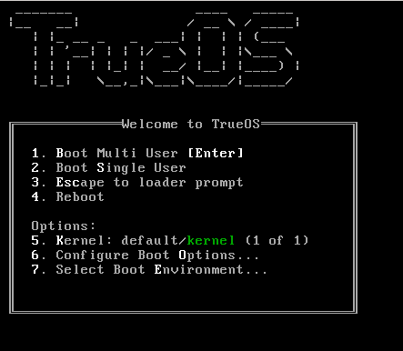

   : Initial Boot Menu

Next, the :guilabel:`TrueOS® Installation Menu`, shown in
:numref:`Figure %s <install15>`, will be displayed. 

.. _install15:

.. figure:: images/install15.png
   :scale: 100%

   : |trueos| Installer Boot Menu

If a key other than :kbd:`Enter` is pressed, this screen will pause
to provide additional time to review its options. If this screen is not
paused, it will automatically boot into the **xorg** option after a few
seconds, providing a number of new options:

* **xorg:** Starts a graphical installer which will auto-detect the
  driver required by the video hardware.

* **vesa:** Starts the graphical installer with the VESA driver loaded.
  Select this option if :guilabel:`xorg` hangs when loading the graphics
  driver.

* **scfb:** Starts the graphical installer with the SCFB driver loaded.
  Select this option if a UEFI system hangs when loading the graphics
  driver, as it provides a nicer display than the :guilabel:`vesa`
  driver. Before selecting this option, double-check CSM has been
  disabled in the BIOS.

* **install:** Starts the text-based installer as described in
  :ref:`Using the Text Installer`.

* **utility:** Starts the system utilities as described in
  :ref:`Using the System Utilities Menu`.

* **reboot:** Exits the installer and reboots the system.

Use the arrow keys to highlight a desired option, then press
:kbd:`Enter` to continue to boot into the option.

The rest of this chapter describes the screens of the graphical
installer. If any problems arise with booting into the graphical
installer, please refer to :ref:`Installation Troubleshooting`.

.. index:: installation
.. _Language Selection Screen:

Language Selection Screen
=========================

The first graphical installer screen, seen in
:numref:`Figure %s <install2>`, indicates the installer successfully
loaded and is ready to present its options.

.. _install2:

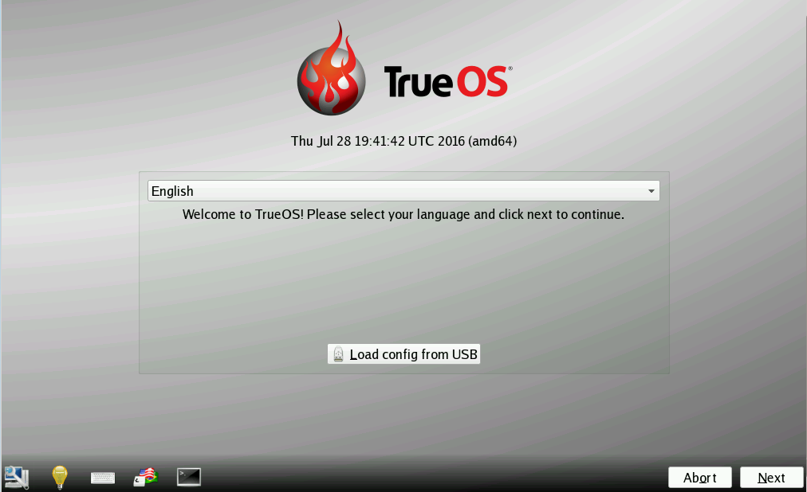

   : Welcome and Language Selection Screen

Starting on the left side, the icons in the bottom navigation area allow
to:

* Access hardware compatibility information to quickly determine if
  the system's video card, Ethernet card, wireless device, and sound
  card are compatible with |trueos|.

* Read a screen's Help text.

* Use the onscreen keyboard.

* Switch between the US keyboard layout and a user selected layout.

* Access the emergency shell described in
  :ref:`Using the System Utilities Menu`.

* Abort the installation.

* Navigate to a previous or upcoming screen.

Hover over an icon to view its description in the tip bar at the
bottom of the screen.

.. note:: The default keyboard layout can be changed now, during the
   post-installation :ref:`Language Screen`, when
   :ref:`Logging In`, or during an active session using the included
   :guilabel:`fcitx` utility.

There is also an option to :guilabel:`Load config from USB`. If the
configuration from a previous installation has been saved, it can be
loaded at this time from a FAT-formatted USB stick.

By default, |trueos| menus will display in English, unless another
language is selected in the drop-down menu in this screen. The menus in
|trueos| are being continuously translated to other languages. To view
the status of specific language, navigate to the
`TrueOS® Translation Site <http://weblate.trueos.org>`_. A language may
show less than 100% translation, indicating not all of the menus have
been translated yet. Any untranslated menus will be displayed in
English. Refer to :ref:`Become a Translator` to assist in translating
the graphical menus.

.. note:: Small screens may not display the entire installer window,
   resulting in buttons at the bottom of the window being hidden and
   inaccessible. In this situation, either press :kbd:`Alt` while
   dragging the window with the mouse or press :kbd:`Alt+N` to select
   the next button of the window.

When finished reviewing this screen, click :guilabel:`Next` to go to the
next installation screen.

.. index:: installation
.. _System Selection Screen:

System Selection Screen
=======================

The :guilabel:`System Selection` screen installs a graphical desktop or
a console-based server operating system, as seen in
:numref:`Figure %s <install3>`. It also can be used for
:ref:`Restoring the Operating System`. This chapter concentrates on a
desktop installation. Refer to :ref:`Install a Server` for instructions
on installing a command-line only server.

.. _install3:

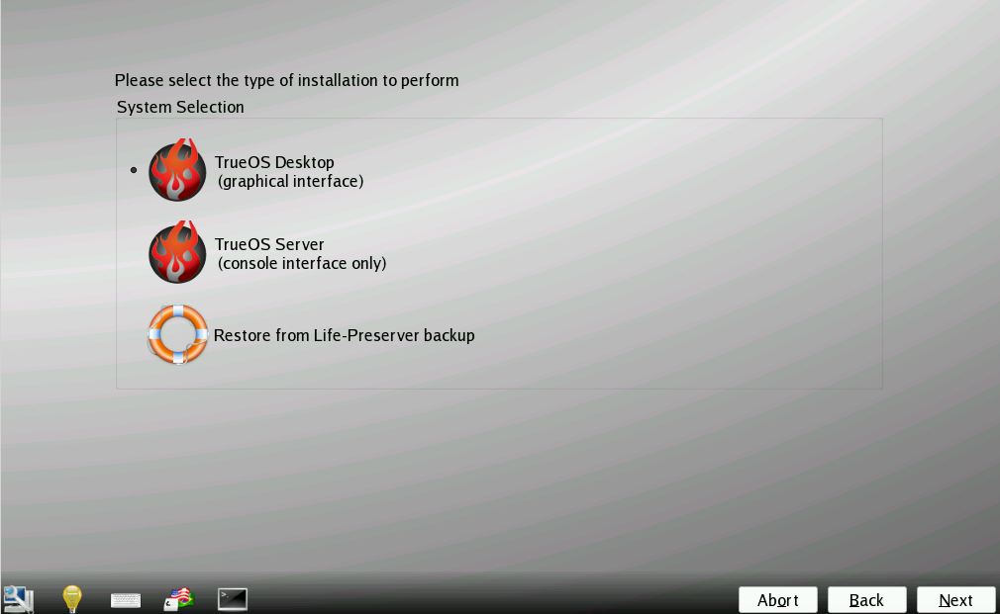

   : System Selection Screen

By default, :guilabel:`TrueOS (Graphical desktop)` will be selected
and the |lumina| Desktop will be installed. Additional software can be
added post-installation using :ref:`AppCafe®`.

To install the desktop, click :guilabel:`Next`.

.. note:: When installing to an existing |pcbsd| or |trueos| system, a
   pop-up window will ask to install to the existing pool without
   reformatting it. Press :guilabel:`OK` to keep the existing pool.
   Clicking :guilabel:`Cancel` will format the existing pool and all of
   its data. Refer to the :ref:`Upgrading from PCBSD 10.x to TrueOS`
   section for more information about this option.

.. index:: installation
.. _Disk Selection Screen:

Disk Selection Screen
=====================

The :guilabel:`Disk Selection" screen`, seen in
:numref:`Figure %s <install5>`, summarizes the default disk
configuration.

.. _install5:

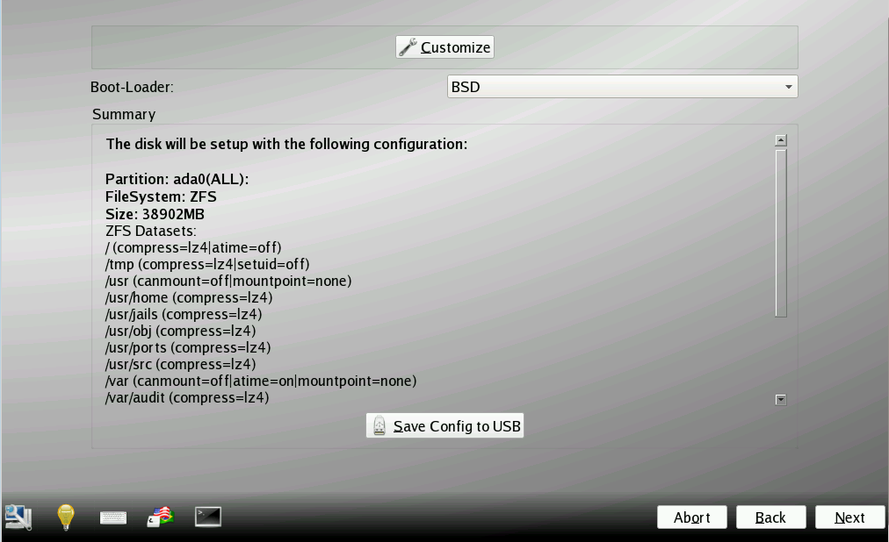

   : Disk Selection Screen

This screen provides a drop-down :guilabel:`Boot-Loader` menu with boot
manager options:

**BSD:** Uses the FreeBSD boot loader. This is recommended as it
supports the ZFS boot environments used by :ref:`Update Manager`.

**GRUB:** Select this option when dual-booting the system and the GRUB
bootloader is preferred.

.. warning:: By default, |trueos| will assume the user wants to install
   on the entire first disk. When installing |trueos| as the only
   operating system on the computer, click :guilabel:`Next` to start the
   installation. However, if this is not intended, review the rest
   of this section to determine how to layout the disk. If |trueos| is
   to be booted with another operating system, please review the section
   on :ref:`Dual Booting`.

To select the disk or partition to install |trueos|, click
:guilabel:`Customize` to start the |trueos| Disk Wizard, shown in
:numref:`Figure %s <install6>`.

.. _install6:

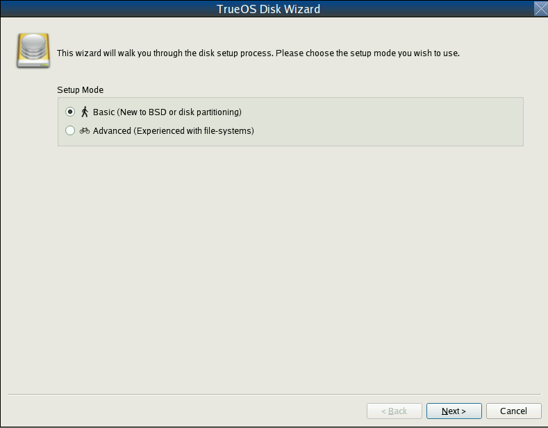

   : |trueos| Disk Wizard

The wizard provides two modes of operation:

* **Basic:** (default) Select this mode if to specify the installation
  partition or disk.

* **Advanced:** Select this mode to specify the installation partition
  or disk, use MBR partitioning, change the default ZFS pool name, force
  the block size used by ZFS, configure a multi-disk installation, add a
  log or cache device, encrypt the disk, or specify the filesystem
  layout.

.. warning:: Regardless of the selected mode, once the disk wizard
   completes and :guilabel:`Next` is chosen at the disk
   :guilabel:`Summary` screen, a pop-up window will ask to start the
   installation. Be sure to review the disk summary before clicking
   :guilabel:`Yes` and starting the installation. The 
   :guilabel:`Summary` screen is the **very last chance** to ensure the
   system is correctly configured. After clicking :guilabel:`Yes`, the
   selected hard drive or partition will be formatted and any data it
   contains will be lost.

Once the disk configuration is finished, the finished configuration can
be saved for later reuse. Insert a FAT-formatted USB stick and click
:guilabel:`Save Config to USB`.

.. index:: installation
.. _Basic Mode:

Basic Mode
----------

Select :guilabel:`Basic` and the wizard will display the screen shown
in :numref:`Figure %s <install7>`.

.. _install7:

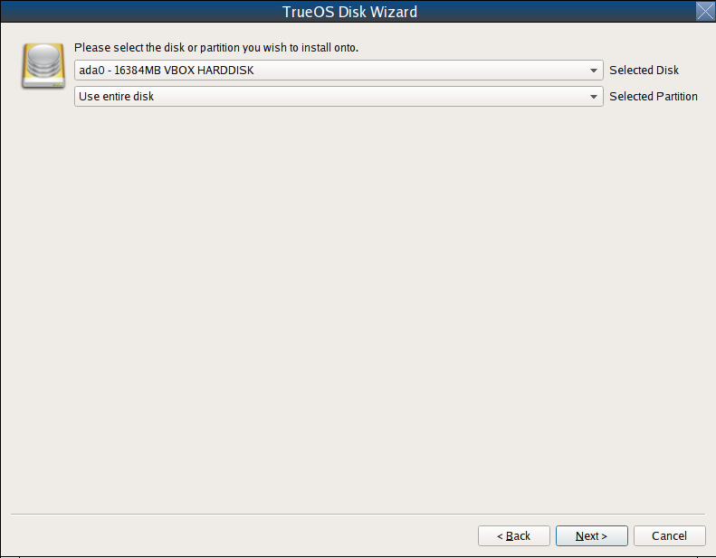

   : Disk or Partition Selection

By default, the first hard disk will be selected. To install on a
different disk, use the :guilabel:`Selected Disk` drop-down menu to
select the disk to install into.

By default, the entire selected disk will be formatted. If the disk
has been divided into partitions or there is an area of free space,
use the :guilabel:`Selected Partition` drop-down menu to select the
desired partition.

.. note:: |trueos| will only install into a primary MBR partition, a
   GPT partition, or an area of free space. That is, |trueos| cannot
   install into a secondary or an extended partition. To create an area
   of free space to install into, refer to :ref:`Creating Free Space`.

Once the disk and partition are selected, click :guilabel:`Next` to
return to the disk :guilabel:`Summary` screen so to review the
selections. To make additional changes, press :guilabel:`Back` to
return to a previous screen. Otherwise, click :guilabel:`Finish` to
leave the wizard. Click :guilabel:`Next` then :guilabel:`Yes` to start
the installation.

.. index:: installation
.. _Advanced Mode:

Advanced Mode
-------------

After selecting advanced mode, the wizard will display the screen shown
in :numref:`Figure %s <install8>`.

.. _install8:

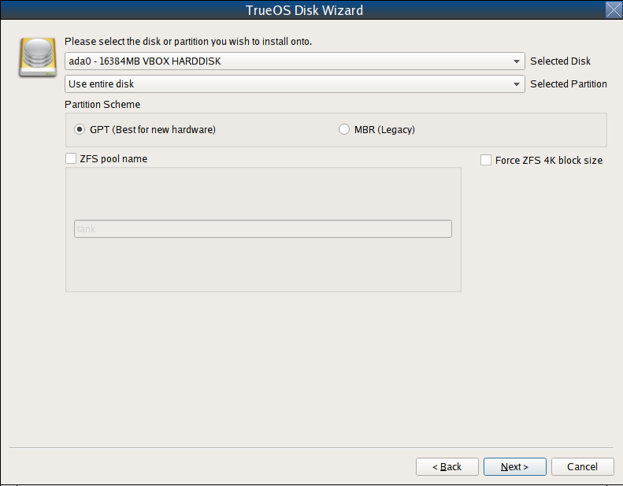

   : Advanced Mode Options

This screen has several options:

* **Selected Disk:** Select the disk to install into.

* **Selected Partition:** Select the desired partition or area of free
  space.

.. note:: |trueos| will only install into a primary MBR partition, a
   GPT partition, or an area of free space. That is, |trueos| cannot
   install into a secondary or an extended partition. To create an area
   of free space to install into, refer to :ref:`Creating Free Space`.

* **Partition Scheme:**  The default of
  :guilabel:`GPT (Best for new hardware)` is a partition table layout
  that supports larger partition sizes than the traditional
  :guilabel:`MBR (Legacy)` layout. **If the installation disk or
  partition is larger than 2 TB, the GPT option must be selected**.
  Since some older motherboards do not support GPT, if the installation
  fails, try again with :guilabel:`MBR (Legacy)` selected. When in
  doubt, try the default selection first. Note this section will not
  appear if a partition other than :guilabel:`Use entire disk` is chosen
  in the :guilabel:`Selected Partition` drop-down menu.

* **ZFS pool name:** To use a pool name other than the default of
  *tank*, check this box and input the name of the pool. Note *root*
  is reserved and can not be used as a pool name.

* **Force ZFS 4k block size:** This option should only be checked if
  the disk supports 4k, even though it lies and reports its size as
  512b. Use with caution as it may cause the installation to fail.

After making any selections, click :guilabel:`Next` to access the ZFS
configuration screens. The rest of this section provides a ZFS overview
and then demonstrates how to customize the ZFS layout.

.. index:: ZFS
.. _ZFS Overview:

ZFS Overview
^^^^^^^^^^^^

ZFS is an enterprise grade file-system, which provides many features
including: support for high storage capacities, high reliability, the
ability to quickly take snapshots, boot environments, continuous
integrity checking and automatic repair, RAIDZ which was designed to
overcome the limitations of hardware RAID, and native NFSv4 ACLs.

If new to ZFS, the Wikipedia entry on :wikipedia:`ZFS` provides an
excellent starting point to learn about its features. Additionally,
`FreeBSD Mastery: ZFS <https://www.michaelwlucas.com/nonfiction/freebsd-mastery-zfs>`_
by Michael W Lucas and Allan Jude is a helpful resource specific to ZFS
as it is implemented in FreeBSD.

These resources are also useful to bookmark and refer to as needed:

* `ZFS Evil Tuning Guide <http://www.solarisinternals.com/wiki/index.php/ZFS_Evil_Tuning_Guide>`_

* `FreeBSD ZFS Tuning Guide <https://wiki.FreeBSD.org/ZFSTuningGuide>`_

* `ZFS Best Practices Guide <http://www.solarisinternals.com/wiki/index.php/ZFS_Best_Practices_Guide>`_

* `ZFS Administration Guide <http://docs.oracle.com/cd/E19253-01/819-5461/index.html>`_

* `Becoming a ZFS Ninja (video) <https://blogs.oracle.com/video/entry/becoming_a_zfs_ninja>`_

* `Blog post explaining how ZFS simplifies the storage stack <https://blogs.oracle.com/bonwick/entry/rampant_layering_violation>`_

Here is a glossary of terms used by ZFS:

**Pool:** A collection of devices that provides physical storage and
data replication managed by ZFS. This pooled storage model eliminates
the concept of volumes and the associated problems of partitions,
provisioning, wasted bandwidth, and stranded storage. Thousands of
filesystems can draw from a common storage pool, each one consuming
only as much space as it actually needs. The combined I/O bandwidth of
all devices in the pool is available to all filesystems at all times.
The
`Storage Pools Recommendations <http://www.solarisinternals.com/wiki/index.php/ZFS_Best_Practices_Guide#ZFS_Storage_Pools_Recommendations>`_
of the ZFS Best Practices Guide provides detailed recommendations for
creating the storage pool.

**Mirror:** A form of RAID where all data is mirrored onto two or more
disks, creating a redundant copy should a disk fail.

**RAIDZ:** ZFS software solution equivalent to RAID5 as it allows one
disk to fail without losing data. Requires at least **3** disks.

**RAIDZ2:** Double-parity ZFS software solution similar to
RAID6 as it allows two disks to fail without losing data. Requires a
minimum of 4 disks.

**RAIDZ3:** Triple-parity ZFS software solution. RAIDZ3 offers three
parity drives and can operate in degraded mode if up to three drives
fail with no restrictions on which drives can fail.

**Dataset:** Once a pool is created, it can be divided into datasets.
A dataset is similar to a folder as it supports permissions. A dataset
is also similar to a filesystem since properties such as quotas and
compression can be set.

**Snapshot:** A read-only, point-in-time copy of a filesystem.
Snapshots can be created quickly and, if little data changes, new
snapshots take up very little space. For example, a snapshot where no
files have changed takes 0 MB of storage, but if a 10 GB file is
changed, it will keep a copy of both the old and the new 10 GB version.
Snapshots provide a clever way of keeping a history of files, should
an older copy or even a deleted file need to be recovered. For this
reason, many administrators take snapshots often (e.g. every 15
minutes), store them for a period of time (e.g. for a month), and
store them on another system. Such a strategy allows the administrator
to roll the system back to a specific time or, if there is a
catastrophic loss, an off-site snapshot can restore the system up to
the last snapshot interval (e.g. within 15 minutes of the data loss).
Snapshots can be cloned or rolled back, but the files on the snapshot
can not be accessed independently.

**Clone:** A writable copy of a snapshot which can only be created on
the same ZFS volume. Clones provide an extremely space-efficient way
to store many copies of mostly-shared data such as workspaces,
software installations, and diskless clients. Clones do not inherit
the properties of the parent dataset, but rather inherit the
properties based on where the clone is created in the ZFS pool.
Because a clone initially shares all its disk space with the original
snapshot, its used property is initially zero. As changes are made to
the clone, it uses more space.

**ZIL:** A filesystem journal that manages writes. The ZIL is a
temporary storage area for sync writes until they are written
asynchronously to the ZFS pool. If the system has many sync writes,
such as from a database server, performance can be increased by adding
a dedicated log device known as a SLOG (Secondary LOG). If the system
has few sync writes, a SLOG will not speed up writes. When creating a
dedicated log device, it is recommended to use a fast SSD with a
supercapacitor or a bank of capacitors that can handle writing the
contents of the SSD's RAM to the SSD. If a dedicated log device is
needed, the SSD should be half the size of system RAM, as anything
larger is unused capacity. Note a dedicated log device can not be shared
between ZFS pools and the same device cannot hold both a log and a cache
device.

**L2ARC:** ZFS uses a RAM cache to reduce read latency. If an SSD is
dedicated as a cache device, it is known as an L2ARC and ZFS uses it
to store more reads which can increase random read performance.
However, adding a cache device will not improve a system with too
little RAM and will actually decrease performance, as ZFS uses RAM to
track the contents of L2ARC. RAM is always faster than disks, so
always add as much RAM as possible before determining if the system
would benefit from a L2ARC device. If a lot of applications do large
amounts of random reads on a dataset small enough to fit into the L2ARC,
read performance may be increased by adding a dedicated cache device.
SSD cache devices only help if the working set is larger than system
RAM, but small enough that a significant percentage of it will fit on
the SSD. Note a dedicated L2ARC device can not be shared between ZFS
pools.

.. index:: ZFS
.. _ZFS Layout:

ZFS Layout
^^^^^^^^^^

In :guilabel:`Advanced Mode`, the disk setup wizard allows configuring
the ZFS layout. The initial ZFS configuration screen is seen in
:numref:`Figure %s <install9>`.

.. _install9:

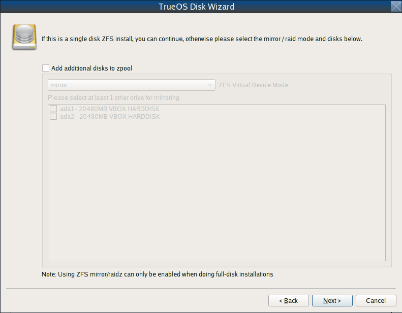

   : ZFS Configuration

If the system contains multiple drives to be used to create a ZFS mirror
or RAIDZ*, check :guilabel:`Add additional disks to storage pool`, which
will enable this screen. Any available disks will be listed in the box
below the :guilabel:`ZFS Virtual Device Mode` drop-down menu. Select the
desired level of redundancy from the :guilabel:`ZFS Virtual Device Mode`
drop-down menu, then check the box for each disk to add to the
configuration.

.. note:: The |trueos| installer requires entire disks (not partitions)
   when adding additional disks to the pool.

While ZFS allows using disks of different sizes, this is discouraged as
it will decrease storage capacity and ZFS performance.

The |trueos| installer supports multiple ZFS configurations:

* **mirror:** Requires a minimum of 2 disks.

* **RAIDZ1:** Requires a minimum of 3 disks. For best performance,
  a maximum of 9 disks is recommended.

* **RAIDZ2:** Requires a minimum of 4 disks. For best performance, a
  maximum of 10 disks is recommended.

* **RAIDZ3:** Requires a minimum of 5 disks. For best performance, a
  maximum of 11 disks is recommended.

* **stripe:** Requires a minimum of 2 disks.

.. note:: A stripe does NOT provide ANY redundancy. If any disk fails in
   a stripe, all data in the pool is lost!

The installer will not allow a configuration choice in which the system
does not meet the minimum number of disks required by the configuration.
When selecting a configuration, a message will indicate how many more
disks are required.

When finished, click :guilabel:`Next` to see the screen shown in
:numref:`Figure %s <install10>`.

.. _install10:

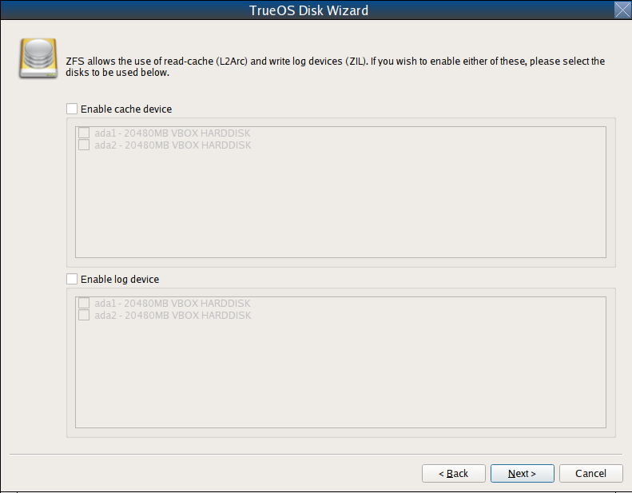

   : L2ARC and ZIL

This screen can be used to specify an SSD to use as an L2ARC read
cache or as a secondary log device (ZIL). Any available devices will
be listed in the boxes in this screen.

.. note:: A separate SSD is needed for each type of device.

Refer to the descriptions for ZIL and L2ARC in the :ref:`ZFS Overview`
to determine if the system would benefit from any of these devices
before adding them in this screen. When finished, click :guilabel:`Next`
to see the screen shown in :numref:`Figure %s <install11>`.

.. _install11:

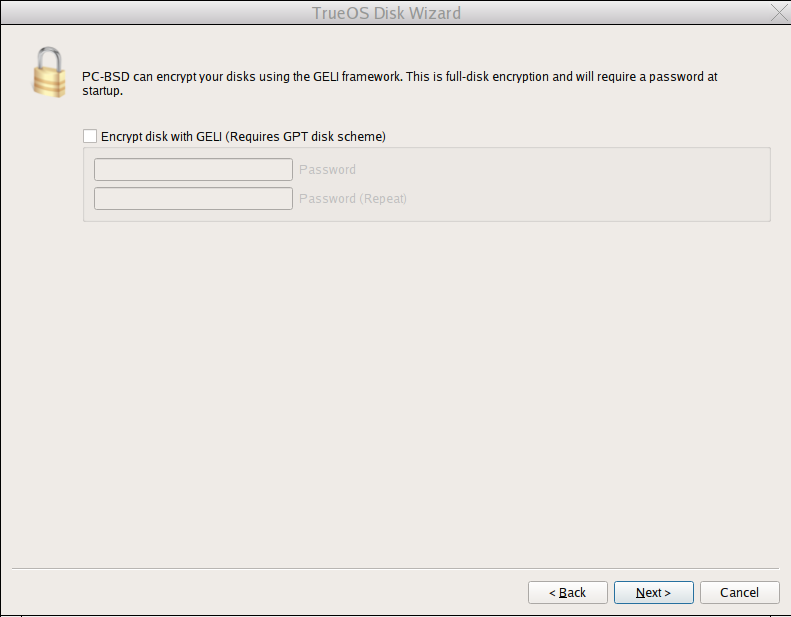

   : Encryption

This screen can be used to configure full-disk encryption which is
meant to protect the data on the disks should the system itself be
lost or stolen. This type of encryption prevents the data on the disks
from being available during bootup unless the correct passphrase is
typed at the bootup screen. Once the passphrase is accepted, the data
is unencrypted and can easily be read from disk.

To configure full-disk encryption, check
:guilabel:`Encrypt disk with GELI`. This option will be greyed out if
:guilabel:`GPT (Best for new hardware)` is not selected as GELI does not
support MBR partitioning. If needed, use :guilabel:`Back` to go back to
the :ref:`Advanced Mode` screen and select
:guilabel:`GPT (Best for new hardware)`. Once
:guilabel:`Encrypt disk with GELI` is checked, input a strong passphrase
twice into the :guilabel:`Password` fields. This password should be long
and easy to remember, but hard for others to guess.

.. warning:: This passphrase is required to decrypt the disks. If the
   passphrase is lost or forgotten, all access will be lost to the
   encrypted data!

When finished, click :guilabel:`Next` to move to the screen shown in
:numref:`Figure %s <install12>`.

.. _install12:

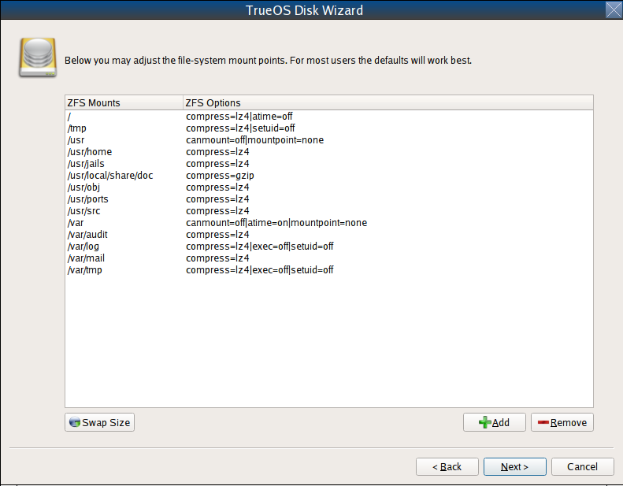

   : Default ZFS Layout

Regardless of how many disks are selected for the ZFS configuration, the
default layout will be the same. ZFS does not require separate
partitions for :file:`/usr`, :file:`/tmp`, or :file:`/var`. Instead,
create one ZFS partition (pool) and specify a mount for each
dataset. A :file:`/boot` partition is not mandatory with ZFS as the
|trueos| installer puts a 64k partition at the beginning of the drive.

.. warning:: Do not remove any of the default mount points as they are
   used by |trueos|.

Use :guilabel:`Add` to add additional mount points. The system will ask
for the name of the mount point as size is not limited at creation time.
Instead, the data on any mount point can continue to grow as long as
space remains within the ZFS pool.

To set the swap size, click :guilabel:`Swap Size`. This will prompt to
enter a size in MB. If a RAIDZ* or mirror exists, a swap partition
of the specified size will be created on each disk and mirrored between
the drives. For example, if a 2048 MB swap size is specified, a 2 GB
swap partition will be created on all of the specified disks, yet the
total swap size will be 2GB, due to redundancy.

Right-click any mount point to toggle between enabling or disabling many
ZFS properties:

* **atime:** When set to :guilabel:`on`, controls whether the access
  time for files is updated when they are read. When set to
  :guilabel:`off`, this property avoids producing write traffic when
  reading files and can result in significant performance gains, though
  it might confuse mailers and some other utilities.

* **canmount:** If set to :guilabel:`off`, the filesystem can not be
  mounted.
  
* **casesensitivity:** The default is :guilabel:`sensitive`, as UNIX
  filesystems use case-sensitive file names. For example, "kris" is
  different from "Kris". To tell the dataset to ignore case, select
  :guilabel:`insensitive`.

* **checksum:** Automatically verifies the integrity of the data
  stored on disks. Turning this property :guilabel:`off` is highly
  discouraged.

* **compression:** If set to :guilabel:`on`, automatically compresses
  stored data to conserve disk space.

* **exec:** If set to :guilabel:`off`, processes can not be executed
  from within this filesystem.

* **setuid:** If set to :guilabel:`on`, the set-UID bit is respected.

After clicking :guilabel:`Next`, the wizard will show a summary of the
selections. To make further changes, use :guilabel:`Back` to return to
a previous screen. Otherwise, click :guilabel:`Finish` to leave the
wizard and return to the :guilabel:`Disk Selection` screen.

.. index:: installation
.. _Installation Progress Screen:

Installation Progress Screen
============================

Once :guilabel:`Yes` is selected to start the installation, a progress
screen, seen in :numref:`Figure %s <install13>`, provides a progress
bar and messages so the user can watch the installation's progress.

.. _install13:

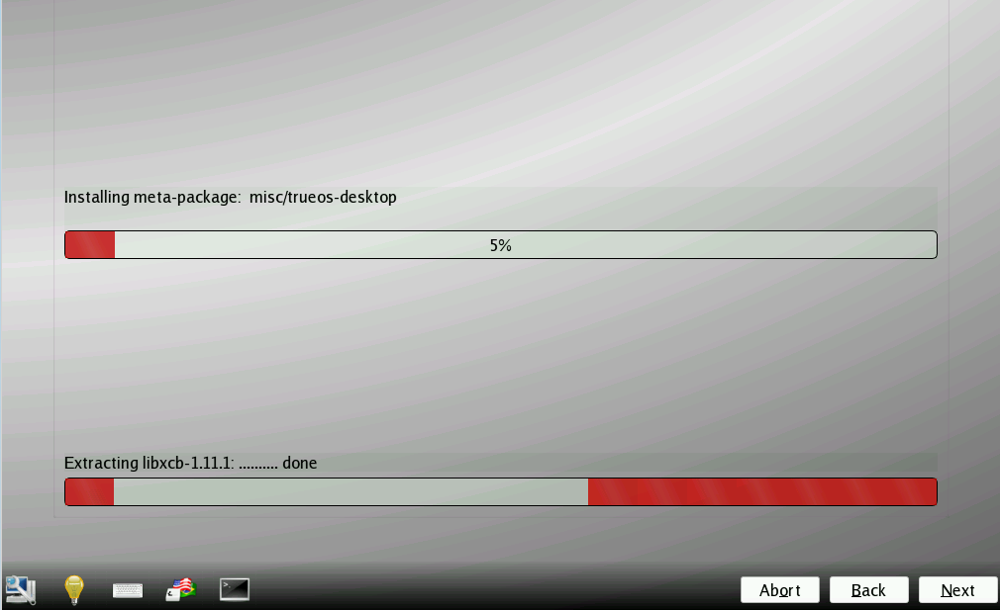

   : Installation Progress

How long the installation takes depends upon the speed of the hardware
and the installation type selected. A typical installation takes between
5 and 15 minutes.

.. index:: installation
.. _Installation Finished Screen:

Installation Finished Screen
============================

The screen shown in
:numref:`Figure %s <install14>` appears once the installation is
complete.

.. _install14:

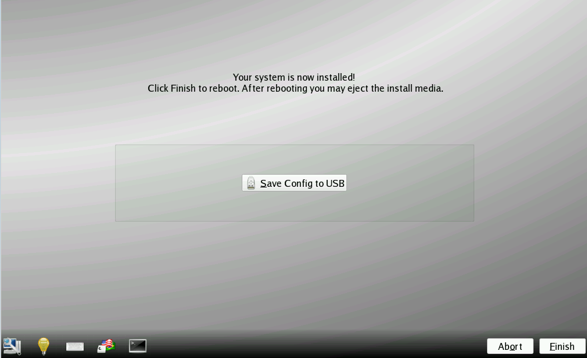

   : |trueos| Installation Complete

Click :guilabel:`Finish` to complete the |trueos| installation. It will
return to the
:numref:`Figure %s: TrueOS® Installer Boot Menu <install15>`. To
manually configure the system before booting into it, select
:guilabel:`utility` to open a *root* shell. Otherwise, select
:guilabel:`reboot` to reboot into the new installation. Wait until this
menu exits before removing the installation media.