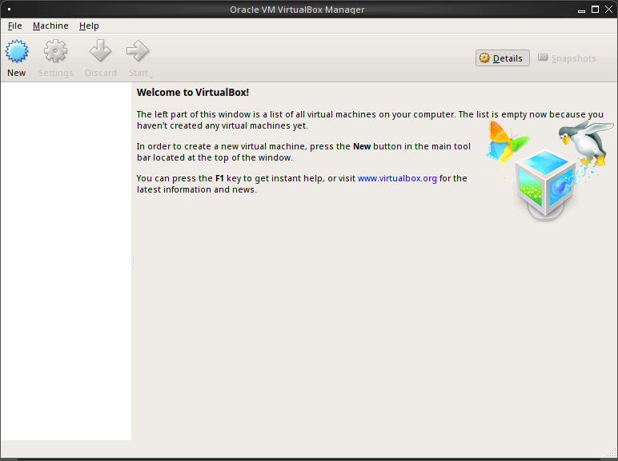
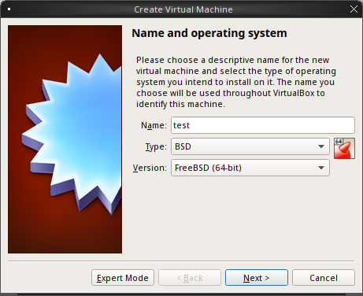
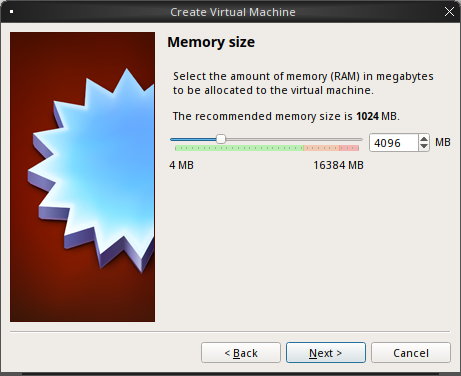
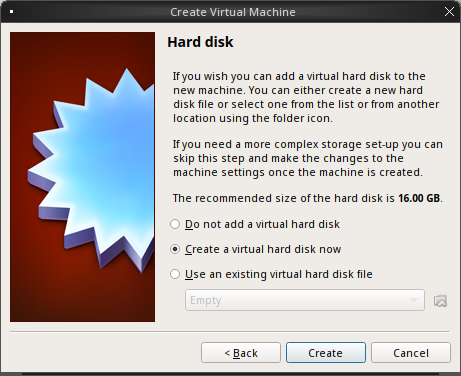
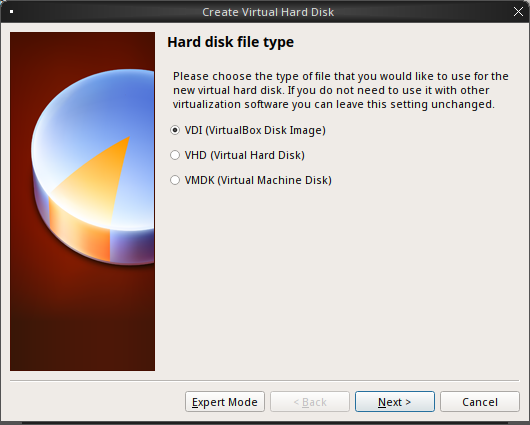
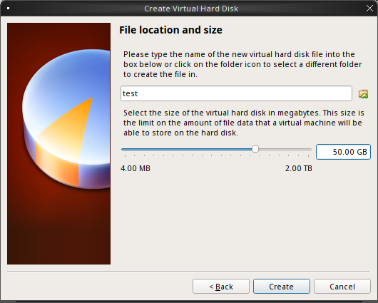
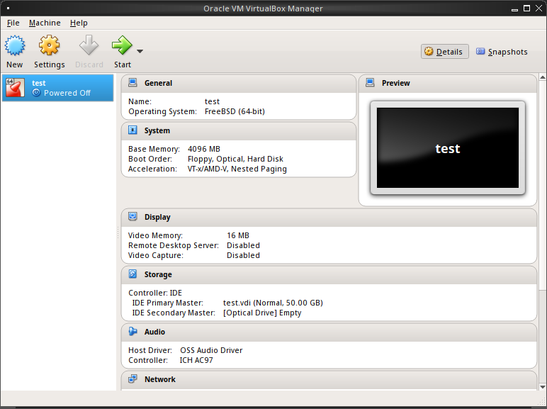
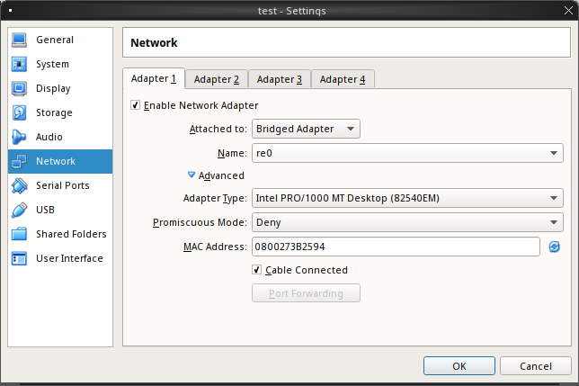
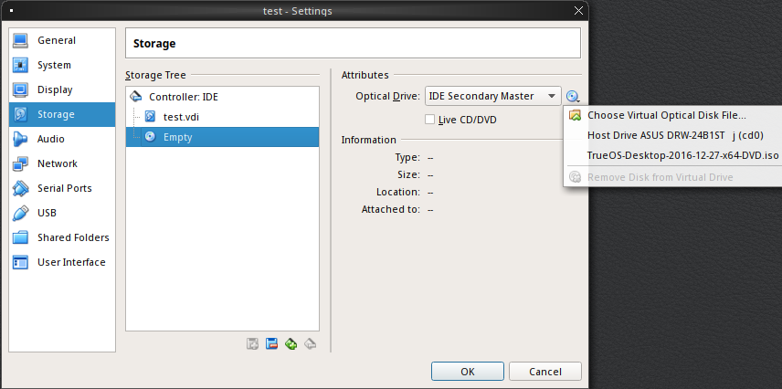

.. index:: Introduction
.. _Introduction:

Introduction
************

Written by users of the |trueos| operating system. Maintained and edited
by Dru Lavigne and Tim Moore.

Welcome to |trueos|!

This Handbook covers the installation and use of |trueos|. This Handbook
is a work in progress and relies on the contributions of many
individuals. To assist with the Handbook, refer to the documentation
`README <https://github.com/trueos/trueos-docs/blob/master/trueos-handbook/README.md>`_.
If using IRC, join the #trueos channel on the Freenode network to converse
with many other |trueos| users. `Gitter <https://gitter.im/trueos>`_ is
another popular option for users.

`TrueOS® <https://www.trueos.org>`_ (formerly known as |pcbsd|) began in
2005 when Kris Moore presented the first beta version of a FreeBSD
operating system pre-configured for desktop use. Since then, |trueos|
has matured into a polished, feature-rich, free-of-charge, open source
operating system that meets the desktop or server needs of the beginner
to the advanced user alike.

|trueos| is essentially a customized installation of FreeBSD, not a
forked derivative. Since the underlying FreeBSD system is kept intact,
you have a fully functional FreeBSD system under the hood. |trueos|
provides an easy-to-use installer which can be used to install a
desktop or a server version of FreeBSD. Other differences from FreeBSD
include:

* |trueos| pre-configures the BSD-licensed |lumina| desktop environment
  during a desktop installation. Additional desktop environments can be
  installed and appear in the graphical login menu, allowing the user to
  select their preferred environment.

* The |trueos| installer supports configuring ZFS and encryption during
  installation.

* |trueos| provides both a graphical and a command line software
  management system.

* |trueos| provides many graphical utilities for system configuration
  and management. These utilities have both a command line equivalent and
  a REST and WebSocket API so they can also be used to manage multiple
  systems.

* |trueos| comes pre-configured with a number of automatic scripts for
  performing tasks like connecting digital cameras or USB memory sticks.

* The |trueos| boot menu supports boot environments or snapshots of the
  operating system. The |trueos| Update Manager automatically adds a new
  boot environment to the boot menu before updating the operating system.
  With this functionality, if an update fails, the system can be rebooted
  into the previous version of the operating system before the update was
  installed. This allows for easy recovery if any issues happen during the
  update process.

While started as an independent project, |trueos| has been financially backed
and supported by the enterprise-class hardware solutions provider
`iXsystems <https://www.ixsystems.com/>`_ since October 2006.

.. index:: Features
.. _Features:

Features
========

|trueos| provides many features:

* **Easy installation:** To install either a graphical desktop or
  command-line server, simply insert the installation media, reboot the
  system to start the installer, and answer a few questions in the
  installation menus.

* **Automatically configured hardware:** Video, sound, network, and
  other devices are configured automatically during installation.

* **Customizable desktop interface:** |trueos| installs the |lumina|
  desktop but additional desktop environments can be installed to
  support day-to-day computing needs.

* **Easy software management:** With the |sysadm|
  :sysclbk:`AppCafe <appcafe>`, installing, upgrading, and uninstalling
  software is safe and easy.

* **Lots of software available:** |appcafe| is used to install software
  ported to FreeBSD (currently over 26,100 applications).

* **Easy to update:** |trueos| (with |sysadm|) provides a built-in
  :sysclbk:`Update Manager <update-manager>` which provides
  notifications of available updates. This utility makes it easy to
  apply operating system security fixes, bug fixes, and system
  enhancements. Additionally, the Update Manager is used to upgrade the
  operating system or update installed software.

* **No fragmentation:** |trueos| hard drives never need defragmenting
  and are formatted with OpenZFS, a self-healing filesystem.

* **Laptop support:** Provides power saving, swap space encryption, and
  automatic switching between wired and wifi network connections. The
  rolling release model of |trueos| provides an environment to quickly
  add support for new hardware.

* **Easy system administration:** |trueos| provides many graphical tools
  for performing system administration.

* **Localization:** |trueos| supports a variety of native languages and
  locales out of the box.

* **Vibrant community:** |trueos| has a friendly and helpful
  :ref:`community <TrueOS Community>`.

.. index:: Security
.. _Security:

Security
--------

The |trueos| system is secure by default. This section describes an
overview of the built-in security features. Additional information about
increasing the security of the installed system beyond the configured
defaults are also provided in this section.

The security features built into |trueos| include:

* **Naturally immune to viruses and other malware:** Most viruses are
  written to exploit the Windows operating system and are incompatible
  with the binaries and paths found on a |trueos| system. Antivirus
  software is still available in the Security section of |appcafe|, as
  this is useful when sending or forwarding email attachments to users
  running other operating systems.

* **Potential for serious damage is limited:** Privilege separation
  between users and root (the administrator account) are built in to
  |trueos|. Files and directories can only be modified by the owning
  user, any specified groups, and root (depending on permissions). Any
  programs or scripts executed are only granted the permissions of that
  user. This means that a malicious program will only be able to affect
  the files and directories owned by that user and not core operating
  system files. Only users that are a member of the *wheel* and/or
  *operator* groups can gain administrative access and are not allowed
  to list the contents of a directory or access files outside of the
  "user" and "group" permissions that have been set.

* **Built-in firewall:** The default firewall ruleset allows access to
  the Internet and the shares available on the network, but does not
  allow any inbound connections to the computer.

* **Very few services are enabled by default:** The list of services
  that are started at boot time can be viewed by reading through the
  output of :command:`rc-update` via the command line, or by using
  Service Manager in the |sysadm| GUI. Service Manager also allows
  services to be started and stopped and also allow a service to be
  enabled or disabled at boot.

* **SSH is disabled by default:** SSH can only be enabled by the
  superuser (also referred to as 'root' or the administrator user).
  This setting prevents bots and other users from trying to access the
  system. If SSH access is required and was not enabled during
  installation, add :command:`sshd_enable=YES` to the
  :file:`/etc/rc.conf`. The service can then be started by typing the
  :command:`service sshd start` on the command line, or using the
  Service Manager in the |sysadm| GUI. A firewall rule will also need
  to be added using the |sysadm|
  :sysclbk:`Firewall Manager <firewall-manager>` to allow SSH
  connections through the default SSH TCP port 22.

* **SSH root logins are disabled by default:** If SSH is enabled, login
  as a regular user and use :command:`su` or :command:`sudo` when
  administrative actions are required. Do not change this setting, as it
  prevents an unwanted user from having complete access to the system.

* **sudo is installed:** sudo is configured to allow users in the
  *wheel* group permission to run an administrative command after typing
  the user password, not the *root* password. By default, the first user
  created during installation is added to the *wheel* group. Use the
  |sysadm| :sysclbk:`User Manager <user-manager>` to add other users to
  the wheel group to allow that user administrative access. To change
  the default :command:`sudo` configuration, always use the
  :command:`visudo` as root. This command verifies there are no syntax
  errors, which could inadvertently prevent root access.

* :wiki:`AES instruction set <AES_instruction_set>` (AESNI) support is
  loaded by default for the Intel Core i5/i7 processors that support
  this encryption set. This support speeds up AES encryption and
  decryption.

* **Automatic notification of security advisories:**
  The |sysadm| :sysclbk:`Update Manager <update-manager>` automatically
  checks for any updates that are available as the result of a
  `security advisory <https://www.freebsd.org/security/advisories.html>`_
  affecting |trueos|. This allows the administrator to keep the
  operating system fully patched against vulnerabilities with just the
  click of a mouse.

* The |trueos| operating system and its available software packages are
  built with `LibreSSL <http://www.libressl.org/>`_, which has fewer
  vulnerabilities than OpenSSL.

* :sysclbk:`PersonaCrypt <personacrypt>` allows a user to use a
  removable, encrypted device for the user's home directory.

* :ref:`Tor Mode` can be used to anonymously access Internet sites as it
  automatically forwards all Internet traffic through the
  `Tor Project's <https://www.torproject.org/>`_ transparent proxy
  service.

To learn more about security on FreeBSD and |trueos| systems,
:command:`man security` is a good place to start. These resources
provide more information about security on FreeBSD based operating
systems:

* `FreeBSD Security Information <https://www.freebsd.org/security/>`_

* `Security Section in the FreeBSD Handbook <https://www.freebsd.org/doc/en_US.ISO8859-1/books/handbook/security.html>`_

* `Hardening FreeBSD <http://www.bsdguides.org/2005/hardening-freebsd/>`_

.. index:: ZFS overview
.. _ZFS Overview:

ZFS Overview
------------

ZFS is an enterprise grade file-system, which provides many features.
These include: support for high storage capacities, high reliability,
the ability to quickly take snapshots, boot environments, continuous
integrity checking and automatic repair, RAIDZ which was designed to
overcome the limitations of hardware RAID, and native NFSv4 ACLs.

If new to ZFS, the Wikipedia entry on :wiki:`ZFS` provides an
excellent starting point to learn about its features. Additionally,
`FreeBSD Mastery: ZFS <https://www.michaelwlucas.com/os/fmzfs>`_
by Michael W Lucas and Allan Jude is a helpful ZFS resource as it
is implemented in FreeBSD.

These resources are also useful to bookmark and peruse as needed:

* `ZFS Evil Tuning Guide <https://www.solaris-cookbook.eu/solaris/solaris-10-zfs-evil-tuning-guide/>`_

* `FreeBSD ZFS Tuning Guide <https://wiki.FreeBSD.org/ZFSTuningGuide>`_

* `ZFS Best Practices Guide <https://documents.irf.se/get_document.php?group=Computer&docid=311>`_

* `ZFS Administration Guide <https://docs.oracle.com/cd/E19253-01/819-5461/index.html>`_

* `Becoming a ZFS Ninja (video) <https://blogs.oracle.com/video/becoming-a-zfs-ninja>`_

* `Blog post explaining how ZFS simplifies the storage stack <https://blogs.oracle.com/bonwick/rampant-layering-violation>`_

:numref:`Table %s <zfsterms>` is a brief glossary of terms used by ZFS:

.. tabularcolumns:: |>{\RaggedRight}p{\dimexpr 0.20\linewidth-2\tabcolsep}
                    |>{\RaggedRight}p{\dimexpr 0.80\linewidth-2\tabcolsep}|

.. _zfsterms:

.. table:: ZFS Terms
   :class: longtable

   +----------+----------------------------------------------------------------------------------------------------------------------------------------------+
   | Term     | Description                                                                                                                                  |
   +==========+==============================================================================================================================================+
   | Pool     | A collection of devices providing physical storage and data replication managed by ZFS. This pooled storage model eliminates the concept of  |
   |          | volumes and the associated problems of partitions, provisioning, wasted bandwidth, and stranded storage. Thousands of filesystems can draw   |
   |          | from a common storage pool, each one consuming only its required space. The combined I/O bandwidth of all devices in the pool is available   |
   |          | at all times to all filesystems. The `Storage Pools Recommendations <http://zqscm.qiniucdn.com/data/20091118230710/index.html>`_ of the ZFS  |
   |          | Best Practices Guide provides detailed recommendations for creating the storage pool.                                                        |
   +----------+----------------------------------------------------------------------------------------------------------------------------------------------+
   | Mirror   | A form of RAID where all data is mirrored onto two or more disks, creating a redundant copy should a disk fail.                              |
   +----------+----------------------------------------------------------------------------------------------------------------------------------------------+
   | RAIDZ    | ZFS software solution equivalent to RAID5, as it allows one disk to fail without losing data. Requires at least *3* disks.                   |
   +----------+----------------------------------------------------------------------------------------------------------------------------------------------+
   | RAIDZ2   | Double-parity ZFS software solution similar to RAID6, as it allows two disks to fail without losing data. Requires a minimum of *4* disks.   |
   +----------+----------------------------------------------------------------------------------------------------------------------------------------------+
   | RAIDZ3   | Triple-parity ZFS software solution. RAIDZ3 offers three parity drives and can operate in degraded mode if up to three drives fail with no   |
   |          | restrictions on which drives can fail.                                                                                                       |
   +----------+----------------------------------------------------------------------------------------------------------------------------------------------+
   | Dataset  | Once a pool is created, it can be divided into datasets. A dataset is similar to a folder as it supports permissions. A dataset is also      |
   |          | similar to a filesystem since properties such as quotas and compression can be set.                                                          |
   +----------+----------------------------------------------------------------------------------------------------------------------------------------------+
   | Snapshot | A read-only, point-in-time copy of a filesystem. Snapshots can be created quickly and, if little data changes, new snapshots take very       |
   |          | little space. For example, a snapshot with no changed files takes 0 MB of storage, but a changed 10 GB file will store both the old and new  |
   |          | versions. Snapshots provide a clever way of keeping a history of files, which allows an older copy or even a deleted file to be recovered.   |
   |          | For this reason, many administrators take snapshots often (e.g. every 15 minutes), store them for a period of time (e.g. for a month), and   |
   |          | store them on another system. Such a strategy allows an administrator to roll a system back to a specific time, or in the event of a         |
   |          | catastrophic loss, an off-site snapshot can restore the system up to the last snapshot interval (e.g. within 15 minutes of the data loss).   |
   |          | Snapshots can be cloned or rolled back, and individual files within a snapshot may be opened/copied (but unaltered) as needed.               |
   +----------+----------------------------------------------------------------------------------------------------------------------------------------------+
   | Clone    | A writable copy of a snapshot which can only be created on the same ZFS volume. Clones provide an extremely space efficient way to store     |
   |          | many copies of mostly-shared data such as workspaces, software installations, and diskless clients. Clones do not inherit the properties of  |
   |          | the parent dataset, but rather inherit the properties based on where the clone is created in the ZFS pool. Because a clone initially shares  |
   |          | all its disk space with the original snapshot, its used property is initially zero. As changes are made to the clone, it uses more space.    |
   +----------+----------------------------------------------------------------------------------------------------------------------------------------------+
   | ZIL      | A filesystem journal that manages writes. The ZIL is a temporary storage area for sync writes until they are written asynchronously to the   |
   |          | ZFS pool. If the system has many sync writes, such as from a database server, performance can be increased by adding a dedicated log device  |
   |          | known as a SLOG (Secondary LOG). If the system has few sync writes, a SLOG will not speed up writes. When creating a dedicated log device,   |
   |          | it is recommended to use a fast SSD with a supercapacitor or a bank of capacitors that is able to handle writing the contents of the SSD's   |
   |          | RAM to the SSD. If a dedicated log device is needed, the SSD should be half the size of available system RAM, as anything larger is unused   |
   |          | capacity. Note: A dedicated log device can not be shared between ZFS pools, and the same device cannot be used for both a log and a cache    |
   |          | device.                                                                                                                                      |
   +----------+----------------------------------------------------------------------------------------------------------------------------------------------+
   | L2ARC    | ZFS uses a RAM cache to reduce read latency. If an SSD is dedicated as a cache device, it is then known as an L2ARC. ZFS will then use the   |
   |          | L2ARC to store more reads which can increase random read performance. Adding a cache device will not improve a system with too little RAM    |
   |          | and actually decreases performance as ZFS uses RAM to track the contents of the L2ARC. RAM is always faster than disks, so always add as     |
   |          | much RAM as possible before determining if the system would benefit from an L2ARC device. If a lot of applications do large amounts of       |
   |          | random reads on a dataset that is small enough to fit into the L2ARC, read performance may be increased by adding a dedicated cache device.  |
   |          | SSD cache devices will only help if the working set is larger than available system RAM, but small enough that a significant percentage of   |
   |          | the data fits on the SSD. Note: A dedicated L2ARC device cannot be shared between ZFS pools.                                                 |
   +----------+----------------------------------------------------------------------------------------------------------------------------------------------+

.. note:: The Insight file manager has the ability to mount snapshots
	  and work with individual files in that snapshot. Individual
	  files within a snapshot cannot be permanently deleted due to
	  the built-in redundancy of ZFS. To wipe a file completely
	  from disk, the entirety of every snapshot containing the file
	  must be pruned.

|trueos| Comparisons
====================

As |trueos| grows and evolves, many users appreciate comparisons with
other operating systems. These comparisons are intended to help new
users understand the abilities and features available when deciding to
install |trueos|. Accuracy is a chief concern.

.. index:: FreeBSD/PC-BSD comparison
.. _FreeBSD and PCBSD:

FreeBSD and PC-BSD
------------------

These features or enhancements were introduced with |trueos| and now
separate |trueos| from |pcbsd|:

.. note:: |pcbsd| and FreeBSD are placed together as both are very
   similar "under the hood". The differences for either OS to |trueos|
   are listed here.

* Based on FreeBSD-CURRENT.

* The GRUB bootloader has been replaced by the FreeBSD bootloader, which
  now provides both GELI and boot environment support.

* **Quick boot times with OpenRC:** |trueos| is using
  `OpenRC <https://github.com/OpenRC/openrc>`_ as part of the init
  process which allows services to be started in parallel. This results
  in dramatically improved system boot times for |trueos|. OpenRC also
  improves general service management. One  example is the ability to
  automatically run when new elements are introduced to the system, such
  as plugging in an Ethernet cable. Using OpenRC allows |trueos| to use
  some system services that are different from FreeBSD. These differences
  are listed in :numref:`Table %s <sysserv>`

  .. tabularcolumns:: |>{\RaggedRight}p{\dimexpr 0.35\linewidth-2\tabcolsep}
                      |>{\RaggedRight}p{\dimexpr 0.30\linewidth-2\tabcolsep}
                      |>{\RaggedRight}p{\dimexpr 0.35\linewidth-2\tabcolsep}|

  .. _sysserv:

  .. table:: Differences between system services in |trueos| and FreeBSD
     :class: longtable

     +------------------+--------------+-----------------+
     | |trueos| Service | Started From | FreeBSD Service |
     +==================+==============+=================+
     | openntpd         | Ports        | ntpd            |
     +------------------+--------------+-----------------+
     | network          | Base         | netif           |
     +------------------+--------------+-----------------+
     | wpa_supplicant   | Ports; Start | wpa_supplicant  |
     |                  | with network | (from Base)     |
     +------------------+--------------+-----------------+
     | dhcpcd           | Ports        | dhclient        |
     +------------------+--------------+-----------------+

  .. note:: The :ref:`sysserv` table is updated as development continues
     on the |trueos| implementation of OpenRC. For a complete list of all
     available services in OpenRC, see :ref:`rcuprnlvl`.

* A |trueos| installation includes the |lumina| Desktop. Additional
  window managers and desktop environments can be installed using the
  |appcafe|. Meta packages are available for popular desktop
  environments to allow easy installation of all required packages.

* The `SysAdm™ Client <https://sysadm.us/handbook/client/>`_
  and `Server <https://sysadm.us/handbook/server/>`_ has replaced
  Control Panel. Most of the utilities from Control Panel are
  rewritten to use the |sysadm| middleware. Under the hood, |sysadm|
  provides REST and WebSocket APIs for securely managing local or
  remote FreeBSD and |trueos| systems.

* Many utilities have been converted to the |sysadm| API and many more
  are available through `SysAdm <https://sysadm.us/handbook/client/>`_:

  * AppCafe
  * Update Manager
  * Boot Environments
  * Devices
  * Firewall
  * Mouse Settings
  * Services
  * System Controls
  * Tasks
  * Users
  * Life Preserver

* The functionality provided by the *About* utility is incorporated into
  :lumbk:`Lumina Information <luminautl.html#information>`.

* The functionality provided by the
  :sysclbk:`Service Manager <service-manager>`
  (:command:`pc-servicemanager`) is integrated into |sysadm|.

* The Active Directory & LDAP utility (:command:`pc-adsldap`) is
  deprecated.

* Login Manager (:command:`pc-dmconf`) is replaced by
  :command:`pcdm-config`).

* System Manager (:command:`pc-sysmanager`) is deprecated.

* :command:`freebsd-update` is retired in favor of using :command:`pkg`
  for system updates.

* The option to use the scfb display driver is added to the installer.
  This driver is suitable for newer UEFI laptops as it automatically
  detects the native resolution. This is a good solution for newer
  Intel hardware that would otherwise require drivers that have not been
  ported to FreeBSD. Before selecting this driver, check the BIOS and
  ensure the CSM module is disabled.

.. note:: Depending on the system hardware, the scfb driver may not
	  support a dual-head configuration, for example, using an
	  external port for presentations. Some hardware will support
	  multi-monitors using the scfb driver but is dependant on how
	  the graphics are embedded onto the hardware and which ports
	  are attached to which video card(s). Support for suspend and
	  resume is also dependant on manufacture implemenatation. See
	  :command:`man 4 scfb` and :command:`man 4 acpi` for additional
	  information.

* :guilabel:`Customize` is removed from the :ref:`System Selection`
  screen in order to reduce the size of the installation media.
  Additional software can be installed post-installation using |appcafe|.

* The :guilabel:`Boot to console (Disable X)` option has been added to
  the graphical boot menu.

* The graphical and command line versions of PBI Manager and Warden are
  removed.

* :command:`pc-thinclient` is removed as it is deprecated.

.. index:: Linux and TrueOS
.. _Linux and TrueOS:

Linux and |trueos|
------------------

|trueos| is based on FreeBSD, meaning it is not a Linux distribution.
While there are many similarities with Linux, some features have
different names and some commands have different flags or output on a
BSD based system. This section will cover some of these differences.

BSD and Linux use different filesystems. Many Linux distros use EXT2,
EXT3, EXT4, or BTRFS, while |trueos| uses UFS or OpenZFS. In order to
dual-boot with Linux or access data on an external drive formatted with
another filesystem, it is imperative to research if the filesystem used
is accessible to both operating systems.

:numref:`Table %s <filesys support>` summarizes the various filesystems
commonly used by desktop systems. |trueos| automatically mounts several
filesystems: *FAT16*, *FAT32*, *EXT2*, *EXT3* (without journaling),
*EXT4* (read-only), *NTFS5*, *NTFS6*, and *XFS*.

  .. note:: A comparison of some popular graphical file management
	    utilities available in |trueos| can be found in the
	    :ref:`Files and File Sharing` section.

.. tabularcolumns:: |>{\RaggedRight}p{\dimexpr 0.15\linewidth-2\tabcolsep}
                    |>{\RaggedRight}p{\dimexpr 0.15\linewidth-2\tabcolsep}
                    |>{\RaggedRight}p{\dimexpr 0.15\linewidth-2\tabcolsep}
                    |>{\RaggedRight}p{\dimexpr 0.55\linewidth-2\tabcolsep}|

.. _filesys support:

.. table:: Filesystem Support on |trueos|
   :class: longtable

   +------------+-----------+--------------+--------------------------------------------------------+
   | Filesystem | Native OS | Non-native OS| Usage notes                                            |
   |            |           | support      |                                                        |
   +============+===========+==============+========================================================+
   | Btrfs      | Linux     | none         | A modern copy on write (CoW) filesystem for the Linux  |
   |            |           |              | OS. Btrfs is similar in nature to ZFS, and shares many |
   |            |           |              | of the same ideas with how a file system should work.  |
   |            |           |              | `Btrfs <https://btrfs.wiki.kernel.org/index.php/Main%5FPage>`_ |
   +------------+-----------+--------------+--------------------------------------------------------+
   | EXT2       | Linux     | r/w support  | The successor to EXT. EXT2 was designed following the  |
   |            |           | loaded by    | principles put forth in BSD's Fast File System (FFS).  |
   |            |           | default      | The first commercial grade filesystem in Linux. The    |
   |            |           |              | maximum supported volume size is 2TB to 32TB and the   |
   |            |                          | file size is 6GB to 2TB.                               |
   +------------+-----------+--------------+--------------------------------------------------------+
   | EXT3       | Linux     | r/w support  | EXT3 is EXT2 with the added benefit of journaling,     |
   |            |           | loaded by    | online filesystem growth, and HTree indexing for       |
   |            |           | default      | larger directories. Journaling is **not** supported in |
   |            |           |              | BSD. Filesystems requiring a journal replay are unable |
   |            |           |              | to be mounted in BSD unless a :command:`fsck` is run   |
   |            |           |              | using an external utility such as the program package  |
   |            |           |              | `e2fsprogs <http://e2fsprogs.sourceforge.net>`_        |
   |            |           |                The max volume size and file size is the same as EXT2. |
   +------------+-----------+--------------+--------------------------------------------------------+
   | EXT4       | Linux     | r/o support  | EXT4 is the succesor to EXT3 including enhancements to |
   |            |           | loaded by    | journaling, extended attributes, and journal           |
   |            |           | default      | checksumming (among many others) *on linux*. Using     |
   |            |           |              | inodes greater than 128 bytes are *not* supported.     |
   |            |           |              | Converting EXT3 default filesystems to EXT4 may have   |
   |            |           |              | experience better performance. EXT4 increases the      |
   |            |           |              | maximum volume size to 1EB and the maximum file size   |
   |            |           |              | to 16GB to 16TB.                                       |
   +------------+-----------+--------------+--------------------------------------------------------+
   | JFS        | Linux     | none         | Journaled File System is a 64-bit journaling file      |
   |            |           |              | created by IBM. The maximum volume size is 32 PB and   |
   |            |           |              | the maximum file size is 4PB.                          |
   +------------+-----------+--------------+--------------------------------------------------------+
   | ReiserFS   | Linux     | r/o support  | A general-purpose journaling file system that has      |
   |            |           | is loaded by | fallen out of favor in recent years. The maximum       |
   |            |           | default      | volume size is 16TB, and maximum file size is 8TB.     |
   +------------+-----------+--------------+--------------------------------------------------------+
   | FAT16      | Windows   | r/w support  | Max partition sizes up to 4GB. Cluster sizes vary from |
   |            |           | loaded by    | 2kb to 64kb, depending on partition size. Rarely used  |
   |            |           | default      | due to partition size limitations.                     |
   +------------+-----------+--------------+--------------------------------------------------------+
   | FAT32      | Windows   | r/w support  | Replaced FAT16. Maximum partition size of 2TB and a    |
   |            |           | loaded by    | maximum file size of 4GB. 4KB clusters are used on     |
   |            |           | default      | partition sizes up to 8GB. For partitions larger than  |
   |            |           |              | 8GB, the cluster size grows up to 32KB.                |
   +------------+-----------+--------------+--------------------------------------------------------+
   | NTFS       | Windows   | full r/w     | The maximum volume size is 16EB -1kB and the maximum   |
   |            |           | support      | file size is 16TB -64kB. Unlike FAT32, the cluster     |
   |            |           | loaded       | size stays at 4KB regardless of the volume size used.  |
   |            |           | by default   |                                                        |
   +------------+-----------+--------------+--------------------------------------------------------+
   | NTFS5      | Windows   | r/w support  | In addition to the NTFS features, NTFS5 also supports  |
   |            |           | loaded by    | encryption, disk quotas, and sparse files. Other       |
   |            |           | default      | features may be available, but are beyond the scope of |
   |            |           |              | this handbook. Support for advanced features may not   |
   |            |           |              | be supported in |trueos| and should not be expected or |
   |            |           |              | relied on to work.                                     |
   +------------+-----------+--------------+--------------------------------------------------------+
   | exFAT      | Windows   | r/w support  | A file system optimized for flash memory such as USB   |
   |            |           | using the    | flash drives and SD Cards. Use of this file system     |
   |            |           | fusefs-exfat | requires a license from Microsoft. The maximum volume  |
   |            |           | package      | size is 64ZB and the maximum file size is 16EB.        |
   +------------+-----------+--------------+--------------------------------------------------------+
   | HFS+       | Mac OS X  | none         | A file system developed by Apple Inc. HFS+ was         |
   |            |           |              | developed to replace HFS. The max volume and file size |
   |            |           |              | is "slightly less" than 8EB. Older Mac versions may    |
   |            |           |              | work using the GUI application dedicated to HFS called |
   |            |           |              | `hfsexplorer <http://www.catacombae.org/hfsexplorer>`_ |
   +------------+-----------+--------------+--------------------------------------------------------+
   | UFS2       | FreeBSD   | Linux support| Unix File System, also called Berkley Fast File System |
   |            |           | through      | or FFS, is used by mnay Unix and Unix like operating   |
   |            |           | ufsutils.    | systems. UFS is a distant descendant of the original   |
   |            |           | r/w support  | file system used by Version 7 Unix. UFS2 has a maximum |
   |            |           | on Mac.      | volume size of 512ZB and a maximum file size of 512GB  |
   |            |           | UFS Explorer | to 32 PB depending on the implementation.              |
   |            |           | can be used  |                                                        |
   |            |           | in Windows   | Note: As of Mac Lion, UFS has r/o support only.        |
   +------------+-----------+--------------+--------------------------------------------------------+
   | ZFS        | |trueos|, |              | TrueOS has been using OpenZFS as its exclusive file    |
   |            | FreeBSD   |              | system for several years, ensuring advanced OpenZFS    |
   |            |           |              | functionality is heavily tested and 100%               |
   |            |           |              | production-ready. ZFS was originally designed by Sun   |
   |            |           |              | Microsystems, and has since been succeded by the Open  |
   |            |           |              | ZSF project which is jointly developed by developers   |
   |            |           |              | from illumos, FreeBSD, Linux, and OS X to name a few.  |
   |            |           |              | See the :ref:`ZFS Overview` section of the handbook    |
   |            |           |              | for in an in-depth list of features and benefits of    |
   |            |           |              | using ZFS, and why it's the default filesystem used by |
   |            |           |              | |trueos|. The `Open ZFS <http://open-zfs.org/>`_       |
   |            |           |              | has additional details on the implementation and use.  |
   |            |           |              | The maximum volume size is 256ZB and a maximum file    |
   |            |           |              | size of 16EB.                                          |
   +------------+-----------+--------------+--------------------------------------------------------+

.. note:: Technical Note: exFAT partitions can be mounted read/write on FreeBSD
	  using the "fusefs-exfat package. Due to the Microsoft license used for
	  exFAT, the package cannot come pre-installed by the OS. The user must
	  manually install the fusefs-exfat package via |appcafe| or
	  :command:`pkg install fusefs-exfat` on the command line.
	  Once installed, the |trueos| automount systems are already aware of
	  exFAT and are able to automatically mount/access the devices as needed.

Linux and BSD use different naming conventions for devices.
Some examples for illustration;

* Linux Ethernet interfaces begin with :file:`eth`, while BSD interface
  names indicate the name of the driver used to make the device
  function. An Ethernet interface named :file:`re0` indicates it uses
  the Realtek :file:`re` driver. One advantage of this convention is
  the easy ability to find the respective man page. For the `re` driver
  issuing :command:`man 4 re` will open the man page for the `re`
  driver which will list which models and features are provided by the
  driver. This convention applies to all drivers. :command:`man 4 wlan`
  will open the `wlan` man page containing all wlan driver information.

* BSD disk names differ from Linux. IDE drives begin with :file:`ada`
  and SCSI and USB drives begin with :file:`da`. Following the
  convention of informative device names, BSD applies this to disk
  drives as well. :file:`da0p1` is the 1st partition on the 1st USB/SCSI
  drive. :file:`da0p2` is the 2nd partition on the 1st USB/SCSI drive.

  .. note:: This convention continues with subsequent drives. :file:`da1p3` would
	    be the 3rd partition on the 2nd USB/SCSI drive and :file:`ada4p6`
	    would be the 6th partition on the 5th IDE drive. Note: physical drive
	    numbering begins at 0, while the partition numbers on the drive start
            at 1.

Some of the features used by BSD have similar counterparts to Linux but
the name of the feature may differ. :numref:`Table %s <feature names>`
provides some common examples:

.. tabularcolumns:: |>{\RaggedRight}p{\dimexpr 0.30\linewidth-2\tabcolsep}
                    |>{\RaggedRight}p{\dimexpr 0.25\linewidth-2\tabcolsep}
                    |>{\RaggedRight}p{\dimexpr 0.45\linewidth-2\tabcolsep}|

.. _feature names:

.. table:: BSD and Linux Feature Names
   :class: longtable

   +--------------------------------+---------------------+--------------------------------+
   | TrueOS                         | Linux               | Description                    |
   +================================+=====================+================================+
   | IPFW                           | iptables            | Default firewall               |
   +--------------------------------+---------------------+--------------------------------+
   | :file:`/etc/init.d/` for       | :file:`rc0.d/`,     | In |trueos|, the directories   |
   | operating system and           | :file:`rc1.d/`,     | containing the startup scripts |
   | :file:`/usr/local/etc/init.d/` | etc.                | do not link to runlevels as    |
   | for applications               |                     | there are no runlevels. System |
   |                                |                     | startup scripts are separated  |
   |                                |                     | from third-party application   |
   |                                |                     | scripts.                       |
   +--------------------------------+---------------------+--------------------------------+
   | :file:`/etc/ttys` and          | :command:`telinit`, | Terminals configured in *ttys* |
   | :file:`/etc/rc.conf`           | :file:`init.d/`     | and *rc.conf* indicate which   |
   |                                |                     | services start at boot time.   |
   +--------------------------------+---------------------+--------------------------------+

Users comfortable with the command line may find some of the common
Linux commands have different names on BSD.
:numref:`Table %s <common commands>` lists some common BSD commands
and what they are used for.

.. tabularcolumns:: |>{\RaggedRight}p{\dimexpr 0.45\linewidth-2\tabcolsep}
                    |>{\RaggedRight}p{\dimexpr 0.55\linewidth-2\tabcolsep}|

.. _common commands:

.. table:: Common BSD and Linux Commands
   :class: longtable

   +-----------------------------------+-----------------------------+
   | Command                           | Used                        |
   +===================================+=============================+
   | :command:`about`                  | Show useful information     |
   |                                   | about the |trueos| install. |
   |                                   | Very useful when trying to  |
   |                                   | obtain help with issues.    |
   +-----------------------------------|-----------------------------+
   | :command:`dmesg`                  | Discover what hardware was  |
   |                                   | detected by the kernel and  |
   |                                   | and other system related    |
   |                                   | information.                |
   +-----------------------------------+-----------------------------+
   | :command:`sysctl dev | less`      | Display configured devices. |
   +-----------------------------------+-----------------------------+
   | :command:`pciconf -l -cv`         | Show PCI devices.           |
   +-----------------------------------+-----------------------------+
   | :command:`dmesg | grep usb`       | Show USB devices.           |
   +-----------------------------------+-----------------------------+
   | :command:`kldstat`                | List all modules currently  |
   |                                   | loaded in the kernel.       |
   +-----------------------------------+-----------------------------+
   | :command:`kldload <module>`       | Load a kernel module for    |
   |                                   | the current session.        |
   +-----------------------------------+-----------------------------+
   | :command:`pkg install <pkgname>`  | Install software from the   |
   |                                   | command line.               |
   +-----------------------------------+-----------------------------+
   | :command:`sysctl hw.realmem`      | Display hardware memory.    |
   +-----------------------------------+-----------------------------+
   | :command:`sysctl hw.model`        | Display CPU model.          |
   +-----------------------------------+-----------------------------+
   | :command:`sysctl hw.machine_arch` | Display CPU Architecture.   |
   +-----------------------------------+-----------------------------+
   | :command:`sysctl hw.ncpu`         | Display number of CPUs.     |
   +-----------------------------------+-----------------------------+
   | :command:`uname -vm`              | Get release version         |
   |                                   | information.                |
   +-----------------------------------+-----------------------------+
   | :command:`gpart show`             | Show device partition       |
   |                                   | information.                |
   +-----------------------------------+-----------------------------+

There are many articles and videos which provide additional information
about some of the differences between BSD and Linux:

* `Comparing BSD and Linux <https://www.freebsd.org/doc/en/articles/explaining-bsd/comparing-bsd-and-linux.html>`_

* `FreeBSD Quickstart Guide for Linux® Users <https://www.freebsd.org/doc/en/articles/linux-users/index.html>`_

* `BSD vs Linux <http://www.over-yonder.net/~fullermd/rants/bsd4linux/01>`_

* `Why Choose FreeBSD? <https://www.freebsd.org/advocacy/whyusefreebsd.html>`_

* `Interview: BSD for Human Beings <https://www.unixmen.com/bsd-for-human-beings-interview/>`_

* `Video: BSD 4 Linux Users <https://www.youtube.com/watch?v=xk6ouxX51NI>`_

* `Why you should use a BSD style license for your Open Source Project <https://www.freebsd.org/doc/en/articles/bsdl-gpl/article.html>`_

* `A Sysadmin's Unixersal Translator (ROSETTA STONE) <http://bhami.com/rosetta.html>`_

.. index:: TrueOS and Windows
.. _compareWindows:

TrueOS and Windows
------------------

|trueos| uses several similar, but different elements to their
counterparts on Windows. :numref:`Table %s <troswinapps>` highlights a
few of these:

.. note:: This table isn't meant to be an exhaustive listing of
   applications but simply provides a few TrueOS/FreeBSD equivalents
   for users familiar with their previous operating system.

.. tabularcolumns:: |>{\RaggedRight}p{\dimexpr 0.30\linewidth-2\tabcolsep}
                    |>{\RaggedRight}p{\dimexpr 0.35\linewidth-2\tabcolsep}
                    |>{\RaggedRight}p{\dimexpr 0.35\linewidth-2\tabcolsep}|

.. _troswinapps:
.. table:: TrueOS/Windows equivalents

   +---------------------+-------------------+-------------------+
   | Element             | Windows           | TrueOS            |
   +=====================+===================+===================+
   | Office Applications | Microsoft Office  | LibreOffice       |
   +---------------------+-------------------+-------------------+
   | Image editing       | Photoshop         | GIMP              |
   +---------------------+-------------------+-------------------+
   | PDF viewing         | Acrobat           | Okular            |
   +---------------------+-------------------+-------------------+
   | Media Player        | Windows Media     | VLC Media Player  |
   +---------------------+-------------------+-------------------+
   | Internet Browsing   | Internet Explorer | Chromium, Firefox |
   |                     | and many options  | and many options  |
   +---------------------+-------------------+-------------------+

Here are a few resources that go into greater detail examining the
differences between Windows and BSD:

* `FreeBSD is NOT Windows <http://vtbsd.net/notwindows.html>`_
* General `Comparison of Operating Systems <https://en.wikipedia.org/wiki/Comparison_of_operating_systems>`_
* `Open Source Alternatives <https://opensource.com/alternatives>`_

.. TODO: Expand this section
   .. index:: MacOSX and TrueOS
   .. _compareMacOSX:

   Mac OS X and TrueOS
   -------------------

   Mac OS X is actually related to FreeBSD, resulting in some system
   level similarities. However, application development has diverged
   pretty strongly, so here are some suggestions for TrueOS/FreeBSD
   applications which may "fill the void" from your Mac system.

.. index:: virtualization
.. _Virtualization:

Virtualization
==============

A virtualized environment allows a user to test drive an operating
system without overwriting the current operating system. This is an
excellent way to practice installation, determine whether the hardware
is supported, or to try multiple versions of different operating
systems. Virtualization software creates a virtual machine, which is
essentially a computer environment created entirely in software that
allows the installation and use of an operating system. The only
limitation to virtualization is the hardware, as each virtual machine
uses real resources, the CPU and RAM. Depending on the amount of CPU and
RAM available on the host computer, the operating system installed as a
guest in the virtual environment may run slowly. If the host computer
slows down, closing other non-essential applications to free up CPU/RAM
may help.

.. index:: bhyve
.. _bhyve:

bhyve
-----

bhyve (pronounced bee hive) is a type-2 hypervisor that runs natively
on |trueos| and originally developed on FreeBSD. bhyve runs FreeBSD 9+,
OpenBSD, NetBSD, Linux, and Windows guests. Current development efforts
aim at widening support for other operating systems for the x86-64
architecture. The `Virtualization <https://www.freebsd.org/doc/handbook/virtualization-host-bhyve.html>`_
section of the FreeBSD Handbook has in-depth instructions about bhyve
features and use. bhyve, while very powerful, is still under active
development and may not have a complete user experience yet.

For a more user-friendly virtualization experience, many users prefer
:ref:`VirtualBox`.

.. TODO: Add additional information for using bhyve

.. index:: virtualbox
.. _VirtualBox:

VirtualBox
----------

VirtualBox is a popular virtualization software available in |trueos|.
Installing VirtualBox through the |sysadm| :sysclbk:`AppCafe <appcafe>`
or typing :command:`pkg install virtualbox-ose` on the command line
will install all required dependencies. If installing |trueos| inside a
virtual machine, referred to as a "guest", installing the
"virtualbox-ose-additions" package (also known as VirtualBox Guest
Additions) will greatly improve the performance of |trueos| or any other
guest operating system. The guest additions add mouse pointer integration,
shared folders between the host and guest (depending on the guest OS),
improved video support, and a shared clipboard.

  .. note:: VirtualBox does not currently support the shared folders
	    feature with a |trueos| guest. To share files between the
	    host and a |trueos| guest, use an NFS share.

Please see the `VirtualBox <https://www.virtualbox.org/>`_ website for
additional information.
`VirtualBox Guest Additions <http://www.virtualbox.org/manual/ch04.html>`_
for more information about what is supported and how to use them.

.. note:: The first time running VirtualBox on a |trueos| system, a
   background script automatically gives the user account that started
   VirtualBox the permissions required to run the application. This
   might break existing shortcuts to VirtualBox. To fix the shortcut,
   log out and in again.

.. TODO: This section about VirtualBox on other OS' should be removed.
   Information about other host systems is not necessary or even needed
   here.
   Original text;
   If the computer is running another operating system, download the binary
   for the specific operating system from the
   `VirtualBox Downloads page <https://www.virtualbox.org/wiki/Downloads>`_.
   VirtualBox runs on Windows, Linux, Macintosh, and OpenSolaris. It
   supports a large number of virtual machine installable operating
   systems.

.. index:: creating a virtual machine for a |trueos| install
.. _Creating a Virtual Machine for a |trueos| install:

Creating a Virtual Machine for a |trueos| install
-------------------------------------------------

How to prepare VirtualBox for an installation of |trueos| using an
:file:`.iso` file.

Once a |trueos| ISO is <downloaded `https://www.trueos.org/downloads/downloads>`_
and VirtualBox installed on the host system, create a new virtual
machine to install |trueos| as a guest OS. The virtual machine must meet
several minimum requirements in order to be useable. This section will
demonstrate how to configure the virtual machine for a |trueos| guest.

* A minimum of 1024MB of memory.

* A virtual disk of 10-15 GB for a server installation or 20-30 GB for
  a desktop installation should be a useable starting point. The actual
  size of a virtual disk depends on the virtual machine's intended use,
  and what applications need to be installed for example but these sizes
  should suit the average user's needs.

* A bridged adapter.

To create the virtual machine, start VirtualBox to see the screen shown
in :numref:`Figure %s <vbox1>`.

.. _vbox1:

   VirtualBox Menu

Click :guilabel:`New` to start the new virtual machine wizard and
display the screen in :numref:`Figure %s <vbox2>`.

.. _vbox2:

   Create Virtual Machine - Name, Type, and Version

Enter a name for the virtual machine; anything can be entered but
something descriptive is recommended. Click the
:guilabel:`Operating System` drop-down menu and select :guilabel:`BSD`.
In the :guilabel:`Version` drop-down menu, select
:guilabel:`FreeBSD (64 bit)`. Click :guilabel:`Next` to see the screen
in :numref:`Figure %s <vbox3>`.

.. _vbox3:

   Virtual Machine Reserved Memory

The base memory size must be changed to **at least 1024 MB.** If the
host system has a lot of RAM, use more. Any number within the green area
is considered a safe value by VirtualBox, meaning it should not affect
the performance of the host computer too much. When finished, click
:guilabel:`Next` to see the screen in :numref:`Figure %s <vbox4>`.

.. _vbox4:

   Virtual Hard Drive - New or Existing

This section is used to create the virtual hard drive, or the amount of
disk space available to the guest OS installed in the virtual machine.
If this is the first virtual machine, the default offered by the
:guilabel:`Create a virtual hard drive now` utility should be fine, then
click :guilabel:`Create` to go to the screen shown in
:numref:`Figure %s <vbox5>`. If there are existing virtual machines
already on the host system, reusing an existing virtual disk by
selecting :guilabel:`Use an existing virtual hard drive file` from the
drop-down menu. Create as many virtual machines as desired. If the host
system is getting low on disk space, consider reusing existing virtual
hard drives to prevent wasting space on the physical hard drive by old
unsed virtual machines.

.. _vbox5:

   Hard Drive Type

Select :guilabel:`VDI` and click :guilabel:`Next` to see the screen in
:numref:`Figure %s <vbox6>`.

.. _vbox6:

.. figure:: images/vbox6a.png
   :scale: 100%

   Storage Type

Next, choose whether to have :guilabel:`Dynamically allocated` or
:guilabel:`Fixed size` storage. Dynamically allocated uses disk space as
needed until it reaches the maximum size set in the next screen. The
Fixed size option creates a virtual disk the same size as that specified
amount of disk space, whether it is used or not. Choose the first option
if disk space is a concern; otherwise choose the second option as it
allows VirtualBox to run slightly faster. Once :guilabel:`Next` is
selected, the screen in :numref:`Figure %s <vbox7>` displays.

.. _vbox7:

   Virtual Disk - File Name and Size

This screen is used to set the size (or upper limit) of the virtual
machine. If planning to install |trueos| as the guest OS on the virtual
machine, **increase the size to at least 20 GB** or an error will
display during the |trueos| installation. If planning to install KDE,
GNOME, multiple desktop managers, or applications within the virtual
machine, choose at least **50 GB**. Whatever size is set, be sure the
computer has enough free disk space to accommodate the size chosen. Use
the :guilabel:`folder` icon to browse to a directory on disk with
sufficient space to hold the virtual machine.

Once the selections are made, click :guilabel:`Create` to finish using
the wizard. The virtual machine will now show up in the left box, as
seen in the example in :numref:`Figure %s <vbox8>`.

.. _vbox8:

   New Virtual Machine "test"

In order to use the network card, configure bridged network on the
virtual machine. To do this, go to
:menuselection:`Settings --> Network`. In the :guilabel:`Attached to`
drop-down menu select :guilabel:`Bridged Adapter`, then select the name
of the physical network interface from the :guilabel:`Name` drop-down
menu. In the example shown in :numref:`Figure %s <vbox9>`, the Intel
Pro/1000 Ethernet card is attached to the network and has a device name
of :file:`re0`.

.. _vbox9:

   VirtualBox Bridged Adapter Configuration

Before starting the virtual machine, configure it to use the ISO
installation media downloaded previously. Click the :guilabel:`Storage`
hyperlink in the right frame to access the Storage screen seen in
:numref:`Figure %s <vbox10>`.

.. _vbox10:

   Virtual Machine Storage Settings

Click the word :guilabel:`Empty`, which represents the DVD reader. To
access the |trueos| installer from the DVD reader, double-check the
:guilabel:`Slot` is pointing to the correct location (e.g.
:guilabel:`IDE Secondary Master`) and use the drop-down menu to change
the location if incorrect.

If using an ISO stored on the hard disk is preferred, click the
:guilabel:`DVD` icon then :guilabel:`Choose a virtual CD/DVD disk file`
to open a browser menu to navigate to the location of the ISO. Highlight
the desired ISO and click :guilabel:`Open`. The name of the ISO will now
appear in the :guilabel:`Storage Tree` section.

|trueos| is now ready to be installed into the virtual machine as a
guest OS. Highlight the virtual machine and click on the green
:guilabel:`Start` icon. A new window opens, indicating the virtual
machine is starting. If a DVD is inserted, it should audibly spin and
the machine will start to boot into the installation program. If it does
not or if using an ISO stored on the hard disk, press :kbd:`F12` to
select the boot device when the message to do so appears, then press
:kbd:`c` to boot from CD-ROM. Proceed through the installation as
described in the :ref:`Install` section.

.. note:: If the installer GUI doesn't appear to load after configuring
   the virtual machine, **EFI** may need to be enabled in Virtualbox by
   navigating :menuselection:`Settings --> System --> Motherboard` and
   checking :guilabel:`Enable EFI (special OSes only)`.

.. index:: supported hardware
.. _Supported Hardware:

Supported Hardware
==================

While the |trueos| installer is very easy to use, installing a brand new
operating system can sometimes be a daunting task.

Before beginning, there are a few things to check to ensure the system
is ready to install |trueos|.

* **Dual-booting or installing over the entire drive?** If dual-booting,
  please ensure a primary partition is available. Refer to the chapter
  on :ref:`Dual Booting`.

* **Ensure important data is backed up?** Any irreplaceable data, such
  as emails, bookmarks, or important files and documents should
  **always** be backed up to an external media, such as a removable
  drive or another system, **before** installing or upgrading any
  operating system. Accidents happen, and losing important data can
  be avoided.

To determine if the chosen hardware is detected by |trueos|, start a
new installation and click the :guilabel:`Hardware Compatibility` icon
in the lower left corner of the :ref:`Language` screen.

If any problems arise with the installation, refer to the
:ref:`Troubleshooting` section of this handbook.

.. index:: Hardware Requirements and Supported Hardware
.. _Hardware Requirements and Supported Hardware:

Hardware Requirements and Supported Hardware
============================================

This section discusses the |trueos| hardware requirements and some
supported hardware.

.. index:: Minimum Requirements
.. _Minimum Requirements:

Minimum Requirements
--------------------

|trueos| has moderate hardware requirements and typically uses less
resources than its commercial counterparts. Before installing |trueos|,
make sure the hardware or virtual machine meets at least the minimum
requirements. To get the most out of the |trueos| experience, use a
system exceeding the minimum or recommended system requirements.

At a **bare minimum**, these requirements must be met in order to
install |trueos|:

**Minimum Requirements**

* 64-bit processor

* 1 GB RAM

* 10 - 15 GB of free hard drive space on a **primary partition** for a
  command-line server installation.

* Network card

Here are the **recommended** requirements. More RAM and available disk
space improves the computing experience:

**Recommended Requirements**

* 64-bit processor

* 4 GB of RAM

* 20 - 30 GB of free hard drive space on a primary partition for a
  graphical desktop installation.

* Network card

* Sound card

* 3D-accelerated video card

|trueos| does not require 50 GB for its installation. The minimum
recommendation is to provide sufficient room for the installation of
applications and to store local ZFS snapshots and boot environments.
These can be used to retrieve earlier versions of files, rollback the
operating system to an earlier point in time, or clone the operating
system.

There is no such thing as too much RAM. ZFS thrives on systems with lots
of RAM. To play modern video games, use a fast CPU. To create a
collection of music and movies on the computer, sufficient disk space
is required.

.. index:: Supported Processors
.. _Processor:

Processor
---------

|trueos| installs on any system containing a 64-bit (also called
*amd64*) processor. Despite the name, a 64-bit processor does **not**
need to be manufactured by AMD in order to be supported. Even 64-bit
Intel CPUs are sometimes referred to as amd64. The
`FreeBSD Hardware Notes - amd64 <https://www.freebsd.org/releases/11.0R/hardware.html#proc-amd64>`_
lists the *amd64* processors known to be compatible.

.. index:: Supported Graphics
.. _Graphics:

Graphics
--------

Like many open source operating systems, |trueos| uses
`X.org <https://www.x.org/wiki/>`_ drivers for graphics support.
|trueos| automatically detects the optimal video settings for
supported video drivers. Verify the graphics hardware is supported by
clicking the :guilabel:`Hardware Compatibility` icon within the
installer.

Here are the major graphic vendors supported in |trueos|:

**NVIDIA:** 3D acceleration on NVIDIA is provided by native FreeBSD
drivers. If an NVIDIA video card is detected, an
:guilabel:`nVidia settings` icon will be added to
:guilabel:`Browse Applications` for managing NVIDIA settings.

**Intel:** 3D acceleration on most Intel graphics is supported. This
includes Skylake, Haswell, Broadwell, and ValleyView chipsets.

**ATI/Radeon:** 3D acceleration on most ATI and Radeon cards is
supported.

**Optimus:** Currently, there is no switching support between the two
graphics adapters provided by Optimus. Optimus implementations vary, so
|trueos| may or may not be able to successfully load a graphics driver
to support this hardware. If a blank screen shows after installation,
check the BIOS to see if there is an option to disable one of the
graphics adapters or to set *discrete* mode. If the BIOS does not
provide a *discrete* mode, |trueos| defaults to the 3D Intel driver and
disables NVIDIA. This will change in the future when the NVIDIA driver
supports Optimus.

.. index:: supported wireless cards
.. _Wireless:

Wireless
--------

|trueos| has built-in support for most wireless networking cards.
|trueos| automatically detects available wireless networks for supported
wireless devices. Verify the device is supported by clicking the
:guilabel:`Hardware Compatibility` icon within the installer. If it is
an external wireless device, insert it before running the installer.

Certain Broadcom devices, typically found in less expensive laptops, are
buggy and lockup unexpectedly while in *DMA* mode. If the device
freezes, try switching to *PIO* mode in the BIOS. Alternately, add
:command:`hw.bwn.usedma=0` to :file:`/boot/loader.conf` and reboot to
see if that resolves the issue.

.. note:: Some wifi adapters are not configured during installation,
	  but after first boot. Just because an adapter does not show
	  up during installation does not mean it is unsupported.

.. index:: supported laptops
.. _Laptops:

Laptops
-------

Many |trueos| users successfully run |trueos| on their laptops. However,
some issues may occur, depending upon the model of laptop. Some typical
laptop issues:

* **Sleep/suspend:** Unfortunately,
  :wiki:`Advanced Configuration and Power Interface <Advanced_Configuration_and_Power_Interface>`
  (ACPI) is not an exact science, meaning experimentation with various
  :command:`sysctl` variables may be required to achieve successful
  sleep and suspend states on some laptops. For ThinkPad laptops, the
  `ThinkWiki <http://www.thinkwiki.org/wiki/ThinkWiki>`_ is an
  excellent resource. For other types of laptops, try reading the
  *SYSCTL VARIABLES* section of :command:`man 4 acpi` and check to see
  if there is an ACPI man page specific to the laptop's vendor by typing
  :command:`apropos acpi.` The
  `Tuning with sysctl(8) <https://www.freebsd.org/doc/en/books/handbook/configtuning-sysctl.html>`_
  section of the FreeBSD Handbook demonstrates how to determine the
  current :command:`sysctl` values, modify a value, and make a modified
  value persist after a reboot.

* **Synaptics:** Disabling the system's touchpad may be dependant upon
  the hardware. This
  `forum post <https://forums.freebsd.org/threads/17370/#post-100670>`_
  describes how to enable Synaptics and some of the :command:`sysctl`
  options this feature provides.

  The `SysAdm Mouse Settings <https://sysadm.us/handbook/client/>`_
  also has options for disabling a system's touchpad, if one is
  detected.

To test the laptop's hardware, use the
:guilabel:`Hardware Compatibility` icon in the :ref:`Language` screen
before continuing with the installation.

To install |trueos| onto an Asus Eee PC, review the
`FreeBSD Eee page <https://wiki.FreeBSD.org/AsusEee>`_ first.

The FreeBSD
`Tuning Power Consumption page <https://wiki.FreeBSD.org/TuningPowerConsumption>`_
has some tips for reducing power consumption.

.. index:: Thinkpad
.. _Thinkpads:

With regards to specific hardware, the ThinkPad T420 may panic during
install. If it does, enter the BIOS and set the video mode to
"discrete", which should allow the installation to complete. Some
Thinkpads have a BIOS bug preventing them from booting from
GPT-labeled disks. If unable to boot into a new installation, restart
the installer and go into :guilabel:`Advanced Mode` in the
:ref:`Disk Selection` screen. Make sure
:guilabel:`GPT (Best for new hardware)` is unchecked. If it was
checked previously, redo the installation with the box unchecked.
