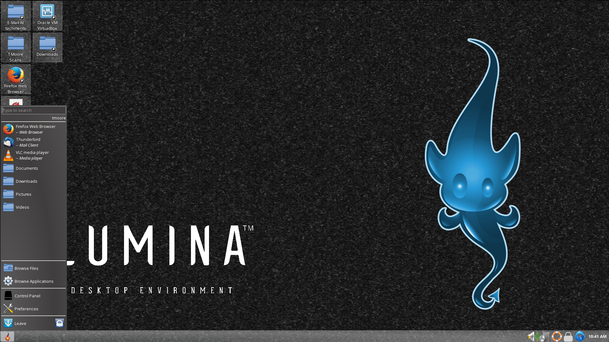

.. This file is for inclusion into the TrueOS handbook, and combines 
   luminaintro.rst (5), luminaplugins.rst (268), luminautl.rst (950), 
   luminactbt.rst (1340), and changelog.rst (1702) into one master 
   lumina.rst file.
   
.. globalindex::
   :maxdepth: 4

.. _Introduction to Lumina:

Introduction to Lumina
**********************

The Lumina Desktop Environment (Lumina for short) is a lightweight, 
XDG-compliant, BSD-licensed desktop environment focused on streamlining 
work efficiency with minimal system overhead. It is specifically 
designed for TrueOS®® and FreeBSD, but has also been ported to many other
BSD and Linux operating systems. It is based on the Qt graphical toolkit
and the Fluxbox window manager, and uses a small number of X utilities 
for various tasks, such as :command:`numlockx` and :command:`xscreensaver`.

Lumina's features include: 

* Very little system overhead.

* Does not require any of the desktop implementation frameworks such as 
  DBUS, policykit, consolekit, systemd, or HALD.

* Does not come bundled with any applications such as web browsers, 
  email clients, multimedia software, or office suites. Instead, it 
  provides utilities for configuring the desktop environment.

* Uses a simple, `text-based configuration file <https://github.com/trueos/lumina/blob/master/src-qt5/core/lumina-desktop/defaults/luminaDesktop.conf>`_
  for setting system-wide defaults. Lumina distributors can use this 
  file to easily preset the Lumina defaults and interface for their 
  distribution.

* Provides a plugin-based interface design. The user can make their 
  desktop as light or heavy as they wish by choosing which plugins to 
  have running on their desktop and panels. This plugin-based system is 
  similar to Android or other modern operating systems.
  
* A single, easy-to-use :ref:`Lumina Configuration` utility controls all 
  the different configuration options for the desktop in one location.

* Intelligent "favorites" system for creating quick shortcuts to 
  applications, files, and directories.

* ZFS file restore functionality through the :ref:`Insight File Manager`.

* Multi-monitor support includes the :ref:`Lumina Xconfig` graphical 
  utility for adding or removing monitors from the Lumina session.

* Simple system controls through the system menu for configuring audio 
  volume, screen brightness, battery status/notifications, and workspace
  switching.

* Total system search capabilities through the resource friendly 
  :ref:`Lumina Search` utility.

* Screenshot functionality through :ref:`Lumina Screenshot`, which is 
  also tied to the “Print Screen” key by default.

.. _Install and Start Lumina:

Install and Start Lumina
========================

Lumina is available as a pre-built package for numerous operating 
systems. The `Get Lumina <http://lumina-desktop.org/get-lumina/>`_ 
section of the webpage includes installation instructions for each 
supported system.

In addition to pre-built packages, the 
`Lumina source repository <https://github.com/trueos/lumina>`_ 
is available on GitHub so that developers can contribute code or create
packages for other distributions. If you plan to compile Lumina from 
source, refer to the `DEPENDENCIES <https://github.com/trueos/lumina/blob/master/DEPENDENCIES>`_ 
file and ensure all dependent software is installed and to the 
`README <https://github.com/trueos/lumina/blob/master/README.md>`_ file 
for build instructions.

After installing Lumina, no startup configuration is needed when 
installed on a TrueOS® system as the PCDM login manager will 
automatically display Lumina in the login menu. Simply log out, select 
Lumina, and log back in.

.. note:: When using a system with no graphical login manager, type 
          :command:`start-lumina-desktop` to start Lumina. 
   
The rest of this Handbook describes the Lumina Configuration utility, 
other various utilities built into Lumina, and Lumina plugins. Also, the
handbook shows how you can get involved improving Lumina as well as 
reproducing the change log for each major release of Lumina.

.. _Initial Settings:

Initial Settings
================

When freshly installed, Lumina will implement a number of default 
plugins and options for the user. All these first time defaults are 
configurable, with the numerous options covered in the 
:ref:`Lumina Plugins` section of the handbook.

.. note:: The default desktop appearance can vary if using another 
          distrubution's custom configuration of the Lumina Desktop 
          Project.
  
.. _lumina1e:

:numref:`Figure %s: Lumina Desktop <lumina1e>` A screenshot of Lumina 
using its default settings. The user has clicked the "Lumina" icon in 
order to open the start menu.

The Start Menu provides quick access for user interaction with the 
system. The top frame is a search bar for rapidly finding specific 
items. Just underneath the search bar is a small field indicating which 
user is logged in. Also, If the system has a battery, you can hover over
the battery icon (not pictured) on the opposite side of the user name to
display the current status of the battery and the estimated time 
remaining if that battery is discharging. The remaining space of the 
start menu is divided into several categories:

* **Favorites:** This element is the largest section of the menu. Click 
  an entry to launch that application. Right-click an entry to "Remove 
  from Favorites" or to "Add to Quicklaunch". In Lumina, "Favorites"
  appear in this section of the start menu and "QuickLaunch" adds a 
  button for the application to the panel that is next to the start menu
  button.

* **Browse Files:** Used to browse for files and directories using the 
  :ref:`Insight File Manager`. One available action in this file manager
  is the ability to add a file or directory to the list of Favorites. 
  Simply select the file or directory and click the star icon in Insight.

* **Browse Applications:** Click this entry to browse all applications 
  currently registered on the system. Applications are listed 
  alphabetically by category. The "Show Categories" button has three 
  modes which are changed by clicking the button: category names 
  (checked box), no categories (unchecked box), and categories with 
  contents (half-checked box). 
  
  Click an application's name to start the application. By 
  right-clicking an application's name, you can select "Pin to Desktop",
  "Add to Favorites", or "Add to Quicklaunch". Using TrueOS® or another 
  operating system with a pre-defined application store will add a 
  "Manage Applications" button at the top of the applications list. 
  Click it to open the specific operating system's application store. 
  For example, on a TrueOS® system, "Manage Applications" opens the
  AppCafe®. Click the "Back" button to return to the start menu.

* **Control Panel:** If using TrueOS® or an operating system with
  a control panel, click this entry to open the operating system's 
  control panel.

* **Preferences:** Click this entry to access the following:

    * **Configure Desktop:** This entry opens the 
      :ref:`Lumina Configuration` utility.

    * **Lumina Desktop Information:** Click the "?" icon to determine 
      the installed version of Lumina.

    * **System Volume:** Use your mouse to move the volume control 
      slider to change the system audio volume from 0% to 100%. Click 
      the sound icon on the left to mute or unmute the speaker. If the 
      operating system provides a mixer utility, click the speaker icon 
      on the right to launch the mixer utility for advanced control of 
      the audio system.

    * **Screen Brightness:** Use the mouse to move the brightness 
      control slider from 10% to 100%.

    * **Workspace:** The number of available virtual workspaces are 
      listed. Click the right or left arrow to switch between workspaces.

    * **Locale:** This will only appear if the lumina-i18n package is 
      installed. The current locale will be displayed as the title of 
      the drop-down menu. Click the drop-down menu to select another 
      locale for this session. Refer to :ref:`User Settings` for more 
      information on fine-tuning the locale settings.

    * **Back:** Click to return to the start menu.
  
* **Leave:** Click this entry to view options to "Suspend System" (if 
  supported by the operating system, press the system's power button to 
  login and resume operation), "Restart System" (if the user has 
  permission), "Power Off System" (if the user has permission), "Sign 
  Out User", or press "Back" to return to the start menu. Alternately, 
  click the "lock" icon next to "Leave" to lock the system, which will 
  start the screensaver and password prompt to resume the session.

.. note:: On a TrueOS® system which is applying updates, the shutdown and
          restart options will be disabled until the updates are 
          complete, with a note indicating updates are in progress.

.. _Panel and System Tray:

Panel and System Tray
=====================

By default, Lumina provides a panel at the bottom of the screen with a 
system tray at the far right of the panel. This section describes the 
default layout. For instructions on how to configure the panel, refer to
the :ref:`Interface` section.
  
When opening windows or applications, a button will be added to the 
section of the panel near the start menu. If the application provides 
an icon, the button will appear with the icon and descriptive text. 
Mouse over the button to show the full name of the application. Each 
open window or application will have its own button on the panel. Click 
a button to make that window active; click it again to minimize it.

Right-click the title of an open window to open a menu of options, 
including stick, layer/dock, and set transparency, among other options.

The system tray is located in the right portion of the panel. Any 
applications that register a tray icon will appear in this area. For 
example, on a TrueOS® system, icons will appear for Life Preserver, Mount
Tray, and SysAdm™. Refer to :ref:`Interface` for instructions on 
modifying which applications appear in the system tray. Click or 
right-click an icon to interact with an application directly. The 
current system time shown by the clock is in the default format for the 
current locale. If you click the clock icon and then click "Time Zone", 
a menu will open where you can select to either "Use System Time" or 
click a country name in order to select a city to change to that city's 
time zone.

.. index:: desktop context menu
.. _Desktop Context Menu:

Desktop Context Menu
====================

Right-clicking the desktop will open a menu of quick shortcuts with the 
title of the menu indicating the name of the current workspace. This 
section describes the default menu items. For instructions on how to 
configure the right-click menu to suit your needs, refer to the 
:ref:`Interface` section of this handbook.

By default, the right-click menu contains the following items:

* **Terminal:** Used to launch a system terminal. The default is 
  :command:`xterm`, but this can be customized.

* **Browse Files:** Launches the default file manager. 
  (:ref:`Insight File Manager` for Lumina)

* **Applications:** Provides shortcuts to the operating system's 
  graphical software management utility (if available), the control 
  panel (if the operating system provides one), and the applications 
  currently registered on the system, arranged by system category.

* **Preferences:** Contains shortcuts to the screensaver preferences, 
  desktop utility (:ref:`Lumina Configuration`), display configuration 
  (:ref:`Lumina Xconfig`), the operating system's control panel, and 
  Lumina version information contained within "About Lumina".

* **Leave:** Opens the system log out window, with options to log out of
  the desktop session, restart the system (if the user has permission), 
  shutdown the system (if the user has permission), cancel the log out 
  window, lock the system, or suspend the system (if the operating 
  system supports suspend mode).
  
.. -------luminaintro.rst end, luminaplugins.rst begin------------------

.. index:: plugins   
.. _Lumina Plugins:

Lumina Plugins
**************

Lumina offers a wide variety of plugins which allow the user to 
customize their desktop experience. Plugins are divided between context 
menu, desktop, and floating panel plugins.

.. index:: contextmenu plugins
.. _Context Menu Plugins:

Context Menu Plugins
====================

Menu plugins are the options which appear when the user right-clicks on 
the desktop screen in Lumina. You can customize these options by 
clicking on the Start Menu, then 
:menuselection:`Preferences --> Configure Desktop --> Interface Configuration --> Context Menu and Plugins`.

.. _luminamenupluginmenu1:

.. figure:: images/luminamenupluginmenu1.png

:numref:`Figure %s: Lumina Menu Plugins <luminamenupluginmenu1>`

Add or remove plugins by clicking the green "plus" or red "minus" 
buttons in the bottom left corner of the window. The arrow buttons in 
the bottom right allow the user to move plugins up or down in the 
Quick-Access Menu field, which will alter their display order when the 
desktop is right-clicked. Click the Save button to immediately implement 
any changes to the menu.

Two elements the right-click menu will always display are the name of 
the current virtual desktop at the top of the menu and the shutdown 
options on the bottom, as pictured in :numref:`Figure %s: Default Menu <luminamenuplugin1>`.

.. _luminamenuplugin1:

.. figure:: images/luminamenuplugin1.png

The user can customize what appears between these two elements of the 
menu however they wish.

.. _Menu Applications:

Applications
------------

.. _luminamenuplugin2:

.. figure:: images/luminamenuplugin2.png

:numref:`Figure %s: Applications <luminamenuplugin2>`

This plugin adds an application menu which can be navigated to open any 
installed application. The Control Panel and Application Management 
options will always be shown at the top, while the categories of 
applications are shown underneath.

.. _Custom App:

Custom App
----------

.. _luminamenuplugin3:

.. figure:: images/luminamenuplugin3.png

:numref:`Figure %s: Custom Application <luminamenuplugin3>`

Adds a specific quickstart icon for a single application to the 
right-click menu. Pictured is the icon for the "About" application, 
which is displaying current TrueOS® system information.

.. _File Manager:

File Manager
------------

.. _luminamenuplugin4:

.. figure:: images/luminamenuplugin4.png

:numref:`Figure %s: File Manager <luminamenuplugin4>`

Opens the user's home directory within the default file manager.

.. _JSON Menu:

JSON Menu
---------

The JSON Menu plugin give a more advanced user the flexibility to create
their own entries into the right-click menu. Selecting the JSON Menu 
plugin immediately brings up the menu configuration window, seen in 
:numref:`Figure %s: JSON Menu Configuration Window <luminamenuplugin5>`.

.. _luminamenuplugin5:

.. figure:: images/luminamenuplugin5.png

This window has three fields: Visible Name, Executable, and Icon. The 
Visible Name field will define the name of the right-click menu entry. 
Executable is the path to the custom script that is to be run for the 
entry. The Icon field is optional, but is used to assign a specific 
icon to the custom script.

.. _luminamenuplugin6:

.. figure:: images/luminamenuplugin6.png

:numref:`Figure %s: JSON Menu Example <luminamenuplugin6>`

After completing the configuration window, the resultant display shows 
the custom script in action. The Visible Name appears under "Workspace 2",
while the executable script has generated the menu of files and folders.

.. _Separator:

Separator
---------

:numref:`Figure %s: Separator <luminamenuplugin1>`

A Separator is simply a horizontal line which can be used to divide 
entries in the right-click menu. When added to the menu, use the up and
down arrows in the plugin selection menu to place the Separator plugin 
between the plugins you wish to place a line between.

.. _Settings:

Preferences
-----------

.. _luminamenuplugin7:

.. figure:: images/luminamenuplugin7.png

:numref:`Figure %s: Preferences <luminamenuplugin7>`

This plugin adds a shortcut to the right-click menu which opens a new 
menu of configuration quicklinks.

.. _Terminal:

Terminal
--------

.. _luminamenuplugin8:

.. figure:: images/luminamenuplugin8.png

:numref:`Figure %s: Terminal <luminamenuplugin8>`

A shortcut to the default system terminal.

.. _Window List:

Window List
-----------

.. _luminamenuplugin9:

.. figure:: images/luminamenuplugin9.png

:numref:`Figure %s: Window List <luminamenuplugin9>`

This plugin adds an entry to the right-click menu which, when hovered 
over with the mouse, will list all open application windows. This plugin 
is comparable to a task manager plugin for panels.

.. index:: desktop plugins
.. _desktop plugins:

Desktop Plugins
===============

Desktop plugins will add icons or widgets for display on the main screen
of the Lumina Desktop Environment. Click on default start menu in the 
lower left of the main desktop screen, then click 
:menuselection:`Preferences --> Configure Desktop --> Interface Configuration --> Desktop Icons and Plugins`.

.. _luminadesktoppluginmenu1:

.. figure:: images/luminadesktoppluginmenu1.png

:numref:`Figure %s: Desktop Plugin Menu <luminadesktoppluginmenu1>` This 
is the primary menu for configuring desktop plugins. Clicking the green 
"plus" button will open a "Select Plugin" window. The user can choose 
between the available plugins by opening the drop-down menu and clicking
the desired plugin. Once a plugin has been selected, your choice will 
appear in the "Embedded Utilities" window. 

The “Display Desktop Folder Contents” option is used to display each 
item stored in ~/Desktop as an icon on the desktop. By default, this 
option is selected as its box is black. If you de-select this option and
click “Save Changes”, the icons for the contents of ~/Desktop will be 
removed from the desktop. To define a smaller area on the desktop for 
displaying icons, use the :ref:`Desktop Icons View` plugin.

Once all the desired plugins have been added, click the "Save" button 
that appears in the upper right section. The menu will automatically 
save and implement any changes to the desktop plugins.
 
There are numerous plugins in the desktop category, listed in
alphabetical order.

.. _Application Launcher:

Application Launcher
--------------------

.. _luminadesktopplugin1:

.. figure:: images/luminadesktopplugin1.png

Choosing the Application Launcher plugin opens the window seen in 
:numref:`Figure %s: Application Launcher <luminadesktopplugin1>`. This 
drop down menu allows the user to choose a specific application to add 
to the desktop.

.. _Audio Player:

Audio Player
------------

.. _luminadesktopplugin2:

.. figure:: images/luminadesktopplugin2.png

:numref:`Figure %s: Audio Player <luminadesktopplugin2>` 

The Audio Player plugin will play user added lists of audio files. 
Pressing the wrench icon in the upper left corner will open an options 
menu to clear or shuffle the playlist. 

The green plus icon gives the user options to add files, a directory, or
URL to the playlist. Toggle the play button in the lower left corner of 
the plugin in order to start/stop an audio file. The forward and back 
buttons in the upper right corner allow the user to skip to the next 
song or return to the previous one. Click the currently playing file to
open a drop down menu of all added audio files.

.. _calendar:

Calendar
--------

.. _luminadesktopplugin3:

.. figure:: images/luminadesktopplugin3.png

:numref:`Figure %s: Calendar <luminadesktopplugin3>` 

This is a calendar plugin which will display a calendar set to the 
current month and day. The arrows in the upper left and right of the 
plugin allow the user to view previous or upcoming months. If available,
the user can also use their mouse to hover over the calendar and then 
scroll up or down through the calendar.

.. _Desktop Icons View:

Desktop Icons View
------------------

.. _luminadesktopplugin4:

.. figure:: images/luminadesktopplugin4.png

:numref:`Figure %s: Desktop Icons <luminadesktopplugin4>` 

This plugin will define an area on the desktop to display icons. If 
enough icons are added to the plugin, a scroll bar will appear for the 
user to scroll through all available icons.

.. _Note Pad:

Note Pad
--------

.. _luminadesktopplugin5:

.. figure:: images/luminadesktopplugin5.png

:numref:`Figure %s: Note Pad <luminadesktopplugin5>` 

A plugin which adds a simple text editor widget to the desktop. The 
user needs to create or open a note before they can type a message. 
Notes default to the .note text format and are saved in 
/usr/home/<username>/Notes. Clicking the down arrow in the upper-right 
corner displays a number of options:

	* **Open Text File** - Allows the user to browse through their 
	  directories to open a .note or other text file.
	* **Create a Note** - Creates a new note; a unique name is required.
	* **Rename Note** - Renames the currently open note.
	* **Delete Note** - Immediately deletes the displayed note.

.. _RSS Reader:

RSS Reader
----------

.. _luminadesktopplugin6:

.. figure:: images/luminadesktopplugin6.png

:numref:`Figure %s: RSS Reader <luminadesktopplugin6>` 

Displays connected RSS feeds. The user can add their own custom RSS 
feeds to the plugin, but the default feed displayed is the Lumina 
Desktop Environment blog. Click the dropdown menu to choose which RSS 
feed to display. The down arrow in the upper right corner opens a list 
of options:

	* **Add RSS Feed** - An option to allow the user to type in their 
	  own RSS URL or load a preset RSS Feed.
	* **View Feed Details** - Displays current feed data, including URL, 
	  feed description and website address, and the previous build date
	  and synchronization settings. Also included is an option to remove
	  the feed.
	* **Settings** - Options for syncing the feed. You can choose to 
	  synchronize manually, or instead define the sync interval. 
	  Remember to save any changes in feed settings.
	* **Update Feeds Now** - Click to immediately update all feeds.
	
.. note:: An active Internet connection is required for the RSS Reader 
          plugin to function properly.
          
Click the blue globe to open the default web browser at the feed's 
associated website. 

.. _System Monitor:

System Monitor
--------------

.. _luminadesktopplugin7:

.. figure:: images/luminadesktopplugin7.png

:numref:`Figure %s: System Monitor Display <luminadesktopplugin7>` 

The "Summary" tab of the System Monitor plugin. CPU Temperature (in 
Celsius), CPU Usage, and Memory Usage are displayed. Currently, there 
are no other options to display in the system monitor aside from these 
statistics and the read/write speed monitor, shown next.

.. _luminadesktopplugin8:

.. figure:: images/luminadesktopplugin8.png

:numref:`Figure %s: System Monitor I/O <luminadesktopplugin8>` 

The "Disk I/O" tab of the System Monitor plugin. Displayed are the 
current read and write speeds of the connected hardware, which in this 
case is a hard drive and cd player. 

.. index:: float panel plugins
.. _floating panel plugins:

Floating Panel Plugins
======================

Panels are a completely customizable option for Lumina users. By default,
Lumina users will have one panel stretched across the bottom of the 
primary screen and one smaller pop-up panel in the top middle of the 
primary screen. To adjust the default panels and add plugins, click the 
start menu and navigate :menuselection:`Preferences --> Configure Desktop --> Interface Configuration --> Floating Panels and Plugins`.
For demonstration purposes, a simple panel centered at the top of a 
secondary screen was utilized to show the various plugins listed below.
The settings for this panel are pictured in :numref:`Figure %s: Panel Settings <luminapanelpluginmenu1>`.

.. _luminapanelpluginmenu1:

.. figure:: images/luminapanelpluginmenu1.png

As you can see, Panel 1 is configured to the top center of Monitor 1 
(plugged into DVI-I-0). To add or adjust plugins for this panel, click 
on the green puzzle piece icon to open the :numref:`Figure %s: Panel Plugins Menu <luminapanelpluginmenu2>`.

.. _luminapanelpluginmenu2:

.. figure:: images/luminapanelpluginmenu2.png

The large field shows currently active plugins. Click the red minus or 
green plus buttons to add or remove plugins to the panel. Use the arrow 
keys to alter the display order of attached plugins. By default, plugins
will populate horizontal panels from left to right, and vertical panels 
from top to bottom. All the plugins available for panel plugins are 
listed below.

.. _panel application launcher:

Panel Application Launcher
--------------------------

.. _luminapanelplugin1:

.. figure:: images/luminapanelplugin1.png

:numref:`Figure %s: Panel Application Launcher <luminapanelplugin1>`

When you select this plugin, it will prompt you to select the 
application to launch. This will add a shortcut for launching the 
selected application to the panel.

.. _Application Menu:

Application Menu
----------------

.. _luminapanelplugin2:

.. figure:: images/luminapanelplugin2.png

:numref:`Figure %s: Application Menu <luminapanelplugin2>`

Adds an application menu that contains a shortcut to your home directory,
a shortcut to the operating system’s graphical software management 
utility (if there is one), a shortcut to the operating system’s Control 
Panel (if it provides one), and a list of installed software sorted by 
categories. This plugin is also considered a primary menu, like the 
start button, and will open when the :kbd:`Windows` key is pressed.

.. _Battery Monitor:

Battery Monitor
---------------

Hover over this icon (not pictured) to view the current charge status of
the battery. When the charge reaches 15% or below, the low battery icon 
will flash intermittently and will change to a low battery icon when 
there is less than 5% charge left.

.. _Desktop Bar:

Desktop Bar
-----------

.. _luminapanelplugin3:

.. figure:: images/luminapanelplugin3.png

:numref:`Figure %s: Desktop Bar <luminapanelplugin3>` :guilabel:`Favorite Applications` 
is pressed.

This plugin adds shortcuts to the panel for applications or files 
contained within the ~/Desktop folder or favorited by the user. The 
“star” button displays applications, the "folder" button displays 
folders, and the "file" button shows favorite files.

.. _Line:

Line
----

.. _luminapanelplugin4:

.. figure:: images/luminapanelplugin4.png

:numref:`Figure %s: Line <luminapanelplugin4>` The line is highlighted 
in red.

Adds a separator line to the panel to provide visual separation between 
plugins. When adding a line plugin in the :numref:`Figure %s: Panel Plugins Menu <luminapanelpluginmenu2>`,
be sure to use the arrow buttons in the bottom-right corner of the 
window to place the line entry between the two other plugins you wish to 
separate.

.. _Show Desktop:

Show Desktop
------------

.. _luminapanelplugin5:

.. figure:: images/luminapanelplugin5.png

:numref:`Figure %s: Show Desktop Button <luminapanelplugin5>`

This button will immediately hide all open windows on all active 
monitors so that only the desktop is visible. This is useful for touch 
screens or small devices. 

.. _Spacer:

Spacer
------

.. _luminapanelplugin6:

.. figure:: images/luminapanelplugin6.png

:numref:`Figure %s: Spacer <luminapanelplugin6>`

Adds a blank area to the panel. Similar to lines, spacers need to be 
positioned between plugins in the :numref:`Figure %s: Panel Plugins Menu <luminapanelpluginmenu2>`
in order to achieve the desired separation.

.. _Panel Start Menu:

Start Menu
----------

.. _luminapanelplugin7:

.. figure:: images/luminapanelplugin7.png

:numref:`Figure %s: Start Menu <luminapanelplugin7>`

Adds a classic start menu as seen on other operating systems. This is 
added by default to the primary desktop panel in the lower left corner.

.. _System Dashboard:

System Dashboard
----------------

.. _luminapanelplugin8:

.. figure:: images/luminapanelplugin8.png

:numref:`Figure %s: System Dashboard <luminapanelplugin8>` with the 
button pressed.

The System Dashboard plugin is a convenient shortcut to view or modify 
a number of basic settings. The system volume and screen brightness can 
be manually adjusted higher or lower, and you can also toggle between 
virtual workspaces with the left and right arrows. A "Log Out" button 
has also been added for additional convenience. If your system has a 
battery, its current charge will also be displayed.

.. note:: Adjusting the screen brightness on a multi-monitor system will 
          affect both monitors.

.. _System Tray:

System Tray
-----------

.. _luminapanelplugin9:

.. figure:: images/luminapanelplugin9.png

:numref:`Figure %s: System Tray <luminapanelplugin9>` with several 
docked applications (Quassel IRC, PC Mixer, etc.). 

Provides an area on the panel for dockable applications. Applications 
can be sent to this area on a per-application basis, but only one system
tray plugin can be active at a time. By default, the active system tray 
will be the one on the **lowest number** monitor and panel. For example,
when adding the system tray plugin to monitor zero, panel one and again 
to monitor one, panel one, only the system tray on monitor zero will 
be active. Disabling the system tray on monitor zero will activate the 
tray on monitor one, automatically migrating any docked applications to 
the other panel.

.. _Task Manager (No Groups):

Task Manager (No Groups)
------------------------

.. _luminapanelplugin10:

.. figure:: images/luminapanelplugin10.png

:numref:`Figure %s: Task Manager (No Groups) <luminapanelplugin10>`

Ensures that every window gets its own button on the panel. This plugin 
will use a large amount of space on the panel, as every window will 
need to display a part of its title. This plugin is added to the default
panel for Lumina.

.. _Task Manager:

Task Manager
------------

.. _luminapanelplugin11:

.. figure:: images/luminapanelplugin11.png

:numref:`Figure %s: Task Manager <luminapanelplugin11>` Pictured are 
three open terminal windows grouped into one minimal panel entry with 
"(3)" displayed next to the terminal icon. 

The grouping task manager displays windows in the panel as well. Its 
primary function is to group windows by application, saving more space 
on the panel. This manager also does not typically display window titles
on the panel, a further space savings.

.. _Time Date:

Time/Date
---------

.. _luminapanelplugin12:

.. figure:: images/luminapanelplugin12.png

:numref:`Figure %s: Time/Date <luminapanelplugin12>` The clock has been 
selected, opening the larger calendar and time zone settings.

Displays the current time and date. A basic clock is added to the panel; 
clicking it will open the calendar, which will highlight the current 
date. Clicking the arrows in the top corners will allow you to look back 
or ahead in the calendar, while clicking the "Time Zone" will allow you 
to adjust the displayed time.

.. _User Button:

User Menu
---------

The User Menu is a more complicated plugin that provides an array of 
shortcuts to files and applications on the system, essentially as an 
alternative to the Start Menu.

.. _luminapanelplugin13:

.. figure:: images/luminapanelplugin13.png

:numref:`Figure %s: User Favorites <luminapanelplugin13>` Shows the
default view after clicking the user button. On the sidebar, the 
"Favorites" folder is highlighted, with the top tab showing 
"Applications". You can also view favorite folders and files by clicking
the "Places" and "Files" tabs, respectively.

Clicking the "gear" icon in the left sidebar will open the "Applications"
section of the menu, seen in :numref:`Figure %s: User Applications <luminapanelplugin14>`.

.. _luminapanelplugin14:

.. figure:: images/luminapanelplugin14.png

This section displays all applications by default, with the drop down 
menu at the top allowing you to view applications by category. The 
"AppCafe" button in the top right will open the SysAdm™ AppCafe®, allowing
you to quickly search for and download more applications.

.. _luminapanelplugin15:

.. figure:: images/luminapanelplugin15.png

:numref:`Figure %s: Home Directory <luminapanelplugin15>`

The "folder" icon on the left sidebar opens the Home directory, giving 
you the option to quickly browse through system directories. Clicking 
the file/folder button in the upper right launches the Insight File 
Manager at the home directory. Clicking the binoculars and gear icon 
will launch the search utility. 

Finally, selecting the screwdriver and wrench icon on the sidebar will 
open the "Desktop Preferences" section, seen in :numref:`Figure %s: Desktop Preferences <luminapanelplugin16>`

.. _luminapanelplugin16:

.. figure:: images/luminapanelplugin16.png

This panel displays shortcuts to all the settings and configuration 
utilities, as well as the system information window. 

.. _Workspace Switcher:

Workspace Switcher
------------------

.. _luminapanelplugin17:

.. figure:: images/luminapanelplugin17.png

:numref:`Figure %s: Workspace Switcher <luminapanelplugin17>`

Used to switch between virtual desktops. Click the monitor icon to show 
a drop down menu of all workspaces. The active workspace will have 
asterisks (*) before and after its name.

.. -----------------luminaplugins.rst end, luminautl.rst begin----------

.. index:: Utilities
.. _Lumina Utilities:

Lumina Utilities
****************

Lumina provides many built-in utilities, which are described in this 
chapter.

.. index:: file manager
.. _Insight File Manager:

Insight File Manager
====================
  
The Insight file manager, shown in :numref:`Figure %s: Insight File Manager <lumina10a>`,
allows the user to easily browse and modify files on the local system on
a per-directory basis. To open Insight, click the start menu and select 
"Browse Files", right-click the desktop and select "Browse Files", or 
type :command:`lumina-fm` from an xterm.

.. _lumina10a:

.. figure:: images/lumina10a.png
   :scale: 100%
   
It is possible to open up additional directories through the tab system 
using :kbd:`Ctrl-T` or by clicking :menuselection:`File --> New Browser`,
allowing the user to easily manage multiple locations on the system. 
Insight also features the ability to "bookmark" locations on the system 
for instant access via the "star" button. Once a location has been 
bookmarked, it will be available via the "Bookmarks" menu at the top of 
the window. Removable devices plugged into the sytem will appear in the 
"External Devices" menu, if supported by the operating system. When an 
item is selected, the icons on the left side of the screen provide the 
possible actions that may be taken with regards to that item. Possible 
actions include: "open item", "open item" (will prompt to select the 
application to use), "add item to personal favorites", "rename item", 
"cut items (add to the clipboard)", "copy items to the clipboard", 
"paste items from clipboard", and "delete items". The action
buttons are visible by default, but can be made invisible by clicking 
:menuselection:`View --> Show Action Buttons`. To disable thumbnails, 
uncheck :menuselection:`View --> Load Thumbnails`. Note that this option
does not remove thumbnails that have already been loaded, it only 
prevents loading thumbnails in new directories. Hidden files are not 
shown by default; this can be changed by checking 
:menuselection:`View --> Show Hidden Files`.

If you select a file or directory and right-click it, the following 
options become available: "Open", "Open With" (where you select the 
application to use), "Rename", "View Checksums" (shows the MD5 
checksum), "Cut Selection", "Copy Selection", "Paste", "Delete 
Selection", "File Properties" (such as file type, size, permissions, and
creation date), or "Open Terminal here".

A few additional options may be available at the bottom of the window, 
depending on the directory being viewed and the types of files that are 
in it:

* **New File:** The ability to create a new file is available if the 
  user has permission to modify the contents of the current directory.

* **New Dir:** The ability to create a new directory is available if the
  user has permission to modify the contents of the current directory.

* **Slideshow:** If there are image files in the directory, this option 
  will display those image files as a slideshow and provide arrows for 
  going forward or back by one file or to the very beginning or end of 
  the file list. Buttons are also provided for deleting the currently 
  displayed image or to rotate it, and save the rotation, clockwise or 
  counter-clockwise.

* **Play:** This will appear if there are supported multimedia files in 
  the directory. The types of files that are supported depends on what 
  multimedia plugins are installed on the system. If a particular file 
  is not recognized as a multimedia file, install the associated 
  multimedia codec using the operating system's application management 
  software and restart the file manager.

* **Backups:** If the system is formatted with ZFS and snapshots of the 
  current directory are available, this button will appear. Snapshots 
  are organized from oldest to newest, with the most recent snapshot 
  selected by default, and the contents of the directory at the time of 
  that snapshot are displayed. To restore a file or multiple files, 
  select them from the list and click the "Restore Selection" button. If
  those files still exist and you want to overwrite them, make sure the 
  "Overwrite Existing Files" option is checked first. Otherwise, if a 
  file with that name exists, the restore will append a number to the
  end of the filename. For example, the first restored version of 
  :file:`testfile.txt` will become :file:`testfile-1.txt`.

.. index:: Lumina File Information
.. _Lumina File Information:

Lumina File Information
=======================

The :command:`lumina-fileinfo` utility can be used to open a graphical 
window summarizing the size, permissions and ownership, creation time, 
and last modification time of the specified file or directory. In the 
example shown in in :numref:`Figure %s: Sample File Information <file1a>`,
the user has typed :command:`lumina-fileinfo Downloads` from a terminal 
window to view the file information of their :file:`~/Downloads` 
directory.

.. _file1a:

.. figure:: images/file1a.png
   :scale: 100%  

.. index:: Lumina Information
.. _Lumina Information:

Lumina Information
=======================
  
This utility provides information about the version of Lumina, as well 
as the license, acknowledgements, and project links. To launch this 
utility, right-click the desktop and select 
:menuselection:`Preferences --> About Lumina`, click the start menu then
the question mark icon in "Preferences", or type :command:`lumina-info` 
in a terminal window. An example is shown in 
:numref:`Figure %s: About Lumina <about1c>`.

.. _about1c:

.. figure:: images/about1c.png
   :scale: 100%
   
The "General" tab contains the following information:

* **Desktop Version:** Indicates the version of Lumina.

* **OS Build:** Indicates the operating system that was used to build 
  this version of Lumina.

* **Qt Version:** Click :guilabel:`View Information` to display the QT 
  version and its license.

* **Lumina Website:** Click :guilabel:`Lumina Website` to open 
  `<http://lumina-desktop.org/>`_ in the default web browser.

* **Ask the Community:** Click :guilabel:`Ask the Community` to open 
  `<https://webchat.freenode.net/?channels=%23lumina-desktop>`_, a 
  chat channel dedicated to Lumina with many friendly and helpful users.
  
* **Source Repository:** Click :guilabel:`Source Repository` to open 
  `<https://github.com/trueos/lumina>`_ in the default web browser.

* **Report a Bug:** Click :guilabel:`Bug Reports` to open 
  `<https://bugs.pcbsd.org/projects/pcbsd>`_ in the default web browser.
  Refer to :ref:`Report a Bug` for instructions on how to submit a bug 
  report.
  
The "License" tab contains the license text for Lumina. Lumina is 
licensed under a `3-clause BSD license <https://github.com/trueos/lumina/blob/master/LICENSE>`_.

The "Acknowledgements" tab contains the following:

* **Project Lead:** The name of the Project's lead developer. Click the 
  name to open his or her profile on GitHub in the default web browser.

* **Contributors:** Click the "Open in web browser" link to open 
  `<https://github.com/trueos/lumina/graphs/contributors>`_.

* **Sponsors:** lists the official sponsors of the Lumina Project.   

.. index:: application launcher
.. _Lumina Open:

Lumina Open
===========
   
To open a file, directory, or URL from the command line, type 
:command:`lumina-open` followed by the full path to the file or the URL.
This utility will look for an appropriate application to use to open the
specified file or URL. If there is no default application registered for
the input type, a small dialog will prompt the user to select which 
application to use, and optionally set it as the default application for
this file type. As seen in the example shown in 
:numref:`Figure %s: Lumina Open <lumina11b>`,
this dialog organizes the available applications into three types: 

.. _lumina11b:

.. figure:: images/lumina11b.png
   :scale: 100%
   
* **Preferred:** These applications have registered their Mime type with
  the system and can open that type of file. Also included are any 
  applications that have been used to open this type of file before as 
  it keeps track of the last three applications used for that file type.

* **Available:** Displays all the applications installed on the system, 
  organized by category and name.

* **Custom:** The user can manually type in the binary name or path of 
  the application to use. It also provides a search button to let the 
  user graphically search the system for the binary. Whenever text is 
  entered, a check is performed to determine whether that is a valid 
  binary and the icon will change between a green checkmark or a red X 
  as appropriate.

.. index:: screenshot
.. _Lumina Screenshot:

Lumina Screenshot
=================
   
This utility can be used to take screenshots of the desktop or selected 
window and save them as PNG image files. To launch this utility, click 
the start menu and select 
:menuselection:`Browse Applications --> Utility --> Lumina Screenshot`,
right-click the desktop and select 
:menuselection:`Applications --> Utility --> Lumina Screenshot`, type 
:command:`lumina-screenshot` from a terminal window, or press :kbd:`Print Screen`.

On the "New Screenshot" tab, seen here in 
:numref:`Figure %s: New Screenshot Tab <lumina25>`, you can adjust the 
following settings to fine tune the screenshot:

.. _lumina25:

.. figure:: images/lumina25.png
   :scale: 100%
   
* **Entire Session:** Captures the entire screen.

* **Single Screen:** In a multi-monitor setup, the screen number can be
  selected for the screenshot.

* **Single Window:** Captures a selected window. Choose "Single Window," 
  click :guilabel:`Take Screenshot`, and click on the desired 
  window. The "Include Borders" checkbox can be used to determine 
  whether or not the utility will take a screenshot of the window with 
  its border frame.
  
* **Delay:** Choose the number of seconds to delay the screenshot. This 
  can be used to give more time to prepare the screenshot. For example, 
  designating a five second delay on a screenshot will give the user 
  time to open a temporary menu or hover over an icon, allowing the 
  screenshot to include otherwise difficult elements to capture.

There are three options for taking a screenshot: clicking the "Take 
Screenshot" button in the lower-right corner of Lumina Screenshot, 
pressing :kbd:`Ctrl+N`, or clicking :menuselection:`File --> Take Screenshot`. 

After capturing a screenshot, the "View/Edit" tab, seen here in 
:numref:`Figure %s: View/Edit Tab <lumina9a>`, provides additional 
options for manipulating the screenshot:

.. _lumina9a:

.. figure:: images/lumina9a.png
   :scale: 100%
   
* **Image Preview:** Displays the captured screenshot. Right-clicking 
  the image will provide options for zooming in or out. Clicking and 
  dragging across the image will highlight an area which can be cropped 
  by pressing the "Crop" button in the lower-right corner.
  
* **"Save As":** Button to open a window where you can specify the 
  filename and location for saving the screenshot.

* **Launch Editor:** Button to launch a selectable image manipulation 
  program.

Additionally, clicking :menuselection:`File --> Quick Save` will 
automatically save the screenshot to the default "Pictures" directory 
and open a window to select an image manipulation program.

.. index:: search
.. _Lumina Search:

Lumina Search
=============
  
Lumina Search provides options to find and launch applications or to 
quickly search for files and directories. The "*" wildcard can be used 
in the search terms and the search will include hidden files if the 
search term starts with a dot ("."). 

To start this utility, type :command:`lumina-search`, press :kbd:`Alt + F2`,
or go to the start menu and press :menuselection:`Browse Applications --> Utility --> Lumina Search`.
:numref:`Figure %s: Search for Applications <lumina13b>` shows a 
screenshot of this utility.

.. _lumina13b:

.. figure:: images/lumina13b.png
   :scale: 100%
   
To open an application, begin to type its name into the search field 
(selected by default). The box below the selected "Applications" 
button will display any matching application names. Select the desired 
application and click the "Launch Item" button to open it.

If you click the "Files or Directories" button, the screen changes 
slightly, as seen in :numref:`Figure %s: Search for Files <lumina26>`.

.. _lumina26:

.. figure:: images/lumina26.png
   :scale: 100%
   
By default, a "Files or Directories" search is limited to the user's 
home directory, as indicated by the "Search: ~" at the bottom of the 
screen. The "Smart: Off" indicates every subdirectory is included 
in the search, with no exlusions. Once subdirectories have been added to
the exclusion list, "Smart:" will switch to "On", and the excluded 
subdirectories will be shown on the "Search:" section of the menu. To 
add additional search directories or to exclude subdirectories, click 
the wrench icon to see the screen shown in :numref:`Figure %s: Search Configuration <lumina14a>`. 

.. _lumina14a:

.. figure:: images/lumina14a.png
   :scale: 100%
   
Click the blue folder icon to change the starting search directory. For 
example, select "Computer", then "/" from the "Select Search 
Directory" screen to search the entire contents of the computer. Click 
the "+" button to add directories to an exclusion list for searching. 
Delete an exclusion by highlighting its entry and clicking the "-" 
button. The "Save as Defaults" option is selected by default. Uncheck 
this option to return the all customized search settings back to their 
default after closing the menu.
      
.. index:: textedit
.. _Lumina Text Editor:

Lumina Text Editor
==================
   
The :command:`lumina-textedit` utility is a plaintext editor with a 
number of basic options. :numref:`Figure %s: Lumina Text Edit <lumina23>`
shows the editor with no file opened.

.. _lumina23:

.. figure:: images/lumina23.png
   :scale: 100%
   
.. note:: Typing :command:`lte` in the command line will also open the 
          Lumina Text Editor.

Clicking "File" will present options to create "New File", "Open File", 
"Close File", "Save file", "Save File As", and "Close". Click "Edit" to 
open options to "Find" and "Replace", also usable with :kbd:`Ctrl-F` and
:kbd:`Ctrl-R`, respectively. The "View" tab can be used to alter "Syntax
Highlighting", "Line Numbers", "Wrap Lines", and "Customize Colors". By 
default, brackets are highlighted, lines are numbered, and words will 
wrap dynamically with the edge of the window. Additionally, selecting 
"Customize "Colors" gives the option to alter all the default text and 
highlight colors, seen in :numref:`Figure %s: Customize Colors <lumina32>`

.. _lumina32:

.. figure:: images/lumina32.png
   :scale: 100%

.. index:: Xconfig
.. _Lumina Xconfig:

Lumina Xconfig
==============
   
The :command:`lumina-xconfig` utility is a graphical front-end to the 
:command:`xrandr` command line utility. It provides the ability to probe
and manage any number of attached monitors. To start this utility, 
right-click the desktop and select :menuselection:`Preferences --> Display`
or type :command:`lumina-xconfig` from a terminal window. This will open
a screen similar to the one shown in :numref:`Figure %s: Configuring Monitors <lumina15a>`.

.. _lumina15a:

.. figure:: images/lumina15a.png
   :scale: 100%
   
In this example, two display inputs are attached to the system and their
current screen resolutions are displayed. If the display input supports 
multiple resolutions, they will appear in the "Resolution" drop-down 
menu so that you can select a different resolution. 

If you attach another display input, the "Add Screen" tab is activated 
so that you can configure the new input's resolution and whether or not 
it should be the default input.

.. ----------------luminautl.rst end, luminactbt.rst begin--------------

.. _Contributing to Lumina:

Contributing to Lumina
**********************

Lumina is an open source project which relies on involvement from its 
users and supporters to assist in development, documentation, and 
localization. This section describes how to best assist the Lumina 
Project.

.. _Report a Bug:

Report a Bug
============
  
One of the most effective ways to assist the Lumina Project is by 
reporting problems or bugs encountered while using Lumina. Subscribing 
to `Lumina News <https://lumina-desktop.org/news/>`_ is a 
good way to keep up-to-date on the availability of new Lumina versions.

Anyone can report a Lumina bug. However, bug reporting should follow a 
few guidelines to ensure a speedy response:

* Lumina is part of the TrueOS® Project, with Lumina bugs reported to 
  the TrueOS® bug tracker. To get begin reporting bugs, navigate to 
  `bugs.pcbsd.org <https://bugs.pcbsd.org>`_, click :guilabel:`Register`,
  fill in the required fields, and reply to the automatic email to 
  confirm creating a new account.
  
.. important:: Use a valid email address when registering, or the new 
			   account will be unable to be confirmed.

* Use the "Search" bar at `bugs.pcbsd.org <https://bugs.pcbsd.org>`_ to 
  see if a similar bug report has already been reported. If a similar 
  report exists, add any additional information to the report via a 
  comment. While it is not required to log in to search existing bugs, 
  adding a comment or creating a new report does require signing into 
  the website.
  
* To create a new bug report, log into the website, then navigate to 
  `<http://bugs.pcbsd.org/projects/pcbsd/issues/new>`_. In the screen 
  shown in :numref:`Figure %s: Creating a Bug Report <bug>`, click the 
  :guilabel:`Category` drop-down menu and select :guilabel:`Lumina Desktop`.

.. _bug:

.. figure:: images/bug.png
   :scale: 100%
  
* Write a brief but descriptive "Subject" that includes the error and 
  the version of Lumina. Ideally, the subject is short (8 words or less)
  and contains key words about the error so the bug report is easily 
  found with the search tool.

* In the "Description" field, write about the circumstance of the error,
  including instructions how to recreate it. If an error message is 
  generated, reproduce the error in its entirety. Also, attaching a 
  screenshot to the report can greatly aid the developer in visualizing 
  the problem.
  
* When finished, click :guilabel:`Create` to save the report. The bug 
  tracker will attach a unique number to the report and send update 
  messages to the creator's registered email address whenever activity 
  occurs with the bug report.
  
.. _Become a Translator:

Become a Translator
===================

Translating Lumina into additional languages is extremely helpful to the
developers, and very appreciated! There are two primary elements to 
Lumina which need to be translated: 

1. The graphical elements within Lumina.

2. The Lumina Handbook (this document). 

This section describes each of these elements in more detail and how to 
begin participating in translating Lumina.

An excellent first step is to join the `translations mailing list <http://lists.pcbsd.org/mailman/listinfo/translations>`_.
After joining, send an introductory email and indicate which language(s)
and which type(s) of translations you can assist with. Participating in 
the mailing list will keep you up to date with important changes to 
Lumina and help coordinate with the other volunteers.

.. index:: translations
.. _Interface Translation:

Interface Translation
---------------------

Lumina uses `Pootle <https://en.wikipedia.org/wiki/Pootle>`_ for 
managing the localization of menu screens seen in Lumina. Also, Pootle 
efficiently displays the progress of localization efforts, allowing 
users to quickly find if their language is fully or partially supported 
in Lumina. Further, Pootle simplifies the process to check and submit 
translated text through its integrated web editor and commenting system.
These tools allow translators to spend more of their time making and 
reviewing translations rather than learning how to use a complicated 
tool set.

To see the status of a localization, open the `Lumina translation website <http://translate.pcbsd.org/projects/lumina/>`_
in a web browser, as seen in :numref:`Figure %s: The Lumina Pootle Translation System <translate1>`. 

.. _translate1:

.. figure:: images/translate1.png
   :scale: 100%

Requested localizations are listed alphabetically on the left. If the 
desired language is missing and you would like to help in its 
translation, send an email to the `translations mailing list <http://lists.pcbsd.org/mailman/listinfo/translations>`_ 
so it can be added.

The green bar in the "Progress" column indicates the percentage of 
Lumina menus that have been localized. Any language not at 100% 
translation will display the incomplete menus in English.

Click on a language name to see each available menu item for translation
. :numref:`Figure %s: Viewing a Language's Available Menus <translate2>`
shows the Greek localization. In this example, the menu for 
"lumina-search" is almost complete, but the translation for 
"lumina-config" has not been started yet.

.. _translate2: 

.. figure:: images/translate2.png
   :scale: 100%

A Pootle login account is necessary to edit a translation. Log in to 
Pootle and navigate to the desired menu item in need of translation. In 
:numref:`Figure %s: Using the Pootle Interface to Edit a Translation String <translate3>`,
the translator has clicked on "lumina-config.ts" then clicked the 
"Continue translation" link.

.. _translate3:

.. figure:: images/translate3.png
   :scale: 100%

In this example, the phrase "Select Application" needs to be translated. 
To add the translation, type the translated text into the white text 
field and click the "Submit" button. To translate another text field, 
click the hyperlink associated with its name or use the "Next" and 
"Previous" links to navigate between text fields. Sometimes, as seen in 
this example, a text field exists in another screen and already has a 
translation. In this case, you can click the link for a "Similar 
translations" and it will be added to the field for you so that you can 
"Submit" it.

If help is needed with a translation or general use of the Pootle 
system, please ask for help on the translations mailing list or in the
`translations forum <https://forums.pcbsd.org/forum-40.html>`_. 

.. index:: translations
.. _Documentation Translation:

Documentation Translation
-------------------------

At this time, the Lumina Handbook has not yet been added to the 
translation system. Once it has, instructions for translating the 
Handbook will be added here.

.. _Become a Developer:

Become a Developer
==================

Developers who want to help improve the Lumina codebase are always 
welcome! To participate in core development, please subscribe to the 
`developers mailing list <http://lists.pcbsd.org/mailman/listinfo/dev>`_. 

All Lumina utilities are developed with C++ using Qt Libraries, but 
other Qt-based languages are used in the project too. For example, the 
CSS-like `Qt Stylesheet language <http://doc.qt.io/qt-4.8/stylesheet.html>`_ 
is used for theme templates.

.. index:: development
.. _Getting the Source Code:

Getting the Source Code
-----------------------

Lumina uses `github <https://github.com/trueos/lumina>`_ to store its 
source code. 

.. note:: Be sure :command:`git` in installed on your system prior to 
	      downloading the source code. TrueOS® includes :command:`git` 
	      as part of the base install.

To download the source code, use the command line to navigate to (or 
create) the desired storage directory and from within the directory, 
type::

    git clone git://github.com/trueos/lumina.git
    git pull

These commands will create a directory named :file:`lumina/`, which 
contains the local copy of the repository. Keep the local copy 
synchronized with the official repository by typing :command:`git pull` 
within the :file:`lumina/` directory.

To compile the source code, start by checking the `list of required software <https://github.com/trueos/lumina/blob/master/DEPENDENCIES>`_ 
to install any needed Qt5 modules. Alternately, :command:`pkg install qt5` 
will install all available Qt5 modules, which ensures the system can 
compile the source code.

.. note:: The :command:`pkg` system is used by FreeBSD based operating 
	      systems; other OS's will use different packaging systems and 
	      command syntax.

Once the necessary Qt elements are installed, compile the source by 
typing :command:`qmake` to generate a :file:`Makefile`, then run 
:command:`make`. This example is using a TrueOS® system; the binary 
paths may differ on other operating systems: ::

    cd lumina

    /usr/local/lib/qt5/bin/qmake

    make

.. note:: If you encounter an issue trying to compile the source on a 
	      system other than TrueOS®, refer to the "How to build from 
	      source" section of the `README <https://github.com/trueos/lumina/blob/master/README.md>`_ 
	      for additional instructions.
 
To also install the compiled applications, type :command:`sudo make install`. 
Note this command requires superuser privileges.
 
Several Qt integrated development environments (IDE) are available for 
development. These IDEs can be installed using AppCafe® on TrueOS® or 
other operating systems' software management utilities. 
`QtCreator <http://wiki.qt.io/Category:Tools::QtCreator>`_ is a fully 
featured IDE designed to help new Qt developers acclimate quickly, as 
well as boost the productivity of experienced developers. 
`Qt Designer <http://doc.qt.io/qt-4.8/designer-manual.html>`_ is a 
lighter weight option as it includes only a :file:`.ui` file editor with
no other IDE functionality.

To submit changes for inclusion in Lumina, fork the 
`repository <https://github.com/trueos/lumina>`_ using the instructions 
in `fork a repo <https://help.github.com/articles/fork-a-repo>`_. Make 
any changes to the forked repository, them submit them for inclusion in 
the primary Lumina repository via a 
`git pull request <https://help.github.com/articles/using-pull-requests>`_. 
Once the submitted changes have been reviewed, they can either be 
committed to the repository or returned to the creator with additional 
suggestions for improvement.

.. index:: development
.. _Design Guidelines:

Design Guidelines
-----------------

Lumina is a project driven by the support of developers within the 
community. Developers have designed and implemented a number of new 
utilities and tools into Lumina since its inception. The Project aims to
present a unified design in order to retain the familiarity of most 
programs. For example, while programs have had the titles of "File", 
"Main", or "System" as the first entry in a menu bar, Lumina opts to use 
"File", as it is the most common option for the first category on a menu 
bar.

The `Developer Guidelines <https://github.com/trueos/lumina/blob/5beb2730a9e8230d2377ea89e9728504ea88de9c/DeveloperGuidelines.txt>`_ 
contain some coding practices for creating effective updates or 
utilities. For menu and program design in Lumina, there is a small list 
guidelines that volunteer developers are encouraged to follow.

Any graphical program which is a fully featured utility, such as 
:ref:`Insight File Manager`,  needs a "File" menu. However, a "File" 
menu is not necessary for a small widget or dialogue box. When making a 
file menu, try to keep it very simple. Most Lumina utilities include 
only two or three items in the "File" menu.

"Configure" is the Lumina standard for the category of settings or 
configuration related settings. If additional categories are needed, it 
is recommended to look through other Lumina utilities for common naming 
conventions.

File menu icons are taken from the installed icon theme. Table 5.3a 
lists some commonly used icons and their default file names.

**Table 5.3a: Commonly Used File Menu Icons** 

+-----------+-----------------+--------------------+
| Function  | File Menu Icon  | File Name          |
+===========+=================+====================+
| Quit      | row 1, cell 2   | window-close.png   |
+-----------+-----------------+--------------------+
| Settings  | row 2, cell 2   | configure.png      |
+-----------+-----------------+--------------------+

Lumina utilities use these buttons: 

* **Apply:** Applies settings and leaves the window open.

* **Close:** Closes a program without applying settings.

* **OK:** Closes the dialogue window and saves settings.

* **Cancel:** Closes the dialog window without applying settings.

* **Save:** Saves settings and can also close the window. 

Keyboard shortcuts are extremely useful to many users, and Lumina 
attempts to include shortcuts in every utility. Qt simplifies assigning 
keyboard shortcuts. For example, configuring keyboard shortcuts to 
browse the "File" menu is as simple as adding :command:`&File` to the 
menu entry's text field during application creation. Whichever letter 
has the *&* symbol in front will become the new hotkey. A shortcut key 
can also be made by clicking the menu or submenu entry and assigning a 
shortcut key. Avoid creating duplicate hotkeys or shortcuts. Every entry in a menu or submenu should have a key assigned for accessibility. Tables 5.3b and 5.3c summarize the commonly used shortcut and hotkeys.

**Table 5.3b: Shortcut Keys** 

+---------------+---------+
| Shortcut Key  | Action  |
+===============+=========+
| CTRL + Q      | Quit    |
+---------------+---------+
| F1            | Help    |
+---------------+---------+

**Table 5.3c: Hot Keys** 

+-----------+-----------------+
| Hot Key   | Action          |
+===========+=================+
| Alt + Q   | Quit            |
+-----------+-----------------+
| Alt + S   | Settings        |
+-----------+-----------------+
| Alt + I   | Import          |
+-----------+-----------------+
| Alt + E   | Export          |
+-----------+-----------------+
| ALT + F   | File Menu       |
+-----------+-----------------+
| ALT + C   | Configure Menu  |
+-----------+-----------------+
| ALT + H   | Help Menu       |
+-----------+-----------------+

Developers will also find the following resources helpful: 

* `Commits Mailing List <http://lists.pcbsd.org/mailman/listinfo/commits>`_

* `Qt 5.4 Documentation <http://doc.qt.io/qt-5/index.html>`_

* `C++ Tutorials <http://www.cplusplus.com/doc/tutorial/>`_

.. -----------luminactbt.rst ends, changelog.rst begins-----------------

.. _Changelog:

Changelog
*********

This section describes the major features and changes to each version of
Lumina, with the most recent version of Lumina listed first.

.. index:: changelog
.. _Lumina 1.0.0:

Lumina 1.0.0
============

* Files moved/renamed:

    * "Lumina-DE" binary is now "lumina-desktop". Full pathway change: 
      /usr/local/share/Lumina-DE/* -> /usr/local/share/lumina-desktop/*
    * Moved the "runtime" directory in the user's home directory to 
      :file:`XDG_CONFIG_HOME/lumina-desktop` (replaced :file:`~/.lumina`).
    * Changed the install directory where Lumina puts all it's files at 
      install time (:file:`L_SHAREDIR/lumina-desktop/` instead of 
      :file:`L_SHAREDIR/Lumina-DE/`). The required LuminaOS templates 
      have been adjusted to mirror the change.
    * Localization files are now installed via the main source tree, 
      which accounts for the change to :file:`SHARE/lumina-desktop` 
      rather than :file:`SHARE/Lumina-DE`. Also fixed the wallpaper 
      directory detection routine within :command:`lumina-config` (same 
      issue - install dir change broke the path detection).

* Due to the file movement/renaming, all custom settings from previous 
  versions of Lumina will be wiped. All settings will revert to the 
  current 1.0.0 defaults.

* :file:`luminaDesktop.conf` changes:

    * Quicklaunch apps can now be specified within :file:`luminaDesktop.conf`
      in a similar manner to the "favorites" options.
    * Convert the :file:`luminaDesktop.conf` parser to allow relative 
      paths/filenames for favorite or default applications.
    * :file:`luminaDesktop.conf` has been altered to include
      a number of first-install applications.
    * The :file:`luminaDesktop.conf` parser will now properly set 
      mimetypes as needed.
    * Add support for running generic user generated scripts or tools 
      after parsing :file:`luminaDesktop.conf`.
    * Add the ability to specify mimetype defaults within 
      :file:`luminaDesktop.conf` and also allow regex wildcard matching 
      when looking for default applications (ex. :file:`text/*` will 
      grab all text mimetypes).
    * External scripts can be used to set up a new user after Lumina is 
      initialized.
    * Allow relative paths within :file:`luminaDesktop.conf` and updated
      the default apps inside :file:`luminaDesktop.conf`.

* :command:`lumina-config` reworked:

    * Added search capabilities.
    * Rebuilt for faster startup.
    * Added advanced menus to :command:`fluxbox` and :command:`compton` 
      for finer control.
    * General cleanup and fluxbox.
    * Reworked multi-screen selection functionality.
    * Ensure that :command:`lumina-config` defaults to looking in the 
      system installed scripts directory for menu scripts.
    * :command:`lumina-config` can now handle non-integer values for the 
      panel settings as needed.

* The Lumina Desktop binary has been reduced in size.

* New application registrations:
    
    * lumina-fileinfo.desktop
    * lumina-config.desktop
    
* New optional dependencies:
    
    * Compton (recommended compositing manager)
    * xcompmgr (fallback manager)
    
* Compositing can now be disabled entirely by manually editing 
  :file:`/usr/home/tmoore/.config/lumina-desktop/sessionsettings.conf` 
  and adding the line :command:`enableCompositing=false`.
  
* New external script support:

    * Added a new type of menu plugin: "jsonmenu". This is a recursive,
      auto-generating menu which runs an external utility (a script of 
      some kind usually), which generates a JSON document/object which 
      is used to populate the menu.
    * User created scripts.

* Add the new JSON menu generation scripts to the "core" files installed 
  as they are listed as another plugin option.
  
* Add options for grouped windows in the task manager: "Show All", 
  "Minimize All", and "Close All".

* :command:`lumina-fileinfo` can now be used to create new application 
  registrations. By default, applications are registered for the 
  current user on the system, unless otherwise specified. It can 
  also install it's own :file:`.desktop` registrations on the system 
  during installation.
    
* Fixed a bug where panels display with only 5 pixels.

* Fixed a crash with the user button logging out the user.

* Fixed the xterm window title displaying nonsense.

* Fixed :command:`fluxbox` config files.

* Added the "Advanced/Simple" editors to the :command:`fluxbox` keys 
  page.

* The process of finding icons has been reworked for better 
  functionality.

* New wallpaper sizing options: "Fit" and "Full".

* Released a new desktop plugin: "rssreader". This plugin displays an 
  active RSS feed in a configurable window set to the lower right corner
  of the screen by default. This plugin supports the RSS v0.91 and v2.0 
  standards.

* Reset which directories are monitored for apps to be installed into 
  every time the watcher updates (this fixes the detection of KDE apps 
  being installed/removed).
  
* Improved backend search routine for finding .desktop files or binaries.

* The calendar plugin will now move to next day if the system remains on
  over 24 hours.

* :command:`lumina-fm` will remove broken symlinks when deleting 
  directories.
  
* Load previous screen config on Lumina start.

* Fixed the detection and usage of the "mailto:" option in :command:`lumina-open`.
  This also changes the default mimetype used for email applications 
  to "application/email".

* The start menu now hides duplicate "favorite" entries.

* Added a search bar to the start menu to provide users an efficient 
  method to search for apps or utilities directly.
  
* User button - now displays only one entry for applications linked via 
  both the desktop and favorites category.
  
* The nongrouping task manager now uses a uniform size for panel buttons.

* Pressing the :kbd:`Windows button` will open the Start Menu/User 
  Button/ Application Menu, whichever is the default system button.

* Build systems updates:

    * Localizations have been moved from `NO_I18N` to `WITH_I18N`. This 
      will ensure that the source version of the localizations are not
      installed unless explicitly requested (since the "real" 
      localization files are in the lumina-i18n repo - these source 
      files are the autogenerated ones before getting sent up to the 
      pootle localization system).
    * Users can add custom :file:`luminaDesktop.conf` files for a
      particular operating system to simplify builds. Customized 
      :file:`luminaDesktop.conf` files can also pull in default 
      wallpapers for the system.
    * To bypass OS settings check - use "DEFAULT_SETTINGS=<some OS>" in 
      :file:`luminaDesktop.conf`.
  
* A new theme titled "Glass" has been added.

* Added :kbd:`Control+[shift]+Tab` shortcuts for cycling between open 
  windows in grouped order rather than open order (:kbd:`alt+[shift]+tab`
  will do open order).

* Non-applauncher desktop plugins now fill in from the bottom-right of 
  the screen. This provides easily visible separation between the 
  auto-generated launchers and other plugins.

* Have the :command:`lumina-open` dialog show applications on the main 
  list which also have the hidden flag set (since this is for using the 
  app to launch something else - these apps are now valid to show).

* Lumina Text Edit has a new symlink :command:`lte` for quick launching 
  the editor from the command line.

* Fixed the symlink creation routine in :command:`lumina-textedit` to 
  work with package systems.
  
* Setup a recursive :command:`xinit` call within the :command:`start-lumina-desktop`
  binary as needed. This call detects if an "X" session is already 
  active, and will startup "X" if inactive.

* Added the ability for custom, system-wide environment variable 
  settings within :file:`/usr/local/etc/lumina-environment.conf` This 
  allows a system admin the ability to setup customized build 
  environment settings on a global basis. User settings are treated as 
  overrides for the system settings.

* Disabled autoraise in :command:`fluxbox` by default.

* Fixed a crash when right-clicking a non-applauncher desktop plugin and 
  removing it.

* Fixed a crash within the userbutton plugin which would happen after 
  clearing out one of the scroll areas.

* Fixed the resizeMenu's mouse event handling to ensure it keeps 
  control of the mouse during resize events.

* Add a new :file:`LuminaUtils` function for converting a .desktop or 
  binary name into a full path (searching all the various system 
  directories until it finds the file).

* The quick command run routine will now never hang the system for more 
  than 1 second of inactivity from the subprocess.

* Allow the "save file as" option within lumina-textedit to always be 
  available and not dependent on changes to the file.
    
.. index:: changelog
.. _Lumina 0.9.0:

Lumina 0.9.0
============

* Created a "Common Applications" tab in the :menuselection:`Lumina Configuration Utility --> "Applications"`
  section and moved common applications settings from the "File Defaults" 
  tab.

* Changed the default wallpapers for Lumina/PC-BSD and added some more 
  4K Lumina wallpapers.

* Updated :command:`lumina-screenshot`: Added a new quicksave option and
  launch editor button for opening a full editor, windows to be snapshot
  may now be clicked on for selection rather than using the list of open
  windows, and screenshots may be cropped as needed within the utility 
  before saving them to a file.
 
* Added new Utility: :command:`lumina-textedit`. This is a simple 
  plaintext editor with syntax highlighting, find/replace support, line 
  numbers, and bracket highlighting.

* Updated the Lumina theme engine to no longer use stylesheets to modify
  non-desktop applications (including the Lumina tools/utilities). This 
  opens the door for a full Qt5 theme plugin to be used for non-desktop 
  utilities instead.

* Updated which XDG mime-types are used for the default web browser and 
  file manager. This should make it align a bit better with what 
  applications expect (if they try to read/use the database directly - 
  such as some popular web browsers do).

* Updated Linux harddrive device detection ("nvme" devices).

* Added Gentoo Linux support and an "ebuild" file.

* Cleanup of some minor source syntax issues with Qt 5.6

* Fixed a number of multi-monitor issues. Screen resizes/changes will 
  now be properly detected on the fly (on any system - including VM's), 
  and panels will be placed properly on monitors not aligned with the 
  y=0 axis.

* Ensured the current system volume gets saved on logout so it can be 
  reloaded on next login (in case the volume was changed by some 
  external tool during the session).

* Added new startup binary: :command:`start-lumina-desktop`. This will 
  be used as the primary "entry point" for launching the desktop as 
  opposed to the "Lumina-DE" binary (please adjust your .xinitrc files 
  and wrapper scripts as needed). The xsession desktop entry that Lumina
  installs was already changed to run this tool, so graphical desktop 
  managers should be unaffected by this change. This tool will 
  eventually be used to perform the X session setup/configuration 
  (so CLI users will not need to run :command:`xinit` or :command:`startx`
  directly anymore), but the X integration has not been implemented yet.

* Updated the FreeBSD appstore shortcut to point to the new 
  appcafe.desktop file from PC-BSD.

* Cleaned many old shell scripts from the source tree (not needed for 
  builds any more).

* Streamlined the build procedures slightly.

* Reorganized the source tree. Now all the Lumina tools/utilities are 
  kept separate from the general build scripts/files within a :file:`src-qt5`
  directory, and additionally organized into categories (core, 
  core-utils, desktop-utils).
  Automated build systems should not be impacted by this change, as the 
  main project file (lumina.pro) has been left in the same place within 
  the repository and just had all the internal paths adjusted 
  accordingly.
 
* Updated all the installed desktop entries to use relative paths for 
  the icons (better cross-OS support).

* Fixed the detection of "sloppy" URL's given to lumina-open.

* Adjusted one of the include files for the Lumina library so external 
  applications can now link against the lib without the availability of 
  the Lumina source tree (although still not recommended).

* Stability fix for the desktop when an invalid desktop plugin is 
  set/registered.

.. index:: changelog
.. _Lumina 0.8.8:

Lumina 0.8.8
============

* Add 3 different view modes for applications in the start menu: 
  Alphabetical (no categories), Partial Categories, or Categories (need 
  to click the category to go into it and see the applications).
    
* Make the symlink icon overlays a bit smaller at 1/3 icon size instead 
  of 1/2.

* Add a new button for the audio controls to the left side of the 
  :menuselection:`Start --> Preferences` menu for muting and unmuting 
  audio.
    
* The RPM spec for Fedora/CentOS has been refactored.  Within the limits
  of supporting both Fedora and CentOS 7, 32-bit and 64-bit builds can 
  be done from the same spec, so that it complies with Fedora's 
  guidelines on how a package should be structured. 
    
* Improvements to the notepad desktop plugin.
    
* Redo the "App Menu" panel plugin so that it uses a self-contained menu
  and lists the logout options at the bottom.
    
* Fix sorting of "favorites" items in the "Start" menu to be sorted by 
  display name instead of file name.
    
* Add new options for loading new wallpaper files in 
  :command:`lumina-config`: Single Directory (all images within the 
  directory) and Recursive Directory (all images in the selected
  directory and all sub-directories).
    
* Add support for selecting a ZFS snapshot by name, in addition to the 
  current time-slider.

* NetBSD is now a supported build target.
    
* Add the ability to change monitor resolutions in 
  :command:`lumina-xconfig`.
    
* Add support for the Intel backlight, if available, on FreeBSD systems.

* Fixed a translation bug for the Portuguese language.
   
* Fix a crash on FreeBSD 11.x when removing a desktop icon.
    
* Fix a multi-threading issue randomly causing :command:`lumina-fm` to 
  crash when opening a directory.
    
* Fix some resize bugs with the custom resizeMenu class which is used by
  the "Start" menu.
   
* Multiple fixes for resolution detection as well as graphical glitches 
  that were causing menus to behave unpredictably.

.. index:: changelog
.. _Lumina 0.8.7:

Lumina 0.8.7
============

* Convert everything to XCB and remove XLib dependencies.

* Update DragonFlyBSD support.

* Adjust build procedures to better support multiple concurrent threads 
  using the "-j<#threads>" :command:`make` option.

* Add better relative path support for launching applications in the 
  mimetype database.

* Add support for a new instance of a LuminaSingleInstance application 
  using the "-new-instance" CLI flag.

* Add better fallback methodology for detecting and fixing stale 
  single-instance flags.

* Now uses the Qt5-Concurrent build module for additional 
  multi-threading support in various utilities.

* Add support for selecting a mouse cursor theme (requires session 
  restart).

* Add new color schemes: Grey-Dark, Solarized-Light, Solarized-Dark, and
  Blue-Light.

* Customize the Lumina-default theme.

* Add inheritance to theme files and convert the Lumina-default to 
  inherit the "None" theme.

* Add support to :ref:`Lumina Screenshot` for multi-screen arrangements 
  and for including and excluding window borders for single window 
  snapshots.

* Add support for various background image scaling and placement 
  options.

* Add a number of new desktop shortcuts for the session. This requires 
  existing users to remove their :file:`~/.lumina/fluxbox-keys` before 
  logging in to get the new settings.

* Clean up the panel activation and detection routines to better respond
  to mouse-over events, particularly for auto-hidden panels.

* Completely overhaul the desktop plugin container system. Now it is 
  completely drag and drop based with an intelligent grid of items and 
  locations. Right-click, or click and hold, an item to open a menu of 
  additional plugin configuration options. Note that any previous plugin
  locations will be reset to their defaults during the update to this 
  new system.

* Add support for dropping files and directories from other applications
  onto the desktop, creating a symlink to the desktop folder when 
  appropriate.

* Add font outlining to all desktop items so that the text is visible 
  even if the font color blends into the background image.

* ZFS snapshot browsing is now seemlessly embedded within the directory 
  viewer of :ref:`Insight File Manager`.

* Add support for either tabs or columns when viewing multiple 
  directories at once.

* Replace the "Icon View" mode with the ability to adjust the icon sizes
  as desired.

* Add support for running the slideshow viewer and multimedia player in 
  the background as separate tabs. Add the ability to zoom in/out on a 
  slideshow image as desired.

* Add full drag and drop implementation to Insight File Manager. Can 
  drag files and directories to external applications that support the 
  standard "text/urilist" Mimetype for drag and drop operations.

* Directory and thumbnail loading is now a couple orders of magnitude 
  faster than before. The thumbnail loading routine is now a completely 
  separate background thread, preventing any delays in application 
  functionality while loading.

* Add support for the "back" mouse button when viewing a directory.

* Completely overhaul the :ref:`Lumina File Information` utility. Now it
  is an almost complete front-end for the Qt/Lumina file information and
  XDG entry structures.

* Add support for detecting and allowing user-local Fluxbox themes in 
  addition to system-local themes.

* Decrease initial loading time of :ref:`Lumina Configuration` by making
  it load all the background image thumbnails on demand instead of 
  up-front.

* Update the :ref:`Interface` used for panel configuration so that it is
  much easier to read and use.

* Update the application selection in the fileopen dialog of 
  :ref:`Lumina Open`, making it much easier to find the proper 
  application to open the specified file.

* Overhaul the "Clock" panel plugin. Now it provides a menu with a 
  calendar as well as an option for the user to instantly switch the 
  time zone.

* New "Start Menu" panel plugin is a Windows-esque system menu which 
  incorporates the functionality of both the user button and the system 
  dashboard in one place. This plugin also supports creating and 
  removing desktop links for applications, as well as "quick-launch" 
  buttons for adding applications to the panel.
  
* Update the "Workspace Switcher" panel plugin so it stays in sync with 
  external changes to the current workspace.

* New "Line" panel plugin provides a simple visual line to provide 
  separation between plugins.

* Fix or bypass some Fluxbox window placement bugs.

* Fix some bugs in the user button regarding file and directory 
  removals.

* Clean up a number of built-in text strings for clarity and 
  consistency.

* Ensure that graphical sliders for adjusting screen brightness only go 
  down to 10% to prevent the user from blacking out their screen 
  entirely.

* Update the support for non-xterm terminal emulators to be opened 
  within a particular directory.

* Update URL syntax handling in :ref:`Lumina Open`.

* Update support for sticky windows to appear in the task manager on all
  workspaces.

* Clean up a number of possible bugs with regards to how external 
  application might be launched or used. This fixes the random race 
  condition where a process finished but the thread in Lumina which 
  called it still thinks it is running.

* Ensure that all calendar widgets on the desktop or panel update as 
  necessary to ensure the correct date is shown during multiple-day 
  sessions.

* Add a small CLI flag to :ref:`Lumina Open` for testing the crash 
  handler ("-testcrash").

* Ensure that on FreeBSD, the disk I/O information uses instantaneous 
  values instead of system averages.

.. index:: changelog
.. _Lumina 0.8.6:

Lumina 0.8.6
============

* Add the ability to set system-locale overrides, used on login. This 
  allows the user to mix locale settings for the various outputs.
        
* Add the ability to switch the locale of the current session on the 
  fly, changing all locale settings for the current session only. These 
  settings will be used when launching any applications within that 
  session.
        
* Fix up the translation mechanisms so that everything is instantly 
  re-translated to the new locale.
        
* More languages are now fully translated. Install the x11/lumina-i18n 
  port or pkg to install the localizations and enable these new 
  localization features.
    
* Add support for the “Actions” extension to the XDG Desktop 
  specifications. This allows applications to set a number of various 
  actions, or alternate startup routines, within their XDG desktop 
  registration file. These actions are shown within Lumina as new 
  sub-menus within the "Applications" menu as well as in the "User" 
  button. Look for the down arrow next to the application's icon.
    
* Change the Lumina On-Screen-Display to a different widget, allowing it
  to be shown much faster.
    
* Add new *_ifexists* functionality to any session options in 
  :file:`luminaDesktop.conf`. This allows the distributor to more easily
  setup default applications, such as the web browser or mail client, 
  through an intelligent tree of options.
        
* Apply a work-around for new users which fixes a bug in Fluxbox where 
  the virtual desktop windows could still be changed or closed by 
  various Fluxbox keyboard shortcuts. If an existing user wants to apply
  this fix, replace their :file:`~/.lumina/fluxbox-keys` with 
  :file:`/usr/local/share/Lumina-DE/fluxbox-keys`. Note that this will 
  overwrite any custom keyboard shortcuts.
        
* Fix some bugs in the new window detection and adjustment routines with
  full-screen apps that modify the X session settings.
        
* Fix a couple bugs with the automatic detection and load routines for 
  the new QtQuick plugins.
        
* Add in the :kbd:`Ctrl-X` keyboard shortcut for cutting items in the 
  :ref:`Insight File Manager`.
        
* Fix up the active reloading of icons when the icon theme changes.

.. index:: changelog
.. _Lumina 0.8.5:

Lumina 0.8.5
============

* The user button has received a significant speed boost, and can now be
  used for browsing files and directories within the user’s home 
  directory.
   
* Desktop icons have received a large number of changes in styling, 
  amount of visible text, and functionality. There is also a new feature
  to automatically generate plugins for items in the user’s Desktop 
  directory, where each plugin may be individually moved/changed rather 
  than trapped within a container like the “desktopview” plugin.
    
* Added a desktop plugin for monitoring the system hardware status such 
  as memory and CPU usage, CPU temperature, and disk I/O. This 
  functionality requires operating system support and is currently only 
  available for PC-BSD®, FreeBSD, and Debian.
    
* Added a desktop plugin container for running custom QtQuick/QML 
  scripts. While there is only a single sample plugin of this type 
  available at the present time, it is now possible for users to create 
  their own custom interface plugins using the QML scripting language, 
  which is similar to JavaScript or CSS.
  
* Lumina has been fully translated to German, Russian, and Spanish, and 
  almost-completely translated to Catalan (89%), Chinese (61%), Estonian
  (53%), Indonesian (76%), Polish (89%), Portuguese (89%), 
  Portuguese-Brazilian (89%), Swedish (91%), and Turkish (88%).

* The new system for desktop plugin settings requires that any desktop 
  plugins be reset back to defaults when upgrading to this version of 
  Lumina.

* There is a known conflict between Qt 5.4+ and Fluxbox 1.3.7 which 
  prevents the “close” button from working on unlocked desktop plugins. 
  To work around this issue, right-click on the title for the plugin and
  select the “close” option from the menu to remove the desktop plugin. 
  Alternatively, you may also remove desktop plugins using the 
  :ref:`Lumina Configuration` utility.

.. index:: changelog
.. _Lumina 0.8.4:

Lumina 0.8.4
============

* The panel has been improved to add support for mouse tracking, 
  variable-length panels that use a percentage of the screen edge 
  length, and the ability to pin the panel to a particular location on 
  the screen edge by either corner or centered. 
  
* Rescale the panel size if the monitor used in the previous session was
  a different screen resolution.
  
* For hidden panels, 1% of the panel size is visible on the screen while
  it is hidden, rather than using a hard-coded pixel size. This is 
  better for high-resolution screens.
    
* Remove the restriction that panels be on opposite screen edges.

* :ref:`Lumina Search` now supports the ability to change "Files or 
  Directories" search preferences on a temporary basis. New command-line
  flags can be used to start searches instantly.
    
* Search functionality has been integrated into the 
  :ref:`Insight File Manager`. The :kbd:`Ctrl-F` keyboard shortcut or 
  the “Search” menu option will start a search for a file or directory
  with the current directory as the starting point.
    
* A “Search” button has been added to the  home directory browser in the
  user menu. This allows the user to easily start searching for a file 
  or directory within the selected directory.

* The new “Favorites” system backend is much faster and more reliable 
  than the old system of symbolic links. Existing favorites should be 
  automatically converted to the new format when you log into the new 
  version of Lumina.

* The :command:`lumina-fileinfo` utility can be used to view basic file 
  information, such as timestamps, owner/group information, file size, 
  and read/write permissions. If the file is an XDG
  desktop shortcut that the user has permission to modify, this utility 
  provides the ability to make changes to that shortcut by 
  right-clicking on files in the desktop view plugin or within the 
  :ref:`Insight File Manager` and selecting the “Properties” option.
  
* Better application recommendations for files and URLs, especially for 
  web browsers or email clients.
   
* Major cleanup of XCB library usage.
    
* Hardware-brightness controls now used for PC-BSD® by default, if 
  supported by the system hardware.
    
* Putting the system into the suspend state is now supported for PC-BSD®
  and Debian.
    
* New clock display formats.
    
* A large number of session cleanup and session initialization 
  improvements, including resetting the user’s previous screen 
  brightness and audio volume settings.
   
* New default keyboard shortcuts for tiling the open windows on the 
  screen, on new user configurations only.

* Better support for the URL input format when required by an 
  application.
   
* The user’s “log out” window appears much faster when activated.

* There is a known bug in Lumina 0.8.4 regarding “unlocked” desktop 
  plugins. The close and maximize buttons for the plugin are 
  unresponsive when using Qt 5.4.1, preventing the user from easily 
  removing or maximizing a desktop plugin. As a temporary workaround, 
  right-click the titlebar for the unlocked plugin and select close or 
  maximize from the menu.

.. index:: changelog
.. _Lumina 0.8.3:

Lumina 0.8.3
============

* Add “Application Launcher” panel plugin which allows the user to pin 
  the shortcut for an application directly to a panel.
   
* Add :ref:`Lumina Xconfig`, a graphical front-end to :command:`xrandr`.
  This utility can be used to easily enable or disable additional 
  monitors and screens within the current desktop session. Shortcuts to 
  this utility are available in the user button plugin and the settings 
  menu plugin.
    
* Fix the issue with transparent system tray icons on FreeBSD 11.
    
* Add support for the XDG autostart specifications.

* Fix a number of bugs related to detecting and using XDG mimetypes.
    
* Add support for the XDG autostart specifications. More work is 
  necessary to convert the current Lumina autostart specification.
     
* Add some additional fallback routines to account for possible errors 
  in :file:`*.desktop` files.

* Add support for creating new (empty) files using 
  :ref:`Insight File Manager`.
     
* Add an option for enabling and disabling the use of image thumbnails.
  This is useful if you have massive image directories, just be sure to 
  disable thumbnails **before** loading the directory.
     
* Add initial drag-and-drop support for moving files and directories 
  within a directory.
     
* Load the specific icon for any application shortcuts.
     
* Add the ability to view file checksums.
     
* Add some additional checks and excludes for copy/move operations in 
  the background to prevent the user from performing illegal operations,
  such as moving a directory into itself.
     
* Add support for listing statistics about the current directory such as
  number of files, total size of files, and percent of the filesystem 
  which is used.
     
* Streamline the frequency of the background directory checker so that 
  it runs much less often.

* Disable the shutdown/restart options on PC-BSD® if the system is in 
  the middle of performing updates in order to add an extra layer of 
  safety.

* Have the shutdown/restart options use the “-o” option on FreeBSD and 
  PC-BSD® so that the system performs the action much faster.
     
* Add support for thumbnails, increasing/decreasing icon sizes, removing
  files, and  cut/copy files to the “desktopview” desktop plugin. This 
  plugin provides traditional desktop icons.
     
* Add support for increasing and decreasing the icon size for the 
  application launcher desktop plugin.
     
* Update the icon used for the “favorites” system in the user button and
  the file manager.
     
* Add the ability to display alternate timezones in the system clock. 
  This does **not** change the system time as it is just a setting for 
  the visual clocks/plugins.
     
* Add a new panel plugin for pinning application shortcuts directly to 
  the panel. This is just like the “applauncher” desktop plugin, but on 
  the panel.
     
* Perform the initial search for applications on the system within the 
  session initialization. This ensure that buttons and plugins are 
  responsive as soon as the desktop becomes visible.
    
* Fix an issue with transparent system tray icons on FreeBSD 11 and 
  convert the system tray embed/unembed routines to use the XCB library 
  instead of XLib.
     
.. index:: changelog
.. _Lumina 0.8.2:

Lumina 0.8.2
============

* Added :command:`lumina-info` which can be used to display information 
  about the Lumina desktop, such as the version, license, and link to 
  the source repository.

* Large overhaul of the theme templates and color schemes which are 
  available out-of-box.

* The :command:`lumina-config` utility has been rearranged so that its 
  UI is more intuitive and there is a new dialog for selecting plugins. 
  It now has the  ability to set preferred time and date formats and the
  ability to reset default applications back to their default, 
  non-mimetype registrations.
  
* The :ref:`Insight File Manager` has been improved. All file operations
  happen in a separate thread so that the UI does not lag any more and 
  the detection of Qt-editable image files has been fixed.
  
* Added support to update the vertical panel display of the clock 
  plugin. Various desktop plugin stability issues have been fixed and 
  the  session cleanup routine has been streamlined. A second panel is 
  now supported and the number of filesystem watchers has been reduced 
  to one per-session instead of one per-screen.
  
* :ref:`Lumina Search` can now be configured to exclude directories from
  a "Files or Directories" search and to set an alternate start 
  directory.

.. index:: changelog
.. _Lumina 0.8.1:

Lumina 0.8.1
============

* New "Audio Player" desktop plugin to play audio files from the 
  desktop.

* New "Home Button" panel plugin to hide all windows and show the 
  desktop and new "Start Menu" panel plugin which provides an 
  alternative to the user button for traditional system management.

* Added the ability to remove or rotate image files while viewing a 
  slideshow with :ref:`Insight File Manager`.

* New backend distribution framework for setting system-wide defaults. 
  This affects new users only as existing settings will not be changed. 
  Also added the ability to reset the desktop back to its defaults using
  the :ref:`Lumina Configuration` utility.

* Allow a customizable user icon which is also used in PCDM 
  (PC-BSD® Display Manager).

* Panels and desktop plugins follow the current theme by default.

* The "Note Pad" desktop plugin has been converted to a file-based 
  utility so that all notes can be found in :file:`~/Notes` for access 
  by other utilities. Plugins are able to load a generic text file to 
  treat like a note for watching or updating.
  
* Auto-hidden panels now stay visible when the mouse moves over the 
  system tray.

* The user button opens faster now as it updates the widget on-demand in
  the background.

* Fixed a bug in :ref:`Lumina Open` for filenames containing multiple 
  "."s not detecting the file extension.

* The log-out window now opens on the current screen and the log-out 
  window is hidden at the start of the log-out procedure.

.. index:: changelog
.. _Lumina 0.8.0:

Lumina 0.8.0
============

* Converted to Qt5 with XCB.

* New task manager mode which provides traditional task manager 
  functionality.

* Task manager right-click action menu has many more options that are 
  auto-generated based on the current window state.

* Better crash reporting through :ref:`Lumina Open`.

* Better multimedia support using the new QMultimedia framework in Qt5.

* New custom-written single-application framework with no external 
  dependencies so it works on all operating systems.

* New windows are no longer placed underneath Lumina panels, even on 
  multi-monitor systems.

* Special localized characters are now recognized when passed in from 
  the command line.

* Recursive file operations now function properly in 
  :ref:`Insight File Manager`.

* XDG "Exec" field code replacements function better, which fixes KDE 
  application shortcuts like Okular.

.. index:: changelog
.. _Lumina 0.7.2:

Lumina 0.7.2
============

* Streamlined startup process and utilities.

* Enabled login and logout chimes.

* Added the "Note Pad" and "Desktop View" desktop plugins.

* Added the :ref:`Lumina Search` utility.

* New color schemes: Green, Gold, Purple, Red, and Glass, with Glass as 
  the default.

* New backend system for registering default applications using 
  mime-types instead of extensions. While all Lumina utilities have been
  updated to work with the new system, previously registered defaults 
  might not be transferred. You may need to reset your default web 
  browser and email client using the :ref:`Lumina Configuration` 
  utility. 
  
.. index:: changelog
.. _Lumina 0.6.2:

Lumina 0.6.2
============

* A desktop plugin system has been implemented with two plugins: a 
  calendar and an application launcher plugin.

* The panel plugin system has been refined with transparency support for
  the panel itself and automatic plugin resizing.

* Added the system dashboard panel plugin which allows control over the 
  audio volume, screen brightness, and current workspace, while also 
  displaying the current battery status, if applicable, and containing a
  button to let the user log out or shutdown/restart the system.
  
* The user button panel plugin has been re-implemented, incorporating 
  the functionality of the desktopbar plugin. Now the user has quick 
  access to files and applications in the :file:`~/Desktop` folder, as 
  well as the ability to add and remove shortcuts to system applications
  in the desktop folder with one click.
  
* New backgrounds wallpapers and a project logo.

* Add the :ref:`Insight File Manager`. Its features include the ability 
  to browse the system and bookmark favorite directories. It includes a 
  simple multimedia player for playing and previewing multimedia files, 
  an image slideshow viewer for previewing image files, full file and 
  directory restore functionality if ZFS snapshots are available, menu 
  shortcuts to quickly browse attached or mounted devices, tabbing 
  support for browsing multiple directories at once, and standard file 
  and directory management such as copy/paste/delete/create. Supported
  multimedia and image formats are auto-detected, so if a particular 
  file is not recognized, install the appropriate library or plugin to 
  provide support.

* Add :ref:`Lumina Screenshot`, a simple utility to create and save 
  screenshots. It can capture the entire system or individual windows. 
  It can delay the image capture for a few seconds as necessary. This 
  utility is automatically assigned to the “Print Screen” keyboard 
  shortcut and is also listed in the application registry under 
  "utilities".

* Add a new implementation of the :ref:`Lumina Configuration` utility. 
  It can now be used to configure desktop appearance such as the 
  background image and to add desktop plugins, configure the location, 
  color, transparency, and size of panels as well as manage their 
  plugins, with up to two panels supported per screen, configure menu 
  plugins, manage global keyboard shortcuts, including shortcuts for 
  adjusting audio volume or screen brightness, manage default 
  applications for the system by categories or individually, manage 
  session options such as enable numlock on log in or to play audio 
  chimes, manage applications and files to be launched on log in, and to
  manage window system options such as appearance, mouse focus policy,
  window placement policy, and the number of workspaces.

* Update the overall appearance of the application selector window in 
  :ref:`Lumina Open`.

* Fully support registered mime-types on the system and recommend those 
  applications as appropriate.