.. index:: configuration
.. _Lumina Configuration:

Lumina Configuration
********************

The Lumina Configuration utility, shown in
:numref:`Figure %s: Lumina Desktop Configuration <lumina3d>`, can be
used to configure every aspect of the desktop and is the recommended way
to make changes. To launch this utility, click the start menu then
:menuselection:`Preferences --> Configure Desktop`, right-click the
desktop and click :menuselection:`Preferences --> Desktop`, or type
:command:`lumina-config` from an xterm. If all those options are
unavailable, the "Desktop Configuration" application (under the
"Utilities" category) will also open the configuration utility.

.. _lumina3d:

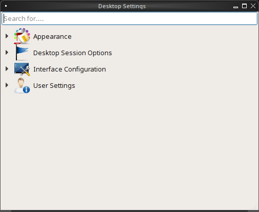

Under the top search bar are four options to configure different areas
of the system. Clicking a category will expand the configuration options
of that category, and clicking an option will open those configuration
options.

.. note:: If you make changes to any of the options, remember to click
   "Save Changes" before exiting this utility in order to save them.

The rest of this section describes the configurations that are available
in each category.

.. index:: appearance, wallpaper
.. _Appearance:

Appearance
==========

This category is used to change the visual appearance and functionality
of the desktop on a per-screen basis. The "Change Desktop Theme" option,
shown in :numref:`Figure %s: Modifying the Theme <lumina17d>`, can be
used to change the default font, font size, theme template, color scheme
, icon pack, and mouse cursors.

.. _lumina17d:

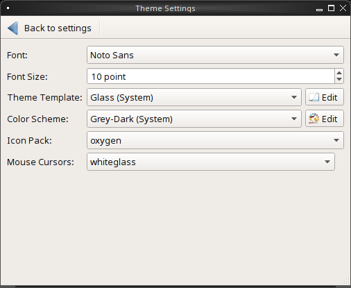
   
It is possible to create your own "Theme Template" or "Color Scheme" by
clicking the "Edit" button next to those options and changing the
settings as necessary. :numref:`Figure %s: Using the Theme Editor <lumina18c>`
shows an example of clicking the "Edit" button with the "Glass (System)"
theme template selected. This action opened the "Theme Editor" and the
user has clicked the color selector (dropper icon) in the upper right
corner. After selecting an item in this menu, the template controlling
that selection can be edited by changing the values in the theme editor
box. Note that the theme templates are written as
`Qt stylesheets <http://doc.qt.io/qt-5/stylesheet.html>`_, so some
scripting experience may be helpful when configuring a theme. After
making your changes, you can either click the "Save" button to save the
theme without closing the editor, or click the "Apply" button which will
both save the theme and close the theme editor.

.. _lumina18c:

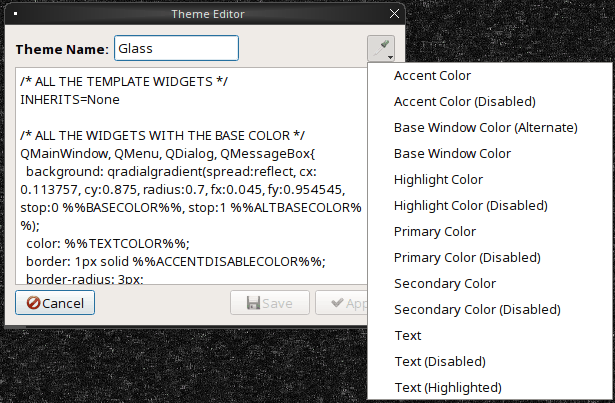

The "Change Wallpaper" option, shown in
:numref:`Figure %s: Lumina Wallpaper Settings <lumina27>`, can be used
to add a wallpaper ("+" button) or remove ("-" button) a wallpaper. When
you click the "+" button, the drop-down menu can be used to select the
file(s), a single directory, a directory and all of its subdirectories,
or a solid color to use as the wallpaper. If multiple images are
selected, the "Rotate Background" button can be selected as well as a
specified time interval in minutes to rotate to the next image.

.. _lumina27:

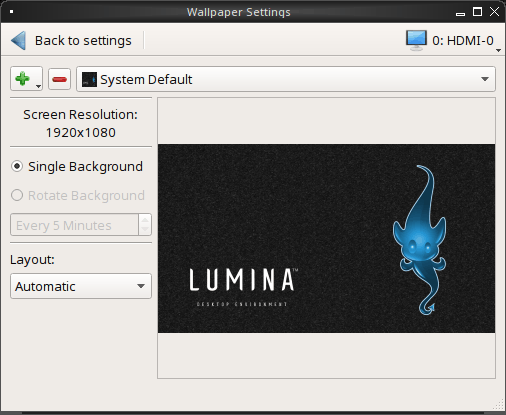

Click the "Layout" drop-down menu to change the default layout of
"Automatic" to one of the following options: "Full Screen", "Fit Screen"
, "Tile", "Center", "Top Left", "Top Right", "Bottom Left", or
"Bottom Right".

The options that are available when you click
:menuselection:`+ --> Solid Color` are shown in
:numref:`Figure %s: Modifying the Wallpaper <lumina16b>`. If you select
a color and click "OK", it will be added as a solid color background to
the wallpaper selection drop-down menu.

.. _lumina16b:

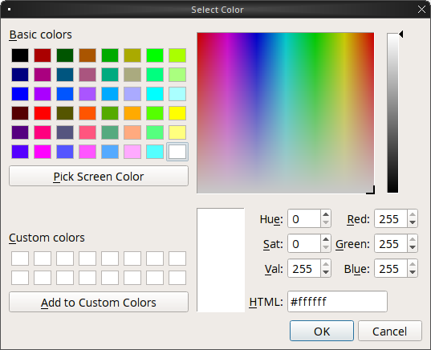
   
The "Window Effects" option, shown in
:numref:`Figure %s: Window Effects <lumina28>`, is used to add or alter
graphical effects or animations applied to your windows. By default, no
additional effects are added, and you will need to adjust these
manually.

.. _lumina28:

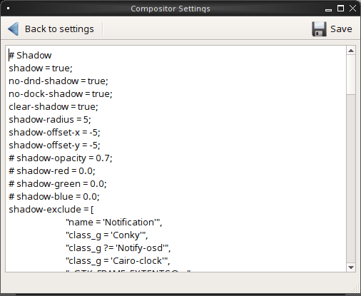

The "Window Manager", shown in :numref:`Figure %s: Session Window Manager <lumina22c>`,
contains various configuration options for the window manager.

.. _lumina22c:

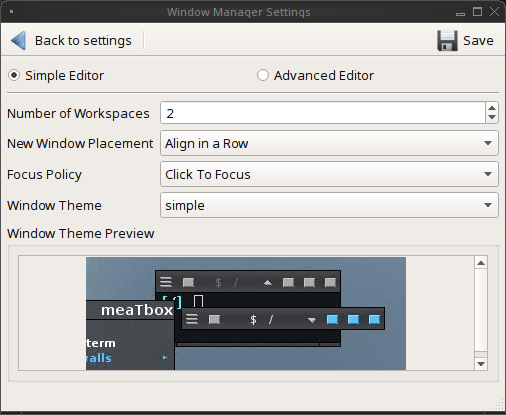

Drop-down menus are provided for configuring the following:

* **Number of Workspaces:** up to *10* workspaces can be defined, with a
  default of *2*.

* **New Window Placement:** indicates where new windows are placed on
  the screen. Choices are "Align in a Row", "Align in a Column",
  "Cascade", or "Underneath Mouse".

* **Focus Policy:** indicates when windows receive focus. Choices are
  "Click to Focus", "Active Mouse Focus", or "Strict Mouse Focus".

* **Window Theme:** controls the appearance of the frame around
  application windows. The "Window Theme Preview" screen can be used to
  preview the selected theme.

The Advanced Editor, seen in :numref:`Figure %s: Window Manager - Advanced <lumina29>`
, allows you to manually adjust every setting related to the display of
windows on your system.

.. _lumina29:

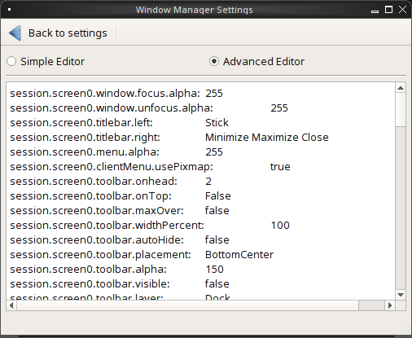

.. index:: application startup shortcuts

.. _DesktopSession Options:

Desktop Session Options
=======================

The "Desktop Sessions Options" menu, seen in
:numref:`Figure %s: Lumina Desktop Configuration <lumina3d>`
is used to configure which applications automatically start when you
login to Lumina, default applications and file types, and keyboard
shortcuts.

Click "Default Applications for File Type" to see the "Basic Settings"
tab, shown in :numref:`Figure %s: Lumina Default Applications - Basic <lumina24a>`
. This tab can be used to configure default applications.

.. _lumina24a:

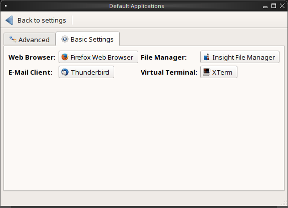

You can configure the default web browser, email client, file manager,
and virtual terminal. Simply click the application you wish to change,
and a new window will appear allowing you to select a new default
application. If you wish to go back to the default application, click
the current application's name, then click "Restore Defaults".

.. note:: Some applications, such as web browsers, keep their own
   internal lists of default applications for opening particular types
   of files. If you set that application to use the :command:`lumina-open`
   or :command:`xdg-open` utilities, it will use the default
   applications that are set here so there is only a single list of
   default applications for the system.

The "Advanced" tab allows you to configure the default application used
for particular file types, as seen in
:numref:`Figure %s: Lumina Default Applications - Advanced <lumina7e>`.

.. _lumina7e:

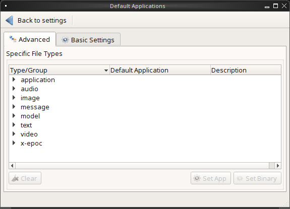

To add an application, select the file type and specific group and
either click "Set App", which will open a drop-down menu of common
applications, or "Set Binary", which will open a file browser so to
browse to the application path. Alternately, selecting only a file type
and then clicking "Set App" or "Set Binary" will register your
application for all the groups within the selected type. Selecting
"Clear" will remove the default application from the associated file
type or group.

The "Keyboard Shortcuts" option, shown in
:numref:`Figure %s: Lumina Keyboard Shortcuts - Basic <lumina8c>`,
is used to configure various keyboard shortcuts for system or window
tasks. Most of these options relate to window and workspace management,
such as moving windows between workspaces, but there are also options
for changing the system audio volume or screen brightness.

.. _lumina8c:

.. figure:: images/lumina8c.png
   :scale: 100%

To create a shortcut, click the desired entry, then "Change Shortcut",
then the key combination you wish to set. Be aware that any entry with
an already defined shortcut showing in the "Keyboard Shortcut" column
can **not** be assigned to another action. To free a shortcut for reuse,
highlight the shortcut, click "Clear Shortcut", then "Save Changes". A
new shortcut can now be created.

Click "Advanced Editor", seen in :numref:`Figure %s Lumina Keyboard Shortcuts - Advanced <lumina30>`,
to manually adjust or create all keyboard shortcuts. By default, syntax
codes are shown in their own display area, but this can be hidden by
unchecking "View Syntax Codes".

.. _lumina30:

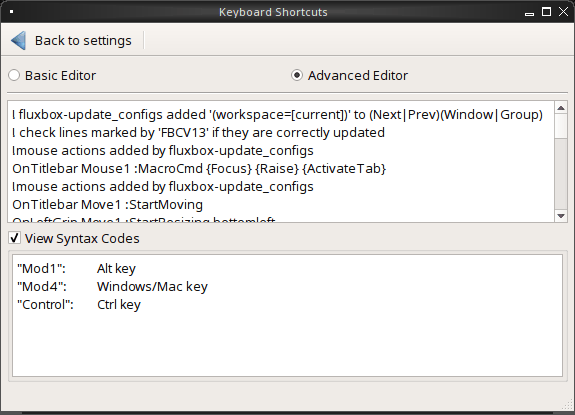

The "Startup Services and Applications" option, displayed in
:numref:`Figure %s: Lumina Startup Services <lumina6e>`, provides
adjustment options for what is automatically started when logging into
Lumina.

.. _lumina6e:

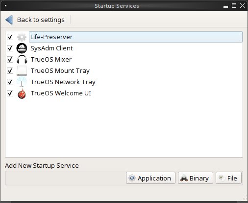

To prevent an application from starting automatically, uncheck its box.
To add an application to the auto-start configuration , click
"Application" to select the application's name from a drop-down menu or
click "Binary" or "File" to browse to the location of  the application
or file to open. If you select a file name, Lumina will automatically
open it in an application that is capable of reading the file type.

.. index:: menu panel

.. _Interface:

Interface Configuration
=======================

The "Interface Configuration" option, seen here as
:numref:`Figure %s: Lumina Interface Configuration <lumina31>`, is used
to configure the context (right-click menu), desktop icons, and floating
panels.

.. _lumina31:

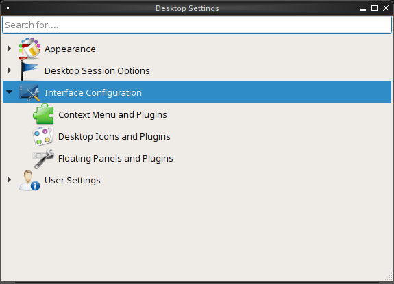

.. note:: The options of "Context Menu and Plugins", "Desktop Icons and
   Plugins", and "Floating Icons and Plugins" involve modifying and
   interacting with plugins, which are described at length in the
   :ref:`Lumina Plugins` chapter of this handbook.

Click "Context Menu and Plugins" to adjust the appearance of the menu
which appears when right-clicking the desktop. By default, the context
menu includes the following plugins: Terminal, File Manager,
Applications, a Separator, and Settings.

Select "Desktop Icons and Plugins" to modify what appears on the current
primary desktop. By default, the RSS Reader plugin will appear in the
lower right corner.

Many customization options are available after right-clicking an icon on
the desktop:

* **Start Moving Item:** Click the icon to lock it in place once it is
  in the desired location.
* **Start Resizing Item:** Use the mouse to increase or decrease size.
  Click when finished adjusting the icon to save the changes.
* **Increase Desktop Icon Sizes:** Increases the size of all desktop
  icons, repeat as necessary.
* **Decrease Desktop Icon Sizes:** Decreases the size of all desktop
  icons, repeat as necessary.
* **Remove Item:** Removes the item from the desktop.

The "Floating Panels and Plugins" option gives you the ability to create
and/or customize panels which are attached to the edges of the screen,
seen in :numref:`Figure %s Lumina Panel Configuration <lumina5f>`

.. _lumina5f:

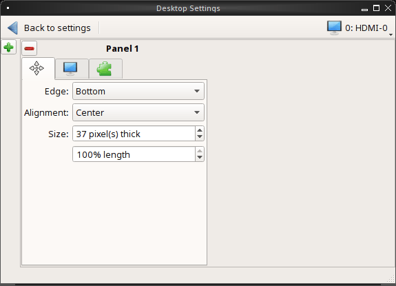

This screen can be used to customize the location, alignment, size,
theme, and plugins for an existing panel. The "+" and "-" icons towards
the top, next to "Panel 1" can be used to add or remove additional
panels. Panels must be aligned along a screen edge, opposite screen
edges in the case of two panels, and may have any width, color, or
transparency.

.. note:: When adding additional panels, a frame similar to "Panel 1"
   will be created for each panel, labeled "Panel 2", "Panel 3", and so
   on. This allows each panel to be configured separately. The
   configuration tabs available for a panel are described below. Be
   sure to select the tab in the desired panel.

The "Location" tab (4 arrow icon) contains the following items:

* **Edge:** This drop-down menu can be used to set the location of the
  panel which can be "Top", "Bottom", "Left", or "Right".

* **Alignment:** This drop-down menu can be used to center the panel on
  the edge or pin it to one of the corners.

* **Size:** Can be used to specify the panel width in pixels and the
  panel length.

The "Appearance" tab (monitor icon) is shown in :numref:`Figure %s: Panels Appearance Tab <lumina19d>`.

.. _lumina19d:

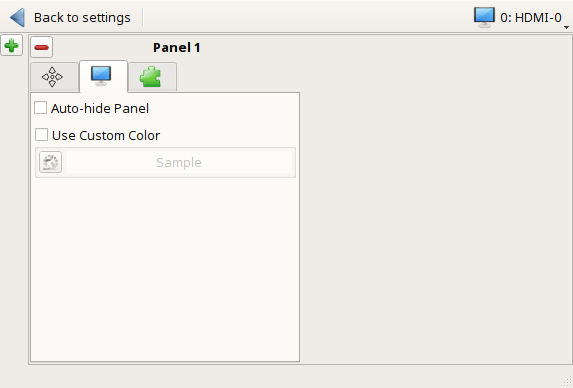

To hide the panel unless the mouse is hovered over it, check the
"Auto-hide Panel" box. The "Custom Color" option can be used to
fine-tune the panel color. Click its box, then the paint icon to select
a panel color.

The "Plugins" tab (puzzle icon) is shown in :numref:`Figure %s: Panels Plugins Tab <lumina20d>`.

.. _lumina20d:

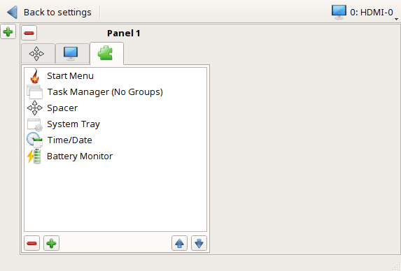

To add a plugin as an icon to the panel, click the "+" button below the
listed plugins and select a plugin from the list that appears. To remove
a plugin, highlight it and click the "-" button below the listed plugins.
The arrow buttons can be used to move the location of the plugin on the
panel. The top of an ordered list corresponds to either the top of a
vertical panel or the left side of a horizontal panel.

By default, Lumina will have one panel which stretches across the
entirety of the bottom of the primary screen and another auto-hiding
panel which displays across the center 10% of the top edge. The bottom
panel incorporates the Start Menu, Task Manager (No Groups), a Spacer,
System Tray, Time/Date, and Battery Monitor plugins. The top panel
includes the Desktop Bar plugin sandwiched between two spacers.

.. index:: user settings

.. _User Settings:

User Settings
=============

The "User Settings" option governs the general settings for the desktop
session. These settings are usually not changed on a frequent basis.

The "General Options" entry, seen in :numref:`Figure %s: Lumina General Options <lumina12f>`,
is used to govern numerous settings for the desktop experience.

.. _lumina12f:

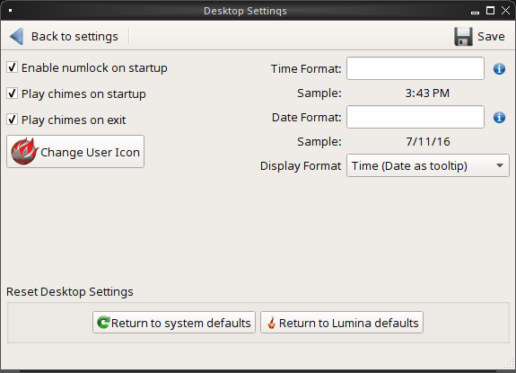

The user can select to automatically enable numlock, play chimes when
Lumina starts or exits, and change the icon that appears in the login
menu and the start menu button. There are also options to set the time
and date format, as well as the time display format (via drop menu).
Additionally, a user can reset **all** their desktop settings via
:guilabel:`Return to system defaults`, which returns Lumina to the
defaults created by the OS, while :guilabel:`Return to Lumina defaults`
returns to the Lumina created settings.

The "Localization Settings" option is shown in :numref:`Figure %s: Session Locale Tab <lumina21c>`.

.. _lumina21c:

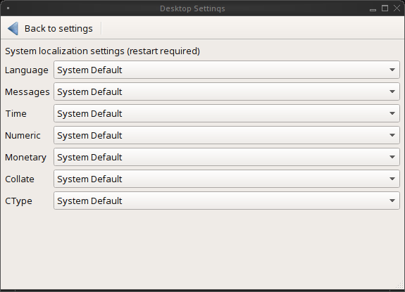

The lumina-i18n package provides localization files. Once installed,
this allows customization of the locale used for the various items
listed in :numref:`Figure %s: Session Locale Tab <lumina21c>`. To
install this package on a TrueOS® or FreeBSD system, use
:command:`sudo pkg install lumina-i18n`. On other operating systems, use
the software management tool that comes with the operating system. Since
each setting has its own drop-down menu, you have the flexibility to
select different locales for each item shown in this screen. If any
changes are made in the "Locale" tab, click :guilabel:`Save Changes`
and restart Lumina so the configured locales can be loaded.

Installing the lumina-i18n package will also add a drop-down menu to the
"Preferences" of the start menu, though Lumina will need to be restarted
after the package installation to add the locale menu to "Preferences".
This new drop-down menu can be used to temporarily change the locale for
the current session only. This will immediately change the localization
of any translated menu items without requiring a restart of Lumina.

.. note:: If using Lumina with a language other than English, any menu
          items that continue to be displayed in English have not yet
          been translated to the selected language. To assist the Lumina
          Project in translating menu items, see :ref:`Interface Translation`.