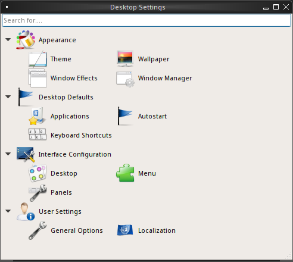
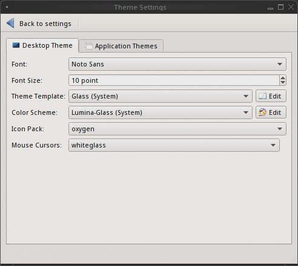
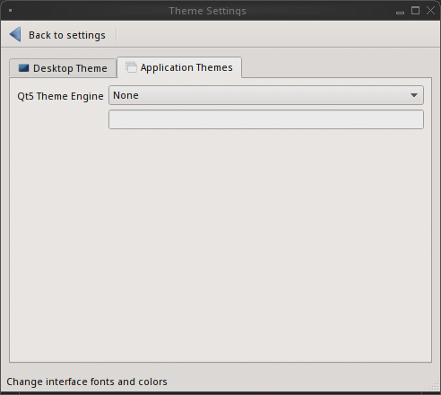
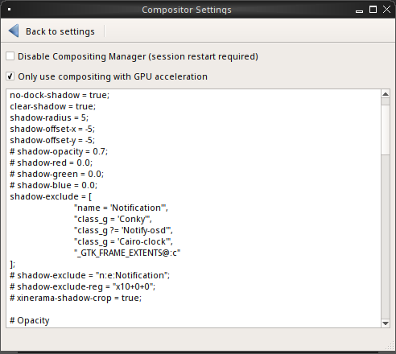
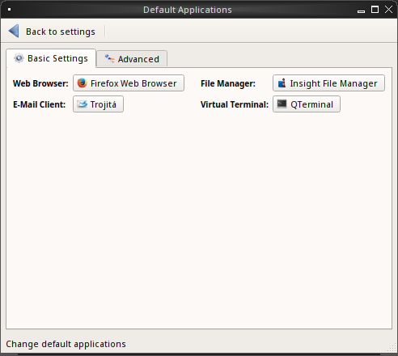
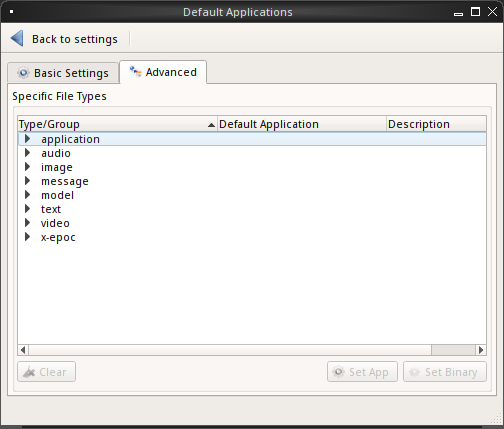
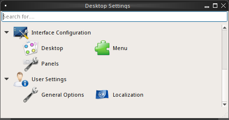
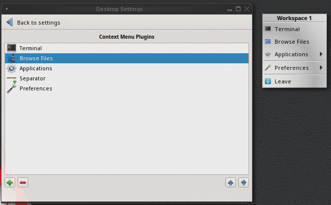

.. index:: configuration
.. _Lumina Configuration:

|lumina| Configuration
**********************

The |lumina| Configuration utility, shown in
:numref:`Figure %s <lumina3>`, can be used to configure every aspect
of the desktop and is the recommended way to make changes. To launch
this utility, click the start menu then
:menuselection:`Preferences --> Configure Desktop`, right-click the
desktop and hover over :guilabel:`Preferences` and click
:guilabel:`All desktop settings`, or type :command:`lumina-config` in a
CLI. If all those options are unavailable, the "Desktop Configuration"
application (under the :guilabel:`Utilities` category) will also open
the configuration utility. For convenience, the :guilabel:`Preferences`
section of the right-click menu also lists the commonly used
sub-elements of **Screensaver**, **Wallpaper**, and **Display** from
within the Configuration utility.

.. _lumina3:

   
   : |lumina| Desktop Configuration

Under the top search bar are four options to configure different areas
of the system. By default, each category is expanded to provide an
efficient view of all available configutation options. Click an option
to view the specific configuration options.

.. note:: If you make changes to any of the options, remember to click
   :guilabel:`Save` before exiting this utility in order to save
   them. |lumina| will prompt for a decision if any unsaved changes are
   present when attempting to navigate away from the current settings
   area.

The rest of this section describes the configurations that are available
in each category.

.. index:: appearance, wallpaper
.. _Appearance:

Appearance
==========

This category is used to change the visual appearance and functionality
of the desktop on a per-screen basis.

.. index:: appearance, themesettings
.. _Theme Settings:

Theme Settings
--------------

The :guilabel:`Theme` option, shown in :numref:`Figure %s <lumina17>`,
can be used to change the default font, font size, theme template, color
scheme, icon pack, and mouse cursors.

.. _lumina17:

   : Theme settings, Desktop Tab

It is possible to create your own **theme template** or **color scheme**
by clicking :guilabel:`Edit` next to those options and changing the
settings as necessary. :numref:`Figure %s <lumina18c>` shows an example
of clicking :guilabel:`Edit` with the :guilabel:`Glass (System)` theme
template selected. This action opened the :guilabel:`Theme Editor` and
the user has clicked the color selector (dropper icon) in the upper
right corner. Select an item in this menu to edit the template
controlling the selection by changing the values in the theme editor
box. Note the theme templates are written as
`Qt stylesheets <http://doc.qt.io/qt-5/stylesheet.html>`_, so some
scripting experience will be helpful when configuring a theme. After
making your changes, click :guilabel:`Save` to save the theme without
closing the editor, or click :guilabel:`Apply`, which saves the theme
and closes the editor.

.. TODO update this screenshot later to incorporate Ken's bugfix.

.. _lumina18c:

.. figure:: images/lumina18c.png
   :scale: 100%
   
   : Using the Theme Editor

The :guilabel:`Application Themes` tab, seen in
:numref:`Figure %s <appthemes>`, allows the user to easily apply any
installed Qt5 theme engines to any Qt based applications.

.. _appthemes:

   
   : Theme settings, Application Themes tab

Select the :guilabel:`Qt5 Theme Engine` drop down menu to choose between
the defaults of **None** or **Manual Setting**. Any user installed
theme engines will also appear in this drop down menu.

.. index:: appearance, wallpaper
.. _Wallpaper:

Wallpaper
---------

The :guilabel:`Wallpaper` option, shown in
:numref:`Figure %s <lumina27>`, can be used to add or remove a wallpaper
with the :guilabel:`+` or :guilabel:`-` buttons, respectively. When
:guilabel:`+` is pressed, the drop-down menu can be used to select the
file(s), a single directory, a directory and all of its subdirectories,
or a solid color to use as the wallpaper. If multiple images are
selected, :guilabel:`Rotate Background` can be selected as well as a
specified time interval in minutes to move to the next image.

.. _lumina27:

.. figure:: images/lumina27.png
   :scale: 100%
   
   : |lumina| Wallpaper Settings

Click the :guilabel:`Layout` drop-down menu to change the default
layout of :guilabel:`Automatic` to one of several options:
*Fullscreen*, *Fit screen*, *Tile*, *Center*, *Top Left*, *Top Right*,
*Bottom Left*, or *Bottom Right*.

Click :menuselection:`+ --> Solid Color` to view all the wallpaper
options shown in :numref:`Figure %s <lumina16>`. Select a color and
click :guilabel:`OK` to add that color as a solid background to the
wallpaper selection drop-down menu.

.. _lumina16:

.. figure:: images/lumina16b.png
   :scale: 100%

   : Modifying the Wallpaper

.. index:: appearance, windoweffects
.. _Window Effects:

Window Effects
--------------

:guilabel:`Window Effects`, shown in :numref:`Figure %s <lumina28>`, is
used to add or alter graphical effects or animations applied to your
windows. By default, no additional effects are added. Any desired
changes need to be adjusted manually.

.. _lumina28:

   : Window Effects

Check :guilabel:`Disable Compositing Manager` to enable this option.
Restarting the current session is required for any changes to take
effect. By default,
:guilabel:`Only use compositing with GPU acceleration` is selected,
which aids with overall system performance.

.. index:: appearance, windowmanager
.. _Window Manager:

Window Manager
--------------

:guilabel:`Window Manager`, shown in :numref:`Figure %s <lumina22>`,
contains various configuration options for the window manager.

.. _lumina22:

.. figure:: images/lumina22c.png
   :scale: 100%

   : Session Window Manager

Drop-down menus are provided for configuring all options:

* **Number of Workspaces:** A maximum of *10* workspaces can be defined,
  with a default of *2*.

* **New Window Placement:** Indicates where new windows are placed on
  the screen. Choices are *Align in a Row*, *Align in a Column*,
  *Cascade", or *Underneath Mouse*.

* **Focus Policy:** Indicates when windows receive focus. Choices are
  *Click to Focus*, *Active Mouse Focus*, or *Strict Mouse Focus*.

* **Window Theme:** Controls the appearance of the frame around
  application windows. The :guilabel:`Window Theme Preview` screen can
  be used to preview the selected theme.

The :guilabel:`Advanced Editor`, seen in
:numref:`Figure %s <lumina29>`, provides options to manually adjust
every setting related to the display of windows on the system.

.. _lumina29:

.. figure:: images/lumina29.png
   :scale: 100%

   : Window Manager - Advanced

.. index:: application startup shortcuts

.. _Desktop Defaults:

Desktop Defaults
================

The :guilabel:`Desktop Defaults` category, seen in
:numref:`Figure %s <lumina3>`, is used to configure which applications
automatically start upon logging in to |lumina|, the default
applications and file types, and keyboard shortcuts.

.. index:: applications
.. _Applications:

Applications
------------

Click :guilabel:`Applications` to view the default applications
:guilabel:`Basic Settings` tab, shown in :numref:`Figure %s <lumina24>`.
This tab can be used to configure default applications.

.. _lumina24:

   : |lumina| Default Applications - Basic

The default web browser, email client, file manager,and virtual
terminal are all configurable. Click the desired application, and a new
window will appear, allowing a new default application to be chosen. To
return to the default application, click the current application's name,
then :guilabel:`Restore Defaults`.

.. note:: Some applications, such as web browsers, keep their own
   internal lists of default applications for opening particular types
   of files. These applications, when configured to use the
   :command:`lumina-open` or :command:`xdg-open` utilities, will refer
   back to the default applications set in
   :guilabel:`Applications`.

The :guilabel:`Advanced` tab allows for configuring the default
application used for particular file types, as seen in
:numref:`Figure %s <lumina7>`.

.. _lumina7:

   : |lumina| Default Applications - Advanced

To add an application, select the file type and specific group and
either click :guilabel:`Set App`, which will open a drop-down menu of
common applications, or :guilabel:`Set Binary`, which will open a file
browser for navigating the application path. Alternately, selecting only
a file type and clicking :guilabel:`Set App` or :guilabel:`Set Binary`
will register the application for all the groups within the selected
type. Selecting :guilabel:`Clear` will remove the default application
from the associated file type or group.

.. index:: shortcuts
.. _Keyboard Shortcuts:

Keyboard Shortcuts
------------------

:guilabel:`Keyboard Shortcuts`, shown in
:numref:`Figure %s <lumina8>`, is used to configure various keyboard
shortcuts for system or window tasks. Most of these options relate to
window and workspace management, such as moving windows between
workspaces, but there are also options for changing the system audio
volume or screen brightness.

.. _lumina8:

.. figure:: images/lumina8c.png
   :scale: 100%

   : |lumina| Keyboard Shortcuts - Basic

To create a shortcut, click the desired entry, then
:guilabel:`Change Shortcut`, and define the desired key combination.
Any entry with an already defined shortcut showing in the
:guilabel:`Keyboard Shortcut` column can **not** be assigned to another
action. To free a shortcut for reuse, highlight the shortcut, click
:guilabel:`Clear Shortcut`, then :guilabel:`Save Changes`. A new
shortcut can now be created.

Click :guilabel:`Advanced Editor`, seen in :numref:`Figure %s <lumina30>`,
to manually adjust or create all keyboard shortcuts. By default, syntax
codes are shown in their own display area, but this can be hidden by
unchecking :guilabel:`View Syntax Codes`.

.. _lumina30:

.. figure:: images/lumina30.png
   :scale: 100%

   : |lumina| Keyboard Shortcuts - Advanced

.. index:: startup
.. _Autostart:

Autostart
---------

:guilabel:`Autostart`, displayed in :numref:`Figure %s <lumina6>`,
provides adjustment options for what is automatically started when
logging into |lumina|.

.. _lumina6:

.. figure:: images/lumina6e.png
   :scale: 100%

   : |lumina| Startup Services Configuration

To prevent an application from starting automatically, uncheck its box.
To add an application to the auto-start configuration , click
:guilabel:`Application` to select the application's name from a
drop-down menu. Alternately, click :guilabel:`Binary` or
:guilabel:`File` to browse to the location of the application or file to
open. If a file is chosen, |lumina| will automatically open it in an
application that is capable of reading the file type.

.. index:: interface config

.. _Interface:

Interface Configuration
=======================

:guilabel:`Interface Configuration`, as seen in
:numref:`Figure %s <lumina31>`, is used to configure the desktop,
(right-click) menu, and any panels.

.. _lumina31:

   : |lumina| Interface Configuration

.. note:: The options of :guilabel:`Menu`, :guilabel:`Desktop`, and
   :guilabel:`Panels` involve modifying and interacting with plugins,
   which are described at length in the :ref:`Lumina Plugins` chapter of
   this handbook.

.. index:: interface, desktop config
.. _Desktop:

Desktop
-------

Select :guilabel:`Desktop` to modify what appears on the current primary
desktop. By default, the :ref:`RSS Reader` plugin will appear in the
lower right corner.

Many customization options are available after right-clicking an icon on
the desktop:

* **Launch Item:** Starts the item.
* **Start Moving Item:** Click the icon to lock it in place once it is
  in the desired location.
* **Start Resizing Item:** Use the mouse to increase or decrease size.
  Click when finished adjusting the icon to save the changes.
* **Increase Desktop Icon Sizes:** Increases the size of all desktop
  icons, repeat as necessary.
* **Decrease Desktop Icon Sizes:** Decreases the size of all desktop
  icons, repeat as necessary.
* **Remove Item:** Removes the item from the desktop.

.. index:: interface, rightclick menu
.. _rightclick menu:

Menu
----

Click :guilabel:`Menu` to adjust the appearance of the menu which
appears when right-clicking the desktop, seen in
:numref:`Figure %s <lumina36>`. By default, the context menu
includes several plugins: :ref:`Terminal`,
:ref:`Browse Files <File Manager>`, :ref:`Menu Applications`, a
:ref:`Separator`, :ref:`Settings`, and **Leave**.

.. _lumina36:

   
   : Context menu plugins configuration with an open context menu.

.. note:: **Leave**, with its options to *Logout*, *Restart*,
   *Shutdown*, *Lock*, and *Suspend* the system, will **always** be
   available in the context menu.

.. index:: interface, panels
.. _Panels:

Panels
------

The :guilabel:`Panels` option offers the ability to create and/or
customize panels which are attached to the edges of the screen, as seen
in :numref:`Figure %s <lumina5>`.

.. _lumina5:

.. figure:: images/lumina5f.png
   :scale: 100%

   : |lumina| Panel Configuration

This screen can be used to customize the location, alignment, size,
theme, and plugins for an existing panel. The :guilabel:`+` and
:guilabel:`-` icons towards the top, next to :guilabel:`Panel 1` can be
used to add or remove additional panels. Panels must be aligned along a
screen edge, opposite screen edges in the case of two panels, and may
have any width, color, or transparency.

.. note:: When adding panels, a frame similar to :guilabel:`Panel 1`
   will be created for each panel, labeled :guilabel:`Panel 2`,
   :guilabel:`Panel 3`, and so on. This allows each panel to be
   configured separately. The configuration tabs available for a panel
   are described below. Be sure to select the tab in the desired panel.

The :guilabel:`Location` tab (4 arrow icon) contains a number of items:

* **Edge:** This drop-down menu can be used to set the location of the
  panel which can be *Top*, *Bottom*, *Left*, or *Right*.

* **Alignment:** This drop-down menu can be used to center the panel on
  the edge or pin it to one of the corners.

* **Size:** Can be used to specify the panel width in pixels and the
  panel length.

The :guilabel:`Appearance` tab (monitor icon) is shown in
:numref:`Figure %s <lumina19>`.

.. _lumina19:

.. figure:: images/lumina19d.png
   :scale: 100%

   : Panels Appearance Tab

To hide the panel unless the mouse is hovered over it, check
:guilabel:`Auto-hide Panel`. The :guilabel:`Custom Color` option can be
used to fine-tune the panel color. Click its box, then the paint icon to
select a panel color.

The :guilabel:`Plugins` tab (puzzle icon) is shown in
:numref:`Figure %s <lumina20>`.

.. _lumina20:

.. figure:: images/lumina20d.png
   :scale: 100%

   : Panels Plugins Tab

To add a plugin as an icon to the panel, click :guilabel:`+` below the
listed plugins and select a plugin from the list that appears. To remove
a plugin, highlight it and click :guilabel:`-`, which is below the
listed plugins. The arrow buttons can be used to move the location of
the plugin on the panel. The top of an ordered list corresponds to
either the top of a vertical panel or the left side of a horizontal
panel.

By default, |lumina| will have one panel which stretches across the
bottom of the primary screen and another auto-hiding panel centered at
the top of the screen. The bottom panel incorporates the
:ref:`Panel Start Menu`, :ref:`Task Manager Plugin (No Groups)`, a
:ref:`Spacer`, :ref:`System Tray`, :ref:`Time Date`, and
:ref:`Battery Monitor` plugins. The top panel includes the
:ref:`Desktop Bar` between two :ref:`Spacer` plugins.

.. index:: user settings

.. _User Settings:

User Settings
=============

The :guilabel:`User Settings` option governs the general settings for
the desktop session. These settings are typically left unchanged.

.. index:: user settings, general options
.. _general options:

General Options
---------------

:guilabel:`General Options`, seen in :numref:`Figure %s <lumina12f>`,
is used to govern numerous settings for the desktop experience.

.. _lumina12f:

.. figure:: images/lumina12f.png
   :scale: 100%

   : |lumina| General Options

The user can choose to automatically enable numlock, play chimes when
|lumina| starts or exits, and change the icon that appears in the login
menu and the start menu button. There are also options to set the time
and date format, as well as the time display format (using a drop menu).
Additionally, a user can reset **all** their desktop settings via
:guilabel:`Return to system defaults`, which returns |lumina| to the
defaults created by the OS, while :guilabel:`Return to Lumina defaults`
returns to the |lumina| created settings.

.. index:: user settings, localization
.. _localization:

Localization
------------

The :guilabel:`Localization` is shown in :numref:`Figure %s <lumina21>`.

.. _lumina21:

.. figure:: images/lumina21c.png
   :scale: 100%

   : Session Locale Tab

The **lumina-i18n** package provides localization files. Once installed,
this allows customization of the locale used for the various items
listed in :numref:`Figure %s <lumina21>`. To install this package on a
|trueos| or FreeBSD system, type
:command:`sudo pkg install lumina-i18n`.
On other operating systems, use the default software management tool.
Since each setting has its own drop-down menu, there is flexibility to
select different locales for each item shown in this screen. If any
changes are made in the :guilabel:`Locale` tab, click
:guilabel:`Save Changes` and restart |lumina| to load the configured
locales.

Installing the **lumina-i18n** package will also add a drop-down menu to
the :guilabel:`Preferences` area of the start menu, though |lumina| will
need to be restarted after the package installation to add the locale
menu to :guilabel:`Preferences`. This drop-down menu is used to
change the locale for the current session only. This will immediately
change the localization of any translated menu items without requiring
a restart of |lumina|.

.. note:: If using |lumina| with a language other than English, any menu
          items that continue to be displayed in English have not yet
          been translated to the selected language. To assist the
          |lumina| Project in translating menu items, see
          :ref:`Interface Translation`.

.. TODO Add section for Input Device settings, once it has been added to
   UNSTABLE for testing.
   
   .. index:: user settings, input devices
   .. _Input Device Settings
   
   Input Device Settings
   ---------------------
   