.. index:: plugins
.. _Lumina Plugins:

Lumina® Plugins
***************

|lumina| offers a wide variety of plugins which allow the user to
customize their desktop experience. Plugins are divided between context
menu, desktop, and floating panel plugins.

.. index:: contextmenu plugins
.. _Context Menu Plugins:

Context Menu Plugins
====================

Menu plugins are the options which appear when the user right-clicks on
the desktop screen in |lumina|, as seen in
:numref:`Figure %s <luminamenupluginmenu1>`. Customize these options by
clicking the :guilabel:`Start Menu`, then
:menuselection:`Preferences --> Configure Desktop --> Interface Configuration --> Context Menu and Plugins`.

.. _luminamenupluginmenu1:

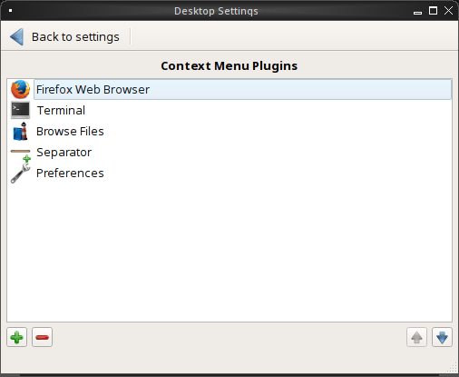

   Lumina Menu Plugins

Add or remove plugins by clicking the :guilabel:`green plus` or
:guilabel:`red minus` buttons in the bottom left corner of the window.
The arrow buttons in the bottom right allow the user to move plugins up
or down in the :guilabel:`Quick-Access Menu` field, which will alter
their display order when the desktop is right-clicked. Click
:guilabel:`Save` to immediately implement any changes to the menu.

Two elements the right-click menu will always display are the name of
the current virtual desktop at the top of the menu and the shutdown
options on the bottom, as pictured in
:numref:`Figure %s <luminamenuplugin1>`.

.. _luminamenuplugin1:

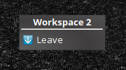

   Menu Plugin Default Menu

The user can completely customize what appears between these two
elements of the menu.

.. _Menu Applications:

Applications
------------

.. _luminamenuplugin2:

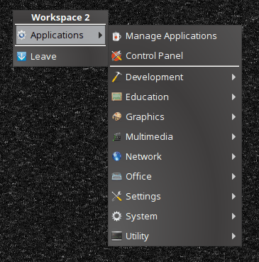

   Applications
   
This plugin, shown in :numref:`Figure %s <luminamenuplugin2>` adds an
application menu which can be navigated to open any installed
application. The Control Panel and Application Management options will
always be shown at the top, while the categories of applications are
shown underneath.

.. _Custom App:

Custom App
----------

.. _luminamenuplugin3:

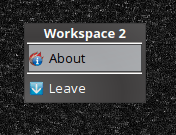

   Custom Application

The Custom App option, seen in :numref:`Figure %s <luminamenuplugin3>`,
adds a specific quickstart icon for a single application to the
right-click menu. Pictured is the icon for the "About" application,
which is displaying current |trueos| system information.

.. _File Manager:

File Manager
------------

.. _luminamenuplugin4:

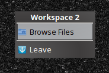

   File Manager

Opens the user's home directory within the default file manager, seen in
:numref:`Figure %s <luminamenuplugin4>`.

.. _JSON Menu:

JSON Menu
---------

The JSON Menu plugin gives a more advanced user the flexibility to create
their own entries into the right-click menu. Selecting the JSON Menu
plugin immediately brings up the menu configuration window, seen in
:numref:`Figure %s <luminamenuplugin5>`.

.. _luminamenuplugin5:

.. figure:: images/luminamenuplugin5.png
   :scale: 100%

   JSON Menu Configuration Window

This window has three fields: :guilabel:`Visible Name`,
:guilabel:`Executable`, and :guilabel:`Icon`. :guilabel:`Visible Name`
will define the name of the right-click menu entry.
:guilabel:`Executable` is the path to the custom script to be run for
the entry. :guilabel:`Icon` is optional, but is used to assign a
specific icon to the custom script.

.. _luminamenuplugin6:

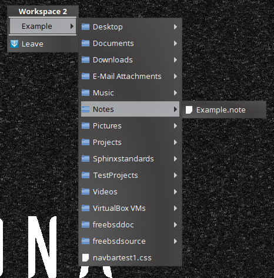

   JSON Menu Example

For the example in :numref:`Figure %s <luminamenuplugin6>`, after
completing the configuration window, the resultant display shows
the custom script in action. :guilabel:`Visible Name` appears under
:guilabel:`Workspace 2`, while the executable script has generated
the menu of files and folders.

.. _Separator:

Separator
---------

A Separator, seen in :numref:`Figure %s <luminamenuplugin1>`, is simply
a horizontal line which can be used to divide entries in the right-click
menu. When added to the menu, use the up and down arrows in the plugin
selection menu to place the Separator plugin between the plugins you
wish to place a line between.

.. _Settings:

Preferences
-----------

.. _luminamenuplugin7:

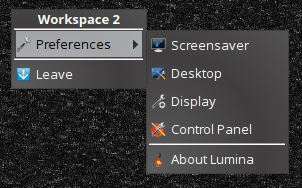

   Preferences

This plugin, seen in :numref:`Figure %s <luminamenuplugin7>`, adds a
shortcut to the right-click menu which opens a new menu of configuration
quicklinks.

.. _Terminal:

Terminal
--------

.. _luminamenuplugin8:

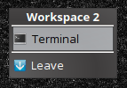

   Terminal

A shortcut to the default system terminal, seen in
:numref:`Figure %s <luminamenuplugin8>`.

.. _Window List:

Window List
-----------

.. _luminamenuplugin9:

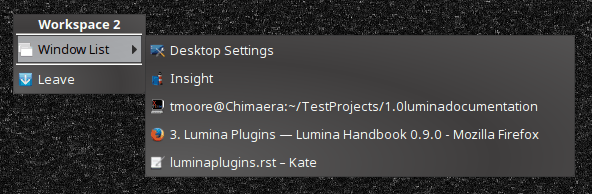

   Window List

This plugin, seen in :numref:`Figure %s <luminamenuplugin9>`, adds an
entry to the right-click menu which, when hovered over with the mouse,
will list all open application windows. This plugin is comparable to a
task manager plugin for panels.

.. index:: desktop plugins
.. _desktop plugins:

Desktop Plugins
===============

Desktop plugins will add icons or widgets for display on the main screen
of the |lumina| Desktop Environment. Click on the default start menu in
the lower left of the main desktop screen, then click
:menuselection:`Preferences --> Configure Desktop --> Interface Configuration --> Desktop Icons and Plugins`.

.. _luminadesktoppluginmenu1:

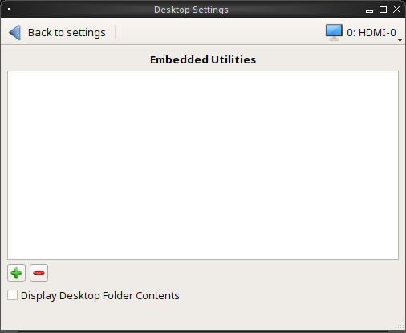

   Desktop Plugin Menu

This is the primary menu for configuring desktop plugins, seen in
:numref:`Figure %s <luminadesktoppluginmenu1>`. Click the
:guilabel:`green plus` to open a :guilabel:`Select Plugin` window. The
user can choose between the available plugins by opening the drop-down
menu and clicking the desired plugin. Once a plugin has been selected,
it will appear in the :guilabel:`Embedded Utilities` window.

The :guilabel:`Display Desktop Folder Contents` option is used to
display each item stored in :file:`~/Desktop` as an icon on the desktop.
By default, this option is selected as its box is black. De-select this
option and click :guilabel:`Save Changes` to remove the icons for the
contents of :file:`~/Desktop` from the desktop. To define a smaller area
on the desktop for displaying icons, use the :ref:`Desktop Icons View`
plugin.

Once all the desired plugins have been added, click :guilabel:`Save`
in the upper right section. The menu will automatically save and
implement any changes to the desktop plugins.

There are numerous plugins in the desktop category, listed in
alphabetical order.

.. _Application Launcher:

Application Launcher
--------------------

.. _luminadesktopplugin1:

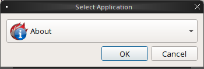

   Application Launcher

Choosing the Application Launcher plugin opens the window seen in
:numref:`Figure %s <luminadesktopplugin1>`. This drop down menu allows
the user to choose a specific application to add to the desktop.

.. _Audio Player:

Audio Player
------------

.. _luminadesktopplugin2:

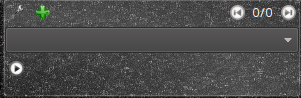

   Audio Player

The Audio Player plugin, seen in
:numref:`Figure %s <luminadesktopplugin2>`, will play user added lists
of audio files. Pressing the wrench icon in the upper left corner will
open an options menu to clear or shuffle the playlist.

The green plus icon gives the user options to add files, a directory, or
URL to the playlist. Toggle the play button in the lower left corner of
the plugin in order to start/stop an audio file. The forward and back
buttons in the upper right corner allow the user to skip to the next
song or return to the previous one. Click the currently playing file to
open a drop down menu of all added audio files.

.. _calendar:

Calendar
--------

.. _luminadesktopplugin3:

.. figure:: images/luminadesktopplugin3.png
   :scale: 100%

   Calendar

This calendar plugin, seen in
:numref:`Figure %s <luminadesktopplugin3>`, will display a calendar set
to the current month and day. The arrows in the upper left and right of
the plugin allow the user to view previous or upcoming months. If
available, the user can also use their mouse to hover over the calendar
and then scroll up or down through the calendar.

.. _Desktop Icons View:

Desktop Icons View
------------------

.. _luminadesktopplugin4:

.. figure:: images/luminadesktopplugin4.png
   :scale: 100%

   Desktop Icons

This plugin, seen in :numref:`Figure %s <luminadesktopplugin4>`, will
define an area on the desktop to display icons. If enough icons are
added to the plugin, a scroll bar will appear for the user to scroll
through all available icons.

.. _Note Pad:

Note Pad
--------

.. _luminadesktopplugin5:

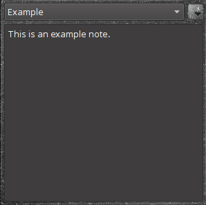

   Note Pad

Note Pad, seen in :numref:`Figure %s <luminadesktopplugin5>`, adds a
simple text editor widget to the desktop. The user needs to create or
open a note before they can type a message. Notes default to the .note
text format and are saved in :file:`/usr/home/<username>/Notes`.
Clicking the down arrow in the upper-right corner displays a number of
options:

* **Open Text File:** Allows the user to browse through their
  directories to open a .note or other text file.
* **Create a Note:** Creates a new note; a unique name is required.
* **Rename Note:** Renames the currently open note.
* **Delete Note:** Immediately deletes the displayed note.

.. _RSS Reader:

RSS Reader
----------

.. _luminadesktopplugin6:

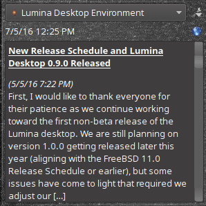

   RSS Reader

RSS Reader, seen in :numref:`Figure %s <luminadesktopplugin6>`, displays
connected RSS feeds. The user can add their own custom RSS feeds to the
plugin, but the default feed displayed is the |lumina| Desktop
Environment blog. Click the dropdown menu to choose which RSS feed to
display. The :guilabel:`down arrow` in the upper right corner opens a
list of options:

* **Add RSS Feed:** An option to allow the user to type in their
  own RSS URL or load a preset RSS Feed.
* **View Feed Details:** Displays current feed data, including URL,
  feed description and website address, and the previous build date
  and synchronization settings. Also included is an option to remove
  the feed.
* **Settings:** Options for syncing the feed. You can choose to
  synchronize manually, or instead define the sync interval.
  Remember to save any changes in feed settings.
* **Update Feeds Now:** Click to immediately update all feeds.

.. note:: An active Internet connection is required for the RSS Reader
   plugin to function properly.

Click the :guilabel:`blue globe` to open the default web browser at the
feed's associated website.

.. _System Monitor:

System Monitor
--------------

.. _luminadesktopplugin7:

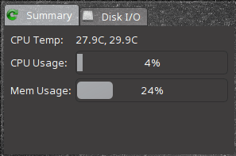

   System Monitor Display

The :guilabel:`Summary` tab of the System Monitor plugin, seen in
:numref:`Figure %s <luminadesktopplugin7>`. CPU Temperature (in
Celsius), CPU Usage, and Memory Usage are displayed. Currently, there
are no other options to display in the system monitor aside from these
statistics and the read/write speed monitor, shown next.

.. _luminadesktopplugin8:

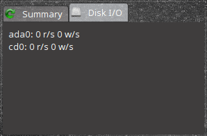

   System Monitor I/O

The :guilabel:`Disk I/O` tab of the System Monitor plugin. Displayed are
the current read and write speeds of the connected hardware, which in
:numref:`Figure %s <luminadesktopplugin8>` is a hard drive and cd player.

.. index:: float panel plugins
.. _floating panel plugins:

Floating Panel Plugins
======================

Panels are a completely customizable option for |lumina| users. By
default, |lumina| users will have one panel stretched across the bottom
of the primary screen and one smaller pop-up panel in the top middle of
the primary screen. To adjust the default panels and add plugins, click
the start menu and navigate
:menuselection:`Preferences --> Configure Desktop --> Interface Configuration --> Floating Panels and Plugins`.
For demonstration purposes, a simple panel centered at the top of a
secondary screen was utilized to show the various plugins listed below.
The settings for this panel are pictured in
:numref:`Figure %s <luminapanelpluginmenu1>`.

.. _luminapanelpluginmenu1:

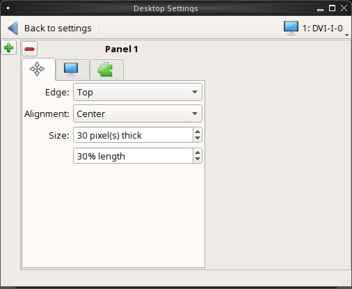

   Panel Settings

As you can see, :guilabel:`Panel 1` is configured to the top center of
:guilabel:`Monitor 1` (plugged into DVI-I-0). To add or adjust plugins
for this panel, click the :guilabel:`green puzzle piece` to open the
menu seen in :numref:`Figure %s <luminapanelpluginmenu2>`.

.. _luminapanelpluginmenu2:

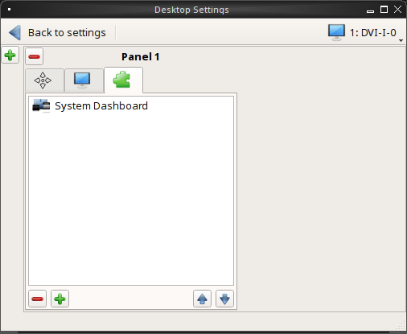

   Panel Plugins Menu

The large field shows currently active plugins. Click the
:guilabel:`red minus` or :guilabel:`green plus` buttons to add or remove
plugins to the panel. Use the arrow keys to alter the display order of
attached plugins. By default, plugins will populate horizontal panels
from left to right, and vertical panels from top to bottom. All the
plugins available for panel plugins are listed below.

.. _panel application launcher:

Panel Application Launcher
--------------------------

.. _luminapanelplugin1:

   Panel Application Launcher

When you select this plugin, seen in
:numref:`Figure %s <luminapanelplugin1>`, it will prompt to select the
application to launch. This will add a shortcut for launching the
selected application to the panel.

.. _Application Menu:

Application Menu
----------------

.. _luminapanelplugin2:

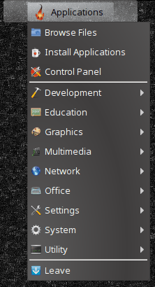

   Application Menu
   
Adds an application menu, seen in
:numref:`Figure %s <luminapanelplugin2>`, which shortcuts to the user's
home directory, a shortcut to the operating system’s graphical software
management utility (if one exists), a shortcut to the operating system’s
Control Panel (if available), and a list of installed software sorted by
categories. This plugin is a primary menu like the start button, and
will open when the :kbd:`Windows` key is pressed.

.. _Battery Monitor:

Battery Monitor
---------------

Hover over this icon (not pictured) to view the current charge status of
the battery. When the charge reaches 15% or below, the low battery icon
will flash intermittently and will change to a low battery icon when
there is less than 5% charge left.

.. _Desktop Bar:

Desktop Bar
-----------

.. _luminapanelplugin3:

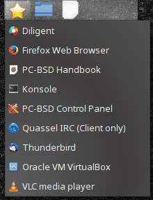

   Desktop Bar: :guilabel:`Favorite Applications` ("Star" icon) is
   pressed.

This plugin adds shortcuts to the panel for applications or files
contained within the ~/Desktop folder or favorited by the user, seen in
:numref:`Figure %s <luminapanelplugin3>`. The :guilabel:`star` button
displays applications, the :guilabel:`folder` button displays folders,
and the :guilabel:`file` button shows favorite files.

.. _Line:

Line
----

.. _luminapanelplugin4:

   Line: The line is highlighted in red.

Adds a separator line to the panel to provide visual separation between
plugins, highlighted in :numref:`Figure %s <luminapanelplugin4>`. When
adding a line plugin in the
:ref:`Panel Plugins Menu <luminapanelpluginmenu2>`,
be sure to use the :guilabel:`arrow` buttons in the bottom-right corner
of the window to place the line entry between the plugins to be
separated.

.. _Show Desktop:

Show Desktop
------------

.. _luminapanelplugin5:

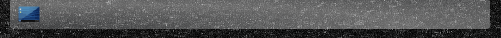

   Show Desktop Button

This button, seen in :numref:`Figure %s <luminapanelplugin5>`, will
immediately hide all open windows on all active monitors so only the
desktop is visible. This is useful for touch screens or small devices.

.. _Spacer:

Spacer
------

.. _luminapanelplugin6:

   Spacer Plugin

Adds a blank area to the panel,
:numref:`Figure %s <luminapanelplugin6>`. Similar to :ref:`Line`,
Spacers need to be positioned between plugins in the
:ref:`Panel Plugins Menu <luminapanelpluginmenu2>` in order to achieve
the desired separation.

.. _Panel Start Menu:

Start Menu
----------

.. _luminapanelplugin7:

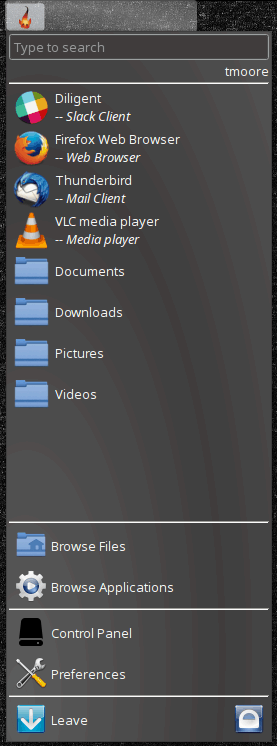

   Start Menu

Adds a classic start menu as seen on other operating systems. Shown in
:numref:`Figure %s <luminapanelplugin7>`, this is added by default to
the primary desktop panel in the lower left corner.

.. _System Dashboard:

System Dashboard
----------------

.. _luminapanelplugin8:

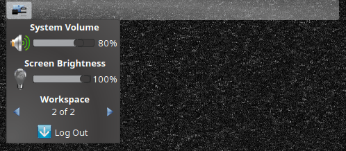

   System Dashboard with the button pressed.

The System Dashboard plugin, seen in
:numref:`Figure %s <luminapanelplugin8>`, is a convenient shortcut to
view or modify a number of basic settings. The system volume and screen
brightness can be manually adjusted higher or lower, and you can also
toggle between virtual workspaces with the left and right arrows. A
:guilabel:`Log Out` button has also been added for additional
convenience. If the system has a battery, its current charge will also
be displayed.

.. note:: Adjusting the screen brightness on a multi-monitor system will
   alter both monitors.

.. _System Tray:

System Tray
-----------

.. _luminapanelplugin9:

.. figure:: images/luminapanelplugin9.png
   :scale: 100%

   System Tray with several docked applications (Quassel IRC, PC Mixer,
   etc.).

Provides an area on the panel for dockable applications, seen in
:numref:`Figure %s <luminapanelplugin9>`. Applications can be sent to
this area on a per-application basis, but only one system tray plugin
can be active at a time. By default, the active system tray will be the
one on the **lowest number** monitor and panel. For example, when adding
the system tray plugin to monitor zero, panel one and again to monitor
one, panel one, only the system tray on monitor zero will be active.
Disabling the system tray on monitor zero will activate the tray on
monitor one, automatically migrating any docked applications to the
other panel.

.. _Task Manager Plugin (No Groups):

Task Manager Plugin (No Groups)
-------------------------------

.. _luminapanelplugin10:

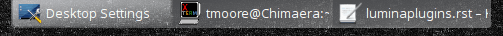

   Task Manager (No Groups)

Ensures that every window gets its own button on the panel. This plugin
, seen in :numref:`Figure %s <luminapanelplugin10>`, will use a large
amount of space on the panel, as every window will need to display a
part of its title. This plugin is added to the default panel for
|lumina|.

.. _Task Manager Plugin:

Task Manager Plugin
-------------------

.. _luminapanelplugin11:

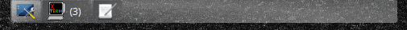

   Task Manager

In :numref:`Figure %s <luminapanelplugin11>` are three open terminal
windows grouped into one minimal panel entry with :guilabel:`(3)`
displayed next to the terminal icon.

The grouping task manager displays windows in the panel as well. Its
primary function is to group windows by application, saving more space
on the panel. This manager also does not typically display window titles
on the panel, a further space savings.

.. _Time Date:

Time/Date
---------

.. _luminapanelplugin12:

.. figure:: images/luminapanelplugin12.png
   :scale: 100%

   Time/Date with the clock selected, opening the larger calendar and
   time zone settings.

Displays the current time and date. A basic clock is added to the panel;
clicking it will open the calendar, seen in
:numref:`Figure %s <luminapanelplugin12>`, which will highlight the
current date. Click the arrows in the top corners to look back or ahead
in the calendar. Click :guilabel:`Time Zone` to adjust the displayed time.

.. _User Button:

User Menu
---------

The User Menu is a more complicated plugin that provides an array of
shortcuts to files and applications on the system, essentially as an
alternative to the :ref:`Panel Start Menu`.

.. _luminapanelplugin13:

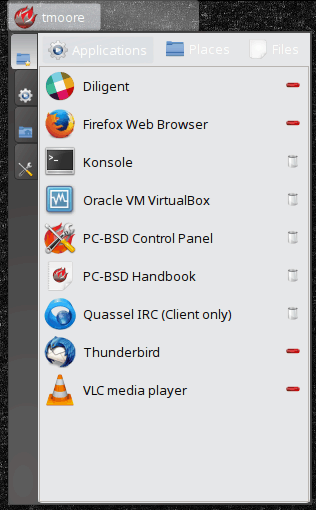

   User Favorites

:numref:`Figure %s <luminapanelplugin13>` shows the default view after
clicking the :guilabel:`user` button. On the sidebar, the
:guilabel:`Favorites` folder is highlighted, with the top tab showing
:guilabel:`Applications`. You can also view favorite folders and files
by clicking the :guilabel:`Places` and :guilabel:`Files` tabs,
respectively.

Clicking the :guilabel:`gear` icon in the left sidebar will open the
:guilabel:`Applications` section of the menu, seen in
:numref:`Figure %s <luminapanelplugin14>`.

.. _luminapanelplugin14:

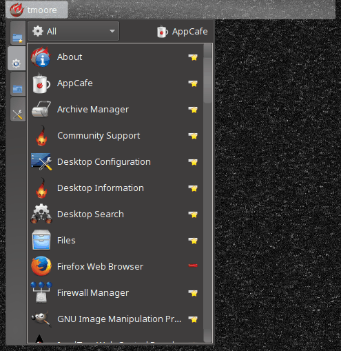

   User Applications

This section displays all applications by default, with the drop down
menu at the top allowing you to view applications by category. The
:guilabel:`AppCafe®` button in the top right will open the |sysadm|
|appcafe|, allowing to quickly search and download more applications.

.. _luminapanelplugin15:

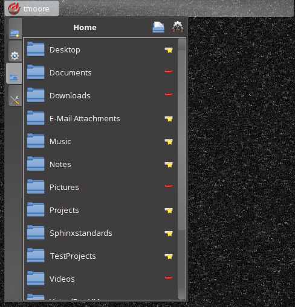

   Home Directory

In :numref:`Figure %s <luminapanelplugin15>`, the :guilabel:`folder`
icon on the left sidebar opens the :file:`Home` directory, providing the
option to quickly browse through system directories. Clicking the
:guilabel:`file/folder` button in the upper right launches the
:ref:`Insight File Manager` at the home directory. Clicking the
:guilabel:`binoculars and gear` icon will launch the search utility.

Finally, selecting the :guilabel:`screwdriver and wrench` icon on the
sidebar will open :guilabel:`Desktop Preferences`, seen in
:numref:`Figure %s <luminapanelplugin16>`.

.. _luminapanelplugin16:

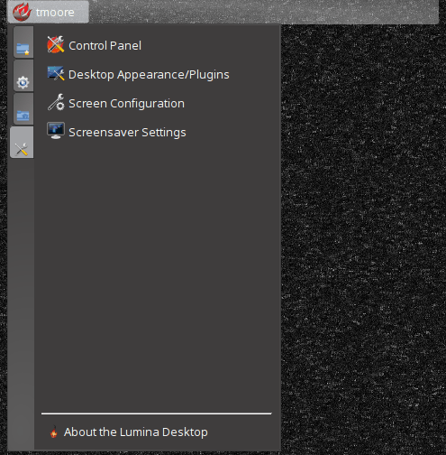

   Desktop Preferences

This panel displays shortcuts to all the settings and configuration
utilities, as well as the system information window.

.. _Workspace Switcher:

Workspace Switcher
------------------

.. _luminapanelplugin17:

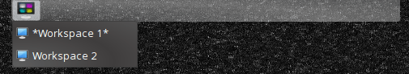

   Workspace Switcher

The Workspace Switcher, seen in
:numref:`Figure %s <luminapanelplugin17>`, is used to switch between
virtual desktops. Click the :guilabel:`monitor` icon to show a drop down
menu of all workspaces. The active workspace will have asterisks (*)
before and after its name.