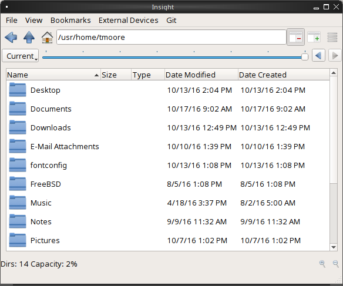
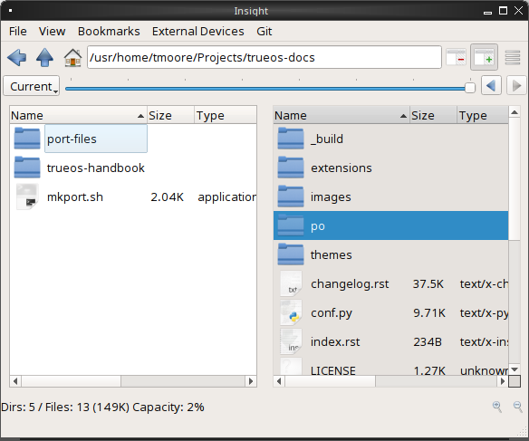

.. index:: Utilities
.. _Lumina Utilities:

|lumina| Utilities
******************

|lumina| provides many built-in utilities, which are described in this
chapter.

.. index:: file manager
.. _Insight File Manager:

Insight File Manager
====================

The Insight file manager, shown in :numref:`Figure %s <lumina10b>`,
allows the user to easily browse and modify files on the local system on
a per-directory basis. To open Insight, click the start menu and select
:guilabel:`Browse Files`, right-click the desktop and select
:guilabel:`Browse Files`, or type :command:`lumina-fm` from an xterm.

.. note:: If Insight is already open :command:`lumina-fm` will not open
   a new window, but instead activate the currently open instance of
   Insight. Open a new window of Insight with :kbd:`Ctrl + N` from
   within Insight.

.. _lumina10b:

   : Insight File Manager

The top menu bar offers a wide variety of options for controlling
Insight:

* **File:** Contains basic options for manipulating Insight, seen here
  in :numref:`Table %s <insightfile>`.
  
  .. _insightfile:
  
  .. table:: : Insight Manager "File" Options

     +------------------+--------------+-----------------------------------+
     | **Name**         | **Shortcut** | **Description**                   |
     +==================+==============+===================================+
     | New Window       | Ctrl + N     | Creates a new instance of Insight |
     +------------------+--------------+-----------------------------------+
     | New Tab          | Ctrl + T     | Opens a new tab in Insight        |
     +------------------+--------------+-----------------------------------+
     | Search Directory | Ctrl + F     | Opens **lumina-search**           |
     +------------------+--------------+-----------------------------------+
     | Close Tab        | Ctrl + W     | Removes an open tab               |
     +------------------+--------------+-----------------------------------+
     | Exit             | Ctrl + Q     | Closes Insight                    |
     +------------------+--------------+-----------------------------------+

* **View:** Presents options to alter what Insight will display to the
  user. :numref:`Table %s <insightview>` shows the current options in
  the :guilabel:`View` tab:
  
  .. _insightview:
  
  .. table:: : Insight Manager "View" Options

     +-------------+--------------+-----------------------------------------+
     | **Name**    | **Shortcut** | **Description**                         |
     +=============+==============+=========================================+
     | Refresh     | F5           | Reloads the current location            |
     +-------------+--------------+-----------------------------------------+
     | Show Hidden | None         | Insight will display all files marked   |
     | Files       |              | *hidden*                                |
     +-------------+--------------+-----------------------------------------+
     | View Mode   | None         | Basic: Displays only the names of files |
     |             |              | an directories.                         |
     |             |              | Advanced: Displays Name, Size, Type,    |
     |             |              | Date Modified, and Date Created for     |
     |             |              | each file or directory.                 |
     +-------------+--------------+-----------------------------------------+

* **Bookmarks:** The :guilabel:`Bookmarks` not only gives options to
  add and manipulate internal links for quick navigation with Insight,
  but will display any created bookmarks in the menu as well.
  :numref:`Table %s <insightbkmrks>` describes all these elements:
  
  .. _insightbkmrks:
  
  .. table:: : Insight Manager "Bookmark" Options

     +------------------+--------------+--------------------------+
     | **Name**         | **Shortcut** | **Description**          |
     +==================+==============+==========================+
     | Manage Bookmarks | None         | Allows modification      |
     |                  |              | or removal of bookmarks  |
     +------------------+--------------+--------------------------+
     | Add Bookmark     | Ctrl + D     | Creates new bookmark of  |
     |                  |              | current location         |
     +------------------+--------------+--------------------------+
     | Bookmark Display | None         | Populates with bookmarks |
     |                  |              | as they are created      |
     +------------------+--------------+--------------------------+

* **External Devices:** Any attached devices with storage will appear
  in this menu. Click :guilabel:`Scan for Devices` if an attached device
  does not appear.

* **Git:** GitHub functionality is natively built into Insight.
  Currently, :guilabel:`Repo Status` will display which branch is
  active, the update status with the origin repo, and any changes to
  commit. :guilabel:`Clone Repository` opens a wizard to download a git
  repository from the internet, seen in :numref:`Figure %s <lumina34>`.

  .. _lumina34:

  .. figure:: images/lumina34.png

     : Git Clone Repository Wizard

  .. tip:: :guilabel:`Clone Repository` will deactivate when Insight
     navigates inside a directory already labeled as a git repository.

Underneath the top menu bar is a navigation bar with even more options.
From left to right, :numref:`Table %s <insightnav>` describes each icon:

.. _insightnav:

.. table:: : Insight Manager Navigation bar

   +------------+--------------------------------------------------+
   | **Item**   | **Description**                                  |
   +============+=====================+============================+
   | Left Arrow | Go back to previous directory                    |
   +------------+--------------------------------------------------+
   | Up Arrow   | Go to parent directory                           |
   +------------+--------------------------------------------------+
   | House Icon | Go to home directory                             |
   +------------+--------------------------------------------------+
   | Text Field | Path to current location/Manual navigation field |
   +------------+--------------------------------------------------+
   | Table with | Single column view                               |
   | red minus  |                                                  |
   +------------+--------------------------------------------------+
   | Table with | Dual column view                                 |
   | green plus |                                                  |
   +------------+--------------------------------------------------+
   | Horizontal | Additional file and directory operations (also   |
   | lines icon | available by right-clicking in the display area) |
   +------------+--------------------------------------------------+

Pressing the :guilabel:`Green Plus Columns` button next to the
navigation field will activate columned browsing, displaying two
independent instances of the file manager in a side-by-side view, seen
in :numref:`Figure %s <lumina33>`.

.. _lumina33:

   : Insight Columns Display

In columns mode, the active column will have the white background. All
the menu options and ZFS functions will apply to only the active column.

The :guilabel:`Horizontal Lines Icon` shows file and directory
operations, commonly seen in the right click menu when an item is
selected. The directory operations are always available, and, like the
name implies, provide options effecting the entire directory.
:numref:`Table %s <insdirops>` shows each of these options, split into
the :guilabel:`Create...` and :guilabel:`Open...` categories:

.. _insdirops:

.. table:: : Insight Manager Directory Operations

   +-------------+--------------+------------------+-----------------------+
   | **Item**    | **Category** | **Shortcut**     | **Description**       |
   +=============+==============+==================+=======================+
   | File        | Create       | Ctrl + Shift + F | Create new file       |
   +-------------+--------------+------------------+-----------------------+
   | Directory   | Create       | Ctrl + Shift + N | Create new directory  |
   +-------------+--------------+------------------+-----------------------+
   | Application | Create       | Ctrl + G         | Launches wizard to    |
   | Launcher    |              |                  | create link to        |
   |             |              |                  | desired application   |
   +-------------+--------------+------------------+-----------------------+
   | Terminal    | Open         | F1               | Launches the default  |
   |             |              |                  | terminal set to the   |
   |             |              |                  | current directory     |
   +-------------+--------------+------------------+-----------------------+
   | Slideshow   | Open         | F6               | Creates and populates |
   |             |              |                  | a slideshow within a  |
   |             |              |                  | new Insight tab       |
   +-------------+--------------+------------------+-----------------------+
   | Multimedia  | Open         | F7               | Opens the directory   |
   | Player      |              |                  | with the default      |
   |             |              |                  | multimedia player     |
   +-------------+--------------+------------------+-----------------------+

Once an item is highlighted in Insight, a number of file operations
become available, seen in :numref:`Table %s <insightfileops>`:

.. _insightfileops:

.. table:: : Insight Manager Operations

   +------------+--------------+--------------+-------------------------+
   | **Item**   | **Category** | **Shortcut** | **Description**         |
   +============+==============+==============+=========================+
   | Open       | None         | Double-Click | Open the file or        |
   |            |              |              | directory with the      |
   |            |              |              | default applications    |
   +------------+--------------+--------------+-------------------------+
   | Open With  | None         | None         | Opens the file or       |
   |            |              |              | directory with a        |
   |            |              |              | chosen application      |
   +------------+--------------+--------------+-------------------------+
   | Cut        | Modify Files | Ctrl + X     | Used with "Paste" to    |
   | Selection  |              |              | move a file             |
   +------------+--------------+--------------+-------------------------+
   | Copy       | Modify Files | Ctrl + C     | Used with "Paste" to    |
   | Selection  |              |              | create an exact         |
   |            |              |              | duplicate of the        |
   |            |              |              | selected file           |
   +------------+--------------+--------------+-------------------------+
   | Rename     | Modify Files | F2           | Allows changing the     |
   |            |              |              | title of the selection  |
   +------------+--------------+--------------+-------------------------+
   | Delete     | Modify Files | Del          | Removes the selection   |
   | Selection  |              |              | from the system         |
   +------------+--------------+--------------+-------------------------+
   | Checksums  | View Files   | None         | Displays the file's     |
   |            |              |              | checksum                |
   +------------+--------------+--------------+-------------------------+
   | Properties | View Files   | None         | Displays the file       |
   |            |              |              | information of the      |
   |            |              |              | selection               |
   +------------+--------------+--------------+-------------------------+
   | Paste      | None         | Ctrl + V     | Used with "Cut" or      |
   |            |              |              | "Copy" to move or clone |
   |            |              |              | files and directories   |
   +------------+--------------+--------------+-------------------------+

The final element to the upper Insight menus, if configured, is the ZFS
snapshot bar, seen as the long blue line in :ref:`Insight <lumina10b>`.
If the system is formatted with ZFS and snapshots of the current
directory are available, this bar allows the user to view the current
directory from previous snapshots. In other words, the user can see past
instances of the directory, as long as ZFS is configured to take
periodic snapshots.

Snapshots are organized with oldest to newest snapshots displayed on the
line from left to right. The text box on the left side of the blue line
shows the active snapshot. Click the text box to view the other
snapshots and choose which snapshots to activate. A slider also exists
which can be used to move the directory back and forward in time,
according to the saved snapshots. The left and right arrows can also be
used for this function.

Underneath the viewing area of Insight are :guilabel:`Magnifying Glass`
icons, used to increase or decrease the size of the objects to display.
Also, the bottom left corner will display tooltips about the highlighted
object or other relevant information.

.. index:: Lumina File Information
.. _Lumina File Information:

|lumina| File Information
=========================

The :command:`lumina-fileinfo` utility can be used to open a graphical
window summarizing the size, permissions and ownership, creation time,
and last modification time of the specified file or directory. In the
example shown in in :numref:`Figure %s <file1a>`, the user has typed
:command:`lumina-fileinfo Downloads` from a terminal
window to view the file information of their :file:`~/Downloads`
directory.

.. _file1a:

.. figure:: images/file1a.png
   :scale: 100%  

   : Sample File Information

.. index:: Lumina Information
.. _Lumina Information:

|lumina| Information
====================

This utility provides information about the installed version of
|lumina|, as well as the license, acknowledgements, and project links.
To launch this utility, right-click the desktop and select
:menuselection:`Preferences --> About Lumina`, click the start menu then
the question mark icon in :guilabel:`Preferences`, or type
:command:`lumina-info` in a terminal window. An example is shown in
:numref:`Figure %s <about1c>`.

.. _about1c:

.. figure:: images/about1c.png
   :scale: 100%

   : About |lumina|

The :guilabel:`General` tab contains a variety of information:

* **Desktop Version:** Indicates the version of |lumina|.

* **OS Build:** Indicates the operating system used to build this
  version of |lumina|.

* **Qt Version:** Click :guilabel:`View Information` to display the QT
  version and its license.

* **Lumina Website:** Click :guilabel:`Lumina Website` to open
  `<http://lumina-desktop.org/>`_ in the default web browser.

* **Ask the Community:** Click :guilabel:`Ask the Community` to open
  `<https://webchat.freenode.net/?channels=%23lumina-desktop>`_, a
  chat channel dedicated to |lumina| with many friendly and helpful
  users.
  
* **Source Repository:** Click :guilabel:`Source Repository` to open
  `<https://github.com/trueos/lumina>`_ in the default web browser.

* **Report a Bug:** Click :guilabel:`Bug Reports` to open
  `<https://bugs.pcbsd.org/projects/pcbsd>`_ in the default web browser.
  Refer to :ref:`Report a Bug` for instructions on how to submit a bug
  report.

The :guilabel:`License` tab contains the license text for |lumina|.
|lumina| is licensed under a
`3-clause BSD license <https://github.com/trueos/lumina/blob/master/LICENSE>`_.

The :guilabel:`Acknowledgements` tab contains the following:

* **Project Lead:** The name of the Project's lead developer. Click the
  name to open his or her profile on GitHub in the default web browser.

* **Contributors:** Click :guilabel:`Open in web browser` link to open
  `<https://github.com/trueos/lumina/graphs/contributors>`_.

* **Sponsors:** lists the official sponsors of the |lumina| Project.

.. index:: application launcher
.. _Lumina Open:

|lumina| Open
=============

To open a file, directory, or URL from the command line, type
:command:`lumina-open` followed by the full path to the file or the URL.
This utility will look for an appropriate application to use to open the
specified file or URL. If there is no default application registered for
the input type, a small dialog will prompt the user to select which
application to use, and optionally set it as the default application for
this file type. As seen in the example shown in
:numref:`Figure %s <lumina11b>`, this dialog organizes the available
applications into three types:

.. _lumina11b:

.. figure:: images/lumina11b.png
   :scale: 100%

   : |lumina| Open

* **Preferred:** These applications have registered their Mime type with
  the system and can open that type of file. Also included are any
  applications that have been used to open this type of file before as
  it keeps track of the last three applications used for that file type.

* **Available:** Displays all the applications installed on the system,
  organized by category and name.

* **Custom:** The user can manually type in the binary name or path of
  the application to use. A search button is also available for the
  user to graphically search the system for the binary. Whenever text
  is entered, a check is performed to determine if it is a valid
  binary and the icon will change between a :guilabel:`green checkmark`
  or a :guilabel:`red X` as appropriate.

.. index:: screenshot
.. _Lumina Screenshot:

|lumina| Screenshot
===================

This utility can be used to take screenshots of the desktop or selected
window and save them as PNG image files. To launch this utility, click
the start menu and select
:menuselection:`Browse Applications --> Utility --> Lumina Screenshot`,
right-click the desktop and select
:menuselection:`Applications --> Utility --> Lumina Screenshot`, type
:command:`lumina-screenshot` from a terminal window, or press :kbd:`Print Screen`.

On the :guilabel:`New Screenshot` tab, seen here in
:numref:`Figure %s <lumina25>`, options are available to fine tune the
screenshot:

.. _lumina25:

.. figure:: images/lumina25.png
   :scale: 100%

   : New Screenshot Tab

* **Entire Session:** Captures the entire screen.

* **Single Screen:** In a multi-monitor setup, the screen number can be
  selected for the screenshot.

* **Single Window:** Captures a selected window. Choose
  :guilabel:`Single Window`, click :guilabel:`Take Screenshot`, and
  click the desired window. The :guilabel:`Include Borders` checkbox
  can be used to determine whether or not the utility will take a
  screenshot of the window with its border frame.
  
* **Delay:** Choose the number of seconds to delay the screenshot. This
  can be used to give more time to prepare the screenshot. For example,
  designating a five second delay on a screenshot will give the user
  time to open a temporary menu or hover over an icon, allowing the
  screenshot to include difficult elements to capture.

There are three options for taking a screenshot: clicking
:guilabel:`Take Screenshot` in the lower-right corner of |lumina|
Screenshot, pressing :kbd:`Ctrl+N`, or selecting
:menuselection:`File --> Take Screenshot`.

After capturing a screenshot, the :guilabel:`View/Edit` tab, seen here
in :numref:`Figure %s <lumina9a>`, provides additional options for
manipulating the screenshot:

.. _lumina9a:

.. figure:: images/lumina9a.png
   :scale: 100%

   : View/Edit Tab

* **Image Preview:** Displays the captured screenshot. Right-click
  the image to view options for zooming in or out. Click and drag across
  the image to highlight an area which can be cropped by pressing
  :guilabel:`Crop` in the lower-right corner.
  
* **Save As:** Press :guilabel:`Save As` to open a window to specify the
  filename and location for saving the screenshot.

* **Launch Editor:** :guilabel:`Launch Editor` opens a selectable
  image manipulation program.

Additionally, click :menuselection:`File --> Quick Save` to
automatically save the screenshot to the default :file:`/Pictures`
directory and open a window to select an image manipulation program.

.. index:: search
.. _Lumina Search:

|lumina| Search
===============
  
|lumina| Search provides options to find and launch applications or to
quickly search for files and directories. The ***** wildcard can be used
in the search terms and the search will include hidden files if the
search term starts with a dot (**.**).

To start this utility, type :command:`lumina-search`, press
:kbd:`Alt + F2`, or go to the start menu and press
:menuselection:`Browse Applications --> Utility --> Lumina Search`.
:numref:`Figure %s <lumina13b>` shows a screenshot of this utility.

.. _lumina13b:

.. figure:: images/lumina13b.png
   :scale: 100%

   : Search for Applications

To open an application, begin to type its name into the search field
(selected by default). The box below the selected :guilabel:`Applications`
button will display any matching application names. Select the desired
application and click :guilabel:`Launch Item` to open it.

Click :guilabel:`Files or Directories` to change the screen slightly,
as seen in :numref:`Figure %s <lumina26>`.

.. _lumina26:

.. figure:: images/lumina26.png
   :scale: 100%

   : Search for Files

By default, a :guilabel:`Files or Directories` search is limited to the
user's home directory, as indicated by the :guilabel:`Search: ~` at the
bottom of the screen. :guilabel:`Smart: Off` indicates every
subdirectory is included in the search, with no exlusions. Once
subdirectories have been added to the exclusion list, :guilabel:`Smart:`
will switch to :guilabel:`On`, and the excluded subdirectories will be
shown on the :guilabel:`Search:` section of the menu. To add additional
search directories or to exclude subdirectories, click the
:guilabel:`wrench` icon to see the screen shown in
:numref:`Figure %s <lumina14a>`.

.. _lumina14a:

.. figure:: images/lumina14a.png
   :scale: 100%

   : Search Configuration

Click the :guilabel:`blue folder` icon to change the starting search
directory. For example, select :guilabel:`Computer`, then
:guilabel:`/` from the :guilabel:`Select Search Directory` screen to
search the entire contents of the computer. Click :guilabel:`+` to add
directories to an exclusion list for searching. Delete an exclusion by
highlighting its entry and clicking :guilabel:`-`. The
:guilabel:`Save as Defaults` option is selected by default. Uncheck
this option to return the all customized search settings back to their
defaults after closing the menu.

.. index:: textedit
.. _Lumina Text Editor:

|lumina| Text Editor
====================

The :command:`lumina-textedit` utility is a plaintext editor with a
number of basic options. :numref:`Figure %s: <lumina23>`
shows the editor with no file opened.

.. note:: Typing :command:`lte` in the command line will also open the
   |lumina| Text Editor.

.. _lumina23:

.. figure:: images/lumina23.png
   :scale: 100%

   : |lumina| Text Edit

Clicking :guilabel:`File` will present options to create **New File**,
**Open File**, **Close File**, **Save file**, **Save File As**, and
**Close**. Click :guilabel:`Edit` to open options to **Find** and
**Replace**, also usable with :kbd:`Ctrl-F` and :kbd:`Ctrl-R`,
respectively. The :guilabel:`View` tab can be used to alter
**Syntax Highlighting**, **Line Numbers**, **Wrap Lines**, and
**Customize Colors**. By default, brackets are highlighted, lines are
numbered, and words will wrap dynamically with the edge of the window.
Additionally, selecting :guilabel:`Customize "Colors` gives the option
to alter all the default text and highlight colors, seen in
:numref:`Figure %s <lumina32>`.

.. _lumina32:

.. figure:: images/lumina32.png
   :scale: 100%

   : Customize Colors

.. index:: Xconfig
.. _Lumina Xconfig:

|lumina| Xconfig
================

The :command:`lumina-xconfig` utility is a graphical front-end to the
:command:`xrandr` command line utility. It provides the ability to probe
and manage any number of attached monitors. To start this utility,
right-click the desktop and select :menuselection:`Preferences --> Display`
or type :command:`lumina-xconfig` from a terminal window. This will open
a screen similar to the one shown in :numref:`Figure %s <lumina15a>`.

.. _lumina15a:

.. figure:: images/lumina15a.png
   :scale: 100%

   : Configuring Monitors

In this example, two display inputs are attached to the system and their
current screen resolutions are displayed. If the display input supports
multiple resolutions, they will appear in the :guilabel:`Resolution`
drop-down menu to select a different resolution.

If another display input is attached, the :guilabel:`Add Screen` tab is
activated so the new input's resolution can be configured. Also, the
user can select whether or not it should be the default input.