.. index:: Utilities
.. _Lumina Utilities:

Lumina Utilities
****************

Lumina provides many built-in utilities, which are described in this
chapter.

.. index:: file manager
.. _Insight File Manager:

Insight File Manager
====================
  
The Insight file manager, shown in :numref:`Figure %s: Insight File Manager <lumina10a>`,
allows the user to easily browse and modify files on the local system on
a per-directory basis. To open Insight, click the start menu and select
"Browse Files", right-click the desktop and select "Browse Files", or
type :command:`lumina-fm` from an xterm.

.. _lumina10a:

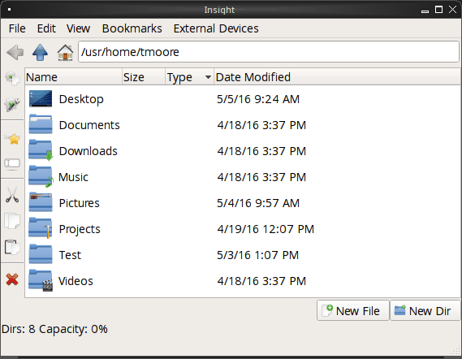

It is possible to open up additional directories through the tab system
using :kbd:`Ctrl-T` or by clicking :menuselection:`File --> New Browser`,
allowing the user to easily manage multiple locations on the system.
Insight also features the ability to "bookmark" locations on the system
for instant access via the "star" button. Once a location has been
bookmarked, it will be available via the "Bookmarks" menu at the top of
the window. Removable devices plugged into the sytem will appear in the
"External Devices" menu, if supported by the operating system. When an
item is selected, the icons on the left side of the screen provide the
possible actions that may be taken with regards to that item. Possible
actions include: "open item", "open item" (will prompt to select the
application to use), "add item to personal favorites", "rename item",
"cut items (add to the clipboard)", "copy items to the clipboard",
"paste items from clipboard", and "delete items". The action
buttons are visible by default, but can be made invisible by clicking
:menuselection:`View --> Show Action Buttons`. To disable thumbnails,
uncheck :menuselection:`View --> Load Thumbnails`. Note that this option
does not remove thumbnails that have already been loaded, it only
prevents loading thumbnails in new directories. Hidden files are not
shown by default; this can be changed by checking
:menuselection:`View --> Show Hidden Files`.

If you select a file or directory and right-click it, the following
options become available: "Open", "Open With" (where you select the
application to use), "Rename", "View Checksums" (shows the MD5
checksum), "Cut Selection", "Copy Selection", "Paste", "Delete
Selection", "File Properties" (such as file type, size, permissions, and
creation date), or "Open Terminal here".

A few additional options may be available at the bottom of the window,
depending on the directory being viewed and the types of files that are
in it:

* **New File:** The ability to create a new file is available if the
  user has permission to modify the contents of the current directory.

* **New Dir:** The ability to create a new directory is available if the
  user has permission to modify the contents of the current directory.

* **Slideshow:** If there are image files in the directory, this option
  will display those image files as a slideshow and provide arrows for
  going forward or back by one file or to the very beginning or end of
  the file list. Buttons are also provided for deleting the currently
  displayed image or to rotate it, and save the rotation, clockwise or
  counter-clockwise.

* **Play:** This will appear if there are supported multimedia files in
  the directory. The types of files that are supported depends on what
  multimedia plugins are installed on the system. If a particular file
  is not recognized as a multimedia file, install the associated
  multimedia codec using the operating system's application management
  software and restart the file manager.

* **Backups:** If the system is formatted with ZFS and snapshots of the
  current directory are available, this button will appear. Snapshots
  are organized from oldest to newest, with the most recent snapshot
  selected by default, and the contents of the directory at the time of
  that snapshot are displayed. To restore a file or multiple files,
  select them from the list and click the "Restore Selection" button. If
  those files still exist and you want to overwrite them, make sure the
  "Overwrite Existing Files" option is checked first. Otherwise, if a
  file with that name exists, the restore will append a number to the
  end of the filename. For example, the first restored version of
  :file:`testfile.txt` will become :file:`testfile-1.txt`.

.. index:: Lumina File Information
.. _Lumina File Information:

Lumina File Information
=======================

The :command:`lumina-fileinfo` utility can be used to open a graphical
window summarizing the size, permissions and ownership, creation time,
and last modification time of the specified file or directory. In the
example shown in in :numref:`Figure %s: Sample File Information <file1a>`,
the user has typed :command:`lumina-fileinfo Downloads` from a terminal
window to view the file information of their :file:`~/Downloads`
directory.

.. _file1a:

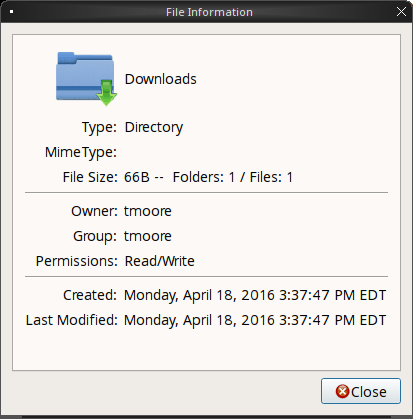

.. index:: Lumina Information
.. _Lumina Information:

Lumina Information
==================

This utility provides information about the version of Lumina, as well
as the license, acknowledgements, and project links. To launch this
utility, right-click the desktop and select
:menuselection:`Preferences --> About Lumina`, click the start menu then
the question mark icon in "Preferences", or type :command:`lumina-info`
in a terminal window. An example is shown in
:numref:`Figure %s: About Lumina <about1c>`.

.. _about1c:

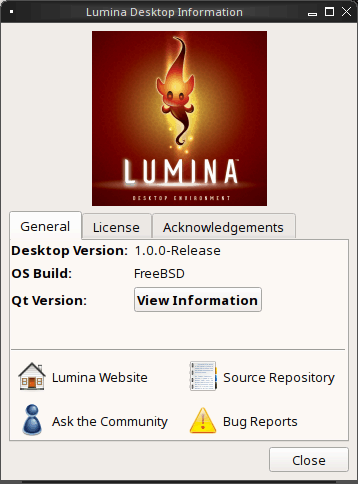

The "General" tab contains the following information:

* **Desktop Version:** Indicates the version of Lumina.

* **OS Build:** Indicates the operating system that was used to build
  this version of Lumina.

* **Qt Version:** Click :guilabel:`View Information` to display the QT
  version and its license.

* **Lumina Website:** Click :guilabel:`Lumina Website` to open
  `<http://lumina-desktop.org/>`_ in the default web browser.

* **Ask the Community:** Click :guilabel:`Ask the Community` to open
  `<https://webchat.freenode.net/?channels=%23lumina-desktop>`_, a
  chat channel dedicated to Lumina with many friendly and helpful users.
  
* **Source Repository:** Click :guilabel:`Source Repository` to open
  `<https://github.com/trueos/lumina>`_ in the default web browser.

* **Report a Bug:** Click :guilabel:`Bug Reports` to open
  `<https://bugs.pcbsd.org/projects/pcbsd>`_ in the default web browser.
  Refer to :ref:`Report a Bug` for instructions on how to submit a bug
  report.

The "License" tab contains the license text for Lumina. Lumina is
licensed under a `3-clause BSD license <https://github.com/trueos/lumina/blob/master/LICENSE>`_.

The "Acknowledgements" tab contains the following:

* **Project Lead:** The name of the Project's lead developer. Click the
  name to open his or her profile on GitHub in the default web browser.

* **Contributors:** Click the "Open in web browser" link to open
  `<https://github.com/trueos/lumina/graphs/contributors>`_.

* **Sponsors:** lists the official sponsors of the Lumina Project.

.. index:: application launcher
.. _Lumina Open:

Lumina Open
===========

To open a file, directory, or URL from the command line, type
:command:`lumina-open` followed by the full path to the file or the URL.
This utility will look for an appropriate application to use to open the
specified file or URL. If there is no default application registered for
the input type, a small dialog will prompt the user to select which
application to use, and optionally set it as the default application for
this file type. As seen in the example shown in
:numref:`Figure %s: Lumina Open <lumina11b>`,
this dialog organizes the available applications into three types:

.. _lumina11b:

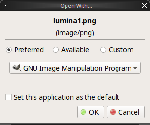

* **Preferred:** These applications have registered their Mime type with
  the system and can open that type of file. Also included are any
  applications that have been used to open this type of file before as
  it keeps track of the last three applications used for that file type.

* **Available:** Displays all the applications installed on the system,
  organized by category and name.

* **Custom:** The user can manually type in the binary name or path of
  the application to use. It also provides a search button to let the
  user graphically search the system for the binary. Whenever text is
  entered, a check is performed to determine whether that is a valid
  binary and the icon will change between a green checkmark or a red X
  as appropriate.

.. index:: screenshot
.. _Lumina Screenshot:

Lumina Screenshot
=================

This utility can be used to take screenshots of the desktop or selected
window and save them as PNG image files. To launch this utility, click
the start menu and select
:menuselection:`Browse Applications --> Utility --> Lumina Screenshot`,
right-click the desktop and select
:menuselection:`Applications --> Utility --> Lumina Screenshot`, type
:command:`lumina-screenshot` from a terminal window, or press :kbd:`Print Screen`.

On the "New Screenshot" tab, seen here in
:numref:`Figure %s: New Screenshot Tab <lumina25>`, you can adjust the
following settings to fine tune the screenshot:

.. _lumina25:

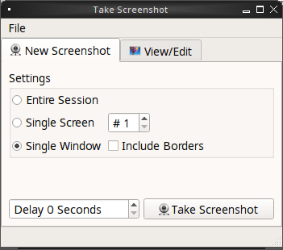

* **Entire Session:** Captures the entire screen.

* **Single Screen:** In a multi-monitor setup, the screen number can be
  selected for the screenshot.

* **Single Window:** Captures a selected window. Choose "Single Window,"
  click :guilabel:`Take Screenshot`, and click on the desired
  window. The "Include Borders" checkbox can be used to determine
  whether or not the utility will take a screenshot of the window with
  its border frame.
  
* **Delay:** Choose the number of seconds to delay the screenshot. This
  can be used to give more time to prepare the screenshot. For example,
  designating a five second delay on a screenshot will give the user
  time to open a temporary menu or hover over an icon, allowing the
  screenshot to include otherwise difficult elements to capture.

There are three options for taking a screenshot: clicking the "Take
Screenshot" button in the lower-right corner of Lumina Screenshot,
pressing :kbd:`Ctrl+N`, or clicking :menuselection:`File --> Take Screenshot`.

After capturing a screenshot, the "View/Edit" tab, seen here in
:numref:`Figure %s: View/Edit Tab <lumina9a>`, provides additional
options for manipulating the screenshot:

.. _lumina9a:

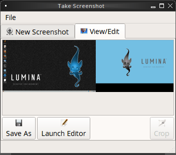

* **Image Preview:** Displays the captured screenshot. Right-clicking
  the image will provide options for zooming in or out. Clicking and
  dragging across the image will highlight an area which can be cropped
  by pressing the "Crop" button in the lower-right corner.
  
* **"Save As":** Button to open a window where you can specify the
  filename and location for saving the screenshot.

* **Launch Editor:** Button to launch a selectable image manipulation
  program.

Additionally, clicking :menuselection:`File --> Quick Save` will
automatically save the screenshot to the default "Pictures" directory
and open a window to select an image manipulation program.

.. index:: search
.. _Lumina Search:

Lumina Search
=============
  
Lumina Search provides options to find and launch applications or to
quickly search for files and directories. The "*" wildcard can be used
in the search terms and the search will include hidden files if the
search term starts with a dot (".").

To start this utility, type :command:`lumina-search`, press :kbd:`Alt + F2`,
or go to the start menu and press :menuselection:`Browse Applications --> Utility --> Lumina Search`.
:numref:`Figure %s: Search for Applications <lumina13b>` shows a
screenshot of this utility.

.. _lumina13b:

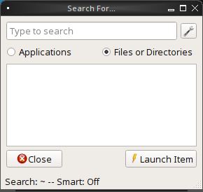

To open an application, begin to type its name into the search field
(selected by default). The box below the selected :guilabel:`Applications`
button will display any matching application names. Select the desired
application and click the "Launch Item" button to open it.

If you click :guilabel:`Files or Directories`, the screen changes
slightly, as seen in :numref:`Figure %s: Search for Files <lumina26>`.

.. _lumina26:

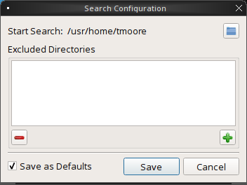

By default, a "Files or Directories" search is limited to the user's
home directory, as indicated by the "Search: ~" at the bottom of the
screen. The "Smart: Off" indicates every subdirectory is included
in the search, with no exlusions. Once subdirectories have been added to
the exclusion list, "Smart:" will switch to "On", and the excluded
subdirectories will be shown on the "Search:" section of the menu. To
add additional search directories or to exclude subdirectories, click
the wrench icon to see the screen shown in :numref:`Figure %s: Search Configuration <lumina14a>`.

.. _lumina14a:

.. figure:: images/lumina14a.png
   :scale: 100%

Click the blue folder icon to change the starting search directory. For
example, select "Computer", then "/" from the "Select Search
Directory" screen to search the entire contents of the computer. Click
the "+" button to add directories to an exclusion list for searching.
Delete an exclusion by highlighting its entry and clicking the "-"
button. The "Save as Defaults" option is selected by default. Uncheck
this option to return the all customized search settings back to their
default after closing the menu.

.. index:: textedit
.. _Lumina Text Editor:

Lumina Text Editor
==================

The :command:`lumina-textedit` utility is a plaintext editor with a
number of basic options. :numref:`Figure %s: Lumina Text Edit <lumina23>`
shows the editor with no file opened.

.. _lumina23:

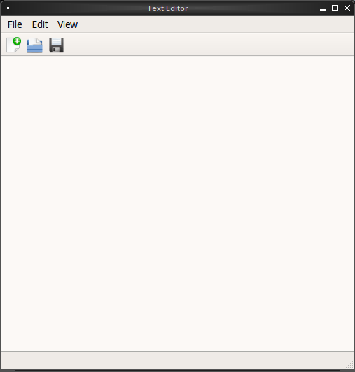

.. note:: Typing :command:`lte` in the command line will also open the
   Lumina Text Editor.

Clicking :guilabel:`File` will present options to create "New File",
"Open File", "Close File", "Save file", "Save File As", and "Close".
Click :guilabel:`Edit` to open options to "Find" and "Replace", also
usable with :kbd:`Ctrl-F` and :kbd:`Ctrl-R`, respectively. The "View"
tab can be used to alter "Syntax Highlighting", "Line Numbers", "Wrap
Lines", and "Customize Colors". By default, brackets are highlighted,
lines are numbered, and words will wrap dynamically with the edge of the
window. Additionally, selecting "Customize "Colors" gives the option to
alter all the default text and highlight colors, seen in :numref:`Figure %s: Customize Colors <lumina32>`.

.. _lumina32:

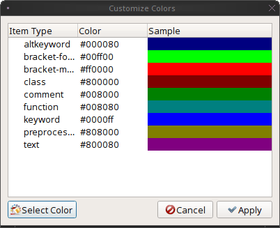

.. index:: Xconfig
.. _Lumina Xconfig:

Lumina Xconfig
==============

The :command:`lumina-xconfig` utility is a graphical front-end to the
:command:`xrandr` command line utility. It provides the ability to probe
and manage any number of attached monitors. To start this utility,
right-click the desktop and select :menuselection:`Preferences --> Display`
or type :command:`lumina-xconfig` from a terminal window. This will open
a screen similar to the one shown in :numref:`Figure %s: Configuring Monitors <lumina15a>`.

.. _lumina15a:

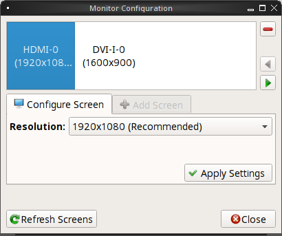

In this example, two display inputs are attached to the system and their
current screen resolutions are displayed. If the display input supports
multiple resolutions, they will appear in the "Resolution" drop-down
menu so that you can select a different resolution.

If you attach another display input, the "Add Screen" tab is activated
so that you can configure the new input's resolution and whether or not
it should be the default input.