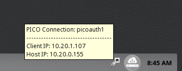
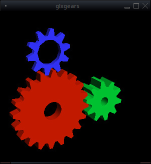

.. index:: pico
.. _trueos pico:

|trpi|
******

|trpi| is an initiative to connect multiple small ARM device thin
clients to a single |trueos| system. Similar to the |sysadm| project,
|trpi| utilizes two primary pieces of software: |pise| and |picl|.

The goal for the |trpi| is to provide a low-cost solution for users who
wish to have a central server provide resources to multiple low-cost,
low-power systems. In effect, |trpi| allows one system to
provide all the processing power and graphical "muscle" for as many
computers the user wishes to add on the network. For example, three or
four users can log into their thin clients and open utilities, browse
the Internet, or even play games while one central server dynamically
provides the needed resources for each of these tasks.

|pise| is available through :command:`pkg` and in |appcafe|. Configure
the server software before downloading the client software or
initializing the |picl|.

To download the |picl| software, visit the |trueos|
`download page <https://www.trueos.org/downloads>`_. A separate computer
is required to unpack and transfer the :file:`.img` file to a microSD
card for insertion into the thin client.

Currently, the |trpi| software is functional for |trueos| and the
Raspberry Pi 2 model B v1.1. The bulk of development efforts are being
directed toward ensuring graphics and sound functionality. Future
development goals include supporting a wider variety of ARM devices and
potential thin clients, and building cross-platform support for the
server software.

.. _picoinit:

|trpi| Initialization
=====================

To create a |trpi| network, several elements are required:

* A |trueos| system with both an internet and local network connection
  to download the necessary files and be used as the |pise|. For this
  system, it is recommended to use strong hardware to provide the
  smoothest experience for each connected client.

.. tip:: For best performance, it is recommended to have wired
   network connections from the |pise| to all connected clients.

* An ARM device to act as the thin client (as many as the user wants or
  the server can support). Currently, only the Raspberry Pi 2 model B
  v1.1 is supported, with up to five simultaneous connections on one
  |pise|.
* A microSD card for each thin client.

.. note:: Using a microSD card larger than 4 GB in size is largely
   unnecessary, as the server stores almost all created data.

* Adapter or connector for microSD cards to connect to the |pise|
  (Ex. a USB to microSD card reader).
  
Each thin client will need:

* HDMI monitor. Currently, 1920x1080 is the maximum supported
  resolution and the monitor should have integrated speakers for audio
  to function properly.
* Network cable.
* USB mouse.
* USB keyboard.
* Power adapter.

Once all these components are assembled, it's time to configure the
|pise|.

.. _picoserver:

|pise|
======

Installing and configuring the |pise| is done via the command prompt,
with superuser permissions (:command:`su` or
:command:`sudo <rest of command>`). Open a terminal and download the
|pise| package with :command:`sudo pkg install picoserver` (also
available in |appcafe|). Next, enable the |pise| using
:command:`sysrc -f /etc/rc.conf picoserver_enable=yes`. Finally, start
the |pise| with :command:`service picoserver start`.

.. note:: These commands will ensure the |pise| automatically starts
   and remains active when the system is booted. Type
   :command:`picoserver onestart` to run the server for the current
   session only.

Once the |pise| starts, a new :file:`picoserver.ini` file is created on
the system, found in :file:`/usr/local/etc`. This :file:`.ini` file
holds the initialization settings for the |pise| and has three sections,
seen in :numref:`Table %s <inisett>`:

.. _inisett:

.. table:: : Pico Server Configuration Settings

   +-------------------+----------------+------------------+
   | SSH               | Video          | Audio            |
   +===================+================+==================+
   | cipher            | enablevgl=true | enablesound=true |
   +-------------------+----------------+------------------+
   | compression=<1-9> |                |                  |
   +-------------------+----------------+------------------+

.. note:: The :ref:`Configuration Settings <inisett>` Table will expand
   as more options are developed and added to :file:`picoserver.ini`.

Set the *compression* setting to any number from 1 to 9. The default
setting is recommended as turning up the compression can introduce
performance issues on the |picl|.

Pico uses *Virtual GL* (vgl) for graphics hardware acceleration. VGL
works with any *OpenGL* supported graphics card, but Nvidia cards are
generally recommended at this time.

.. warning:: Turning on VGL may introduce security vulnerabilities on a
   network with untrusted clients.

If the server does not support video acceleration or to avoid any
potential security vulnerabilities on the Pico network, edit
:file:`picoserver.ini` and change :command:`enablevgl=` to **false**.

Currently, audio only functions over the HDMI connection port on the
Raspberry Pi, meaning audio will only work on monitors with built-in
audio capabilities. Change **true** to **false** to disable all audio.

Once satisfied with the settings in :file:`picoserver.ini`, new user
accounts/logins may need to be created for the client systems. See
:ref:`User Manager` for detailed instructions on creating new users on
a |trueos| system.

After any necessary accounts are created, the next step is to initialize
the client.

.. _startpicoclient:

Starting the |picl|
===================

The process of initializing a |picl| begins on a separate |trueos|
system. On this system, navigate to the |trueos| website's
`download page <https://www.trueos.org/downloads>`_ and download the
latest :file:`<pico>.img.xz` file. This file is compressed with **xz**;
decompress the file before burning it to a microSD card. Using the
command line, navigate to the file's location to use :command:`unxz` to
unpack the file:

.. code-block:: none

 [tmoore@Observer] ~% cd Downloads/
 [tmoore@Observer] ~/Downloads% unxz TrueOS-pico-rpi2-2016-10-29.img.xz

It may take a few moments for the system to decompress the file.

Once the file is decompressed to a :file:`.img` file, insert a microSD
card into the system. An adapter might be necessary if the system has no
microSD card slots. As the superuser, use the :command:`dd`
command line utility to write the :file:`.img` file to the card:

.. warning:: Be sure the :command:`dd if=` command points to the correct
   storage device. In the example below, the microSD card is connected
   to a USB adapter, identified as *da0* on the system.

.. code-block:: none

 [tmoore@Observer] ~/Downloads% dd if=TrueOS-pico-rpi2-2016-10-29.img of=/dev/da0 bs=4m
 512+0 records in
 512+0 records out
 2147483648 bytes transferred in 426.140554 secs (5039379 bytes/sec)

This command may take some time to process.

After the :file:`.img` file is written to the microSD card; connect the
|picl| to the |pise|:

* Insert the microSD card into the thin client.
* Attach the network cable. Be sure the client is wired into the same
  network as the |pise|.
* Plug in the USB Mouse and Keyboard.
* Attach the monitor's HDMI cable.
* Plug in the ARM device's power cable. This should always be the
  **last** step.

For the Raspberry Pi, inserting the power cable will generally turn on
the client device. The |picl| then searches for and connects to any
|pise| on the network, bringing the user to the |trueos| login screen.
The |picl| is now ready for use.

.. _usepicoclient:

Using the |picl|
================

There are a few differences in |trueos| when using a |picl|.

If the server uses the |lumina| Desktop Environment, hovering over the
:guilabel:`Network Status Icon` in the System Tray displays the client's
IP address, the server's IP address, and the client's unique
:command:`pico_auth` number, seen in :numref:`Image %s <piip>`. This is
intended to efficiently provide relevant network information for
simplified server administration.

.. _piip:

    : |picl| IP display

When logging out with the |picl|, several processes begin. The client
clears the session, then restarts the discovery and connection
processes. The server will destroy the previous user's :file:`temp`
file, along with the previously assigned **pico_auth #**. These
processes prepare the server for a new connection and user login from
the same |picl|.

.. _vglaccel:

VGL Graphics Acceleration
-------------------------

VirtualGL (VGL) is the toolkit used by the |trpi| to provide 3D hardware
acceleration to the |picl|. VGL redirects OpenGL commands and data to
the GPU in the |pise|, then pulls back the rendered 3D images to the
client. For further information about this open-source project, please
refer to the `VirtualGL website <virtualgl.org>`_

VirtualGL also has an extensive
`user guide <http://www.virtualgl.org/Documentation/Documentation>`_ to
help guide new users through the various features of this useful toolkit.

On a |picl|, test VGL functionality by opening the command line and
typing :command:`/usr/local/VirtualGL/bin/vglrun glxgears`. A window
will popup, displaying several moving gears, as seen in
:numref:`Image %s <vgltest>`. The terminal also displays the framerate
of the gears, and updates periodically.

.. _vgltest:

    : VirtualGL Gears Test

.. _pulseaud:

Pulse Audio
-----------

`Pulse Audio <https://www.freedesktop.org/wiki/Software/PulseAudio>`_
is the preferred audio solution for the |picl|. Pulse Audio allows a
|picl| play audio sent from the server. The Pulse Audio user
`documentation <https://www.freedesktop.org/wiki/Software/PulseAudio/Documentation/User/>`_
provides a wealth of information on configuring Pulse Audio, including
streaming audio over the network. Advanced controls for Pulse Audio are
available in |appcafe| with the :command:`pavucontrol` multimedia
application.
   
.. _Pico Server Administration:

|pise| Administration
=====================

Once the |pise| and thin clients are installed and ready to use, there
are a number of administrative commands available, seen in
:numref:`Table %s <picoadmin>`. Any new commands will be added to this
table:

.. _picoadmin:

.. Table:: : |pise| Administration Commands

   +---------------------+-------------------------------------------+
   | Command             | Description                               |
   +=====================+===========================================+
   | pico-server         | Primary Pico command. All commands begin  |
   |                     | with :command:`pico-server` and a space.  |
   +---------------------+-------------------------------------------+
   | -list               | Displays all connected clients, as either |
   |                     | "pico_auth <#>" or the specific logins    |
   |                     | ("testuser_pico")                         |
   +---------------------+-------------------------------------------+
   | -kill pico_auth <#> | Immediately reboots the specified client. |
   +---------------------+-------------------------------------------+

.. _Pico Current Issues:

|trpi| Current Issues
=====================

This section lists the currently known bugs with |trpi| use:

* **Audio:** Pulse Audio has an intermittent issue with freezing upon
  *client* initialization. A workaround has been implemented, but please
  refer to :ref:`Report a bug` if any additional audio issues are
  encountered.