.. index:: configuration
.. _Post Installation Configuration and Installation Troubleshooting:

Post Installation Configuration and Installation Troubleshooting
****************************************************************

Once the |trueos| system has finished booting for the first time, the
installer will present some additional screens to configure the system.
This section describes the boot process, the post-installation
configuration screens, and provides troubleshooting tips for failed
installations.

.. index:: boot
.. _Booting Into TrueOS®:

Booting Into |trueos|
=====================

After installation, |trueos| will reboot and display a boot menu. The
menu displayed depends upon the boot loader selection chosen during the
installation.

.. _BSD Boot Loader:

BSD Boot Loader
---------------

A system with a default install or the "BSD" option for the boot loader,
will load the boot menu, seen in :numref:`Figure %s <install1(2)>`.

.. _install1(2):

.. figure:: images/install1b.png
   :scale: 100%

   : |trueos| Boot Menu

This menu provides several options. To pause this menu, press
any key except for :kbd:`Enter`. To select an option, press either the
bolded number or key for that option. Once any selections have been
made, press :kbd:`Enter` to boot using the selected options.

* **1. Boot Multi User:** This is the default option for booting
  |trueos|. The system automatically uses this option either after
  pausing for a few moments or if :kbd:`Enter` is pressed while the
  boot menu is displayed.

* **2. Boot Single User:** Advanced users can select this option to
  fix critical system failures.

* **3. Escape to loader prompt:** Advanced users can select this option
  to perform advanced operations, such as loading kernel modules.

* **4. Reboot:** Reboots the system.

* **5. Kernel:** This option indicates how many kernels are available.
  Press either :kbd:`5` or :kbd:`k` to toggle between available kernels.
  This option is available to the user if they have created a custom
  kernel, but wish to have a :file:`kernel.old` boot option available in
  case the custom primary kernel fails.

* **6. Configure Boot Options:** Press either :kbd:`6` or :kbd:`o` to
  see the boot options screen, shown in :numref:`Figure %s <boot1>`.
  To change an option, press either the bolded number or key for the
  option to toggle through its available settings. When finished, press
  either :kbd:`1` or :kbd:`Backspace` to return to the |trueos| boot
  menu.

* **7. Select Boot Environment:** In |trueos|, boot environments are
  automatically created when the system updates and can also be
  manually created using the :ref:`Boot Environment Manager`. This
  allows the system to boot to the point of time before an update
  occurred and can be used to recover from a failed update. Press
  either :kbd:`7` or :kbd:`e` to view the available boot environments.

.. tip:: The first time the system boots, no additional boot
   environments are available. Over time, this menu will populate as
   boot environments are created.

.. _boot1:

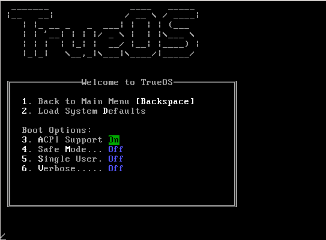

   : Boot Options Menu

Several boot options are available in the Boot Options Menu:

* **3. ACPI Support:** Toggles  power  management support. This may be
  useful for some BIOS's and laptops.

* **4. Safe Mode:** Select this option if the installation hangs when
  probing hardware and :guilabel:`3 ACPI Support` did not help. It will
  boot with a forced PIO mode (disabling the use of DMA), disable write
  caching for all IDE hard drives and CD-ROM drives, and disable the
  probing of EISA slots (as very few systems have them).

* **5. Single User:** Advanced users can select this option to fix
  critical system failures.

* **6. Verbose:** Select this option to see more detailed messages
  during the boot process. This can be useful when troubleshooting a
  piece of hardware.

.. _GRUB Boot Loader:

GRUB Boot Loader
----------------

If the installation was customized with the :guilabel:`GRUB` option for
the boot loader, it will instead load the menu shown in
:numref:`Figure %s <boot2>`.

.. _boot2:

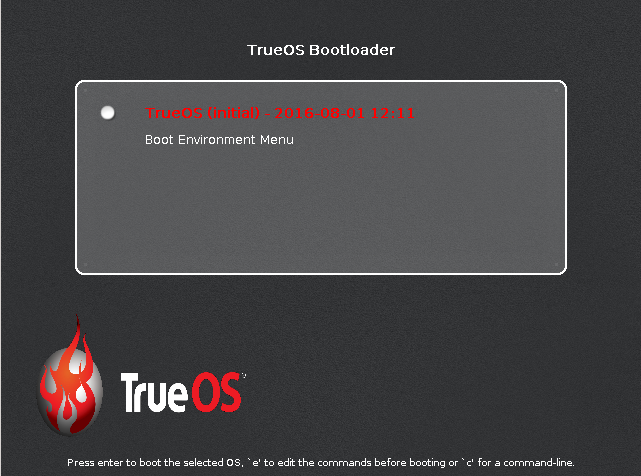

   : GRUB Boot Menu

This boot menu is used to display the entry for |trueos|, an entry for
the screen which lists the available boot environments (these are
automatically created when the system updates and can also be manually
created using :ref:`Boot Environment Manager`), and any other operating
systems installed on the system.

By default, this menu displays for a few seconds before continuing to
boot into |trueos|. To pause this screen to review its items, press any
key (other than :kbd:`Enter`). To boot into a different operating
system or boot environment, use the :kbd:`up` and :kbd:`down`
arrows to select the desired entry then press :kbd:`Enter`.

Press :kbd:`Enter` when the :guilabel:`TrueOS` entry is highlighted to
see the |trueos| boot options screen, shown in
:numref:`Figure %s <boot3>`.

.. _boot3:

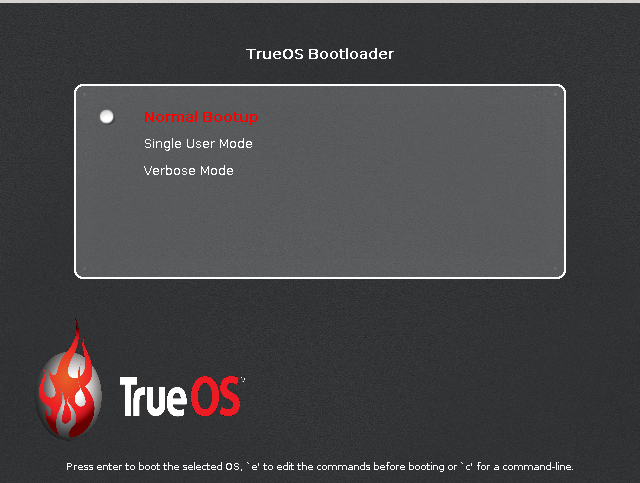

   : |trueos| Graphical Boot Menu Options

Several boot options are available:

* **Normal Bootup:** Continues to boot |trueos|.

* **Single User Mode:** Advanced users can select this option to fix
  critical system failures.

* **Verbose Mode:** Select this option to see more detailed messages
  during the boot process. This can be useful when troubleshooting a
  piece of hardware.

Use the arrow keys to select an option, then press :kbd:`Enter` to boot
using the highlighted option.

This menu is provided by GRUB. Press :kbd:`e` to access the GRUB editor
or :kbd:`c` to access the GRUB command line. Familiarity with GRUB is
recommended.

.. index:: encryption
.. _Encrypted Disks:

Encrypted Disks
---------------

If :guilabel:`Encrypt disk with GELI` was selected during installation,
physical access to the |trueos| system when it boots is required. As the
system starts to boot, it will display a message similar to the one
shown in :numref:`Figure %s <encrypt1>`.

.. _encrypt1:

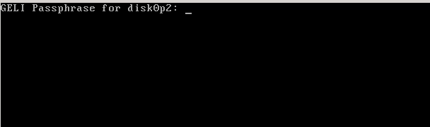

   : Master Key Decryption

The boot process will wait for the password created in the installation
screen shown in :ref:`Configure Encryption <install11>`. If the
correct password is typed, the system will calculate the GELI encryption
key, then continue to boot.

.. index:: video
.. _Display Detection:

Display Detection
-----------------

The first time the boot completes, the post-installer configuration
script will attempt to set the optimal display settings. A pop-up menu
will either ask to accept the settings or indicate it could not find the
optimal settings. Click :guilabel:`Yes` to accept the settings and
|trueos| will proceed to the :ref:`Language Screen` so the system's
initial configuration can continue.

If the optimal display settings could not be determined, or if
:guilabel:`No` is selected in the :guilabel:`Confirm Resolution` screen,
the :guilabel:`Display Settings` screen shown in
:numref:`Figure %s <display3>` will launch.

.. _display3:

.. figure:: images/display3.png

   : Display Settings Wizard

This screen can be used to select the desired screen resolution, color
depth, and video driver. The :guilabel:`vesa` driver will always work
but will provide sub-optimal performance. Click on the drop-down menu to
select the driver that most closely matches your video card name.

The drop-down menus can also be used to change the screen resolution
and color depth values. If the desired value is not listed, the selected
driver may not support that resolution or depth.

Advanced users can select their monitor's horizontal sync and vertical
refresh rate in the :guilabel:`Advanced` tab, seen in
:numref:`Figure %s <display4>`.

.. _display4:

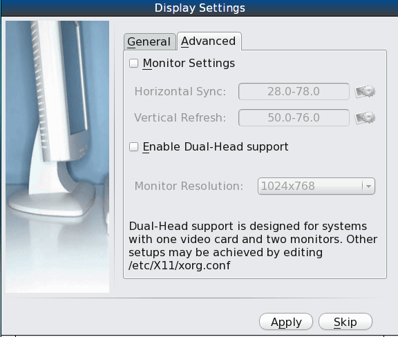

   : Advanced Display Settings

Use caution and refer to the connected monitor's documentation while
making changes. If unsure what settings are required, it is recommended
to leave the default values.

If the computer is connected to two monitors, check
:guilabel:`Enable Dual-Head support`.

When finished, click :guilabel:`Apply` for the settings to be tested. If
anything goes wrong during testing, the system will return to the
:guilabel:`Display Settings` screen in order for the user to select
another setting. Once satisfied with the settings, click :guilabel:`Yes`
when prompted to accept them.

.. index:: troubleshooting
.. _Display Troubleshooting:

Display Troubleshooting
^^^^^^^^^^^^^^^^^^^^^^^

If problems exist with the display settings and manually editing
:file:`/etc/X11/xorg.conf` or running :command:`Xorg --config` is
necessary, first tell the |trueos| system to not automatically start X.
To do this, add :command:`pcdm_enable="NO"` temporarily to
:file:`/etc/rc.conf`, then reboot the system.

The system will reboot to a login prompt. After logging in, follow the
instructions in the
`FreeBSD Handbook <http://www.freebsd.org/doc/en_US.ISO8859-1/books/handbook/x-config.html>`_
to manually configure and test Xorg. Once a working configuration is
found, save it to :file:`/etc/X11/xorg.conf`. Then, remove the
temporary line shown above from :file:`/etc/rc.conf` and start PCDM with
:command:`service pcdm start`.

If the graphics white-out after a suspend or resume, run
:command:`sysctl hw.acpi.reset_video=1` as the superuser.

If the problem is fixed, carefully add :command:`hw.acpi.reset_video=1`
to :file:`/etc/sysctl.conf`.

If the monitor goes blank and does not come back, run
:command:`xset -dpms` as the regular user account.

If the problem is fixed, add :command:`xset -dpms` to the
:file:`.xprofile` file in the user's home directory.

If any display settings change, click :guilabel:`Apply` for the settings
to be tested. If anything goes wrong during testing, the system will
return to the :guilabel:`Display Settings` screen for the user to try
another setting. Once satisfied with the tested setting, click
:guilabel:`"Yes` to save the setting and proceed. Alternately, click
:guilabel:`Skip` to configure the display settings later.

.. index:: language
.. _Language Screen:

Language Screen
===============

The language selection screen is seen in :numref:`Figure %s <config1>`.

.. _config1:

.. figure:: images/config1a.png
   :scale: 100%

   : Language Selection

This allows for the selection of the language used to access the
installed system. It also contains three icons from the installer
screens to enable:

* Reading the screen's *Help* text.

* Using the onscreen keyboard.

* Switching between the US keyboard layout and a user selected layout.

Once the selection is made, click :guilabel:`Next` to move to the next
configuration screen.

.. index:: time
.. _Time Zone Selection Screen:

Time Zone Selection Screen
==========================

The next configuration screen, shown in :numref:`Figure %s <config2>`,
allows selection of the timezone.

.. _config2:

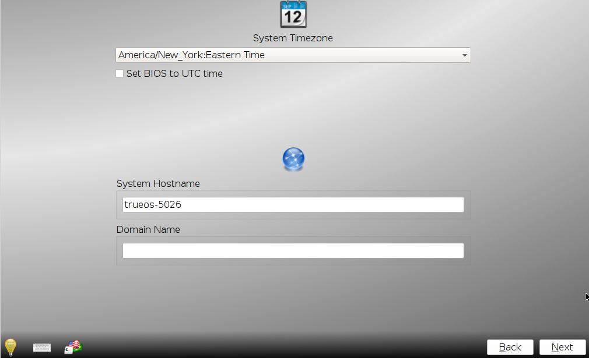

   : Time Zone Selection

Use the drop-down menu to select the city closest to the system's
location. If the system is connected to the Internet, the installer
automatically attempts to detect the correct timezone.

If the system is dual booting and the other operating system expects
the BIOS to use UTC, also check :guilabel:`Set BIOS to UTC time`.

A default system hostname will be created. To change the name, type the
desired hostname in the :guilabel:`System Hostname` field. If the
computer is a member of a DNS domain, the *Domain Name* is also an
option.

When finished, click :guilabel:`Next` to proceed to the next screen.

.. index:: password
.. _Set Root Password Screen:

Set Root Password Screen
========================

This configuration screen, seen in :numref:`Figure %s <config3>`,
requires the root (administrative) password to be set.

.. _config3:

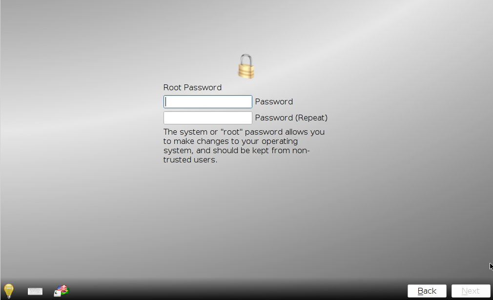

   : Root Password Creation

The password must be a minimum of **4** characters and must be typed
twice to confirm the password. Click :guilabel:`Next` when finished.

.. index:: users
.. _Create a User Screen:

Create a User Screen
====================

This screen is used to create the primary user account used to login to
the system. Create a strong password as the password is used whenever
the system indicates administrative access is required.

:numref:`Figure %s <config4>` shows the configuration screen used to
create the initial user account.

.. _config4:

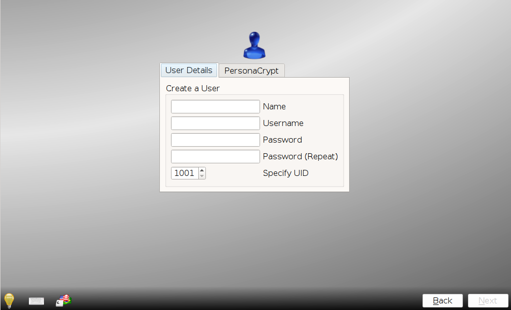

   : User Creation

The :guilabel:`User Details` tab is used to create a login user. This
screen requires completing several fields:

* **Name:** This value displays in the login screen. It can be the
  user's full name and can contain both capital letters and spaces.

* **Username:** This is the name used when logging in. It can **not**
  contain spaces and **is** case sensitive (e.g. *Kris* is a different
  username from *kris*).

* **Password:** This is the password to use when logging in. It must
  be typed twice to confirm it.

* **Specify UID:** By default, the user will be assigned the next
  available User ID (UID). If a specific UID is required, it can be set
  here.

.. note:: A UID can not be set lower than 1001, and a UID already in use
   by another account will also be unavailable.

|trueos| provides the ability to use a removable device, such as a USB
stick, as the user's encrypted home directory. This is useful in a
multi-user or multi-computer environment, as it provides the user with
secure access to their encrypted files.  When a user is configured to
use :ref:`PersonaCrypt`, their username will only appear in the login
menu if the removable media associated with that |trueos| system is
inserted. They must input the password associated with the removable
device in order to login.

.. note:: When a user is configured to use a PersonaCrypt device, that
   user can not login using an unencrypted session on the same system.
   In other words, the PersonaCrypt username is reserved for
   PersonaCrypt use. If necessary to login to both encrypted and
   unencrypted sessions on the same system, create two different user
   accounts; one for each type of session.

Encryption is also possible without requiring removable devices using
*PEFS*. Refer to the section on :ref:`PEFS Encryption` for more detailed
instructions to initialize a user with *PEFS*.

The :guilabel:`PersonaCrypt` tab, shown in
:numref:`Figure %s <persona1>`, is used to initialize PersonaCrypt for
the user.

.. _persona1:

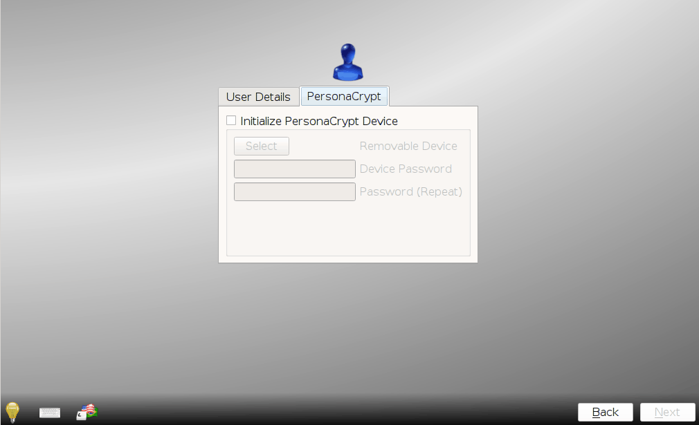

   : User's PersonaCrypt Initialization

Check :guilabel:`Initialize PersonaCrypt Device`, insert a removable
media large enough to hold the files to store in the home directory,
and click :guilabel:`Select`.

.. warning:: Ensure there are no desired files on the removable media.
   Initializing the media for PersonaCrypt will format the device with
   ZFS and encrypt it with GELI, deleting any existing data.

Input and repeat the :guilabel:`Device Password` to associate with the
device. A pop-up window indicates the current contents of the device
will be wiped. Click :guilabel:`Yes` to initialize the device.

To share the computer with other users, create additional login and
:ref:`PersonaCrypt` accounts using :ref:`User Manager`. After creating
at least one user, click :guilabel:`Next` to continue to the next
screen.

.. index:: sound
.. _Configure Audio Output:

Configure Audio Output
======================

The next screen, seen in
:numref:`Figure %s <audio1>`, is used to
configure the default audio output.

.. _audio1:

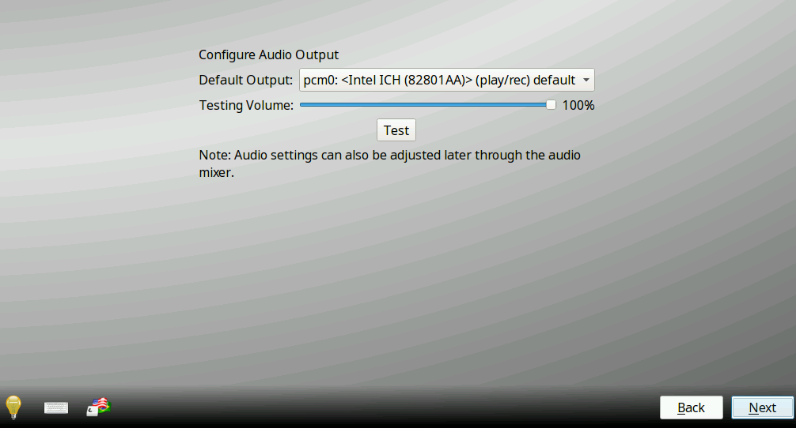

   : Configure Audio Output

Click the :guilabel:`Output Device` drop-down menu to select the
desired sound device. Click :guilabel:`Test` to verify the setting as a
working configuration will result in a test sound. The
:guilabel:`Testing Volume` slider can also be used to set the default
volume level.

All these settings can be viewed and edited at any time using the
instructions in :ref:`Sound Mixer Tray`.

.. index:: wireless
.. _Connect to a Wireless Network:

Connect to a Wireless Network
=============================

.. note:: Be sure the network card is supported by FreeBSD. Refer to
   :ref:`Supported Hardware` for links to FreeBSD support and a list of
   known issues with different hardware.

If the system has an active wireless interface, a screen similar to
:numref:`Figure %s <config5>` will indicate the wireless networks
automatically detected. Available networks will be ordered by signal
strength.

.. _config5:

.. figure:: images/config5.png
   :scale: 100%

   : Wireless Network Connections

To set the default wireless connection, click the desired network in the
:guilabel:`Available Wireless Networks` area, then click
:guilabel:`Add Selected`. If the network requires a password, a window
will appear requesting the password and indicate the security type used
by the desired network. If the desired network is not visible in the
:guilabel:`Available Wireless Networks` area, click :guilabel:`Scan`. If
unable to connect or to configure the connection later, refer to
:ref:`Network Manager` for more detailed instructions.

.. index:: SSH, IPv6
.. _Enable Optional Services:

Enable Optional Services
========================

:numref:`Figure %s <config6>` shows the next screen in the process.

.. _config6:

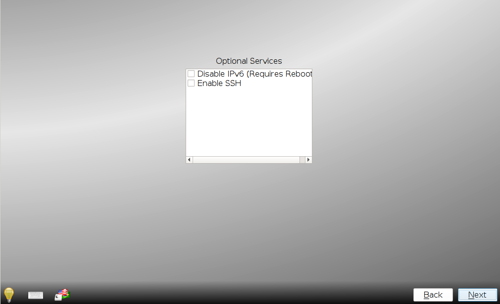

   : Optional Services

Check :guilabel:`Disable IPV6 (Requires Reboot)` and the system will be
configured to only support IPv4 addresses. The default is to support
both IPv4 and IPv6 and prefer IPv6 over IPv4. 

.. tip:: Altering this setting will not take affect until the next
   system reboot.

If :guilabel:`Enable SSH` is checked, the SSH service will start and be
configured to start whenever the system boots. It also creates the
firewall rules needed to allow incoming SSH connections to the |trueos|
system.

.. danger:: **Do not** check this box if SSH connections to the system
   are undesired.

When finished, click :guilabel:`Next`. The screen in
:numref:`Figure %s <config7>` indicates the post-installation setup is
complete. Click :guilabel:`Finish` to access the login menu.

.. _config7:

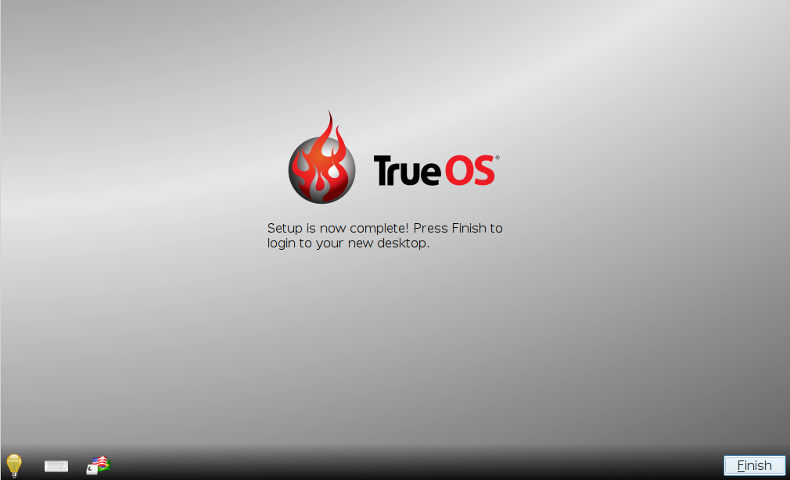

   : Setup Complete

.. index:: login
.. _Logging In:

Logging In
==========

Once finished setting up the system, the PCDM (|pcbsd| Display Manager)
graphical login screen will display. An example is seen in
:numref:`Figure %s <login1>`.

.. _login1:

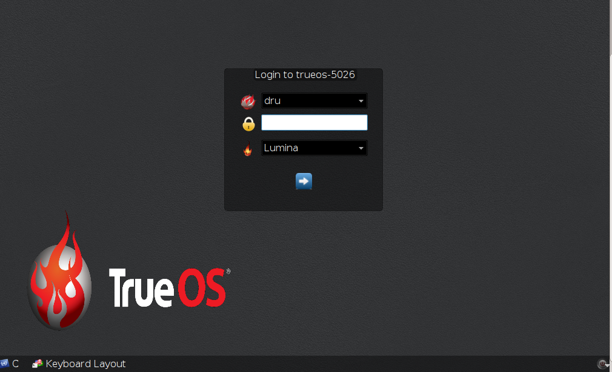

   : |trueos| Login

The hostname of the system will be displayed at the top of the login
window. In this example, it is *trueos-5320*. This login screen lets
has several configuration options:

* **user:** Upon first login, the created **username** (from
  :ref:`Create a User Screen`) is the only available login user. If
  additional users are created using :ref:`User Manager`, they will
  be added to the drop-down menu for more login choices. PCDM will not
  allow logging in as the *root* user. Instead, whenever a utility
  requires administrative access, |trueos| will first ask for the
  password of the login account.

* **password:** Input the password associated with the selected user.

* **desktop:** If any additional desktops are installed using
  :ref:`AppCafe®`, use the drop-down menu to select the desktop to log
  into.

.. note:: If a PersonaCrypt user is active, insert the PersonaCrypt
   device in order to login. As seen in :numref:`Figure %s <login5>`,
   this will add an extra field to the login screen so the password
   associated with the PersonaCrypt device can be typed.

.. _login5:

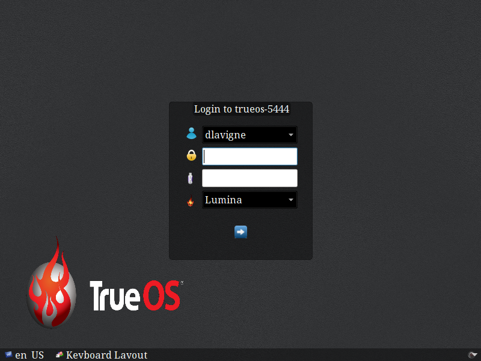

   : |trueos| PersonaCrypt Login

The toolbar at the bottom of the screen allows several options to be
selected on a per-login basis:

* **Locale:** If the localization was not set during installation, or
  needs to be changed, click this icon to set the locale for this login
  session.

* **Keyboard Layout:** Click this icon to change the keyboard layout
  for this login session. This will open the window seen in
  :numref:`Figure %s <keyboard1>`.

.. _keyboard1:

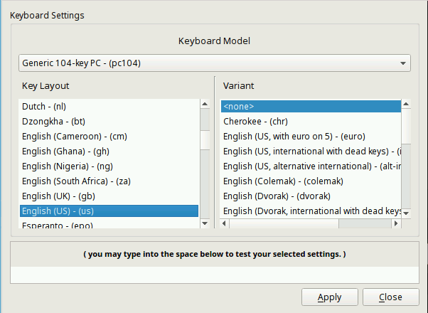

   : Keyboard Settings

Click the :guilabel:`Keyboard model` drop-down menu to select the type
of keyboard.

.. note:: The default model of :guilabel:`Generic 104-key PC` does
   **not** support special keys such as multimedia or Windows keys. This
   default will need to change to enable support for hot keys.

This screen also allows selection of the :guilabel:`Key Layout` and
:guilabel:`Variant`. After making any selections, test them by typing
some text into the :guilabel:`you may type into the space below...`
field.

* **Restart/Shut Down:** To restart or shutdown the system without
  logging in, click the icon in the lower-right corner. This icon also
  allows to :guilabel:`Change DPI` and to :guilabel:`Refresh PCDM`.

Once any selections are made, input the password associated with the
selected user and press :kbd:`Enter` or click the :guilabel:`blue arrow`
to login.

.. tip:: It is possible to change keyboard layouts during an active
   desktop session using the included :guilabel:`fcitx` utility

.. index:: troubleshooting
.. _Installation Troubleshooting:

Installation Troubleshooting
============================

Installing |trueos| is usually very simple. However, sometimes problems
occur. This section examines solutions to the most common installation
problems.

The |trueos| installer creates a log which keeps a record of all the
completed steps, as well as any errors. When an installation error
occurs, the |trueos| installer asks to generate an error report. If
:guilabel:`Yes` is chosen, a pop-up message asks to save the error log
to a USB stick. Type :kbd:`y` and insert a FAT formatted USB thumb drive
to copy the log.

While in the installer, read this log to see what went wrong. Click the
black :guilabel:`Emergency Shell and Utilities` icon, then select
:guilabel:`shell` from the :guilabel:`|trueos| Utility Menu`. Read the
log by typing :command:`more /tmp/.SysInstall.log`.

If the error can not be fixed or believe an installation bug exists,
send the log saved on the USB stick using the instructions in
:ref:`Report a Bug`.

If the installer does not arrive at the initial GUI installer screen,
try unplugging as many devices as possible, such as webcams, scanners,
printers, USB mice and keyboards. If this solves the problem, plug in
one piece of hardware at a time, then reboot. This will help pinpoint
which device is causing the problem.

If the computer freezes while probing hardware and unplugging extra
devices does not fix the problem, it is possible that the installation
media is corrupt. If the :ref:`Data Integrity check` on the downloaded
file is correct, try burning the file again at a lower speed.

If the system freezes and the video card is suspected to be the cause,
review the system's BIOS settings. If there is a setting for video
memory, set it to its highest value. Also check to see if the BIOS is
set to prefer built-in graphics or a non-existent graphics card. On some
systems this is determined by the order of the devices listed; in this
case, be sure the preferred device is listed first. If the BIOS settings
are invisible, move a jumper or remove a battery to make it revert to
the default built-in graphics; check the manual or contact the card
manufacturer for details.

A common cause for problems is the *LBA* (Logical Block Addressing)
setting in the BIOS. If the PC is not booting before or after
installation, check the BIOS and turn *LBA* off (do not leave it on
automatic).

If the SATA settings in the BIOS are set to *compatibility* mode, try
changing this setting to *AHCI*. If the system hangs with a BTX error,
try turning off *AHCI* in the BIOS.

If the USB keyboard is non-functional, check if there is an option in
the BIOS for *legacy support* in relation to the keyboard, USB,
or both. Enabling this feature in the BIOS may solve this issue.

If the installer boots and a *mountroot>* command prompt appears, this
may be due to a change in the location of the boot device. This can
occur when the enumeration of a card reader changes. The solution is
to enter :command:`ufs:/dev/da1` at the prompt. Depending on the exact
location of the boot media, it may be different from :file:`da1`. Type
:kbd:`?` at the prompt to display the available devices.

If none of the above has fixed the problem, search the
`TrueOS® sub-Reddit <https://www.reddit.com/r/TrueOS/>`_ or ask a
question on the
`TrueOS Gitter Channel <https://gitter.im/trueos/Lobby>`_. For
additional communications options, check the section on
:ref:`Finding Help`.