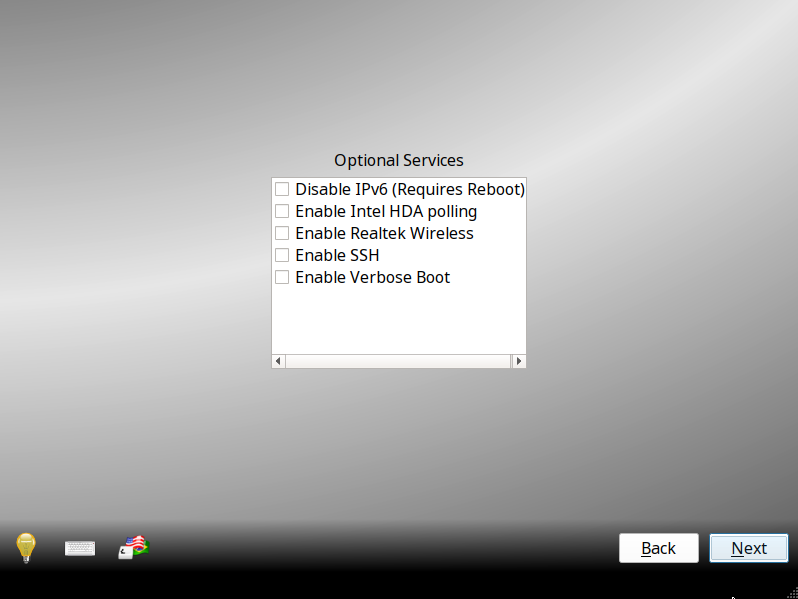

.. index:: postinstall configuration
.. _Post Installation Configuration:

Post Installation Configuration
*******************************

After the |trueos| system has finished booting for the first time,
|trueos| presents additional screens to assist in configuring the
system.

.. index:: booting into TrueOS
.. _Booting Into TrueOS:

Booting Into |trueos|
=====================

After installation, |trueos| reboots and displays a boot menu. The menu
displayed depends upon the boot loader selection chosen during the
installation.

.. index:: bsd boot loader
.. _BSD Boot Loader:

BSD Boot Loader
---------------

A system with a default or "BSD" install option for the boot loader
loads the boot menu seen in :numref:`Figure %s <install1(2)>`.

.. _install1(2):

.. figure:: images/install1c.png
   :scale: 100%

   |trueos| Boot Menu

This menu provides several options. Pause this menu by pressing any key
except for :kbd:`Enter`. To select an option, press either the bolded
number or key for that option. Once any selections are made, press
:kbd:`Enter` to boot using the specified options.

* :guilabel:`1. Boot TrueOS [Enter]`: This is the default option for
  booting |trueos|. The system automatically uses this option either
  after pausing for a moment or if :kbd:`Enter` is pressed while the
  boot menu is displayed.

* :guilabel:`2. Configure Boot Options`: Press either :kbd:`2` or
  :kbd:`o` to see the boot options screen, shown in
  :numref:`Figure %s <boot1>`. To change an option, press either the
  bolded number or key for the option to toggle through its available
  settings. When finished, press either :kbd:`1` or :kbd:`Backspace` to
  return to the |trueos| boot menu.

* :guilabel:`3. Select Boot Environment`: In |trueos|, boot environments
  are automatically created when the system updates. They can also be
  manually created using the
  `Boot Environment Manager <https://sysadm.us/handbook/client/sysadmclient.html#boot-environment-manager>`_.
  This allows the system to boot to the point of time before an update
  occurred and can be used to recover from a failed update. Press either
  :kbd:`3` or :kbd:`e` to view the available boot environments.

.. tip:: The first time the system boots, no additional environments are
   available. This menu populates as boot environments are created.

.. _boot1:

.. figure:: images/boot1c.png
   :scale: 100%

   Boot Options Menu

Several boot options are available in the Boot Options Menu:

* :guilabel:`3. Boot Single User`: Advanced users can select this option
  to fix critical system failures.

* :guilabel:`4. Verbose`: Select this option to see more detailed
  messages during the boot process. This can be useful when
  troubleshooting a piece of hardware.

* :guilabel:`5. Kernel`: This option indicates how many kernels are
  available. Press either :kbd:`5` or :kbd:`k` to toggle between
  available kernels. This option is available to the user if they have
  created a custom kernel, but wish to have a :file:`kernel.old` boot
  option available in case the custom primary kernel fails.

* :guilabel:`6. Escape to loader prompt`: Advanced users can select this
  option to perform advanced operations, such as loading kernel modules.

.. index:: encrypted disks
.. _Encrypted Disks:

Encrypted Disks
---------------

If :guilabel:`Encrypt disk with GELI` was selected during installation,
physical access to the |trueos| system when it boots is required. As the
system starts to boot, it displays a message similar to the one shown in
:numref:`Figure %s <encrypt1>`.

.. _encrypt1:

.. figure:: images/encrypt1.png
   :scale: 100%

   Master Key Decryption

The boot process will wait for the password created in the installation
screen shown in :ref:`Configure Encryption <install11>`. If the correct
password is typed, the system calculates the GELI encryption key then
continues to boot.

.. index:: display detection
.. _Display Detection:

Display Detection
-----------------

.. TODO this section needs a complete rework (text and screenshots) once
 next STABLE update is is released (sometime after 5/18).

The first time the boot completes, the post-installer configuration
script attempts to set the optimal display settings. A pop-up menu
either asks to accept the settings or indicates the system could not
find the optimal settings. Click :guilabel:`Yes` to accept the settings
and |trueos| proceeds to the :ref:`Choose a Language` screen so the
initial configuration can continue.

If the optimal display settings could not be determined, or if
:guilabel:`No` is selected in the :guilabel:`Confirm Resolution` screen,
the :guilabel:`Display Settings` screen shown in
:numref:`Figure %s <display3>` launches.

.. _display3:

.. figure:: images/display3.png
   :scale: 100%

   Display Settings Wizard

This screen can be used to select the desired screen resolution, color
depth, and video driver. The :guilabel:`vesa` driver always works but
provides sub-optimal performance. Click on the drop-down menu to select
the driver most closely matching your video card name.

The drop-down menus can also be used to change the screen resolution and
color depth values. If the desired value is not listed, the selected
driver may not support that resolution or depth.

Advanced users can select their monitor's horizontal sync and vertical
refresh rate in the :guilabel:`Advanced` tab, seen in
:numref:`Figure %s <display4>`.

.. _display4:

.. figure:: images/display4.png
   :scale: 100%

   Advanced Display Settings

Use caution and refer to the connected monitor's documentation while
making changes. If unsure what settings are required, it is recommended
to leave the default values.

If the computer is connected to two monitors, check
:guilabel:`Enable Dual-Head support`.

When finished, click :guilabel:`Apply` for the settings to be tested. If
anything goes wrong during testing, the system returns to the
:guilabel:`Display Settings` screen in order for the user to select
another setting. Once satisfied with the settings, click :guilabel:`Yes`
when prompted to accept them.

.. index:: choose language
.. _Choose a Language:

Choose a Language
=================

:numref:`Figure %s <config1>` shows the language selection screen.

.. _config1:

.. figure:: images/config1a.png
   :scale: 100%

   Language Selection

This allows for the selection of the language used to access the
installed system. It also contains three icons from the installer
screens to enable:

* **Light Bulb**: Reading the screen's *Help* text.

* **Keyboard**: Use the onscreen keyboard.

* **Key with US and Brazilian Flag**: Choose a different keyboard layout
  other than the default US style.

Once the selection is made, click :guilabel:`Next` to move to the next
configuration screen.

.. index:: time zone select
.. _Time Zone Selection:

Time Zone Selection
===================

The next configuration screen, shown in :numref:`Figure %s <config2>`,
allows selection of the timezone and configuring the system's host and
domain names.

.. _config2:

.. figure:: images/config2b.png
   :scale: 100%

   Time Zone Selection

Use the drop-down menu to select the city closest to the system's
location. If the system is connected to the Internet, the installer
automatically attempts to detect the correct timezone.

If the system is dual booting and the other operating system expects the
BIOS to use UTC, also check :guilabel:`Set BIOS to UTC time`.

A default system hostname is created. Change the name by typing the
desired hostname in the :guilabel:`System Hostname` field. If the
computer is a member of a DNS domain, the :guilabel:`Domain Name` is
also an option.

When finished, click :guilabel:`Next` to proceed to the next screen.

.. index:: setting a root password
.. _Set the Root Password:

Set the Root Password
=====================

This configuration screen, seen in :numref:`Figure %s <config3>`,
**requires** the root (administrative) password to be set.

.. _config3:

.. figure:: images/config3a.png
   :scale: 100%

   Root Password Creation

The password must be a minimum of **4** characters and must be typed
twice to confirm the password. Click :guilabel:`Next` when finished.

.. index:: create a user
.. _Create a User:

Create a User
=============

This screen is used to create the primary user account used to login to
the system. Try to create a complex and memorable password, as this one
is used whenever the system indicates administrative access is required.

:numref:`Figure %s <config4>` shows the configuration screen used to
create the initial user account.

.. _config4:

.. figure:: images/config4a.png
   :scale: 100%

   User Creation

The :guilabel:`User Details` tab is used to create a login user. This
screen requires completing several fields:

* **Name:** This value displays in the login screen. It can be the
  user's full name and can contain both capital letters and spaces.

* **Username:** This is the name used when logging in. It can **not**
  contain spaces and **is** case sensitive (e.g. *Kris* is a different
  username from *kris*).

* **Password:** This is the password to use when logging in. It must
  be typed twice to confirm it.

* **Specify UID:** By default, the user is assigned the next available
  User ID (UID). If a specific UID is required, it can be set here. A
  UID can not be set lower than 1001, and a UID already in use by
  another account is also unavailable.

|trueos| provides the ability to use a removable device, such as a USB
stick, as the user's encrypted home directory. This is useful in a
multi-user or multi-computer environment, as it provides the user with
secure access to their encrypted files.  When a user initializes
`PersonaCrypt <https://sysadm.us/handbook/client/sysadmclient.html#personacrypt>`_
with their account, their username only appears in the login menu if the
removable media associated with that |trueos| system is inserted. They
must input the password associated with the removable device in order to
login.

.. note:: When a user is configured to use a PersonaCrypt device, that
   user cannot log in using an unencrypted session on the same system.
   In other words, the PersonaCrypt username is reserved only for
   PersonaCrypt use. If necessary to login to both encrypted and
   unencrypted sessions on the same system, create two different user
   accounts; one for each type of session.

Encryption is also possible without requiring removable devices using
*PEFS*. Refer to the |sysadm| section on
`PEFS Encryption <https://sysadm.us/handbook/client/sysadmclient.html#pefs>`_
for more detailed instructions to initialize a user with *PEFS*.

:numref:`Figure %s <persona1>` shows the :guilabel:`PersonaCrypt` tab.
This tab is used to initialize PersonaCrypt for the user.

.. _persona1:

.. figure:: images/persona1a.png
   :scale: 100%

   User's PersonaCrypt Initialization

Check :guilabel:`Initialize PersonaCrypt Device`, insert a removable
media large enough to hold all necessary files to store in the home
directory, then click :guilabel:`Select`.

.. warning:: Ensure there are no desired files on the removable media.
   Initializing the media for PersonaCrypt formats the device with ZFS
   and then encrypts it with GELI, deleting any existing data.

Input and repeat the :guilabel:`Device Password` to associate with the
device. A pop-up window indicates the current contents of the device
will be wiped. Click :guilabel:`Yes` to initialize the device.

To share the computer with other users, create additional login and
*PersonaCrypt* accounts using the |sysadm|
`User Manager <https://sysadm.us/handbook/client/sysadmclient.html#user-manager>`_.
After creating at least one user, click :guilabel:`Next` to continue.

.. index:: configure audio output
.. _Configure Audio Output:

Configure Audio Output
======================

:numref:`Figure %s <audio1>` shows the Audio Output screen, where you
can choose the output device and test it.

.. _audio1:

.. figure:: images/audio1a.png
   :scale: 100%

   Configure Audio Output

Click the :guilabel:`Output Device` drop-down menu to select the
desired sound device. Click :guilabel:`Test` to verify the setting. If
the device works, a test sound plays. The :guilabel:`Testing Volume`
slider is also used to set the default system volume level.

All these settings can be viewed and edited at any time using the
instructions in :ref:`Sound Mixer Tray`.

.. index:: connect to a wireless network
.. _Connect to a Wireless Network:

Connect to a Wireless Network
=============================

.. note:: The network card must be supported by FreeBSD. Refer to
   :ref:`Supported Hardware` for links to FreeBSD support and a list of
   known issues with different hardware.

If the system has an active wireless interface, a screen similar to
:numref:`Figure %s <config5>` indicates which wireless networks are
automatically detected. Available networks are ordered by signal
strength.

.. _config5:

.. figure:: images/config5.png
   :scale: 100%

   Wireless Network Connections

To set the default wireless connection, click the desired network in the
:guilabel:`Available Wireless Networks` area, then click
:guilabel:`Add Selected`. If the network requires a password, a window
will appear requesting the password and indicate the security type used
by the desired network. If the desired network is not visible in the
:guilabel:`Available Wireless Networks` area, click :guilabel:`Scan`. If
unable to connect or to configure the connection later, refer to
:ref:`Network Manager` for more detailed instructions.

.. index:: enable optional services, SSH, IPv6
.. _Enable Optional Services:

Enable Optional Services
========================

:numref:`Figure %s <config6>` shows a few optional system services you
can toggle.

.. _config6:

   Optional Services

Check :guilabel:`Disable IPV6 (Requires Reboot)` to reconfigure the
system to only support IPv4 addresses. By default, the system supports
both IPv4 and IPv6, and IPv6 is preferred over IPv4. 

.. tip:: Altering this setting does not take affect until the next
   system reboot.

:guilabel:`Enable Intel HDA polling` enables the audio driver polling
mode. It is used in |trueos| to support additional Intel audio devices
that would not function without polling. However, it is recommended to
**not** enable unless you are having extensive audio device issues, or
your Intel device requires polling mode enabled. See the
`FreeBSD Manual Page <https://www.freebsd.org/cgi/man.cgi?query=snd_hda&apropos=0&sektion=4&manpath=FreeBSD+12-current&arch=default&format=html>`_
for more details.

:guilabel:`Enable Realtek Wireless` activates the Realtek wireless
networking drivers. 

If :guilabel:`Enable SSH` is checked, the SSH service both starts
immediately and is configured to start on system boot. This option also
creates the firewall rules needed to allow incoming SSH connections to
the |trueos| system.

.. danger:: **Do not** check this box if SSH connections to the system
   are undesired.

:guilabel:`Enable Verbose Boot` is the same option as in :ref:`boot1`.
Select this option to see more detailed messages during the boot
process. This can be useful when troubleshooting a piece of hardware.

When finished choosing optional services, click :guilabel:`Next`. The
screen in :numref:`Figure %s <config7>` indicates the post-installation
setup is complete. Click :guilabel:`Finish` to access the login menu.

.. _config7:

.. figure:: images/config7.png
   :scale: 100%

   Setup Complete

.. index:: logging in
.. _Logging In:

Logging In
==========

Once finished setting up the system, the PCDM (|pcbsd| Display Manager)
graphical login screen displays. An example is seen in
:numref:`Figure %s <login1>`.

.. _login1:

.. figure:: images/login1.png
   :scale: 100%

   |trueos| Login

The hostname of the system is displayed at the top of the login window.
In this example, it is *trueos-5026*. This login screen has several
configuration options:

* **User:** Upon first login, the created **username** (from
  :ref:`Create a User`) is the only available login user. If additional
  users are created using the |sysadm|
  `User Manager <https://sysadm.us/handbook/client/sysadmclient.html#user-manager>`_,
  they are added to the drop-down menu for more login choices. PCDM does
  not allow logging in as the *root* user. Instead, whenever a utility
  requires administrative access, |trueos| asks for the password of the
  login account.

* **Password:** Input the password associated with the selected user.

* **Desktop:** If any additional desktops are installed using
  `AppCafe <https://sysadm.us/handbook/client/sysadmclient.html#appcafe>`_,
  use the drop-down menu to select the desktop to log into.

.. note:: If a PersonaCrypt user is active, insert the PersonaCrypt
   device in order to log in. As seen in :numref:`Figure %s <login5>`,
   this adds an extra field to the login screen so the password
   associated with the PersonaCrypt device can be typed.

.. _login5:

.. figure:: images/login5.png
   :scale: 100%

   |trueos| PersonaCrypt Login

The toolbar across the bottom of the screen allows several options to be
selected on a per-login basis:

* **Locale:** If the localization was not set during installation, or
  needs to be changed, click this icon to set the locale for this login
  session.

* **Keyboard Layout:** Click this icon to change the keyboard layout
  for this login session. This opens the window seen in
  :numref:`Figure %s <keyboard1>`.

.. _keyboard1:

.. figure:: images/keyboard1.png
   :scale: 100%

   Keyboard Settings

Click the :guilabel:`Keyboard model` drop-down menu to select the type
of keyboard.

.. note:: The default model of :guilabel:`Generic 104-key PC` does
   **not** support special keys such as multimedia or Windows keys.
   Choose another model to enable support for hot keys.

This screen also allows selection of the :guilabel:`Key Layout` and
:guilabel:`Variant`. After making any selections, test them by typing
some text into the :guilabel:`you may type into the space below...`
field.

.. tip:: It is possible to change keyboard layouts during an active
   desktop session using the included :command:`fcitx` utility

* **Restart/Shut Down:** To restart or shutdown the system without
  logging in, click the :guilabel:`Power Button` icon in the
  lower-right corner of the screen. This icon also allows you to
  :guilabel:`Change DPI`, :guilabel:`Refresh PCDM`, and
  :guilabel:`Change Video Driver`.

Once any selections are made, input the password associated with the
selected user and press :kbd:`Enter` or click the :guilabel:`blue arrow`
to login.

.. index:: Updating TrueOS
.. _Updating TrueOS:

Updating TrueOS
===============

The TrueOS project is organized around two update tracks: STABLE and
UNSTABLE. Updating is handled through the |sysadm| Update Manager; refer
to the SysAdm Client Handbook
`Update Manager documentation <https://sysadm.us/handbook/client/sysadmclient.html#update-manager>`_
for more details about using the Update Manager. This section only
contains simple instructions to switch between update tracks.

To view or adjust the current update track for TrueOS, click
:menuselection:`Start Menu --> Control Panel --> Update Manager --> Settings`.
The :guilabel:`Settings` tab, seen in :numref:`Figure %s <update1>`, allows
you to adjust *when* and *where* to perform system updates.

.. _update1:

.. figure:: images/update1.png
   :scale: 100%

   Update Manager Settings

While both STABLE and UNSTABLE tracks are rolling releases based on
FreeBSD-CURRENT, there are a few key differences between them.

.. index:: TrueOS STABLE updates
.. _TrueOS STABLE:

TrueOS STABLE
-------------

As its name implies, STABLE refers to the more solid version of TrueOS.
STABLE updates are released infrequently, but are much more tested
and polished. All TrueOS installation files are created from the
STABLE track, and fresh TrueOS installations only look to the STABLE
track for updates.

The STABLE track is recommended for those users who want a more
predictable experience with fewer regressions, and are willing to
wait longer for bugfixes and new utilities or ports.

.. index:: TrueOS UNSTABLE updates
.. _TrueOS UNSTABLE:

TrueOS UNSTABLE
---------------

The UNSTABLE track is the bleeding edge of TrueOS development.
Experimental fixes, upstream patches from the FreeBSD project,
and testing new utilities and applications all happen first with
the UNSTABLE track.

UNSTABLE is recommended for power users, those with custom hardware
unsupported with STABLE, and project contributors who wish to help
test patches committed to TrueOS and/or FreeBSD-CURRENT.

To switch to the UNSTABLE track, open the SysAdm Update Manager and
navigate to the *Settings* tab, seen in :ref:`update1`. Check
:guilabel:`UNSTABLE Repository`, then click :guilabel:`Save Settings`.

Alternately, you can edit :file:`usr/local/etc/trueos.conf` to change
update tracks without using SysAdm. Here is an example
:file:`trueos.conf`:

.. code-block:: none

 # TrueOS Configuration Defaults

 # Default package set to pull updates from
 PACKAGE_SET: <STABLE, UNSTABLE, or CUSTOM>
 PACKAGE_URL: <CUSTOM url>

 # Default type of CDN to use
 # IPFS - Use IPFS
 # HTTP - Use a standard HTTP connection (default)
 # CDN_TYPE: HTTP

 # Set the number of automatic boot-environments to create / keep
 MAXBE: 5
 AUTO_UPDATE: disabled
 AUTO_UPDATE_REBOOT: disabled

Rolling back from UNSTABLE to STABLE is done by switching tracks back
to the STABLE branch, checking for updates, and rebooting once the
previous STABLE update is installed.

.. index:: Managing system services and Daemons
.. _Managing System Services and Daemons:

Managing System Services and Daemons
====================================

|trueos| now uses
`OpenRC <https://wiki.gentoo.org/wiki/Project:OpenRC>`_ to manage system
services.  OpenRC is an integral component of the |trueos| operating
system, and is a major point of difference between |trueos| and FreeBSD.
This section is intended to provide detailed information about system
service management in |trueos|.

.. index:: openrc vs rc
.. _comparing openrc to RC:

OpenRC in |trueos| compared with :command:`rc`
----------------------------------------------

:numref:`Table %s <trfbsdrc>` serves as a quick summary and series of
working examples contrasting the FreeBSD :command:`rc` system and OpenRC
in |trueos|.

.. tabularcolumns:: |>{\RaggedRight}p{\dimexpr 0.33\linewidth-2\tabcolsep}
                    |>{\RaggedRight}p{\dimexpr 0.33\linewidth-2\tabcolsep}
                    |>{\RaggedRight}p{\dimexpr 0.34\linewidth-2\tabcolsep}|

.. _trfbsdrc:

.. table:: Comparison between the FreeBSD :command:`rc` and |trueos|
   OpenRC service management
   :class: longtable

   +--------------------------------+-----------------------------------+-------------------------------------------------+
   | Component or action            | FreeBSD                           | |trueos|                                        |
   +================================+===================================+=================================================+
   | Base system rc script location | :file:`/etc/rc.d`                 | :file:`/etc/init.d`                             |
   +--------------------------------+-----------------------------------+-------------------------------------------------+
   | Ports rc script location       | :file:`/usr/local/etc/rc.d`       | :file:`/usr/local/etc/init.d`                   |
   +--------------------------------+-----------------------------------+-------------------------------------------------+
   | Service configuration          | :file:`/etc/rc.conf` or           | OpenRC prefers :file:`/etc/conf.d/servicename`, |
   |                                | :file:`/etc/rc.conf.local`        | but can use :file:`/etc/rc.conf` or             |
   |                                |                                   | :file:`/etc/rc.conf.local`                      |
   |                                | All services are configured       | Each service has its own configuration file.    |
   |                                | in a central location.            |                                                 |
   +--------------------------------+-----------------------------------+-------------------------------------------------+
   | Starting e.g. the              | :samp:`$ service nginx start`     | :samp:`$ service nginx start`                   |
   | :command:`nginx` service       |                                   |                                                 |
   +--------------------------------+-----------------------------------+-------------------------------------------------+
   | Configuring e.g.               | Edit :file:`/etc/rc.conf` and add | :samp:`$ rc-update add nginx default`           |
   | :command:`nginx` to start on   | :command:`nginx_enable="YES"`     |                                                 |
   | bootup.                        |                                   |                                                 |
   +--------------------------------+-----------------------------------+-------------------------------------------------+
   | Check to see if a service      | :samp:`$ service nginx rcvar`     | :samp:`$ rc-update show default | grep nginx`   |
   | is enabled.                    |                                   |                                                 |
   |                                | If the service is enabled,        | If the service is enabled,                      |
   |                                | the result is:                    | the result is:                                  |
   |                                |                                   |                                                 |
   |                                | :samp:`nginx_enable="YES"`        | :samp:`nginx | default`                         |
   +--------------------------------+-----------------------------------+-------------------------------------------------+

.. warning:: The user may find leftover RC files during the |trueos|
   migration to OpenRC. These files do not work with OpenRC and are
   intended to be removed both from the source tree and via
   :command:`pc-updatemanager` when all functionality is successfully
   migrated. If discovered, **do not** attempt to use these leftover
   files.

.. index:: openrc service management
.. _Service Management in OpenRC:

Service Management in OpenRC
----------------------------
   
.. index:: openrc runlevels
.. _Runlevels:

Runlevels
^^^^^^^^^

Traditionally, FreeBSD operates in single- and multi-user modes.
However, OpenRC offers the ability to define **runlevels**. An OpenRC
**runlevel** is a grouping of services, nothing more. Any number of
system services can be associated with a given runlevel. In |trueos|,
there are two main preconfigured runlevels: **boot** and **default**.
The **default** runlevel is analogous to the FreeBSD multi-user mode,
and is associated with the *Normal Bootup* option of the |trueos|
bootloader.

.. note:: No OpenRC runlevels are executed if the system is booted into
   single-user mode (see :numref:`Figure %s <install1(2)>`.)

Runlevels are defined by subdirectories of :file:`/etc/runlevels`; all
associations between services and runlevels can be shown by running
the command:

:samp:`$ rc-update show -v`

OpenRC has a few ordered runlevels in |trueos|. In order of execution:

1. **sysinit**: Used for OpenRC to initialize itself.
2. **boot**: Starts most base services from :file:`/etc/init.d/`.
3. **default**: Services started by ports are added here.

.. note:: Services added by ports cannot be added to *boot* or
   *sysinit*.

OpenRC allows users to add services in the prefix location to the *boot*
runlevel. These services are started before the :file:`/usr` filesystem
is mounted. Finally, there is a *shutdown* runlevel reserved for a few
services like :command:`savecore` or :command:`pc-updatemanager`, which
installs updates at shutdown.

When a service is added to a runlevel, a symlink is created in
:file:`/etc/runlevels`. When a service is started, stopped, or changed
to another state, a symlink is added to :file:`/libexec/rc/init.d/`, as
seen in this example:

.. code-block:: none

 [tmoore@Observer] ~% ls /libexec/rc/init.d/
 daemons exclusive inactive scheduled starting wasinactive
 depconfig failed options softlevel stopping
 deptree hotplugged prefix.lock started tmp

.. index:: services and runlevels
.. _Services and Runlevels:

Services and Runlevels
^^^^^^^^^^^^^^^^^^^^^^

OpenRC includes options to *start*, *stop*, *add*, or *delete* services
from runlevels as seen in :numref:`Table %s <rcbootserv>`. Most of these
actions can be accomplished using the
`Service Manager <https://sysadm.us/handbook/client/sysadmclient.html#service-manager>`_
built into |sysadm|. Individuals familiar with the FreeBSD
:command:`service` command may notice some similarities between some of
these commands.

.. tabularcolumns:: |>{\RaggedRight}p{\dimexpr 0.40\linewidth-2\tabcolsep}
                    |>{\RaggedRight}p{\dimexpr 0.60\linewidth-2\tabcolsep}|

.. _rcbootserv:

.. table:: Service and Runlevel Management Commands
   :class: longtable

   +--------------------------------+------------------------------------------------------------+
   | Command                        | Description                                                |
   +================================+============================================================+
   | service nginx start            | Start nginx from :file:`usr/local/etc/init.d/nginx`.       |
   +--------------------------------+------------------------------------------------------------+
   | service nginx restart          | Restart nginx from :file:`/usr/local/etc/init.d/nginx`.    |
   +--------------------------------+------------------------------------------------------------+
   | service nginx stop             | Stop nginx from :file:`/usr/local/etc/init.d/nginx`.       |
   +--------------------------------+------------------------------------------------------------+
   | service nginx status           | View the status of the nginx service.                      |
   +--------------------------------+------------------------------------------------------------+
   | rc-status                      | View the status of all running services.                   |
   +--------------------------------+------------------------------------------------------------+
   | rc-update                      | Views all runlevels. Used in conjunction with service      |
   |                                | names to add or delete services from the default runlevel. |
   +--------------------------------+------------------------------------------------------------+
   | rc-update add nginx default    | Adds the nginx service to the default runlevel.            |
   +--------------------------------+------------------------------------------------------------+
   | rc-update delete nginx default | Removes the nginx service from the default runlevel.       |
   +--------------------------------+------------------------------------------------------------+

.. index:: writing openrc services
.. _Writing OpenRC Services:

Writing OpenRC Services
^^^^^^^^^^^^^^^^^^^^^^^

OpenRC has a dependency based init system. As an example, examine the
SysAdm service, which needs *network*. Here are the contents of the
:file:`/usr/local/etc/init.d/sysadm` *depend* section:

.. code-block:: none

 depend() {
 need net
 after bootmisc
 keyword -shutdown
 }

SysAdm requires *network* (**need net**), which is the nickname of the
:file:`/etc/init.d/network` service defined by *provide in network*.
SysAdm also starts **after** *bootmisc*. If you don’t want the
restarting *network* to restart SysAdm, then *net* is unnecessary. To
start SysAdm after *network*, then add *network to the actual name of
the script in **after bootmisc**.

Here are the contents of :file:`/etc/init.d/network`:

.. code-block:: none

 depend()
 {
 provide net
 need localmount
 after bootmisc modules
 keyword -jail -prefix -vserver -stop
 }

The *provide* option sets the service nickname to *net*. *Need* means
restarting *localmount* restarts *network*. *After* indicates the
service starts after *bootmisc* and *modules*. For example, the keyword
*-jail* option says this service doesn't run in a jail, prefix, or any
of the other options shown.

There is also a cache directory under :file:`/libexec/rc`. This keeps a
dependencies cache that is only updated when those dependencies change.
Several other directories exist for other binaries and special binaries
used by OpenRC functions.

For more creation options for OpenRC compatible init scripts, type
:samp:`man openrc-run` in a CLI.

.. index:: rc defaults
.. _RC Defaults:

RC Defaults
-----------

.. note:: RC Defaults are subject to change during development.

|trueos| and FreeBSD now have very different rc defaults.

**TrueOS OpenRC Defaults**

The entire
`TrueOS rc.conf file <https://github.com/trueos/freebsd/blob/drm-next-4.7/etc/defaults/rc.conf>`_
is viewable on GitHub.

.. code-block:: none

 # Global OpenRC configuration settings

 # Set to "YES" if you want the rc system to try and start services
 # in parallel for a slight speed improvement. When running in parallel
 # we prefix the service output with its name as the output will get
 # jumbled up.
 # WARNING: whilst we have improved parallel, it can still potentially
 # lock the boot process. Don't file bugs about this unless you can
 # supply patches that fix it without breaking other things!
 #rc_parallel="NO"

 # Set rc_interactive to "YES" and you'll be able to press the I key
 # during boot so you can choose to start specific services. Set to "NO"
 # to disable this feature. This feature is automatically disabled if
 # rc_parallel is set to YES.
 #rc_interactive="YES"

 # If we need to drop to a shell, you can specify it here.
 # If not specified we use $SHELL, otherwise the one specified in
 # /etc/psswd, otherwise /bin/sh

**FreeBSD RC Defaults**

The entire
`FreeBSD rc.conf file <https://github.com/freebsd/freebsd/blob/master/etc/defaults/rc.conf>`_
is available online.

.. code-block:: none

 #!/bin/sh

 # This is rc.conf - a file full of useful variables that you can set
 # to change the default startup behavior of your system.  You should
 # not edit this file!  Put any overrides into one of the
 # ${rc_conf_files} instead and you will be able to update these
 # defaults later without spamming your local configuration information.
 #
 # The ${rc_conf_files} files should only contain values which override
 # values set in this file.  This eases the upgrade path when defaults
 # are changed and new features are added.
 #
 # All arguments must be in double or single quotes.
 #
 # For a more detailed explanation of all the rc.conf variables, please
 # refer to the rc.conf(5) manual page.
 #
 # $FreeBSD$

 ##############################################################

The |trueos| :file:`rc.conf` file is smaller because :file:`rc.conf` is
now primarily used for tuning OpenRC behavior. By default, |trueos| uses
3 elements, documented in :numref:`Table %s <orcpritun>`.

:numref:`Table %s <rcuprnlvl>` lists services and their default
runlevels in |trueos|.

.. tabularcolumns:: |>{\RaggedRight}p{\dimexpr 0.40\linewidth-2\tabcolsep}
                    |>{\RaggedRight}p{\dimexpr 0.60\linewidth-2\tabcolsep}|

.. _rcuprnlvl:

.. table:: Services and runlevels
   :class: longtable

   +-------------+-------------------+
   | Service     | Runlevel          |
   +=============+===================+
   | abi         | boot              |
   +-------------+-------------------+
   | adjkerntz   | boot              |
   +-------------+-------------------+
   | automount   | default           |
   +-------------+-------------------+
   | bootmisc    | boot              |
   +-------------+-------------------+
   | bridge      | boot              |
   +-------------+-------------------+
   | cron        | boot              |
   +-------------+-------------------+
   | cupsd       | default           |
   +-------------+-------------------+
   | dbus        | default           |
   +-------------+-------------------+
   | devd        | boot              |
   +-------------+-------------------+
   | dumpon      | boot              |
   +-------------+-------------------+
   | fsck        | boot              |
   +-------------+-------------------+
   | hostid      | boot              |
   +-------------+-------------------+
   | hostname    | boot              |
   +-------------+-------------------+
   | ipfw        | boot              |
   +-------------+-------------------+
   | local       | default nonetwork |
   +-------------+-------------------+
   | localmount  | boot              |
   +-------------+-------------------+
   | lockd       | default           |
   +-------------+-------------------+
   | loopback    | boot              |
   +-------------+-------------------+
   | modules     | boot              |
   +-------------+-------------------+
   | motd        | boot              |
   +-------------+-------------------+
   | moused      | default           |
   +-------------+-------------------+
   | netmount    | default           |
   +-------------+-------------------+
   | network     | boot              |
   +-------------+-------------------+
   | newsyslog   | boot              |
   +-------------+-------------------+
   | openntpd    | default           |
   +-------------+-------------------+
   | pcdm        | default           |
   +-------------+-------------------+
   | root        | boot              |
   +-------------+-------------------+
   | rpcbind     | default           |
   +-------------+-------------------+
   | savecache   | shutdown          |
   +-------------+-------------------+
   | savecore    | boot              |
   +-------------+-------------------+
   | statd       | default           |
   +-------------+-------------------+
   | staticroute | boot              |
   +-------------+-------------------+
   | swap        | boot              |
   +-------------+-------------------+
   | sysadm      | default           |
   +-------------+-------------------+
   | syscons     | boot              |
   +-------------+-------------------+
   | sysctl      | boot              |
   +-------------+-------------------+
   | syslogd     | boot              |
   +-------------+-------------------+
   | trueosinit  | default           |
   +-------------+-------------------+
   | urandom     | boot              |
   +-------------+-------------------+
   | zfs         | boot              |
   +-------------+-------------------+
   | zvol        | boot              |
   +-------------+-------------------+

.. index:: tuneables
.. _Tuneables:

Tuneables
---------

.. tabularcolumns:: |>{\RaggedRight}p{\dimexpr 0.40\linewidth-2\tabcolsep}
                    |>{\RaggedRight}p{\dimexpr 0.60\linewidth-2\tabcolsep}|

.. _orcpritun:

.. table:: OpenRC Primary Tunables
   :class: longtable

   +-------------------------------+----------------------------------+
   | Tunable                       | Description                      |
   +===============================+==================================+
   | rc_parallel="YES"             | Starts all services in parallel  |
   |                               | (experimental).                  |
   +-------------------------------+----------------------------------+
   | rc_logger="YES"               | Enables logging                  |
   +-------------------------------+----------------------------------+
   | rc_log_path="/var/log/rc.log" | Defines the location for logging |
   |                               | rc activity                      |
   +-------------------------------+----------------------------------+

:numref:`Table %s <orcalltun>` shows all other tunables enabled on a
clean |trueos| installation. Many of these tunables continue to work in
:file:`/etc/rc.conf` to ensure a smoother migration for existing users
to upgrade. The eventual target locations for these services are also
listed.

.. note:: These migration targets are estimates and subject to change.

.. tabularcolumns:: |>{\RaggedRight}p{\dimexpr 0.35\linewidth-2\tabcolsep}
                    |>{\RaggedRight}p{\dimexpr 0.40\linewidth-2\tabcolsep}
                    |>{\RaggedRight}p{\dimexpr 0.25\linewidth-2\tabcolsep}|

.. _orcalltun:

.. table:: OpenRC Other Tunables
   :class: longtable

   +------------------------------------------+-------------------------------------+------------------------------+
   | Tunable                                  | Description                         | Migration Target             |
   +==========================================+=====================================+==============================+
   | linux_enable="YES"                       | Notifies :file:`/etc/init.d/abi`    | :file:`/etc/conf.d/abi`      |
   |                                          | service to enable the Linux         |                              |
   |                                          | compatability during boot           |                              |
   +------------------------------------------+-------------------------------------+------------------------------+
   | ifconfig_re0="DHCP"                      | Auto-obtain IP address on the *re0* | :file:`/etc/conf.d/network`  |
   |                                          | device.                             |                              |
   +------------------------------------------+-------------------------------------+------------------------------+
   | ifconfig_re0_ipv6="inet6 accept_rtadv"   | Configure IPv6.                     | :file:`/etc/conf.d/network`  |
   |                                          |                                     |                              |
   +------------------------------------------+-------------------------------------+------------------------------+
   | hostname="trueos-4843"                   | Set the system hostname.            | :file:`/etc/conf.d/hostname` |
   +------------------------------------------+-------------------------------------+------------------------------+
   | kldload_i915kms="i915kms"                | TrueOS specific. Allows loading an  | :file:`etc/conf.d/modules`   |
   |                                          | individual module via the installer |                              |
   |                                          | post installation.                  |                              |
   +------------------------------------------+-------------------------------------+------------------------------+
   | zfs_enable="YES"                         | Obsolete, marked for removal        | None                         |
   +------------------------------------------+-------------------------------------+------------------------------+
   | wlans_iwm0="wlan 0 DHCP"                 | Configure iwm wireless with DHCP.   | :file:`/etc.conf.d.network`  |
   +------------------------------------------+-------------------------------------+------------------------------+
   | ifconfig_wlan0_ipv6="inet6 accept_rtadv" | Configure iwm wireless with IPv6.   | :file:`/etc.conf.d.network`  |
   +------------------------------------------+-------------------------------------+------------------------------+

.. index:: openrc install scripts
.. _OpenRC Install Scripts:

OpenRC Install Scripts
----------------------

There are number of scripts used for older |trueos| systems and new
installations. These are listed below.

.. index:: onetime migration
.. _One time migration:

One-time Migration Script
^^^^^^^^^^^^^^^^^^^^^^^^^

A one time migration script is available for |trueos| installations
dated 10-28-16 or older still using the legacy FreeBSD *rc* system:

.. note:: This block is truncated from the
   `original file <https://github.com/trueos/trueos-core/blob/master/xtrafiles/local/bin/migrate_rc_openrc>`_

.. code-block:: none

 #!/bin/sh

 if [ ! -e /etc/rc.conf ] ; then
   exit 0
 fi

 . /etc/rc.conf

 for var in `set | grep "_enable="`
 do
   key=`echo $var | cut -d '=' -f 1 | sed 's|_enable||g'`
   val=`echo $var | cut -d '=' -f 2`
   if [ "$val" != "YES" ] && [ "$val" != "NO" ] ; then continue; fi
   if [ "$val" = "NO" ] && [ -e "/etc/runlevels/default/$key" ] ; then
       echo "Deleting OpenRC service for $key to default runlevel..."
       rc-update delete $key default
   fi
   if [ -e "/etc/init.d/$key" -o -e "/usr/local/etc/init.d/$key" ] ; then
     if [ -e "/etc/runlevels/default/$key" ] ; then
       echo "OpenRC service for $key already enabled, skipping.."

With this migration, :file:`rc.conf.trueos`, located in :file:`/etc/`,
has been phased out of |trueos| and is automatically removed from legacy
installs dated 10-28-16 and older by :command:`pc-updatemanger`:

This script defines a list of services such as *PCDM* designated to boot
by default on a desktop. It also defines what drivers to load on a
desktop. This is now accomplished when the *trueos-desktop* or
*trueos-server* package is installed using :command:`sysrc` or other
methods. Now there is no need to keep an extra overlay file to
accomplish this behaviour.

.. index:: desktop pkginstall script
.. _TrueOS desktop pkginstall script:

|trueos| Desktop pkg-install Script
^^^^^^^^^^^^^^^^^^^^^^^^^^^^^^^^^^^

.. note:: This is an excerpt from the |trueos| Desktop
   :file:`pkg-install` file, available online:
   https://github.com/trueos/trueos-desktop/blob/master/port-files/pkg-install

.. code-block:: none

 #!/bin/sh
 # Script to install preload.conf

 PREFIX=${PKG_PREFIX-/usr/local}

 if [ "$2" != "POST-INSTALL" ] ; then
    exit 0
 fi

 # If this is during staging, we can skip for now
 echo $PREFIX | grep -q '/stage/'
 if [ $? -eq 0 ] ; then
    exit 0
 fi

 # REMOVEME - Temp fix to ensure i915kms is loaded on upgraded systems
 # 8-29-2016
 if [ -e "/etc/rc.conf.trueos" ] ; then
   set +e
   grep -q "i915kms" /etc/rc.conf.trueos

.. index:: server pkginstall script
.. _TrueOS server pkginstall script:

TrueOS Server pkg-install script
^^^^^^^^^^^^^^^^^^^^^^^^^^^^^^^^

.. note:: This is an excerpt from the |trueos| Server
   :file:`pkg-install` file, available online:
   https://github.com/trueos/trueos-server/blob/master/port-files/pkg-install

.. code-block:: none

 #!/bin/sh
 # Script to install preload.conf

 PREFIX=${PKG_PREFIX-/usr/local}

 if [ "$2" != "POST-INSTALL" ] ; then
    exit 0
 fi

 # If this is during staging, we can skip for now
 echo $PREFIX | grep -q '/stage/'
 if [ $? -eq 0 ] ; then
    exit 0
 fi

 # Copy over customizations for TrueOS
   install -m 644 ${PREFIX}/share/trueos/conf/loader.conf.trueos /boot/loader.conf.trueos
   install -m 644 ${PREFIX}/share/trueos/conf/brand-trueos.4th /boot/brand-trueos.4th
   install -m 644 ${PREFIX}/share/trueos/server-defaults/etc/conf.d/modules /etc/conf.d/modules/

The typical :command:`nginx_enable=”YES”` is no longer used to enable
services. Instead, :command:`rc-update` adds or deletes services from
runlevels. The one time migration script automatically adds previously
defined user services to the OpenRC default runlevel. Leftover lines can
be removed after migration.

.. index:: update port makefile
.. _Update Port Makefile:

Updating a Port's Makefile
--------------------------

There are many required updates to adjust each port's :file:`Makefile`
to the new format, **USE_OPENRC_SUBR=**. However, these are to be
changed only when each service file has the new OpenRC ready format:

.. note:: This is an excerpt from the |trueos| :file:`dbus.in` file,
   which is available on the |trueos|
   `freebsd-ports GitHub repository <https://github.com/trueos/freebsd-ports/blob/xserver-next/devel/dbus/files/dbus.in>`_

.. code-block:: none

 #!/sbin/openrc-run
 # Copyright (c) 2007-2015 The OpenRC Authors.
 # See the Authors file at the top-level directory of this distribution and
 # https://github.com/OpenRC/openrc/blob/master/AUTHORS
 #
 # This file is part of OpenRC. It is subject to the license terms in
 # the LICENSE file found in the top-level directory of this
 # distribution and at https://github.com/OpenRC/openrc/blob/master/LICENSE
 # This file may not be copied, modified, propagated, or distributed
 # except according to the terms contained in the LICENSE file.

 command=/usr/local/bin/dbus-daemon
 pidfile=/var/run/dbus/dbus.pid
 command_args="${dbusd_args---system}"
 name="Message Bus Daemon"

 depend()
 {
         need localmount
         after bootmisc
 }

Here is an example from FreeBSD of *dbus* using the legacy rc script
format:

.. note:: This is an excerpt from the legacy FreeBSD :file:`dbus.in`
   file, which is available online:
   https://github.com/freebsd/freebsd-ports/blob/master/devel/dbus/files/dbus.in

.. code-block:: none

 #!/bin/sh
 #
 # $FreeBSD$
 #
 # PROVIDE: dbus
 # REQUIRE: DAEMON ldconfig
 #
 # Add the following lines to /etc/rc.conf to enable the D-BUS messaging system:
 #
 # dbus_enable="YES"
 #

 . /etc/rc.subr
 . %%GNOME_SUBR%%

 dbus_enable=${dbus_enable-${gnome_enable}}
 dbus_flags=${dbus_flags-"--system"}

 name=dbus
 rcvar=dbus_enable

Several developers are working on the thousands of instances as quickly
as possible. Anyone can begin transitioning to defining all service
configurations in :file:`/etc/conf.d/`, if desired. All configuration
files should reside in that directory with the name of the service for
the configuration file itself. For example, *nginx* is
:file:`/etc/conf.d/nginx`.

Generally, usage of :file:`/etc/rc.conf` is minimized. Tweaking the
default OpenRC configuration parameters is recommended only for advanced
users. It is still possible to use service configurations through
:file:`/etc/rc.conf`, but this file is unusable for enabling or
disabling services for startup.
