.. _PreInstallation Tasks:

Pre-Installation Tasks
**********************

While the |trueos| installer is very easy to use, installing a brand new
operating system can sometimes be a daunting task.

Before beginning, there are a few things to check to ensure the system
is ready to install |trueos|.

* **Are you dual-booting or installing over the entire drive?** If
  dual-booting please ensure a primary partition is available. Refer to
  the section on :ref:`Dual Booting`.

* **Have you backed up your important data?** Any irreplaceable data,
  such as emails, bookmarks, or important files and documents should
  **always** be backed up to an external media, such as a removable
  drive or another system, **before** installing or upgrading any
  operating system.

To determine if the chosen hardware is detected by |trueos|, start an
installation and click :guilabel:`Hardware Compatibility` in the
:ref:`Language Selection Screen`.

If any problems arise with the installation, refer to
:ref:`Installation Troubleshooting`.

This section discusses the |trueos| hardware requirements, how to
prepare the system for installation, and how to obtain and prepare the
installation media.

.. index:: hardware
.. _Minimum Requirements:

Minimum Requirements
====================

|trueos| has moderate hardware requirements and commonly uses less
resources than its commercial counterparts. Before installing |trueos|,
make sure the hardware or virtual machine at least meets the minimum
requirements. To get the most out of your |trueos| experience, use a
system that meets the recommended system requirements.

At **bare minimum**, these requirements must be met in order to install
|trueos|:

* 64-bit processor

* 1 GB RAM

* 20 GB of free hard drive space on a primary partition for a
  command-line server installation

* Network card

Here are the minimum **recommended** requirements. More RAM and
available disk space will improve the computing experience:

* 64-bit processor

* 4 GB of RAM

* 50 GB of free hard drive space on a primary partition for a graphical
  desktop installation

* Network card

* Sound card

* 3D-accelerated video card

|trueos| does not require 50 GB for its installation. Instead, the
minimum recommendation is to provide sufficient room for the
installation of applications and to store local ZFS snapshots and boot
environments. These can be used to retrieve earlier versions of files,
rollback the operating system to an earlier point in time, or clone
the operating system.

More RAM is always recommended, so install as much as you can afford.
To play modern video games, use a fast CPU. To create a collection of
music and movies on the computer, sufficient disk space is required.

.. index:: hardware
.. _Supported Hardware:

Supported Hardware
==================

To check your hardware before installing |trueos|, a good place to start
is the
`FreeBSD Hardware Notes <https://www.freebsd.org/releases/11.0R/hardware.html>`_.
Another good resource is to start the installer and click
:guilabel:`Hardware Compatibility`. This handbook also has a
:ref:`Ongoing issues` section to list any ongoing issues with hardware.

While most hardware "just works" with |trueos|, it is possible to run
across a piece of hardware which does not. Since |trueos| is essentially
FreeBSD, any hardware that works on FreeBSD will work on |trueos|. If
problems are occurring with a device, start with a web search for the
term "FreeBSD" plus the type and model of the hardware. This will show
if there is a known issue with the device. If there are too many search
results, concentrate on the most recent ones as oftentimes hardware
previously problematic has since been fixed or the missing driver will
be available in an upcoming release of FreeBSD. If a problem occurs with
a device thought to work but does not, or there are no existing problem
reports for your hardware, please help improve hardware support for all
FreeBSD and |trueos| users by :ref:`Reporting a bug <Report a bug>` so
the issue can be addressed by the developers.

The rest of this section provides an overview of the various supported
hardware.

.. _Processor:

Processor
---------

|trueos| should install on any system containing a 64-bit (also called
*amd64*) processor. Despite the name, a 64-bit processor does **not**
need to be manufactured by AMD in order to be supported. The
`FreeBSD Hardware Notes - amd64 <https://www.freebsd.org/releases/11.0R/hardware.html#proc-amd64>`_
lists the *amd64* processors known to work.

.. _Graphics:

Graphics
--------

Like many open source operating systems, |trueos| uses
`X.org <https://www.x.org/wiki/>`_ drivers for graphics support.
|trueos| will automatically detect the optimal video settings for
supported video drivers. Verify the graphics hardware is supported by
clicking :guilabel:`Hardware Compatibility` within the installer.

Here is the support for the major graphic vendors:

**NVIDIA:** 3D acceleration on NVIDIA is provided by native FreeBSD
drivers. If an NVIDIA video card is detected, an
:guilabel:`nVidia settings` icon will be added to
:guilabel:`Browse Applications` for managing NVIDIA settings.

**Intel:** 3D acceleration on most Intel graphics is supported. This
includes Skylake, Haswell, Broadwell, and ValleyView.

**ATI/Radeon:** 3D acceleration on most ATI and Radeon cards is
supported.

.. note:: Currently, |trueos| is experiencing difficulties supporting
   AMD graphics cards. Please refer to :ref:`Ongoing issues`.

**Optimus:** At this time there is no switching support between the two
graphics adapters provided by Optimus. Optimus implementations vary, so
|trueos| may or may not be able to successfully load a graphics driver
on hardware. If a blank screen shows after installation, check the BIOS
to see if it has an option to disable one of the graphics adapters
or to set "discrete" mode. If the BIOS does not provide a discrete mode,
|trueos| will default to the 3D Intel driver and disable NVIDIA. This
will change in the future when the NVIDIA driver supports Optimus.

.. _Wireless:

Wireless
--------

|trueos| has built-in support for most wireless networking cards.
|trueos| will automatically detect available wireless networks for
supported wireless devices. Verify the device is supported by clicking
:guilabel:`Hardware Compatibility` within the installer. If it is an
external wireless device, insert it before running the installer.

Certain Broadcom devices, typically found in cheaper laptops, are buggy
and can have lockups when in DMA mode. If the device freezes, try
switching to *PIO* mode in the BIOS. Alternately, add
:command:`hw.bwn.usedma=0` to :file:`/boot/loader.conf` and reboot to
see if anything changes.

.. index:: laptops
.. _Laptops:

Laptops
-------

Many |trueos| users successfully run |trueos| on their laptops. However,
some issues may occur, depending upon the model of laptop. These
typically deal with:

* **Sleep/suspend:** Unfortunately,
  :wikipedia:`Advanced Configuration and Power Interface` (ACPI) is not
  an exact science, meaning experimentation with various
  :command:`sysctl` variables may be in order to achieve successful
  sleep and suspend states on your particular laptop model. If the
  laptop is a ThinkPad,
  `ThinkWiki <http://www.thinkwiki.org/wiki/ThinkWiki>`_ is an
  excellent resource. For other types of laptops, try reading the
  *SYSCTL VARIABLES* section of :command:`man 4 acpi` and check to see
  if there is an ACPI man page specific to the laptop's vendor by typing
  :command:`apropos acpi.` The
  `Tuning with sysctl(8) <http://www.freebsd.org/doc/en/books/handbook/configtuning-sysctl.html>`_
  section of the FreeBSD Handbook demonstrates how to determine the
  current :command:`sysctl` values, modify a value, and make a modified
  value persist after a reboot. If the battery reading is incorrect, try
  the workaround in this
  `PR <https://bugs.freebsd.org/bugzilla/show_bug.cgi?id=160838>`_.

* **Synaptics:** Disabling the system's touchpad may be dependant upon
  the hardware. This
  `forum post <https://forums.freebsd.org/threads/17370/#post-100670>`_
  describes how to enable Synaptics and some of the :command:`sysctl`
  options this feature provides.

To test the laptop's hardware, use the
:guilabel:`Hardware Compatibility` icon in the
:ref:`Language Selection Screen` before continuing with the
installation.

To install |trueos| onto an Asus Eee PC, review the
`FreeBSD Eee page <https://wiki.FreeBSD.org/AsusEee>`_ first.

The FreeBSD
`Tuning Power Consumption page <https://wiki.FreeBSD.org/TuningPowerConsumption>`_
has some tips for reducing power consumption.

.. index:: thinkpad

With regards to specific hardware, the ThinkPad T420 may panic during
install. If it does, go into the BIOS and set the video mode to
"discrete" which should allow the installation to complete. Some
Thinkpads have a BIOS bug preventing them from booting from
GPT-labeled disks. If unable to boot into a new installation, restart
the installer and go into :guilabel:`Advanced Mode` in the
:ref:`Disk Selection Screen`. Make sure
:guilabel:`GPT (Best for new hardware)` is unchecked. If it was
checked previously, redo the installation with the box unchecked.

.. index:: partition
.. _Creating Free Space:

Creating Free Space
===================

To dual-boot |trueos| with an existing operating system, first make sure
there is either a free partition or an area of free space to use. For
example, if the system is currently running a Windows operating system,
it usually occupies the entire hard drive. The partition with the
current operating system will need to shrink to make room to install
|trueos|. Shrinking is an operation that retains the current operating
system while reducing the size of its partition. This section
demonstrates how to create free space within Windows 10.

.. warning:: **Before** shrinking a partition, be sure to back up
   any valuable data to an external media such as a removable USB drive!

To shrink the drive, right-click the :guilabel:`Start` menu and click
:guilabel:`Disk Management`. In the example shown in
:numref:`Figure %s <partition1>`, the Windows system has three
partitions: a 450 MB recovery partition, a 237.93 GB data partition, and
a 100 MB system partition.

.. _partition1:

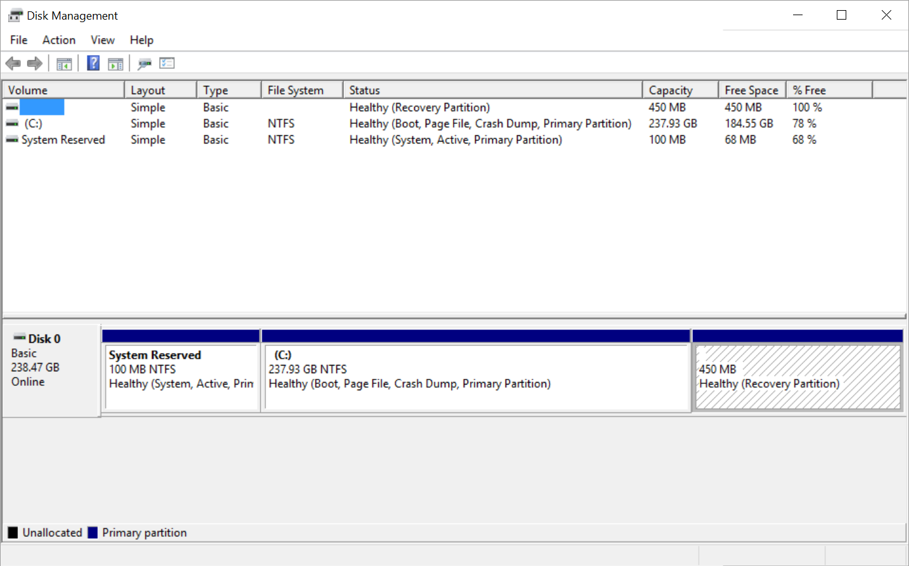

   : Disk Layout in Disk Management

Since the three Windows partitions fill the entire disk, the data
partition must be shrunk to create space to install |trueos|.
Right-click the data partition (in this example, the *(C:)* partition),
and select :guilabel:`Shrink Volume`, as shown in
:numref:`Figure %s <partition2>`.

.. _partition2:

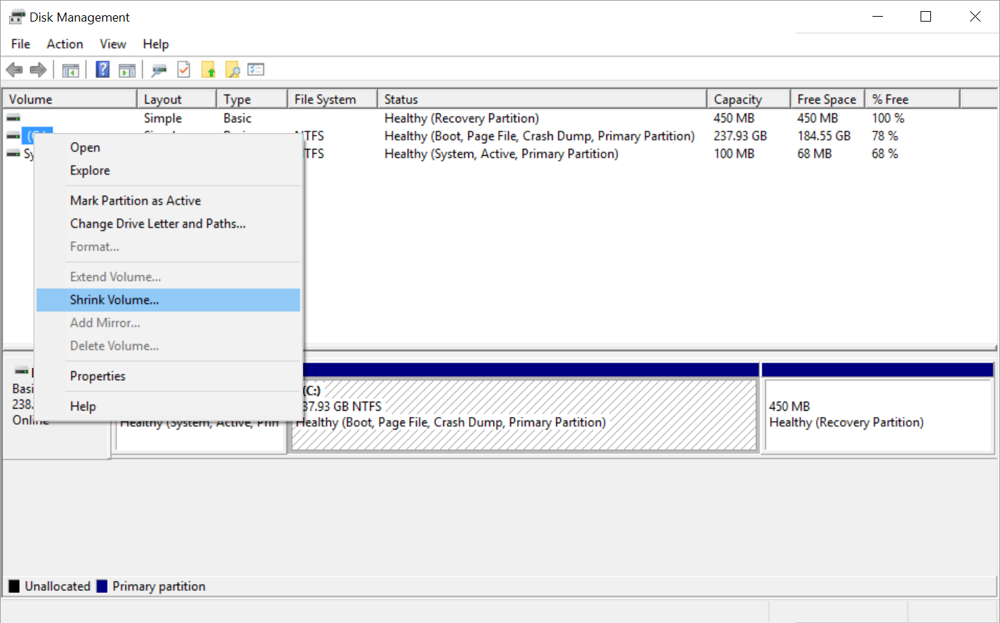

   : Shrink Volume Menu Selection

Wait as the volume is queried for available shrink space. The results
are shown in :numref:`Figure %s <shrink1>`.

.. _shrink1:

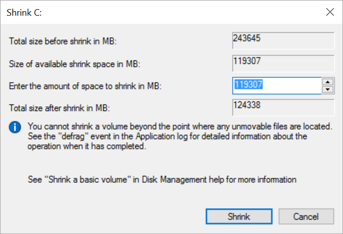

   : Available Shrink Space

Here, 119307 MB of space is available. This is the maximum amount
Windows can shrink this particular partition. Accept that number, or
choose a smaller number for a smaller |trueos| partition.  Click
:guilabel:`Shrink` to begin the shrinking process.  This procedure can
take several minutes to complete. When finished, the newly created free
space will be displayed, as seen in :numref:`Figure %s <shrink2>`.

.. _shrink2:

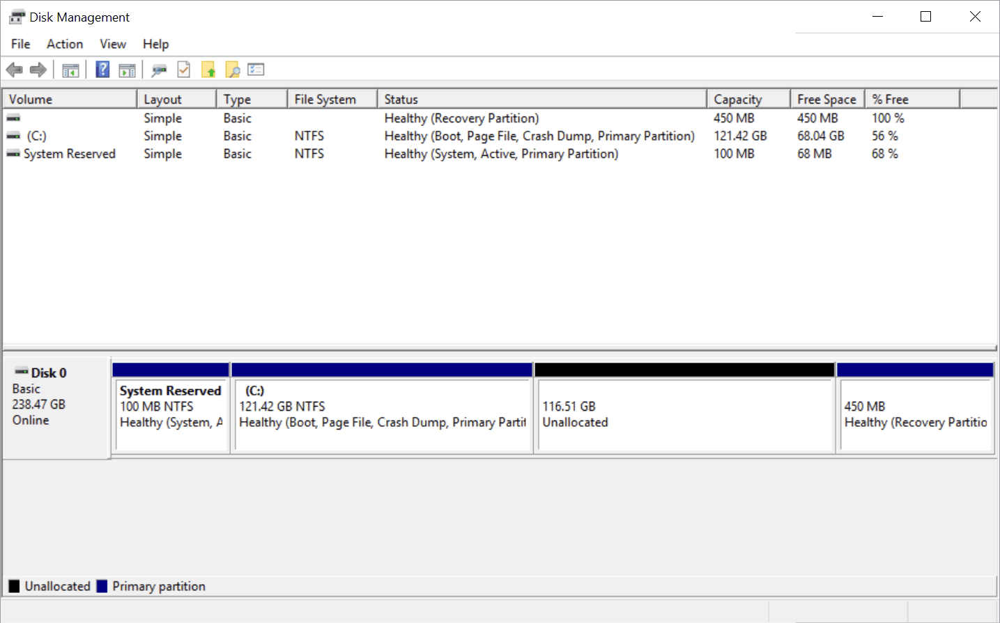

   : Disk with Free Space

.. warning:: It is important to **not** choose to install |trueos| into
   any of the three Windows partitions at the
   :ref:`Disk Selection Screen` of the installer. It is a good idea to
   write down the sizes of all of the partitions so the free space is
   recognizable when the |trueos| installer displays the current
   partitions.

.. _Obtaining TrueOS®:

Obtaining |trueos|
==================

|trueos| uses a rolling release model rather than versioned releases.

Periodically, the :ref:`Update Manager` will provide a patch which
updates the operating system to include all of the new features and
drivers. To have or test the latest features and drivers as they become
available, and you can tolerate possible breakage caused by new features
being available before the next RELEASE, use the STABLE version.

Installation files can be downloaded from the
`TrueOS® website <https://www.trueos.org/downloads/>`_ or the
`PC-BSD® CDN <http://iso.cdn.pcbsd.org/>`_.

Several types of files are available for download. Before downloading
a file, review these descriptions to see which one best suits the need:

* Files beginning with :file:`TrueOS-Desktop` contain all of the
  information needed to install either a graphical desktop or
  command-line server using a graphical installer. If the file has an
  :file:`.iso` extension, it should be burned to a DVD media. If it
  has a :file:`img` extension, it should be burned to a USB stick.
  There will also be associated files with the same name but ending in
  an :file:`.md5` or :file:`.sha256` extension. Depending upon the
  current operating system and its tools, use the value in either one
  of those files to determine the integrity of the download, as
  described in :ref:`Data Integrity Check`. If a torrent is available,
  there will also be a file with the same name and a :file:`.torrent`
  extension.

* Files beginning with :file:`TrueOS-Server` contain a command-line
  installer and are used to install a command-line version of a
  server. If the file has an :file:`.iso`  extension, it should be
  burned to a CD media. If it has an :file:`img` extension, it should
  be burned to a USB stick. There will also be associated files with
  the same name but ending in an :file:`.md5` or :file:`.sha256`
  extension. Depending upon the current operating system and its tools,
  use the value in either one of those files to determine the integrity
  of the download, as described in :ref:`Data Integrity Check`. If a
  torrent is available, there will also be a file with the same name and
  a :file:`.torrent` extension.

If planning to install a graphical desktop, download the file with
:file:`TrueOS-Desktop` in its name and either burn it to a DVD media or
write it to a removable USB device.

If installing a command-line only server is preferred, either download
a file beginning with :file:`TrueOS-Desktop` (to use the graphical
installer) or :file:`TrueOS-Server` (to use the command-line installer).
The :file:`TrueOS-Server` files are smaller and can fit on CD.

Refer to :ref:`Burning the Installation Media` for instructions on how
to burn the downloaded file to bootable media.

Members of the |trueos| project attend many IT conferences across the
globe and give out |trueos| DVDs at the FreeBSD booth. Visiting a
FreeBSD booth is an excellent way to meet other |trueos| and FreeBSD
users and get any questions answered. Check the
`TrueOS® Blog <https://www.trueos.org/blog/>`_ to see if any events
are happening near you. If organizing a |trueos| booth, contact us
`on Gitter <https://gitter.im/trueos/Lobby>`_ to arrange for DVDs.

.. index:: checksum
.. _Data Integrity Check:

Data Integrity Check
--------------------

After downloading the desired file, it is a good idea to check the file
is exactly the same as the one on the |trueos| download server. While
downloading, a portion of the file may get damaged or lost, making the
installation file unusable. Each |trueos| installation file has an
associated MD5 and SHA256 checksum. If a checksum of the file downloaded
matches, the download was successful. If a checksum does not match, try
downloading the file again. In order to verify a checksum, use a
checksum verification utility.

.. note:: Only one of the checksums needs to be verified. The
   `PC-BSD® website <http://www.pcbsd.org/download/>`_  lists the
   SHA256 while the `PC-BSD® CDN <http://iso.cdn.pcbsd.org/>`_ lists
   both the :file:`.md5` and the :file:`.sha256` checksum files. This
   section demonstrates how to verify an SHA256 checksum.

If currently using a Windows system, download and install a utility
such as
`Raymond's MD5 & SHA Checksum Utility <http://download.cnet.com/MD5-SHA-Checksum-Utility/3000-2092_4-10911445.html>`_.
This utility can be used to simultaneously check the MD5, SHA-1,
SHA-256, and SHA-512 checksums of any file. Once installed, launch the
program and use :guilabel:`Browse`, shown in
:numref:`Figure %s <fastsum1>`, to browse to the location of the
downloaded file.

.. _fastsum1:

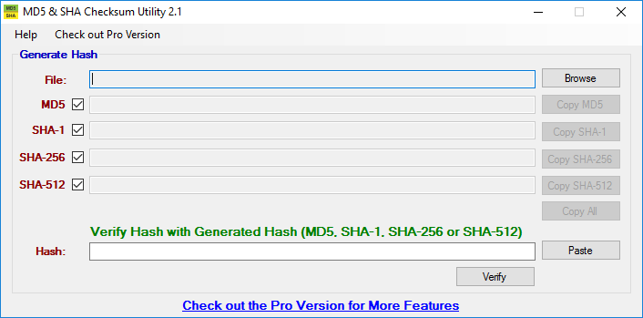

   : Checksum Verification

Once the file is selected, click :guilabel:`Open` to calculate the
checksums. It may take a minute or so, depending upon the size of the
downloaded file.

On Linux and BSD systems, use the built-in :command:`md5` or
:command:`md5sum` command line tool to check the MD5 checksum. In this
example, the file is located in the :file:`Downloads` directory. Using
:command:`md5 Downloads/TrueOS-Desktop-2016-08-11-x64-DVD.iso.md5`,
substitute the name and location of the downloaded file.

.. index:: burn
.. _Burning the Installation Media:

Burning the Installation Media
==============================

Once the installation file is downloaded and its checksum verified, burn
it to a media. Which media depends upon the file downloaded:

* Files beginning with :file:`TrueOS-Desktop` and ending with
  :file:`.iso` must be burned to a DVD.

* Files beginning with :file:`TrueOS-Server` and ending with
  :file:`.iso` should be burned to a CD.

* Files ending in :file:`img` must be burned to a USB stick.

To burn to a CD or DVD, use either a burning utility packaged with the
operating system on the system with the burner or a separate burning
application. :numref:`Table %s <burn utils>` lists some freely available
burning utilities.

.. _burn utils:

.. table:: : Free Burning Utilities

   +-----------------------+------------------------------------------------------------------------------------------------+
   | Operating System      | Utility                                                                                        |
   +=======================+================================================================================================+
   | Windows               | `InfraRecorder utility <http://infrarecorder.org/>`_                                           |
   +-----------------------+------------------------------------------------------------------------------------------------+
   | Windows               | `Disk Burner <http://windows.microsoft.com/en-US/windows7/Burn-a-CD-or-DVD-from-an-ISO-file>`_ |
   +-----------------------+------------------------------------------------------------------------------------------------+
   | Linux or \*BSD        | `K3B <https://www.kde.org/applications/multimedia/k3b/>`_                                      |
   +-----------------------+------------------------------------------------------------------------------------------------+
   | Linux or \*BSD        | `Brasero <https://wiki.gnome.org/Apps/Brasero>`_                                               |
   +-----------------------+------------------------------------------------------------------------------------------------+
   | FreeBSD/PC-BSD/TrueOS | `growisofs <https://www.freebsd.org/doc/en_US.ISO8859-1/books/handbook/creating-dvds.html>`_   |
   +-----------------------+------------------------------------------------------------------------------------------------+
   | Mac OS X              | `Disk Utility <https://support.apple.com/kb/PH20577?locale=en_US>`_                            |
   +-----------------------+------------------------------------------------------------------------------------------------+

.. index:: burn
.. _Writing to a USB Device:

Writing to a USB Device
-----------------------

There are a few requirements to write the :file:`img` file to a USB
device:

* A utility capable of writing the image to a USB media; the available
  utilities will depend upon the installed operating system.

* A USB thumb drive or hard drive large enough to hold the image.

.. warning:: If there is a card reader on the system or the USB drive is
   connected using a USB dongle, device enumeration may be affected. For
   example, with the USB card reader dongle as the destination, the
   device name could be :file:`/dev/da1` instead of :file:`/dev/da0`.

To write the :file:`.img` file to a flash card or removable USB drive on
a BSD or Linux system, use the :command:`dd` command line utility. On a
FreeBSD system, the superuser can use this command to write the file to
the first plugged in USB device:

.. code-block:: none

 dd if=TrueOS-Desktop-2016-08-11-x64.img of=/dev/da0 bs=1M
 1415+1 records in
 1415+1 records out
 1483990016 bytes transferred in 238.552250 secs (6220818 bytes/sec)

When using the :command:`dd` command:

* **if=** refers to the input file to be written.

* **of=** refers to the output file (the device name of the flash card
  or removable USB drive); increment the number in the name if it is not
  the first USB device.

* **bs=** refers to the block size.

.. note:: On Linux, type :command:`mount` with the USB stick inserted to
   see two or more device nodes corresponding to the USB stick. For
   example, :file:`/dev/sdc` and :file:`/dev/sdc1`, where
   :file:`/dev/sdc1` corresponds to the primary partition of the USB
   stick. Before using the :command:`dd` command, ensure the USB stick
   is first unmounted. Then, remember to use :file:`/dev/sdc` (the
   device node without the number) as the option for the output file
   **of=**. Once the :command:`dd` completes, the USB stick may not be
   mountable on Linux as Linux has very limited support for UFS, the BSD
   filesystem created on the USB stick.

To burn the image file on a Windows system, use
`win32-image-writer <https://sourceforge.net/projects/win32diskimager/>`_.
When downloading **win32-image-writer**, download the latest version
ending in :file:`-binary.zip` and use a utility such as Windows Explorer
or 7zip to unzip the executable.

Launch :command:`win32-image-writer.exe` to start the Win32 Disk Imager
utility, shown in :numref:`Figure %s <writer1>`. Use :guilabel:`browse`
to browse to the location of the :file:`.iso` file. Insert a USB thumb
drive and select its drive letter (in this example, drive **D**). Click
:guilabel:`Write` and the image will be written to the USB thumb drive.

.. _writer1:

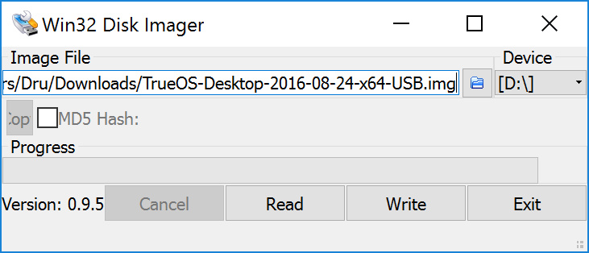

   : Write an Image using Win32 Disk Imager

To burn the :file:`.iso` file on Mac OS X, insert a USB stick and open
*Terminal*. Run :command:`diskutil list` to discover the device name of
the USB disk, unmount the USB disk, then use :command:`dd` to write the
image to the raw disk (:file:`rdisk`). In this example, an 8 GB USB
stick has a device name of :file:`/dev/disk1` and a raw device name of
:file:`/dev/rdisk1`:

.. code-block:: none

 diskutil list 
 /dev/disk0
 #: TYPE NAME SIZE IDENTIFIER
 0: GUID_partition_scheme *500.1 GB disk0
 1: EFI 209.7 MB disk0s1
 2: Apple_HFS Macintosh HD 499.2 GB disk0s2
 3: Apple_Boot Recovery HD 650.0 MB disk0s3 
 /dev/disk1
 #: TYPE NAME SIZE IDENTIFIER
 0: FDisk_partition_scheme *8.0 GB disk1
 1: DOS_FAT_32 UNTITLED 8.0 GB disk1s1

 diskutil unmountDisk /dev/disk1
 Unmount of all volumes on disk1 was successful

 sudo dd if=/Users/dru/Downloads/TrueOS-Desktop-2016-08-11-x64.img of=/dev/rdisk1 bs=4m
 Password:
 1415+1 records in
 1415+1 records out
 1483990016 bytes transferred in 238.552250 secs (6220818 bytes/sec)

.. index:: virtualization
.. _Virtualization:

Virtualization
==============

A virtualized environment allows to test drive an operating system
without overwriting the current operating system. This is an excellent
way to practice installation, determine whether the hardware is
supported, or to try multiple versions of different operating systems.
Virtualization software effectively creates windows (known as virtual
machines) to install and use an operating system. The only limitation to
virtualization is the hardware as each virtual machine uses CPU and RAM.
Depending upon the amount of CPU and RAM in the computer, the installed
operating system using virtualization software may run slowly. If the
computer slows down, try closing other applications running on the
computer to free up some RAM.

To run virtualization software on a |trueos| system, search for
*virtualbox* within :ref:`AppCafe®` and install the
`VirtualBox <https://www.virtualbox.org/>`_ open source virtualization
program and the
`VirtualBox Guest Additions <http://www.virtualbox.org/manual/ch04.html>`_.
The guest additions add mouse pointer integration, shared folders
between the host and guest, better video support, and a shared
clipboard.

.. note:: The first time running VirtualBox on a |trueos| system, a
   background script will automatically give the user account the
   permissions required to run this application. This might break any
   existing shortcuts to VirtualBox. To fix the shortcut, logout and
   in again.

If the computer is running another operating system, download the
binary for the specific operating system from the
`VirtualBox Downloads page <https://www.virtualbox.org/wiki/Downloads>`_.
VirtualBox runs on Windows, Linux, Macintosh, and OpenSolaris. It
supports a large number of virtual machine installable operating
systems.

This section describes how to prepare VirtualBox for an installation of
|trueos| using an :file:`.iso` file.

.. index:: virtualization
.. _Creating a Virtual Machine for an ISO File:

Creating a Virtual Machine for an ISO File
------------------------------------------

Once the |trueos| ISO is downloaded and VirtualBox installed on the
current system, create a virtual machine and use the ISO to install
|trueos| into the virtual machine. The virtual machine must meet several
minimum requirements and this section will demonstrate how to configure
these:

* 1024 MB base memory size.

* A virtual disk **at least 20 GB in size** for a server installation or
  **at least 50 GB in size** for a desktop installation.

* A bridged adapter.

To create the virtual machine, start VirtualBox to see the screen shown
in :numref:`Figure %s <vbox1>`.

.. _vbox1:

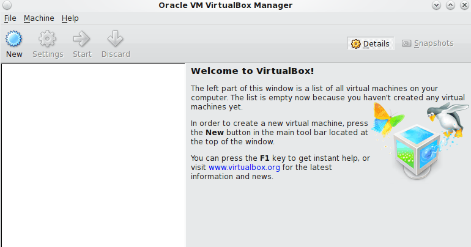

   : VirtualBox Menu

Click :guilabel:`New` to start the new virtual machine wizard and
display the screen in :numref:`Figure %s <vbox2>`.

.. _vbox2:

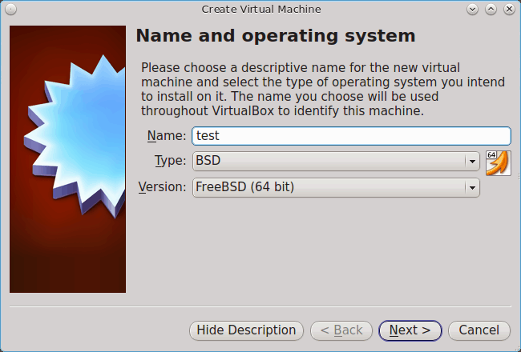

   : Create Virtual Machine - Name, Type, and Version

Enter a name for the virtual machine; it can be anything which makes
sense to you. Click the :guilabel:`Operating System` drop-down menu and
select :guilabel:`BSD`. In the :guilabel:`Version` drop-down menu,
select :guilabel:`FreeBSD (64 bit)`. Click :guilabel:`Next` to see the
screen in :numref:`Figure %s <vbox3>`.

.. _vbox3:

.. figure:: images/vbox3.png
   :scale: 100%

   : Virtual Machine Reserved Memory

The base memory size must be changed to **at least 1024 MB.** If the
system has a lot of RAM, use more. Any number within the green area is
considered a safe value by VirtualBox, meaning it should not slow down
the computer too much. When finished, click :guilabel:`Next` to see the
screen in :numref:`Figure %s <vbox4>`.

.. _vbox4:

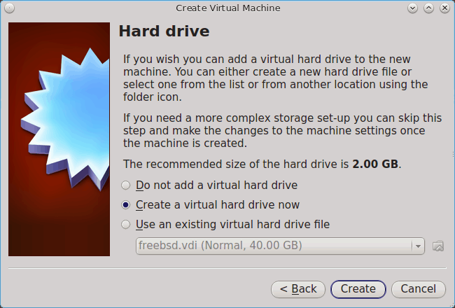

   : Virtual Hard Drive - New or Existing

This screen is used to create the virtual hard drive, or the amount of
disk space available to the virtual machine. If this is your first
virtual machine, keep the default of
:guilabel:`Create a virtual hard drive now` and click
:guilabel:`Create` to go to the screen shown in
:numref:`Figure %s <vbox5>`. If you have created a virtual machine in
the past and wish to reuse its disk space, select
:guilabel:`Use an existing virtual hard drive file` from the drop-down
menu. Create as many virtual machines as desired. However, if the
computer is getting low on disk space, consider reusing existing virtual
hard drives to prevent the physical hard drive from being used up by old
virtual machines.

.. _vbox5:

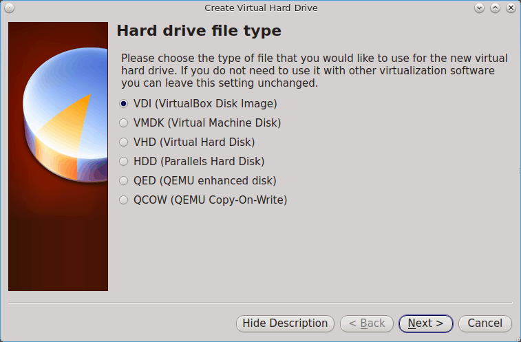

   : Hard Drive Type

Select :guilabel:`VDI` and click :guilabel:`Next` to see the screen in
:numref:`Figure %s <vbox6>`.

.. _vbox6:

.. figure:: images/vbox6.png
   :scale: 100%

   : Storage Type

Now choose whether to have :guilabel:`Dynamically allocated` or
:guilabel:`Fixed size` storage. The first option uses disk space as
needed until it reaches the maximum size set in the next screen. The
second option creates a disk the same size as that specified amount of
disk space, whether it is used or not. Choose the first option if disk
space is a concern; otherwise choose the second option as it allows
VirtualBox to run slightly faster. Once :guilabel:`Next` is selected,
the screen in :numref:`Figure %s <vbox7>` will display.

.. _vbox7:

.. figure:: images/vbox7.png
   :scale: 100%

   : Virtual Disk - File Name and Size

This screen is used to set the size (or upper limit) of the virtual
machine. If planning to install |trueos| into the virtual machine,
**increase the size to at least 20 GB** or an error will display during
the |trueos| installation. If planning to install KDE, GNOME, multiple
desktop managers, or applications within the virtual machine, choose at
least 50 GB. Whatever size is set, be sure the computer has enough free
disk space to support it. Use the :guilabel:`folder` icon to browse to
a directory on disk with sufficient space to hold the virtual machine.

Once the selections are made, press :guilabel:`Create` to finish using
the wizard. The virtual machine will now show up in the left box, as
seen in the example in :numref:`Figure %s <vbox8>`.

.. _vbox8:

.. figure:: images/vbox8.png
   :scale: 100%

   : New Virtual Machine "Test"

In order to use the network card, configure bridging on the virtual
machine. To do this, go to :menuselection:`Settings --> Network`. In
the :guilabel:`Attached to` drop-down menu select
:guilabel:`Bridged Adapter`, then select
the name of the physical interface from the :guilabel:`Name` drop-down
menu. In the example shown in :numref:`Figure %s <vbox9>`, the Intel
Pro/1000 Ethernet card is attached to the network and has a device name
of :file:`re0`.

.. _vbox9:

.. figure:: images/vbox9.png
   :scale: 100%

   : VirtualBox Bridged Adapter Configuration

Before starting the virtual machine, configure it to use the
installation media. Click the :guilabel:`Storage` hyperlink in the right
frame to access the storage screen seen in :numref:`Figure %s <vbox10>`.

.. _vbox10:

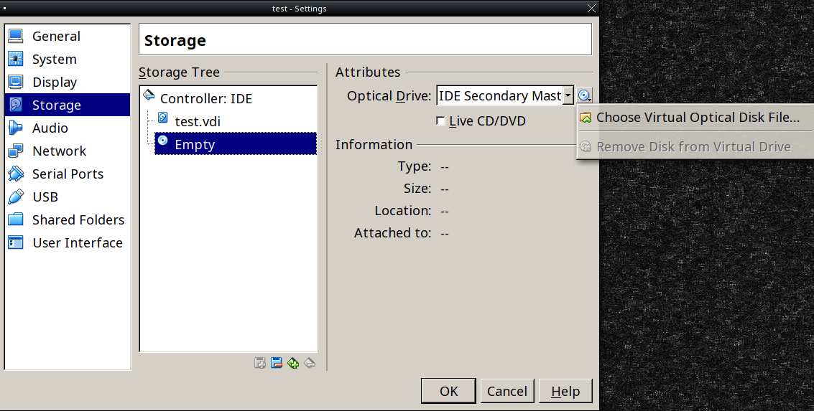

   : Virtual Machine Storage Settings

Double-click the word :guilabel:`Empty`, which represents the DVD
reader. To access the |trueos| installer from the DVD reader,
double-check the :guilabel:`Slot` is pointing to the correct location
(e.g. :guilabel:`IDE Secondary Master`) and use the drop-down menu to
change it if the location is incorrect.

If using an ISO stored on the hard disk is preferred, click the
:guilabel:`DVD` icon then :guilabel:`Choose a virtual CD/DVD disk file`
to open a browser menu to navigate to the location of the ISO. Highlight
the desired ISO and click :guilabel:`Open`. The name of the ISO will now
appear in the :guilabel:`Storage Tree` section.

|trueos| is now ready to be installed into the virtual machine.
Highlight the virtual machine and click on the green :guilabel:`Start`
icon. A window will open indicating the virtual machine is starting. If
a DVD is inserted, it should audibly spin and the machine will start to
boot into the installation program. If it does not or if using an ISO
stored on the hard disk, press :kbd:`F12` to select the boot device
when the message to do so appears, then press :kbd:`c` to boot from
CD-ROM. Proceed through the installation as described in
:ref:`Installing TrueOS®`.