.. index:: configuration
.. _SysAdm™ Client:

SysAdm™ Client
**************

Beginning with TrueOS® 11, most of the system management utilities that
were previously available in the PC-BSD® Control Panel have been
rewritten to use the SysAdm™ API. This API is designed to make it easy
to manage any FreeBSD or TrueOS® desktop or server system over a secure
connection from any operating system that has the SysAdm™ application
installed. SysAdm™ is built into TrueOS® and downloadable packages for
other operating systems are available from the
`SysAdm Website <https://sysadm.us/>`_.

The following utilities have been removed from Control Panel as they are now available in the SysAdm™ client:

**Application Management**

* :ref:`AppCafe®`

* :ref:`Update Manager`

**SysAdm Server Settings**

* :ref:`Manage SSL Keys`

**System Management**

* :ref:`Boot Environment Manager`

* :ref:`Task Manager`

* :ref:`User Manager`

**Utilities**

* :ref:`Life Preserver`

STILL NEED TO BE ADDED IN THE ORDER THEY APPEAR:

* :ref:`Firewall Manager`

* :ref:`Network Manager`

* :ref:`Mount Tray`

The rest of this chapter provides an overview of the SysAdm™
architecture, how to manage its secure connections, and how to use its
built-in utilities.

SysAdm™ Overview
================

Managing Connections
====================

Configuring SysAdm™
===================

.. index:: software, configuration, sysadm
.. _AppCafe®:

AppCafe®
=========

AppCafe® provides a graphical interface for installing and managing
FreeBSD packages, which are pre-built applications that have been tested
for FreeBSD-based operating systems. This interface displays extra
meta-data, such as application screenshots and lists of similar
applications.

The rest of this section describes how to manage software using AppCafe®.

.. index:: AppCafe®
.. _Software Management:

Finding Software
----------------

The "Browse" tab, shown in
:numref:`Figure %s: Browse Tab of AppCafe® <appcafe1>`, is used to find
available software. 

.. _appcafe1:

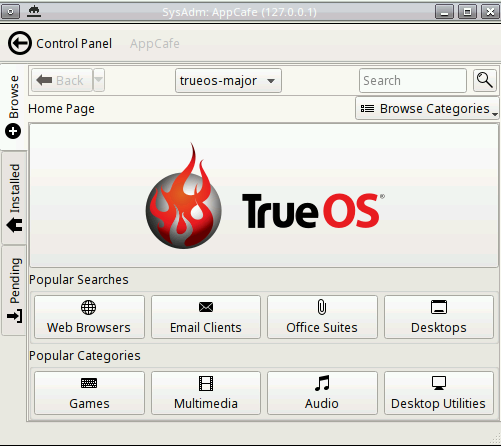

This screen contains the following options:

**Back:** click this button to leave a category or search result and
return to the previous screen.

**Repository drop-down menu:** use this drop-down menu to select the
repository to search or browse. The selections include: "major"
(applications available for installation), "base" (applications that
are part of the base operating system), and "local" (all installed
applications).

**Search:** to see if an application is available, enter its name and
click the "binoculars" icon. Alternately, enter a description. For
example, a search for "browser" will display software with "browser"
in the name as well as applications which provide browser
functionality, such as Firefox. 

**Browse Categories:** this drop-down menu lists the available software
categories. If you select a category, it will only display or show
search results from that category.

**Popular Searches and Popular Categories:** the buttons in these
sections can be used to quickly find applications which are recommended
by other TrueOS® users. Click a button to get a curated list of
applications that match the button's description.

Displayed applications will be listed in alphabetical order.
Applications which are already installed and which are not required by
other applications have a trashcan icon which can be clicked to
uninstall that application. Applications which are not installed have a
down arrow icon which can be clicked to install that application. 

Click the name of an application to view more information about that
application. In the example shown in
:numref:`Figure %s: Viewing the Details of an Installed Application <appcafe2>`,
the user has clicked "Firefox" on a system that has Firefox installed.

.. note:: AppCafe® provides a graphical front-end for displaying the
   contents of the package database. Since installed applications
   provide more information to the package database, some fields will
   be empty, depending upon the  selected repository. For example, the
   package message will only be displayed when the "local" repository
   is selected, the package is actually installed, and the package
   provides a message during installation.

.. _appcafe2:

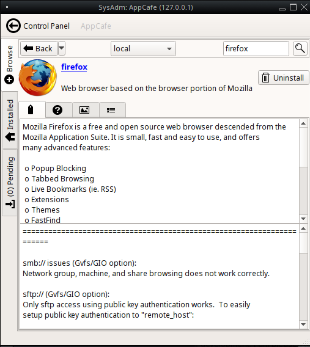

As seen in this example, the information for an application includes
the application's icon, name, and description. Click the application's
name to open the website for the application in the default web
browser. If the application is installed, there will be an "Uninstall"
button.

Beneath this area are 4 tabs. The first tab on the left contains two
panes. The first (middle) pane displays the package description. The
second (bottom) pane displays the message that appears when the
package is installed.
  
An example of the "?" tab is shown in 
:numref:`Figure %s: More Application Details <appcafe3>`

.. _appcafe3:

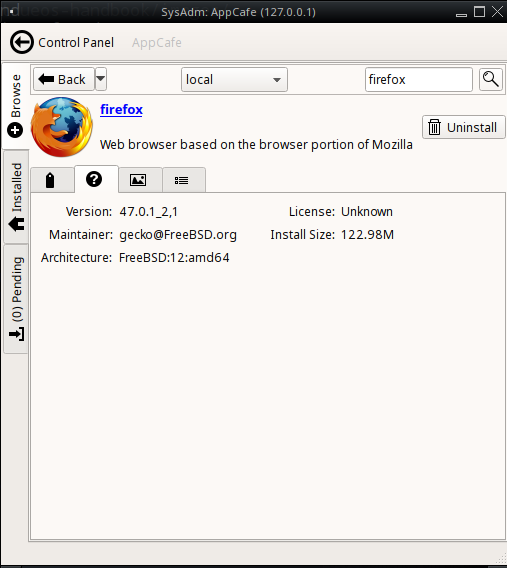

This tab displays following information:

* Software version.

* Email address for the maintainer of the FreeBSD port the package is
  built from.

* The application's architecture. This will indicate the FreeBSD version
  and whether or not the application is 32-bit or 64-bit. Note that
  TrueOS® can run both 32- and 64-bit applications.
  
* The application's license.  

* The application's installation size.

* The application's download size.

If the package includes screenshots of the application, you can click
the next tab, which has an image icon, to view and scroll through the
screenshots. An example is shown in
:numref:`Figure %s: Viewing the Application's Screenshots <appcafe4>`

.. _appcafe4:

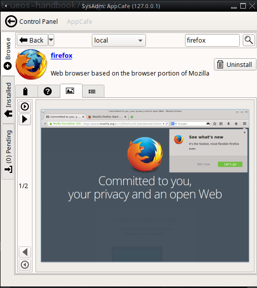

An example of the last tab, which has a list icon, is shown in
:numref:`Figure %s: Viewing the Details of an Installed Application <appcafe5>`.

.. _appcafe5:

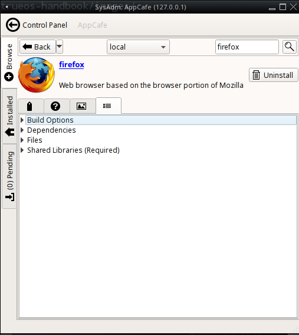

This tab contains the following information. Click the right arrow next
to an entry to expand its information and the down arrow to collapse
the information.

* **Build Options:** shows the values of the make options that the
  package was built with.

* **Dependencies:** lists the dependent packages that this
  application requires to be installed.

* **Required By:** indicates the names of any other packages that
  require this software to be installed.

* **Shared Libraries (Required):** lists the names of the libraries
  that this application requires.
  
Managing Installed Software
---------------------------

To view and manage the applications which are installed on the system,
click the "Installed" tab.  An example is seen in
:numref:`Figure %s: Installed Tab of AppCafe® <appcafe6>`. 

.. _appcafe6:

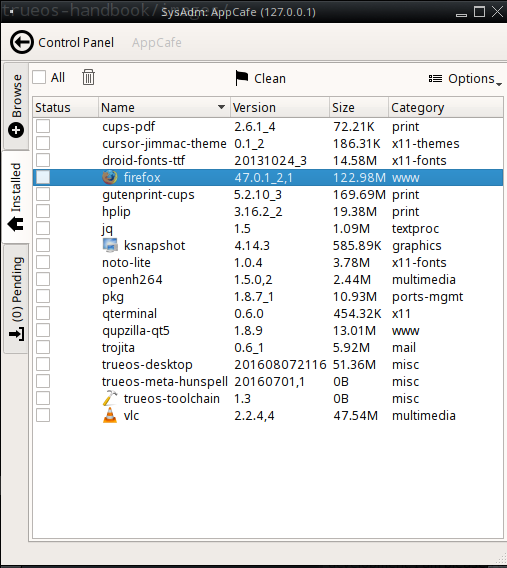

This screen provides the following actions:

* **All:** check this box to select all installed applications or
  uncheck it to deselect all installed applications.
  
* **Uninstall:** click the garbage can icon to uninstall the selected
  applications.
  
* **Clean:** this operation deletes any orphaned packages for the 
  selected applications. An orphaned package is one that is not
  required by any other applications. It will have a black flag icon
  (the same as the "Clean" icon) in its "Status" column.
  
This screen also provides an "Options" drop-down menu that allows you
to select or deselect the following options:

* **View All Packages:** by default, the installed tab only shows the
  packages that you installed. Check this box to also see the packages
  that came with the operating system. Packages which have a black
  banner icon under their "Status" column have dependent packages.
  This means if you delete a package with a black banner, you will
  also delete their dependent packages so that you do not end up with
  orphaned packages.

* **View Advanced Options:** if you check this box, two extra icons, a
  lock and an unlock icon, will be added to the right of the trash
  icon. If you select an application and click the lock icon, a lock
  lock icon will be added to its "Status" column. As long as an
  application is locked, it will not be updated by
  :ref:`Update Manager`. This can be useful if you need to stay at a
  certain version of an application. In order to upgrade that
  application, you will need to first select it and click the unlock
  icon.

* **Auto-clean packages:** if you check this box, the "Clean" icon
  will disappear as you no longer need to manually clean orphans.
  Instead, whenever you uninstall an application, any orphans will
  automatically be uninstalled as well.

In the example shown in 
:numref:`Figure %s: Viewing Applications With All Options Checked <appcafe7>`,
the user has checked all available options. In this example, "aalib"
has dependencies (banner icon), "alsa-lib" has been locked, and
"alsa-plugins" is an orphan (flag icon).

.. _appcafe7:

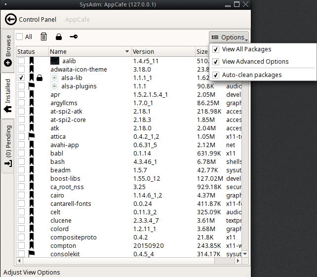
  
If you install or uninstall any software, click the "Pending" tab to
view the details of the operation. In the example shown in
:numref:`Figure %s: Viewing the Status of the Operation <appcafe8>`,
this system has had a package install and a package locking operation,
and each has a dated entry in the process log. If you highlight an
entry and check the "View Process Log" box, you can review the log for
that operation.

.. _appcafe8:

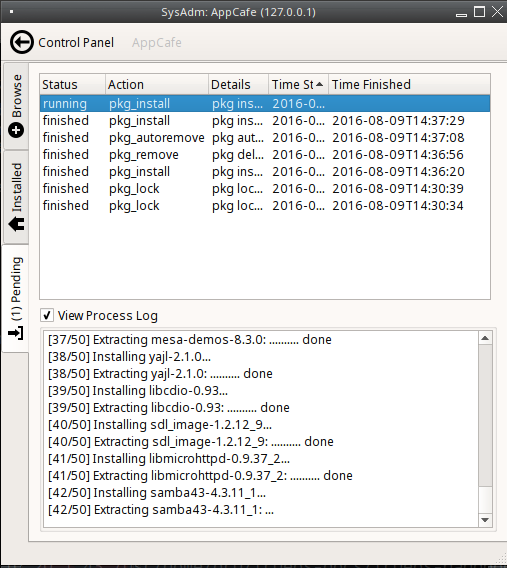

.. index:: updates
.. _Update Manager:

Update Manager
==============

Update Manager provides a graphical interface for keeping the TrueOS®
operating system and its installed applications up-to-date.

The TrueOS® update mechanism provides several safeguards to ensure that
updating the operating system or its software is a low-risk operation.
The following steps occur automatically during an update:

* The update automatically creates a snapshot (copy) of the current
  operating system, known as a boot environment (BE), and mounts that
  snapshot in the background. All of the updates then occur in the
  snapshot. This means that you can safely continue to use your system
  while it is updating as no changes are being made to the running
  version of the operating system or any of the applications currently
  in use. Instead, all changes are being made to the mounted copy.

.. note:: if the system is getting low on disk space and there is not
   enough space to create a new BE, the update will fail with a message
   indicating that there is not enough space to perform the update.

* While the update is occurring, and until you reboot after the update,
  you will not be able to use AppCafe® to manage software. This is a
  safety measure to prevent package conflicts. Also, the system shutdown
  and restart buttons will be greyed out until the update is complete
  and the system is ready for reboot. Should a power failure occur in
  the middle of an update, the system will reboot into the current boot
  environment, returning the system to the point before the upgrade
  started. Simply restart the update to continue the update process.

* Once the update is complete, the new boot environment, or updated
  snapshot, is added as the first entry in the boot menu and activated
  so that the system will boot into it, unless you pause the boot menu
  and specify otherwise. A pop-up message will indicate that a reboot is required. You can either finish what you are
  doing and reboot now into the upgraded snapshot, or ask the system to
  remind you again at a later time. To configure the time of the next warning, click the "Next Reminder" drop-down menu where you can select 1, 5, 12, or 24 hours, 30 minutes, or never (for this login
  session). Note that the system will not apply any more updates or allow you to start another manual update or install additional software using AppCafe®
  until you reboot.
  
* The default ZFS layout used by TrueOS® ensures that when new boot
  environments are created, the :file:`/usr/local/`, :file:`/usr/home/`,
  :file:`/usr/ports/`, :file:`/usr/src/` and :file:`/var/` directories
  remain untouched. This way, if you decide to rollback to a previous
  boot environment, you will not lose data in your home directories, any
  installed applications, or downloaded src or ports. However, you will
  return the system to its previous state, before the update was
  applied.

Managing Updates
----------------

An example of the "Updates" tab is shown in
:numref:`Figure %s: Managing Updates <update1>`.

.. _update1:

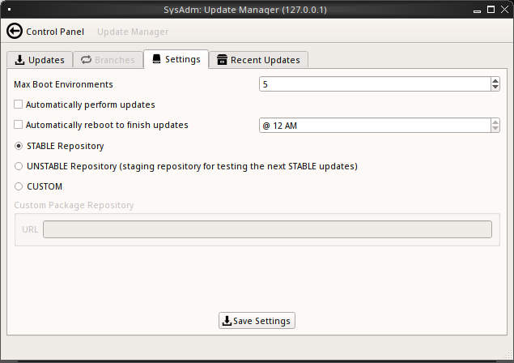

In this example, updates are available for installed packages. If a
security update is available, it will be listed as such. To apply the
available updates, click the box next to each entry to update, which
will activate the "Start Updates" button. Once you click that button,
it will change to "Stop Updates" so that you can stop the update, if
needed. As the selected updates are applied, the progress of the
updates will be displayed.

.. warning:: Update Manager will update **all** installed software. If
   you have placed a lock on a package using :command:`pkg` or
   AppCafe®, Update Manager will fail and will generate a message
   indicating that the failure is due to a locked package. If you need
   to lock certain applications against being updated, you will need
   to instead manually update software as needed using :command:`pkg`.

Once the update is complete, Update Manager will provide a message
indicating that a reboot is required. Save your work and, when ready,
manually reboot into the new boot environment containing the applied
updates.
   
The "Latest Check" field indicates the date and time the system last
checked for updates. To manually check for updates, click the "Check
for Updates" button.

The "Branches" tab of Update Manager provides a listing of available branches. In the example shown in
  :numref:`Figure %s: Switching Branches <update3>`, this system is currently running the 10.2 branch and the upcoming 11.0 branch is available for selection.

.. _update3:

.. figure:: images/update3.png  

The "Settings" tab is shown in
:numref:`Figure %s: Settings Tab <update4>`.

.. _update4:

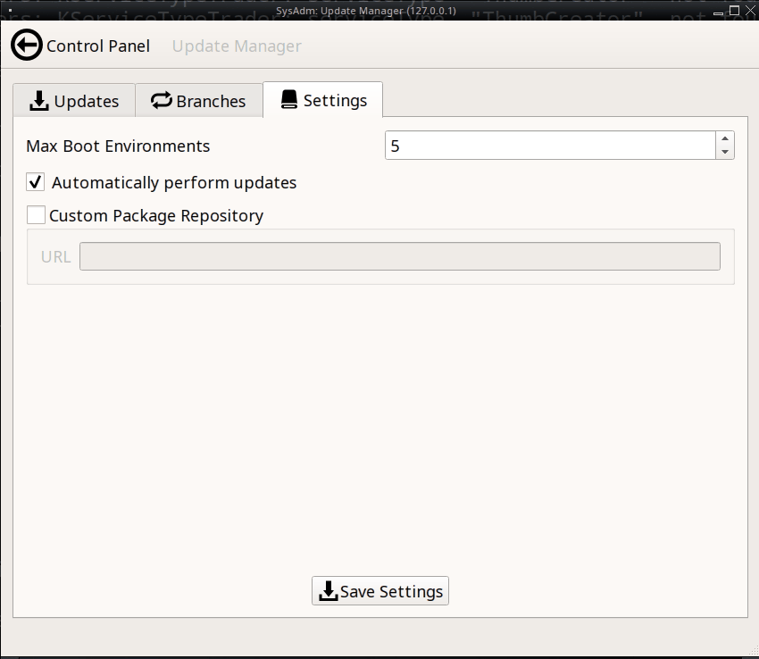

This tab contains the following configurable options:

* **Max Boot Environments:** TrueOS® automatically creates a boot
  environment before updating any software, the operating system, or
  applying a system update. Once the configured maximum number of boot
  environments is reached, TrueOS® will automatically prune (delete)
  the oldest automatically created boot environment. However, it will
  not delete any boot environments you create manually using
  :ref:`Boot Environment Manager`. The default number of boot
  environments is *5* and the allowable range is from *1* to *10*. 

* **Automatically perform updates:** when checked, the automatic
  updater will automatically keep your system and packages up-to-date.
  You will know that an update has completed when the pop-up menu indicates that a reboot is needed to complete the update process. If you uncheck this box, an update will only occur when
  You do not need to initiate updates manually. TrueOS® uses an automated updater that automatically checks for updates, no more than once per day, 20
  minutes after a reboot and then every 24 hours.
  
* **Custom Package Repository:** if you have followed the instructions
  to :ref:`Create a Local Package Mirror`, check this box. This will
  activate the "URL" field so that you can input the URL to the custom
  repository.

.. index:: updates
.. _Upgrading from 10.x to |version|:

Upgrading from PC-BSD® 10.x to TrueOS®
--------------------------------------

.. index:: sysadm, configuration
.. _Manage SSL Keys:

Manage SSL Keys
===============

.. index:: sysadm, boot environments, ZFS
.. _Boot Environment Manager:

Boot Environment Manager
========================

TrueOS® supports a feature of ZFS known as multiple boot environments
(BEs). With multiple boot environments, the process of updating software
becomes a low-risk operation as the updates are applied to a different
boot environment. If needed, you have the option of rebooting into a
backup boot environment. Other examples of using boot environments
include: 

* If you are making software changes, you can take a snapshot of that
  boot environment at any stage during the modifications.

* You can save multiple boot environments on your system and perform
  various updates on each of them as needed. You can install, test, and
  update different software packages on each.

* You can mount a boot environment in order to :command:`chroot` into
  the mount point and update specific packages on the mounted
  environment.

* You can move a boot environment to another machine, physical or
  virtual, in order to check hardware support.

.. note:: For boot environments to work properly, 
   **do not delete the default ZFS mount points during installation.** 
   The default ZFS layout ensures that when boot environments are
   created, the :file:`/usr/local/`, :file:`/usr/home/`,
   :file:`/usr/ports/`, :file:`/usr/src/` and :file:`/var/` directories
   remain untouched. This way, if you rollback to a previous boot
   environment, you will not lose data in your home directories, any
   installed applications, or downloaded src or ports. During
   installation, you can add additional mount points, just don't delete
   the default ones.

To ensure that the files that the operating system needs are included
when the system boots, all boot environments on a TrueOS® system include
:file:`/usr`, :file:`/usr/local`, and :file:`/var`. User-specific data
is **not** included in the boot environment. This means that
:file:`/usr/home`, :file:`/usr/jails`, :file:`/var/log`,
:file:`/var/tmp`, and :file:`/var/audit` will not change, regardless of
which boot environment is selected at system boot.
   
To view, manage, and create boot environments using the SysAdm™
graphical client, go to
:menuselection:`System Management --> Boot Environment Manager`. In the
example shown in :numref:`Figure %s: Managing Boot Environments <be1>`,
there is an entry named *initial* that represents the original TrueOS®
installation.

.. _be1:

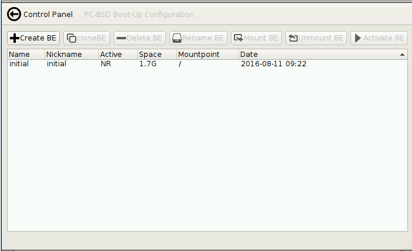

Each entry contains the following information:

* **Name:** the name of the boot entry as it will appear in the boot
  menu.

* **Nickname:** a description, which can be different from the "Name".

* **Active:** the possible values of this field are "R" (active on
  reboot), "N" (active now), or "-" (inactive). In this example, the
  system booted from "initial" and is set to boot from "initial" on
  the next boot.

* **Space:** the size of the boot environment.

* **Mountpoint:** indicates whether or not the BE is mounted, and if
  so, where.

* **Date:** the date and time the BE was created.
  
From left to right, the buttons on the top bar are used to: 

**Create BE:** creates a new boot environment. You should do this before
making any changes to the system that may impact on your current boot
environment. You will be prompted for a name which can only contain
letters or numbers. Once you click "OK", the system will create the
environment, then add it to the list of boot environments.

**Clone BE:** creates a copy of the highlighted boot environment.

**Delete BE:** deletes the highlighted boot environment. You can not
delete the boot environment which is marked as *N* or as
*R* in the "Active" column.

**Rename BE:** renames the highlighted boot environment. The name is
what appears in the boot menu when the system boots. You cannot rename
the BE you are currently booted into.

**Mount BE:** mounts the highlighted BE in :file:`/tmp` so that its
contents are browseable. Note that this setting only applies to inactive
BEs.

**Unmount BE:** unmounts the previously mounted BE.

**Activate BE:** tells the system to boot into the highlighted boot
environment at next system boot. This will change the "Active" column
to *R*.

If you wish to boot into another boot environment, press :kbd:`7` at
the :numref:`Figure %s: TrueOS® Boot Menu <install1b>` to access the
boot menu selection screen. In the example shown in
:numref:`Figure %s: Boot Environments Menu <be2>`, two boot
environments are available in the "Boot Environments" section: the
entry named "initial" represents the initial installation and the
entry named "mybootenvironment" was manually created using Boot
Environment Manager. The upper section of this menu indicates that the
"initial" boot environment is set to active, or the one the system
has been configured to boot into unless another BE is manually
selected in this menu. Use the arrow keys to highlight the boot
environment you would like to boot into, and press :kbd:`Enter` to
continue booting into the selected boot environment. 

.. _be2:

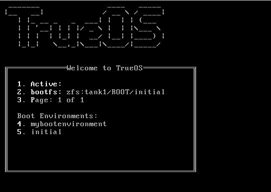

.. index:: sysadm, configuration
.. _Task Manager:

Task Manager
============

Task Manager provides a graphical view of memory use, per-CPU use and
a listing of currently running applications. An example is shown in 
:numref:`Figure %s: Task Manager <task1>`.

.. _task1:

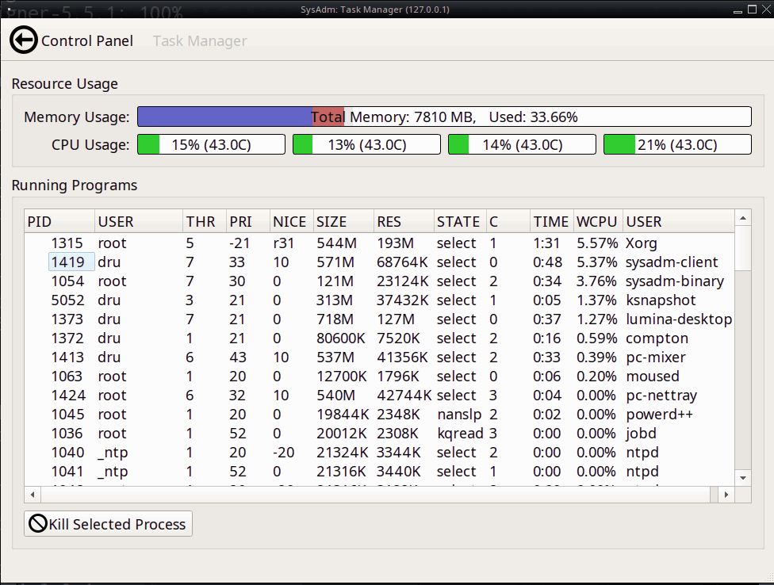

The "Running Programs: section provides a graphical front-end to
`top(1) <https://www.freebsd.org/cgi/man.cgi?query=top>`_.

The "Kill Selected Process" button can be used to terminate the
selected process.

.. index:: configuration
.. _User Manager:

User Manager
============

The TrueOS® User Manager utility allows you to easily add, configure,
and delete users and groups. To access this utility in SysAdm™, click
:menuselection:`System Management --> User Manager`. 

In the example shown in
:numref:`Figure %s: Viewing User Accounts in User Manager <user1>`,
the system has one user account that was created in the "Create a User
Screen" during installation.

.. _user1:

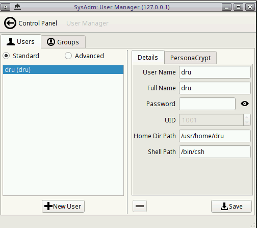

The "Standard" view allows you to configure the following:

* **User Name:** the name the user will use when they log in to the
  system. It is case sensitive and can not contain any spaces. 

* **Full Name:** this field provides a description of the account and
  can contain spaces.

* **Password:** this is where you can change the password for the
  user. The password is case-sensitive and can contain symbols. If you
  want to display the password as you change it, to make sure you are
  setting it to the desired value, click the "eye" icon. Click that
  icon again to show dots in place of the actual password.

* **UID:** this value is greyed out as it is assigned by the operating
  system and cannot be changed after the user is created.

* **Home Dir Path:** if you change the user's home directory, input the full path

* **Shell Path:** if you change the user's default shell, input the
  full path to an installed shell. The paths for each installed shell
  can be found in :file:`/etc/shells`.

If you make any changes to a user's "Details", click the "Save" button
to save them.

:numref:`Figure %s: Creating a New User Account <user2>` demonstrates
how this screen changes when you click the "New User" button.

.. _user2:

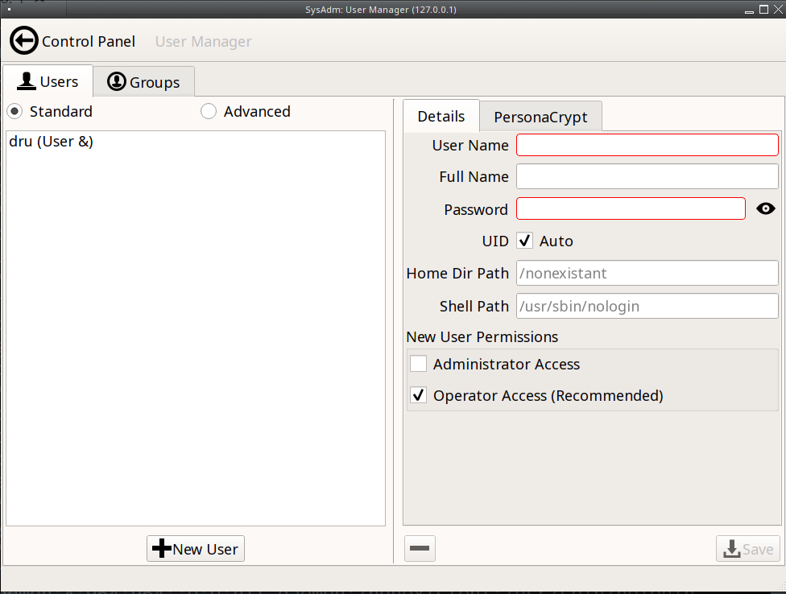

Fields outlined in red are required when creating a user. The "User
Name", "Full Name", and "Password" fields are the same as described in
the "Details" tab. The rest of the available fields are as follows:

**UID:** by default, the user will be assigned the next available User
ID (UID). If you need to force a specific UID, uncheck the "Auto" box
and either input or select the number to use. Note that you cannot use
an UID that is already in use by another account and those number will
be appear as red.

**Home Dir Path:** by default, this is set to :file:`/nonexistent`
which is the correct setting for a system account as it prevents
unauthorized logins. If you are creating a user account for login
purposes, input the full path to use for the user's home directory.

**Shell:** by default, this is set to :file:`/usr/bin/nologin` which
is the correct setting for a system account as it prevents
unauthorized logins. If you are creating a user account for login
purposes, input the full path of an installed shell. The paths for
each installed shell can be found in :file:`/etc/shells`.

**Adminstrator Access:** check this box if the user requires
`su(1) <https://www.freebsd.org/cgi/man.cgi?query=su>`_ access. Note
that this setting requires the user to know the password of the *root*
user.

**Operator Access:** check this box if the user requires
:command:`sudo` access. This allows the user to precede an
administrative command with :command:`sudo` and to be prompted for
their own password.

Once you have made your selections, press the "Save" button to create
the account.

If you click the "-" (remove) button for a highlighted user, a pop-up
menu will ask if you are sure that you want to remove the user and a
second pop-up will ask if you would like to also delete the user's
home directory (along with all of their files). If you click "No" to
the second pop-up, the user will still be deleted but their home
directory will remain. Note that the "-" button will be greyed out if
you highlight the user that started SysAdm™. It will also be greyed
out if there is only one user account as you need at least one user to
be able to login to the TrueOS® system.

If you click the "Advanced View" button, this screen will change to
show all of the accounts on the system, not just the user accounts 
that you created. An example is seen in
:numref:`Figure %s: Viewing All Accounts and Their Details <user3>`. 

.. _user3:

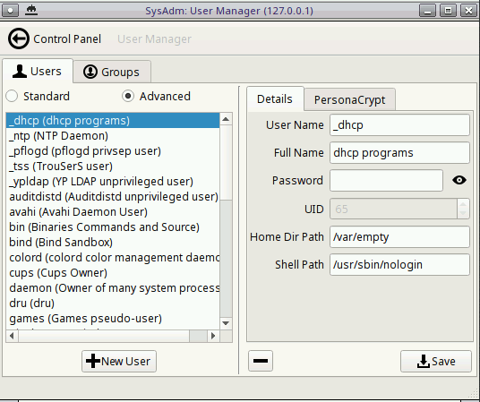

The accounts that you did not create are known as system accounts and
are needed by the operating system or installed applications. Do **not**
delete any accounts that you did not create yourself as doing so may
cause a previously working application to stop working. "Advanced View"
provides additional information associated with each account, such as
the user ID number, full name (description), home directory, default
shell, and primary group. System accounts usually have a shell of
*nologin* for security reasons, meaning that an attacker can not try to
login to the system using that account name.

.. index:: users
.. _PersonaCrypt:

PersonaCrypt
------------

TrueOS® provides support for a security feature known as PersonaCrypt.
A PersonaCrypt device is a removable USB media, such as a USB stick,
which has been formatted with ZFS and encrypted with GELI. This device
is used to hold a specific user's home directory, meaning that they
can securely transport and access their personal files on any TrueOS®
or PC-BSD® 10.1.2 or higher system. This can be used, for example, to
securely access one's home directory from a laptop, home computer, and
work computer. The device is protected by an encryption key and a
password which is, and should be, separate from the user's login
password.

.. note:: When a user is configured to use a PersonaCrypt device, that
   user can not login using an unencrypted session on the same system.
   In other words, the PersonaCrypt username is reserved for
   PersonaCrypt use. If you need to login to both encrypted and
   unencrypted sessions on the same system, create two different user
   accounts, one for each type of session.

PersonaCrypt uses GELI's ability to split the key into two parts: one
being your passphrase, and the other being a key stored on disk.
Without both of these parts, the media cannot be decrypted. This means
that if somebody steals the key and manages to get your password, it
is still  worthless without the system it was paired with.

.. warning:: USB devices can and do eventually fail. Always backup any
   important files stored on the PersonaCrypt device to another device
   or system.

The "PersonaCrypt" tab can be used to initialize a PersonaCrypt device for any login user, **except** for the currently logged in user. In the
example shown in
:numref:`Figure %s: Initialize PersonaCrypt Device <user5>`, a new user,
named *dlavigne*, has been created and the entry for that user has been
clicked.

.. _user5: 

.. figure:: images/user5.png

Before a user is configured to use PersonaCrypt on a TrueOS® system, two
buttons are available in the "PersonaCrypt" section of "Advanced Mode".
Note that this section is hidden if the currently logged in user is selected. Also, if you have just created a user and do not see these
options, click "Apply" then re-highlight the user to display these
options:

* **Initialize Device:** used to prepare the USB device that will be
  used as the user's home directory.

* **Import Key:** if the user has already created a PersonaCrypt device
  on another TrueOS® system, click this button to import a previously
  saved copy of the key associated with the device. Once the key is
  imported, the user can now login to this computer using PersonaCrypt.

To prepare a PersonaCrypt device for this user, insert a USB stick and
click "Initialize Device". A pop-up menu will indicate that the current
contents of the device will be wiped and that the device must be larger
than the user's current home directory.

.. warning:: since the USB stick will hold the user's home directory and
   files, ensure that the stick is large enough to meet the anticipated
   storage needs of the home directory. Since the stick will be
   reformatted during the initialization process, make sure that any
   current data on the stick that you need has been copied elsewhere.
   Also, the faster the stick, the better the user experience while
   logged in.

Press "OK" in the pop-up menu. This will prompt you to input and confirm
the password to associate with the device. Another message will ask if
you are ready. Click "Yes" to initialize the device. The User Manager
screen will be greyed out while the device is prepared. Once the
initialization is complete, the User Manager screen will change to
display the device's key options, as seen in
:numref:`Figure %s: PersonaCrypt Key Options <user6>`.

.. _user6:

.. figure:: images/user6.png

The following options are now available:

* **Export Key:** used to create a copy of the encryption key so that it
  can be imported for use on another TrueOS® system.

* **Disable Key (No Data):** used to uninitialize the PersonaCrypt
  device on this system. Note that the device can still be used to login
  to other TrueOS® systems.

* **Disable Key (Import Data):** in addition to uninitializing the
  PersonaCrypt device on this system, copy the contents of the user's
  home directory to this system.

Once a user has been initialized for PersonaCrypt on the system, their
user account will no longer be displayed when :ref:`Logging In`
**unless** their PersonaCrypt device is inserted. Once the USB device is
inserted, the login screen will add an extra field, as seen in the
example shown in Figure 4.8b.

.. note:: when stealth sessions have been configured, PersonaCrypt users will still be displayed in the login menu, even if
   their USB device is not inserted. This is to allow those users the option to instead login using a stealth session.

In the field with the yellow padlock icon, input the password for the
user account. In the field with the grey USB stick icon, input the
password associated with the PersonaCrypt device.

.. warning:: To prevent data corruption and freezing the system
   **DO NOT** remove the PersonaCrypt device while logged in! Always log
   out of your session before physically removing the device.

.. index:: users
.. _Managing Groups:

Managing Groups
---------------

Click the "Groups" tab to view and manage the groups on the system.
The "Standard" tab, seen in
:numref:`Figure %s: Managing Groups Using User Manager <user4>`,
shows the group membership for the *operator* and *wheel* groups:

.. _user4: 

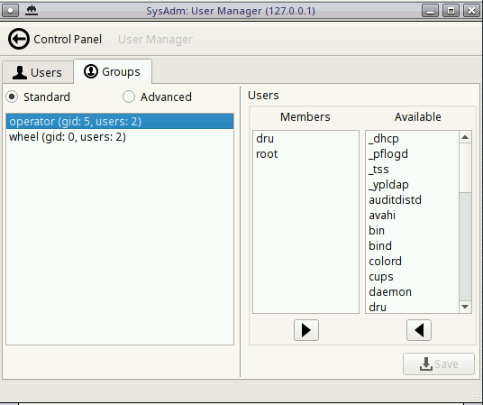

This screen has 2 columns: 

**Members:** indicates if the highlighted group contains any user
accounts.

**Available:** shows all of the system and user accounts on the system
in alphabetical order.

To add an account to a group, highlight the group name, then highlight
the account name in the "Available" column. Click the left arrow and
the selected account will appear in the "Members" column. You should
only add user accounts to groups that you create yourself or when an
application's installation instructions indicate that an account needs
to be added to a group.

.. note:: If you add a user to the *operator* group, they will have
   permission to use commands requiring administrative access and will
   be prompted for their own password when administrative access is
   required. If you add a user to the *wheel* group, they will be
   granted access to the :command:`su` command and will be prompted
   for the superuser password whenever they use that command.

To view all of the groups on the system, click "Advanced".

.. index:: sysadm, life preserver
.. _Life Preserver:

Life Preserver
==============

The Life Preserver utility is designed to take full advantage of the
functionality provided by ZFS snapshots. This utility allows you to
schedule snapshots of a ZFS pool and to optionally replicate those
snapshots to another system over an encrypted connection. This design
provides several benefits: 

* A snapshot provides a "point-in-time" image of the ZFS pool. In one
  way, this is similar to a full system backup as the snapshot contains
  the information for the entire filesystem. However, it has several
  advantages over a full backup. Snapshots occur instantaneously,
  meaning that the filesystem does not need to be unmounted and you can
  continue to use applications on your system as the snapshot is
  created. Since snapshots contain the meta-data ZFS uses to access
  files, the snapshots themselves are small and subsequent snapshots
  only contain the changes that occurred since the last snapshot was
  taken. This space efficiency means that you can take snapshots often.
  Snapshots also provide a convenient way to access previous versions of
  files as you can browse to the point-in-time for the version of the
  file that you need. Life Preserver makes it easy to configure when
  snapshots are taken and provides a built-in graphical browser for finding and restoring the files within a snapshot.

* Replication is an efficient way to keep the files on two systems in
  sync. With Life Preserver, the snapshots taken on the TrueOS® system
  will be synchronized with their versions stored on the specified
  backup server.

* Snapshots are sent to the backup server over an encrypted connection.

* Having a copy of the snapshots on another system makes it possible to
  perform an operating system restore should the TrueOS® system become
  unusable or to deploy an identical system to different hardware.
  
To manage snapshots and replication using the SysAdm™ graphical client,
go to :menuselection:`Utilities --> Life Preserver`. The rest of this
section describes where to find and how to use the features built into
Life Preserver.

.. index:: snapshots, life preserver
.. _Snapshots Tab:

Snapshots Tab
-------------

:numref:`Figure %s: Snapshot Tab <lpreserver1>` shows the "Snapshots"
tab on a system that has not yet been configured. This system has a
"ZFS Pool" named "tank". 

.. _lpreserver1:

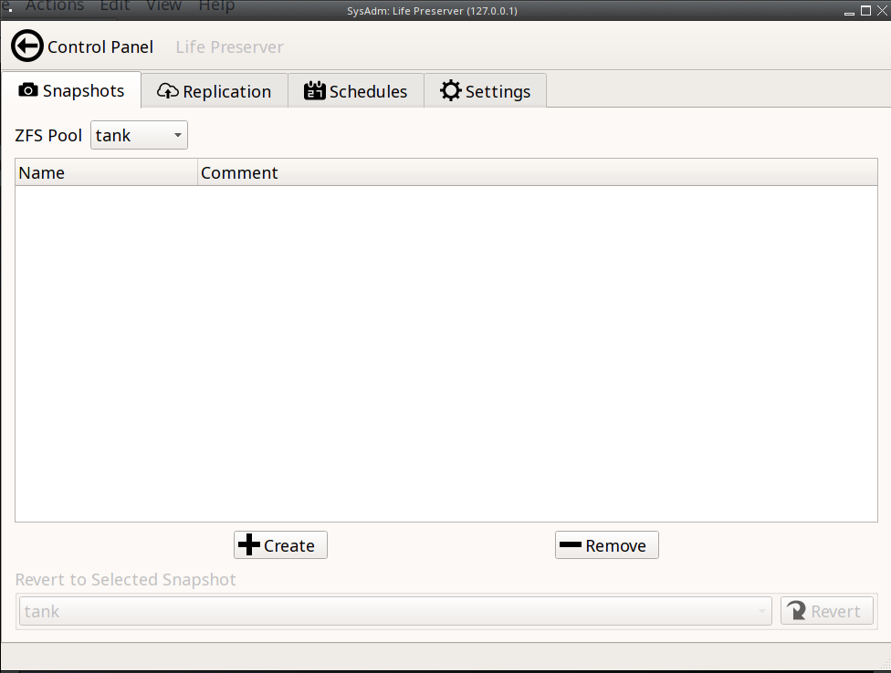

This screen will display any createdsnapshots and provides buttons to:

**Create:** used to create a manual snapshot of the specified pool
now. For example, you could create a snapshot before making changes to
an important file, so that you can preserve a copy of the previous
version of the file. Or, you can create a snapshot as you make
modifications to the system configuration. When creating a snapshot, a
pop-up message will prompt you to input a name for the snapshot,
allowing you to choose a name that is useful in helping you remember
why you took the snapshot. An entry will be added to this screen for
the snapshot where the "Name" will be the name you input and the
"Comment" will inidcate the date and time the snapshot was created.

**Remove:** used to delete a highlighted snapshot. 
**This is a permanent change that can not be reversed.** In other
words, the versions of files at that point in time the snapshot was
created will be lost.

**Revert:** if you highlight a snapshot entry, this button and the
drop-down menu next to it will activate. You can use the drop-down
menu to select which dataset you would like to revert back to.
**Be aware that a revert will overwrite the current contents of the selected pool or dataset to the point in time the snapshot was created.**
This means that files changes that occurred after the snapshot was
taken will be lost.

.. index:: replication, life preserver
.. _Replication Tab:

Replication Tab
---------------

Life Preserver can be configured to replicate snapshots to another
system over an encrypted SSH connection, though the backup itself is
stored in an unencrypted format. This ensures that you have a backup
copy of your snapshots on another system. 

In order to configure replication, the remote system to hold a copy of
the snapshots must first meet the following requirements:

* The backup server
  **must be formatted with the latest version of ZFS,** also known as
  ZFS feature flags or ZFSv5000. Operating systems that support this
  version of ZFS include TrueOS®, FreeBSD or PC-BSD® 9.2 or higher,
  and FreeNAS 9.1.x or higher.

* That system must have SSH installed and the SSH service must be
  running. If the backup server is running TrueOS®, PC-BSD®, FreeNAS®
  or FreeBSD, SSH is already installed, but you will need to start the
  SSH service.

* If the backup server is running TrueOS® or PC-BSD®, you will need to
  open TCP port 22 (SSH) using :ref:`Firewall Manager`. If the server
  is running FreeBSD and a firewall has been configured, add a rule to
  open this port in the firewall ruleset. FreeNAS® does not run a
  firewall by default. Also, if there is a network firewall between
  the TrueOS® system and the backup system, make sure it has a rule to
  allow SSH.

:numref:`Figure %s: Replication Tab <lpreserver2>` shows the initial
"Replication" tab on a system that has not yet been configured for
replication. This screen is used to create, view, remove, and
configure the replication schedule.  

.. _lpreserver2:

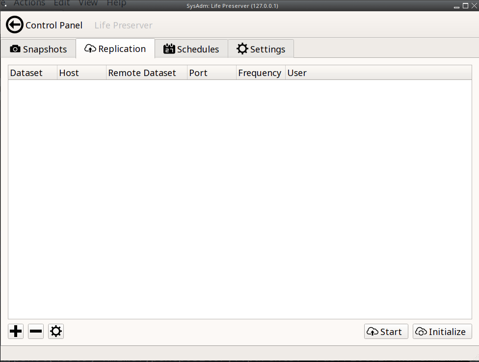

To schedule the replication, click the "+" button to display the
"Setup Replication" screen shown in
:numref:`Figure %s: Scheduling a Replication <lpreserver3>`.

.. _lpreserver3:

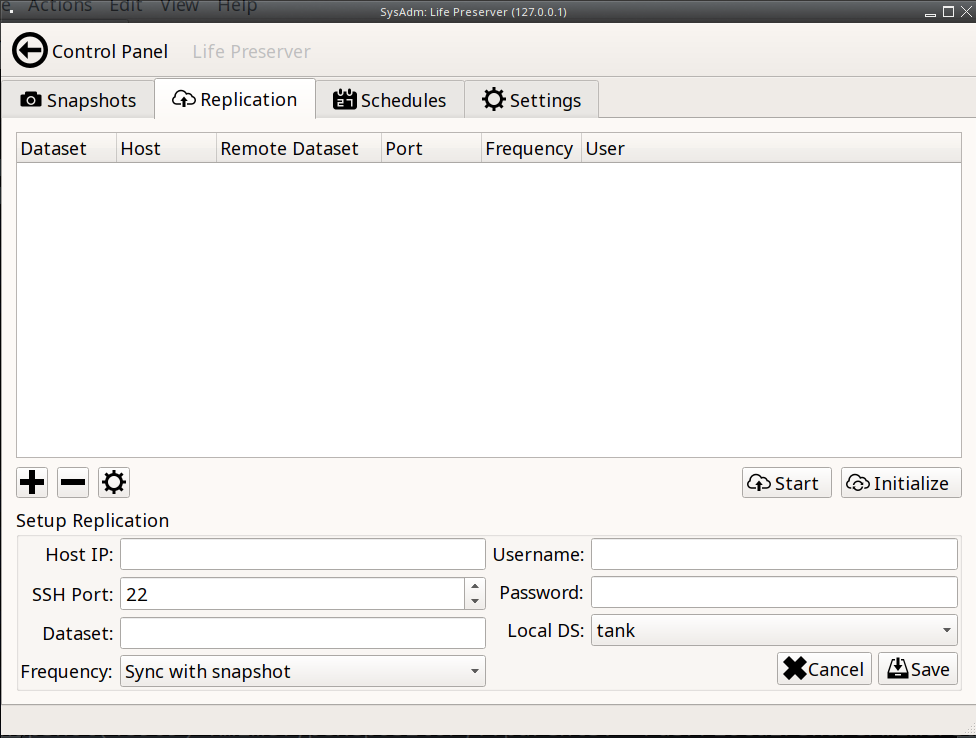

Input the following information:

* **Host IP:** the IP address of the remote system to store the
  replicated snapshots.

* **SSH Port:** the port number, if the remote system is running SSH
  on a port other than the default of 22.

* **Dataset:** the name of the ZFS pool and optional dataset on the
  remote system. For example, "remotetank" will save the snapshots to
  a ZFS pool of that name and "remotetank/mybackups" will save the
  snapshots to an existing dataset named "mybackups" on the pool named
  "remotetank".

* **Frequency:** use the drop-down menu to select how often to
  initiate the replication. Available choices are "Sync with snapshot"
  (at the same time a snapshot is created), "Daily" (when selected,
  displays a time drop-down menu so you can select the time of day),
  "Hourly", every "30 minutes", every "10 minutes", or "Manual Only"
  (only occurs when you click the "Start" button) in this screen.

* **Username:** the username must already exist on the remote system,
  have write access to the specified "Dataset", and have permission to
  SSH into that system.

* **Password:** the password associated with the "Username".

* **Local DS:** use the drop-down menu to select the pool or dataset
  to replicate to the remote system.

The buttons at the top of the "Setup Replication" screen are used to:

**+ icon** add a replication schedule. Multiple schedules are
supported, meaning that you can replicate to multiple systems or
replicate different "Local DS" datasets at different times.

**- icon** remove an already created, and highlighted, replication
schedule.

**gear icon:** modify the schedule for the highlighted replication.

**Start:** manually starts a replication to the system specified in
the highlighted replication.

**Initialize:** deletes the existing replicated snapshots on the
remote system and starts a new replication. This is useful if a
replication gets stuck and will not complete.

.. index:: configuration, life preserver
.. _Schedules Tab:

Schedules Tab
-------------

This tab is used to manage when snapshots of the ZFS pool are created. Multiple snapshot schedules are supported if the system has multiple pools.

.. note:: snapshots are created on the entire pool as they are needed when :ref:`Restoring the Operating System`.

To create a snapshot schedule, click the "camera" icon in the lower left corner of this tab. This will activate the "Setup Snapshot Schedule" pane as seen in
:numref:`Figure %s: Scheduling a Snapshot <lpreserver4>`. 

.. _lpreserver4:

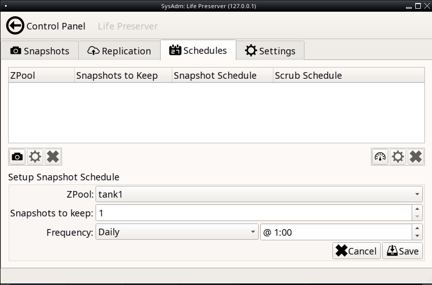

This pane contains the following options:

**ZPool:** select the ZFS pool to snapshot.

**Snapshots to keep:** snapshots are automatically pruned after the specified number of snapshots to prevent snapshots from eventually using up all of your disk space. If you would like to
have multiple versions of files to choose from, select the number of snapshots to keep. Note that auto-pruning only occurs on the snapshots generated by Life Preserver according to the
configured schedule. Auto-pruning will not delete any snapshots you create manually in the "Snapshots" tab.

**Frequency:** use the drop-down menu to select how often snapshots occur. Options include "Daily" (which will allow you to select the time of day), "Hourly" every "30 Minutes", every "10
Minutes", or every "5 Minutes".

Once you have created a snapshot schedule, you can use the "gear" icon next to the "camera" icon to modify the highlighted schedule or the "X" icon to delete the highlighted schedule.

This screen can also be used to manage the ZFS scrub schedule. Scrubs are recommended as they can provide an early indication of a potential disk failure. Since scrubs can be scheduled on a
per-pool basis, if you have multiple pools, create a scrub schedule for each pool.

To schedule when the scrub occurs, click the third icon from the right which will activate the "Setup Scrub Schedule" screen shown in :numref:`Figure %s: Scheduling a Scrub <lpreserver5>`. 

.. _lpreserver5:

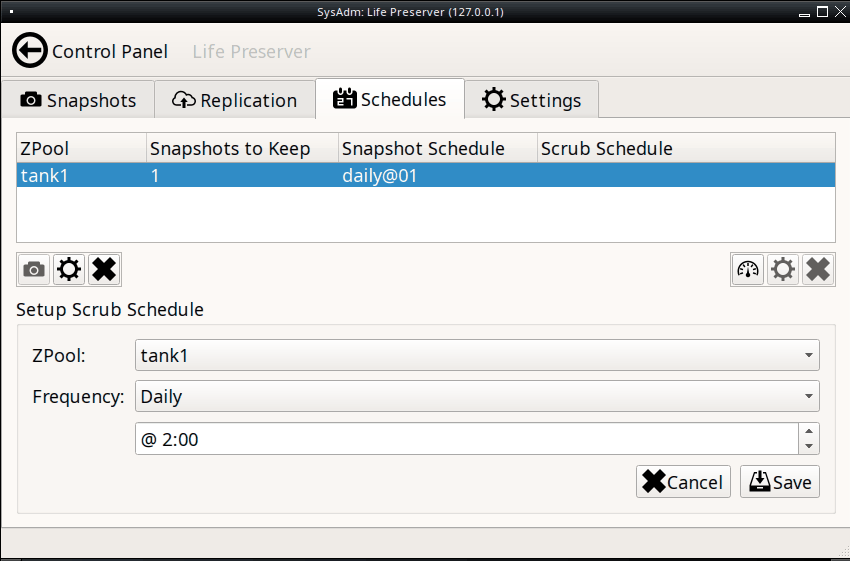

Select the pool from the "ZPool" drop-down menu, then select the "Frequency". Supported frequencies are  "Daily", "Weekly", or "Monthly". If you select "Daily", you can configure the "Hour".
If you select "Weekly", you can configure the "Day of week" and the "Hour". If you select "Monthly", you can configure the "Date" and "Hour". Since a scrub can be disk I/O intensive, it is
recommended to pick a time when the system will not be in heavy use.

Once you have created a scrub schedule, you can use the "gear" icon next to the "schedule scrub" icon to modify the highlighted schedule or the "X" icon to delete the highlighted schedule.

.. index:: configuration, life preserver
.. _Settings Tab:

Settings Tab
-------------

**Disk Usage Warning:**

**Email:**

**Email Trigger:**

**Recursive Management:**

.. _Replication to a FreeNAS® System:

Replication to a FreeNAS® System
--------------------------------

`FreeNAS® <http://www.freenas.org/>`_ is an open source Networked Attached Storage (NAS) operating system based on FreeBSD. This operating system is designed
to be installed onto a USB stick so that it is kept separate from the storage disk(s) installed on the system. You can download the latest STABLE version of
FreeNAS® 9.10 from `download.freenas.org <http://download.freenas.org/9.10/STABLE/>`_ and read its documentation at 
`doc.freenas.org <http://doc.freenas.org/9.10/>`_. 

This section demonstrates how to configure FreeNAS® 9.10 as the backup server for Life Preserver to replicate to. It assumes that you have already installed
this version of FreeNAS® using the installation instructions in the
`FreeNAS® 9.10 Users Guide <http://doc.freenas.org/9.10/freenas_install.html>`_ and are able to access the FreeNAS® system from a web browser.

In order to prepare the FreeNAS® system to store the backups created by Life Preserver, you will need to create a ZFS pool, create and configure the
dataset to store the backups, create a user account that has permission to access that dataset, and enable the SSH service.

In the example shown in :numref:`Figure %s: Creating a ZFS Volume in FreeNAS® <lpreserver10>`, the user has clicked :menuselection:`Storage --> Volumes --> Volume Manager` in order to create
a ZFS pool to hold the backups.

.. _lpreserver10:

.. figure:: images/lpreserver10.png

Input a "Volume Name", drag the slider to select the desired number of available disks, and click the "Add Volume" button. The Volume Manager will automatically
select the optimal layout for both storage capacity and redundancy. In this example, a RAIDZ2 named *volume1* will be created.

.. note:: make sure that the size of the pool is large enough to hold the replicated snapshots. To determine the size of the initial snapshot, run
   :command:`zpool list` on the TrueOS® system and look at the value in the "ALLOC" field. Subsequent snapshots will be smaller and will be the size of the
   data that has changed.

To create the dataset to backup to, click the "+" next to the entry for the newly created volume, then click "Create ZFS Dataset". In the example shown in
:numref:`Figure %s: Creating a ZFS Dataset in FreeNAS® <lpreserver11>`, the "Dataset Name" is *backups*. Click the "Add Dataset" button to create the dataset.

.. _lpreserver11:

.. figure:: images/lpreserver11.png

To create the user account, go to :menuselection:`Account --> Users --> Add User`. In the screen shown in :numref:`Figure %s: Creating a User in FreeNAS® <lpreserver12>`, input a "Username"
that you will later configure Life Preserver to use. Under "Home Directory", use the browse button to browse to the location of the dataset that you made to store the
backups. Input a "Full Name", then input and confirm a "Password". When finished, click the "OK" button to create the user.

.. _lpreserver12:

.. figure:: images/lpreserver12.png

Next, give the user permissions to the dataset by going to :menuselection:`Storage --> Volumes`, click the + next to the name of the volume, click the "+"
next to the name of the dataset, then click "Change Permissions" for the expanded dataset. In the screen shown in :numref:`Figure %s: Setting Permissions in FreeNAS® <lpreserver13a>`, change
the "Owner (user)"and "Owner (group)" to the user that you created. Click "Change" to save the change.

.. _lpreserver13a:

.. figure:: images/lpreserver13a.png

Next, click on "Shell" and type the following command, replacing *dru* and *volume1/backups* with the name of the user, volume, and dataset that you created::

 zfs allow -u dru atime,canmount,clone,compression,create,destroy,hold,mount,mountpoint,promote,receive,rename,send,userprop volume1/backups  

Click the "x" in the upper right corner to close "Shell". Then, to enable the SSH service, go to :menuselection:`Services --> Control Services`, shown in
:numref:`Figure %s: Start SSH in FreeNAS® <lpreserver14>`. 

.. _lpreserver14:

.. figure:: images/lpreserver14.png

Click the red "OFF" button next to SSH to enable that service. Once it turns to a blue "ON", the FreeNAS® system is ready to be used as the backup server.

click the "+SSH" button. Life Preserver will scan the network for systems running SSHD and, if the scan is successful, a pop-up
menu will show the hostnames of the available systems. If multiple systems are running SSH, use the drop-down menu to select the desired system and click "OK". If you instead receive an
error message, check to see if there is a firewall between the TrueOS® and the FreeNAS® system as this scan requires UDP port 5353 to be open on any firewalls running on or between the two
systems.

Once the system is selected, its IP address will be added to the drop-down menu to the left of the "+SSH" button, the port number SSH is listening on will display in the
"SSH Port" menu, and the rest of this screen will be activated. In the example shown in :numref:`Figure %s: Finishing the Configuration <lpreserver24>`, the IP address of the FreeNAS® system
is 192.168.1.73.

.. _lpreserver24:

.. figure:: images/lpreserver24.png

Input the name of the user and the name of the dataset you created on the FreeNAS® system. In this example, the "User Name" is *dru* and the "Remote Dataset" is
*volume1/backups*.

When finished, click "Apply", Life Preserver will check that it can connect to the backup server and will prompt for the password of "User Name". A
second pop-up message will remind you to save the SSH key to a USB stick as this key is required for
:ref:`Restoring the Operating System`.

.. note:: if you don't receive the pop-up message asking for the password, check that the firewall on the backup system, or a firewall within the network, is
   not preventing access to the port number listed in "SSH Port". Also, this pop-up only occurs once. If the password changes or you are not able to successfully login,
   use :menuselection:`Snapshots --> Reset Replication Password` to re-input the password.

Once the SSH login is successful, Life Preserver will begin to replicate snapshots to the remote system at the configured "Frequency". Note that the first replication can
take several hours to complete, depending upon the speed of the network. Subsequent replications will only contain changed data and will be much smaller. You can confirm
that the snapshots have been received by clicking :menuselection:`Storage --> Snapshots` on the FreeNAS® system. This should provide a listing of the replicated datasets,
allowing you to manage the replicated snapshots as described in `Snapshots <http://doc.freenas.org/9.10/freenas_storage.html#snapshots>`_.

Life Preserver uses backend checks so that it is safe to keep making snapshots while a replication is in process. It will not prune any existing snapshots
until the replication is finished and it will not start a second replication before the first replication finishes. 

.. _Restoring the Operating System:

Restoring the Operating System
------------------------------

If you have replicated the system's snapshots to a remote backup
server, you can use a TrueOS® installation media to perform an
operating system restore or to clone another system. Start the
installation as usual until you get to the screen shown in
:numref:`Figure %s: Selecting to Restore/Clone From Backup <restore1>`. 

.. _restore1: 

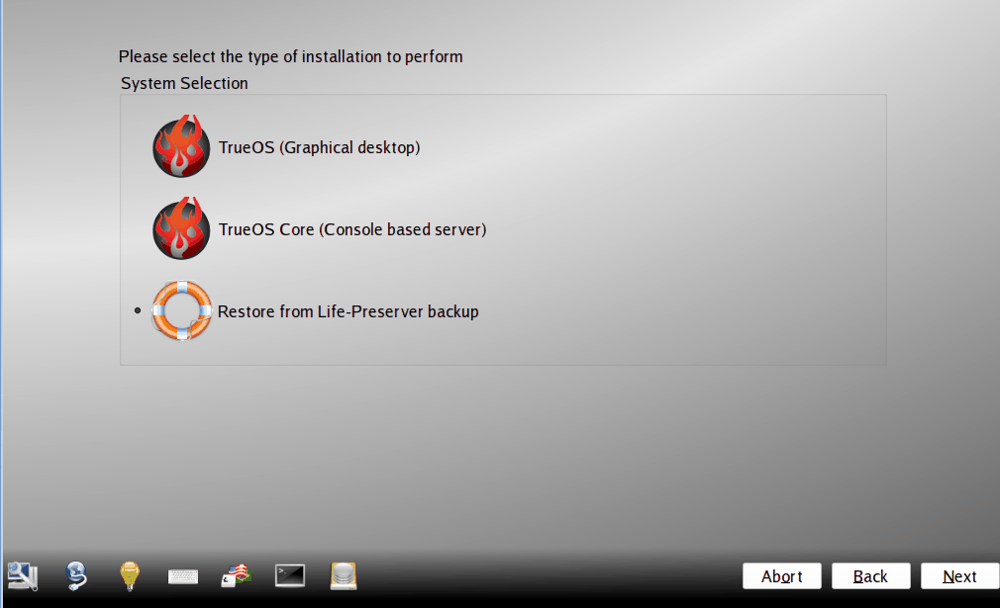

Before you can perform a restore, the network interface must be
configured. Click the "network connectivity" icon (second from the
left) in order to determine if the network connection was
automatically detected. If it was not, refer to the instructions in
:ref:`Network Manager` and make sure that networking is working
before continuing.

Once you are ready, click "Restore from Life-Preserver backup" and the
"Next" button. This will start the Restore Wizard. In the screen shown
in
:numref:`Figure %s: Input the Information for a SSH Restore <restore2>`,
input the IP address of the backup server and the name of the user
account used to replicate the snapshots. If the server is listening on
a non-standard SSH port, change the "SSH port" number. 

.. _restore2: 

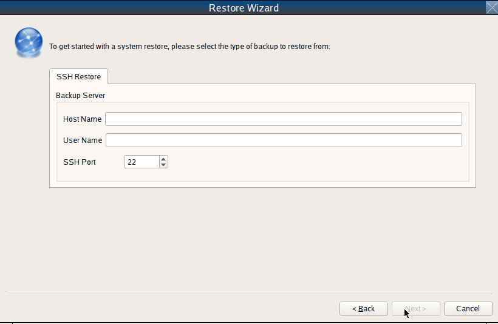

Click "Next" and the wizard will provide a summary of your selections.
If correct, click "Finish"; otherwise, click "Back" to correct them.

Once you click "Finish",
Once the connection to the backup server succeeds, you will be able to select which host to restore. In the example shown in :numref:`Figure %s: Select the Host to Restore <restore4>`,
only one host has been backed up to the replication server.

.. _restore4:

.. figure:: images/restore4.png

After making your selection, click "Next". The restore wizard will provide a summary of which host it will restore from, the name of the user account
associated with the replication, and the hostname of the target system. Click "Finish" and the installer will proceed to the :ref:`Disk Selection Screen`. At
this point, you can click the "Customize" button to customize the disk options. However, in the screen shown in Figure 3.3h, the ZFS datasets will be greyed
out as they will be recreated from the backup during the restore. Once you are finished with any customizations, click "Next" to perform the restore.

.. index:: firewall
.. _Firewall Manager:

Firewall Manager
================

TrueOS® uses the `IPFW firewall <http://www.freebsd.org/cgi/man.cgi?query=ipfw>`_ to protect your system. By default, the firewall is configured to allow all
outgoing connections, but to deny all incoming connection requests. The default rulebase is located in :file:`/etc/ipfw.rules`. Use the Firewall Manager GUI
utility to view and modify the existing firewall rules.

.. note:: typically it is not necessary to change the firewall rules. You should only add rules if you understand the security implications of doing so,
   as any custom rules will be used to allow connections to your computer.

To access the Firewall Manager, click Firewall Manager within SysAdm™ or type :command:`pc-su pc-fwmanager`. You will be prompted to input
your password. :numref:`Figure %s: Firewall Manager Utility <firewall1>` shows the initial screen when you launch this utility.

.. _firewall1:

.. figure:: images/firewall1.png

The "General" tab of this utility allows you to: 

* Determine whether or not the firewall starts when the system boots. Unless you have a reason to do so and understand the security implications, the
  "Enable Firewall on startup" box should be checked so that your system is protected by the firewall.

* "Start", "Stop", or "Restart" the firewall.

* The "Restore Default Configuration" button allows you to return to the original, working configuration.

To add or delete custom firewall rules, click the "Open Ports" tab to open the screen shown in :numref:`Figure %s: Adding a New Firewall Rule <firewall2>`. Note that your custom rules will
allow **incoming** connections on the specified protocol and port number.

.. _firewall2:

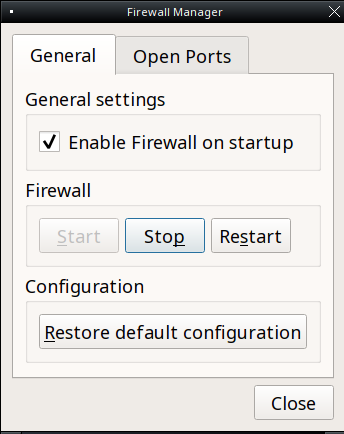

Any rules that you create will appear in this screen. To add a rule, input the port number to open. By default, "tcp" is selected. If the rule is for the
UDP protocol, click the "tcp" drop-down menu and select "udp". Once you have the protocol and port number selected, click the "Open Port" button to add the
new rule to your custom list.

If you have created any custom rules and wish to delete one, highlight the rule to delete and click the "Close Selected Ports" button to remove it from
the custom rules list.

.. note:: whenever you add or delete a custom rule, the rule will not be used until you click the "Restart" button shown in :numref:`Figure %s: Firewall Manager Utility <firewall1>`. Also,
   your custom rules are not used whenever the system is in :ref:`Tor Mode`.

Whenever you create a custom rule, test that your new rule works as expected. For example, if you create a rule to allow incoming SSH connections, try connecting
to your TrueOS® system using :command:`ssh` to verify that the firewall is now allowing the connection.

.. index:: network
.. _Network Manager:

Network Manager
===============

During installation, TrueOS® configures your Ethernet interfaces to use DHCP and provides a screen to :ref:`Connect to a Wireless Network`. In most cases,
this means that your connected interfaces should "just work" whenever you use your TrueOS® system.

For desktops that provide a system tray, a wireless configuration icon will appear if TrueOS® detects a supported wireless card. If you hover over the wireless icon, shown in
:numref:`Figure %s: Wireless Information in System Tray <network1>`, it will indicate if the interface is associated and provide information regarding the IP address, IPv6 address, SSID,
connection strength, connection speed, MAC address, and type of wireless device.

.. _network1:

.. figure:: images/network1.png

If you right-click the wireless icon, you will see a list of detected wireless networks. Simply click the name of a network to associate with it. The
right-click menu also provides options to configure the wireless device, start the Network Manager, restart the network (useful if you need to renew your DHCP
address), and to close the Network Monitor so that the icon no longer shows in the system tray. If you have multiple wireless devices, each will have its own
icon in the system tray. If you do not use one of the devices, click its "Close the Network Monitor" to remove it from the tray.

To view or manually configure all of your network interfaces click "Network Manager" within SysAdm™ or type
:command:`pc-su pc-netmanager`. If a new device has been inserted (e.g. a USB wireless interface), a pop-up message will open when you start Network Manager, indicate the name of the
new device, and ask if you would like to enable it. Click "Yes" and the new device will be displayed with the list of network interfaces that TrueOS® recognizes. In the example seen in
:numref:`Figure %s: Network Manager <network2a>`, the system has one Intel Ethernet interface that uses the *em* driver and an Intel wireless interface that uses the
*wlan* driver.

.. _network2a:

.. figure:: images/network2a.png

The rest of this section describes each tab of the Network Manager utility and demonstrate how to view and configure the network settings for both
Ethernet and wireless devices. It will then present some common troubleshooting scenarios, known issues, and suggestions for when a device does not have a
built-in driver.

.. index:: network
.. _Ethernet Adapters:

Ethernet Adapters
-----------------

If you highlight an Ethernet interface in the "Devices" tab and either click the "Configure" button or double-click the interface name, you will see the
screen shown in :numref:`Figure %s: Network Settings for an Ethernet Interface <network3>`.

.. _network3:

.. figure:: images/network3.png

There are two ways to configure an Ethernet interface: 

1. **Use DHCP:** this method assumes that your Internet provider or network assigns your addressing information automatically using the DHCP protocol. Most
   networks are already setup to do this. This method is recommended as it should "just work". 

2. **Manually type in the IP addressing information:** this method requires you to understand the basics of TCP/IP addressing or to know which IP address you
   should be using on your network. If you do not know which IP address or subnet mask to use, you will have to ask your Internet provider or network
   administrator.

By default, TrueOS® will attempt to obtain an address from a DHCP server. If you wish to manually type in your IP address, check the box "Assign static IP
address". Type in the IP address, using the right arrow key or the mouse to move between octets. Then, double-check that the subnet mask ("Netmask") is the
correct value and change it if it is not.

If the Ethernet network uses 802.1x authentication, check the box "Enable WPA authentication" which will enable the "Configure WPA" button. Click this button
to select the network and to input the authentication values required by the network.

By default, the "Disable this network device" box is unchecked. If you check this checkbox, TrueOS® will immediately stop the interface from using the
network. The interface will remain inactive until this checkbox is unchecked.

The "Advanced" tab, seen in :numref:`Figure %s: Advanced Tab of an Ethernet Interface's Network Settings <network4>`, allows advanced users to change their
:wikipedia:`MAC address` or to automatically obtain an :wikipedia:`IPv6 address`. Both boxes should remain checked unless
you are an advanced user who has a reason to change the default MAC or IPv6 address and you understand how to input an appropriate replacement address.

.. _network4:

.. figure:: images/network4.png

The "Info" tab, seen in :numref:`Figure %s: Info Tab of an Ethernet Interface's Network Settings <network5>`, will display the current network address settings and some traffic statistics.

.. _network5:

.. figure:: images/network5.png

If you make any changes within any of the tabs, click the "Apply" button to activate them. Click the "OK" button when you are finished to go back to the main
Network Manager window.

You can repeat this procedure for each network interface that you wish to view or configure.

.. index:: network
.. _Wireless Adapters:

Wireless Adapters
-----------------

If your wireless interface does not automatically associate with a wireless network, you probably need to configure a wireless profile that contains the security settings required by the
wireless network. Double-click the wireless icon in the system tray or highlight the wireless interface displayed in the "Devices" tab of Network Manager and click the "Configure"
button. :numref:`Figure %s: Wireless Configuration <network6>` demonstrates that this system's wireless interface is currently
associated with the wireless network listed in the "Configured Network Profiles" section.

.. _network6: 

.. figure:: images/network6.png

To associate with a wireless network, click the "Scan" button to receive the list of possible wireless networks to connect to. Highlight the network you wish
to associate with and click the "Add Selected" button. If the network requires authentication, a pop-up window will prompt you for the authentication details.
Input the values required by the network then click the "Close" button. TrueOS® will add an entry for the network in the "Configured Network Profiles"
section.

If the network is hidden, click the "Add Hidden" button, input the name of the network in the pop-up window, and click "OK".

If you add multiple networks, use the arrow keys to place them in the desired connection order. TrueOS® will try to connect to the first profile in the list
and will move down the list in order if it is unable to connect. When finished, click the "Apply" button. A pop-up message will indicate that TrueOS® is
restarting the network. If all went well, there should be an IP address and status of "associated" when you hover over the wireless icon in the system tray.
If this is not the case, double-check for typos in your configuration values and read the section on :ref:`Troubleshooting Network Settings`. 

TrueOS® supports the types of authentication shown in :numref:`Figure %s: Configuring Wireless Authentication Settings <network7>`. You can access this screen (and change your authentication
settings) by highlighting an entry in the "Configured Network Profiles" section and clicking the "Edit" button.

.. _network7: 

.. figure:: images/network7.png

This screen allows you to configure the following types of wireless security: 

* **Disabled:** if the network is open, no additional configuration is required.

* **WEP:** this type of network can be configured to use either a hex or a plaintext key and Network Manager will automatically select the type of key that it has detected.
  If you click "WEP" then the "Configure" button, you will see the screen shown in :numref:`Figure %s: WEP Security Settings <network8>`. Type the key into both network key boxes. If the key
  is complex, check the "Show Key" box to make sure that the passwords are correct and that they match. Uncheck this box when you are finished to replace the characters in the key with the
  "*" symbol. A wireless access point that uses WEP can store up to 4 keys and the number in the key index indicates which key you wish to use.

* **WPA Personal:** this type of network uses a plaintext key. If you click "WPA Personal" then the "Configure" button, you will see the screen shown in
  :numref:`Figure %s: WPA Personal Security Settings <network9>`. Type in the key twice to verify it. If the key is complex, you can check the "Show Key" box to make sure the passwords match.

* **WPA Enterprise:** if you click "WPA Enterprise" then the "Configure" button, you will see the screen shown in :numref:`Figure %s: WPA Enterprise Security Settings <network10>`. Select
  the authentication method ("EAP-TLS", "EAP-TTLS", or "EAP-PEAP"), input the EAP identity, browse for the CA certificate, client certificate and private key file, and input and
  verify the password.

.. note:: if you are unsure which type of encryption is being used, ask the person who setup the wireless router. They should also be able to give you the
   value of any of the settings seen in these configuration screens.

.. _network8: 

.. figure:: images/network8.png

.. _network9: 

.. figure:: images/network9.jpg

.. _network10:

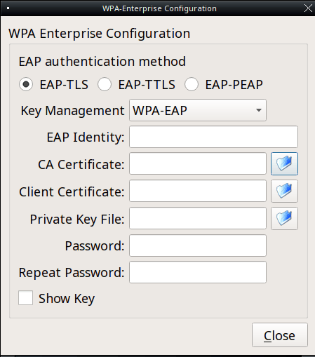

If you wish to disable this wireless interface, check the box "Disable this wireless device". This setting can be desirable if you want to temporarily prevent
the wireless interface from connecting to untrusted wireless networks.

The "Advanced" tab, seen in :numref:`Figure %s: Advanced Tab of a Wireless Interface <network11>`, allows you to configure the following: 

* a custom MAC address. This setting is for advanced users and requires the "Use hardware default MAC address" box to be unchecked.

* how the interface receives its IP address information. If the network contains a DHCP server, check the box "Obtain IP automatically (DHCP)". Otherwise,
  input the IP address and subnet mask to use on the network.

* the country code. This setting is not required if you are in North America. For other countries, check the "Set Country Code" box and select your country
  from the drop-down menu.

.. _network11:

.. figure:: images/network11.png

The "Info" tab, seen in :numref:`Figure %s: Info Tab of a Wireless Interface <network12>`, shows the current network status and statistics for the wireless interface.

.. _network12:

.. figure:: images/network12.png

.. index:: network
.. _Network Configuration (Advanced):

Network Configuration (Advanced)
--------------------------------

The "Network Configuration (Advanced)" tab of the Network Manager is seen in
:numref:`Figure %s: Network Configuration (Advanced) tab <network13a>`. The displayed information is for the currently
highlighted interface. If you wish to edit these settings, make sure that the interface that you wish to configure is highlighted in the "Devices" tab.

.. _network13a: 

.. figure:: images/network13a.png

If the interface receives its IP address information from a DHCP server, this screen allows you to view the received DNS information. If you wish to override
the default DNS settings or set them manually, check the "Enable Custom DNS" box. You can then set the following: 

**DNS 1:** the IP address of the primary DNS server. If you do not know which IP address to use, click the "Public servers" button to select a public DNS
server.

**DNS 2:** the IP address of the secondary DNS server.

**Search Domain:** the name of the domain served by the DNS server.

If you wish to change or set the default gateway, check the "Enable Custom Gateway" box and input the IP address of the default gateway.

The following settings can be modified in the IPv6 section: 

**Enable IPv6 support:** if this box is checked, the specified interface can participate in IPv6 networks.

**IPv6 gateway:** the IPv6 address of the default gateway used on the IPv6 network.

**IPv6 DNS 1:** the IPv6 address of the primary DNS server used on the IPv6 network. If you do not know which IP address to use, click the "Public servers"
button to select a public DNS server.

**IPv6 DNS 2:** the IPv6 address of the secondary DNS server used on the IPv6 network.

The "Misc" section allows you to configure these options: 

**System Hostname:** the name of your computer. It must be unique on your network.

**Enable wireless/wired failover via lagg0 interface:** the  interface allows you to seamlessly switch between using an Ethernet interface and a wireless
interface. If you want this functionality, check this box.

.. note:: some users experience problems using lagg. If you have problems connecting to a network using an interface that previously worked, uncheck this box
   and remove any references to "lagg" in your :file:`/etc/rc.conf` file.

**Domain Name:** if the system is in a domain, you can specify it here.

If you make any changes within this window, click the "Apply" button to apply them.

.. index:: network
.. _Proxy Settings:

Proxy Settings 
---------------

The "Proxy" tab, shown in :numref:`Figure %s: Proxy Settings Configuration <network14>`, is used when your network requires you to go through a proxy server in order to access the Internet.

.. _network14: 

.. figure:: images/network14.png

Check the "Proxy Configuration" check box to activate the settings. The follow settings can be configured in this screen: 

**Server Address:** enter the IP address or hostname of the proxy server.

**Port Number:** enter the port number used to connect to the proxy server.

**Proxy Type:** choices are "Basic" (sends the username and password unencrypted to the server) and "Digest" (never transfers the actual password across the
network, but instead uses it to encrypt a value sent from the server). Do not select "Digest" unless you know that the proxy server supports it.

**Specify a Username/Password:** check this box and input the username and password if they are required to connect to the proxy server.

Proxy settings are saved to the :file:`/etc/profile` and :file:`/etc/csh.cshrc` files so that they are available to the TrueOS® utilities as well as any
application that uses :command:`fetch`.

Applications that did not come with the operating system, such as web browsers, may require you to configure proxy support using that application's
configuration utility.

If you apply any changes to this tab, a pop-up message will warn that you may have to logout and back in in order for the proxy settings to take effect.

.. index:: network
.. _Configuring a Wireless Access Point:

Configuring a Wireless Access Point
-----------------------------------

If you click the entry for a wireless device, as seen in :numref:`Figure %s: Setup Access Point Option <network15>`, the right-click menu has an option to "Setup Access Point". 

.. _network15:

.. figure:: images/network15.png

:numref:`Figure %s: Access Point Basic Setup <network16>` shows the configuration screen if you select "Setup Access Point". 

.. _network16:

.. figure:: images/network16.png

This screen contains two options: 

- **Visible Name:** this is the name that will appear when users scan for available access points.

- **Set Password:** setting a WPA password is optional, though recommended if you only want authorized devices to use the access point. If used, the password
  must be a minimum of 8 characters.

:numref:`Figure %s: Access Point Advanced Setup <network17>` shows the "Advanced Configuration (optional)" screen.

.. _network17:

.. figure:: images/network17.png

The settings in this screen are optional and allow you to fine-tune the access point's configuration: 

- **Base IP:** the IP address of the access point.

- **Netmask:** the associated subnet mask for the access point.

- **Mode:** available modes are *11g* (for 802.11g), *11ng* (for 802.11n on the 2.4-GHz band), or *11n* (for 802.11n).

- **Channel:** select the channel to use.

- **Country Code:** the two letter country code of operation.

.. index:: network
.. _Troubleshooting Network Settings:

Troubleshooting Network Settings 
---------------------------------

While Ethernet networking usually "just works" on a TrueOS® system, users sometimes encounter problems, especially when connecting to wireless networks.
Sometimes the problem is due to a configuration error; sometimes a driver is buggy or is not yet available. This section is meant to help you pinpoint the
problem so that you can either fix it yourself or give the developers the information they need to fix or create the driver.

When troubleshooting your network configuration, use the following files and commands.

The :file:`/etc/rc.conf` file is read when the system boots up. In order for the system to configure an interface at boot time, an entry must exist for it in
this file. Entries are automatically created for you during installation for each interface that is active. An entry will be added (if it does not exist) or
modified (if it already exists) when you configure an interface using Network Manager.

Here is an example of the :file:`rc.conf` entries for an ethernet driver (*em0*) and a wireless driver (*run0*)::

 ifconfig_em0="DHCP"
 wlans_run0="wlan0"
 ifconfig_wlan0="WPA SYNCDHCP"

When reading through your own file, look for lines that begin with *ifconfig*. For a wireless interface, also look for lines containing *wlans*.

.. note:: unlike Linux interface driver names, FreeBSD/TrueOS® interface driver names indicate the type of chipset. Each driver name has an associated man
   page where you can learn which devices use that chipset and if there are any configuration options or limitations for the driver. When reading the man
   page, do not include the interface number. For the above example, you could read :command:`man em` and :command:`man run`.

The :file:`/etc/wpa_supplicant.conf` file is used by wireless interfaces and contains the information needed to connect to a WPA network. If this file does
not already exist, it is created for you when you enter the "Configuration" screen of a wireless interface.

The :command:`ifconfig` command shows the current state of your interfaces. When reading through its output, check that your interface is listed, has a status
of "active", and has an IP address. Here is a sample :command:`ifconfig` output showing the entries for the *re0* Ethernet interface and the *run0* wireless
interface::

 re0: flags=8843<UP,BROADCAST,RUNNING,SIMPLEX,MULTICAST> metric 0 mtu 1500 options=389b<RXCSUM,TXCSUM,VLAN_MTU,VLAN_HWTAGGING,VLAN_HWCSUM,WOL_UCAST,WOL_MCAST,WOL_MAGIC>
 ether 60:eb:69:0b:dd:4d
 inet 192.168.1.3 netmask 0xffffff00 broadcast 192.168.1.255
 media: Ethernet autoselect (100baseTX <full-duplex>)
 status: active

 run0: flags=8843<UP,BROADCAST,RUNNING,SIMPLEX,MULTICAST> metric 0 mtu 2290
 ether 00:25:9c:9f:a2:30
 media: IEEE 802.11 Wireless Ethernet autoselect mode 11g
 status: associated

 wlan0: flags=8843<UP,BROADCAST,RUNNING,SIMPLEX,MULTICAST> metric 0 mtu 1500
 ether 00:25:9c:9f:a2:30
 media: IEEE 802.11 Wireless Ethernet autoselect (autoselect)
 status: no carrier
 ssid "" channel 10 (2457 MHz 11g)
 country US authmode WPA1+WPA2/802.11i privacy ON deftxkey UNDEF
 txpower 0 bmiss 7 scanvalid 60 protmode CTS wme roaming MANUAL bintval 0

In this example, the ethernet interface (*re0*) is active and has an IP address. However, the wireless interface (*run0*, which is associated with *wlan0*)
has a status of "no carrier" and does not have an IP address. In other words, it has not yet successfully connected to the wireless network.

The :command:`dmesg` command lists the hardware that was probed during boot time and will indicate if the associated driver was loaded. If you wish to search
the output of this command for specific information, pipe it to :command:`grep` as seen in the following examples::

 dmesg | grep Ethernet
 re0: <RealTek 8168/8111 B/C/CP/D/DP/E PCIe Gigabit Ethernet> port 0xc000-0xc0ff mem 0xd0204000-0xd0204fff,0xd0200000-0xd0203fff irq 17 at device 0.0 on pci8
 re0: Ethernet address: 60:eb:69:0b:dd:4d

 dmesg |grep re0
 re0: <RealTek 8168/8111 B/C/CP/D/DP/E PCIe Gigabit Ethernet> port 0xc000-0xc0ff mem 0xd0204000-0xd0204fff,0xd0200000-0xd0203fff irq 17 at device 0.0 on pci8
 re0: Using 1 MSI messages
 re0: Chip rev. 0x28000000
 re0: MAC rev. 0x00000000 miibus0: <MII bus> on re0
 re0: Ethernet address: 60:eb:69:0b:dd:4d
 re0: [FILTER]
 re0: link state changed to DOWN
 re0: link state changed to UP

 dmesg | grep run0
 run0: <1.0> on usbus3
 run0: MAC/BBP RT3070 (rev 0x0201), RF RT2020 (MIMO 1T1R), address 00:25:9c:9f:a2:30
 run0: firmware RT2870 loaded

If your interface does not show up in :command:`ifconfig` or :command:`dmesg`, it is possible that a driver for this card is not provided with the operating
system. If the interface is built into the motherboard of the computer, you can use the :command:`pciconf` command to find out the type of card::

 pciconf -lv | grep Ethernet
 device = 'Gigabit Ethernet NIC(NDIS 6.0) (RTL8168/8111/8111c)'

 pciconf -lv | grep wireless
 device = 'Realtek RTL8191SE wireless LAN 802.11N PCI-E NIC (RTL8191SE?)'

In this example, there is a built-in Ethernet device that uses a driver that supports the RTL8168/8111/8111c chipsets. As we saw earlier, that driver is
*re0*. The built-in wireless device was also found but the *?* indicates that a driver for the RTL8191SE chipset was not found. A web search for "FreeBSD
RTL8191SE" will give an indication of whether a driver exists (perhaps in a version of FreeBSD that has not been released yet) or if a driver is being
developed.

The FreeBSD Handbook chapter on `Wireless Networking <http://www.freebsd.org/doc/en_US.ISO8859-1/books/handbook/network-wireless.html>`_ provides a good overview of how
wireless works and offers some troubleshooting suggestions.

.. index:: mount
.. _Mount Tray:

Mount Tray
==========

The Mount Tray graphical application is used to facilitate the mounting and unmounting of filesystems on internal disks, USB storage devices, and optical
media. It is included in the system tray, meaning that in can be used within any window manager that provides a system tray. If you remove the icon from the
system tray, you can re-add by clicking "Mount Tray" within SysAdm™ or by typing :command:`pc-mounttray &`.

.. note:: if you prefer to mount devices from the command line, see the section on :ref:`pc-sysconfig`. 

In the example shown in :numref:`Figure %s: Mount Tray Example <mount1>`, a USB device and a music CD are currently inserted and the user has clicked "More Options" to view the
available options.

.. _mount1:

.. figure:: images/mount1.png

When you first insert a USB drive, a "New Device" message should appear in the system tray. If you click Mount Tray and the filesystem on the device is
recognized, it will automatically mount and the contents of the device will be displayed in the default file manager for the desktop. Alternately, right-click
Mount Tray and click the "Mount" button to mount the device and its contents. A list of available file managers can be found in
:ref:`Files and File Sharing` and Table 1.3a lists which filesystems are supported by Mount Tray. If the filesystem is not recognized, a
*?* will appear next to the device. When the device is mounted, its "Mount" button changes to "Eject". When you are finished using the device, press this
"Eject" button and wait for the message indicating that it is safe to remove the device before physically removing the device. Note that you will receive a
"Device Busy" message if the file manager is still open with the device's contents. If you receive this message, press "No" to close it, close the file
manager, then press "Eject" again. This will ensure that the device is cleanly unmounted.

.. note:: while Mount Tray will allow you to physically remove a USB device without unmounting it first, it is recommended to always "Eject" the drive first.

When you first insert an optical media, such as a music CD or DVD video, a message will indicate that an optical disk is available and, by default, the default player
application will open so that you can play the contents of the disk. The default player that is used depends upon which applications have been installed, where
`VLC <http://www.videolan.org/vlc/>`_ takes precedence, followed by `SMPlayer <http://smplayer.sourceforge.net/>`_. If you close the player, you can click
the "Play" button shown in :numref:`Figure %s: Mount Tray Example <mount1>` to restart it.

The following options are available in the "More Options" menu: 

* **Open Media Directory:** this will only appear if a filesystem has been mounted and can be used to open the default file manager if it does not automatically open.
  If the desktop does not provide a default file manager, Mount Tray will provide an "open with" dialogue so that you can select the utility to use to browse the
  contents of the USB device.

* **View Disk Usage:** in the example shown in :numref:`Figure %s: View Disk Usage Using Mount Tray <mount2>`, a UFS-formatted USB device is mounted at :file:`/Media/STECH-1d`. The
  amount of disk space used by the system hard drive and the USB drive is shown in both GB and as a percentage of available disk space. The Mount Tray will turn yellow if
  disk space is over 70% and red if disk space is over 90%. If the internal disk drives are partitioned with any other filesystems, these will also appear in Mount Tray.

* **Rescan Devices:** click this option if an entry for the USB device does not automatically appear.

* **Load ISO File:** used to mount an ISO to a memory disk. It will prompt for your password then open a browse menu so that you can browse to the location of
  the :file:`.iso` file. Once the file is selected and mounted, its contents will be displayed in the default file manager. When you are finished browsing the
  contents, close the file manager and click the "Eject" button for the memory device in Mount Tray and enter your password when prompted. As the ISO is
  unmounted, the memory disk is also detached from the system.

**Change Settings:** as seen in :numref:`Figure %s: Configure Disk Space Check <mount3a>`, this screen allows you to configure whether or not optical disks automatically open using
  the default player, whether or not Mount Tray automatically rechecks the disk space used by mounted devices and how often to perform that check, and whether or not
  Mount Tray checks disk space when a disk is mounted.

* **Close Tray:** click this option to remove Mount Tray from the system tray.

.. _mount2:

.. figure:: images/mount2.png

.. _mount3a:

.. figure:: images/mount3a.png

.. index:: mount
.. _pc-sysconfig:

pc-sysconfig
------------

The previous section described TrueOS®'s graphical mount utility. This graphical utility has a command-line backend, :command:`pc-sysconfig`, which can be
used directly from the command line on TrueOS® systems, window managers without a system tray, or by users who prefer to use the command line.

For usage information, run the command without any options::

 pc-sysconfig
 pc-sysconfig: Simple system configuration utility
 Usage: "pc-sysconfig <command 1> <command 2> ..."
 Available Information Commands:
 "list-remdev": List all removable devices attached to the system.
 "list-mounteddev": List all removable devices that are currently mounted
 "list-audiodev": List all available audio devices
 "probe-netdrives": List all the available shared drives on the local network
 "list-mountednetdrives": List all the available shared drives which can currently be browsed (assuming the remote system is running properly)
 "supportedfilesystems": List all the filesystems that are currently detected/supported by pc-sysconfig
 "devinfo <device> [skiplabel]": Fetch device information (Filesystem, Label, Type)
 "devsize <device>": Fetch device space (must be mounted)
 "usingtormode": [TRUE/FALSE] Returns whether the system is routing all traffic through TOR
 "getscreenbrightness": Returns the brightness of the first controllable screen as a percentage (0-100) or "[ERROR]" otherwise
 "systemcansuspend": [TRUE/FALSE] Returns whether the system supports the S3 suspend state

 Available Action Commands:
  "mount <device> [<filesystem>] [<mountpoint>]":
   -- This will mount the removable device on the system (with user-accessible permissions if the mountpoint needs to be created)
   -- If there is no filesystem set (or "auto" is used), it will try to use the one that is auto-detected for the device
   -- If there is no mountpoint set, it will assign a new mountpoint within the "/media/" directory based on the device label
  "unmount <device or mountpoint> [force]":
   -- This will unmount the removable device from the system
   -- This may be forced by using the "force" flag as well (not recommended for all cases)
   -- If the input device is a memory disk (/dev/md*), then it will automatically remove the memory disk from the system as well
  "mountnet <IP of remote host> <Name of remote host>":
   -- This will setup the remote host to be browsable on the local system with the given name
   -- Note that the remote host is automatically mounted/unmounted based on local user activity
   -- To see where these network drives are mounted and can be browsed, see the output of "list-mountednetdrives"
  "unmountnet <IP of remote host>":
   -- This will remove the remote host from being browsable on the local system
  "load-iso <absolute path to the *.iso file>":
   -- This will load the ISO file as a memory disk on the system (making it available for mounting/browsing)
  "setdefaultaudiodevice <pcm device>":
   -- This will set the given pcm device (I.E. "pcm3") as the default audio output device
  "setscreenbrightness <percentage>":
   -- This will set the brightness of all the available screens to the given percentage
   -- It is also possible to adjust the current value by supplying a [+/-] before the number
   -- For example: using "+5" as the percentage will increase the brightness by 5% for each screen
   -- This returns "[ERROR]" or "[SUCCESS]" based on whether the change could be performed
  "suspendsystem": Puts the system into the suspended state (S3)

For example, to see a listed of the supported filesystems, use::

 pc-sysconfig supportedfilesystems
 FAT, NTFS, EXT, CD9660, UFS, REISERFS, XFS, UDF, ZFS