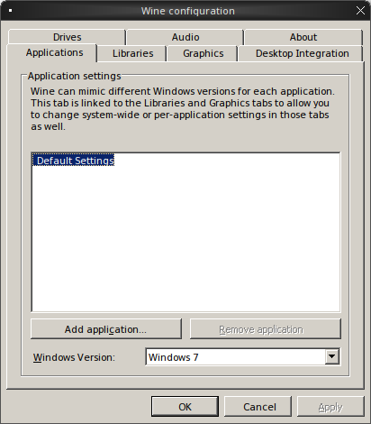
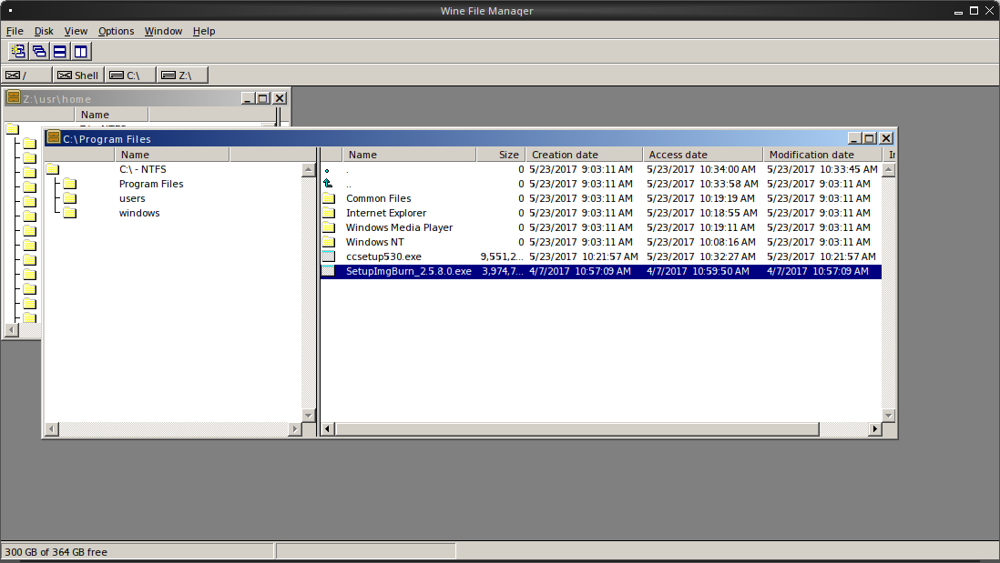

.. index:: using
.. _Using TrueOS:

Using |trueos|
**************

This chapter discusses using |trueos| for many common tasks, in addition
to linking to resources for the |lumina| desktop environment and
|sysadm|.

.. index:: Lumina
.. _Lumina:

|lumina|
========

The Lumina Desktop Environment (|lumina| for short) is a lightweight,
XDG-compliant, BSD-licensed desktop environment focused on streamlining
work efficiency with minimal system overhead. It is specifically
designed for |trueos| and FreeBSD, but has also been ported to many
other BSD and Linux operating systems. It is based on the Qt graphical
toolkit and the Fluxbox window manager, and uses a small number of X
utilities for various tasks, such as :command:`numlockx` and
:command:`xscreensaver`.

|lumina|'s features include:

* Very little system overhead.

* Does not require any of the desktop implementation frameworks such as
  DBUS, policykit, consolekit, systemd, or HALD.

* Provides many :lumbk:`utilities <luminautl.html>` for configuring the
  desktop environment.

* Provides an interface design based on
  :lumbk:`plugins <luminaplugins.html>`. The user can make their desktop
  as light or heavy as they wish by choosing which plugins to have
  running on their desktop and panels. This plugin-based system is
  similar to Android or other modern operating systems.

* A single, easy-to-use
  :lumbk:`Lumina Configuration <luminaconfig.html>` utility controls all
  the different configuration options for the desktop in one location.

* Intelligent *favorites* system for creating quick shortcuts to
  applications, files, and directories.

* ZFS file restore functionality with
  :lumbk:`Insight File Manager <luminautl.html#insight-file-manager>`.

* Multi-monitor support includes the
  :lumbk:`Lumina Xconfig <luminautl.html#xconfig>` graphical utility for
  adding or removing monitors from the |lumina| session.

* Simple :lumbk:`system controls <luminaintro.html#initial-settings>`
  through the system tray for configuring audio volume, screen
  brightness, battery status/notifications, and workspace switching.

* Total system search capabilities through the resource friendly
  :lumbk:`Lumina Search <luminautl.html#lumina-search>` utility.

* Screenshot functionality through
  :lumbk:`Lumina Screenshot <luminautl.html#screenshot>`, which is tied
  to the :kbd:`Print Screen` key by default.

Refer to the `Lumina Handbook <https://lumina-desktop.org/handbook/>`_
for detailed descriptions of every element of |lumina|.

.. index:: Sysadm
.. _SysAdm:

|sysadm|
========

Beginning with |trueos| 11, most of the system management utilities
previously available in the |pcbsd| Control Panel have been
rewritten to use the |sysadm|
`API <https://api.sysadm.us/getstarted.html>`_. This API is designed to
simplify managing any FreeBSD, |trueos| desktop, or |trueos| server
system over a secure connection from any operating system with the
|sysadm| application installed. |sysadm| is built into |trueos|, but
downloadable packages for other operating systems are available from the
`SysAdm Website <https://sysadm.us/>`_.

The |sysadm| `Client Handbook <https://sysadm.us/handbook/client/>`_
is recommended for new |trueos| users, while the
`Server <https://sysadm.us/handbook/server/>`_ and
`API Reference <https://api.sysadm.us/>`_ guides are available for
advanced users.

Here is an overview of the different elements controlled by |sysadm|:

**Application Management**

* :sysclbk:`AppCafe <appcafe>`: A graphical interface for installing and
  managing FreeBSD packages.

* :sysclbk:`Update Manager <update-manager>`: A graphical interface for
  keeping both |trueos| and its installed applications up to date.

**SysAdm Server Settings**

* :sysclbk:`Managing Remote Connections <managing-remote-connections>`:
  This includes creating and managing SSL keys or certificate bundles.

**System Management**

* :sysclbk:`Boot Environment Manager <boot-environment-manager>`: Create
  and manage ZFS Boot Environments (BEs). Options to *activate*,
  *clone*, *mount*, and *unmount* BEs are available in this screen.

* :sysclbk:`Mouse Settings <mouse-settings>`: Tool for adjusting the
  settings of a connected mouse.

* :sysclbk:`Firewall Manager <firewall-manager>`: This is used to
  configure all ports and firewalls for |trueos|.

* :sysclbk:`Service Manager <service-manager>`: This allows you to view
  and configure all the system's installed services.

* :sysclbk:`Task Manager <task-manager>`: A graphical window into system
  resource usage and a list of all running applications.

* :sysclbk:`User Manager <user-manager>`: This utility is used to users
  and groups. This includes adding
  :sysclbk:`PersonaCrypt <personacrypt>` encryption to specific users.

**Utilities**

* :sysclbk:`Life Preserver <life-preserver>`: This utility is used for
  system backups with ZFS snapshots. Life Preserver provides easy
  management, replication, and scheduling of ZFS snapshots.

.. index:: fonts
.. _Fonts:

Fonts
=====

|trueos| installs with `Google Noto <http://www.google.com/get/noto/>`_
which provides multi-lingual Sans and Serif fonts. Many other fonts are
available from |appcafe|. Typically, fonts installed using |appcafe| do
not require any additional configuration to "just work".

If you have downloaded or purchased a collection of font, |trueos| can
be configured to also use those fonts. Become the superuser and copy
the downloaded font to the :file:`/usr/local/share/fonts/` directory.
Then, run :samp:`fc-cache -f -v /usr/local/share/fonts/name_of_font`
to refresh the fonts cache.

.. index:: sound mixer tray
.. _Sound Mixer Tray:

Sound Mixer Tray
================

|trueos| includes a graphical utility for managing the sound card's
mixer settings. The utility is accessed by clicking the
:guilabel:`speaker` icon in the system tray.

:numref:`Figure %s <sound1>` shows an example of highlighting the
:guilabel:`Output` option after opening the Sound Mixer. If the
system has one audio output, the :guilabel:`Output` submenu is not
displayed. To change the default audio output, click its entry in
:guilabel:`Output`.

.. _sound1:

.. figure:: images/sound1.png
   :scale: 100%

   Output Options

:numref:`Figure %s <sound2>` shows the :guilabel:`Mixer` menu:

.. _sound2:

.. figure:: images/sound2.png
   :scale: 100%

   Mixer Controls

The :guilabel:`Mixer Controls` screen provides sliders to modify the
left and right channels that control volume, pcm (the sound driver),
the speaker, the microphone, the recording level, the input level, and
the output level. Each control can be muted or unmuted by clicking
:guilabel:`Mute` or :guilabel:`Unmute`, depending on its current mute
state.

:numref:`Figure %s <sound3>` shows the :guilabel:`System Configuration`
tab of the :guilabel:`Mixer`.

.. _sound3:

.. figure:: images/sound3.png
   :scale: 100%

   System Sound Configuration

This tab contains several options:

* **Recording Device:** Use the drop-down menu to select the device to
  use for recording sound.

* **Default Tray Device:** Use the drop-down menu to set the default
  slider to display in the system tray.

* **Audio Output Channel:** Use the drop-down menu to change the sound
  device and use :guilabel:`Test` to determine if sound is working.
  This is sometimes necessary when changing audio devices. For example,
  when connecting a USB headset, |trueos| detects the new device and
  automatically changes the audio device to the USB input. However, when
  inserting a headset into an audio jack, the system may not detect this
  new input, meaning the default device has changed manually.

The :guilabel:`File` menu can be used to quit this mixer screen or to
close both this screen and remove the icon from the system tray.

.. note:: To re-add the mixer icon after removing it,
   type :samp:`pc-mixer &` in a command line. Alternately, open this
   application without adding it back to the system tray by typing
   :samp:`pc-mixer -notray`.

|trueos| provides full
`PulseAudio <https://www.freedesktop.org/wiki/Software/PulseAudio/>`_
support, which can be configured using the :guilabel:`Configuration`
menu in the :guilabel:`Mixer`. There are options for accessing the
:guilabel:`PulseAudio Mixer` and :guilabel:`PulseAudio Settings`, as
well as an option for restarting PulseAudio. These utilities can be
used to configure discoverable network sound devices and mixer levels.

.. index:: Flash
.. _Flash plugin:

Flash Plugin
============

|trueos| supports using a Flash plugin for those browsers/applications
that use Flash. To begin using this plugin, search for and install
"linux-flashplayer" using |appcafe|. Alternately, type
:samp:`[samp@examp] ~% sudo pkg install linux-flashplayer` in a command
line and enter the root password when requested.

The "nspluginwrapper" is also required when using Flash. Install it with
|appcafe| or by typing
:samp:`[samp@examp] ~% sudo pkg install nspluginwrapper` in a command line.

Once *linux-flashplayer* and *nspluginwrapper* are installed, configure them
by opening a command line and typing this command:

.. code-block:: none

 % nspluginwrapper -v -a -i

 Auto-install plugins from /usr/local/lib/browser_plugins
 Looking for plugins in /usr/local/lib/browser_plugins
 Auto-install plugins from /usr/local/lib/browser_plugins/linux-flashplayer
 Looking for plugins in /usr/local/lib/browser_plugins/linux-flashplayer
 Install plugin /usr/local/lib/browser_plugins/linux-flashplayer/libflashplayer.so
   into /usr/home/tmoore/.mozilla/plugins/npwrapper.libflashplayer.so
 Auto-install plugins from /usr/home/tmoore/.mozilla/plugins
 Looking for plugins in /usr/home/tmoore/.mozilla/plugins

In this example, Flash is configured and ready for use with the Firefox browser.
To confirm Flash is usable, open Firefox and type *about:plugins* in the address bar.
An *Installed plugins* page displays, listing *Shockwave Flash* an installed plugin.
See :numref:`Figure %s <flash1>` for an example.

.. _flash1:

.. figure:: images/flash1.png
   :scale: 100%

   "about:plugins" Example

.. index:: multimedia
.. _Multimedia:

Multimedia
==========

|trueos| is pre-configured to support most multimedia formats and makes
it easy to install most open source media applications using |appcafe|.

After installing a web browser, most media formats become playable,
including YouTube™ videos, Internet radio, and many trailer and movie
sites. When encountering a file unplayable in a web browser or media
player, it is likely in a proprietary format which requires a
licensing fee or restricts distribution of the codec required to play
the media format.

.. note:: When troubleshooting Java™ or Flash® for your browser, please
   refer to the
   `FreeBSD browser <https://www.freebsd.org/doc/en_US.ISO8859-1/books/handbook/desktop-browsers.html>`_
   documentation, which has more complete instructions for installing
   Java™ and Flash® plugins with specific browsers.

|appcafe| contains several dozen applications for playing and editing
multimedia. It includes these popular applications:

* `aTunes <http://www.atunes.org/?page_id=5>`_: Full-featured audio
  player and manager which can play mp3, ogg, wma, wav, flac, mp4 and
  radio streaming, allowing users to easily edit tags, organize music
  and rip audio CDs.

* `Audacity <https://sourceforge.net/projects/audacity/?lang=en>`_:
  Multilingual audio editor and recorder.

* `DeaDBeeF <http://deadbeef.sourceforge.net/screenshots.html>`_:
  Music player supporting most audio formats.

* `Decibel <http://decibel.silent-blade.org/index.php?n=Main.Screenshots>`_:
  Audio player built around a highly modular structure which lets the
  user completely disable unneeded features. Able to play CDs directly.

* `gtkpod <http://gtkpod.org/libgpod/>`_: Graphical user interface for
  the Apple iPod.

* `Miro <http://www.getmiro.com/download/screenshots/>`_: HD video
  player which can play almost any video file and offers over 6,000
  free Internet TV shows and video podcasts.

* `SMPlayer <http://www.smplayer.info/>`_: Universal media player which
  can handle any media format and play audio CDs, DVDs, (S)VCDs,
  TV/radio cards, YouTube™ and SHOUTcast™ streams.

* `VLC media player <http://www.videolan.org/vlc/>`_: Open Source
  cross-platform multimedia player capable of playing most multimedia
  files, DVD and CD formats, and some streaming protocols.

.. index:: Kodi
.. _Kodi:

Kodi
----

`Kodi, formerly known as XBMC, <https://kodi.tv/>`_ is a GPL-licensed
software media player and entertainment hub for digital media. It can
play most audio and video formats, CDs and DVDs from a disk or image
file, and even files inside ZIP and RAR archives. It can scan all of
your media and automatically create a personalized library with album
covers, descriptions, and fan art.

Kodi can be installed using |appcafe|. Once installed, an entry for
:guilabel:`Kodi media center` is added to
:guilabel:`Browse Applications`. Kodi is also started by typing
:command:`kodi` from a command prompt.

If you have never used Kodi before, take some time to skim through the
`Kodi Wiki Manual <http://kodi.wiki/>`_. This post about using PC-BSD as
a `home theater <https://forums.pcbsd.org/thread-19799.html>`_
contains a useful how-to for configuring Kodi.

.. index:: Plex
.. _PlexHome Theater:

PlexHome Theater
----------------

`Plex Home Theater <https://www.plex.tv/>`_ is a centralized media
playback system. The central Plex Media Server streams media to many
Plex player Apps which are used to view your media library and watch
shows.

To install PlexHome Theater, use |appcafe|. Once installed, an entry
should be added to the :guilabel:`Multimedia` section of the application
menu of your desktop. PlexHome Theater can also be started by typing
:command:`plexhometheater` from a command prompt.

Once installed, an entry for :guilabel:`Plex Home Theater` is also added
to the login manager so you can login directly to the home theater
instead of a desktop.

The first time running or logging into Plex Home Theater, a wizard
checks the audio settings and signs into your Plex account. If you have
no Plex account, create one at `plex.tv <https://www.plex.tv/>`_. The
wizard provides a PIN code and an URL to enter the code. Once the PIN is
entered, the wizard connects and signs you in. Now it is possible to
search for and watch media. To exit Plex, click :guilabel:`<` and
:guilabel:`Quit`.

.. index:: usb automounter
.. _Automounter:

Automounter
===========

.. tip:: The *Mount Tray* has been replaced by the new **Automounter**.

The automounter, based on the :command:`devd` and :command:`automount`
utilities, facilitates mounting and unmounting USB storage devices and
optical media. It also conforms to an **XDG** standard to allow the
addition of new features. The automounter is part of the default
|trueos| installation, but is generally invisible until a new device is
attached to the system.

Currently, the automounter ignores internal hard drives (sata, ide) and
networking shares. It does support many different filesystems:

* cd9660

* exFAT (Requires :file:`mount.exfat-fuse`. Possible intermittent
  detection issues.)

* ext2

* ext4 (Requires :file:`ext4fuse`)

* FAT32

* MSDOSFS

* MTPfs (Requires :file:`simple-mtpfs`)

* NTFS (Requires :file:`ntfs-3g`)

* ReiserFS

* UDF

* UFS

* XFS

.. warning:: Linux based filesystems may have some limitations. See
   :numref:`Table %s <filesys support>` for more details.

To engage the automounter, attach a USB storage device or insert optical
media to the system. The automounter detects the device by ID and adds
icons to the desktop, as seen in :numref:`Figure %s <automnt1>`:

.. _automnt1:

.. figure:: images/automnt1.png
   :scale: 65%

   USB icons added to desktop via the automounter. Hovering over the
   icon displays the actual device name and filesystem type.

.. tip:: The appearance of these icons do **not** mean the device is
   mounted. Devices are only mounted when the user begins to interact
   with the device.

Either navigating to a device or beginning copy operations mounts the
device. The device is unmounted by the **autounmountd** service after
the user navigates away and/or file copy operations stop.

For example, the above image shows USB drive "FreeNAS" attached to
the system. After double-clicking the desktop icon,
"Insight File Manager" opens to the device's location,
:file:`autofs/da0`. While :guilabel:`Insight` opens, the automounter
mounts the device. After closing :guilabel:`Insight`, the device is also
unmounted and safe to remove from the system.

In the CLI, the automounter adds a :file:`.desktop` file to
:file:`/media` when a new USB/Optical device is added. Open the
:file:`.desktop` file with :command:`xdg-open` or
:command:`lumina-open`. When the device is removed, the symlink is
immediately removed from :file:`/media`.

.. note:: The :file:`/autofs/*` directories are not cleaned when the
   device is removed. However, after device removal the directories are
   no longer associated with the device in the backend. For this reason,
   :file:`/media` is more useful to identify which devices are attached
   to the system.

Alternately, all device names are added to the :file:`/autofs`
directory. Attached devices are also accessed by navigating to
:file:`/autofs/<devicename>`.

Known limitations:

* UFS permissions. These permissions are preserved on USB media. To
  allow multiple users access to files from a UFS stick, those files'
  permissions need to be set to *read/write by any user* (777).

* ZFS pools are not yet supported. This is under investigation to
  ascertain if it can ever work with :command:`automount`.

* Optical Media links are not yet created on the desktop. Optical media
  is accessible by navigating to :file:`/autofs`.

* Any file system with limited FreeBSD support (HFS or EXT) remain at
  the same level of limited support.

* exFAT detection issues are being investigated.

Coming soon:

* Optical media support for the desktop

* Android device support

* Possible support for ZFS pools

.. index:: Freebsd ports
.. _FreeBSD Ports:

FreeBSD Ports
=============

Use :command:`git` to fetch the FreeBSD ports tree on a local system.
Specifically, the |trueos| branch of the FreeBSD ports tree is pulled,
which is regularly updated against the base FreeBSD ports tree.

.. note:: These commands must be run as the superuser or **root**.

When fetching ports for the first time:

:samp:`# git clone http://github.com/trueos/freebsd-ports.git /usr/ports`

To update an existing local ports directory:

.. code-block:: none

 # cd /usr/ports
 # git pull

.. index:: files, file sharing
.. _Files and File Sharing:

Files and File Sharing
======================

Several file managers are available for installation using
|appcafe|. :numref:`Table %s <filemanagers>` provides an overview
of several popular file managers. To launch an installed file manager,
type its name as it appears in the :guilabel:`Application` column. To
install the file manager, use |appcafe| to install the package name
listed in the :guilabel:`Install` column. To research a file manager's
capabilities, start with the URL listed in its :guilabel:`Screenshot`
column.

.. tabularcolumns:: |>{\RaggedRight}p{\dimexpr 0.30\linewidth-2\tabcolsep}
                    |>{\RaggedRight}p{\dimexpr 0.30\linewidth-2\tabcolsep}
                    |>{\RaggedRight}p{\dimexpr 0.40\linewidth-2\tabcolsep}|

.. _filemanagers:

.. table:: Available File Managers
   :class: longtable

   +-------------+--------------+-------------------------------------------------------------+
   | Application | Install      | Screenshots                                                 |
   +=============+==============+=============================================================+
   | dolphin     | kde-baseapps | `<https://userbase.kde.org/Dolphin>`_                       |
   +-------------+--------------+-------------------------------------------------------------+
   | emelfm2     | emelfm2      | `<http://emelfm2.net/wiki/ScreenShots>`_                    |
   +-------------+--------------+-------------------------------------------------------------+
   | caja        | caja         | `<http://mate-desktop.org/gallery/1.6/>`_                   |
   +-------------+--------------+-------------------------------------------------------------+
   | mucommander | mucommander  | `<http://www.mucommander.com/index.html>`_                  |
   +-------------+--------------+-------------------------------------------------------------+
   | nautilus    | nautilus     | `<https://projects.gnome.org/nautilus/screenshots.html>`_   |
   +-------------+--------------+-------------------------------------------------------------+
   | pcmanfm     | pcmanfm      | `<https://wiki.lxde.org/en/PCManFM>`_                       |
   +-------------+--------------+-------------------------------------------------------------+
   | thunar      | thunar       | `<http://docs.xfce.org/xfce/thunar/start>`_                 |
   +-------------+--------------+-------------------------------------------------------------+
   | xfe         | xfe          | `<http://roland65.free.fr/xfe/index.php?page=screenshots>`_ |
   +-------------+--------------+-------------------------------------------------------------+

When working with files on a |trueos| system, save your files to your
home directory. Since most of the files outside your home directory are
used by the operating system and applications, you should not delete or
modify any files outside of your home directory unless confident in what
you are doing.

:numref:`Table %s <dirstructure>` summarizes the directory structure
found on a |trueos| system. :command:`man hier` explains this directory
structure in more detail.

.. tabularcolumns:: |>{\RaggedRight}p{\dimexpr 0.40\linewidth-2\tabcolsep}
                    |>{\RaggedRight}p{\dimexpr 0.60\linewidth-2\tabcolsep}|

.. _dirstructure:

.. table:: |TrueOS| Directory Structure
   :class: longtable

   +-------------------------+------------------------------------------+
   | Directory               | Contents                                 |
   +=========================+==========================================+
   | /                       | Pronounced as "root" and represents the  |
   |                         | beginning of the directory structure     |
   +-------------------------+------------------------------------------+
   | /bin/                   | Applications (binaries) that were        |
   |                         | installed with the operating system      |
   +-------------------------+------------------------------------------+
   | /boot/                  | Stores the startup code, including       |
   |                         | kernel modules (like hardware drivers)   |
   +-------------------------+------------------------------------------+
   | /compat/linux/          | Linux software compatibility files       |
   +-------------------------+------------------------------------------+
   | /dev/                   | Files which are used by the operating    |
   |                         | system to access devices                 |
   +-------------------------+------------------------------------------+
   | /etc/                   | Operating system configuration files     |
   +-------------------------+------------------------------------------+
   | /etc/X11/               | The :file:`xorg.conf` configuration      |
   |                         | file                                     |
   +-------------------------+------------------------------------------+
   | /etc/rc.d/              | Operating system startup scripts         |
   +-------------------------+------------------------------------------+
   | /home/                  | Subdirectories for each user account;    |
   |                         | each user should store their files in    |
   |                         | their own home directory                 |
   |                         |                                          |
   +-------------------------+------------------------------------------+
   | /lib/                   | Operating system libraries needed for    |
   |                         | applications                             |
   +-------------------------+------------------------------------------+
   | /libexec/               | Operating system libraries and binaries  |
   +-------------------------+------------------------------------------+
   | /media/                 | Mount point for storage media such as    |
   |                         | DVDs and USB drives                      |
   +-------------------------+------------------------------------------+
   | /mnt/                   | Another mount point                      |
   +-------------------------+------------------------------------------+
   | /proc/                  | The proc filesystem required by some     |
   |                         | Linux applications                       |
   +-------------------------+------------------------------------------+
   | /rescue/                | Emergency recovery programs              |
   +-------------------------+------------------------------------------+
   | /root/                  | Administrative account's home directory  |
   +-------------------------+------------------------------------------+
   | /sbin/                  | Operating system applications;           |
   |                         | typically only the superuser can run     |
   |                         | these applications                       |
   +-------------------------+------------------------------------------+
   | /tmp/                   | Temporary file storage; files stored     |
   |                         | here may disappear when the system       |
   |                         | reboots                                  |
   +-------------------------+------------------------------------------+
   | /usr/bin/               | Contains most of the command line        |
   |                         | programs available to users              |
   +-------------------------+------------------------------------------+
   | /usr/local/             | Contains the binaries, libraries,        |
   |                         | startup scripts, documentation, and      |
   |                         | configuration files used by applications |
   |                         | installed from ports or packages         |
   +-------------------------+------------------------------------------+
   | /usr/local/share/fonts/ | System wide fonts for graphical          |
   |                         | applications                             |
   +-------------------------+------------------------------------------+
   | /usr/local/share/icons/ | System wide icons                        |
   +-------------------------+------------------------------------------+
   | /usr/ports/             | Location of system ports tree            |
   |                         | (if installed)                           |
   +-------------------------+------------------------------------------+
   | /usr/share/             | System documentation and man pages       |
   +-------------------------+------------------------------------------+
   | /usr/sbin/              | Command line programs for the superuser  |
   +-------------------------+------------------------------------------+
   | /usr/src/               | Location of system source code           |
   |                         | (if installed)                           |
   +-------------------------+------------------------------------------+
   | /var/                   | Files that change (vary), such as log    |
   |                         | files and print jobs                     |
   +-------------------------+------------------------------------------+

|trueos| provides built-in support for accessing Windows shares, meaning
you only have to decide which utility you prefer to access existing
Windows shares on your network.

:numref:`Table %s <windows shares utils>` summarizes some of the
available utilities.

.. tabularcolumns:: |>{\RaggedRight}p{\dimexpr 0.30\linewidth-2\tabcolsep}
                    |>{\RaggedRight}p{\dimexpr 0.30\linewidth-2\tabcolsep}
                    |>{\RaggedRight}p{\dimexpr 0.40\linewidth-2\tabcolsep}|

.. _windows shares utils:

.. table:: Utilities that Support Windows Shares
   :class: longtable

   +-------------+--------------+-----------------------------------------------------+
   | Application | Install      | How to Access Existing Shares                       |
   +=============+==============+=====================================================+
   | dolphin     | kde-baseapps | In the left frame, click                            |
   |             |              | :menuselection:`Network --> Samba Shares`, then the |
   |             |              | Workgroup name; if the network requires a username  |
   |             |              | and password to browse for shares, set this in      |
   |             |              | :menuselection:`System Settings --> Sharing` while  |
   |             |              | in KDE or type :command:`systemsettings` and click  |
   |             |              | :guilabel:`Sharing` while in another desktop        |
   +-------------+--------------+-----------------------------------------------------+
   | smb4k       | smb4k-kde4   |                                                     |
   +-------------+--------------+-----------------------------------------------------+
   | mucommander | mucommander  | Click                                               |
   |             |              | :menuselection:`Go --> Connect to server --> SMB`;  |
   |             |              | input the NETBIOS name of server, name of share,    |
   |             |              | name of domain (or workgroup), and the share's      |
   |             |              | username and password                               |
   +-------------+--------------+-----------------------------------------------------+
   | nautilus    | nautilus     | Click                                               |
   |             |              | :menuselection:`Browse Network --> Windows Network` |
   +-------------+--------------+-----------------------------------------------------+
   | thunar      | thunar       | In the left frame, click                            |
   |             |              | :menuselection:`Network --> Windows Network`        |
   +-------------+--------------+-----------------------------------------------------+

.. index:: network manager
.. _Network Manager:

Network Manager
===============

During installation, |trueos| configures any connected Ethernet
interfaces to use DHCP and provides a screen to
:ref:`Connect to a Wireless Network`. In most cases, this means
connected interfaces should "just work" whenever using a |trueos|
system.

After installation, a wireless configuration icon appears in the system
tray if |trueos| detects a supported wireless card. Hover over the
wireless icon shown in :numref:`Figure %s <network1>` to see an
indication if the interface is associated and more information
regarding the IP address, IPv6 address, SSID, connection strength,
connection speed, MAC address, and type of wireless device.

.. _network1:

.. figure:: images/network1.png
   :scale: 100%

   System Tray Wireless Information

If you right-click the wireless icon, a list of detected wireless
networks displays. Click the name of a network to associate with it.
The right-click menu also provides options to configure the wireless
device, start the Network Manager, restart the network (useful to renew
your DHCP address), route the network connection through Tor (to browse
the Internet anonymously as described in :ref:`Tor Mode`), and close the
Network Monitor so the icon no longer shows in the system tray.

To view or manually configure a network interface, click
:guilabel:`Start the Network Manager` within |sysadm| or type
:samp:`sudo pc-netmanager`. If a new device has been inserted, such as a
USB wireless interface, a pop-up message opens when Network
Manager starts. This message indicates the name of the new device and
asks if you want to enable it. Click :guilabel:`Yes` and the new device
is displayed with the list of network interfaces that |trueos|
recognizes. In the example seen in :numref:`Figure %s <network2>`, the
system has one Intel Ethernet interface that uses the **em** driver and
an Intel wireless interface that uses the **wlan** driver.

.. _network2:

.. figure:: images/network2.png
   :scale: 100%

   Network Manager

The rest of this section describes each tab of the Network Manager
utility and demonstrates how to view and configure the network settings
for both Ethernet and wireless devices.

.. index:: network devices tab
.. _Network Devices:

Network Devices
---------------

If you highlight an Ethernet interface in the :guilabel:`Devices` tab
and either click :guilabel:`Configure` or double-click the interface
name, the screen shown in :numref:`Figure %s <network3>` appears.

.. _network3:

.. figure:: images/network3.png
   :scale: 100%

   Network Settings for an Ethernet Interface

There are two ways to configure an Ethernet interface:

1. **Use DHCP:** This method assumes your Internet provider or network
   router assigns addressing information automatically using the DHCP
   protocol. Most networks are built in this manner. This method is
   recommended as it should "just work".

2. **Manually type in the IP addressing information:** This method
   requires an understanding of the basics of TCP/IP addressing or
   knowledge of which IP address to use on your network. If you do not
   know which IP address or subnet mask to use, ask your Internet
   provider or network administrator.

By default, |trueos| attempts to obtain an address from a DHCP server.
If you wish to manually type in your IP address, check
:guilabel:`Assign static IP address`. Type in the IP address, using the
right arrow key or the mouse to move between octets. Then, double-check
the subnet mask (**Netmask**) is the correct value. If not, change it
again.

If the Ethernet network uses 802.1x authentication, check
:guilabel:`Enable WPA authentication`, which enable the
:guilabel:`Configure WPA` button. Click this button to select the
network and input the authentication values required by the network.

By default, :guilabel:`Disable this network device` is unchecked. If
this checkbox is filled, |trueos| immediately stops the interface
from using the network. The interface remains inactive until this
checkbox is unchecked.

The :guilabel:`Advanced` tab, seen in :numref:`Figure %s <network4>`,
allows advanced users to manually input a
:wiki:`MAC address <MAC_address>` or
:wiki:`IPv6 address <IPv6_address>`. Both boxes should remain checked in
order to automatically receive these addresses, unless you are an
advanced user with reason to change the default MAC or IPv6 address and
an understanding of how to input an appropriate replacement address.

.. _network4:

.. figure:: images/network4.png
   :scale: 100%

   Ethernet Interface Network Settings - Advanced

The :guilabel:`Info` tab, seen in :numref:`Figure %s <network5>`,
displays the current network address settings and some traffic
statistics.

.. _network5:

.. figure:: images/network5.png
   :scale: 100%

   Ethernet Interface Network Settings - Info

If any changes are made within any of the tabs, click :guilabel:`Apply`
to activate them. Click :guilabel:`OK` when finished to return to the
main Network Manager window.

Repeat this procedure for each desired network interface.

.. index:: wireless adapters
.. _Wireless Adapters:

Wireless Adapters
-----------------

If the wireless interface does not automatically associate with a
wireless network, the wireless profile containing the security settings
required by the network will need to be configured. Double-click the
wireless icon in the system tray or highlight the wireless interface
displayed in the :guilabel:`Devices` tab of Network Manager and click
:guilabel:`Configure`. :numref:`Figure %s <network6>` demonstrates this
system's wireless interface is currently associated with the wireless
network listed in the :guilabel:`Configured Network Profiles` section.

.. _network6:

.. figure:: images/network6.png
   :scale: 100%

   Wireless Configuration

To associate with a wireless network, click :guilabel:`Scan` to view a
list of connectable wireless networks. Highlight the desired network to
associate with and click :guilabel:`+Add Selected`. If the network
requires authentication, a pop-up window prompts you for the
authentication details. Input the values required by the network, then
click :guilabel:`Close`. |trueos| then adds an entry for the network in
the :guilabel:`Configured Network Profiles` section.

If the network is hidden, click :guilabel:`+Add Hidden`, input the name
of the network in the pop-up window, and click :guilabel:`OK`.

If multiple networks are added, use the arrow keys to place them in the
desired connection order. |trueos| attempts to connect to networks in
order from first to last in the connection list. When prioritizing
connections, click :guilabel:`Apply`. A pop-up message then indicates
|trueos| is restarting the network. Next, an an IP address and status of
**associated** appears when hovering over the wireless icon in the
system tray. If this does not happen, double-check for errors in the
configuration values and read the Troubleshooting section on
:ref:`Network Help`.

|trueos| supports the types of authentication shown in
:numref:`Figure %s <network7>`. Access this screen and change
authentication settings by highlighting an entry in the
:guilabel:`Configured Network Profiles` section and clicking
:guilabel:`Edit`.

.. _network7:

.. figure:: images/network7.png
   :scale: 100%

   Configuring Wireless Authentication Settings

This screen provides configuration of different types of wireless
security:

* **Disabled:** If the network is open, no additional configuration is
  required.

* **WEP:** This type of network can be configured to use either a hex
  or a plaintext key and Network Manager will automatically select the
  type of detected key. If :guilabel:`WEP` is pressed, then
  :guilabel:`Configure`, the screen in :numref:`Figure %s <network8>`
  appears. Type the key into both :guilabel:`Network Key` boxes. If
  the key is complex, check :guilabel:`Show Key` to ensure the passwords
  are matching and correct. Uncheck this box when finished to replace
  the characters in the key with bullets. A wireless access point using
  WEP can store up to 4 keys and the number in the :guilabel:`key index`
  indicates which desired key to use.

  .. _network8:

  .. figure:: images/network8.png
     :scale: 100%

     WEP Security Settings

* **WPA Personal:** This type of network uses a plaintext key. If you
  click :guilabel:`WPA Personal` then :guilabel:`Configure`, the screen
  shown in :numref:`Figure %s <network9>` appears. Type in the key twice
  to verify it. If the key is complex, check :guilabel:`Show Key` to
  ensure the passwords match.

  .. _network9:

  .. figure:: images/network9.png
     :scale: 100%

     WPA Personal Security Settings

* **WPA Enterprise:** If you click :guilabel:`WPA Enterprise` then
  :guilabel:`Configure`, the screen shown in
  :numref:`Figure %s <network10>` appears. Select the
  :guilabel:`EAP Authentication Method`, input the EAP identity, browse
  for the CA certificate, client certificate and private key file, and
  input and verify the password.

  .. _network10:

  .. figure:: images/network10.png
     :scale: 100%

     WPA Enterprise Security Settings

.. note:: If unsure which type of encryption is being used, ask the
   person who setup the wireless router. They should also be able to
   provide the value of any settings seen in these configuration
   screens.

To disable this wireless interface, check
:guilabel:`Disable this wireless device` in the :guilabel:`General` tab
for the device. This setting is helpful when temporarily preventing the
wireless interface from connecting to untrusted wireless networks.

The :guilabel:`Advanced` tab, seen in :numref:`Figure %s <network11>`,
allows configuring several options:

* **Custom MAC address:** This setting is for advanced users and
  requires :guilabel:`Use hardware default MAC address` to be unchecked.

* **Interface receiving IP address information:** If the network
  contains a DHCP server, check
  :guilabel:`Obtain IP automatically (DHCP)`. Otherwise, input the IP
  address and subnet mask to use on the network.

* **Country code:** This setting is not required if in North America.
  For other countries, check :guilabel:`Set Country Code` and select
  your country from the drop-down menu.

.. _network11:

.. figure:: images/network11.png
   :scale: 100%

   Wireless Interface - Advanced

The :guilabel:`Info` tab, seen in :numref:`Figure %s <network12>`, shows
the current network status and statistics for the wireless interface.

.. _network12:

.. figure:: images/network12.png
   :scale: 100%

   Wireless Interface - Info

.. index:: advanced network configuration
.. _Network Configuration (Advanced):

Network Configuration (Advanced)
--------------------------------

The :guilabel:`Network Configuration (Advanced)` tab of the Network
Manager is seen in :numref:`Figure %s <network13>`.
The displayed information is for the currently highlighted interface.
To edit these settings, ensure the interface to configure is highlighted
in the :guilabel:`Devices` tab.

.. _network13:

.. figure:: images/network13.png
   :scale: 100%

   Network Configuration - Advanced

If the interface receives its IP address information from a DHCP
server, this screen allows viewing of the received DNS information. To
override the default DNS settings or set them manually, check
:guilabel:`Enable Custom DNS`. You can then set:

* **DNS 1:** The IP address of the primary DNS server. If unsure which
  IP address to use, click :guilabel:`Public servers` to select a public
  DNS server.

* **DNS 2:** The IP address of the secondary DNS server.

* **Search Domain:** The name of the domain served by the DNS server.

To change or set the default gateway, check
:guilabel:`Enable Custom Gateway` box and input the IP address of the
desired gateway.

Several settings can be modified in the IPv6 section:

* **Enable IPv6 support:** If this box is checked, the specified
  interface can participate in IPv6 networks.

* **IPv6 gateway:** The IPv6 address of the default gateway used on the
  IPv6 network.

* **IPv6 DNS 1:** The IPv6 address of the primary DNS server used on the
  IPv6 network. If unsure which IP address to use, click
  :guilabel:`Public servers` to select a public DNS server.

* **IPv6 DNS 2:** The IPv6 address of the secondary DNS server used on
  the IPv6 network.

The :guilabel:`Misc` section has more options to configure:

* **System Hostname:** The name of your computer. It must be unique on
  your network.

* **Domain Name:** If the system is in a domain, specify it here.

* **Enable wireless/wired failover via lagg0 interface:** This
  interface allows seamless switching between using an Ethernet
  interface and a wireless interface. Check the box to enable this
  functionality.

.. note:: Some users experience problems using lagg. If you have
   problems connecting to a network using an interface which previously
   worked, uncheck this box and remove any references to :command:`lagg`
   from :file:`/etc/rc.conf`.

If any changes are made within this window, click :guilabel:`Apply` to
save them.

.. index:: proxy settings
.. _Proxy Settings:

Proxy Settings
--------------

The :guilabel:`Proxy` tab, shown in :numref:`Figure %s <network14>`, is
used when the network requires going through a proxy server to access
the Internet.

.. _network14:

.. figure:: images/network14.png
   :scale: 100%

   Proxy Settings Configuration

Check :guilabel:`Proxy Configuration` to activate the settings. Some
settings can be configured in this screen:

* **Server Address:** Enter the IP address or hostname of the proxy
  server.

* **Port Number:** Enter the port number used to connect to the proxy
  server.

* **Proxy Type:** Choices are **Basic** (sends the username and
  password unencrypted to the server) and **Digest** (never transfers
  the actual password across the network, but instead uses it to encrypt
  a value sent from the server). Do not select **Digest** unless the
  proxy server supports it.

* **Specify a Username/Password:** Check this box and input the username
  and password if they are required to connect to the proxy server.

Proxy settings are saved to the :file:`/etc/profile` and
:file:`/etc/csh.cshrc` files so they are available to both the |trueos|
utilities and any application using :command:`fetch`.

Applications not packaged with the operating system, such as web
browsers, may require configuring proxy support using that application's
configuration utility.

If you apply any changes to this tab, a pop-up message warns the user
may have to log out and back in for the proxy settings to take effect.

.. index:: configure wireless access point
.. _Configuring a Wireless Access Point:

Configuring a Wireless Access Point
-----------------------------------

Right-click the entry for a wireless device, as seen in
:numref:`Figure %s <network15>`, and choose
:guilabel:`Setup Access Point`.

.. _network15:

.. figure:: images/network15.png
   :scale: 100%

   Setup Access Point

:numref:`Figure %s <network16>` shows the configuration screen if
:guilabel:`Setup Access Point` is selected.

.. _network16:

.. figure:: images/network16.png
   :scale: 100%

   Access Point Basic Setup

The :guilabel:`Basic Setup` tab of this screen contains two options:

* **Visible Name:** This is the name appearing when users scan for
  available access points.

* **Set Password:** Setting a WPA password is optional, though
  recommended to only allow authorized devices to use the access point.
  If used, the password must be a minimum of 8 characters.

:numref:`Figure %s <network17>` shows the
:guilabel:`Advanced Configuration (optional)` screen.

.. _network17:

.. figure:: images/network17.png
   :scale: 100%

   Access Point Advanced Setup

The settings in this screen are optional and allow for fine-tuning the
access point's configuration:

* **Base IP:** The IP address of the access point.

* **Netmask:** The associated subnet mask for the access point.

* **Mode:** Available modes are **11g** (for 802.11g), **11ng** (for
  802.11n on the 2.4-GHz band), or **11n** (for 802.11n).

* **Channel:** Select the channel to use.

* **Country Code:** The two letter country code of operation.

.. index:: Tor
.. _Tor Mode:

Tor Mode
--------

Tor mode uses `Tor <https://www.torproject.org/>`_,
`socat <http://www.dest-unreach.org/socat/>`_, and a built-in script
which automatically creates the necessary firewall rules to enable and
disable Tor mode at the user's request. While in Tor mode, the firewall
redirects all outgoing *port 80* (HTTP), *443* (HTTPS), and DNS traffic
through the Tor transparent proxy network.

To start Tor mode, right-click the network icon in the system tray and
check :guilabel:`Route through TOR`. Enter your password via the pop-up
shown in :numref:`Figure %s <tor1>`. If activated correctly, |trueos|
opens a new browser window directed to https://check.torproject.org

.. _tor1:

.. figure:: images/tor1.png
   :scale: 100%

   Enabling Tor Mode

If you have never used the Tor network before, it is recommended to
review the `Tor FAQ <https://www.torproject.org/docs/faq.html.en>`_.

The system remains in Tor mode until manually disabled. To disable Tor
mode, right-click the network icon and uncheck
:guilabel:`Route through Tor`.

To enable and disable Tor mode from the command line or on a desktop
with no system tray, use these commands:

* :samp:`sudo enable-tor-mode` enables tor mode.

* :samp:`sudo disable-tor-mode` disables tor mode.

.. index:: windows emulation
.. _Windows Emulation:

Windows Emulation
=================

`Wine <https://wiki.winehq.org/Main_Page>`_ is an application which
allows the creation of a Windows environment for installing Windows
software. This can be useful if your favorite Windows game or
productivity application has not yet been ported to Linux or BSD.

Wine is not guaranteed to work with every Windows application. You can
search for desired applications in the :guilabel:`Browse Apps` section
of the `Wine application database <https://appdb.winehq.org/>`_. The
`Wine wiki <https://wiki.winehq.org/Main_Page>`_ contains resources to
get started and troubleshooting reference material if problems are
encountered with a Windows application.

Wine can be installed using |appcafe|. After installing, it can be
started by typing :command:`winecfg` in the command line. The first time
running this utility, it may prompt to install additional required
packages. If prompted, click :guilabel:`Install` in the pop-up menu.

The initial Wine configuration menu is shown in
:numref:`Figure %s <wine1>`.

.. _wine1:

   Wine Configuration Menu

Click :guilabel:`Add application` to browse to the application's
installer file. By default, the contents of the hard drive will be
listed under *drive_c*. If the installer is on a CD/DVD, use the
drop-down menu to browse to the
:menuselection:`home directory --> *.wine --> dosdevices` folder. The
contents of the CD/DVD should be listed under *d:*. If they are not,
the most likely reason is your CD/DVD was not automatically mounted by
the desktop. To mount the media, type
:samp:`mount -t cd9660 /dev/cd0 /cdrom` as the superuser.

The system then accesses the media and you can now select the installer
file. Once selected, click :guilabel:`Apply` then :guilabel:`OK` to exit
the configuration utility.

To install the application, type :command:`winefile` to see the screen
shown in :numref:`Figure %s <wine2>`.

.. _wine2:

   Installing the Application Using :command:`winefile`

Click the button representing the drive which contains the installer and
double-click on the installation file (e.g. :file:`setup.exe`). The
installer then launches to allow installing the application as on a
Windows system.

.. note:: You may need need to unmount a CD/DVD before it ejects. As the
   superuser, type :samp:`umount /mnt`.

Once the installation is complete, browse to the application's location.
:numref:`Figure %s <wine3>` shows an example of running Internet
Explorer within :command:`winefile`.

.. _wine3:

.. figure:: images/wine3.png
   :scale: 100%

   Running the Installed Application

.. index:: security
.. _Security:

Security
========

Your |trueos| system is secure by default. This section provides an
overview of the built-in security features. If you want to know more
about increasing the security of your system beyond its current level,
additional resources are also provided in this section.

The security features built into |trueos| include:

* **Naturally immune to viruses and other malware:** Most viruses are
  written to exploit Windows systems and do not understand the binaries
  or paths found on a |trueos| system. Antivirus software is still
  available in the Security section of |appcafe|, as this is useful when
  sending or forwarding email attachments to users running other
  operating systems.

* **Potential for serious damage is limited:** File and directory
  ownership and permissions along with separate user and group functions
  mean, as an ordinary user, any program executed is only granted the
  abilities and access of the user. A user not a member of the *wheel*
  group can not switch to administrative access and can not enter or
  list the contents of a directory not been set for universal access.

* **Built-in firewall:** The default firewall ruleset allows accessing
  the Internet and the shares available on your network, but does not
  allow any inbound connections to your computer.

* **Very few services are enabled by default:** View which services are
  started at boot time by reading through the output of
  :command:`rc-update`.

* **SSH is disabled by default:** SSH can only be enabled by the
  superuser. This setting prevents bots and other users from trying to
  access your system. If SSH is needed, add :command:`sshd_enable=YES`
  to :file:`/etc/rc.conf`. Start the service by typing
  :command:`service sshd start`. A firewall rule also needs to be added
  using the |sysadm| :sysclbk:`Firewall Manager <firewall-manager>` to
  allow SSH connections over TCP port 22.

* **SSH root logins are disabled by default:** If SSH is enabled, login
  as a regular user and use :command:`su` or :command:`sudo` when
  administrative actions are required. Do not change this setting, as it
  prevents an unwanted user from having complete access to the system.

* **sudo is installed:** It is configured to allow users in the *wheel*
  group permission to run an administrative command after typing their
  password. By default, the first user created during installation
  is added to the *wheel* group. Use the |sysadm|
  :sysclbk:`User Manager <user-manager>` to add other users to this
  group. Change the default :command:`sudo` configuration using
  :command:`visudo` as the superuser.

* :wiki:`AES instruction set <AES_instruction_set>` (AESNI) support is
  loaded by default for the Intel Core i5/i7 processors that support
  this encryption set. This support speeds up AES encryption and
  decryption.

* **Automatic notification of security advisories:**
  The |sysadm| :sysclbk:`Update Manager <update-manager>` automatically
  notifies you if an update is available as the result of a
  `security advisory <https://www.freebsd.org/security/advisories.html>`_
  affecting |trueos|. This allows you to keep your operating system
  fully patched with just the click of a mouse.

* The |trueos| operating system and its available software packages are
  built with `LibreSSL <http://www.libressl.org/>`_, which has fewer
  vulnerabilities than OpenSSL.

* :sysclbk:`PersonaCrypt <personacrypt>` allows a user to use a
  removable, encrypted device as their home directory.

* :ref:`Tor Mode` can be used to anonymously access Internet sites as it
  automatically forwards all Internet traffic through the
  `Tor Project's <https://www.torproject.org/>`_ transparent proxy
  service.

To learn more about security on FreeBSD and |trueos| systems,
:command:`man security` is a good place to start. These resources
provide more information about security on FreeBSD-based operating
systems:

* `FreeBSD Security Information <https://www.freebsd.org/security/>`_

* `Security Section of FreeBSD Handbook <https://www.freebsd.org/doc/en_US.ISO8859-1/books/handbook/security.html>`_

* `Hardening FreeBSD <http://www.bsdguides.org/2005/hardening-freebsd/>`_

.. index:: printing, scanning
.. _Printing:

Printing and Scanning
=====================

Like many open source operating systems, |trueos| uses the Common Unix
Printing System (`CUPS <https://www.cups.org/>`_) to manage printing.

CUPS provides an easy-to-use utility for adding and managing printers.
Whether or not it automatically detects a printer depends upon how well
the printer is supported by an open source print driver. This section
walks you through a sample configuration for a HP DeskJet 36xx series
printer. Your specific printer may "just work", which simplifies this
process immensely. If your printer configuration does not work, read
this section more closely for ideas on locating correct drivers for your
printer.

.. index:: researching your printer
.. _Researching Your Printer:

Researching your Printer
------------------------

Before configuring your printer, see if a driver already exists for your
particular model, and if so, which driver is recommended. If you are
planning to purchase a printer, this is definitely good information to
know beforehand. Look up the vendor and model of the printer in the
`Open Printing Database <http://www.openprinting.org/printers>`_, which
indicates if the model is supported and if there are any known caveats
with the print driver. Once the model is selected, click
:guilabel:`Show this printer` to see the results.

For the HP DeskJet model example, the HPLIP driver is recommended. In
|trueos|, the HPLIP driver is available as an optional package called
*hplip*. Use |appcafe| to search if the driver is installed, and install
it if not.

.. index:: adding a printer
.. _Adding a Printer:

Adding a Printer
----------------

Once printer support is determined, ensure the printer is plugged into
your computer or, if the printer is a network printer, both your
computer and the printer are connected to the network. Then, open a web
browser and enter the address :command:`127.0.0.1:631/admin`. This opens
the CUPS configuration, shown in :numref:`Figure %s <print4>`.

.. _print4:

.. figure:: images/print4a.png
   :scale: 100%

   Printer Configuration

To add a new printer, click :guilabel:`Add Printer`. CUPS will pause
for a few seconds as it searches for available printers. When finished,
a screen similar to :numref:`Figure %s <print5>` is shown.

.. _print5:

.. figure:: images/print5a.png
   :scale: 100%

   Print Device Selection

In this example, the wizard has found the HP DeskJet 3630 printer on
both the USB port (first entry) and the wireless network (second entry).
Click the desired connection method then click :guilabel:`Continue`.
CUPS then attempts to load the correct driver for the device. If
successful, a screen shown in :numref:`Figure %s <print6>` is shown.

.. _print6:

.. figure:: images/print6a.png
   :scale: 100%

   Describe Printer

This screen automatically fills out the printer model series, a
description, and the type of connection. If desired, add a descriptive
:guilabel:`Location`. If sharing the printer on a network, check
:guilabel:`Sharing`.

Once you click :guilabel:`Continue`, the next screen, shown in
:numref:`Figure %s <print7>`, displays a summary of the selected options
and offers the ability to select another driver. For now, leave the
detected driver and click :guilabel:`Add Printer`. If the printer does
not work using the default driver, read the Troubleshooting
:ref:`Printer Help` section, which describes how to use this screen in
more detail.

.. _print7:

.. figure:: images/print7a.png
   :scale: 100%

   Viewing the Default Driver

The next screen, shown in :numref:`Figure %s <print8>`, can be used to
modify the properties of the printer.

.. _print8:

.. figure:: images/print8a.png
   :scale: 100%

   Modify Print Properties

It is recommended to take a few minutes to review the settings in the
:guilabel:`General`, :guilabel:`Banners`, and :guilabel:`Policies` tabs,
as these allow configuration options such as print banners, permissions,
the default paper size, and double-sided printing. The available
settings can vary depending on the capabilities of the print driver.
When finished, click :guilabel:`Set Default Options` to save the
options. This opens the :guilabel:`Printers` tab with the new printer
displayed. An example is shown in :numref:`Figure %s <print9>`.

.. _print9:

.. figure:: images/print9a.png
   :scale: 100%

   Manage Printer

Print a test page to ensure the printer is working. Verify the printer
has paper and click :menuselection:`Maintenance -> Print Test Page`. If
a test page does not print, refer to the :ref:`Printer Help` of this
handbook.

.. index:: manually adding printer drivers
.. _Manually Adding a Driver:

Manually Adding a Driver
------------------------

If the print configuration fails, double-check the printer is supported
as described in :ref:`Researching your Printer` and HPLIP is installed
if it is a HP printer. Also check the printer is plugged in and powered
on.

If the wizard is unable to even detect the device, try to manually add
the information for the print device. In the :guilabel:`Select Device`
screen (:ref:`print5`), select the type of connection to the printer and
input all necessary information. The type of information depends upon
the type of connection:

**USB:** This entry only appears if a printer is plugged into a USB port
and the number of entries vary depending on the number of USB ports on
the system. If there are multiple USB entries, highlight the one
representing the USB port your printer is plugged into.

**IPP:** Select this option if connecting to a printer cabled to another
computer (typically running a Microsoft operating system) sharing the
printer using IPP. Input the IP address of the printer and the name of
the print queue. To use IPP over an encrypted connection, select "ipps"
instead.

**HTTP:** This option allows you to manually type in the URI to the
printer. A list of possible URIs is available on the
`CUPS site <https://www.cups.org/doc/network.html#TABLE1>`_. To use HTTP
over an encrypted connection, select :guilabel:`https` instead.

**AppSocket/HP JetDirect:** Select this option if connecting to an HP
network printer. Input the IP address of the printer. Only change the
port number if the printer is using a port other than the default of
*9100*.

**LPD/LPR:** Select this option if connecting to a printer which is
cabled to a Unix computer using LPD to share the printer. Input the
hostname and queue name of the Unix system.

After inputting the connection information, continue to add the printer
and test the connection by printing a test page as described in
:ref:`Adding a Printer`.

If the default driver is not working, try re-adding the printer. At the
:ref:`print7` screen, try selecting a different driver.

Alternately, if you have a PPD driver from the manufacturer's website
or on the CD packed in with the printer, click :guilabel:`Choose File`
to browse to the location of the PPD file. PPD (PostScript Printer
Description) is a driver created by the manufacturer ending in a
:file:`.ppd` extension. Sometimes the file ends with a :file:`.ppd.gz`
extension, indicating it is compressed.

.. index:: scanners
.. _Scanner:

Scanning
--------

While no scanning applications are included with |trueos|, there are a
few options available via |appcafe|. One good option is
`XSane <http://www.xsane.org/>`_, a graphical utility for managing
scanners. The rest of this section describes using *XSane* for scanning.

To use your scanner, make sure the device is plugged into the |trueos|
system and click :menuselection:`Browse Applications --> Scanner` or
type :command:`xsane` from the command line. A pop-up message indicates
XSane is detecting devices and prompts you to accept the
XSane license if a device is detected. If a device is not detected,
search for your device at the list of
`supported scanners <http://www.sane-project.org/sane-backends.html>`_.

.. note:: If the scanner is part of an HP All-in-One device, make sure
   the "hplip" package is installed. Use |appcafe| to see if the driver
   is installed, and install it if not.

:numref:`Figure %s <sane1>` shows the XSane interface running on a
|trueos| system attached to an HP DeskJet Printer/Scanner.

.. _sane1:

.. figure:: images/sane1.png
   :scale: 100%

   XSane Interface

The
`XSane documentation <http://www.xsane.org/doc/sane-xsane-doc.html>`_
contains details on how to perform common tasks such as saving an image
to a file, photocopying an image, and creating a fax. It also describes
all of the icons in the interface and how to use them.

By default, XSane uses the default browser when clicking :kbd:`F1` to
access its built-in documentation. Configuring the default browser
varies by window manager so an Internet search may be necessary to set
the default browser setting.
