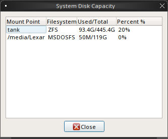
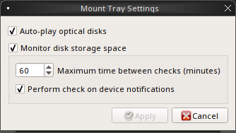
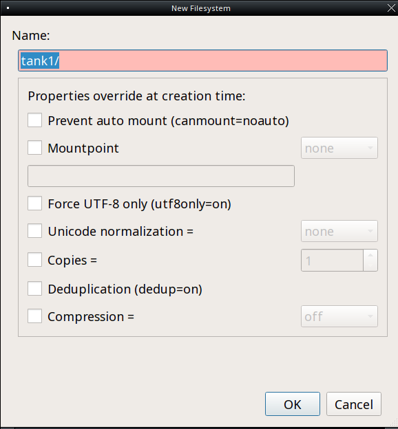
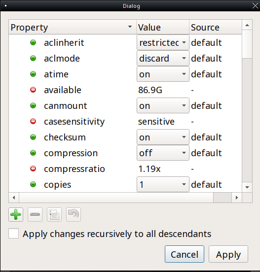
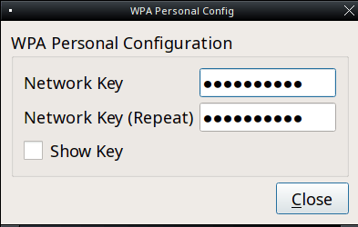

.. _Using TrueOS®:

Using TrueOS®
**************

This section discusses how to perform common tasks that were not
discussed in the :ref:`SysAdm™ Client` section.

.. index:: configuration
.. _Java and Flash:

Java and Flash
==============

IcedTea-Web provides an open source Java browser plugin which
automatically works with the FireFox, Chromium, and Opera web browsers
without any additional configuration. To install this software, search
for "icedtea" within :ref:`AppCafe®`. 

Version 11 of the Adobe Flash player is available for installation
through :ref:`AppCafe®`. To install flash as a browser plugin search
for and install both the "flashplugin" and "nspluginwrapper" packages.
Once installed, flash should "just work" when browsing the web. If
Adobe Flash does not seem to be working, running the following command
as your regular user account should fix the problem::

 flashpluginctl on

The Adobe Flash Player preferences utility can be used to modify how websites interact with your browser using Adobe Flash. Many of the
same configurations can be done via right-click within an active flash object in a web browser.

To access the utility shown in :numref:`Figure %s: Flash Player Configuration Utility <flash>`, use :menuselection:`Browse Applications --> Adobe Flash Player preferences` or type
:command:`flash-player-properties`.

.. _flash:

.. figure:: images/flash.png

The options available in each tab and when to use them are described at the Adobe website: 

* `Storage <http://help.adobe.com/en_US/FlashPlayer/LSM/WS6aa5ec234ff3f285139dc56112e3786b68c-7fff.html>`_ describes private browsing support and the privacy issues associated with
  local storage of flash information.

* `Camera and Mic <http://help.adobe.com/en_US/FlashPlayer/LSM/WS6aa5ec234ff3f285139dc56112e3786b68c-7ff8.html>`_ controls how websites can use your computer's camera and microphone.

* `Playback <http://help.adobe.com/en_US/FlashPlayer/LSM/WS6aa5ec234ff3f285139dc56112e3786b68c-7ff5.html>`_ describes how to configure peer-assisted networking to improve bandwidth.

* `Advanced <http://help.adobe.com/en_US/FlashPlayer/LSM/WS6aa5ec234ff3f285139dc56112e3786b68c-7ff0.html>`_ controls how Flash Player handles browsing data, updates, trusted locations,
  and protected content.

.. index:: fonts
.. _Fonts:

Fonts 
=====

TrueOS® installs with `Google Noto <http://www.google.com/get/noto/>`_
which provides multi-lingual Sans and Serif fonts. Many other fonts
are available from :ref:`AppCafe®`. Any font installed using AppCafe®
should not require any additional configuration to "just work". 

If you have a collection of fonts that you have downloaded or
purchased, you can configure your TrueOS® system to also use those
fonts. Become the superuser and copy the downloaded font to the
:file:`/usr/local/share/fonts/` directory. Then, run this command to
refresh the fonts cache::

 fc-cache -f -v /usr/local/share/fonts/name_of_font
 
.. index:: sound
.. _Sound Mixer Tray:

Sound Mixer Tray
=================

TrueOS® includes a graphical utility for managing the sound card's
mixer settings. The utility can be accessed using the speaker icon in
the system tray.

:numref:`Figure %s: Mixer Icon <sound1>` shows an example of
clicking the mixer icon in the system tray on a system with
multiple audio outputs. If the system only has one audio output, the
"Outputs" submenu will not be displayed. To change the default audio
output, click its entry in the "Output" menu.

.. _sound1:

.. figure:: images/sound1.png

:numref:`Figure %s: Mixer Controls <sound2>` shows the menu which
opens when you instead click the "Mixer" button shown in
:numref:`Figure %s: Mixer Icon <sound1>`.

.. _sound2:

.. figure:: images/sound2.png

The "Mixer Controls" screen provides sliders to modify the left and
right channels that control volume, pcm (the sound driver), the
speaker, the microphone, the recording level, the input level, and the
output level. Each control can be muted/unmuted individually by
clicking its "Mute" or"Unmute" button, depending upon its current mute
state.

:numref:`Figure %s: System Sound Configuration <sound3>` shows the "System Configuration" tab.

.. _sound3:

.. figure:: images/sound3.png

This tab contains the following options: 

* **Recording Device:** use the drop-down menu to select the device to
  use for recording sound.

* **Default Tray Device:** use the drop-down menu to set the default
  slider to display in the system tray.

* **Audio Output Channel:** use the drop-down menu to change the sound
  device and use the "Test" button to determine that sound is working.
  This is sometimes necessary when you change audio devices. For
  example, if you connect a USB headset, TrueOS® will detect the new
  device and will automatically change the audio device to the USB
  input. However, if you insert a headset into an audio jack, the
  system may not detect the new input so you will have to manually
  change the default device.

The "File" menu can be used to quit this mixer screen or to close both
this screen and remove the icon from the system tray.

.. note:: To re-add the mixer icon after removing it, type
   :command:`pc-mixer &`. Alternately, to open this application
   without adding it back to the system tray, type
   :command:`pc-mixer -notray`.

The "Configuration" menu provides options for accessing the "PulseAudio Mixer" and "PulseAudio Settings" utilities as well as for restarting PulseAudio.
TrueOS® provides full `PulseAudio <https://www.freedesktop.org/wiki/Software/PulseAudio/>`_ support and these utilities can be used to configure discoverable
network sound devices and mixer levels.

.. index:: troubleshooting
.. _Troubleshooting Sound:

Troubleshooting Sound 
----------------------

Type :command:`mixer` from the command line to see the current sound
settings::

 mixer
 Mixer vol      is currently set to   0:0
 Mixer pcm      is currently set to 100:100
 Mixer speaker  is currently set to 100:100
 Mixer mic      is currently set to  50:50
 Mixer rec      is currently set to   1:1
 Mixer monitor  is currently set to  42:42
 Recording source: monitor

If any of these settings are set to *0*, set them to a higher value,
by specifying the name of the mixer setting and a percentage value up
to *100*::

 mixer vol 100
 Setting the mixer vol from 0:0 to 100:100.

You can make that change permanent by creating a file named
:file:`.xprofile` in your home directory that contains the corrected
mixer setting.

If you only get one or two mixer settings, you need to change the
default mixer channel. As the superuser, try this command::

 sysctl -w hw.snd.default_unit=1

To see if that changed to the correct channel, type :command:`mixer`
again. If you still only have one or two mixer settings, try setting
the :command:`sysctl` value to *2*, and if necessary, to *3*.

Once you have all of the mixer settings and none are set to *0*, your
sound should work. If it still doesn't, these resources may help you
to pinpoint the problem: 

* `Sound Section of FreeBSD Handbook <http://www.freebsd.org/doc/en_US.ISO8859-1/books/handbook/sound-setup.html>`_

* `FreeBSD Sound Wiki <https://wiki.FreeBSD.org/Sound>`_

If you still have problems with sound, see the section on
:ref:`Finding Help` to determine which help resources are available.
When reporting your problem, include your version of TrueOS® and the
name of your sound card. 

.. index:: multimedia
.. _Multimedia:

Multimedia
==========

TrueOS® has been pre-configured to support most multimedia formats and
makes it easy to install most open source media applications using
:ref:`AppCafe®`.

If you install a web browser using AppCafe®, you should be able to
play most media formats, including YouTube videos, Internet radio, and
many trailer and movie sites.

If people are blue in YouTube videos, this is due to a known issue in
flash which Adobe hasn't fixed for open source players. To resolve
this issue, right-click an area in the video, select "Settings", then
uncheck the box "Enable hardware acceleration". Alternately, install
`Minitube <http://flavio.tordini.org/minitube>`_ using :ref:`AppCafe®`
and use it to watch YouTube.

.. note:: if you happen to come across a file that you can not play in
   a web browser or media player, it is probably because it is in a
   proprietary format that requires a licensing fee or restricts
   distribution of the codec that is required to play that media
   format.

AppCafe® contains several dozen applications for playing and editing
multimedia. It includes these popular applications (click the links to
view screenshots): 

* `aTunes <http://www.atunes.org/?page_id=5>`_: full-featured audio
  player and manager that can play mp3, ogg, wma, wav, flac, mp4 and
  radio streaming, allowing users to easily edit tags, organize music
  and rip audio CDs.

* `Audacity <https://sourceforge.net/projects/audacity/?lang=en>`_:
  multilingual audio editor and recorder.

* `DeaDBeeF <http://deadbeef.sourceforge.net/screenshots.html>`_:
  music player that supports most audio formats.

* `Decibel <http://decibel.silent-blade.org/index.php?n=Main.Screenshots>`_:
  audio player built around a highly modular structure that lets the
  user disable completely the features he does not need. Able to play
  CDs directly.

* `gtkpod <http://www.gtkpod.org/index.php?title=Screenshots>`_:
  graphical user interface for the Apple iPod.

* `Miro <http://www.getmiro.com/download/screenshots/>`_: HD video
  player that can play almost any video file and offers over 6,000
  free Internet TV shows and video podcasts.

* `SMPlayer <http://smplayer.sourceforge.net/>`_: universal media
  player that can handle any media format and play audio CDs, DVDs,
  (S)VCDs, TV/radio cards, YouTube™ and SHOUTcast™ streams. This is
  the default player used by :ref:`Mount Tray`.

.. index:: multimedia
.. _Kodi:

Kodi
----

`Kodi, formerly known as XBMC, <https://kodi.tv/>`_ is a GPL-licensed
software media player and entertainment hub for digital media. It can
play most audio and video formats, CDs and DVDs from a disk or image
file, and even files inside ZIP and RAR archives. It can scan all of
your media and automatically create a personalized library with album
covers, descriptions, and fan art. 

Kodi can be installed using :ref:`AppCafe®`. Once installed, an entry
for "Kodi media center" will be added to "Browse Applications". You
can also start Kodi by typing :command:`kodi` from a command prompt. 

If you have never used Kodi before, take some time to skim through the
`Kodi Wiki Manual <http://kodi.wiki/>`_. The
`Turn PC-BSD into a home theater forum post <https://forums.pcbsd.org/thread-19799.html>`_
contains a quick how-to for configuring Kodi.

.. index:: multimedia
.. _PlexHome Theater:

PlexHome Theater
----------------

`Plex Home Theater <https://plex.tv/>`_ is a centralized media
playback system. The central Plex Media Server streams media to many
Plex player Apps which are used to view your media library and watch
shows. 

To install PlexHome Theater, use AppCafe®. Once installed, an entry should be added to the "Multimedia" section of the application menu
of your desktop. You can also start this application by typing :command:`plexhometheater` from a command prompt. 

Once installed, an entry for "Plex Home Theater" will also be added to the login manager so that you can login directly to the home theater instead of a desktop.

The first time you run or log into Plex Home Theater, a wizard will check your audio settings and sign into your Plex account. If you do not have a Plex account yet,
create one at `plex.tv <https://plex.tv/>`_. The wizard will give you a PIN code and an URL to enter the code. Once you enter the PIN, the wizard will connect and sign you in.
You can now search for and watch media. To exit Plex, click the "<" then "Quit".

.. index:: mount
.. _Mount Tray:

Mount Tray
==========

The Mount Tray graphical application is used to facilitate the
mounting and unmounting of internal disks, USB storage devices,
optical media, and network shares. It is included in the system tray
by default. If you remove the icon from the system tray, you can
re-add it by typing :command:`pc-mounttray &`.

.. note:: If you prefer to mount devices from the command line, see
   the section on :ref:`pc-sysconfig`. 

In the example shown in
:numref:`Figure %s: Mount Tray Example <mount1>`, a USB device and a
music CD are currently inserted and the user has clicked "More
Options" to view the available options.

.. _mount1:

.. figure:: images/mount1.png

When you first insert a USB drive, a "New Device" message will appear
in the system tray. Click the Mount Tray icon, then the "Mount" button
for the device. Mount Tray will try to determine the filesystem on the
device and then to mount it. If it is not sure, a pop-up menu will
prompt you to select the correct filesystem. A list of supported
filesystems can be found in Table 1.3a. Once mounted, the "Mount"
button changes to "Unmount", and if the device contains files,
an indicator of the drive's used capacity and a button to "Browse" the
contents of the device will be added. An example is shown in 
:numref:`Figure %s: Mounted USB Device <mount2>`.

.. _mount2:

.. figure:: images/mount2.png

If you mount the device often and would like it to mount automatically
when inserted, check the "Auto-Run" box.

When you are finished using the device, press the "Unmount" button.
This will safely unmount the device and toggle the button back to
"Mount". Note that you will receive a "Device Busy" message if the
file manager is still open with the device's contents. If you receive
this message, press "No" to close the pop-up, close the file manager,
then press "Unmount" again. This will ensure that the device is
cleanly unmounted.

.. note:: While Mount Tray will allow you to physically remove a USB
   device without unmounting it first, it is recommended to always
   "Unmount" the drive first.

When you first insert an optical media, such as a music CD or DVD video, a message will indicate that an optical disk is available and, by default, the default player
application will open so that you can play the contents of the disk. The default player that is used depends upon which applications have been installed, where
`VLC <http://www.videolan.org/vlc/>`_ takes precedence, followed by `SMPlayer <http://smplayer.sourceforge.net/>`_. If you close the player, you can click
the "Play" button shown in :numref:`Figure %s: Mount Tray Example <mount1>` to restart it.

If any shares are available on the network, PUT EXAMPLE IN HERE ON HOW TO BROWSE TO SHARE AND TYPES OF AVAILABLE SHARES

The following options are available in the "More Options" menu: 

* **View Disk Usage:** in the example shown in
   :numref:`Figure %s: View Disk Usage Using Mount Tray <mount3>`,
   a UFS-formatted USB device is mounted at
   :file:`/Media/STECH-1d`. The amount of disk space used by the
   system hard drive and the USB drive is shown in both GB and as a
   percentage of available disk space. The Mount Tray will turn yellow if
   disk space is over 70% and red if disk space is over 90%. If the internal disk drives are partitioned with any other filesystems, these will also appear in Mount Tray.

* **Rescan Devices:** click this option if an entry for a newly
  inserted device does not automatically appear.

* **Load ISO File:** used to mount an ISO to a memory disk. It will
  open a browse menu so that you can browse to the location of the
  :file:`.iso` file. Once the file is selected and mounted, its contents will be displayed in the default file manager. When you are finished browsing the
  contents, close the file manager and click the "Eject" button for the memory device in Mount Tray and enter your password when prompted. As the ISO is
  unmounted, the memory disk is also detached from the system.

**Change Settings:** as seen in
  :numref:`Figure %s: Configure Disk Space Check <mount4>`, this
  screen allows you to configure whether or not optical disks automatically open using
  the default player, whether or not Mount Tray automatically rechecks the disk space used by mounted devices and how often to perform that check, and whether or not
  Mount Tray checks disk space when a disk is mounted.

* **Close Tray:** click this option to remove Mount Tray from the
  system tray.

.. _mount3:

.. _mount4:

.. index:: mount
.. _pc-sysconfig:

pc-sysconfig
------------

The previous section described TrueOS®'s graphical mount utility. This graphical utility has a command-line backend, :command:`pc-sysconfig`, which can be
used directly from the command line on TrueOS® systems, window managers without a system tray, or by users who prefer to use the command line.

For usage information, run the command without any options::

 pc-sysconfig
 pc-sysconfig: Simple system configuration utility
 Usage: "pc-sysconfig <command 1> <command 2> ..."
 Available Information Commands:
 "list-remdev": List all removable devices attached to the system.
 "list-mounteddev": List all removable devices that are currently mounted
 "list-audiodev": List all available audio devices
 "probe-netdrives": List all the available shared drives on the local network
 "list-mountednetdrives": List all the available shared drives which can currently be browsed (assuming the remote system is running properly)
 "supportedfilesystems": List all the filesystems that are currently detected/supported by pc-sysconfig
 "devinfo <device> [skiplabel]": Fetch device information (Filesystem, Label, Type)
 "devsize <device>": Fetch device space (must be mounted)
 "usingtormode": [TRUE/FALSE] Returns whether the system is routing all traffic through TOR
 "getscreenbrightness": Returns the brightness of the first controllable screen as a percentage (0-100) or "[ERROR]" otherwise
 "systemcansuspend": [TRUE/FALSE] Returns whether the system supports the S3 suspend state

 Available Action Commands:
  "mount <device> [<filesystem>] [<mountpoint>]":
   -- This will mount the removable device on the system (with user-accessible permissions if the mountpoint needs to be created)
   -- If there is no filesystem set (or "auto" is used), it will try to use the one that is auto-detected for the device
   -- If there is no mountpoint set, it will assign a new mountpoint within the "/media/" directory based on the device label
  "unmount <device or mountpoint> [force]":
   -- This will unmount the removable device from the system
   -- This may be forced by using the "force" flag as well (not recommended for all cases)
   -- If the input device is a memory disk (/dev/md*), then it will automatically remove the memory disk from the system as well
  "mountnet <IP of remote host> <Name of remote host>":
   -- This will setup the remote host to be browsable on the local system with the given name
   -- Note that the remote host is automatically mounted/unmounted based on local user activity
   -- To see where these network drives are mounted and can be browsed, see the output of "list-mountednetdrives"
  "unmountnet <IP of remote host>":
   -- This will remove the remote host from being browsable on the local system
  "load-iso <absolute path to the *.iso file>":
   -- This will load the ISO file as a memory disk on the system (making it available for mounting/browsing)
  "setdefaultaudiodevice <pcm device>":
   -- This will set the given pcm device (I.E. "pcm3") as the default audio output device
  "setscreenbrightness <percentage>":
   -- This will set the brightness of all the available screens to the given percentage
   -- It is also possible to adjust the current value by supplying a [+/-] before the number
   -- For example: using "+5" as the percentage will increase the brightness by 5% for each screen
   -- This returns "[ERROR]" or "[SUCCESS]" based on whether the change could be performed
  "suspendsystem": Puts the system into the suspended state (S3)

For example, to see a listed of the supported filesystems, use::

 pc-sysconfig supportedfilesystems
 FAT, NTFS, EXT, CD9660, UFS, REISERFS, XFS, UDF, ZFS

.. index:: files
.. _Files and File Sharing:

Files and File Sharing
======================

Several file managers are available for installation using
:ref:`AppCafe®`. Table 11.5a provides an overview of several popular
file managers. To launch an installed file manager, type its name as
it appears in the "Application" column. To install the file manager,
use :ref:`AppCafe®` to install the package name listed in the
"Install" column. To research a file manager's capabilities, start
with the URL listed in its "Screenshot" column.

**Table 11.5a: Available File Managers**

+-------------------+----------------------+-------------------------------------------------------------+
| **Application**   | **Install**          | **Screenshots**                                             |
+===================+======================+=============================================================+
| dolphin           | kde-baseapps         | `<https://userbase.kde.org/Dolphin>`_                       |
+-------------------+----------------------+-------------------------------------------------------------+
| emelfm2           | emelfm2              | `<http://emelfm2.net/wiki/ScreenShots>`_                    |
+-------------------+----------------------+-------------------------------------------------------------+
| caja              | caja                 | `<http://mate-desktop.org/gallery/1.6/>`_                   |
+-------------------+----------------------+-------------------------------------------------------------+
| mucommander       | mucommander          | `<http://www.mucommander.com/screenshots.php>`_             |
+-------------------+----------------------+-------------------------------------------------------------+
| nautilus          | nautilus             | `<https://projects.gnome.org/nautilus/screenshots.html>`_   |
+-------------------+----------------------+-------------------------------------------------------------+
| pcmanfm           | pcmanfm              | `<http://lxde.org/easy_fast_file_management_pcmanfm>`_      |
+-------------------+----------------------+-------------------------------------------------------------+
| thunar            | thunar               | `<http://docs.xfce.org/xfce/thunar/start>`_                 |
+-------------------+----------------------+-------------------------------------------------------------+
| xfe               | xfe                  | `<http://roland65.free.fr/xfe/index.php?page=screenshots>`_ |
+-------------------+-----------------------+------------------------------------------------------------+

When working with files on your TrueOS® system, save your own files to
your home directory. Since most of the files outside of your home
directory are used by the operating system and applications, you
should not delete or modify any files outside of your home directory,
unless you know what you are doing.

Table 11.5b summarizes the directory structure found on a TrueOS®
system. :command:`man hier` explains this directory structure in more
detail.

**Table 11.5b: TrueOS Directory Structure**

+--------------------------+---------------------------------------------------------------------------------------------------------------------------------+
| **Directory**            | **Contents**                                                                                                                    |
+==========================+=================================================================================================================================+
| /                        | pronounced as "root" and represents the beginning of the directory structure                                                    |
+--------------------------+---------------------------------------------------------------------------------------------------------------------------------+
| /bin/                    | applications (binaries) that were installed with the operating system                                                           |
+--------------------------+---------------------------------------------------------------------------------------------------------------------------------+
| /boot/                   | stores the startup code, including kernel modules (such as hardware drivers)                                                    |
+--------------------------+---------------------------------------------------------------------------------------------------------------------------------+
| /compat/linux/           | Linux software compatibility files                                                                                              |
+--------------------------+---------------------------------------------------------------------------------------------------------------------------------+
| /dev/                    | files which are used by the operating system to access devices                                                                  |
+--------------------------+---------------------------------------------------------------------------------------------------------------------------------+
| /etc/                    | operating system configuration files                                                                                            |
+--------------------------+---------------------------------------------------------------------------------------------------------------------------------+
| /etc/X11/                | the :file:`xorg.conf` configuration file                                                                                        |
+--------------------------+---------------------------------------------------------------------------------------------------------------------------------+
| /etc/rc.d/               | operating system startup scripts                                                                                                |
+--------------------------+---------------------------------------------------------------------------------------------------------------------------------+
| /home/                   | subdirectories for each user account; each user should store their files in their own home directory                            |
+--------------------------+---------------------------------------------------------------------------------------------------------------------------------+
| /lib/                    | operating system libraries needed for applications                                                                              |
+--------------------------+---------------------------------------------------------------------------------------------------------------------------------+
| /libexec/                | operating system libraries and binaries                                                                                         |
+--------------------------+---------------------------------------------------------------------------------------------------------------------------------+
| /media/                  | mount point for storage media such as DVDs and USB drives                                                                       |
+--------------------------+---------------------------------------------------------------------------------------------------------------------------------+
| /mnt/                    | another mount point                                                                                                             |
+--------------------------+---------------------------------------------------------------------------------------------------------------------------------+
| /proc/                   | the proc filesystem required by some Linux applications                                                                         |
+--------------------------+---------------------------------------------------------------------------------------------------------------------------------+
| /rescue/                 | necessary programs for emergency recovery                                                                                       |
+--------------------------+---------------------------------------------------------------------------------------------------------------------------------+
| /root/                   | administrative account's home directory                                                                                         |
+--------------------------+---------------------------------------------------------------------------------------------------------------------------------+
| /sbin/                   | operating system applications; typically only the superuser can run these applications                                          |
+--------------------------+---------------------------------------------------------------------------------------------------------------------------------+
| /tmp/                    | temporary file storage; files stored here may disappear when the system reboots                                                 |
+--------------------------+---------------------------------------------------------------------------------------------------------------------------------+
| /usr/bin/                | contains most of the command line programs available to users                                                                   |
+--------------------------+---------------------------------------------------------------------------------------------------------------------------------+
| /usr/local/              | contains the binaries, libraries, startup scripts, documentation, and configuration files used by applications installed from   |
|                          | ports or packages                                                                                                               |
+--------------------------+---------------------------------------------------------------------------------------------------------------------------------+
| /usr/local/share/fonts/  | system wide fonts for graphical applications                                                                                    |
+--------------------------+---------------------------------------------------------------------------------------------------------------------------------+
| /usr/local/share/icons/  | system wide icons                                                                                                               |
+--------------------------+---------------------------------------------------------------------------------------------------------------------------------+
| /usr/ports/              | location of system ports tree (if installed)                                                                                    |
+--------------------------+---------------------------------------------------------------------------------------------------------------------------------+
| /usr/share/              | system documentation and man pages                                                                                              |
+--------------------------+---------------------------------------------------------------------------------------------------------------------------------+
| /usr/sbin/               | command line programs for the superuser                                                                                         |
+--------------------------+---------------------------------------------------------------------------------------------------------------------------------+
| /usr/src/                | location of system source code (if installed)                                                                                   |
+--------------------------+---------------------------------------------------------------------------------------------------------------------------------+
| /var/                    | files that change (vary), such as log files and print jobs                                                                      |
+--------------------------+---------------------------------------------------------------------------------------------------------------------------------+

TrueOS® provides built-in support for accessing Windows shares,
meaning you only have to decide which utility you prefer to access
existing Windows shares on your network.

Table 11.5c summarizes some of the available utilities.

**Table 11.5c: Utilities that Support Windows Shares**

+------------------+--------------+--------------------------------------------------------------------------------------------------------------------------+
| **Application**  | **Install**  | **How to Access Existing Shares**                                                                                        |
+==================+==============+==========================================================================================================================+
| dolphin          | kde-baseapps | in the left frame, click on :menuselection:`Network --> Samba Shares`, then the Workgroup name; if the network requires  |
|                  |              | a username and password to browse for shares, set this in :menuselection:`System Settings --> Sharing`                   |
|                  |              | while in KDE or type :command:`systemsettings` and click "Sharing" while in another desktop                              |
+------------------+--------------+--------------------------------------------------------------------------------------------------------------------------+
| smb4k            | smb4k-kde4   |                                                                                                                          |
+------------------+--------------+--------------------------------------------------------------------------------------------------------------------------+
| mucommander      | mucommander  | click on :menuselection:`Go --> Connect to server --> SMB`; input the NETBIOS name of server, name of share, name of     |
|                  |              | domain (or workgroup), and the share's username and password                                                             |
+------------------+--------------+--------------------------------------------------------------------------------------------------------------------------+
| nautilus         | nautilus     | click on :menuselection:`Browse Network --> Windows Network`                                                             |
+------------------+--------------+--------------------------------------------------------------------------------------------------------------------------+
| thunar           | thunar       | in the left frame, click on :menuselection:`Network --> Windows Network`                                                 |
+------------------+----------------------+------------------------------------------------------------------------------------------------------------------+

.. index:: configuration
.. _Disk Manager:

Disk Manager
============

The TrueOS® Disk Manager can be used to manage ZFS pools and datasets
as well as the disks attached to the system. To access this utility,
use :menuselection:`Browse Applications --> Disk Manager` or type
:command:`pc-su pc-diskmanager` from within an xterm. You will need to
input your password in order to access this utility.

As seen in the example in
:numref:`Figure %s: Managing Disks <disk1>`, the utility will open in
the "Disks" tab which shows the size of each disk as well as its
partitioning scheme. If an unformatted disk or free disk space is available, right-click the device to format it.

.. _disk1:

.. figure:: images/disk1.png

To view the status of the ZFS pool(s) and the disk(s) in each pool,
click the "ZFS Pools" tab. In the example, shown in
:numref:`Figure %s: Viewing the Status of the ZFS Pool <disk2>`, the
ZFS pool named *tank1* was created from one disk. The state of
"Online" indicates that the pool is healthy.

.. _disk2: 

.. figure:: images/disk2.png

If you right-click the pool name, the following options are available: 

* **Create new pool:** use this option if additional disks are
  available and you would like to create another pool instead of adding
  them to the existing pool. This will open a screen that allows you to
  name the new pool, select which additional disks will go into it, and
  select how to configure the disks.

* **Rename pool:** will prompt you to input the new name for the pool.

* **Destroy pool:** **do not select this option unless your intent is
  to destroy all of the data on the disks!**

* **Add devices:** depending upon the type of disk configuration, you
  may be able to extend the size of the pool by adding an equal number
  of disks.

* **Add log devices:** used to add an SSD or disk as a secondary ZIL.

* **Add cache devices:** used to add an SSD or disk as an L2ARC.

* **Add spare devices:** at this time, FreeBSD does not support hot
  spares.

* **Scrub:** will start a ZFS scrub now. This option can be I/O
  intensive so it isn't recommended to do this while the system is in
  use.

* **Export pool:** this action should be performed if you will be
  physically moving the disks from one system to another.

* **Properties:** used to manage the default properties of the pool.
  Datasets inherit the default properties, unless a property is set to
  a different value on the dataset.

If you right-click a disk entry, such as *ada0p5* in this example, the
following options are available: 

* **Attach (mirror) device:** if you wish to mirror additional disk(s),
  this option will open a screen which allows you to specify the
  disk(s) to add.

* **Take offline:** if you need to replace a bad disk, select this
  option before physically removing the disk.

As seen in the example shown in
:numref:`Figure %s: Viewing the System's ZFS Datasets <disk3>`, the
"ZFS Filesystems" tab will display the system's ZFS datasets and their snapshots, the amount of space available to each dataset, and the
amount of space each dataset is using.

.. _disk3:

.. figure:: images/disk3.png

The name of the pool in this example is *tank1*. If the system has
multiple pools, click the green arrow to select the desired pool.

If you right-click the pool name under "Filesystems", the following
options are available: 

* **Mount:** whether or not the filesystem can be mounted depends upon
  the value of the "canmount" property of the dataset.

* **Create new dataset:**
  :numref:`Figure %s: Creating a New ZFS Dataset <disk4>` shows the
  options that are available when you create a new dataset.

* **Create a clone dataset:** creates a copy of the dataset.

* **Take a snapshot:** will prompt for the name of the snapshot. The field is pink to remind you to type the snapshot name in immediately after the pool name
  and *@* symbol. In this example, *tank1@* will be displayed in the name field. An example snapshot name could be *tan1k@snapshot1* or *tank1@201505181353* to
  denote the date and time the snapshot was created. The snapshot creation will be instantaneous and the new snapshot will be added to the list of datasets
  and will have a camera icon. Click the entry for the snapshot entry if you wish to rename it, clone it, destroy it, rollback the system to that point in
  time, or edit its properties. If you forget when you made the snapshot, pick "Edit properties" from the snapshot's right-click menu as it will show its
  "creation" property.

* **Edit properties:** allows you modify the ZFS properties for the
  pool, as seen in the example shown in
  :numref:`Figure %s: Editing the Pool's ZFS Properties <disk5>`. The
  available options depend upon the property being modified. The
  options which are read-only will have a red minus sign icon next to
  them. ZFS options are described in :command:`man zfs` and  you should
  not change any options unless you are familiar with the ramifications
  of doing so.

.. _disk4:

.. _disk5:

When creating a new dataset or clone, the following options are
available. Again, these options are described in :command:`man zfs` and
you should not change any options unless you are familiar with the
ramifications of doing so.

* **Name:** this field is pink as a reminder to type in the dataset
  name immediately after the trailing "/" of the displayed pool name.

* **Prevent auto mount:** if the box is checked, the dataset will not
  be mounted at boot time and must instead be manually mounted as
  needed.

* **Mountpoint:** choices are *none*, *legacy*, or *[path]*. If you
  select *[path]*, input the full path for the mountpoint.

* **Force UTF-8 only:** if checked, you will not be able to save any
  filenames that are not in the UTF-8 character code set.

* **Unicode normalization:** if checked, indicate whether unicode
  normalization should occur when comparing filenames, and if so, which
  normalization algorithm to use. Choices are *none*, *formD*, or
  *formKCF*.

* **Copies:** if checked, indicates the number of copies (1 to 3) of
  data to store in the dataset. The copies are in addition to any
  redundancy and are stored on different disks when possible.

* **Deduplication:** enables deduplication.
  **Do not** enable this option if the system has less than the
  minimum recommended 5GB of RAM per TB of storage to be deduplicated.

* **Compression:** if checked and a compression algorithm is selected
  in the drop-down menu, data will automatically be compressed as it
  is written and uncompressed as it is read. The algorithm determines
  the amount and speed of compression, where typically increased
  compression results in decreased speed. The *lz4* algorithm is
  recommended as it provides very good compression at near real-time
  speed.

.. index:: network
.. _Network Manager:

Network Manager
===============

During installation, TrueOS® configures any connected Ethernet
interfaces to use DHCP and provides a screen to
:ref:`Connect to a Wireless Network`. In most cases, this means that
connected interfaces should "just work" whenever you use your TrueOS®
system.

After installation, a wireless configuration icon will appear in the
system tray if TrueOS® detects a supported wireless card. If you hover
over the wireless icon, shown in
:numref:`Figure %s: Wireless Information in System Tray <network1>`,
it will indicate if the interface is associated and provide information
regarding the IP address, IPv6 address, SSID, connection strength,
connection speed, MAC address, and type of wireless device.

.. _network1:

.. figure:: images/network1.png

If you right-click the wireless icon, you will see a list of detected
wireless networks. Click the name of a network to associate with it.
The right-click menu also provides options to configure the wireless
device, start the Network Manager, restart the network (useful if you
need to renew your DHCP address), route the network connection through
Tor (to browse the Internet anonymously as described in
:ref:`Tor Mode`), and to close the Network Monitor so that the icon no
longer shows in the system tray.

To view or manually configure a network interface, click "Start the
Network Manager" within SysAdm™ or type
:command:`sudo pc-netmanager`. If a new device has been inserted,
such as a USB wireless interface, a pop-up message will open when
Network Manager starts, indicating the name of the new device, and
asking if you would like to enable it. Click "Yes" and the new device
will be displayed with the list of network interfaces that TrueOS®
recognizes. In the example seen in
:numref:`Figure %s: Network Manager <network2>`, the system has one
Intel Ethernet interface that uses the *em* driver and an Intel
wireless interface that uses the *wlan* driver.

.. _network2:

.. figure:: images/network2.png

The rest of this section describes each tab of the Network Manager
utility and demonstrate how to view and configure the network settings
for both Ethernet and wireless devices. It will then present some
common troubleshooting scenarios, known issues, and suggestions for
when a device does not have a built-in driver.

.. index:: network
.. _Ethernet Adapters:

Ethernet Adapters
-----------------

If you highlight an Ethernet interface in the "Devices" tab and either
click the "Configure" button or double-click the interface name, you
will see the screen shown in
:numref:`Figure %s: Network Settings for an Ethernet Interface <network3>`.

.. _network3:

.. figure:: images/network3.png

There are two ways to configure an Ethernet interface: 

1. **Use DHCP:** this method assumes that your Internet provider or
   network router assigns addressing information automatically using
   the DHCP protocol. Most networks are already setup to do this. This
   method is recommended as it should "just work". 

2. **Manually type in the IP addressing information:** this method
   requires you to understand the basics of TCP/IP addressing or to
   know which IP address you should be using on your network. If you
   do not know which IP address or subnet mask to use, you will have
   to ask your Internet provider or network administrator.

By default, TrueOS® attempts to obtain an address from a DHCP server.
If you wish to manually type in your IP address, check the box "Assign
static IP address". Type in the IP address, using the right arrow key
or the mouse to move between octets. Then, double-check that the
subnet mask ("Netmask") is the correct value and change it if it is
not.

If the Ethernet network uses 802.1x authentication, check the box
"Enable WPA authentication" which will enable the "Configure WPA"
button. Click this button to select the network and to input the
authentication values required by the network.

By default, the "Disable this network device" box is unchecked. If you
check this checkbox, TrueOS® will immediately stop the interface from
using the network. The interface will remain inactive until this
checkbox is unchecked.

The "Advanced" tab, seen in
:numref:`Figure %s: Advanced Tab of an Ethernet Interface's Network Settings <network4>`,
allows advanced users to manually input a :wikipedia:`MAC address` or
:wikipedia:`IPv6 address`. Both boxes should remain checked, in order
to automatically receive these addresses, unless you are an advanced
user who has a reason to change the default MAC or IPv6 address and
you understand how to input an appropriate replacement address.

.. _network4:

.. figure:: images/network4.png

The "Info" tab, seen in
:numref:`Figure %s: Info Tab of an Ethernet Interface's Network Settings <network5>`,
displays the current network address settings and some traffic
statistics.

.. _network5:

.. figure:: images/network5.png

If you make any changes within any of the tabs, click the "Apply"
button to activate them. Click the "OK" button when you are finished
to go back to the main Network Manager window.

You can repeat this procedure for each network interface that you wish
to view or configure.

.. index:: network
.. _Wireless Adapters:

Wireless Adapters
-----------------

If your wireless interface does not automatically associate with a
wireless network, you probably need to configure a wireless profile
that contains the security settings required by the wireless network.
Double-click the wireless icon in the system tray or highlight the
wireless interface displayed in the "Devices" tab of Network Manager
and click the "Configure" button.
:numref:`Figure %s: Wireless Configuration <network6>` demonstrates
that this system's wireless interface is currently associated with the
wireless network listed in the "Configured Network Profiles" section.

.. _network6: 

.. figure:: images/network6.png

To associate with a wireless network, click the "Scan" button to
receive the list of possible wireless networks to connect to. Highlight
the network you wish to associate with and click the "+Add Selected"
button. If the network requires authentication, a pop-up window will
prompt you for the authentication details. Input the values required
by the network then click the "Close" button. TrueOS® will add an
entry for the network in the "Configured Network Profiles" section.

If the network is hidden, click the "+Add Hidden" button, input the
name of the network in the pop-up window, and click "OK".

If you add multiple networks, use the arrow keys to place them in the
desired connection order. TrueOS® will try to connect to the first
profile in the list and will move down the list, in order, if it is
unable to connect. When finished, click the "Apply" button. A pop-up
message will indicate that TrueOS® is restarting the network. If all
went well, there should be an IP address and status of "associated"
when you hover over the wireless icon in the system tray. If this is
not the case, double-check for typos in your configuration values and
read the section on :ref:`Troubleshooting Network Settings`. 

TrueOS® supports the types of authentication shown in
:numref:`Figure %s: Configuring Wireless Authentication Settings <network7>`.
You can access this screen, and change your authentication settings,
by highlighting an entry in the "Configured Network Profiles" section
and clicking the "Edit" button.

.. _network7: 

.. figure:: images/network7.png

This screen allows you to configure the following types of wireless
security: 

* **Disabled:** if the network is open, no additional configuration is
  required.

* **WEP:** this type of network can be configured to use either a hex
  or a plaintext key and Network Manager will automatically select the
  type of key that it has detected. If you click "WEP" then the
  "Configure" button, you will see the screen shown in
  :numref:`Figure %s: WEP Security Settings <network8>`.
  Type the key into both "Network Key" boxes. If the key is complex,
  check the "Show Key" box to make sure that the passwords are correct
  and that they match. Uncheck this box when you are finished to
  replace the characters in the key with bullets. A wireless access
  point that uses WEP can store up to 4 keys and the number in the
  "key index" indicates which key you wish to use.

* **WPA Personal:** this type of network uses a plaintext key. If you
  click "WPA Personal" then the "Configure" button, you will see the
  screen shown in
  :numref:`Figure %s: WPA Personal Security Settings <network9>`. Type
  in the key twice to verify it. If the key is complex, you can check
  the "Show Key" box to make sure the passwords match.

* **WPA Enterprise:** if you click "WPA Enterprise" then the
  "Configure" button, you will see the screen shown in
  :numref:`Figure %s: WPA Enterprise Security Settings <network10>`.
  Select the "EAP Authentication Method", input the EAP identity,
  browse for the CA certificate, client certificate and private key
  file, and input and verify the password.

.. note:: If you are unsure which type of encryption is being used,
   ask the person who setup the wireless router. They should also be
   able to give you the value of any of the settings seen in these
   configuration screens.

.. _network8: 

.. figure:: images/network8.png

.. _network9: 

.. _network10:

.. figure:: images/network10.png

If you wish to disable this wireless interface, check the box "Disable
this wireless device" in the "General" tab for the device. This
setting can be desirable if you want to temporarily prevent the
wireless interface from connecting to untrusted wireless networks.

The "Advanced" tab, seen in
:numref:`Figure %s: Advanced Tab of a Wireless Interface <network11>`,
allows you to configure the following: 

* a custom MAC address. This setting is for advanced users and
  requires the "Use hardware default MAC address" box to be unchecked.

* how the interface receives its IP address information. If the network
  contains a DHCP server, check the box "Obtain IP automatically
  (DHCP)". Otherwise, input the IP address and subnet mask to use on
  the network.

* the country code. This setting is not required if you are in North
  America. For other countries, check the "Set Country Code" box and
  select your country from the drop-down menu.

.. _network11:

.. figure:: images/network11.png

The "Info" tab, seen in
:numref:`Figure %s: Info Tab of a Wireless Interface <network12>`,
shows the current network status and statistics for the wireless
interface.

.. _network12:

.. figure:: images/network12.png

.. index:: network
.. _Network Configuration (Advanced):

Network Configuration (Advanced)
--------------------------------

The "Network Configuration (Advanced)" tab of the Network Manager is
seen in
:numref:`Figure %s: Network Configuration (Advanced) tab <network13>`.
The displayed information is for the currently highlighted interface.
If you wish to edit these settings, make sure that the interface that
you wish to configure is highlighted in the "Devices" tab.

.. _network13: 

.. figure:: images/network13.png

If the interface receives its IP address information from a DHCP
server, this screen allows you to view the received DNS information. If
you wish to override the default DNS settings or set them manually,
check the "Enable Custom DNS" box. You can then set the following: 

* **DNS 1:** the IP address of the primary DNS server. If you do not
  know which IP address to use, click the "Public servers" button to
  select a public DNS server.

* **DNS 2:** the IP address of the secondary DNS server.

* **Search Domain:** the name of the domain served by the DNS server.

If you wish to change or set the default gateway, check the "Enable
Custom Gateway" box and input the IP address of the default gateway.

The following settings can be modified in the IPv6 section: 

* **Enable IPv6 support:** if this box is checked, the specified
  interface can participate in IPv6 networks.

* **IPv6 gateway:** the IPv6 address of the default gateway used on
  the IPv6 network.

* **IPv6 DNS 1:** the IPv6 address of the primary DNS server used on
  the IPv6 network. If you do not know which IP address to use, click
  the "Public servers" button to select a public DNS server.

* **IPv6 DNS 2:** the IPv6 address of the secondary DNS server used on
  the IPv6 network.

The "Misc" section allows you to configure these options: 

* **System Hostname:** the name of your computer. It must be unique on
  your network.
  
* **Domain Name:** if the system is in a domain, you can specify it here.

* **Enable wireless/wired failover via lagg0 interface:** this
  interface allows you to seamlessly switch between using an Ethernet
  interface and a wireless interface. If you want this functionality,
  check this box.

.. note:: Some users experience problems using lagg. If you have
   problems connecting to a network using an interface that previously
   worked, uncheck this box and remove any references to "lagg" in
   your :file:`/etc/rc.conf` file.

If you make any changes within this window, click the "Apply" button
to apply them.

.. index:: network
.. _Proxy Settings:

Proxy Settings 
---------------

The "Proxy" tab, shown in
:numref:`Figure %s: Proxy Settings Configuration <network14>`, is
used when your network requires you to go through a proxy server in
order to access the Internet.

.. _network14: 

.. figure:: images/network14.png

Check the "Proxy Configuration" check box to activate the settings.
The following settings can be configured in this screen: 

* **Server Address:** enter the IP address or hostname of the proxy
  server.

* **Port Number:** enter the port number used to connect to the proxy
  server.

* **Proxy Type:** choices are "Basic" (sends the username and password
  unencrypted to the server) and "Digest" (never transfers the actual
  password across the network, but instead uses it to encrypt a value
  sent from the server). Do not select "Digest" unless you know that
  the proxy server supports it.

* **Specify a Username/Password:** check this box and input the
  username and password if they are required to connect to the proxy
  server.

Proxy settings are saved to the :file:`/etc/profile` and
:file:`/etc/csh.cshrc` files so that they are available to the TrueOS®
utilities as well as any application that uses :command:`fetch`.

Applications that did not come with the operating system, such as web
browsers, may require you to configure proxy support using that
application's configuration utility.

If you apply any changes to this tab, a pop-up message will warn that
you may have to logout and back in in order for the proxy settings to
take effect.

.. index:: network
.. _Configuring a Wireless Access Point:

Configuring a Wireless Access Point
-----------------------------------

If you right-click the entry for a wireless device, as seen in
:numref:`Figure %s: Setup Access Point Option <network15>`, the
right-click menu has an option to "Setup Access Point". 

.. _network15:

.. figure:: images/network15.png

:numref:`Figure %s: Access Point Basic Setup <network16>` shows the
configuration screen if you select "Setup Access Point". 

.. _network16:

.. figure:: images/network16.png

The "Basic Setup" tab of this screen contains two options: 

* **Visible Name:** this is the name that will appear when users scan
  for available access points.

* **Set Password:** setting a WPA password is optional, though
  recommended if you only want authorized devices to use the access
  point. If used, the password must be a minimum of 8 characters.

:numref:`Figure %s: Access Point Advanced Setup <network17>` shows the
"Advanced Configuration (optional)" screen.

.. _network17:

.. figure:: images/network17.png

The settings in this screen are optional and allow you to fine-tune the
access point's configuration: 

* **Base IP:** the IP address of the access point.

* **Netmask:** the associated subnet mask for the access point.

* **Mode:** available modes are *11g* (for 802.11g), *11ng* (for
  802.11n on the 2.4-GHz band), or *11n* (for 802.11n).

* **Channel:** select the channel to use.

* **Country Code:** the two letter country code of operation.

.. index:: network
.. _Troubleshooting Network Settings:

Troubleshooting Network Settings 
---------------------------------

While networking usually "just works" on a TrueOS® system, users
sometimes encounter problems, especially when connecting to wireless
networks. Sometimes the problem is due to a configuration error and
sometimes a driver is buggy or is not yet available. This section is
meant to help you pinpoint the problem so that you can either fix it
yourself or give the developers the information they need to fix or
create the driver.

When troubleshooting your network configuration, use the following
files and commands.

The :file:`/etc/rc.conf` file is read when the system boots up. In
order for the system to configure an interface at boot time, an entry
must exist for it in this file. Entries are automatically created for
you during installation for each interface that is active. An entry
will be added (if it does not exist) or modified (if it already exists)
when you configure an interface using Network Manager.

Here is an example of the :file:`rc.conf` entries for an ethernet 
driver (*em0*) and a wireless driver (*run0*):

.. code-block:: none

 ifconfig_em0="DHCP"
 wlans_iwm0="wlan0"
 ifconfig_wlan0="WPA SYNCDHCP"

When reading through your own file, look for lines that begin with
*ifconfig*. For a wireless interface, also look for lines containing
*wlans*.

.. note:: Unlike Linux interface driver names, FreeBSD/TrueOS®
   interface driver names indicate the type of chipset. Each driver
   name has an associated man page where you can learn which devices
   use that chipset and if there are any configuration options or
   limitations for the driver. When reading the man page, do not
   include the interface number. For the above example, you could read
   :command:`man em` and :command:`man iwm`.

The :file:`/etc/wpa_supplicant.conf` file is used by wireless
interfaces and contains the information needed to connect to a WPA
network. If this file does not already exist, it is created for you
when you enter the "Configuration" screen of a wireless interface.

The :command:`ifconfig` command shows the current state of your
interfaces. When reading through its output, check that your interface
is listed, has a status of "active", and has an IP address. Here is a
sample :command:`ifconfig` output showing the entries for an *re0*
Ethernet interface and a *run0* wireless interface:

.. code-block:: none

 re0: flags=8843<UP,BROADCAST,RUNNING,SIMPLEX,MULTICAST> metric 0 mtu 1500 options=389b<RXCSUM,TXCSUM,VLAN_MTU,VLAN_HWTAGGING,VLAN_HWCSUM,WOL_UCAST,WOL_MCAST,WOL_MAGIC>
 ether 60:eb:69:0b:dd:4d
 inet 192.168.1.3 netmask 0xffffff00 broadcast 192.168.1.255
 media: Ethernet autoselect (100baseTX <full-duplex>)
 status: active

 run0: flags=8843<UP,BROADCAST,RUNNING,SIMPLEX,MULTICAST> metric 0 mtu 2290
 ether 00:25:9c:9f:a2:30
 media: IEEE 802.11 Wireless Ethernet autoselect mode 11g
 status: associated

 wlan0: flags=8843<UP,BROADCAST,RUNNING,SIMPLEX,MULTICAST> metric 0 mtu 1500
 ether 00:25:9c:9f:a2:30
 media: IEEE 802.11 Wireless Ethernet autoselect (autoselect)
 status: no carrier
 ssid "" channel 10 (2457 MHz 11g)
 country US authmode WPA1+WPA2/802.11i privacy ON deftxkey UNDEF
 txpower 0 bmiss 7 scanvalid 60 protmode CTS wme roaming MANUAL bintval 0

In this example, the ethernet interface (*re0*) is active and has an IP
address. However, the wireless interface (*run0*, which is associated
with *wlan0*) has a status of "no carrier" and does not have an IP
address. In other words, it has not yet successfully connected to the
wireless network.

The :command:`dmesg` command lists the hardware that was probed during
boot time and will indicate if the associated driver was loaded. If you
wish to search the output of this command for specific information,
pipe it to :command:`grep` as seen in the following examples:

.. code-block:: none

 dmesg | grep Ethernet
 re0: <RealTek 8168/8111 B/C/CP/D/DP/E PCIe Gigabit Ethernet> port 0xc000-0xc0ff mem 0xd0204000-0xd0204fff,0xd0200000-0xd0203fff irq 17 at device 0.0 on pci8
 re0: Ethernet address: 60:eb:69:0b:dd:4d

 dmesg |grep re0
 re0: <RealTek 8168/8111 B/C/CP/D/DP/E PCIe Gigabit Ethernet> port 0xc000-0xc0ff mem 0xd0204000-0xd0204fff,0xd0200000-0xd0203fff irq 17 at device 0.0 on pci8
 re0: Using 1 MSI messages
 re0: Chip rev. 0x28000000
 re0: MAC rev. 0x00000000 miibus0: <MII bus> on re0
 re0: Ethernet address: 60:eb:69:0b:dd:4d
 re0: [FILTER]
 re0: link state changed to DOWN
 re0: link state changed to UP

 dmesg | grep run0
 run0: <1.0> on usbus3
 run0: MAC/BBP RT3070 (rev 0x0201), RF RT2020 (MIMO 1T1R), address 00:25:9c:9f:a2:30
 run0: firmware RT2870 loaded

If your interface does not show up in :command:`ifconfig` or
:command:`dmesg`, it is possible that a driver for this card is not
provided with the operating system. If the interface is built into the
motherboard of the computer, you can use the :command:`pciconf` command
to find out the type of card:

.. code-block:: none

 pciconf -lv | grep Ethernet
 device = 'Gigabit Ethernet NIC(NDIS 6.0) (RTL8168/8111/8111c)'

 pciconf -lv | grep wireless
 device = 'Realtek RTL8191SE wireless LAN 802.11N PCI-E NIC (RTL8191SE?)'

In this example, there is a built-in Ethernet device that uses a driver
that supports the RTL8168/8111/8111c chipsets. As we saw earlier, that
driver is *re0*. The built-in wireless device was also found but the
*?* indicates that a driver for the RTL8191SE chipset was not found.
A web search for "FreeBSD RTL8191SE" will give an indication of whether
a driver existsor is being developed.

The FreeBSD Handbook chapter on
`Wireless Networking <http://www.freebsd.org/doc/en_US.ISO8859-1/books/handbook/network-wireless.html>`_
provides a good overview of how wireless works and offers some
additional troubleshooting suggestions.

.. index:: security
.. _Tor Mode:

Tor Mode
--------

Tor mode uses `Tor <https://www.torproject.org/>`_,
`socat <http://www.dest-unreach.org/socat/>`_, and a built-in script
which automatically creates the necessary firewall rules to enable and
disable Tor mode at the user's request. While in Tor mode, the
firewall will redirect all outgoing port 80 (HTTP), 443 (HTTPS), and
DNS traffic through the Tor transparent proxy network.

To start tor mode, right-click the wireless icon in the system tray
and check the "Route through TOR" box. You will be prompted to enter your password. The pop-up message shown in
:numref:`Figure %s: Enabling Tor Mode <tor1>` will appear.

.. _tor1:

.. figure:: images/tor1.png

If you have never used the Tor network before, it is recommended to read the link for the Tor FAQ. Click "Yes" to enable tor mode and enter your password when prompted
so that the firewall rules can be updated for you.

While in tor mode, a small onion will be added to the Update Manager icon and, if you hover over the icon, it will say "(Routing through Tor)". You can also verify that
you are connected to the Tor network by right-clicking Update Manager and clicking "Check Tor connection". It will take a moment or so, but a pop-up message should
indicate that the connection to `<https://check.torproject.org/>`_ succeeded.

.. note:: the system will remain in tor mode, even after a reboot, until you disable it. To disable tor mode, right-click Update Manager and uncheck the "Routing through Tor"
   box. Now when you "Check Tor connection", it should indicate that you are not using Tor.

To enable and disable tor mode from the command line or on a desktop that does not provide a system tray, use the following commands:

* :command:`sudo enable-tor-mode` enables tor mode.

* :command:`sudo disable-tor-mode` disables tor mode.

.. index:: windows
.. _Windows Emulation:

Windows Emulation
=================

`Wine <https://wiki.winehq.org/Main_Page>`_ is an application that
allows you to create a Windows environment for installing Windows
software. This can be useful if your favorite Windows game or
productivity application has not been ported to Linux or BSD.

Wine is not guaranteed to work with every Windows application. If you
are unsure if the application that you require is supported, search
for it in the "Browse Apps" section of the
`Wine application database <https://appdb.winehq.org/>`_. The
`Wine wiki <http://wiki.winehq.org/>`_ contains many resources to get
you started and to refer to if you encounter problems with your
Windows application.

Wine can be installed using :ref:`AppCafe®`. Once installed, it can
be started by typing :command:`winecfg` at the command line. The first
time you run this utility, it may prompt you to install the packages
it needs. If prompted, click the "Install" button in the pop-up menu.

The initial Wine configuration menu is shown in
:numref:`Figure %s: Wine Configuration Menu <wine1>`.

.. _wine1:

.. figure:: images/wine1.png

Click the "Add application" button to browse to the application's
installer file. By default, the contents of your hard drive will be
listed under "drive_c". If the installer is on a CD/DVD, use the
drop-down menu to browse to your
:menuselection:`home directory --> *.wine --> dosdevices` folder. The
contents of the CD/DVD should be listed under *d:*. If they are not,
the most likely reason is that your CD/DVD was not automatically
mounted by the desktop. To mount the media, type the following as the
superuser::

 mount -t cd9660 /dev/cd0 /cdrom

You should hear the media spin and be able to select the installer
file. Once selected, press "Apply" then "OK" to exit the configuration
utility.

To install the application, type :command:`winefile` to see the screen
shown in
:numref:`Figure %s: Installing the Application Using winefile <wine2>`.

.. _wine2: 

.. figure:: images/wine2.png

Click the button representing the drive containing the installer and
double-click on the installation file (e.g. :file:`setup.exe`). The
installer should launch and you can proceed to install the application
as you would on a Windows system.

.. note:: if you had to manually mount the CD/DVD, you will need to
   unmount it before it will eject. As the superuser, use the command
   :command:`umount /mnt`.

Once the installation is complete, browse to the application's
location.
:numref:`Figure %s: Running the Installed Application <wine3>` shows
an example of running Internet Explorer within :command:`winefile`.

.. _wine3:

.. figure:: images/wine3.png

.. index:: security
.. _Security:

Security
========

Your TrueOS® system is secure by default. This section provides an
overview of the built-in security features and additional resources
should you like to learn more about increasing the security of your
system beyond its current level.

The security features built into TrueOS® include: 

* **Naturally immune to viruses and other malware:** most viruses are
  written to exploit Windows systems and do not understand the binaries
  or paths found on a TrueOS® system. Antivirus software is still
  available in the Security section of :ref:`AppCafe®` as this can be
  useful if you send or forward email attachments to users running
  other operating systems.

* **Potential for serious damage is limited:** file and directory
  ownership and permissions along with separate user and group
  functions mean that as an ordinary user any program executed will
  only be granted the abilities and access of that user. A user that
  is not a member of the *wheel* group can not switch to
  administrative access and can not enter or list the contents of a
  directory that has not been set for universal access.

* **Built-in firewall:** the default firewall ruleset allows you to
  access the Internet and the shares available on your network but
  does not allow any inbound connections to your computer.

* **Very few services are enabled by default:** you can view which
  services are started at boot time by reading through
  :file:`/etc/rc.conf.trueos`.

* **SSH is disabled by default:** and can only be enabled by the
  superuser. This setting prevents bots and other users from trying to
  access your system. If you do need to use SSH, add the line
  *sshd_enable=YES* to :file:`/etc/rc.conf`. You can then start the
  service by typing :command:`service sshd start`. You will also need
  to add a firewall rule using :ref:`Firewall Manager` to allow SSH
  connections over TCP port 22.

* **SSH root logins are disabled by default:** if you enable SSH, you
  must login as a regular user and use :command:`su` or
  :command:`sudo` when you need to perform administrative actions. You
  should not change this default as this prevents an unwanted user
  from having complete access to your system.

* **sudo is installed:** and configured to allow users in the *wheel*
  group permission to run an administrative command after typing their
  password. By default, the first user you create during installation
  is added to the *wheel* group. You can use :ref:`User Manager` to
  add other users to this group. You can change the default
  :command:`sudo` configuration using the :command:`visudo` command as
  the superuser.

* :wikipedia:`AES instruction set` (AESNI) support is loaded by
  default for the Intel Core i5/i7 processors that support this
  encryption set. This support speeds up AES encryption and decryption.

* **Automatic notification of security advisories:**
  :ref:`Update Manager` will automatically notify you if an update is
  available as the result of a
  `security advisory <http://www.freebsd.org/security/advisories.html>`_ 
  that affects TrueOS®. This allows you to keep your operating system
  fully patched with just the click of a mouse.

* The TrueOS® operating system and its available software packages are
  built with `LibreSSL <http://www.libressl.org/>`_ which has fewer
  vulnerabilities than OpenSSL.

* :ref:`PersonaCrypt` allows a user to use a removable, encrypted
  device as their home directory.
  
* :ref:`Tor Mode` can be used to anonymously access Internet sites as
  this mode automatically forwards all Internet traffic through the
  `Tor Project's <https://www.torproject.org/>`_ transparent proxy
  service.

If you would like to learn more about security on FreeBSD and TrueOS®
systems, :command:`man security` is a good place to start. These
resources provide more information about security on FreeBSD-based
operating systems: 

* `FreeBSD Security Information <http://www.freebsd.org/security/>`_

* `Security Section of FreeBSD Handbook <http://www.freebsd.org/doc/en_US.ISO8859-1/books/handbook/security.html>`_

* `Hardening FreeBSD <http://www.bsdguides.org/2005/hardening-freebsd/>`_
  
.. index:: printing
.. _Printing:

Printing and Scanning
=====================

Like many open source operating systems, TrueOS® uses the Common Unix
Printing System (`CUPS <http://cups.org/>`_) to manage printing.

CUPS provides an easy-to-use utility for adding and managing printers.
Whether or not it automatically detects your printer depends upon how
well your printer is supported by an open source print driver. This
section will walk you through a sample configuration for a HP DeskJet
36xx series printer. Your printer may "just work", allowing you to
breeze through the configuration screens. If your printer
configuration does not work, read this section more closely for hints
on how to locate the correct driver for your printer.

.. index:: printing
.. _Researching Your Printer:

Researching your Printer 
-------------------------

Before configuring your printer, it is worth the time to see if a
print driver exists for your particular model, and if so, which driver
is recommended. If you are planning to purchase a printer, this is
definitely good information to know beforehand. You can look up the
vendor and model of the printer in the
`Open Printing Database <http://www.openprinting.org/printers>`_ which
will indicate if the model is supported and if there are any known
caveats with the print driver. Once the model is selected, click the
"Show this printer" button to see the results.

For the example HP DeskJet model, the HPLIP driver is recommended. In
TrueOS®, the HPLIP driver is available as an optional package called
"hplip". You can search if the driver is installed, and install it if
it is not, using :ref:`AppCafe®`.

.. index:: printing
.. _Adding a Printer:

Adding a Printer 
-----------------

Once you know that your printer is supported, make sure that the
printer is plugged into your computer or, if the printer is a network
printer, that both your computer and the printer are connected to the
network. Then, open a web browser and enter the address
"127.0.0.1:631/admin". This will open the CUPS configuration shown in
:numref:`Figure %s: Printer Configuration <print4a>`. 

.. _print4a: 

.. figure:: images/print4a.png

To add a new printer, click the "Add Printer" button. CUPS will pause
for a few seconds as it searches for available printers. When it is
finished, you should see a screen similar to
:numref:`Figure %s: Select a Print Device <print5a>`. 

.. _print5a: 

.. figure:: images/print5a.png

In this example, the wizard has found the HP DeskJet 3630 printer on
both the USB port (first entry) and the wireless network (second
entry). Click the desired connection method then click "Continue".
CUPS will attempt to load the correct driver for the device. If it is
successful, it will display the screen shown in
:numref:`Figure %s: Describe Printer Screen <print6a>`. 

.. _print6a:

.. figure:: images/print6a.png

This screen automatically fills out the printer model series, a
description, and the type of connection. If you wish, you can add a
descriptive "Location". If you will be sharing the printer on the
network, check the "Sharing" box. 

Once you click the "Continue" button, the next screen, shown in
:numref:`Figure %s: Viewing the Default Driver <print7a>`,
will show a summary of the selected options and offer the ability to
select another driver. For now, leave the driver that was detected and
click "Add Printer". If the printer does not work using the default
driver, read the section on :ref:`Printer Troubleshooting` which
describes how to use this screen in more detail.

.. _print7a:

.. figure:: images/print7a.png

The next screen, shown in
:numref:`Figure %s: Modify Print Properties <print8a>`, can be used to
modify the properties of the printer. 

.. _print8a:

.. figure:: images/print8a.png

You may wish to take a few minutes to review the settings in the
"General", "Banners", and "Policies" tabs as these allow you to
configure options such as print banners, permissions, the default
paper size, and double-sided printing. The available settings will
vary, depending upon the capabilities of the print driver. When
finished, click the "Set Default Options" button to save the options.
This will open the Printers tab, with the new printer displayed. An
example is shown in :numref:`Figure %s: Manage Printer <print9a>`.

.. _print9a:

.. figure:: images/print9a.png

You should print a test page to ensure that the printer is working.
Ensure the printer has paper and click
:menuselection:`Maintenance -> Print Test Page`. If you can not print
a successful test page, refer to :ref:`Printer Troubleshooting`.

.. index:: printing
.. _Manually Adding a Driver:

Manually Adding a Driver 
-------------------------

If the print configuration fails, double-check that the printer is
supported as described in :ref:`Researching your Printer` and that
HPLIP is installed if it is a HP printer. Also check that the printer
is plugged in and powered on.

If the wizard is unable to even detect the device, try to manually add
the information for the print device. In the "Select Device" screen 
(:numref:`Figure %s: Select a Print Device <print5a>`), select the type
of connection to the printer and input the following information. The
type of information depends upon the type of connection:

**USB:** this entry will only appear if a printer is plugged into a
USB port and the number of entries will vary depending upon the number
of USB ports on the system. If there are multiple USB entries,
highlight the one that represents the USB port your printer is plugged
into.

**IPP:** select this option if you are connecting to a printer cabled
to another computer (typically running a Microsoft operating system)
that is sharing the printer using IPP. You will need to input the IP
address of the printer and the name of the print queue. To use IPP
over an encrypted connection, select "ipps" instead.

**HTTP:** this option allows you to manually type in the URI to the
printer. A list of possible URIs is available on the
`cups site <http://www.cups.org/documentation.php/network.html>`_. To
use HTTP over an encrypted connection, select "https" instead.

**AppSocket/HP JetDirect:** select this option if you are connecting
to an HP network printer. You will need to input the IP address of the
printer. Only change the port number if the printer is using a port
other than the default of 9100. 

**LPD/LPR:** select this option if you are connecting to a printer
which is cabled to a Unix computer that is using LPD to share the
printer. You will need to input the hostname and queue name of the
Unix system.

After inputting the connection information, continue to add the
printer and test the connection by printing a test page as described
in :ref:`Adding a Printer`.

If the default driver is not working, try readding the printer. When
you get to the
:numref:`Figure %s: Viewing the Default Driver <print7a>` screen, try
selecting a different driver.

Alternately, if you have a PPD driver from the manufacturer's website
or on the CD that came with the printer, click "Choose File" to browse
to the location of the PPD file. PPD (PostScript Printer Description)
is a driver created by the manufacturer that ends in a :file:`.ppd`
extension. Sometimes the file will end with a :file:`.ppd.gz`
extension, indicating that it has been compressed. 

.. index:: printing
.. _Printer Troubleshooting:

Printer Troubleshooting
-----------------------

Here are some solutions to common printing problems: 

* **A test page prints but it is all garbled:** this typically means
  that you are using the wrong driver. If your specific model was not
  listed, click :menuselection:`Adminstration --> Modify Printer` for
  the printer in the "Printers" tab. In the screen shown in
  :numref:`Figure %s: Viewing the Default Driver <print7a>`, try
  choosing another driver that is close to your model number. If trial
  and error does not fix the problem, see if there are any suggestions
  for your model in the
  `Open Printing database <http://www.openprinting.org/printers>`_. A
  web search for the word "freebsd" followed by the printer model name
  may also help you to find the correct driver to use.

* **Nothing happens when you try to print:** in this case, type
  :command:`tail -f /var/log/cups/error_log` in a console and then try
  to print a test page. The error messages should appear in the
  console. If the solution is not obvious from the error messages, try
  a web search for the error message. If you are still stuck, post th
  e error, the model of your printer, and your version of TrueOS® as
  you :ref:`Report a Bug`.

.. index:: scanner
.. _Scanner:

Scanning
--------

TrueOS® includes `XSane <http://www.xsane.org/>`_, a graphical utility for managing scanners.

To use your scanner, make sure the device is plugged into the TrueOS® system and click :menuselection:`Browse Applications --> Scanner` or type :command:`xsane` from the
command line. A pop-up message will indicate that XSane is detecting devices and will prompt you to accept the XSane license if a device is detected.
If a device is not detected, search for your device at the `list of supported scanners <http://www.sane-project.org/sane-backends.html>`_. 

.. note:: if the scanner is part of an HP All-in-One device, make sure that the "hplip" package is installed. You can see if the driver is
   installed, and install it if it is not, using :ref:`AppCafe®`.

:numref:`Figure %s: XSane Interface <sane>` shows the XSane interface running on a TrueOS® system attached to an HP OfficeJet.

.. _sane:

.. figure:: images/sane.png

The `XSane documentation <http://www.xsane.org/doc/sane-xsane-doc.html>`_ contains details on how to perform common tasks such as saving an image to a file,
photocopying an image, and creating a fax. It also describes all of the icons in the interface and how to use them.

By default, XSane uses the default browser when you click :kbd:`F1` to access its built-in documentation. How to configure the default browser varies by
window manager so you may need to do an Internet search if you need to set that configuration setting and can not find it. 
