.. _Using TrueOS®:

Using |trueos|
**************

This section discusses how to perform common tasks that were not
discussed in the :ref:`SysAdm™ Client` section.

.. index:: configuration
.. _Java and Flash:

Java and Flash
==============

**IcedTea-Web** provides an open source Java browser plugin which
automatically works with the FireFox, Chromium, and Opera web browsers
without any additional configuration. To install this software, search
for "icedtea" within :ref:`AppCafe®`.

Version 11 of the **Adobe Flash player** is available for installation
through :ref:`AppCafe®`. To install Flash as a browser plugin, search
for and install both the **flashplugin** and **nspluginwrapper**
packages. Once installed, flash should "just work" when browsing the
web. If Adobe Flash does not seem to be working, running
:command:`flashpluginctl on` as the regular user account should fix
the problem.

The Adobe Flash Player preferences utility can be used to modify how
websites interact with your browser using Adobe Flash. Many of the
same configurations can be done via right-click within an active flash
object in a web browser.

To access the utility shown in :numref:`Figure %s <flash1>`, use
:menuselection:`Browse Applications --> Adobe Flash Player preferences`
or type :command:`flash-player-properties`.

.. _flash1:

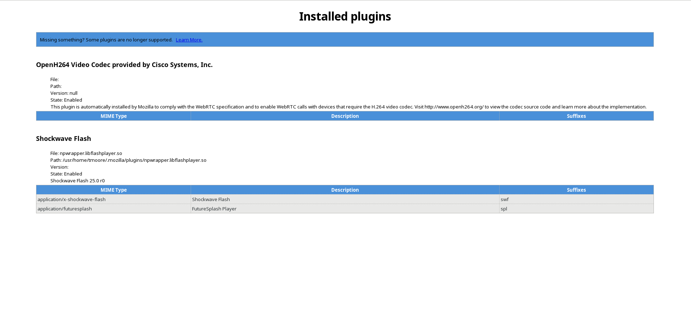

   : Flash Player Configuration

The options available in each tab and when to use them are described on
the Adobe website:

* `Storage <http://help.adobe.com/en_US/FlashPlayer/LSM/WS6aa5ec234ff3f285139dc56112e3786b68c-7fff.html>`_
  describes private browsing support and the privacy issues associated
  with local storage of flash information.

* `Camera and Mic <http://help.adobe.com/en_US/FlashPlayer/LSM/WS6aa5ec234ff3f285139dc56112e3786b68c-7ff8.html>`_
  controls how websites can use the computer's camera and microphone.

* `Playback <http://help.adobe.com/en_US/FlashPlayer/LSM/WS6aa5ec234ff3f285139dc56112e3786b68c-7ff5.html>`_
  describes how to configure peer-assisted networking to improve
  bandwidth.

* `Advanced <http://help.adobe.com/en_US/FlashPlayer/LSM/WS6aa5ec234ff3f285139dc56112e3786b68c-7ff0.html>`_
  controls how Flash Player handles browsing data, updates, trusted
  locations, and protected content.

.. index:: fonts
.. _Fonts:

Fonts 
=====

|trueos| installs with `Google Noto <http://www.google.com/get/noto/>`_
which provides multi-lingual Sans and Serif fonts. Many other fonts
are available from :ref:`AppCafe®`. Any font installed using |appcafe|
should not require any additional configuration to "just work".

If you have a collection of fonts that you have downloaded or purchased,
you can configure a |trueos| system to also use those fonts. Become the
superuser and copy the downloaded font to the
:file:`/usr/local/share/fonts/` directory. Then, run
:command:`fc-cache -f -v /usr/local/share/fonts/name_of_font` to refresh
the fonts cache.

.. index:: sound
.. _Sound Mixer Tray:

Sound Mixer Tray
================

|trueos| includes a graphical utility for managing the sound card's
mixer settings. The utility can be accessed using the speaker icon in
the system tray.

:numref:`Figure %s <sound1>` shows an example of clicking the mixer icon
in the system tray on a system with multiple audio outputs. If the
system only has one audio output, the :guilabel:`Outputs` submenu will
not be displayed. To change the default audio output, click its entry
in :guilabel:`Output`.

.. _sound1:

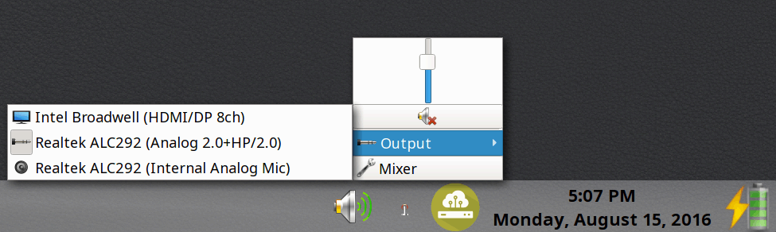

   : Mixer Icon

:numref:`Figure %s <sound2>` shows the menu which opens when you instead
click :guilabel:`Mixer` button shown in :ref:`sound1`.

.. _sound2:

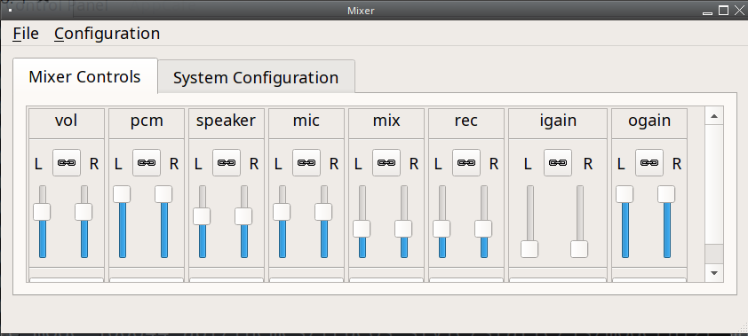

   : Mixer Controls

The :guilabel:`Mixer Controls` screen provides sliders to modify the
left and right channels that control volume, pcm (the sound driver),
the speaker, the microphone, the recording level, the input level, and
the output level. Each control can be muted/unmuted individually by
clicking :guilabel:`Mute` or :guilabel:`Unmute`, depending upon its
current mute state.

:numref:`Figure %s <sound3>` shows the :guilabel:`System Configuration`
tab.

.. _sound3:

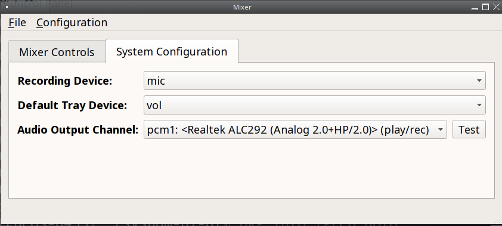

   : System Sound Configuration

This tab contains several options:

* **Recording Device:** Use the drop-down menu to select the device to
  use for recording sound.

* **Default Tray Device:** Use the drop-down menu to set the default
  slider to display in the system tray.

* **Audio Output Channel:** Use the drop-down menu to change the sound
  device and use :guilabel:`Test` to determine that sound is working.
  This is sometimes necessary when changing audio devices. For example,
  when connecting a USB headset, |trueos| will detect the new device and
  will automatically change the audio device to the USB input. However,
  when inserting a headset into an audio jack, the system may not detect
  the new input so the default device will have to be manually
  configured.

The :guilabel:`File` menu can be used to quit this mixer screen or to
close both this screen and remove the icon from the system tray.

.. note:: To re-add the mixer icon after removing it, type
   :command:`pc-mixer &`. Alternately, to open this application
   without adding it back to the system tray, type
   :command:`pc-mixer -notray`.

The :guilabel:`Configuration` menu provides options for accessing the
:guilabel:`PulseAudio Mixer` and :guilabel:`PulseAudio Settings`
utilities as well as for restarting PulseAudio. |trueos| provides full
`PulseAudio <https://www.freedesktop.org/wiki/Software/PulseAudio/>`_
support and these utilities can be used to configure discoverable
network sound devices and mixer levels.

.. index:: troubleshooting
.. _Troubleshooting Sound:

Troubleshooting Sound
---------------------

Type :command:`mixer` from the command line to see the current sound
settings

.. code-block:: none

 mixer
 Mixer vol      is currently set to   0:0
 Mixer pcm      is currently set to 100:100
 Mixer speaker  is currently set to 100:100
 Mixer mic      is currently set to  50:50
 Mixer rec      is currently set to   1:1
 Mixer monitor  is currently set to  42:42
 Recording source: monitor

If any of these settings are set to *0*, set them to a higher value by
specifying the name of the mixer setting and a percentage value up to
*100*

.. code-block:: none

 mixer vol 100
 Setting the mixer vol from 0:0 to 100:100.

To make the change permanent, create a file named :file:`.xprofile` in
the home directory the containing the corrected mixer setting.

If only one or two mixer settings are available, the default mixer
channel will need to change. As the superuser, try
:command:`sysctl -w hw.snd.default_unit=1` to alter the mixer channel.

To see if the mixer has changed to the correct channel, type
:command:`mixer` again. If there are still only have one or two mixer
settings, try setting the :command:`sysctl` value to *2*, and, if
necessary, *3*.

Once all of the mixer settings appear and none are set to *0*, sound
should now work. If it still does not, these resources may help pinpoint
the problem:

* `Sound Section of FreeBSD Handbook <http://www.freebsd.org/doc/en_US.ISO8859-1/books/handbook/sound-setup.html>`_

* `FreeBSD Sound Wiki <https://wiki.FreeBSD.org/Sound>`_

If you still have problems with sound, see the section on
:ref:`Finding Help` to determine which help resources are available.
When reporting the problem, include both your version of |trueos| and
the name of your sound card.

.. index:: multimedia
.. _Multimedia:

Multimedia
==========

|trueos| has been pre-configured to support most multimedia formats and
makes it easy to install most open source media applications using
:ref:`AppCafe®`.

When installing a web browser using |appcafe|, you should be able to
play most media formats, including YouTube™ videos, Internet radio, and
many trailer and movie sites.

If people are blue in YouTube™ videos, this is due to an unresolved issue
in Flash which Adobe hasn't fixed for open source players. To fix this
issue, right-click an area in the video, select :guilabel:`Settings`,
then uncheck :guilabel:`Enable hardware acceleration`. Alternately,
install `Minitube <http://flavio.tordini.org/minitube>`_ using
:ref:`AppCafe®` and use it to watch YouTube™.

.. note:: When encountering a file you can not play in a web browser or
   media player, it is probably because it is in a proprietary format
   which requires a licensing fee or restricts distribution of the codec
   required to play the media format.

|appcafe| contains several dozen applications for playing and editing
multimedia. It includes these popular applications (click the links to
view screenshots):

* `aTunes <http://www.atunes.org/?page_id=5>`_: Full-featured audio
  player and manager which can play mp3, ogg, wma, wav, flac, mp4 and
  radio streaming, allowing users to easily edit tags, organize music
  and rip audio CDs.

* `Audacity <https://sourceforge.net/projects/audacity/?lang=en>`_:
  Multilingual audio editor and recorder.

* `DeaDBeeF <http://deadbeef.sourceforge.net/screenshots.html>`_:
  Music player supporting most audio formats.

* `Decibel <http://decibel.silent-blade.org/index.php?n=Main.Screenshots>`_:
  Audio player built around a highly modular structure which lets the
  user completely disable unneeded features. Able to play CDs directly.

* `gtkpod <http://www.gtkpod.org/index.php?title=Screenshots>`_:
  Graphical user interface for the Apple iPod.

* `Miro <http://www.getmiro.com/download/screenshots/>`_: HD video
  player which can play almost any video file and offers over 6,000
  free Internet TV shows and video podcasts.

* `SMPlayer <http://smplayer.sourceforge.net/>`_: Universal media
  player which can handle any media format and play audio CDs, DVDs,
  (S)VCDs, TV/radio cards, YouTube™ and SHOUTcast™ streams. This is
  the default player used by :ref:`Mount Tray`.

.. index:: multimedia
.. _Kodi:

Kodi
----

`Kodi, formerly known as XBMC, <https://kodi.tv/>`_ is a GPL-licensed
software media player and entertainment hub for digital media. It can
play most audio and video formats, CDs and DVDs from a disk or image
file, and even files inside ZIP and RAR archives. It can scan all of
your media and automatically create a personalized library with album
covers, descriptions, and fan art.

Kodi can be installed using :ref:`AppCafe®`. Once installed, an entry
for :guilabel:`Kodi media center` will be added to
:guilabel:`Browse Applications`. Kodi can also be started by typing
:command:`kodi` from a command prompt.

If you have never used Kodi before, take some time to skim through the
`Kodi Wiki Manual <http://kodi.wiki/>`_. The
`Turn PC-BSD into a home theater forum post <https://forums.pcbsd.org/thread-19799.html>`_
contains a quick how-to for configuring Kodi.

.. index:: multimedia
.. _PlexHome Theater:

PlexHome Theater
----------------

`Plex Home Theater <https://plex.tv/>`_ is a centralized media
playback system. The central Plex Media Server streams media to many
Plex player Apps which are used to view your media library and watch
shows.

To install PlexHome Theater, use |appcafe|. Once installed, an entry
should be added to the :guilabel:`Multimedia` section of the application
menu of your desktop. PlexHome Theater can also be started by typing
:command:`plexhometheater` from a command prompt.

Once installed, an entry for :guilabel:`Plex Home Theater` will also be
added to the login manager so you can login directly to the home theater
instead of a desktop.

The first time running or logging into Plex Home Theater, a wizard will
check the audio settings and sign into your Plex account. If you have no
Plex account, create one at `plex.tv <https://plex.tv/>`_. The wizard
will provide a PIN code and an URL to enter the code. Once the PIN is
entered, the wizard will connect and sign you in. Now it is possible to
search for and watch media. To exit Plex, click :guilabel:`<` then
:guilabel:`Quit`.

.. index:: mount
.. _Mount Tray:

Mount Tray
==========

The :guilabel:`Mount Tray` graphical application is used to facilitate
the mounting and unmounting of internal disks, USB storage devices,
optical media, and network shares. It is included in the system tray
by default. If the icon is removed from the system tray, it can be
re-added by typing :command:`pc-mounttray &`.

.. note:: If mounting devices from the command line is preferred, see
   the section on :ref:`pc-sysconfig`.

In the example shown in :numref:`Figure %s <mount1>`, a USB device and
a music CD are currently inserted and the user has hovered over
:guilabel:`More Options` to view the available options.

.. _mount1:

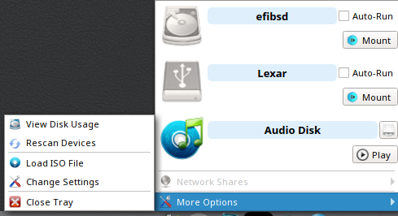

   : Mount Tray

When first inserting a USB drive, a :guilabel:`New Device` message will
appear in the system tray. Click the :guilabel:`Mount Tray` icon, then
:guilabel:`Mount` for the device. Mount Tray will try to determine the
filesystem on the device and then to mount it. If it is not sure, a
pop-up menu will prompt to select the correct filesystem. A list of
supported filesystems can be found in :ref:`filesys support`. Once
mounted, :guilabel:`Mount` changes to :guilabel:`Unmount`, and if the
device contains files, an indicator of the drive's used capacity and a
button to :guilabel:`Browse` the contents of the device will be added.
An example is shown in :numref:`Figure %s <mount2>`.

.. _mount2:

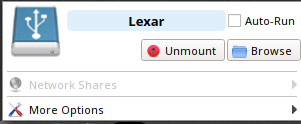

   : Mounted USB Device

If the device will be mounted often, it can be configured to mount
automatically when inserted by checking :guilabel:`Auto-Run`.

When finished using the device, press :guilabel:`Unmount`. This will
safely unmount the device and toggle the button back to
:guilabel:`Mount`. When attempting to unmount, if the file manager is
still open to the device's contents, a "Device Busy" message will be
generated. If this message appears, press :guilabel:`No` to close the
pop-up. Close the file manager, then press :guilabel:`Unmount` again.
This will ensure the device is unmounted cleanly.

.. note:: Mount Tray does allow for the USB device to be physically
   removed without unmounting it first. However, it is recommended to
   always :guilabel:`Unmount` the drive first.

When first inserting an optical media, such as a music CD or DVD video,
a message will indicate an optical disk is available and, by default,
the default player application will open to play the contents of the
disk. The default player used depends upon which applications have been
installed, where `VLC <http://www.videolan.org/vlc/>`_ takes precedence,
followed by `SMPlayer <http://smplayer.sourceforge.net/>`_. When closing
the player, you can click :guilabel:`Play`, shown in :ref:`mount1`, to
restart it.

If any network shares are available, :guilabel:`Network Shares` can be
hovered over to see more options to browse, share, and view types of
available shares.

Many options are available in the :guilabel:`More Options` menu:

* **View Disk Usage:** In the example shown in
  :numref:`Figure %s <mount3>`, an MSDOSFS-formatted USB device is
  mounted at :file:`/media/lexar`. The amount of disk space used by the
  system hard drive and the USB drive is shown in both GB and as a
  percentage of available disk space. The Mount Tray will turn yellow
  if disk space is over 70% and red if disk space is over 90%. If the
  internal disk drives are partitioned with any other filesystems, these
  will also appear in the Mount Tray.

  .. _mount3:

  .. figure:: images/mount3.png

  : Using Mount Tray to View Disk Usage

* **Rescan Devices:** Click this option if an entry for a newly inserted
  device does not automatically appear.

* **Load ISO File:** Used to mount an ISO to a memory disk. It will open
  a browse menu so you can browse to the location of the :file:`.iso`.
  Once the file is selected and mounted, its contents will be displayed
  in the default file manager. When finished browsing the contents,
  close the file manager and click :guilabel:`Eject` for the memory
  device in Mount Tray and enter your password when prompted. As the ISO
  is unmounted, the memory disk is also detached from the system.

* **Change Settings:** As seen in :numref:`Figure %s <mount4>`, this
  screen allows configuring whether or not optical disks automatically
  open using the default player, whether or not Mount Tray automatically
  rechecks the disk space used by mounted devices and how often to
  perform the check, and whether or not Mount Tray checks disk space
  when a disk is mounted.

  .. _mount4:

  .. figure:: images/mount4.png

  : Configuring Disk Space Checks

* **Close Tray:** Click this option to remove Mount Tray from the system
  tray.

.. index:: mount
.. _pc-sysconfig:

pc-sysconfig
------------

The previous section described |trueos|'s graphical mount utility. This
graphical utility has a command-line backend, :command:`pc-sysconfig`,
which can be used directly from the command line on |trueos| systems,
window managers without a system tray, or by users who prefer to use the
command line.

For usage information, run the command without any options:

.. code-block:: none

 pc-sysconfig
 pc-sysconfig: Simple system configuration utility
 Usage: "pc-sysconfig <command 1> <command 2> ..."
 Available Information Commands:
 "list-remdev": List all removable devices attached to the system.
 "list-mounteddev": List all removable devices that are currently mounted
 "list-audiodev": List all available audio devices
 "probe-netdrives": List all the available shared drives on the local network
 "list-mountednetdrives": List all the available shared drives which can currently be browsed (assuming the remote system is running properly)
 "supportedfilesystems": List all the filesystems that are currently detected/supported by pc-sysconfig
 "devinfo <device> [skiplabel]": Fetch device information (Filesystem, Label, Type)
 "devsize <device>": Fetch device space (must be mounted)
 "usingtormode": [TRUE/FALSE] Returns whether the system is routing all traffic through TOR
 "getscreenbrightness": Returns the brightness of the first controllable screen as a percentage (0-100) or "[ERROR]" otherwise
 "systemcansuspend": [TRUE/FALSE] Returns whether the system supports the S3 suspend state

 Available Action Commands:
  "mount <device> [<filesystem>] [<mountpoint>]":
   -- This will mount the removable device on the system (with user-accessible permissions if the mountpoint needs to be created)
   -- If there is no filesystem set (or "auto" is used), it will try to use the one that is auto-detected for the device
   -- If there is no mountpoint set, it will assign a new mountpoint within the "/media/" directory based on the device label
  "unmount <device or mountpoint> [force]":
   -- This will unmount the removable device from the system
   -- This may be forced by using the "force" flag as well (not recommended for all cases)
   -- If the input device is a memory disk (/dev/md*), then it will automatically remove the memory disk from the system as well
  "mountnet <IP of remote host> <Name of remote host>":
   -- This will setup the remote host to be browsable on the local system with the given name
   -- Note that the remote host is automatically mounted/unmounted based on local user activity
   -- To see where these network drives are mounted and can be browsed, see the output of "list-mountednetdrives"
  "unmountnet <IP of remote host>":
   -- This will remove the remote host from being browsable on the local system
  "load-iso <absolute path to the *.iso file>":
   -- This will load the ISO file as a memory disk on the system (making it available for mounting/browsing)
  "setdefaultaudiodevice <pcm device>":
   -- This will set the given pcm device (I.E. "pcm3") as the default audio output device
  "setscreenbrightness <percentage>":
   -- This will set the brightness of all the available screens to the given percentage
   -- It is also possible to adjust the current value by supplying a [+/-] before the number
   -- For example: using "+5" as the percentage will increase the brightness by 5% for each screen
   -- This returns "[ERROR]" or "[SUCCESS]" based on whether the change could be performed
  "suspendsystem": Puts the system into the suspended state (S3)

For example, to see a listed of the supported filesystems, use:

.. code-block:: none

 pc-sysconfig supportedfilesystems
 FAT, NTFS, EXT, CD9660, UFS, REISERFS, XFS, UDF, ZFS

.. index:: freebsdports
.. _FreeBSD Ports:

FreeBSD Ports
=============

It is possible to pull in ports from the FreeBSD project using
:command:`portsnap`, but this is currently **not** recommended for
|trueos|. Current development efforts are being made to offer an
alternative to :command:`portsnap` for |trueos| users, with this section
being updated when progress is made.

For now, it is recommended to use :command:`git` to fetch the FreeBSD
ports tree on a local system. Specifically, the |trueos| branch of the
FreeBSD ports tree will be pulled, which is regularly updated against
the base FreeBSD ports tree.

.. warning:: These commands must be run as the superuser or **root**.

When fetching ports for the first time:

:command:`# git clone http://github.com/trueos/freebsd-ports.git /usr/ports`.

To update an existing local ports directory:

.. code-block:: none

 # cd /usr/ports
 # git pull

.. index:: files
.. _Files and File Sharing:

Files and File Sharing
======================

Several file managers are available for installation using
:ref:`AppCafe®`. :numref:`Table %s <filemanagers>` provides an overview
of several popular file managers. To launch an installed file manager,
type its name as it appears in the :guilabel:`Application` column. To
install the file manager, use :ref:`AppCafe®` to install the package
name listed in the :guilabel:`Install` column. To research a
file manager's capabilities, start with the URL listed in its
:guilabel:`Screenshot` column.

.. _filemanagers:

.. table:: : Available File Managers

   +-------------+--------------+-------------------------------------------------------------+
   | Application | Install      | Screenshots                                                 |
   +=============+==============+=============================================================+
   | dolphin     | kde-baseapps | `<https://userbase.kde.org/Dolphin>`_                       |
   +-------------+--------------+-------------------------------------------------------------+
   | emelfm2     | emelfm2      | `<http://emelfm2.net/wiki/ScreenShots>`_                    |
   +-------------+--------------+-------------------------------------------------------------+
   | caja        | caja         | `<http://mate-desktop.org/gallery/1.6/>`_                   |
   +-------------+--------------+-------------------------------------------------------------+
   | mucommander | mucommander  | `<http://www.mucommander.com/screenshots.php>`_             |
   +-------------+--------------+-------------------------------------------------------------+
   | nautilus    | nautilus     | `<https://projects.gnome.org/nautilus/screenshots.html>`_   |
   +-------------+--------------+-------------------------------------------------------------+
   | pcmanfm     | pcmanfm      | `<http://lxde.org/easy_fast_file_management_pcmanfm>`_      |
   +-------------+--------------+-------------------------------------------------------------+
   | thunar      | thunar       | `<http://docs.xfce.org/xfce/thunar/start>`_                 |
   +-------------+--------------+-------------------------------------------------------------+
   | xfe         | xfe          | `<http://roland65.free.fr/xfe/index.php?page=screenshots>`_ |
   +-------------+--------------+-------------------------------------------------------------+

When working with files on a |trueos| system, save your files to your
home directory. Since most of the files outside your home directory are
used by the operating system and applications, you should not delete or
modify any files outside of your home directory unless confident in what
you are doing.

:numref:`Table %s <dirstructure>` summarizes the directory structure
found on a |trueos| system. :command:`man hier` explains this directory
structure in more detail.

.. _dirstructure:

.. table:: : |TrueOS| Directory Structure

   +-------------------------+------------------------------------------+
   | Directory               | Contents                                 |
   +=========================+==========================================+
   | /                       | Pronounced as "root" and represents the  |
   |                         | beginning of the directory structure     |
   +-------------------------+------------------------------------------+
   | /bin/                   | Applications (binaries) that were        |
   |                         | installed with the operating system      |
   +-------------------------+------------------------------------------+
   | /boot/                  | Stores the startup code, including       |
   |                         | kernel modules (like hardware drivers)   |
   +-------------------------+------------------------------------------+
   | /compat/linux/          | Linux software compatibility files       |
   +-------------------------+------------------------------------------+
   | /dev/                   | Files which are used by the operating    |
   |                         | system to access devices                 |
   +-------------------------+------------------------------------------+
   | /etc/                   | Operating system configuration files     |
   +-------------------------+------------------------------------------+
   | /etc/X11/               | The :file:`xorg.conf` configuration      |
   |                         | file                                     |
   +-------------------------+------------------------------------------+
   | /etc/rc.d/              | Operating system startup scripts         |
   +-------------------------+------------------------------------------+
   | /home/                  | Subdirectories for each user account;    |
   |                         | each user should store their files in    |
   |                         | their own home directory                 |
   |                         |                                          |
   +-------------------------+------------------------------------------+
   | /lib/                   | Operating system libraries needed for    |
   |                         | applications                             |
   +-------------------------+------------------------------------------+
   | /libexec/               | Operating system libraries and binaries  |
   +-------------------------+------------------------------------------+
   | /media/                 | Mount point for storage media such as    |
   |                         | DVDs and USB drives                      |
   +-------------------------+------------------------------------------+
   | /mnt/                   | Another mount point                      |
   +-------------------------+------------------------------------------+
   | /proc/                  | The proc filesystem required by some     |
   |                         | Linux applications                       |
   +-------------------------+------------------------------------------+
   | /rescue/                | Emergency recovery programs              |
   +-------------------------+------------------------------------------+
   | /root/                  | Administrative account's home directory  |
   +-------------------------+------------------------------------------+
   | /sbin/                  | Operating system applications;           |
   |                         | typically only the superuser can run     |
   |                         | these applications                       |
   +-------------------------+------------------------------------------+
   | /tmp/                   | Temporary file storage; files stored     |
   |                         | here may disappear when the system       |
   |                         | reboots                                  |
   +-------------------------+------------------------------------------+
   | /usr/bin/               | Contains most of the command line        |
   |                         | programs available to users              |
   +-------------------------+------------------------------------------+
   | /usr/local/             | Contains the binaries, libraries,        |
   |                         | startup scripts, documentation, and      |
   |                         | configuration files used by applications |
   |                         | installed from ports or packages         |
   +-------------------------+------------------------------------------+
   | /usr/local/share/fonts/ | System wide fonts for graphical          |
   |                         | applications                             |
   +-------------------------+------------------------------------------+
   | /usr/local/share/icons/ | System wide icons                        |
   +-------------------------+------------------------------------------+
   | /usr/ports/             | Location of system ports tree            |
   |                         | (if installed)                           |
   +-------------------------+------------------------------------------+
   | /usr/share/             | System documentation and man pages       |
   +-------------------------+------------------------------------------+
   | /usr/sbin/              | Command line programs for the superuser  |
   +-------------------------+------------------------------------------+
   | /usr/src/               | Location of system source code           |
   |                         | (if installed)                           |
   +-------------------------+------------------------------------------+
   | /var/                   | Files that change (vary), such as log    |
   |                         | files and print jobs                     |
   +-------------------------+------------------------------------------+

|trueos| provides built-in support for accessing Windows shares, meaning
you only have to decide which utility you prefer to access existing
Windows shares on your network.

:numref:`Table %s <windows shares utils>` summarizes some of the
available utilities.

.. _windows shares utils:

.. table:: : Utilities that Support Windows Shares

   +-------------+--------------+-----------------------------------------------------+
   | Application | Install      | How to Access Existing Shares                       |
   +=============+==============+=====================================================+
   | dolphin     | kde-baseapps | In the left frame, click                            |
   |             |              | :menuselection:`Network --> Samba Shares`, then the |
   |             |              | Workgroup name; if the network requires a username  |
   |             |              | and password to browse for shares, set this in      |
   |             |              | :menuselection:`System Settings --> Sharing` while  |
   |             |              | in KDE or type :command:`systemsettings` and click  |
   |             |              | :guilabel:`Sharing` while in another desktop        |
   +-------------+--------------+-----------------------------------------------------+
   | smb4k       | smb4k-kde4   |                                                     |
   +-------------+--------------+-----------------------------------------------------+
   | mucommander | mucommander  | Click                                               |
   |             |              | :menuselection:`Go --> Connect to server --> SMB`;  |
   |             |              | input the NETBIOS name of server, name of share,    |
   |             |              | name of domain (or workgroup), and the share's      |
   |             |              | username and password                               |
   +-------------+--------------+-----------------------------------------------------+
   | nautilus    | nautilus     | Click                                               |
   |             |              | :menuselection:`Browse Network --> Windows Network` |
   +-------------+--------------+-----------------------------------------------------+
   | thunar      | thunar       | In the left frame, click                            |
   |             |              | :menuselection:`Network --> Windows Network`        |
   +-------------+--------------+-----------------------------------------------------+

.. index:: configuration
.. _Disk Manager:

Disk Manager
============

The |trueos| Disk Manager can be used to manage ZFS pools and datasets
as well as the disks attached to the system. To access this utility, use
:menuselection:`Browse Applications --> Disk Manager` or type
:command:`pc-su pc-diskmanager` from within an xterm. The user password
is required in order to access this utility.

As seen in :numref:`Figure %s <disk1>`, the utility will open in the
:guilabel:`Disks` tab which shows the size of each disk as well as its
partitioning scheme. If an unformatted disk or free disk space is
available, right-click the device to start formatting.

.. _disk1:

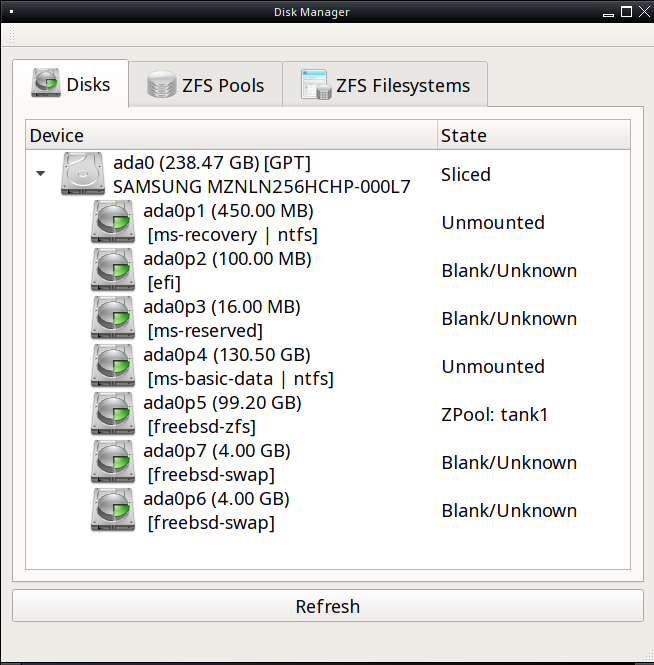

   : Managing Disks

To view the status of the ZFS pool(s) and the disk(s) in each pool,
click the :guilabel:`ZFS Pools` tab. In the example
:numref:`Figure %s <disk2>`, the ZFS pool named *tank1* was created
from one disk. :guilabel:`Online` indicates the pool is healthy.

.. _disk2: 

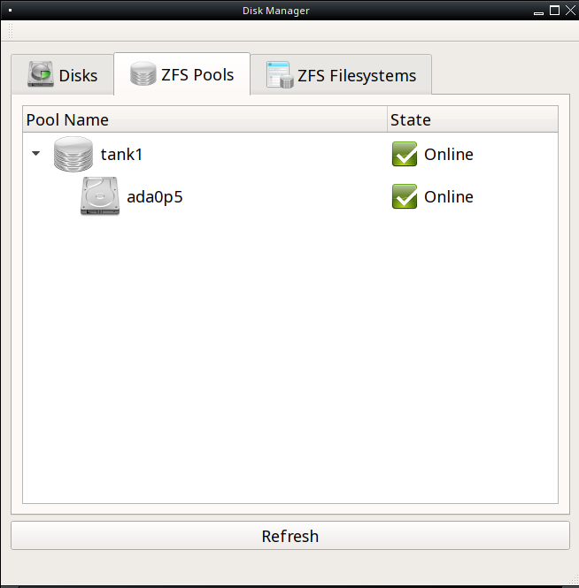

   : ZFS Pool Status

Right-click the pool name to view a number of options:

* **Create new pool:** Use this option if additional disks are available
  and you want to create another pool instead of adding them to an
  existing pool. This will open a screen which allows naming the new
  pool, selecting which additional disks will go into it, and
  selecting how to configure the disks.

* **Rename pool:** Will prompt to input the new name for the pool.

* **Destroy pool:** **Do not select** this option unless the intent is
  to destroy all data on the disks!

* **Add devices:** Depending upon the type of disk configuration, the
  pool size may be extendable by adding an equal number of disks.

* **Add log devices:** Used to add an SSD or disk as a secondary ZIL.

* **Add cache devices:** Used to add an SSD or disk as an L2ARC.

* **Add spare devices:** At this time, FreeBSD does not support hot
  spares.

* **Scrub:** Will immediately start a ZFS scrub. This option can be I/O
  intensive so it isn't recommended while the system is in use.

* **Export pool:** This action should be performed if you will be
  physically moving the disks from one system to another.

* **Properties:** Used to manage the default properties of the pool.
  Datasets inherit the default properties, unless a property is set to
  a different value on the dataset.

When right-clicking a disk entry, such as *ada0p5*, several options are
available:

* **Attach (mirror) device:** If you wish to mirror additional disk(s),
  this option will open a screen which allows specifying the disk(s) to
  add.

* **Take offline:** If a bad disk needs to be replaced, select this
  option before physically removing the disk.

As seen in :numref:`Figure %s <disk3>`, the :guilabel:`ZFS Filesystems`
tab will display the system's ZFS datasets and their snapshots, the
amount of space available to each dataset, and the amount of space each
dataset is using.

.. _disk3:

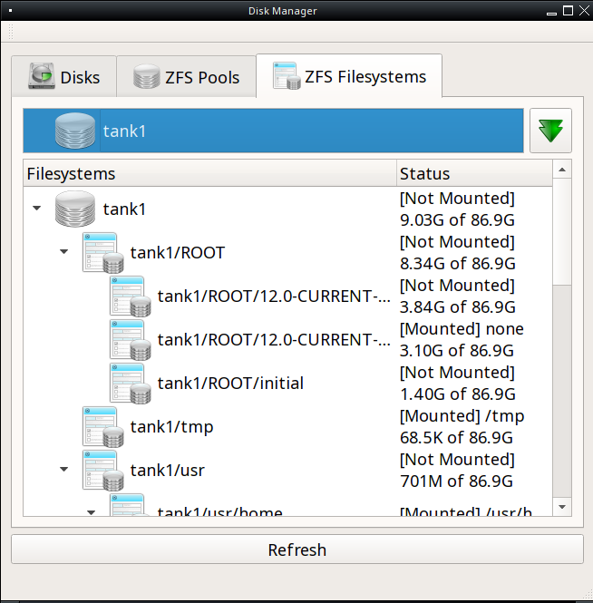

   : ZFS Datasets

The name of the pool in this example is *tank1*. If the system has
multiple pools, click the :guilabel:`green arrow` to select the desired
pool.

Right-click the pool name under :guilabel:`Filesystems` to see more
options:

* **Mount:** Whether or not the filesystem can be mounted depends upon
  the value of the :command:`canmount` property of the dataset.

* **Create new dataset:** :numref:`Figure %s <disk4>` shows the
  available options when creating a new dataset.

  .. _disk4:

  .. figure:: images/disk4.png
     :scale: 100%

     : Creating New ZFS Dataset

* **Create a clone dataset:** Creates a copy of the dataset.

* **Take a snapshot:** Will prompt for the name of the snapshot. The
  field is pink to remind you to type the snapshot name immediately
  after the pool name and *@* symbol. In this example, *tank1@* will be
  displayed in the name field. An example snapshot name could be
  *tan1k@snapshot1* or *tank1@201505181353* to denote the date and time
  the snapshot was created. The snapshot creation will be instantaneous
  and the new snapshot will be added to the list of datasets and will
  have a camera icon. Click the entry for the snapshot to rename it,
  clone it, destroy it, rollback the system to a specific point in time,
  or edit its properties. If you forget when the snapshot was made, pick
  :guilabel:`Edit properties` from the snapshot's right-click menu as it
  will show its :command:`creation` property.

* **Edit properties:** Allows modification of the ZFS properties for the
  pool, as seen in :numref:`Figure %s <disk5>`. The available options
  depend upon the property being modified. The options which are
  read-only will have a :guilabel:`red minus sign` next to them. ZFS
  options are described in :command:`man zfs` and are recommended to be
  left unchanged unless familiar with the ramifications.

  .. _disk5:

  .. figure:: images/disk5.png
     :scale: 100%

     : Editing the Pool's ZFS Properties

When creating a new dataset or clone, several options are available.
Again, these options are described in :command:`man zfs` with changes
not recommended unless familiar with the ramifications.

* **Name:** This field is pink as a reminder to type in the dataset
  name immediately after the trailing **/** of the displayed pool name.

* **Prevent auto mount:** If the box is checked, the dataset will not
  be mounted at boot time and instead must be manually mounted as
  needed.

* **Mountpoint:** Choices are **none**, **legacy**, or **[path]**. If
  you select **[path]**, input the full path for the mountpoint.

* **Force UTF-8 only:** If checked, filenames not in the UTF-8 character
  code set will be unsavable.

* **Unicode normalization:** If checked, indicate whether unicode
  normalization should occur when comparing filenames, and if so, which
  normalization algorithm to use. Choices are **none**, **formD**, or
  **formKCF**.

* **Copies:** If checked, indicates the number of copies (**1 to 3**) of
  data to store in the dataset. The copies are in addition to any
  redundancy and stored on different disks when possible.

* **Deduplication:** Enables deduplication.

.. warning:: **Do not** enable this option if the system has less than
   the minimum recommended 5 GB of RAM per TB of storage to be
   deduplicated.

* **Compression:** If checked and a compression algorithm is selected
  in the drop-down menu, data will automatically be compressed as it
  is written and uncompressed as it is read. The algorithm determines
  the amount and speed of compression, where typically increased
  compression results in decreased speed. The **lz4** algorithm is
  recommended as it provides very good compression at near real-time
  speed.

.. index:: network
.. _Network Manager:

Network Manager
===============

During installation, |trueos| configures any connected Ethernet
interfaces to use DHCP and provides a screen to
:ref:`Connect to a Wireless Network`. In most cases, this means
connected interfaces should "just work" whenever using a |trueos|
system.

After installation, a wireless configuration icon will appear in the
system tray if |trueos| detects a supported wireless card. Hover
over the wireless icon, shown in :numref:`Figure %s <network1>`, to see
it indicate if the interface is associated and provide information
regarding the IP address, IPv6 address, SSID, connection strength,
connection speed, MAC address, and type of wireless device.

.. _network1:

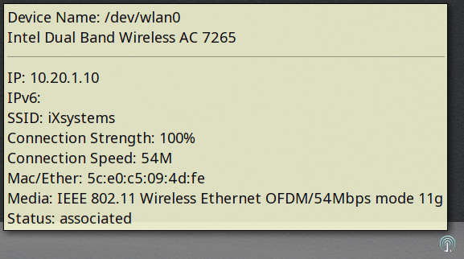

   : System Tray Wireless Information

If you right-click the wireless icon, a list of detected wireless
networks will appear. Click the name of a network to associate with it.
The right-click menu also provides options to configure the wireless
device, start the Network Manager, restart the network (useful to renew
your DHCP address), route the network connection through Tor (to browse
the Internet anonymously as described in :ref:`Tor Mode`), and close the
Network Monitor so the icon no longer shows in the system tray.

To view or manually configure a network interface, click
:guilabel:`Start the Network Manager` within |sysadm| or type
:command:`sudo pc-netmanager`. If a new device has been inserted, such
as a USB wireless interface, a pop-up message will open when Network
Manager starts, indicating the name of the new device, and asking if you
would like to enable it. Click :guilabel:`Yes` and the new device will
be displayed with the list of network interfaces that |trueos|
recognizes. In the example seen in :numref:`Figure %s <network2>`, the
system has one Intel Ethernet interface that uses the **em** driver and
an Intel wireless interface that uses the **wlan** driver.

.. _network2:

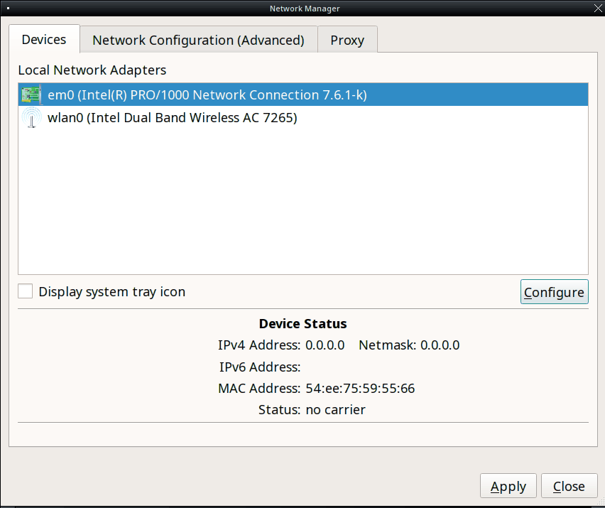

   : Network Manager

The rest of this section describes each tab of the Network Manager
utility and demonstrates how to view and configure the network settings
for both Ethernet and wireless devices. It will then present some common
troubleshooting scenarios, known issues, and suggestions for when a
device does not have a built-in driver.

.. index:: network
.. _Ethernet Adapters:

Ethernet Adapters
-----------------

If you highlight an Ethernet interface in the :guilabel:`Devices` tab
and either click :guilabel:`Configure` or double-click the interface
name, the screen shown in :numref:`Figure %s <network3>` will appear.

.. _network3:

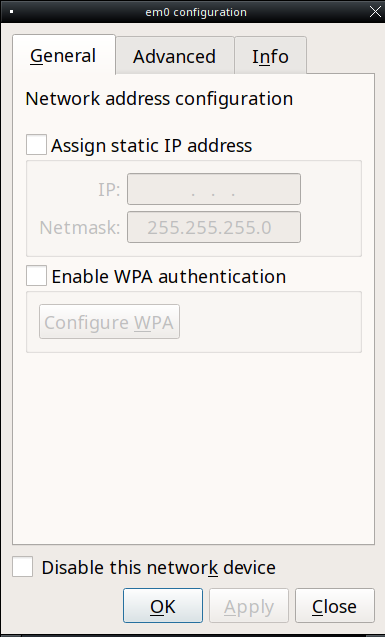

   : Network Settings for an Ethernet Interface

There are two ways to configure an Ethernet interface:

1. **Use DHCP:** This method assumes your Internet provider or network
   router assigns addressing information automatically using the DHCP
   protocol. Most networks are built in this manner. This method is
   recommended as it should "just work".

2. **Manually type in the IP addressing information:** This method
   requires an understanding of the basics of TCP/IP addressing or
   knowledge of which IP address to use on your network. If you do not
   know which IP address or subnet mask to use, ask your Internet
   provider or network administrator.

By default, |trueos| attempts to obtain an address from a DHCP server.
If you wish to manually type in your IP address, check
:guilabel:`Assign static IP address`. Type in the IP address, using the
right arrow key or the mouse to move between octets. Then, double-check
the subnet mask (**Netmask**) is the correct value. If not, change it
again.

If the Ethernet network uses 802.1x authentication, check
:guilabel:`Enable WPA authentication`, which will enable
:guilabel:`Configure WPA`. Click this button to select the network and
input the authentication values required by the network.

By default, :guilabel:`Disable this network device` is unchecked. If
this checkbox is marked, |trueos| will immediately stop the interface
from using the network. The interface will remain inactive until this
checkbox is unchecked.

The :guilabel:`Advanced` tab, seen in :numref:`Figure %s <network4>`,
allows advanced users to manually input a :wikipedia:`MAC address` or
:wikipedia:`IPv6 address`. Both boxes should remain checked in order
to automatically receive these addresses, unless you are an advanced
user with reason to change the default MAC or IPv6 address and an
understanding of how to input an appropriate replacement address.

.. _network4:

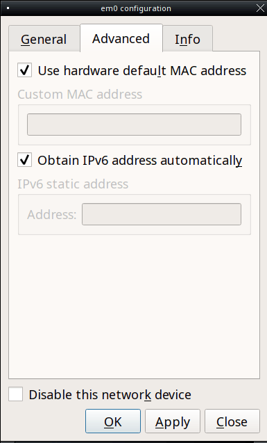

   : Ethernet Interface Network Settings - Advanced

The :guilabel:`Info` tab, seen in :numref:`Figure %s <network5>`,
displays the current network address settings and some traffic
statistics.

.. _network5:

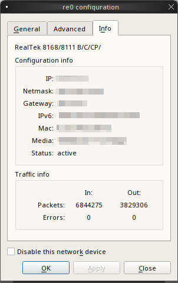

   : Ethernet Interface Network Settings - Info

If any changes are made within any of the tabs, click :guilabel:`Apply`
to activate them. Click :guilabel:`OK` when finished to return to the
main Network Manager window.

Repeat this procedure for each network interface to view or configure.

.. index:: network
.. _Wireless Adapters:

Wireless Adapters
-----------------

If the wireless interface does not automatically associate with a
wireless network, the wireless profile containing the security settings
required by the network will need to be configured.
Double-click the wireless icon in the system tray or highlight the
wireless interface displayed in the :guilabel:`Devices` tab of Network
Manager and click :guilabel:`Configure`. :numref:`Figure %s <network6>`
demonstrates this system's wireless interface is currently associated
with the wireless network listed in the
:guilabel:`Configured Network Profiles` section.

.. _network6:

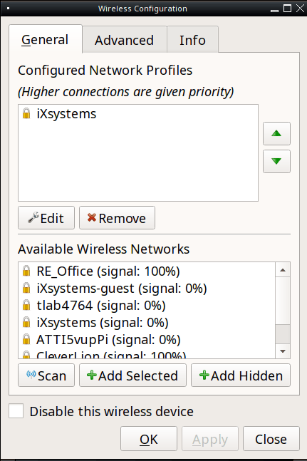

   : Wireless Configuration

To associate with a wireless network, click :guilabel:`Scan` to receive
a list of connectable wireless networks. Highlight the desired network
to associate with and click :guilabel:`+Add Selected`. If the network
requires authentication, a pop-up window will prompt you for the
authentication details. Input the values required by the network then
click :guilabel:`Close`. |trueos| will add an entry for the network in
the :guilabel:`Configured Network Profiles` section.

If the network is hidden, click :guilabel:`+Add Hidden`, input the name
of the network in the pop-up window, and click :guilabel:`OK`.

If multiple networks are added, use the arrow keys to place them in the
desired connection order. |trueos| will try to connect to the first
profile in the list, and if unable to connect, move sequentially down
the list. When finished, click :guilabel:`Apply`. A pop-up message will
indicate |trueos| is restarting the network. If all went well, there
should be an IP address and status of **associated** when hovering over
the wireless icon in the system tray. If this is not the case,
double-check for errors in the configuration values and read the section
on :ref:`Troubleshooting Network Settings`.

|trueos| supports the types of authentication shown in
:numref:`Figure %s <network7>`. Access this screen and change
authentication settings by highlighting an entry in the
:guilabel:`Configured Network Profiles` section and clicking
:guilabel:`Edit`.

.. _network7:

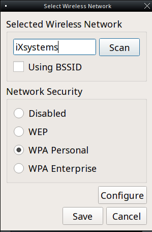

   : Configuring Wireless Authentication Settings

This screen provides configuration of different types of wireless
security:

* **Disabled:** If the network is open, no additional configuration is
  required.

* **WEP:** This type of network can be configured to use either a hex
  or a plaintext key and Network Manager will automatically select the
  type of detected key. If :guilabel:`WEP` is pressed, then
  :guilabel:`Configure`, the screen in :numref:`Figure %s <network8>`
  will appear. Type the key into both :guilabel:`Network Key` boxes. If
  the key is complex, check :guilabel:`Show Key` to ensure the passwords
  are matching and correct. Uncheck this box when finished to replace
  the characters in the key with bullets. A wireless access point using
  WEP can store up to 4 keys and the number in the :guilabel:`key index`
  indicates which desired key to use.

  .. _network8:

  .. figure:: images/network8.png
     :scale: 100%

     : WEP Security Settings

* **WPA Personal:** This type of network uses a plaintext key. If you
  click :guilabel:`WPA Personal` then :guilabel:`Configure`, the screen
  shown in :numref:`Figure %s <network9>` appears. Type in the key twice
  to verify it. If the key is complex, check :guilabel:`Show Key` to
  ensure the passwords match.

  .. _network9:

  .. figure:: images/network9.png
     :scale: 100%

     : WPA Personal Security Settings

* **WPA Enterprise:** If you click :guilabel:`WPA Enterprise` then
  :guilabel:`Configure`, the screen shown in
  :numref:`Figure %s <network10>` will appear. Select the
  :guilabel:`EAP Authentication Method`, input the EAP identity, browse
  for the CA certificate, client certificate and private key file, and
  input and verify the password.

  .. _network10:

  .. figure:: images/network10.png
     :scale: 100%

     : WPA Enterprise Security Settings

.. note:: If unsure which type of encryption is being used, ask the
   person who setup the wireless router. They should also be able to
   provide the value of any settings seen in these configuration
   screens.

To disable this wireless interface, check
:guilabel:`Disable this wireless device` in the :guilabel:`General` tab
for the device. This setting can be useful to temporarily prevent the
wireless interface from connecting to untrusted wireless networks.

The :guilabel:`Advanced` tab, seen in :numref:`Figure %s <network11>`,
allows configuring several options:

* **Custom MAC address:** This setting is for advanced users and
  requires :guilabel:`Use hardware default MAC address` to be unchecked.

* **Interface receiving IP address information:** If the network
  contains a DHCP server, check
  :guilabel:`Obtain IP automatically (DHCP)`. Otherwise, input the IP
  address and subnet mask to use on the network.

* **Country code:** This setting is not required if in North America.
  For other countries, check :guilabel:`Set Country Code` and select
  your country from the drop-down menu.

.. _network11:

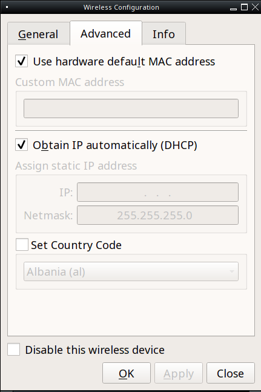

   : Wireless Interface - Advanced

The :guilabel:`Info` tab, seen in :numref:`Figure %s <network12>`, shows
the current network status and statistics for the wireless interface.

.. _network12:

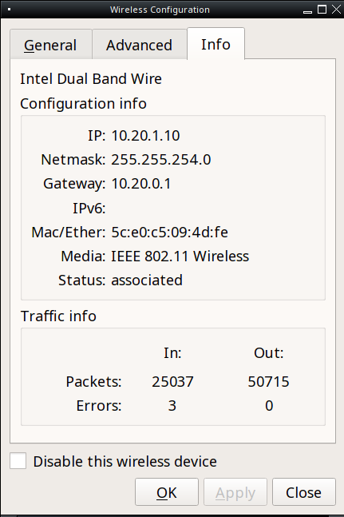

   : Wireless Interface - Info

.. index:: network
.. _Network Configuration (Advanced):

Network Configuration (Advanced)
--------------------------------

The :guilabel:`Network Configuration (Advanced)` tab of the Network
Manager is seen in :numref:`Figure %s <network13>`.
The displayed information is for the currently highlighted interface.
To edit these settings, make sure that the interface to configure is
highlighted in the :guilabel:`Devices` tab.

.. _network13:

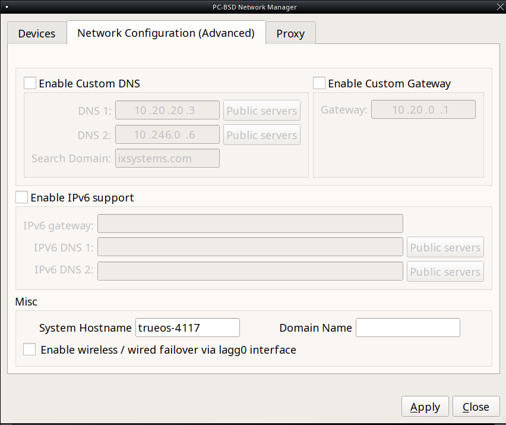

   : Network Configuration - Advanced

If the interface receives its IP address information from a DHCP
server, this screen allows viewing of the received DNS information. To
override the default DNS settings or set them manually, check
:guilabel:`Enable Custom DNS`. You can then set:

* **DNS 1:** The IP address of the primary DNS server. If unsure which
  IP address to use, click :guilabel:`Public servers` to select a public
  DNS server.

* **DNS 2:** The IP address of the secondary DNS server.

* **Search Domain:** The name of the domain served by the DNS server.

To change or set the default gateway, check
:guilabel:`Enable Custom Gateway` box and input the IP address of the
default gateway.

Several settings can be modified in the IPv6 section:

* **Enable IPv6 support:** If this box is checked, the specified
  interface can participate in IPv6 networks.

* **IPv6 gateway:** The IPv6 address of the default gateway used on the
  IPv6 network.

* **IPv6 DNS 1:** The IPv6 address of the primary DNS server used on the
  IPv6 network. If unsure which IP address to use, click
  :guilabel:`Public servers` to select a public DNS server.

* **IPv6 DNS 2:** The IPv6 address of the secondary DNS server used on
  the IPv6 network.

The :guilabel:`Misc` section has more options to configure:

* **System Hostname:** The name of your computer. It must be unique on
  your network.
  
* **Domain Name:** If the system is in a domain, specify it here.

* **Enable wireless/wired failover via lagg0 interface:** This
  interface allows seamless switching between using an Ethernet
  interface and a wireless interface. Check the box to enable this
  functionality.

.. note:: Some users experience problems using lagg. If you have
   problems connecting to a network using an interface which previously
   worked, uncheck this box and remove any references to :command:`lagg`
   from :file:`/etc/rc.conf`.

If any changes are made within this window, click :guilabel:`Apply` to
apply them.

.. index:: network
.. _Proxy Settings:

Proxy Settings
--------------

The :guilabel:`Proxy` tab, shown in :numref:`Figure %s <network14>`, is
used when the network requires going through a proxy server to access
the Internet.

.. _network14:

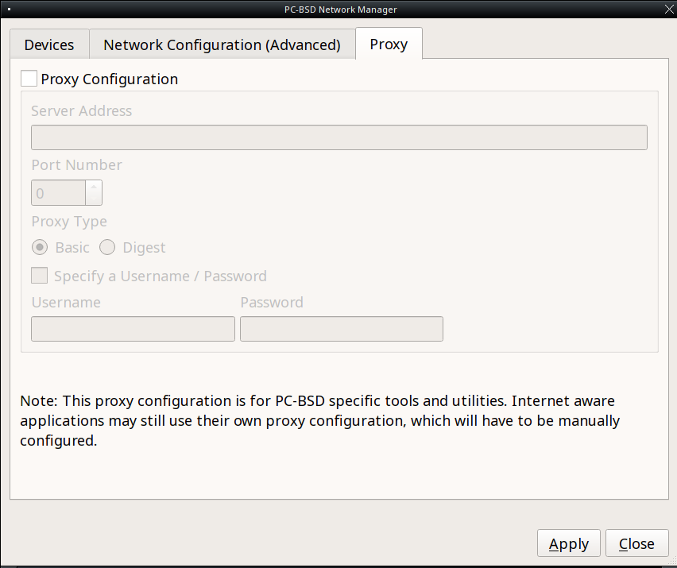

   : Proxy Settings Configuration

Check :guilabel:`Proxy Configuration` to activate the settings. Some
settings can be configured in this screen:

* **Server Address:** Enter the IP address or hostname of the proxy
  server.

* **Port Number:** Enter the port number used to connect to the proxy
  server.

* **Proxy Type:** Choices are **Basic** (sends the username and
  password unencrypted to the server) and **Digest** (never transfers
  the actual password across the network, but instead uses it to encrypt
  a value sent from the server). Do not select **Digest** unless the
  proxy server supports it.

* **Specify a Username/Password:** Check this box and input the username
  and password if they are required to connect to the proxy server.

Proxy settings are saved to the :file:`/etc/profile` and
:file:`/etc/csh.cshrc` files so they are available to the |trueos|
utilities as well as any application using :command:`fetch`.

Applications not packaged with the operating system, such as web
browsers, may require configuring proxy support using an application's
configuration utility.

If you apply any changes to this tab, a pop-up message will warn you may
have to logout and back in for the proxy settings to take effect.

.. index:: network
.. _Configuring a Wireless Access Point:

Configuring a Wireless Access Point
-----------------------------------

Right-click the entry for a wireless device, as seen in
:numref:`Figure %s <network15>`, and choose
:guilabel:`Setup Access Point`.

.. _network15:

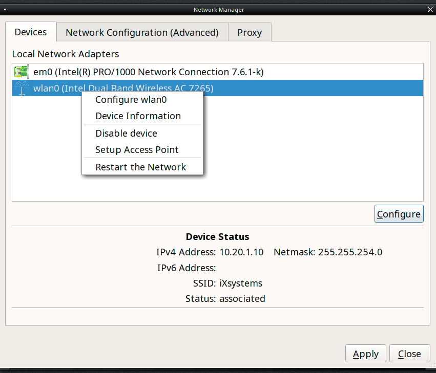

   : Setup Access Point

:numref:`Figure %s <network16>` shows the configuration screen if
:guilabel:`Setup Access Point` is selected.

.. _network16:

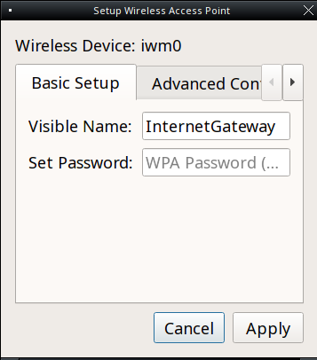

   : Access Point Basic Setup

The :guilabel:`Basic Setup` tab of this screen contains two options:

* **Visible Name:** This is the name appearing when users scan for
  available access points.

* **Set Password:** Setting a WPA password is optional, though
  recommended to only allow authorized devices to use the access point.
  If used, the password must be a minimum of 8 characters.

:numref:`Figure %s <network17>` shows the
:guilabel:`Advanced Configuration (optional)` screen.

.. _network17:

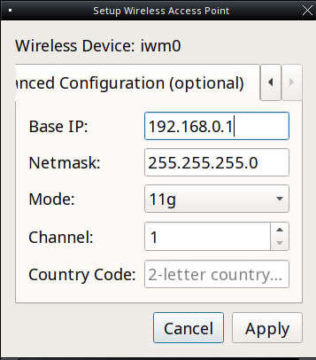

   : Access Point Advanced Setup

The settings in this screen are optional and allow for fine-tuning the
access point's configuration:

* **Base IP:** The IP address of the access point.

* **Netmask:** The associated subnet mask for the access point.

* **Mode:** Available modes are **11g** (for 802.11g), **11ng** (for
  802.11n on the 2.4-GHz band), or **11n** (for 802.11n).

* **Channel:** Select the channel to use.

* **Country Code:** The two letter country code of operation.

.. index:: network
.. _Troubleshooting Network Settings:

Troubleshooting Network Settings
--------------------------------

While networking usually "just works" on a |trueos| system, users
sometimes encounter problems, especially when connecting to wireless
networks. Sometimes the problem is due to a configuration error and
sometimes a driver is buggy or is not yet available. This section is
meant to help pinpoint the problem so you can either personally fix it
or give the developers the information they need to fix or create a
driver.

When troubleshooting the network configuration, use these files and
commands.

The :file:`/etc/rc.conf` file is read when the system boots up. In
order for the system to configure an interface at boot time, an entry
must exist for it in this file. Entries are automatically created
during installation for each active interface. An entry will be added
(if it does not exist) or modified (if it already exists) when
configuring an interface using Network Manager.

Here is an example of the :file:`rc.conf` entries for an ethernet driver
(**em0**) and a wireless driver (**run0**):

.. code-block:: none

 ifconfig_em0="DHCP"
 wlans_iwm0="wlan0"
 ifconfig_wlan0="WPA SYNCDHCP"

When reading your own file, look for lines beginning with **ifconfig**.
For a wireless interface, also look for lines containing **wlans**.

.. note:: Unlike Linux interface driver names, FreeBSD/|trueos|
   interface driver names indicate the type of chipset. Each driver
   name has an associated man page where you can learn which devices
   use that chipset and if there are any configuration options or
   limitations for the driver. When reading the man page, do not
   include the interface number. For the above example, read
   :command:`man em` and :command:`man iwm`.

:file:`/etc/wpa_supplicant.conf` is used by wireless interfaces and
contains the information needed to connect to a WPA network. If this
file does not already exist, it is created when entering the
:guilabel:`Configuration` screen of a wireless interface.

The :command:`ifconfig` command shows the current state of the
interfaces. When reading through its output, ensure the desired
interface is listed, has a status of **active**, and has an IP address.
Here is a sample :command:`ifconfig` output showing the entries for an
*re0* Ethernet interface and a *run0* wireless interface:

.. code-block:: none

 re0: flags=8843<UP,BROADCAST,RUNNING,SIMPLEX,MULTICAST> metric 0 mtu 1500 options=389b<RXCSUM,TXCSUM,VLAN_MTU,VLAN_HWTAGGING,VLAN_HWCSUM,WOL_UCAST,WOL_MCAST,WOL_MAGIC>
 ether 60:eb:69:0b:dd:4d
 inet 192.168.1.3 netmask 0xffffff00 broadcast 192.168.1.255
 media: Ethernet autoselect (100baseTX <full-duplex>)
 status: active

 run0: flags=8843<UP,BROADCAST,RUNNING,SIMPLEX,MULTICAST> metric 0 mtu 2290
 ether 00:25:9c:9f:a2:30
 media: IEEE 802.11 Wireless Ethernet autoselect mode 11g
 status: associated

 wlan0: flags=8843<UP,BROADCAST,RUNNING,SIMPLEX,MULTICAST> metric 0 mtu 1500
 ether 00:25:9c:9f:a2:30
 media: IEEE 802.11 Wireless Ethernet autoselect (autoselect)
 status: no carrier
 ssid "" channel 10 (2457 MHz 11g)
 country US authmode WPA1+WPA2/802.11i privacy ON deftxkey UNDEF
 txpower 0 bmiss 7 scanvalid 60 protmode CTS wme roaming MANUAL bintval 0

In this example, the ethernet interface (*re0*) is active and has an IP
address. However, the wireless interface (*run0*, which is associated
with *wlan0*) has a status of **no carrier** and does not have an IP
address. In other words, it has not yet successfully connected to the
wireless network.

The :command:`dmesg` command lists the hardware probed during boot time
and will indicate if the associated driver was loaded. To search the
output of this command for specific information, pipe it to
:command:`grep` as seen in this example:

.. code-block:: none

 dmesg | grep Ethernet
 re0: <RealTek 8168/8111 B/C/CP/D/DP/E PCIe Gigabit Ethernet> port 0xc000-0xc0ff mem 0xd0204000-0xd0204fff,0xd0200000-0xd0203fff irq 17 at device 0.0 on pci8
 re0: Ethernet address: 60:eb:69:0b:dd:4d

 dmesg |grep re0
 re0: <RealTek 8168/8111 B/C/CP/D/DP/E PCIe Gigabit Ethernet> port 0xc000-0xc0ff mem 0xd0204000-0xd0204fff,0xd0200000-0xd0203fff irq 17 at device 0.0 on pci8
 re0: Using 1 MSI messages
 re0: Chip rev. 0x28000000
 re0: MAC rev. 0x00000000 miibus0: <MII bus> on re0
 re0: Ethernet address: 60:eb:69:0b:dd:4d
 re0: [FILTER]
 re0: link state changed to DOWN
 re0: link state changed to UP

 dmesg | grep run0
 run0: <1.0> on usbus3
 run0: MAC/BBP RT3070 (rev 0x0201), RF RT2020 (MIMO 1T1R), address 00:25:9c:9f:a2:30
 run0: firmware RT2870 loaded

If the desired interface does not show up in :command:`ifconfig` or
:command:`dmesg`, it is possible a driver for this card is not provided
with the operating system. If the interface is built into the
motherboard of the computer, use the :command:`pciconf` command to find
out the type of card:

.. code-block:: none

 pciconf -lv | grep Ethernet
 device = 'Gigabit Ethernet NIC(NDIS 6.0) (RTL8168/8111/8111c)'

 pciconf -lv | grep wireless
 device = 'Realtek RTL8191SE wireless LAN 802.11N PCI-E NIC (RTL8191SE?)'

In this example, there is a built-in Ethernet device using a driver
which supports the *RTL8168/8111/8111c* chipsets. As we saw earlier, the
driver is *re0*. The built-in wireless device was also found but the *?*
indicates a driver for the *RTL8191SE* chipset was not found. A web
search for **FreeBSD RTL8191SE** will give an indication if a driver
existsor is being developed.

The FreeBSD Handbook chapter on
`Wireless Networking <http://www.freebsd.org/doc/en_US.ISO8859-1/books/handbook/network-wireless.html>`_
provides a good overview of how wireless works and offers additional
troubleshooting suggestions.

.. index:: security
.. _Tor Mode:

Tor Mode
--------

Tor mode uses `Tor <https://www.torproject.org/>`_,
`socat <http://www.dest-unreach.org/socat/>`_, and a built-in script
which automatically creates the necessary firewall rules to enable and
disable Tor mode at the user's request. While in Tor mode, the firewall
will redirect all outgoing *port 80* (HTTP), *443* (HTTPS), and DNS
traffic through the Tor transparent proxy network.

To start tor mode, right-click the network icon in the system tray and
check :guilabel:`Route through TOR`. You will be prompted to enter your
password via a pop-up shown in :numref:`Figure %s <tor1>`. If activated
correctly, |trueos| will open a new browser window directed to
https://check.torproject.org

.. _tor1:

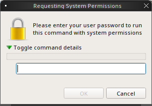

   : Enabling Tor Mode

If you have never used the Tor network before, it is recommended to
read the link for the Tor FAQ. Click :guilabel:`Yes` to enable tor mode
and enter your password when prompted so the firewall rules can be
updated.

While in tor mode, a small :guilabel:`onion` will be added to the Update
Manager icon and, when hovering over the icon, it will show
"(Routing through Tor)". You can verify you are connected to the Tor
network by right-clicking Update Manager and clicking
:guilabel:`Check Tor connection`. It will take a few moments, but a
pop-up message should indicate the connection to
`<https://check.torproject.org/>`_ succeeded.

.. note:: The system will remain in tor mode, even after a reboot, until
   it is disabled. To disable tor mode, right-click Update Manager and
   uncheck :guilabel:`Routing through Tor`. Now when
   :guilabel:`Check Tor connection` is pressed, it should indicate you
   are not using Tor.

To enable and disable tor mode from the command line or on a desktop
with no system tray, use these commands:

* :command:`sudo enable-tor-mode` enables tor mode.

* :command:`sudo disable-tor-mode` disables tor mode.

.. index:: windows
.. _Windows Emulation:

Windows Emulation
=================

`Wine <https://wiki.winehq.org/Main_Page>`_ is an application which
allows the creation of a Windows environment for installing Windows
software. This can be useful if your favorite Windows game or
productivity application has not yet been ported to Linux or BSD.

Wine is not guaranteed to work with every Windows application. If unsure
the required application is supported, search for it in the
:guilabel:`Browse Apps` section of the
`Wine application database <https://appdb.winehq.org/>`_. The
`Wine wiki <http://wiki.winehq.org/>`_ contains many resources to get
started and to later refer if problems are encountered with a Windows
application.

Wine can be installed using :ref:`AppCafe®`. Once installed, it can be
started by typing :command:`winecfg` in the command line. The first
time running this utility, it may prompt to install needed packages.
If prompted, click :guilabel:`Install` in the pop-up menu.

The initial Wine configuration menu is shown in
:numref:`Figure %s <wine1>`.

.. _wine1:

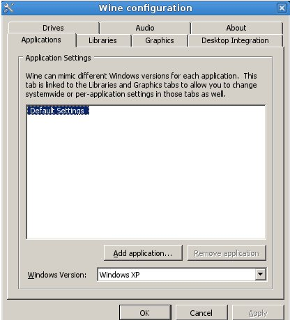

   : Wine Configuration Menu

Click :guilabel:`Add application` to browse to the application's
installer file. By default, the contents of the hard drive will be
listed under *drive_c*. If the installer is on a CD/DVD, use the
drop-down menu to browse to the
:menuselection:`home directory --> *.wine --> dosdevices` folder. The
contents of the CD/DVD should be listed under *d:*. If they are not,
the most likely reason is your CD/DVD was not automatically mounted by
the desktop. To mount the media, type
:command:`mount -t cd9660 /dev/cd0 /cdrom` as the superuser:

The media should spin and able to select the installer file. Once
selected, press :guilabel:`Apply` then :guilabel:`OK` to exit the
configuration utility.

To install the application, type :command:`winefile` to see the screen
shown in :numref:`Figure %s <wine2>`.

.. _wine2:

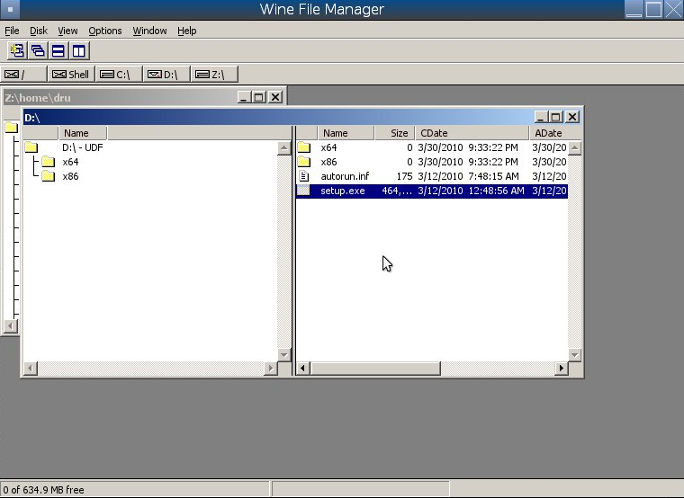

   : Installing the Application Using :command:`winefile`

Click the button representing the drive containing the installer and
double-click on the installation file (e.g. :file:`setup.exe`). The
installer will launch to allow installing the application as on a
Windows system.

.. note:: To manually mount the CD/DVD, you need to unmount it before
   it ejects. As the superuser, use the command :command:`umount /mnt`.

Once the installation is complete, browse to the application's location.
:numref:`Figure %s <wine3>` shows an example of running Internet
Explorer within :command:`winefile`.

.. _wine3:

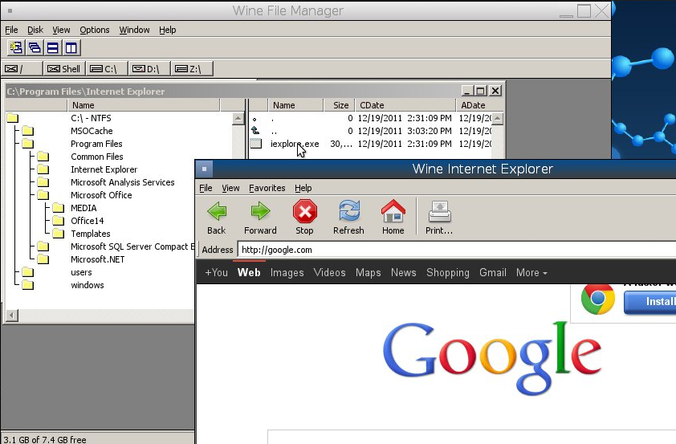

   : Running the Installed Application

.. index:: security
.. _Security:

Security
========

Your |trueos| system is secure by default. This section provides an
overview of the built-in security features and additional resources,
if you want to know more about increasing the security of your system
beyond its current level.

The security features built into |trueos| include:

* **Naturally immune to viruses and other malware:** Most viruses are
  written to exploit Windows systems and do not understand the binaries
  or paths found on a |trueos| system. Antivirus software is still
  available in the Security section of :ref:`AppCafe®` as this can be
  useful if sending or forwarding email attachments to users running
  other operating systems.

* **Potential for serious damage is limited:** File and directory
  ownership and permissions along with separate user and group
  functions mean, as an ordinary user, any program executed will only be
  granted the abilities and access of the user. A user not a member of
  the *wheel* group can not switch to administrative access and can not
  enter or list the contents of a directory not been set for universal
  access.

* **Built-in firewall:** The default firewall ruleset allows accessing
  the Internet and the shares available on your network, but does not
  allow any inbound connections to your computer.

* **Very few services are enabled by default:** View which services are
  started at boot time by reading through :file:`/etc/rc.conf.trueos`.

* **SSH is disabled by default:** SSH can only be enabled by the
  superuser. This setting prevents bots and other users from trying to
  access your system. If SSH is needed, add :command:`sshd_enable=YES`
  to :file:`/etc/rc.conf`. Start the service by typing
  :command:`service sshd start`. A firewall rule also needs to be added
  using :ref:`Firewall Manager` to allow SSH connections over TCP port
  22.

* **SSH root logins are disabled by default:** If SSH is enabled, login
  as a regular user and use :command:`su` or :command:`sudo` when
  administrative actions are required. You should not change this
  default as this prevents an unwanted user from having complete access
  to the system.

* **sudo is installed:** It is configured to allow users in the *wheel*
  group permission to run an administrative command after typing their
  password. By default, the first user created during installation
  is added to the *wheel* group. Use :ref:`User Manager` to add other
  users to this group. Change the default :command:`sudo` configuration
  using :command:`visudo` as the superuser.

* :wikipedia:`AES instruction set` (AESNI) support is loaded by
  default for the Intel Core i5/i7 processors that support this
  encryption set. This support speeds up AES encryption and decryption.

* **Automatic notification of security advisories:**
  :ref:`Update Manager` will automatically notify you if an update is
  available as the result of a
  `security advisory <http://www.freebsd.org/security/advisories.html>`_
  affecting |trueos|. This allows you to keep your operating system
  fully patched with just the click of a mouse.

* The |trueos| operating system and its available software packages are
  built with `LibreSSL <http://www.libressl.org/>`_, which has fewer
  vulnerabilities than OpenSSL.

* :ref:`PersonaCrypt` allows a user to use a removable, encrypted
  device as their home directory.
  
* :ref:`Tor Mode` can be used to anonymously access Internet sites as
  this mode automatically forwards all Internet traffic through the
  `Tor Project's <https://www.torproject.org/>`_ transparent proxy
  service.

To learn more about security on FreeBSD and |trueos| systems,
:command:`man security` is a good place to start. These resources
provide more information about security on FreeBSD-based operating
systems:

* `FreeBSD Security Information <http://www.freebsd.org/security/>`_

* `Security Section of FreeBSD Handbook <http://www.freebsd.org/doc/en_US.ISO8859-1/books/handbook/security.html>`_

* `Hardening FreeBSD <http://www.bsdguides.org/2005/hardening-freebsd/>`_

.. index:: printing
.. _Printing:

Printing and Scanning
=====================

Like many open source operating systems, |trueos| uses the Common Unix
Printing System (`CUPS <http://cups.org/>`_) to manage printing.

CUPS provides an easy-to-use utility for adding and managing printers.
Whether or not it automatically detects a printer depends upon how well
the printer is supported by an open source print driver. This section
will walk you through a sample configuration for a HP DeskJet 36xx
series printer. Your specific printer may "just work", which simplifies
this process immensely. If your printer configuration does not work,
read this section more closely for hints to locate the correct driver
for your printer.

.. index:: printing
.. _Researching Your Printer:

Researching your Printer
------------------------

Before configuring your printer, see if a print driver exists for your
particular model already, and if so, which driver is recommended. If you
are planning to purchase a printer, this is definitely good information
to know beforehand. Look up the vendor and model of the printer in the
`Open Printing Database <http://www.openprinting.org/printers>`_, which
indicates if the model is supported and if there are any known caveats
with the print driver. Once the model is selected, click
:guilabel:`Show this printer` to see the results.

For the HP DeskJet model example, the HPLIP driver is recommended. In
|trueos|, the HPLIP driver is available as an optional package called
"hplip". Use :ref:`AppCafe®` to search if the driver is installed, and
install it if not.

.. index:: printing
.. _Adding a Printer:

Adding a Printer
----------------

Once printer support is determined, be sure the printer is plugged into
your computer or, if the printer is a network printer, both your
computer and the printer are connected to the network. Then, open a web
browser and enter the address "127.0.0.1:631/admin". This will open the
CUPS configuration, shown in:numref:`Figure %s <print4>`.

.. _print4:

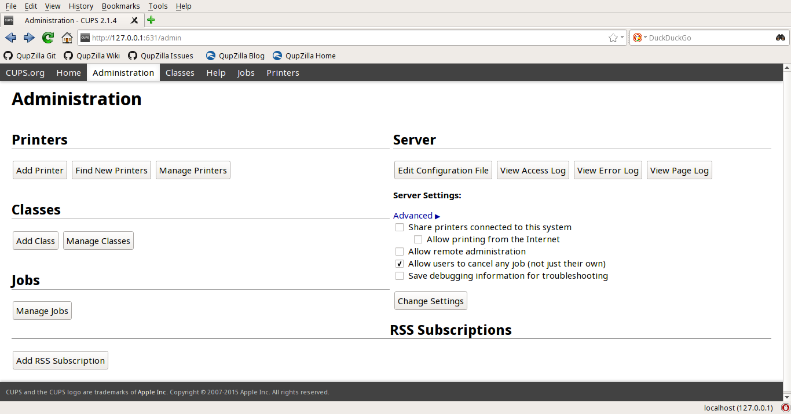

   : Printer Configuration

To add a new printer, click :guilabel:`Add Printer`. CUPS will pause
for a few seconds as it searches for available printers. When it is
finished it will display a screen similar to
:numref:`Figure %s <print5>`.

.. _print5:

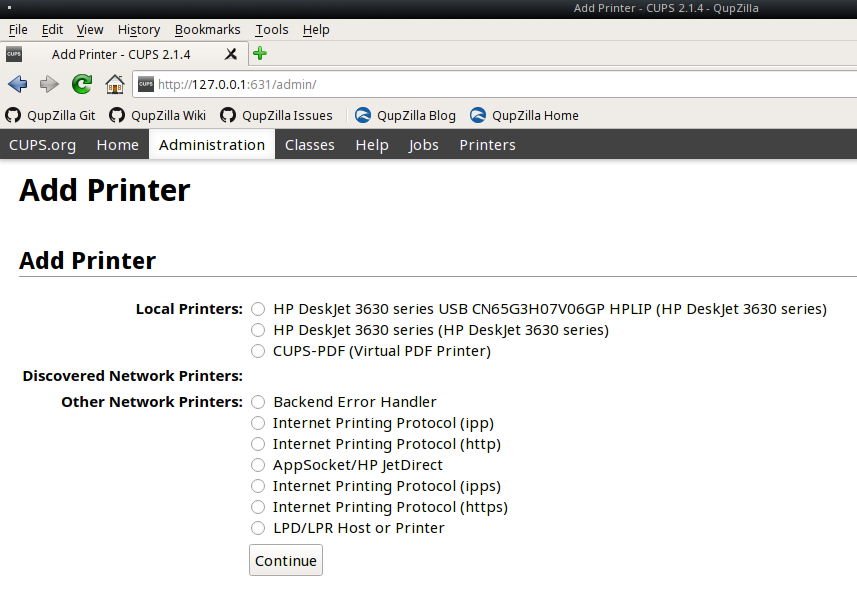

   : Print Device Selection

In this example, the wizard has found the HP DeskJet 3630 printer on
both the USB port (first entry) and the wireless network (second entry).
Click the desired connection method then click :guilabel:`Continue`.
CUPS will attempt to load the correct driver for the device. If it is
successful, it will display the screen shown in
:numref:`Figure %s <print6>`.

.. _print6:

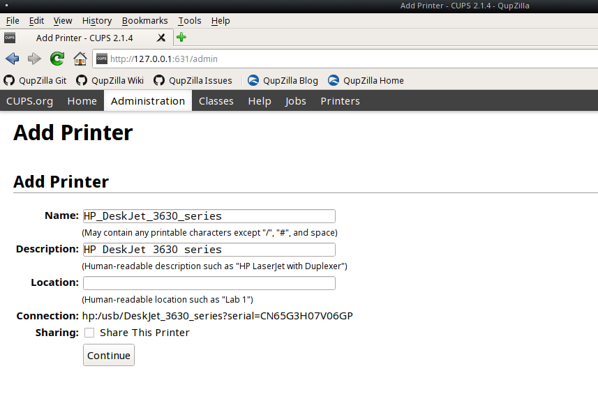

   : Describe Printer

This screen automatically fills out the printer model series, a
description, and the type of connection. If desired, add a descriptive
:guilabel:`Location`. If sharing the printer on a network, check
:guilabel:`Sharing`.

Once you click :guilabel:`Continue`, the next screen, shown in
:numref:`Figure %s <print7>`, will show a summary of the selected
options and offer the ability to select another driver. For now, leave
the detected driver and click :guilabel:`Add Printer`. If the printer
does not work using the default driver, read the section on
:ref:`Printer Troubleshooting`, which describes how to use this screen
in more detail.

.. _print7:

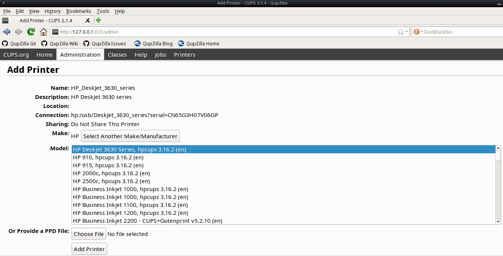

   : Viewing the Default Driver

The next screen, shown in :numref:`Figure %s <print8>`, can be used to
modify the properties of the printer.

.. _print8:

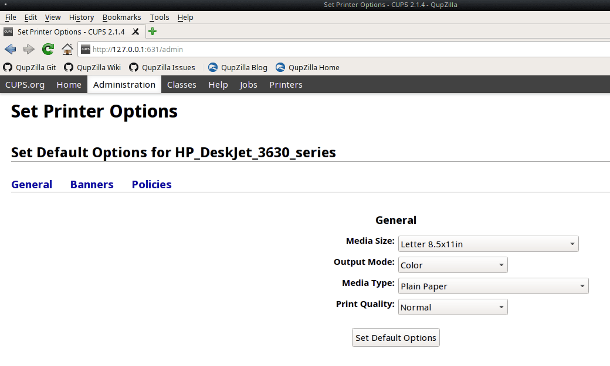

   : Modify Print Properties

It is recommended to take a few minutes to review the settings in the
:guilabel:`General`, :guilabel:`Banners`, and :guilabel:`Policies` tabs
, as these allow configuration options such as print banners,
permissions, the default paper size, and double-sided printing. The
available settings will vary, depending upon the capabilities of the
print driver. When finished, click :guilabel:`Set Default Options` to
save the options. This will open the :guilabel:`Printers` tab, with the
new printer displayed. An example is shown in
:numref:`Figure %s <print9>`.

.. _print9:

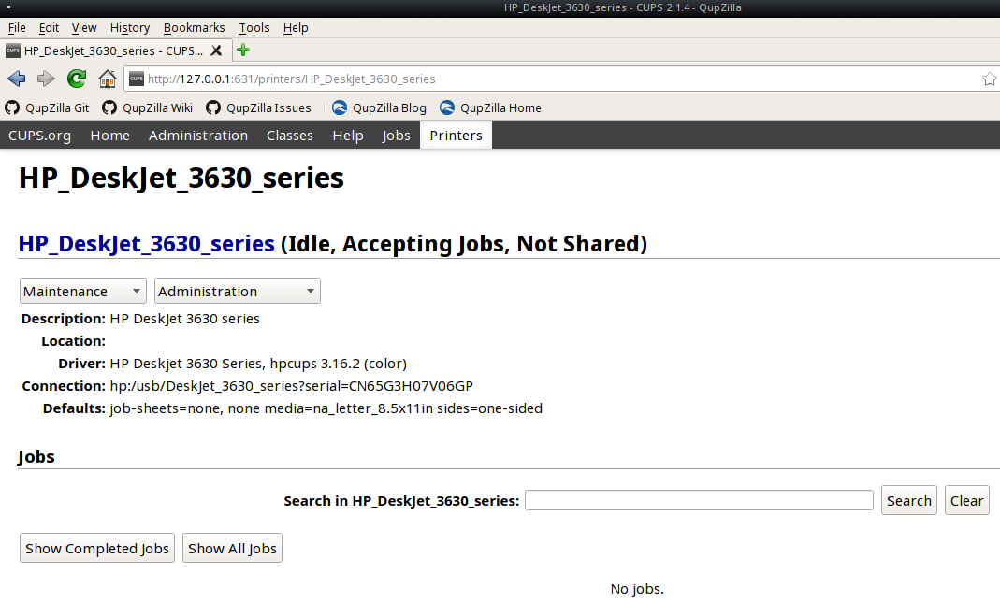

   : Manage Printer

Print a test page to ensure the printer is working. Ensure the printer
has paper and click :menuselection:`Maintenance -> Print Test Page`. If
a test page will not print, refer to :ref:`Printer Troubleshooting`.

.. index:: printing
.. _Manually Adding a Driver:

Manually Adding a Driver
------------------------

If the print configuration fails, double-check the printer is supported
as described in :ref:`Researching your Printer` and HPLIP is installed
if it is a HP printer. Also check the printer is plugged in and powered
on.

If the wizard is unable to even detect the device, try to manually add
the information for the print device. In the :guilabel:`Select Device`
screen (:ref:`print5`), select the type of connection to the printer
and input all necessary information. The type of information depends
upon the type of connection:

**USB:** This entry will only appear if a printer is plugged into a
USB port and the number of entries will vary depending upon the number
of USB ports on the system. If there are multiple USB entries, highlight
the one representing the USB port your printer is plugged into.

**IPP:** Select this option if connecting to a printer cabled to another
computer (typically running a Microsoft operating system) sharing the
printer using IPP. Input the IP address of the printer and the name of
the print queue. To use IPP over an encrypted connection, select "ipps"
instead.

**HTTP:** This option allows you to manually type in the URI to the
printer. A list of possible URIs is available on the
`cups site <http://www.cups.org/documentation.php/network.html>`_. To
use HTTP over an encrypted connection, select "https" instead.

**AppSocket/HP JetDirect:** Select this option if connecting to an HP
network printer. Input the IP address of the printer. Only change the
port number if the printer is using a port other than the default of
9100.

**LPD/LPR:** Select this option if connecting to a printer which is
cabled to a Unix computer using LPD to share the printer. Input the
hostname and queue name of the Unix system.

After inputting the connection information, continue to add the printer
and test the connection by printing a test page as described in
:ref:`Adding a Printer`.

If the default driver is not working, try re-adding the printer. At the
:ref:`print7` screen, try selecting a different driver.

Alternately, if you have a PPD driver from the manufacturer's website
or on the CD packed in with the printer, click :guilabel:`Choose File`
to browse to the location of the PPD file. PPD (PostScript Printer
Description) is a driver created by the manufacturer ending in a
:file:`.ppd` extension. Sometimes the file will end with a
:file:`.ppd.gz` extension, indicating it has been compressed.

.. index:: printing
.. _Printer Troubleshooting:

Printer Troubleshooting
-----------------------

Here are some solutions to common printing problems:

* **A test page prints but it is all garbled:** This typically means
  the system is using the wrong driver. If your specific model was not
  listed, click :menuselection:`Adminstration --> Modify Printer` for
  the printer in the :guilabel:`Printers` tab. In the screen shown in
  :ref:`print7`, try choosing another driver close to your model
  number. If trial and error does not fix the problem, see if there are
  any suggestions for your model in the
  `Open Printing database <http://www.openprinting.org/printers>`_. A
  web search for the word "freebsd" followed by the printer model name
  may also help you find the correct driver to use.

* **Nothing happens when you try to print:** In this case, type
  :command:`tail -f /var/log/cups/error_log` in a console and then try
  to print a test page. The error messages should appear in the console.
  If the solution is not obvious from the error messages, try a web
  search for the error message. If still stuck, post the error, the
  model of your printer, and your version of |trueos| as you
  :ref:`Report a Bug`.

.. index:: scanner
.. _Scanner:

Scanning
--------

|trueos| includes `XSane <http://www.xsane.org/>`_, a graphical utility
for managing scanners.

To use your scanner, make sure the device is plugged into the |trueos|
system and click :menuselection:`Browse Applications --> Scanner` or
type :command:`xsane` from the command line. A pop-up message will
indicate XSane is detecting devices and will prompt you to accept the
XSane license if a device is detected. If a device is not detected,
search for your device at the
`list of supported scanners <http://www.sane-project.org/sane-backends.html>`_.

.. note:: If the scanner is part of an HP All-in-One device, make sure
   the "hplip" package is installed. Use :ref:`AppCafe®` to see if the
   driver is installed, and install it if not.

:numref:`Figure %s <sane1>` shows the XSane interface running on a
|trueos| system attached to an HP DeskJet Printer/Scanner.

.. _sane1:

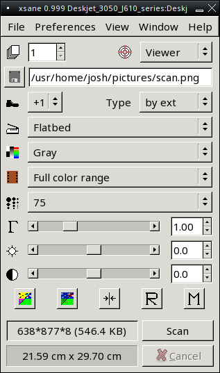

   : XSane Interface

The
`XSane documentation <http://www.xsane.org/doc/sane-xsane-doc.html>`_
contains details on how to perform common tasks such as saving an image
to a file, photocopying an image, and creating a fax. It also describes
all of the icons in the interface and how to use them.

By default, XSane uses the default browser when clicking :kbd:`F1` to
access its built-in documentation. Configuring the default browser
varies by window manager so an Internet search may be necessary to set
the default browser setting.